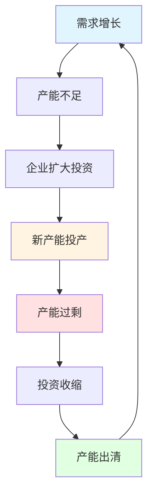

# 朱格拉周期：设备投资驱动的中期经济波动

## 概述

朱格拉周期（Juglar Cycle），又称中周期或设备投资周期，是由法国经济学家克莱门特·朱格拉（Clément Juglar）在1862年提出的经济周期理论。这是最经典的经济周期，平均长度为8-10年，主要由企业固定资产投资的周期性波动驱动。

**学习目标**：
1. 理解朱格拉周期的形成机制和理论基础
2. 掌握设备投资周期的演变规律
3. 学会识别产能周期的不同阶段
4. 了解资本开支对经济和市场的影响
5. 掌握基于朱格拉周期的中期投资策略

**为什么重要**：
- 朱格拉周期是最经典、最重要的经济周期
- 对中期投资决策具有决定性影响
- 是理解经济中期波动的核心框架
- 为战略资产配置提供重要依据

## 朱格拉周期的理论基础

### 发现与命名

1862年，法国医生兼经济学家克莱门特·朱格拉通过研究法国、英国和美国的经济数据，发现了一个平均长度为9-10年的中期经济周期。他在《论法国、英国和美国的商业危机及其周期》一书中系统阐述了这一发现。

**朱格拉的核心观点**：
- 经济危机不是偶然事件，而是周期性现象
- 周期平均长度为9-10年
- 周期由企业固定资产投资驱动
- 信贷扩张和收缩是周期的重要推手

### 设备投资周期的形成机制

朱格拉周期的核心驱动力是企业固定资产投资的周期性波动：

**关键特征**：
1. **投资决策的集中性**：企业投资决策往往同步
2. **建设周期的滞后性**：从投资到产能释放需要2-3年
3. **产能调整的刚性**：产能一旦形成难以快速调整
4. **盈利波动的放大性**：固定成本导致盈利大幅波动

**加速器原理**：
- 需求增长10% → 投资增长可能达到30-50%
- 需求下降10% → 投资可能暴跌50-70%
- 这种非线性关系放大了经济波动

## 朱格拉周期的四个阶段

### 阶段1：产能不足期（投资启动）

**特征**：
- 需求持续增长，产能利用率超过85%
- 企业盈利能力强，ROE和ROIC处于高位
- 融资环境良好，信贷扩张
- 企业开始规划新一轮资本开支

**投资策略**：重点配置设备制造、工程机械、建材等行业

### 阶段2：产能扩张期（投资高峰）

**特征**：
- 固定资产投资快速增长，增速达到15-20%
- 上游资源品需求旺盛，价格上涨
- 就业市场繁荣，工资上涨
- 通胀压力显现，政策开始收紧

**投资策略**：配置上游资源、工程服务、金融等行业

### 阶段3：产能过剩期（投资收缩）

**特征**：
- 新产能集中投产，供给大于需求
- 产品价格下跌，企业盈利恶化
- 投资增速快速回落，可能转负
- 失业率上升，经济下行压力加大

**投资策略**：转向防御，配置必需消费、医疗保健

### 阶段4：产能出清期（投资触底）

**特征**：
- 落后产能退出，行业集中度提升
- 龙头企业市场份额扩大
- 投资降至低位，为下一轮周期蓄力
- 政策转向宽松，为复苏创造条件

**投资策略**：逆向布局优质龙头，等待周期反转

## 历史朱格拉周期回顾

### 美国朱格拉周期（1945-2023）

**第一轮**（1945-1954）：战后重建
**第二轮**（1954-1961）：制造业扩张
**第三轮**（1961-1970）：大规模基建
**第四轮**（1970-1982）：滞胀与调整
**第五轮**（1982-1991）：里根经济学
**第六轮**（1991-2001）：信息技术革命
**第七轮**（2001-2009）：房地产泡沫
**第八轮**（2009-2020）：后危机复苏
**第九轮**（2020-?）：疫后重建与转型

### 中国朱格拉周期（1978-2023）

**第一轮**（1978-1989）：改革开放初期
**第二轮**（1989-1998）：市场经济转型
**第三轮**（1998-2008）：重化工业化
**第四轮**（2008-2016）：刺激与调整
**第五轮**（2016-?）：高质量发展转型

## 关键指标与判断方法

### 核心指标

1. **固定资产投资增速**：直接反映投资周期
2. **产能利用率**：判断产能松紧程度
3. **资本开支/折旧比**：衡量投资强度
4. **企业ROE和ROIC**：反映投资回报
5. **信贷增速**：金融支持力度

### 行业指标

- **工程机械销量**：挖掘机、起重机等
- **钢铁、水泥产量**：基建和制造业需求
- **发电量增速**：经济活动强度
- **货运量**：实体经济景气度

## 投资策略应用

### 产能不足期策略
- 重仓周期股和成长股
- 关注设备制造、新兴产业
- 预期收益：30-50%

### 产能扩张期策略
- 配置上游资源和金融
- 警惕估值过高风险
- 预期收益：20-30%

### 产能过剩期策略
- 转向防御性行业
- 降低仓位，增加现金
- 预期收益：0-10%

### 产能出清期策略
- 逆向投资优质龙头
- 等待政策转向信号
- 预期收益：长期高回报

## 延伸阅读

1. Juglar, C. (1862). *Des Crises commerciales et leur retour périodique*
2. Schumpeter, J. A. (1939). *Business Cycles*
3. 任泽平. (2017). "朱格拉周期与中国经济"
4. 姜超. (2018). "产能周期的前世今生"

## 参考文献

1. Juglar, C. (1862). *Des Crises commerciales et leur retour périodique en France, en Angleterre et aux États-Unis*. Guillaumin.

2. Schumpeter, J. A. (1939). *Business Cycles: A Theoretical, Historical, and Statistical Analysis of the Capitalist Process*. McGraw-Hill.

3. Korotayev, A. V., & Tsirel, S. V. (2010). "A Spectral Analysis of World GDP Dynamics". *Structure and Dynamics*, 4(1).

4. 刘元春, 闫衍. (2017). "中国产能周期波动特征研究". *经济研究*, 52(3), 67-82.

---

**下一步学习**：
- [库兹涅茨周期](./kuznets-cycle.html) - 了解长期建筑周期
- [康波周期](./kondratieff-wave.html) - 理解超长期技术周期
- [周期指标体系](./cycle-indicators.html) - 掌握周期判断工具
5. Burns, A. F., & Mitchell, W. C. (1946). *Measuring Business Cycles*. National Bureau of Economic Research.
6. Zarnowitz, V. (1992). *Business Cycles: Theory, History, Indicators, and Forecasting*. University of Chicago Press.
7. Diebold, F. X., & Rudebusch, G. D. (1999). *Business Cycles: Durations, Dynamics, and Forecasting*. Princeton University Press.
8. Stock, J. H., & Watson, M. W. (1999). "Business Cycle Fluctuations in US Macroeconomic Time Series." *Handbook of Macroeconomics*, 1, 3-64.

## 深度分析

### 核心机制解析

理解本主题需要从多个维度进行系统性分析。以下从理论基础、实践应用和历史验证三个层面展开深度探讨。

**理论基础层面**：本主题的核心逻辑建立在经济学和金融学的基本原理之上。通过对基础理论的深入理解，投资者能够建立起稳固的分析框架，避免被市场短期噪音所干扰。

**实践应用层面**：理论必须与实践相结合才能产生价值。在实际投资决策中，需要将抽象的概念转化为具体的分析工具和决策标准。

**历史验证层面**：金融市场有着丰富的历史记录，通过研究历史案例，我们可以验证理论的有效性，并从中提炼出具有普遍意义的规律。

### 关键影响因素

影响本主题的关键因素可以从以下几个维度进行分析：

1. **宏观经济环境**：利率水平、通货膨胀率、经济增长速度等宏观变量对本主题有着深远影响。在不同的宏观经济周期中，相关指标的表现会呈现出显著差异。

2. **市场结构因素**：市场参与者的构成、信息传播机制、流动性状况等市场结构因素决定了价格发现的效率和准确性。

3. **政策监管环境**：政府政策、监管框架的变化会直接影响相关市场的运作规则和参与者行为。

4. **技术创新驱动**：技术进步不断改变着金融市场的运作方式，从算法交易到区块链技术，每一次技术革新都带来新的机遇和挑战。

5. **全球化与地缘政治**：在全球化背景下，各国市场之间的联动性日益增强，地缘政治风险的影响也越来越不可忽视。

### 量化分析框架

为了更精确地分析和评估，可以采用以下量化框架：

| 分析维度 | 关键指标 | 参考基准 | 分析方法 |
|---------|---------|---------|---------|
| 规模评估 | 绝对值与相对值 | 历史均值 | 趋势分析 |
| 质量评估 | 稳定性指标 | 行业对标 | 横向比较 |
| 风险评估 | 波动率指标 | 风险阈值 | 情景分析 |
| 价值评估 | 估值倍数 | 历史区间 | 回归分析 |

通过系统性地应用上述框架，投资者可以对目标进行全面、客观的评估，从而做出更加理性的投资决策。

## 高级分析与前沿研究

### 学术研究进展

近年来，学术界对本领域的研究取得了重要进展。以下是几个值得关注的研究方向：

**行为金融学视角**：传统金融理论假设市场参与者是完全理性的，但行为金融学的研究表明，认知偏差和情绪因素在投资决策中扮演着重要角色。诺贝尔经济学奖得主丹尼尔·卡尼曼（Daniel Kahneman）和理查德·塞勒（Richard Thaler）的研究为我们理解市场非理性行为提供了重要框架。

**因子投资研究**：尤金·法玛（Eugene Fama）和肯尼斯·弗伦奇（Kenneth French）的三因子模型，以及后续发展的五因子模型，为系统性地解释股票收益差异提供了理论基础。这些研究表明，市值、账面市值比、盈利能力和投资模式等因子能够解释大部分股票收益的横截面差异。

**市场微观结构研究**：对市场流动性、价格发现机制和交易成本的深入研究，帮助我们更好地理解市场的运作机制，并为优化交易策略提供指导。

### 实战案例深度解析

**案例一：长期价值创造的典范**

以沃伦·巴菲特（Warren Buffett）的伯克希尔·哈撒韦（Berkshire Hathaway）为例，其长达数十年的卓越投资业绩证明了价值投资理念的有效性。从1965年至今，伯克希尔的账面价值年均增长率约为19.8%，远超同期标普500指数的约10.2%年均回报。

巴菲特的成功秘诀在于：
- 专注于具有持久竞争优势的优质企业
- 以合理价格买入，而非追求最低价格
- 长期持有，让复利效应充分发挥
- 保持充足的安全边际，控制下行风险

**案例二：危机中的机遇识别**

2008年金融危机期间，大多数投资者恐慌性抛售，但少数具有前瞻性的投资者却在危机中发现了历史性的投资机会。约翰·保尔森（John Paulson）通过做空次级抵押贷款相关证券，在危机中获得了约150亿美元的利润，成为金融史上最成功的单笔交易之一。

这个案例告诉我们：
- 深入的基本面研究能够发现市场定价错误
- 逆向思维往往能够发现被市场忽视的机会
- 风险管理和仓位控制是成功的关键

### 跨市场比较分析

不同市场在结构、监管、投资者构成等方面存在显著差异，这些差异对投资策略的选择有重要影响：

**美国市场特征**：
- 机构投资者主导，市场效率较高
- 信息披露制度完善，分析师覆盖广泛
- 衍生品市场发达，对冲工具丰富
- 长期牛市历史，但也经历过多次重大调整

**中国市场特征**：
- 散户投资者比例较高，市场波动性较大
- 政策因素影响显著，需要密切关注监管动向
- 新兴行业发展迅速，成长投资机会丰富
- A股、港股、美股中概股形成多层次市场体系

**欧洲市场特征**：
- 价值股比例较高，估值相对保守
- 受地缘政治和欧元区政策影响较大
- 部分行业（如奢侈品、工业）具有全球竞争优势
- ESG投资理念推广较为领先

