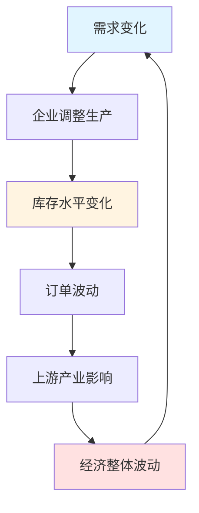
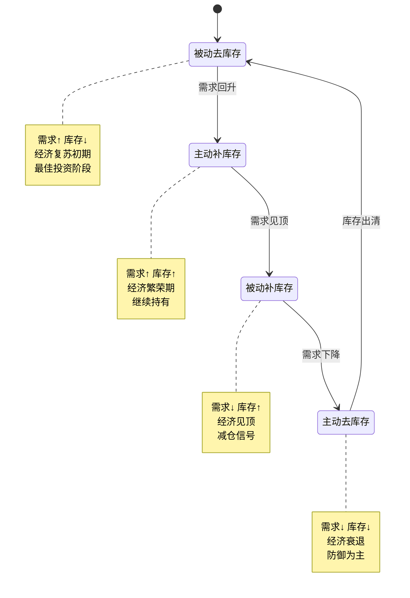

# 基钦周期：库存调整驱动的短期经济波动

## 概述

基钦周期（Kitchin Cycle），又称库存周期或短周期，是由英国经济学家约瑟夫·基钦（Joseph Kitchin）在1923年提出的经济周期理论。这是最短的经济周期，平均长度为3-4年，主要由企业库存调整驱动。

**学习目标**：
1. 理解基钦周期的形成机制和理论基础
2. 掌握库存周期的四个阶段特征
3. 学会使用PMI等指标判断库存周期位置
4. 了解库存周期对不同行业的影响
5. 掌握基于库存周期的短期投资策略

**为什么重要**：
- 库存周期是最常见、最频繁的经济波动
- 对短期投资决策影响显著
- 是理解经济短期波动的关键
- 为中期投资提供战术调整依据


## 基钦周期的理论基础

### 发现与命名

1923年，英国经济学家约瑟夫·基钦通过研究美国和英国1890-1922年的利率、物价、生产和就业等统计数据，发现了一个平均长度为40个月（约3.3年）的短期经济周期。这个周期后来被命名为"基钦周期"。

**基钦的核心发现**：
- 经济活动存在规律性的短期波动
- 波动周期平均为40个月
- 波动与企业库存变化高度相关
- 这种周期独立于更长的经济周期

### 库存周期的形成机制

库存周期的核心驱动力是企业库存管理行为：



**放大机制**：
1. **需求波动**：终端需求的小幅变化
2. **库存调整**：企业根据需求预期调整库存
3. **订单放大**：库存调整导致订单大幅波动
4. **产业传导**：波动沿产业链向上游传递
5. **周期形成**：多个企业的同步行为形成周期

**牛鞭效应（Bullwhip Effect）**：
- 终端需求波动10%
- 零售商订单波动20%
- 批发商订单波动40%
- 制造商订单波动80%
- 原材料需求波动160%

这种逐级放大效应是库存周期形成的关键机制。


## 库存周期的四个阶段

库存周期可以分为四个明确的阶段，每个阶段都有独特的经济特征和投资含义。



### 阶段1：被动去库存（最佳投资阶段）

**特征**：
- **需求**：开始回升，超出预期
- **库存**：持续下降，库存/销售比降低
- **生产**：开始增加，但滞后于需求
- **价格**：企稳回升
- **企业行为**：被动消耗库存，准备增产

**经济指标**：
- PMI从50以下回升至50以上
- 工业增加值增速回升
- 库存指数持续下降
- 新订单指数快速上升

**投资策略**：
- **最佳买入时机**：周期股、成长股
- **行业选择**：制造业、可选消费、科技
- **风险水平**：中等，经济复苏确认
- **预期收益**：高，估值修复+盈利改善

**历史案例**：
- 2009年Q2-Q3：金融危机后的复苏
- 2016年Q2-Q3：供给侧改革后的复苏
- 2020年Q2-Q3：疫情后的V型反弹


### 阶段2：主动补库存（继续持有阶段）

**特征**：
- **需求**：持续旺盛，增速稳定
- **库存**：主动增加，为旺季备货
- **生产**：快速扩张，产能利用率提升
- **价格**：持续上涨，通胀压力显现
- **企业行为**：积极补充库存，扩大生产

**经济指标**：
- PMI持续在50以上，可能达到55+
- 工业增加值高增长
- 库存指数和新订单指数同步上升
- PPI快速上涨

**投资策略**：
- **操作建议**：继续持有，适度获利了结
- **行业选择**：上游资源、中游制造
- **风险水平**：中高，警惕过热
- **预期收益**：中等，盈利高峰但估值提升有限

**风险信号**：
- 库存增速超过需求增速
- 价格涨幅过大
- 政策收紧预期
- 库存/销售比开始上升

**历史案例**：
- 2010年Q1-Q3：刺激政策效果显现
- 2017年Q1-Q3：供给侧改革红利
- 2021年Q1-Q2：疫情后需求爆发

### 阶段3：被动补库存（减仓信号阶段）

**特征**：
- **需求**：见顶回落，低于预期
- **库存**：被动积压，库存/销售比上升
- **生产**：开始下调，但仍高于需求
- **价格**：涨幅收窄或开始下跌
- **企业行为**：被动积压库存，准备减产

**经济指标**：
- PMI从高位回落，接近50
- 工业增加值增速放缓
- 库存指数高位，新订单指数下降
- 产成品库存快速上升

**投资策略**：
- **操作建议**：逐步减仓，转向防御
- **行业选择**：必需消费、医疗保健、公用事业
- **风险水平**：高，经济见顶
- **预期收益**：低或负，盈利下滑+估值压缩

**关键指标**：
- 库存/销售比持续上升
- PMI新订单-库存指数转负
- 价格指数快速回落
- 企业盈利预警增加

**历史案例**：
- 2011年Q2-Q4：政策收紧后的调整
- 2018年Q2-Q4：去杠杆压力显现
- 2021年Q3-Q4：需求回落库存积压


### 阶段4：主动去库存（防御为主阶段）

**特征**：
- **需求**：持续疲软，底部徘徊
- **库存**：主动削减，清理积压
- **生产**：大幅收缩，低于需求
- **价格**：持续下跌，通缩压力
- **企业行为**：主动去库存，控制成本

**经济指标**：
- PMI跌破50，可能低至45以下
- 工业增加值负增长或低增长
- 库存指数和新订单指数同步下降
- PPI负增长

**投资策略**：
- **操作建议**：防御为主，等待转机
- **行业选择**：现金、国债、黄金、优质龙头
- **风险水平**：高，但孕育机会
- **预期收益**：短期负，长期机会

**转机信号**：
- 库存降至历史低位
- 库存/销售比回归正常
- PMI新订单指数企稳
- 政策转向宽松

**历史案例**：
- 2008年Q4-2009年Q1：金融危机冲击
- 2015年Q3-Q4：经济下行压力
- 2022年Q2-Q4：疫情反复+地产下行

## 库存周期的关键指标

### 1. PMI指标体系

**制造业PMI**：
- **50以上**：经济扩张
- **50以下**：经济收缩
- **趋势变化**：比绝对水平更重要

**PMI分项指标**：
```
新订单指数 - 代表需求
产成品库存指数 - 代表库存
生产指数 - 代表供给
```

**关键组合**：
- **新订单 > 库存**：被动去库存（最佳）
- **新订单 > 50, 库存 > 50**：主动补库存（良好）
- **新订单 < 库存**：被动补库存（警惕）
- **新订单 < 50, 库存 < 50**：主动去库存（防御）

### 2. 工业企业库存数据

**产成品库存**：
- 绝对水平：同比增速
- 相对水平：库存/销售比
- 结构分析：上中下游分布

**原材料库存**：
- 反映企业对未来的预期
- 领先于产成品库存
- 与PPI高度相关

### 3. 库存/销售比

**计算公式**：
```
库存/销售比 = 期末库存 / 当期销售额
```

**正常区间**：
- 制造业：1.2-1.5个月
- 零售业：1.5-2.0个月
- 批发业：1.0-1.3个月

**异常信号**：
- 比值持续上升：需求疲软，库存积压
- 比值持续下降：需求旺盛，供不应求


## 不同行业的库存周期特征

### 上游行业（资源、能源）

**周期特点**：
- 库存周期最明显
- 价格波动最剧烈
- 对周期最敏感

**代表行业**：
- 钢铁、煤炭、有色金属
- 石油、化工
- 水泥、玻璃

**投资策略**：
- 被动去库存：重点配置
- 主动补库存：继续持有
- 被动补库存：及时减仓
- 主动去库存：回避

### 中游行业（制造业）

**周期特点**：
- 库存周期较明显
- 受上下游双重影响
- 盈利波动较大

**代表行业**：
- 机械设备、汽车
- 家电、电子
- 建材、轻工

**投资策略**：
- 关注订单和库存的匹配度
- 重视产能利用率
- 注意成本传导能力

### 下游行业（消费、服务）

**周期特点**：
- 库存周期相对平缓
- 需求相对稳定
- 防御性较强

**代表行业**：
- 食品饮料、医药
- 零售、餐饮
- 纺织服装

**投资策略**：
- 周期波动中的稳定器
- 衰退期的避风港
- 关注消费升级趋势

## 历史库存周期回顾

### 中国库存周期（2000-2023）

**第一轮**（2000-2002）：
- 触发因素：加入WTO，出口爆发
- 持续时间：约3年
- 特点：外需驱动，制造业扩张

**第二轮**（2002-2006）：
- 触发因素：房地产市场化，投资高增长
- 持续时间：约4年
- 特点：内需驱动，重化工业化

**第三轮**（2006-2009）：
- 触发因素：全球金融危机
- 持续时间：约3年
- 特点：外部冲击，政策对冲

**第四轮**（2009-2012）：
- 触发因素：4万亿刺激
- 持续时间：约3年
- 特点：政策驱动，产能过剩

**第五轮**（2012-2016）：
- 触发因素：经济增速换挡
- 持续时间：约4年
- 特点：去产能，结构调整

**第六轮**（2016-2019）：
- 触发因素：供给侧改革
- 持续时间：约3年
- 特点：供给收缩，价格上涨

**第七轮**（2019-2023）：
- 触发因素：疫情冲击
- 持续时间：约4年
- 特点：需求波动，政策频繁调整

**规律总结**：
- 平均周期长度：3-4年
- 外部冲击会缩短或延长周期
- 政策干预影响周期幅度
- 结构转型改变周期特征


## 实战投资策略

### 策略1：周期轮动策略

**核心逻辑**：
根据库存周期阶段，轮动配置不同行业和资产

**具体操作**：

| 周期阶段 | 首选行业 | 次选行业 | 回避行业 | 仓位建议 |
|---------|---------|---------|---------|---------|
| 被动去库存 | 周期股、成长股 | 金融、地产 | 防御股 | 80-90% |
| 主动补库存 | 资源股、制造业 | 周期股 | 债券 | 70-80% |
| 被动补库存 | 防御股、消费 | 医药、公用 | 周期股 | 40-50% |
| 主动去库存 | 现金、国债 | 黄金、龙头股 | 周期股 | 20-30% |

### 策略2：PMI交易策略

**买入信号**：
- PMI从50以下回升至50以上
- 新订单指数连续3个月上升
- 库存指数持续下降
- 新订单-库存差值转正

**卖出信号**：
- PMI从50以上回落至50以下
- 新订单指数连续3个月下降
- 库存指数持续上升
- 新订单-库存差值转负

**实战案例**：
- 2016年3月：PMI回升至50.2，买入周期股
- 2016年12月：PMI达到51.4，继续持有
- 2018年6月：PMI回落至51.5，开始减仓
- 2018年12月：PMI跌至49.4，清仓周期股

### 策略3：库存/销售比策略

**监控指标**：
- 工业企业产成品库存同比
- 工业企业销售收入同比
- 库存/销售比的变化趋势

**交易规则**：
- 库存/销售比降至历史20%分位以下：买入
- 库存/销售比升至历史80%分位以上：卖出
- 库存/销售比处于中位数：持有或观望

### 策略4：行业轮动策略

**阶段1：被动去库存**
- 重点配置：钢铁、煤炭、有色、化工
- 逻辑：需求回升，价格上涨，盈利改善
- 预期收益：30-50%

**阶段2：主动补库存**
- 重点配置：机械、建材、汽车、家电
- 逻辑：生产扩张，订单饱满，产能利用率提升
- 预期收益：20-30%

**阶段3：被动补库存**
- 重点配置：食品饮料、医药、公用事业
- 逻辑：防御性强，需求稳定，现金流好
- 预期收益：0-10%

**阶段4：主动去库存**
- 重点配置：现金、国债、黄金
- 逻辑：规避风险，保持流动性
- 预期收益：0-5%


## 常见误区与注意事项

### 误区1：机械套用周期长度

**错误做法**：
- 简单按照3-4年预测周期
- 忽视外部冲击的影响
- 不考虑政策干预

**正确做法**：
- 关注库存和需求的实际变化
- 结合PMI等高频指标
- 考虑政策和外部环境

### 误区2：忽视行业差异

**错误做法**：
- 所有行业一刀切
- 不区分上中下游
- 忽视行业特性

**正确做法**：
- 区分行业周期特征
- 关注产业链传导
- 考虑行业竞争格局

### 误区3：过度频繁交易

**错误做法**：
- 每月根据PMI调整
- 追涨杀跌
- 忽视交易成本

**正确做法**：
- 关注趋势而非短期波动
- 在周期转换点调整
- 控制交易频率

### 误区4：忽视其他周期

**错误做法**：
- 只看库存周期
- 忽视中长期周期
- 孤立分析

**正确做法**：
- 结合朱格拉周期
- 考虑长期趋势
- 多周期叠加分析

## 延伸阅读

### 经典文献

1. **"Cycles and Trends in Economic Factors"** - Joseph Kitchin (1923)
   - 基钦周期的原始论文
   - 统计数据和实证分析

2. **《库存周期与宏观经济波动》** - 中国社科院
   - 中国库存周期研究
   - 政策影响分析

3. **"Inventory Investment and the Business Cycle"** - Blinder & Maccini (1991)
   - 现代库存理论
   - 微观基础分析

### 实战指南

4. **《周期的力量》** - 霍华德·马克斯
   - 投资大师的周期智慧
   - 实战经验分享

5. **《宏观对冲》** - 阿伯丁
   - 基于周期的交易策略
   - 风险管理方法

## 参考文献

1. Kitchin, J. (1923). "Cycles and Trends in Economic Factors". *Review of Economics and Statistics*, 5(1), 10-16.

2. Blinder, A. S., & Maccini, L. J. (1991). "Taking Stock: A Critical Assessment of Recent Research on Inventories". *Journal of Economic Perspectives*, 5(1), 73-96.

3. Ramey, V. A., & West, K. D. (1999). "Inventories". *Handbook of Macroeconomics*, 1, 863-923.

4. Wen, Y. (2005). "Understanding the Inventory Cycle". *Journal of Monetary Economics*, 52(8), 1533-1555.

5. Bils, M., & Kahn, J. A. (2000). "What Inventory Behavior Tells Us about Business Cycles". *American Economic Review*, 90(3), 458-481.

6. 刘元春, 闫衍. (2016). "中国库存周期波动特征及其宏观经济效应". *经济研究*, 51(6), 4-19.

7. 任泽平. (2017). "库存周期：理论、实证与展望". *宏观经济研究*.

8. 姜超. (2018). "库存周期的前世今生". *海通证券研究报告*.

---

**下一步学习**：
- [朱格拉周期](./juglar-cycle.html) - 了解中期设备投资周期
- [周期指标体系](./cycle-indicators.html) - 掌握更多周期判断工具
- [美林时钟详解](./merrill-lynch-clock.html) - 学习资产配置策略
- [经济周期总览](./cycle-overview.html) - 回顾周期理论框架
