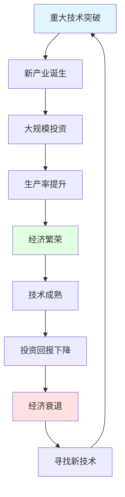

# 康波周期：技术创新驱动的超长期经济波动

## 概述

康德拉季耶夫周期（Kondratieff Wave），简称康波周期或K波，是由苏联经济学家尼古拉·康德拉季耶夫（Nikolai Kondratieff）在1925年提出的超长期经济周期理论。这是最长的经济周期，平均长度为50-60年，主要由重大技术革命和产业变革驱动。

**学习目标**：
1. 理解康波周期的形成机制和理论基础
2. 掌握历史上五次康波周期的特征
3. 识别当前所处的康波周期位置
4. 了解技术革命对经济和投资的影响
5. 掌握基于康波周期的超长期投资策略

**为什么重要**：
- 揭示经济发展的超长期规律
- 识别时代性投资机会
- 理解产业变革趋势
- 指导超长期资产配置


## 康波周期的理论基础

### 发现与命名

1925年，苏联经济学家尼古拉·康德拉季耶夫通过研究英、法、美、德等国1780-1920年的价格、利率、工资、贸易额等数据，发现了一个平均长度为50-60年的超长期经济波动。他在《经济生活中的长波》一书中系统阐述了这一发现。

**康德拉季耶夫的核心观点**：
- 资本主义经济存在50-60年的长期波动
- 波动由重大技术创新驱动
- 每个长波包含上升期和下降期
- 长波影响所有经济变量

**历史意义**：
- 首次提出超长期经济周期理论
- 为理解经济长期发展提供框架
- 影响后世经济学家（熊彼特等）

### 康波周期的形成机制



**核心驱动力**：
1. **技术创新**：革命性技术突破
2. **资本积累**：大规模长期投资
3. **基础设施**：配套设施建设
4. **制度变革**：适应新技术的制度创新

**熊彼特的贡献**：
- 强调"创造性破坏"
- 企业家精神的作用
- 创新集群现象
- 技术扩散过程

## 历史上的五次康波周期

### 第一次康波（1780s-1840s）：蒸汽机时代

**核心技术**：
- 蒸汽机（瓦特改良）
- 纺织机械
- 炼铁技术

**产业变革**：
- 纺织工业机械化
- 煤炭开采扩大
- 工厂制度建立

**基础设施**：
- 运河建设
- 早期铁路

**经济影响**：
- 英国成为"世界工厂"
- 第一次工业革命
- 城市化开始

**投资机会**：
- 纺织企业
- 煤矿
- 运河公司

### 第二次康波（1840s-1890s）：铁路时代

**核心技术**：
- 铁路技术
- 钢铁冶炼（贝塞麦转炉）
- 电报通信

**产业变革**：
- 铁路网络建设
- 钢铁工业崛起
- 重工业发展

**基础设施**：
- 跨国铁路网
- 港口码头
- 电报线路

**经济影响**：
- 全国统一市场形成
- 西部大开发（美国）
- 全球贸易扩张

**投资机会**：
- 铁路公司
- 钢铁企业
- 机车制造

### 第三次康波（1890s-1940s）：电气化时代

**核心技术**：
- 电力技术
- 内燃机
- 化学工业

**产业变革**：
- 电力工业建立
- 汽车工业兴起
- 石油化工发展

**基础设施**：
- 电网建设
- 公路系统
- 炼油设施

**经济影响**：
- 第二次工业革命
- 大规模生产（福特模式）
- 城市电气化

**投资机会**：
- 电力公司
- 汽车制造
- 石油公司

**重大事件**：
- 1929年大萧条（周期下行）
- 二战（周期转换）


### 第四次康波（1940s-1990s）：信息技术时代

**核心技术**：
- 计算机
- 半导体
- 航空航天

**产业变革**：
- 电子工业崛起
- 航空工业发展
- 核能利用

**基础设施**：
- 高速公路网
- 机场建设
- 通信网络

**经济影响**：
- 战后经济繁荣
- 跨国公司兴起
- 全球化加速

**投资机会**：
- IBM、Intel等科技巨头
- 波音等航空企业
- 石油化工巨头

**重大事件**：
- 1970s石油危机（周期中期调整）
- 1980s里根经济学（周期复苏）
- 1990s互联网泡沫（周期末期）

### 第五次康波（1990s-2040s?）：互联网与新能源时代

**核心技术**：
- 互联网
- 移动通信
- 新能源（太阳能、风能）
- 生物技术

**产业变革**：
- 互联网经济
- 移动互联网
- 清洁能源
- 生命科学

**基础设施**：
- 光纤网络
- 5G基站
- 充电桩网络
- 数据中心

**经济影响**：
- 数字经济崛起
- 平台经济
- 共享经济
- 能源转型

**投资机会**：
- FAANG等科技巨头
- 特斯拉等新能源车
- 阿里、腾讯等互联网平台
- 生物医药创新企业

**当前阶段**（2020s）：
- 可能处于第五次康波的成熟期
- 正在孕育第六次康波（AI、量子计算？）

### 第六次康波（2020s-2080s?）：人工智能时代？

**可能的核心技术**：
- 人工智能
- 量子计算
- 基因编辑
- 新材料（石墨烯等）
- 核聚变能源

**潜在产业变革**：
- AI驱动的自动化
- 个性化医疗
- 智能制造
- 太空经济

**投资展望**：
- 仍处于早期阶段
- 技术路径不确定
- 需要长期观察

## 康波周期的四个阶段

### 1. 繁荣期（Spring）：15-20年

**特征**：
- 新技术大规模应用
- 生产率快速提升
- 经济高速增长
- 就业充分，工资上涨

**投资策略**：
- 重仓新兴产业
- 配置成长股
- 长期持有

### 2. 衰退期（Summer）：10-15年

**特征**：
- 技术扩散放缓
- 投资回报下降
- 经济增速放缓
- 通胀压力上升

**投资策略**：
- 降低风险敞口
- 转向价值股
- 增加防御性资产

### 3. 萧条期（Autumn）：10-15年

**特征**：
- 旧产业衰落
- 经济结构调整
- 失业率上升
- 通缩压力

**投资策略**：
- 保守为主
- 持有现金和债券
- 寻找新技术机会

### 4. 复苏期（Winter）：10-15年

**特征**：
- 新技术孕育
- 创新企业涌现
- 经济触底反弹
- 为下一轮繁荣蓄力

**投资策略**：
- 逆向投资
- 布局新技术
- 长期视角

## 康波周期与投资策略

### 识别康波位置

**关键指标**：
1. **技术成熟度**：主导技术的发展阶段
2. **投资回报率**：新产业的ROI趋势
3. **生产率增长**：全要素生产率变化
4. **创新活跃度**：专利、创业公司数量

**当前判断**（2024）：
- 第五次康波可能进入成熟期
- 互联网技术已充分扩散
- AI可能是第六次康波的起点
- 处于周期转换的关键时期

### 超长期投资策略

**繁荣期策略**：
- 重仓新兴产业龙头
- 长期持有不动摇
- 预期年化收益：15-20%

**衰退期策略**：
- 逐步降低仓位
- 转向成熟行业
- 预期年化收益：5-10%

**萧条期策略**：
- 保守配置为主
- 寻找新技术种子
- 预期年化收益：0-5%

**复苏期策略**：
- 逆向布局新技术
- 分散投资降低风险
- 预期年化收益：10-15%

### 行业配置建议

**第五次康波成熟期**（当前）：
- 减配：传统互联网、传统制造
- 持有：新能源、生物医药
- 增配：人工智能、量子计算

**第六次康波早期**（未来10年）：
- 重点关注：AI应用、自动驾驶、基因治疗
- 长期布局：量子计算、核聚变、太空经济
- 保持灵活：技术路径仍不确定

## 延伸阅读

1. Kondratieff, N. D. (1935). "The Long Waves in Economic Life"
2. Schumpeter, J. A. (1939). *Business Cycles*
3. 周金涛. (2016). "康波周期理论与大类资产配置"
4. 任泽平. (2018). "第五次康波与中国经济"

## 参考文献

1. Kondratieff, N. D. (1935). "The Long Waves in Economic Life". *Review of Economics and Statistics*, 17(6), 105-115.

2. Schumpeter, J. A. (1939). *Business Cycles: A Theoretical, Historical, and Statistical Analysis of the Capitalist Process*. McGraw-Hill.

3. Freeman, C., & Louçã, F. (2001). *As Time Goes By: From the Industrial Revolutions to the Information Revolution*. Oxford University Press.

4. Perez, C. (2002). *Technological Revolutions and Financial Capital*. Edward Elgar.

5. 周金涛. (2016). "涛动周期论". 机械工业出版社.

---

**下一步学习**：
- [经济周期总览](./cycle-overview.html) - 回顾多重周期理论
- [技术创新与投资](../../05-global-perspective/industry-analysis/technology/ai-industry.html)
- 长期资产配置
6. Burns, A. F., & Mitchell, W. C. (1946). *Measuring Business Cycles*. National Bureau of Economic Research.
7. Zarnowitz, V. (1992). *Business Cycles: Theory, History, Indicators, and Forecasting*. University of Chicago Press.
8. Diebold, F. X., & Rudebusch, G. D. (1999). *Business Cycles: Durations, Dynamics, and Forecasting*. Princeton University Press.
9. Stock, J. H., & Watson, M. W. (1999). "Business Cycle Fluctuations in US Macroeconomic Time Series." *Handbook of Macroeconomics*, 1, 3-64.
10. Hamilton, J. D. (1989). "A New Approach to the Economic Analysis of Nonstationary Time Series and the Business Cycle." *Econometrica*, 57(2), 357-384.


## 深度分析

### 核心机制解析

理解本主题需要从多个维度进行系统性分析。以下从理论基础、实践应用和历史验证三个层面展开深度探讨。

**理论基础层面**：本主题的核心逻辑建立在经济学和金融学的基本原理之上。通过对基础理论的深入理解，投资者能够建立起稳固的分析框架，避免被市场短期噪音所干扰。

**实践应用层面**：理论必须与实践相结合才能产生价值。在实际投资决策中，需要将抽象的概念转化为具体的分析工具和决策标准。

**历史验证层面**：金融市场有着丰富的历史记录，通过研究历史案例，我们可以验证理论的有效性，并从中提炼出具有普遍意义的规律。

### 关键影响因素

影响本主题的关键因素可以从以下几个维度进行分析：

1. **宏观经济环境**：利率水平、通货膨胀率、经济增长速度等宏观变量对本主题有着深远影响。在不同的宏观经济周期中，相关指标的表现会呈现出显著差异。

2. **市场结构因素**：市场参与者的构成、信息传播机制、流动性状况等市场结构因素决定了价格发现的效率和准确性。

3. **政策监管环境**：政府政策、监管框架的变化会直接影响相关市场的运作规则和参与者行为。

4. **技术创新驱动**：技术进步不断改变着金融市场的运作方式，从算法交易到区块链技术，每一次技术革新都带来新的机遇和挑战。

5. **全球化与地缘政治**：在全球化背景下，各国市场之间的联动性日益增强，地缘政治风险的影响也越来越不可忽视。

### 量化分析框架

为了更精确地分析和评估，可以采用以下量化框架：

| 分析维度 | 关键指标 | 参考基准 | 分析方法 |
|---------|---------|---------|---------|
| 规模评估 | 绝对值与相对值 | 历史均值 | 趋势分析 |
| 质量评估 | 稳定性指标 | 行业对标 | 横向比较 |
| 风险评估 | 波动率指标 | 风险阈值 | 情景分析 |
| 价值评估 | 估值倍数 | 历史区间 | 回归分析 |

通过系统性地应用上述框架，投资者可以对目标进行全面、客观的评估，从而做出更加理性的投资决策。


## 高级分析与前沿研究

### 学术研究进展

近年来，学术界对本领域的研究取得了重要进展。以下是几个值得关注的研究方向：

**行为金融学视角**：传统金融理论假设市场参与者是完全理性的，但行为金融学的研究表明，认知偏差和情绪因素在投资决策中扮演着重要角色。诺贝尔经济学奖得主丹尼尔·卡尼曼（Daniel Kahneman）和理查德·塞勒（Richard Thaler）的研究为我们理解市场非理性行为提供了重要框架。

**因子投资研究**：尤金·法玛（Eugene Fama）和肯尼斯·弗伦奇（Kenneth French）的三因子模型，以及后续发展的五因子模型，为系统性地解释股票收益差异提供了理论基础。这些研究表明，市值、账面市值比、盈利能力和投资模式等因子能够解释大部分股票收益的横截面差异。

**市场微观结构研究**：对市场流动性、价格发现机制和交易成本的深入研究，帮助我们更好地理解市场的运作机制，并为优化交易策略提供指导。

### 实战案例深度解析

**案例一：长期价值创造的典范**

以沃伦·巴菲特（Warren Buffett）的伯克希尔·哈撒韦（Berkshire Hathaway）为例，其长达数十年的卓越投资业绩证明了价值投资理念的有效性。从1965年至今，伯克希尔的账面价值年均增长率约为19.8%，远超同期标普500指数的约10.2%年均回报。

巴菲特的成功秘诀在于：
- 专注于具有持久竞争优势的优质企业
- 以合理价格买入，而非追求最低价格
- 长期持有，让复利效应充分发挥
- 保持充足的安全边际，控制下行风险

**案例二：危机中的机遇识别**

2008年金融危机期间，大多数投资者恐慌性抛售，但少数具有前瞻性的投资者却在危机中发现了历史性的投资机会。约翰·保尔森（John Paulson）通过做空次级抵押贷款相关证券，在危机中获得了约150亿美元的利润，成为金融史上最成功的单笔交易之一。

这个案例告诉我们：
- 深入的基本面研究能够发现市场定价错误
- 逆向思维往往能够发现被市场忽视的机会
- 风险管理和仓位控制是成功的关键

### 跨市场比较分析

不同市场在结构、监管、投资者构成等方面存在显著差异，这些差异对投资策略的选择有重要影响：

**美国市场特征**：
- 机构投资者主导，市场效率较高
- 信息披露制度完善，分析师覆盖广泛
- 衍生品市场发达，对冲工具丰富
- 长期牛市历史，但也经历过多次重大调整

**中国市场特征**：
- 散户投资者比例较高，市场波动性较大
- 政策因素影响显著，需要密切关注监管动向
- 新兴行业发展迅速，成长投资机会丰富
- A股、港股、美股中概股形成多层次市场体系

**欧洲市场特征**：
- 价值股比例较高，估值相对保守
- 受地缘政治和欧元区政策影响较大
- 部分行业（如奢侈品、工业）具有全球竞争优势
- ESG投资理念推广较为领先


## 实用工具与操作指南

### 分析工具推荐

**数据获取工具**：
- **Bloomberg Terminal**：专业级金融数据平台，提供实时行情、历史数据、新闻资讯等全方位服务，是机构投资者的首选工具
- **Wind资讯（万得）**：中国最权威的金融数据平台，覆盖A股、债券、基金等全市场数据
- **FactSet**：提供全球股票、固定收益、另类投资等多资产类别的综合数据服务
- **免费替代方案**：Yahoo Finance、Google Finance、东方财富、同花顺等提供基础数据服务

**分析软件工具**：
- **Excel/Python**：用于财务模型构建、数据分析和可视化
- **Tableau/Power BI**：用于数据可视化和仪表板创建
- **R语言**：适合统计分析和量化研究

### 实操步骤指南

**第一步：信息收集**
1. 获取目标公司/资产的基本信息和历史数据
2. 收集行业报告和竞争对手数据
3. 整理宏观经济背景信息
4. 查阅相关学术研究和专业分析报告

**第二步：定量分析**
1. 建立财务模型，计算关键指标
2. 进行历史趋势分析
3. 与同行业公司进行横向比较
4. 构建估值模型，计算合理价值区间

**第三步：定性分析**
1. 评估竞争优势和护城河
2. 分析管理层质量和公司治理
3. 识别主要风险因素
4. 评估行业发展趋势

**第四步：综合判断**
1. 整合定量和定性分析结果
2. 进行情景分析（乐观/基准/悲观）
3. 确定投资论点和关键假设
4. 制定投资决策和风险管理方案

### 常见错误与规避方法

| 常见错误 | 产生原因 | 规避方法 |
|---------|---------|---------|
| 过度依赖历史数据 | 忽视结构性变化 | 结合前瞻性分析 |
| 锚定效应 | 过度依赖初始信息 | 定期重新评估假设 |
| 确认偏误 | 只寻找支持观点的证据 | 主动寻找反驳证据 |
| 过度自信 | 高估自身分析能力 | 保持谦逊，设置安全边际 |
| 忽视流动性风险 | 只关注收益不关注风险 | 全面评估风险因素 |


## 扩展参考资料

### 经典著作推荐

**基础理论类**：
1. 本杰明·格雷厄姆（Benjamin Graham）《聪明的投资者》（The Intelligent Investor, 1949）- 价值投资圣经，巴菲特称之为"有史以来最伟大的投资书籍"
2. 菲利普·费雪（Philip Fisher）《怎样选择成长股》（Common Stocks and Uncommon Profits, 1958）- 成长投资经典，强调定性分析的重要性
3. 彼得·林奇（Peter Lynch）《彼得·林奇的成功投资》（One Up on Wall Street, 1989）- 普通投资者如何发现十倍股
4. 霍华德·马克斯（Howard Marks）《投资最重要的事》（The Most Important Thing, 2011）- 橡树资本创始人的投资智慧

**宏观经济类**：
5. 瑞·达里奥（Ray Dalio）《原则》（Principles, 2017）- 桥水基金创始人的生活和工作原则
6. 约翰·梅纳德·凯恩斯（John Maynard Keynes）《就业、利息和货币通论》（The General Theory, 1936）- 现代宏观经济学奠基之作
7. 米尔顿·弗里德曼（Milton Friedman）《货币的祸害》（Money Mischief, 1992）- 货币主义经典著作

**量化投资类**：
8. 伊曼纽尔·德曼（Emanuel Derman）《宽客人生》（My Life as a Quant, 2004）- 量化金融先驱的回忆录
9. 马科维茨（Harry Markowitz）《组合选择》（Portfolio Selection, 1952）- 现代投资组合理论奠基论文

### 权威研究报告

- **美联储经济研究**：https://www.federalreserve.gov/econres.htm
- **国际货币基金组织（IMF）报告**：https://www.imf.org/en/Publications
- **世界银行研究**：https://www.worldbank.org/en/research
- **国际清算银行（BIS）季报**：https://www.bis.org/publ/qtrpdf/
- **中国人民银行货币政策报告**：http://www.pbc.gov.cn

### 在线学习资源

- **Coursera金融课程**：耶鲁大学Robert Shiller的《金融市场》课程
- **MIT OpenCourseWare**：麻省理工学院金融工程相关课程
- **CFA Institute**：特许金融分析师协会的专业学习资源
- **Investopedia**：金融术语和概念的权威解释网站
- **SSRN**：社会科学研究网络，提供大量金融学术论文


## 综合评估框架

### 多维度评估矩阵

在进行全面分析时，需要从多个维度构建系统性的评估框架。以下矩阵提供了一个结构化的分析方法：

**维度一：基本面分析**
- 财务健康状况：资产负债结构、现金流质量、盈利能力趋势
- 业务竞争力：市场份额、定价权、客户粘性
- 管理层质量：战略执行力、资本配置能力、诚信记录
- 行业地位：竞争格局、进入壁垒、替代威胁

**维度二：估值分析**
- 绝对估值：DCF模型、资产重置价值、清算价值
- 相对估值：P/E、P/B、EV/EBITDA与历史均值和同行比较
- 成长性调整：PEG比率、EV/Sales对高成长企业的适用性
- 股息收益率：对价值型投资者的吸引力

**维度三：风险评估**
- 系统性风险：宏观经济、利率、汇率、地缘政治
- 非系统性风险：行业监管、竞争加剧、技术颠覆
- 流动性风险：市场深度、持仓集中度
- 信用风险：债务水平、再融资能力

**维度四：催化剂分析**
- 短期催化剂：季报超预期、新产品发布、并购重组
- 中期催化剂：行业周期转折、政策红利释放
- 长期催化剂：技术革命、人口结构变化、全球化趋势

### 决策树框架

```
投资决策流程
├── 1. 初步筛选
│   ├── 行业吸引力评估
│   ├── 公司基本面初筛
│   └── 估值合理性初判
├── 2. 深度研究
│   ├── 财务报表深度分析
│   ├── 竞争优势评估
│   ├── 管理层访谈/调研
│   └── 行业专家咨询
├── 3. 估值建模
│   ├── 构建DCF模型
│   ├── 相对估值比较
│   └── 情景分析
├── 4. 风险评估
│   ├── 识别主要风险因素
│   ├── 量化风险影响
│   └── 制定风险应对方案
└── 5. 投资决策
    ├── 确定仓位大小
    ├── 设定买入价格区间
    └── 制定退出策略
```

### 投资组合构建原则

在将单个投资标的纳入组合时，需要考虑以下原则：

1. **分散化原则**：不同行业、地区、资产类别的合理分散，降低非系统性风险
2. **相关性管理**：选择低相关性资产，提高组合的风险调整后收益
3. **仓位管理**：根据确信度和风险水平动态调整仓位
4. **再平衡机制**：定期或在偏离目标配置时进行再平衡
5. **流动性管理**：保持适当的现金或高流动性资产比例

