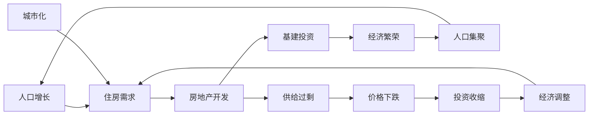

# 库兹涅茨周期：建筑周期与长期经济波动

## 概述

库兹涅茨周期（Kuznets Cycle），又称建筑周期或长摆动，是由美国经济学家西蒙·库兹涅茨（Simon Kuznets）在1930年提出的经济周期理论。这是一个长期周期，平均长度为15-25年，主要由房地产建设和基础设施投资的周期性波动驱动。

**学习目标**：
1. 理解库兹涅茨周期的形成机制
2. 掌握建筑周期与人口、城市化的关系
3. 学会识别房地产周期的不同阶段
4. 了解基建投资对经济的长期影响
5. 掌握基于建筑周期的长期投资策略

## 理论基础

### 发现与命名

西蒙·库兹涅茨（1901-1985，1971年诺贝尔经济学奖得主）通过研究美国1870-1930年的经济数据，发现了一个平均长度为15-25年的长期经济波动，这个周期与建筑活动高度相关。

**核心驱动因素**：
1. **人口增长与结构变化**：人口增长带来住房需求
2. **城市化进程**：农村人口向城市迁移
3. **基础设施需求**：经济发展需要配套设施
4. **技术进步**：建筑技术和材料的革新

### 建筑周期的形成机制

**关键特征**：
- **建设周期长**：从规划到完工需要3-5年
- **资本密集**：需要大量长期资金投入
- **影响深远**：塑造城市格局和经济结构
- **政策敏感**：受政府政策影响显著

## 库兹涅茨周期的阶段

### 第一阶段：需求积累期（5-7年）

**特征**：
- 人口增长，城市化加速
- 住房供给不足，价格温和上涨
- 开发商谨慎，新开工面积增长缓慢
- 政策支持，信贷环境宽松

**投资机会**：
- 优质地段的房地产
- 建材、家居行业
- 城市基础设施相关

### 第二阶段：建设高峰期（5-7年）

**特征**：
- 房地产开发全面启动
- 新开工面积快速增长
- 房价快速上涨，投机活跃
- 基建投资配套跟进

**投资机会**：
- 房地产开发商
- 建筑工程、钢铁水泥
- 金融机构（房贷业务）

**风险信号**：
- 房价收入比过高
- 库存快速积累
- 信贷过度扩张

### 第三阶段：供给过剩期（5-7年）

**特征**：
- 大量房屋集中交付
- 供给超过需求，库存高企
- 房价涨幅收窄或下跌
- 开发商资金链紧张

**投资策略**：
- 减少房地产配置
- 关注去库存进度
- 警惕金融风险

### 第四阶段：调整出清期（5-7年）

**特征**：
- 房地产投资大幅下降
- 库存逐步消化
- 行业整合，龙头集中度提升
- 为下一轮周期蓄力

**投资策略**：
- 等待周期底部
- 关注人口流入城市
- 布局优质地段

## 历史案例分析

### 美国建筑周期（1900-2020）

**第一轮**（1900-1918）：工业化城市化
**第二轮**（1918-1933）：战后繁荣与大萧条
**第三轮**（1933-1950）：新政与战后重建
**第四轮**（1950-1970）：郊区化浪潮
**第五轮**（1970-1990）：婴儿潮购房高峰
**第六轮**（1990-2008）：次贷泡沫
**第七轮**（2008-?）：后危机调整

### 中国建筑周期（1998-2023）

**第一轮**（1998-2008）：
- 住房市场化改革
- 城市化快速推进
- 房价持续上涨

**第二轮**（2008-2016）：
- 4万亿刺激
- 棚改货币化
- 三四线城市去库存

**第三轮**（2016-?）：
- 房住不炒
- 调控常态化
- 结构性分化

**中国特点**：
- 政策主导性强
- 区域分化明显
- 与城市化进程紧密相关

## 人口因素与建筑周期

### 人口结构影响

**购房年龄高峰**：25-45岁
- 首次购房：25-35岁
- 改善性购房：35-45岁
- 投资性购房：40-55岁

**人口红利窗口**：
- 劳动年龄人口占比提升
- 储蓄率上升
- 购房需求旺盛

**人口老龄化影响**：
- 新增需求减少
- 存量房流通增加
- 养老地产需求上升

### 城市化进程

**城市化率与房地产需求**：
- 30-70%：快速增长期
- 70-80%：平稳增长期
- 80%以上：存量时代

**中国城市化现状**（2023）：
- 常住人口城市化率：65%
- 户籍人口城市化率：47%
- 仍有增长空间，但增速放缓

## 投资策略应用

### 长期配置策略

**需求积累期**：
- 逐步增加房地产配置
- 关注人口流入城市
- 布局优质地段

**建设高峰期**：
- 保持适度配置
- 警惕泡沫风险
- 及时获利了结

**供给过剩期**：
- 大幅减少配置
- 转向其他资产
- 等待出清信号

**调整出清期**：
- 寻找底部机会
- 逆向投资布局
- 关注政策转向

### 行业轮动策略

**上行期**：房地产 → 建材 → 家居 → 家电
**下行期**：必需消费 → 医疗保健 → 科技成长

## 延伸阅读

1. Kuznets, S. (1930). *Secular Movements in Production and Prices*
2. Abramovitz, M. (1961). "The Nature and Significance of Kuznets Cycles"
3. 任泽平. (2016). "房地产周期研究"
4. 夏磊. (2019). "中国房地产周期与人口结构"

## 参考文献

1. Kuznets, S. (1930). *Secular Movements in Production and Prices: Their Nature and Their Bearing upon Cyclical Fluctuations*. Houghton Mifflin.

2. Abramovitz, M. (1961). "The Nature and Significance of Kuznets Cycles". *Economic Development and Cultural Change*, 9(3), 225-248.

3. Easterlin, R. A. (1968). *Population, Labor Force, and Long Swings in Economic Growth*. NBER.

4. 任泽平, 夏磊. (2017). "房地产周期". 人民出版社.

---

**下一步学习**：
- [康波周期](./kondratieff-wave.html) - 了解超长期技术创新周期
- [经济周期总览](./cycle-overview.html) - 回顾多重周期理论
- 房地产投资分析
5. Burns, A. F., & Mitchell, W. C. (1946). *Measuring Business Cycles*. National Bureau of Economic Research.
6. Zarnowitz, V. (1992). *Business Cycles: Theory, History, Indicators, and Forecasting*. University of Chicago Press.
7. Diebold, F. X., & Rudebusch, G. D. (1999). *Business Cycles: Durations, Dynamics, and Forecasting*. Princeton University Press.
8. Stock, J. H., & Watson, M. W. (1999). "Business Cycle Fluctuations in US Macroeconomic Time Series." *Handbook of Macroeconomics*, 1, 3-64.

## 深度分析

### 核心机制解析

理解本主题需要从多个维度进行系统性分析。以下从理论基础、实践应用和历史验证三个层面展开深度探讨。

**理论基础层面**：本主题的核心逻辑建立在经济学和金融学的基本原理之上。通过对基础理论的深入理解，投资者能够建立起稳固的分析框架，避免被市场短期噪音所干扰。

**实践应用层面**：理论必须与实践相结合才能产生价值。在实际投资决策中，需要将抽象的概念转化为具体的分析工具和决策标准。

**历史验证层面**：金融市场有着丰富的历史记录，通过研究历史案例，我们可以验证理论的有效性，并从中提炼出具有普遍意义的规律。

### 关键影响因素

影响本主题的关键因素可以从以下几个维度进行分析：

1. **宏观经济环境**：利率水平、通货膨胀率、经济增长速度等宏观变量对本主题有着深远影响。在不同的宏观经济周期中，相关指标的表现会呈现出显著差异。

2. **市场结构因素**：市场参与者的构成、信息传播机制、流动性状况等市场结构因素决定了价格发现的效率和准确性。

3. **政策监管环境**：政府政策、监管框架的变化会直接影响相关市场的运作规则和参与者行为。

4. **技术创新驱动**：技术进步不断改变着金融市场的运作方式，从算法交易到区块链技术，每一次技术革新都带来新的机遇和挑战。

5. **全球化与地缘政治**：在全球化背景下，各国市场之间的联动性日益增强，地缘政治风险的影响也越来越不可忽视。

### 量化分析框架

为了更精确地分析和评估，可以采用以下量化框架：

| 分析维度 | 关键指标 | 参考基准 | 分析方法 |
|---------|---------|---------|---------|
| 规模评估 | 绝对值与相对值 | 历史均值 | 趋势分析 |
| 质量评估 | 稳定性指标 | 行业对标 | 横向比较 |
| 风险评估 | 波动率指标 | 风险阈值 | 情景分析 |
| 价值评估 | 估值倍数 | 历史区间 | 回归分析 |

通过系统性地应用上述框架，投资者可以对目标进行全面、客观的评估，从而做出更加理性的投资决策。

## 高级分析与前沿研究

### 学术研究进展

近年来，学术界对本领域的研究取得了重要进展。以下是几个值得关注的研究方向：

**行为金融学视角**：传统金融理论假设市场参与者是完全理性的，但行为金融学的研究表明，认知偏差和情绪因素在投资决策中扮演着重要角色。诺贝尔经济学奖得主丹尼尔·卡尼曼（Daniel Kahneman）和理查德·塞勒（Richard Thaler）的研究为我们理解市场非理性行为提供了重要框架。

**因子投资研究**：尤金·法玛（Eugene Fama）和肯尼斯·弗伦奇（Kenneth French）的三因子模型，以及后续发展的五因子模型，为系统性地解释股票收益差异提供了理论基础。这些研究表明，市值、账面市值比、盈利能力和投资模式等因子能够解释大部分股票收益的横截面差异。

**市场微观结构研究**：对市场流动性、价格发现机制和交易成本的深入研究，帮助我们更好地理解市场的运作机制，并为优化交易策略提供指导。

### 实战案例深度解析

**案例一：长期价值创造的典范**

以沃伦·巴菲特（Warren Buffett）的伯克希尔·哈撒韦（Berkshire Hathaway）为例，其长达数十年的卓越投资业绩证明了价值投资理念的有效性。从1965年至今，伯克希尔的账面价值年均增长率约为19.8%，远超同期标普500指数的约10.2%年均回报。

巴菲特的成功秘诀在于：
- 专注于具有持久竞争优势的优质企业
- 以合理价格买入，而非追求最低价格
- 长期持有，让复利效应充分发挥
- 保持充足的安全边际，控制下行风险

**案例二：危机中的机遇识别**

2008年金融危机期间，大多数投资者恐慌性抛售，但少数具有前瞻性的投资者却在危机中发现了历史性的投资机会。约翰·保尔森（John Paulson）通过做空次级抵押贷款相关证券，在危机中获得了约150亿美元的利润，成为金融史上最成功的单笔交易之一。

这个案例告诉我们：
- 深入的基本面研究能够发现市场定价错误
- 逆向思维往往能够发现被市场忽视的机会
- 风险管理和仓位控制是成功的关键

### 跨市场比较分析

不同市场在结构、监管、投资者构成等方面存在显著差异，这些差异对投资策略的选择有重要影响：

**美国市场特征**：
- 机构投资者主导，市场效率较高
- 信息披露制度完善，分析师覆盖广泛
- 衍生品市场发达，对冲工具丰富
- 长期牛市历史，但也经历过多次重大调整

**中国市场特征**：
- 散户投资者比例较高，市场波动性较大
- 政策因素影响显著，需要密切关注监管动向
- 新兴行业发展迅速，成长投资机会丰富
- A股、港股、美股中概股形成多层次市场体系

**欧洲市场特征**：
- 价值股比例较高，估值相对保守
- 受地缘政治和欧元区政策影响较大
- 部分行业（如奢侈品、工业）具有全球竞争优势
- ESG投资理念推广较为领先

