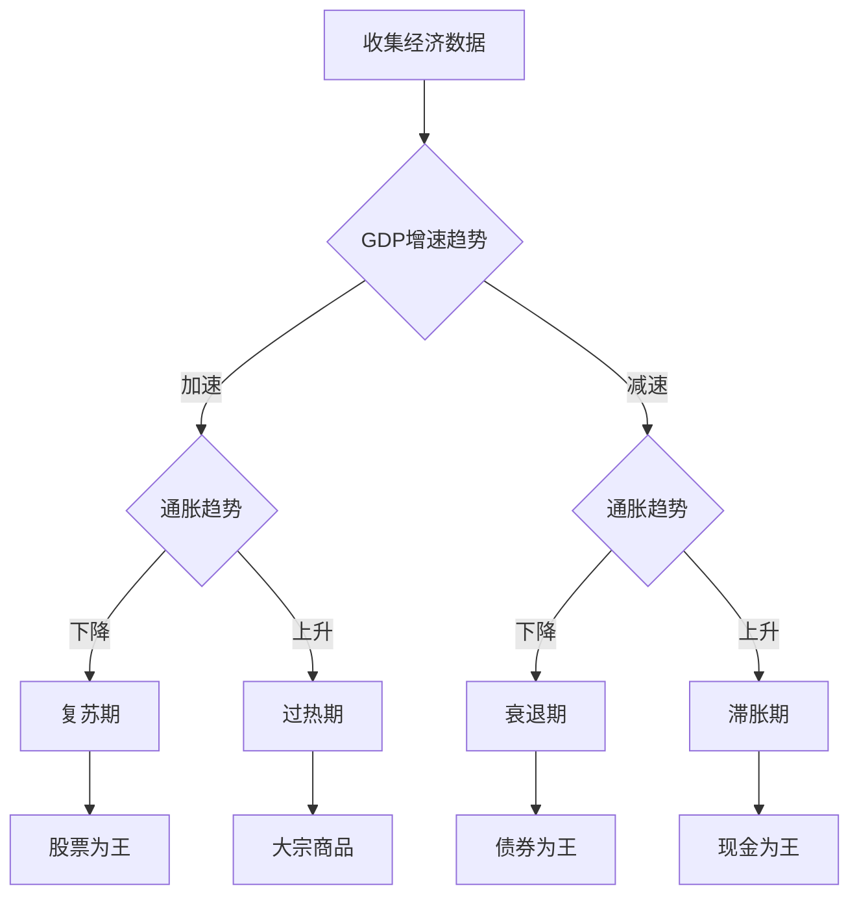

# 美林时钟：基于经济周期的资产配置策略

## 概述

美林时钟（Merrill Lynch Investment Clock）是美林证券在2004年提出的一个经典资产配置模型。该模型将经济周期划分为四个阶段，并为每个阶段推荐最优的资产配置策略。这是全球投资者广泛使用的战略资产配置框架。

**学习目标**：
1. 深入理解美林时钟的理论框架和逻辑
2. 掌握四个象限的经济特征和资产表现
3. 学会判断当前经济所处的时钟位置
4. 了解美林时钟在不同市场的适用性
5. 掌握基于美林时钟的实战投资策略

**为什么重要**：
- 最经典、最实用的资产配置框架
- 将宏观分析与投资决策有机结合
- 为战略资产配置提供清晰指引
- 全球机构投资者广泛应用


## 美林时钟的理论框架

### 核心逻辑

美林时钟基于两个核心变量构建：
1. **经济增长**：GDP增速的变化趋势（加速/减速）
2. **通货膨胀**：CPI的变化趋势（上升/下降）

这两个变量的组合形成四个象限，对应经济周期的四个阶段：

```mermaid
quadrantChart
    title 美林投资时钟
    x-axis 经济增长减速 --> 经济增长加速
    y-axis 通胀下降 --> 通胀上升
    
    quadrant-1 复苏期<br/>股票>债券>现金>大宗商品
    quadrant-2 过热期<br/>大宗商品>股票>现金>债券
    quadrant-3 滞胀期<br/>现金>大宗商品>债券>股票
    quadrant-4 衰退期<br/>债券>现金>股票>大宗商品
```

### 四象限详解

**象限1：衰退期（Recession）**
- 经济增长：下降
- 通货膨胀：下降
- 最优资产：债券 > 现金 > 股票 > 大宗商品

**象限2：复苏期（Recovery）**
- 经济增长：上升
- 通货膨胀：下降
- 最优资产：股票 > 债券 > 现金 > 大宗商品

**象限3：过热期（Overheat）**
- 经济增长：上升
- 通货膨胀：上升
- 最优资产：大宗商品 > 股票 > 现金/债券

**象限4：滞胀期（Stagflation）**
- 经济增长：下降
- 通货膨胀：上升
- 最优资产：现金 > 大宗商品 > 债券 > 股票


## 四个阶段的深度解析

### 阶段1：衰退期（Recession）

**宏观环境**：
- **GDP增长**：负增长或极低增长（<2%）
- **通货膨胀**：快速回落，可能出现通缩
- **失业率**：快速上升，达到周期高点
- **产能利用率**：大幅下降，低于75%
- **企业盈利**：大幅下滑，ROE降至10%以下

**政策环境**：
- **货币政策**：大幅降息，量化宽松
- **财政政策**：扩张性，增加支出
- **信贷环境**：宽松，但需求不足

**资产表现**：

| 资产类别 | 表现 | 原因 |
|---------|------|------|
| 债券 | ★★★★★ | 利率下降，避险需求 |
| 现金 | ★★★★ | 保值，等待机会 |
| 股票 | ★★ | 盈利下滑，估值压缩 |
| 大宗商品 | ★ | 需求疲软，价格下跌 |

**行业配置**：
- **首选**：公用事业、必需消费、医疗保健
- **次选**：电信服务、黄金
- **回避**：周期性行业、金融、能源

**历史案例**：
- 2008年Q4-2009年Q1：金融危机
- 2020年Q1：COVID-19冲击
- 2001年Q2-Q3：互联网泡沫破裂

**投资策略**：
1. 大幅增加债券配置（40-50%）
2. 保持充足现金（20-30%）
3. 精选防御性股票（20-30%）
4. 回避大宗商品和周期股


### 阶段2：复苏期（Recovery）

**宏观环境**：
- **GDP增长**：从负转正，加速增长（3-5%）
- **通货膨胀**：仍处低位，温和上升
- **失业率**：开始下降，但仍较高
- **产能利用率**：回升至75-80%
- **企业盈利**：快速改善，ROE回升至15%+

**政策环境**：
- **货币政策**：维持宽松，但不再加码
- **财政政策**：继续支持，逐步退出
- **信贷环境**：宽松，需求回暖

**资产表现**：

| 资产类别 | 表现 | 原因 |
|---------|------|------|
| 股票 | ★★★★★ | 盈利改善，估值修复 |
| 债券 | ★★★ | 利率低位，但上行压力 |
| 现金 | ★★ | 机会成本上升 |
| 大宗商品 | ★★ | 需求回暖，但涨幅有限 |

**行业配置**：
- **首选**：金融、可选消费、工业、科技
- **次选**：材料、房地产
- **减配**：公用事业、必需消费

**历史案例**：
- 2009年Q2-Q4：金融危机后复苏
- 2020年Q2-Q4：疫情后V型反弹
- 2016年Q2-Q4：供给侧改革后复苏

**投资策略**：
1. 大幅增加股票配置（60-70%）
2. 重点配置周期股和成长股
3. 逐步减少债券配置（20-30%）
4. 保持少量现金（10%）

**关键指标**：
- PMI从50以下回升至50以上
- 失业率连续3个月下降
- 企业盈利增速转正
- 股市估值修复（PE从底部回升）

**风险提示**：
- 复苏可持续性
- 政策退出时机
- 通胀抬头风险


### 阶段3：过热期（Overheat）

**宏观环境**：
- **GDP增长**：高速增长（5%+），超过潜在增长率
- **通货膨胀**：快速上升，超过3%
- **失业率**：达到周期低点，充分就业
- **产能利用率**：超过85%，接近满负荷
- **企业盈利**：高位，但增速放缓

**政策环境**：
- **货币政策**：收紧，加息周期
- **财政政策**：收紧，减少刺激
- **信贷环境**：收紧，利率上升

**资产表现**：

| 资产类别 | 表现 | 原因 |
|---------|------|------|
| 大宗商品 | ★★★★★ | 需求旺盛，通胀对冲 |
| 股票 | ★★★ | 盈利高位，但估值压力 |
| 现金 | ★★ | 利率上升，吸引力增加 |
| 债券 | ★ | 利率上升，价格下跌 |

**行业配置**：
- **首选**：能源、材料、工业
- **次选**：金融（受益于利率上升）
- **减配**：公用事业、房地产、长久期债券

**历史案例**：
- 2006-2007年：次贷危机前的繁荣
- 2010-2011年：刺激政策效果显现
- 2017-2018年：全球同步复苏

**投资策略**：
1. 增加大宗商品配置（30-40%）
2. 保持股票配置，但降低仓位（40-50%）
3. 增加现金配置（15-20%）
4. 大幅减少债券配置（5-10%）

**关键指标**：
- CPI和PPI快速上升
- 央行开始加息
- 收益率曲线趋平
- 股市估值偏高（PE超过历史均值）

**风险信号**：
- 通胀失控
- 政策过度收紧
- 资产泡沫化
- 收益率曲线倒挂

**转折点识别**：
- GDP增速见顶回落
- 通胀继续上升（滞胀风险）
- 政策收紧效果显现
- 股市开始调整


### 阶段4：滞胀期（Stagflation）

**宏观环境**：
- **GDP增长**：增速放缓或负增长
- **通货膨胀**：仍处高位，缓慢回落
- **失业率**：开始上升
- **产能利用率**：下降
- **企业盈利**：受成本挤压，快速下滑

**政策环境**：
- **货币政策**：两难境地（抗通胀 vs 稳增长）
- **财政政策**：空间有限
- **信贷环境**：紧缩，融资成本高

**资产表现**：

| 资产类别 | 表现 | 原因 |
|---------|------|------|
| 现金 | ★★★★★ | 规避风险，保持流动性 |
| 大宗商品 | ★★★ | 通胀对冲，但需求疲软 |
| 债券 | ★★ | 利率高位，经济下行 |
| 股票 | ★ | 盈利下滑，估值压缩 |

**行业配置**：
- **首选**：现金、黄金、必需消费
- **次选**：医疗保健、公用事业
- **回避**：周期股、成长股、信用债

**历史案例**：
- 1973-1975年：石油危机
- 1979-1982年：第二次石油危机
- 2011年：欧债危机期间

**投资策略**：
1. 大幅增加现金配置（40-50%）
2. 配置黄金和通胀保护债券（20-30%）
3. 精选必需消费和医疗（20-30%）
4. 最小化股票配置（10%以内）

**关键特征**：
- 经济增长和通胀同时恶化
- 政策工具效果有限
- 市场信心严重受挫
- 资产普遍表现不佳

**应对策略**：
- 保守为主，保持流动性
- 等待政策转向信号
- 寻找结构性机会
- 控制风险敞口

**转折点识别**：
- 通胀见顶回落
- 政策转向宽松
- 经济触底企稳
- 进入衰退期（为复苏蓄力）


## 如何判断当前时钟位置

### 判断框架



### 关键指标体系

**1. 增长指标**
- **GDP增速**：同比和环比
- **工业增加值**：制造业景气度
- **PMI指数**：领先指标
- **零售销售**：消费需求
- **固定资产投资**：投资需求

**判断标准**：
- 加速：指标连续3个月上升
- 减速：指标连续3个月下降

**2. 通胀指标**
- **CPI**：消费者价格指数
- **PPI**：生产者价格指数
- **核心CPI**：剔除食品和能源
- **GDP平减指数**：整体价格水平

**判断标准**：
- 上升：CPI同比>3%或连续上升
- 下降：CPI同比<2%或连续下降

**3. 就业指标**
- **失业率**：劳动力市场松紧
- **新增就业**：就业创造能力
- **平均工时**：劳动力需求
- **工资增长**：收入和通胀压力

**4. 金融指标**
- **利率水平**：政策取向
- **收益率曲线**：经济预期
- **信用利差**：风险偏好
- **股市估值**：市场情绪

### 实战判断步骤

**步骤1：数据收集**
- 收集最近6个月的关键指标
- 计算同比和环比变化
- 绘制趋势图

**步骤2：趋势判断**
- 判断GDP增速趋势（加速/减速）
- 判断通胀趋势（上升/下降）
- 确定当前象限

**步骤3：位置确认**
- 对比历史周期
- 考虑政策环境
- 评估持续时间

**步骤4：转折预判**
- 识别领先指标变化
- 关注政策转向信号
- 预判下一阶段

**步骤5：策略调整**
- 根据当前位置配置资产
- 提前布局下一阶段
- 设置风险控制措施


## 美林时钟的历史验证

### 美国市场验证（1973-2004）

美林证券对1973-2004年美国市场的研究显示：

**各阶段资产表现**：

| 阶段 | 最佳资产 | 年化收益 | 最差资产 | 年化收益 |
|------|---------|---------|---------|---------|
| 衰退期 | 债券 | 14.7% | 大宗商品 | -1.9% |
| 复苏期 | 股票 | 19.9% | 大宗商品 | 5.5% |
| 过热期 | 大宗商品 | 19.7% | 债券 | 3.2% |
| 滞胀期 | 现金 | 6.5% | 股票 | -3.9% |

**关键发现**：
- 美林时钟在美国市场有效性高达70%+
- 正确识别周期阶段可显著提升收益
- 资产轮动策略优于买入持有

### 中国市场验证（2002-2023）

**有效性分析**：
- **2002-2007年**：有效性较高（约70%）
- **2008-2015年**：有效性中等（约50%）
- **2016-2023年**：有效性降低（约40%）

**中国市场特点**：
1. **政策主导性强**：政策变化快于经济周期
2. **周期不规则**：经济转型导致周期特征变化
3. **资产相关性高**：股债商品联动性强
4. **外部冲击频繁**：贸易摩擦、疫情等

**调整建议**：
- 增加政策分析权重
- 缩短判断周期
- 考虑结构性因素
- 灵活调整策略

## 美林时钟的局限性

### 理论局限

**1. 简化假设**
- 假设经济周期规律运行
- 忽视外生冲击影响
- 未考虑结构性变化

**2. 二元分类**
- 增长和通胀只有两种状态
- 实际经济更加复杂
- 转换期难以判断

**3. 资产分类**
- 只考虑四大类资产
- 忽视细分资产差异
- 未包含另类投资

### 实践挑战

**1. 周期识别难度**
- 实时数据有滞后
- 转折点难以把握
- 噪音干扰判断

**2. 政策干预**
- 逆周期调控
- 改变周期特征
- 影响资产表现

**3. 全球化影响**
- 跨国传导
- 资本流动
- 汇率波动

**4. 结构性变化**
- 经济转型
- 技术进步
- 人口结构

### 改进方向

**1. 多维度分析**
- 增加信贷周期维度
- 考虑金融周期
- 纳入政策周期

**2. 动态调整**
- 根据市场特征调整
- 考虑结构性因素
- 灵活应用框架

**3. 细化资产**
- 区分行业和风格
- 考虑估值因素
- 纳入另类资产


## 实战应用策略

### 战略资产配置

**保守型投资者**（风险承受能力低）：

| 阶段 | 股票 | 债券 | 大宗商品 | 现金 |
|------|------|------|----------|------|
| 衰退期 | 10% | 50% | 0% | 40% |
| 复苏期 | 40% | 40% | 5% | 15% |
| 过热期 | 30% | 20% | 30% | 20% |
| 滞胀期 | 10% | 30% | 20% | 40% |

**平衡型投资者**（风险承受能力中等）：

| 阶段 | 股票 | 债券 | 大宗商品 | 现金 |
|------|------|------|----------|------|
| 衰退期 | 20% | 50% | 5% | 25% |
| 复苏期 | 60% | 25% | 5% | 10% |
| 过热期 | 40% | 15% | 35% | 10% |
| 滞胀期 | 15% | 35% | 25% | 25% |

**进取型投资者**（风险承受能力高）：

| 阶段 | 股票 | 债券 | 大宗商品 | 现金 |
|------|------|------|----------|------|
| 衰退期 | 30% | 50% | 5% | 15% |
| 复苏期 | 75% | 15% | 5% | 5% |
| 过热期 | 50% | 10% | 35% | 5% |
| 滞胀期 | 20% | 30% | 30% | 20% |

### 行业轮动策略

**衰退期 → 复苏期**：
- 卖出：公用事业、必需消费
- 买入：金融、可选消费、科技

**复苏期 → 过热期**：
- 卖出：科技、金融
- 买入：能源、材料、工业

**过热期 → 滞胀期**：
- 卖出：周期股、成长股
- 买入：必需消费、医疗、黄金

**滞胀期 → 衰退期**：
- 卖出：大宗商品、周期股
- 买入：债券、公用事业

### 风险管理要点

**1. 提前布局**
- 在周期转换前1-2个季度调整
- 不要等待明确信号
- 分批调整，降低风险

**2. 保持灵活**
- 不要机械套用
- 根据实际情况调整
- 考虑特殊因素

**3. 控制仓位**
- 设置最大/最小仓位限制
- 避免过度集中
- 保持适度分散

**4. 动态再平衡**
- 定期检查配置偏离
- 及时调整回目标配置
- 利用波动优化成本

## 延伸阅读

1. **"The Investment Clock"** - Merrill Lynch (2004)
   - 美林时钟原始报告
   - 理论框架和实证研究

2. **《投资时钟》** - 任泽平
   - 中国市场应用
   - 本土化改进

3. **《资产配置的艺术》** - David Swensen
   - 耶鲁基金模式
   - 长期资产配置

4. **《周期》** - Howard Marks
   - 投资大师的周期智慧
   - 实战经验分享

## 参考文献

1. Merrill Lynch. (2004). "The Investment Clock". *Global Investment Strategy*.

2. Doeswijk, R. Q., Lam, T. W., & Swinkels, L. (2014). "The Global Multi-Asset Market Portfolio, 1959–2012". *Financial Analysts Journal*, 70(2), 26-41.

3. Ilmanen, A. (2011). *Expected Returns: An Investor's Guide to Harvesting Market Rewards*. Wiley.

4. 任泽平, 甘源. (2016). "美林时钟在中国的实证研究". *宏观经济研究*.

5. 姜超, 顾潇啸. (2017). "美林时钟的中国化应用". *海通证券研究报告*.

6. 李迅雷. (2018). "经济周期与资产配置". *中泰证券研究报告*.

---

**下一步学习**：
- [周期指标体系](./cycle-indicators.html) - 掌握周期判断的具体工具
- [资产配置理论](../../04-investment-system/asset-allocation/modern-portfolio-theory.html)
- 行业轮动策略
- [经济周期总览](./cycle-overview.html) - 回顾周期理论框架
7. Burns, A. F., & Mitchell, W. C. (1946). *Measuring Business Cycles*. National Bureau of Economic Research.
8. Zarnowitz, V. (1992). *Business Cycles: Theory, History, Indicators, and Forecasting*. University of Chicago Press.
9. Diebold, F. X., & Rudebusch, G. D. (1999). *Business Cycles: Durations, Dynamics, and Forecasting*. Princeton University Press.
10. Stock, J. H., & Watson, M. W. (1999). "Business Cycle Fluctuations in US Macroeconomic Time Series." *Handbook of Macroeconomics*, 1, 3-64.


## 深度分析

### 核心机制解析

理解本主题需要从多个维度进行系统性分析。以下从理论基础、实践应用和历史验证三个层面展开深度探讨。

**理论基础层面**：本主题的核心逻辑建立在经济学和金融学的基本原理之上。通过对基础理论的深入理解，投资者能够建立起稳固的分析框架，避免被市场短期噪音所干扰。

**实践应用层面**：理论必须与实践相结合才能产生价值。在实际投资决策中，需要将抽象的概念转化为具体的分析工具和决策标准。

**历史验证层面**：金融市场有着丰富的历史记录，通过研究历史案例，我们可以验证理论的有效性，并从中提炼出具有普遍意义的规律。

### 关键影响因素

影响本主题的关键因素可以从以下几个维度进行分析：

1. **宏观经济环境**：利率水平、通货膨胀率、经济增长速度等宏观变量对本主题有着深远影响。在不同的宏观经济周期中，相关指标的表现会呈现出显著差异。

2. **市场结构因素**：市场参与者的构成、信息传播机制、流动性状况等市场结构因素决定了价格发现的效率和准确性。

3. **政策监管环境**：政府政策、监管框架的变化会直接影响相关市场的运作规则和参与者行为。

4. **技术创新驱动**：技术进步不断改变着金融市场的运作方式，从算法交易到区块链技术，每一次技术革新都带来新的机遇和挑战。

5. **全球化与地缘政治**：在全球化背景下，各国市场之间的联动性日益增强，地缘政治风险的影响也越来越不可忽视。

### 量化分析框架

为了更精确地分析和评估，可以采用以下量化框架：

| 分析维度 | 关键指标 | 参考基准 | 分析方法 |
|---------|---------|---------|---------|
| 规模评估 | 绝对值与相对值 | 历史均值 | 趋势分析 |
| 质量评估 | 稳定性指标 | 行业对标 | 横向比较 |
| 风险评估 | 波动率指标 | 风险阈值 | 情景分析 |
| 价值评估 | 估值倍数 | 历史区间 | 回归分析 |

通过系统性地应用上述框架，投资者可以对目标进行全面、客观的评估，从而做出更加理性的投资决策。


## 高级分析与前沿研究

### 学术研究进展

近年来，学术界对本领域的研究取得了重要进展。以下是几个值得关注的研究方向：

**行为金融学视角**：传统金融理论假设市场参与者是完全理性的，但行为金融学的研究表明，认知偏差和情绪因素在投资决策中扮演着重要角色。诺贝尔经济学奖得主丹尼尔·卡尼曼（Daniel Kahneman）和理查德·塞勒（Richard Thaler）的研究为我们理解市场非理性行为提供了重要框架。

**因子投资研究**：尤金·法玛（Eugene Fama）和肯尼斯·弗伦奇（Kenneth French）的三因子模型，以及后续发展的五因子模型，为系统性地解释股票收益差异提供了理论基础。这些研究表明，市值、账面市值比、盈利能力和投资模式等因子能够解释大部分股票收益的横截面差异。

**市场微观结构研究**：对市场流动性、价格发现机制和交易成本的深入研究，帮助我们更好地理解市场的运作机制，并为优化交易策略提供指导。

### 实战案例深度解析

**案例一：长期价值创造的典范**

以沃伦·巴菲特（Warren Buffett）的伯克希尔·哈撒韦（Berkshire Hathaway）为例，其长达数十年的卓越投资业绩证明了价值投资理念的有效性。从1965年至今，伯克希尔的账面价值年均增长率约为19.8%，远超同期标普500指数的约10.2%年均回报。

巴菲特的成功秘诀在于：
- 专注于具有持久竞争优势的优质企业
- 以合理价格买入，而非追求最低价格
- 长期持有，让复利效应充分发挥
- 保持充足的安全边际，控制下行风险

**案例二：危机中的机遇识别**

2008年金融危机期间，大多数投资者恐慌性抛售，但少数具有前瞻性的投资者却在危机中发现了历史性的投资机会。约翰·保尔森（John Paulson）通过做空次级抵押贷款相关证券，在危机中获得了约150亿美元的利润，成为金融史上最成功的单笔交易之一。

这个案例告诉我们：
- 深入的基本面研究能够发现市场定价错误
- 逆向思维往往能够发现被市场忽视的机会
- 风险管理和仓位控制是成功的关键

### 跨市场比较分析

不同市场在结构、监管、投资者构成等方面存在显著差异，这些差异对投资策略的选择有重要影响：

**美国市场特征**：
- 机构投资者主导，市场效率较高
- 信息披露制度完善，分析师覆盖广泛
- 衍生品市场发达，对冲工具丰富
- 长期牛市历史，但也经历过多次重大调整

**中国市场特征**：
- 散户投资者比例较高，市场波动性较大
- 政策因素影响显著，需要密切关注监管动向
- 新兴行业发展迅速，成长投资机会丰富
- A股、港股、美股中概股形成多层次市场体系

**欧洲市场特征**：
- 价值股比例较高，估值相对保守
- 受地缘政治和欧元区政策影响较大
- 部分行业（如奢侈品、工业）具有全球竞争优势
- ESG投资理念推广较为领先

