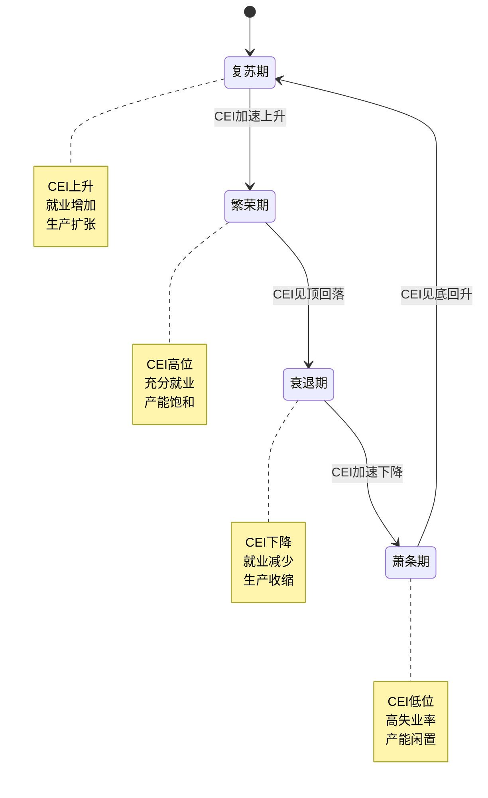
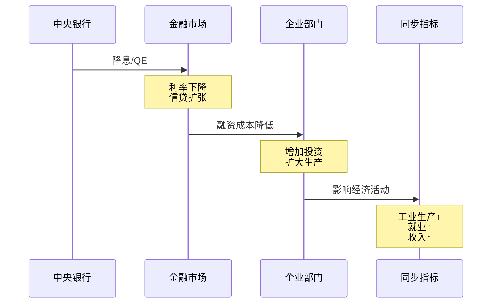
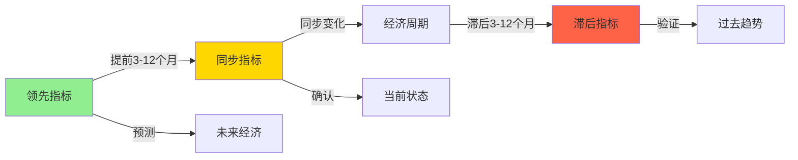

# 同步指标详解

## 概述

同步指标（Coincident Indicators）是与经济周期同步变化的经济统计数据，能够实时反映当前经济活动的状态。这些指标在经济周期的转折点附近同时发生变化，为判断经济当前所处位置提供了关键信息。

**学习目标**：
1. 理解同步指标的定义和作用机制
2. 掌握主要同步指标的构成和解读方法
3. 学会运用同步指标判断经济当前状态
4. 了解同步指标与领先、滞后指标的配合使用
5. 认识同步指标在投资决策中的应用

**为什么重要**：
- 确认经济周期当前位置
- 验证领先指标的预测
- 评估政策效果
- 指导短期投资决策

## 核心概念

### 同步指标的定义

同步指标是指与经济周期转折点几乎同时发生变化的经济变量。这些指标直接反映了当前的经济活动水平，是衡量经济健康状况的"体温计"。

**同步机制**：
1. **直接测量**：直接反映当前经济活动
2. **实时性强**：数据发布及时
3. **覆盖广泛**：涵盖生产、就业、收入、销售等多个维度
4. **综合性**：能够全面反映经济状态

### 同步指标的特征

**时间同步性**：
- 与经济周期转折点同步（±1-2 个月）
- 峰谷时间与经济周期一致
- 波动模式与 GDP 高度相关

**稳定性**：
- 波动幅度适中
- 虚假信号较少
- 可靠性高

**代表性**：
- 反映经济核心活动
- 覆盖主要经济部门
- 与 GDP 高度相关

## 主要同步指标体系

### 1. 美国同步经济指标指数（CEI）

美国咨商会编制的综合同步指标，包含 4 个核心指标：

#### CEI 四大组成指标

1. **非农就业人数**
   - 最重要的就业指标
   - 月度发布，覆盖全面
   - 权重：51.8%
   - **解读**：
     - 增长表明经济扩张
     - 下降预示经济收缩
     - 关注趋势而非单月波动

2. **个人收入（扣除转移支付）**
   - 反映劳动收入变化
   - 影响消费能力
   - 权重：20.0%
   - **解读**：
     - 收入增长支撑消费
     - 收入下降削弱需求
     - 实际收入更重要（扣除通胀）

3. **工业生产指数**
   - 衡量制造业、矿业、公用事业产出
   - 月度数据，及时性强
   - 权重：15.3%
   - **解读**：
     - 上升表明生产活跃
     - 下降反映需求疲软
     - 与 GDP 高度相关

4. **制造业和贸易销售额**
   - 反映商品流通状况
   - 包含批发和零售
   - 权重：12.9%
   - **解读**：
     - 销售增长表明需求旺盛
     - 销售下降预示库存积压
     - 实际销售额更有意义

### 2. 中国同步指标

**中国一致指数（CCI）**由国家统计局编制，包括：

1. **工业增加值**
   - 反映工业生产活动
   - 月度同比增速
   - 核心同步指标

2. **社会消费品零售总额**
   - 衡量消费需求
   - 占 GDP 约 55%
   - 月度数据

3. **固定资产投资**
   - 反映投资活动
   - 累计同比增速
   - 三大需求之一

4. **进出口总额**
   - 外贸活动指标
   - 月度数据
   - 反映外需状况

5. **城镇调查失业率**
   - 劳动力市场状况
   - 月度发布
   - 就业核心指标

### 3. 其他重要同步指标

#### GDP 及其组成部分

**实际 GDP**：
- 最综合的经济指标
- 季度发布
- 滞后性较强

**GDP 组成部分**：
- 个人消费支出（PCE）
- 私人投资
- 政府支出
- 净出口

#### 就业市场指标

**失业率**：
- 劳动力市场健康度
- 月度发布
- 充分就业水平约 4-5%

**劳动参与率**：
- 劳动力占工作年龄人口比例
- 反映就业意愿
- 结构性因素影响大

**平均时薪**：
- 工资增长指标
- 影响消费能力
- 通胀压力指标

#### 生产活动指标

**产能利用率**：
- 实际产出占潜在产出比例
- 反映生产压力
- 影响投资决策

**制造业产出**：
- 工业生产的核心部分
- 月度数据
- 与出口相关

**建筑支出**：
- 建筑业活动指标
- 月度数据
- 反映投资需求

#### 消费活动指标

**零售销售**：
- 消费支出的直接测量
- 月度数据，及时性强
- 占 GDP 约 70%（美国）

**个人消费支出（PCE）**：
- 更全面的消费指标
- 包含服务消费
- 美联储偏好的通胀指标

## 同步指标的应用

### 1. 确认经济周期位置

**周期阶段判断框架**：

**判断标准**：
- **复苏期**：CEI 连续上升，失业率下降，工业生产增长
- **繁荣期**：CEI 高位震荡，失业率低位，产能利用率高
- **衰退期**：CEI 连续下降，失业率上升，工业生产萎缩
- **萧条期**：CEI 低位徘徊，失业率高位，产能大量闲置

### 2. 验证领先指标预测

**交叉验证流程**：

| 领先指标信号 | 同步指标确认 | 经济状态 | 投资策略 |
|------------|------------|---------|---------|
| 上升 | 上升 | 复苏确认 | 增加风险资产 |
| 上升 | 持平/下降 | 虚假信号 | 谨慎观望 |
| 下降 | 下降 | 衰退确认 | 降低风险暴露 |
| 下降 | 上升 | 政策对冲 | 关注政策变化 |

**案例**：
- 领先指标提前 6 个月发出衰退信号
- 同步指标开始下降时确认衰退
- 两者共振时信号最可靠

### 3. 评估政策效果

**政策传导监控**：

**监控指标**：
- 政策实施后 3-6 个月观察同步指标
- 工业生产和就业是否改善
- 收入和销售是否增长

### 4. 投资决策应用

**资产配置调整**：

**扩张期**（CEI 上升）：
- 股票：超配周期性行业
- 债券：低配长期债券
- 大宗商品：超配工业金属
- 现金：低配

**收缩期**（CEI 下降）：
- 股票：低配周期性，超配防御性
- 债券：超配长期国债
- 大宗商品：低配
- 现金：超配

**行业轮动**：
- CEI 加速上升：科技、工业、金融
- CEI 高位震荡：消费、医疗
- CEI 开始下降：公用事业、必需消费品
- CEI 低位企稳：提前布局周期性行业

## 同步指标与其他指标的配合

### 三类指标的关系

### 综合分析框架

**完整分析流程**：

1. **领先指标**：判断未来方向
   - 收益率曲线、PMI、消费者信心
   - 提供预警信号

2. **同步指标**：确认当前状态
   - 就业、生产、收入、销售
   - 验证领先指标预测

3. **滞后指标**：验证周期转折
   - 失业持续时间、企业债务
   - 确认周期已经转折

**决策矩阵**：

| 领先 | 同步 | 滞后 | 经济状态 | 投资策略 |
|-----|-----|-----|---------|---------|
| ↑ | ↑ | ↓ | 早期复苏 | 积极进攻 |
| ↑ | ↑ | ↑ | 中期扩张 | 保持进攻 |
| ↓ | ↑ | ↑ | 晚期扩张 | 开始防御 |
| ↓ | ↓ | ↑ | 早期衰退 | 积极防御 |
| ↓ | ↓ | ↓ | 中期衰退 | 保持防御 |
| ↑ | ↓ | ↓ | 晚期衰退 | 准备进攻 |

## 历史案例分析

### 案例 1：2008-2009 年金融危机

**同步指标表现**：

**2008 年**：
- 非农就业：2008 年 1 月开始持续下降
- 工业生产：2008 年 1 月见顶，随后暴跌
- 个人收入：2008 年中开始下降
- 零售销售：2008 年全年持续疲软

**2009 年**：
- 就业：2009 年 12 月触底（-850 万）
- 工业生产：2009 年 6 月触底（-15%）
- CEI：2009 年 6 月见底

**投资启示**：
- 同步指标确认了衰退的严重程度
- 2009 年中同步指标见底时是买入时机
- 就业恢复最慢，但最终确认复苏

### 案例 2：2020 年疫情冲击

**同步指标表现**：

**2020 年 3-4 月**（暴跌）：
- 非农就业：单月减少 2200 万
- 失业率：飙升至 14.7%
- 工业生产：下降 12.7%
- 零售销售：下降 16.4%

**2020 年 5 月开始**（快速反弹）：
- 就业：连续增长
- 工业生产：V 型反转
- 零售销售：快速恢复

**特殊性**：
- 外生冲击导致的极端波动
- 政策刺激推动快速恢复
- 同步指标的 V 型走势罕见

### 案例 3：2022-2023 年软着陆

**同步指标表现**：

**2022-2023 年**：
- 就业：持续增长但放缓
- 失业率：维持低位（3.5-4.0%）
- 工业生产：温和增长
- 零售销售：实际增速放缓

**特点**：
- 同步指标显示经济韧性
- 劳动力市场异常强劲
- 避免了衰退

**启示**：
- 同步指标帮助确认软着陆
- 就业市场是关键支撑
- 政策调整及时有效

## 常见误区

### 误区 1：忽视数据修正

**问题**：
- 初值经常被大幅修正
- 可能改变对经济状态的判断
- 影响投资决策

**正确做法**：
- 关注修正后的数据
- 等待数据确认
- 使用多个数据源

### 误区 2：过度关注单月数据

**问题**：
- 单月数据波动大
- 可能受季节性因素影响
- 容易误判趋势

**正确做法**：
- 关注 3 个月移动平均
- 观察趋势而非单点
- 季节调整后的数据更可靠

### 误区 3：忽视结构性变化

**问题**：
- 经济结构不断演变
- 传统指标可能失效
- 新经济活动未被充分反映

**正确做法**：
- 关注新经济指标
- 理解指标局限性
- 结合多维度信息

### 误区 4：孤立看待同步指标

**问题**：
- 同步指标只反映当前
- 无法预测未来
- 需要配合其他指标

**正确做法**：
- 结合领先指标预测
- 用滞后指标验证
- 综合分析判断

## 实战应用技巧

### 1. 构建监控仪表板

**核心指标**：
- 就业：非农就业、失业率、时薪
- 生产：工业生产、产能利用率
- 消费：零售销售、个人消费支出
- 收入：个人收入、工资总额

**监控频率**：
- 月度：就业、生产、零售
- 季度：GDP、个人消费支出
- 实时：高频数据（信用卡消费等）

### 2. 建立预警系统

**一级预警**：
- 单个核心指标恶化
- 需要密切关注

**二级预警**：
- 多个同步指标同时恶化
- 经济可能转弱

**三级预警**：
- CEI 连续下降
- 经济进入衰退

### 3. 投资决策流程

**步骤 1**：收集最新同步指标数据
**步骤 2**：与历史趋势对比
**步骤 3**：结合领先指标判断
**步骤 4**：评估政策环境
**步骤 5**：调整投资组合

## 延伸阅读

### 推荐书籍

1. **《经济指标解读》** - Bernard Baumohl
   - 详细介绍各类同步指标
   - 实用的解读技巧

2. **《宏观经济学》** - N. Gregory Mankiw
   - 理论基础
   - 指标背后的经济逻辑

3. **《投资者的敌人》** - Michael Batnick
   - 历史周期分析
   - 投资实战经验

### 在线资源

1. **美国劳工统计局（BLS）**
   - 就业数据官方来源
   - 详细方法论

2. **美联储经济数据（FRED）**
   - 免费数据平台
   - 可视化工具

3. **国家统计局**
   - 中国经济数据
   - 月度发布

### 相关文章

- [领先指标：提前预警经济转折](./leading-indicators.html)
- [滞后指标：验证周期判断](./lagging-indicators.html)
- [综合指数：整合多维度信息](./composite-indices.html)
- [GDP 分析：经济总量测量](../macroeconomics/gdp-analysis.html)

## 参考文献

1. Conference Board. (2023). "The Conference Board Coincident Economic Index® (CEI) for the U.S."
2. Bureau of Labor Statistics. (2023). "Employment Situation Summary."
3. Federal Reserve. (2023). "Industrial Production and Capacity Utilization."
4. Bureau of Economic Analysis. (2023). "Personal Income and Outlays."
5. Census Bureau. (2023). "Advance Monthly Sales for Retail and Food Services."
6. Stock, J. H., & Watson, M. W. (1989). "New indexes of coincident and leading economic indicators."
7. Burns, A. F., & Mitchell, W. C. (1946). "Measuring Business Cycles." NBER.
8. Zarnowitz, V. (1992). "Business Cycles: Theory, History, Indicators, and Forecasting."
9. National Bureau of Economic Research. (2023). "Business Cycle Dating."
10. OECD. (2023). "Main Economic Indicators."

---

**下一步学习**：
- 研究[滞后指标](./lagging-indicators.html)，学会验证经济周期转折
- 探索[综合指数](./composite-indices.html)，掌握多指标整合方法
- 回顾[领先指标](./leading-indicators.html)，建立完整的指标分析框架
- 应用[美林时钟](../economic-cycles/merrill-lynch-clock.html)，实践周期投资
