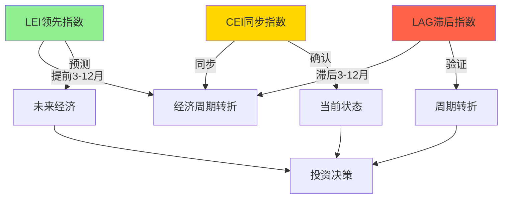
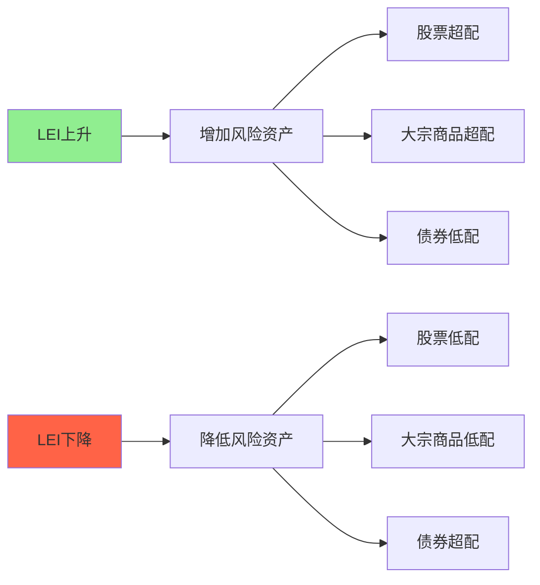

# 综合指数详解

## 概述

综合指数（Composite Indices）是将多个经济指标按照科学方法整合而成的单一指标，能够更全面、更准确地反映经济运行状态和趋势。通过综合多个维度的信息，综合指数可以降低单一指标的噪音，提高预测和判断的准确性。

**学习目标**：
1. 理解综合指数的构建原理和方法
2. 掌握主要综合指数的构成和解读
3. 学会运用综合指数进行经济分析
4. 了解如何构建自定义综合指数
5. 认识综合指数在投资决策中的应用

**为什么重要**：
- 整合多维度信息，降低噪音
- 提高经济预测准确性
- 简化复杂的经济分析
- 提供清晰的投资信号


## 核心概念

### 综合指数的定义

综合指数是通过统计方法将多个相关经济指标加权平均或标准化处理后得到的单一数值，用于综合反映经济活动的某个方面或整体状况。

**构建原理**：
1. **指标选择**：选择相关性强、代表性好的指标
2. **标准化处理**：消除量纲差异
3. **权重分配**：根据重要性分配权重
4. **指数计算**：加权平均或其他统计方法

### 综合指数的优势

**信息整合**：
- 综合多个维度的信息
- 降低单一指标的噪音
- 提供更全面的视角

**预测能力**：
- 提高预测准确性
- 减少虚假信号
- 更稳定的趋势

**简化分析**：
- 单一数值易于理解
- 便于跨时间比较
- 便于国际比较


## 主要综合指数体系

### 1. 美国咨商会指数体系

**三大核心指数**：

#### 领先经济指标指数（LEI）
- **组成**：10 个领先指标
- **用途**：预测未来 3-12 个月经济走向
- **发布**：月度
- **基准年**：2016 = 100

**关键信号**：
- 连续 3 个月下降：衰退预警
- 连续 3 个月上升：复苏信号
- 年度变化率：反映经济动能

#### 同步经济指标指数（CEI）
- **组成**：4 个同步指标
- **用途**：反映当前经济状态
- **发布**：月度
- **基准年**：2016 = 100

**关键信号**：
- 峰值：经济周期顶部
- 谷值：经济周期底部
- 增长率：经济扩张速度

#### 滞后经济指标指数（LAG）
- **组成**：7 个滞后指标
- **用途**：确认经济周期转折
- **发布**：月度
- **基准年**：2016 = 100

**关键信号**：
- 转折确认：滞后 3-12 个月
- 持续变化：周期转折已完成
- 与 CEI 背离：周期转换期

### 2. OECD 综合领先指标（CLI）

**全球覆盖**：
- 覆盖 OECD 成员国和主要经济体
- 统一方法论，便于国际比较
- 月度发布

**构成方法**：
- 各国选择 5-10 个领先指标
- 标准化处理
- 趋势-周期分解
- 基准值：100

**解读方法**：
- **> 100**：高于长期趋势，经济扩张
- **= 100**：符合长期趋势
- **< 100**：低于长期趋势，经济收缩
- **变化率**：经济动能强弱

### 3. 中国经济景气指数

**先行指数（CLI）**：
- 反映未来 3-6 个月经济走向
- 包含 10 个领先指标
- 月度发布

**一致指数（CCI）**：
- 反映当前经济状态
- 包含 5 个同步指标
- 月度发布

**滞后指数（LAG）**：
- 确认经济周期转折
- 包含 5 个滞后指标
- 月度发布

### 4. 采购经理人指数（PMI）

**制造业 PMI**：
- **组成**：5 个分项指标
  - 新订单（30%）
  - 生产（25%）
  - 就业（20%）
  - 供应商交货时间（15%）
  - 库存（10%）
- **荣枯线**：50
- **发布**：月度

**服务业 PMI**：
- 反映服务业活动
- 类似构成方法
- 月度发布

**综合 PMI**：
- 整合制造业和服务业
- 反映整体经济活动
- 月度发布

### 5. 其他重要综合指数

#### 金融状况指数（FCI）
- **构成**：利率、汇率、股市、信用利差
- **用途**：衡量金融环境松紧
- **发布**：各大投行和央行

#### 经济意外指数（ESI）
- **构成**：实际数据与预期的差异
- **用途**：衡量经济超预期程度
- **发布**：花旗、彭博等

#### 消费者信心指数
- **构成**：当前状况 + 未来预期
- **用途**：预测消费支出
- **发布**：密歇根大学、咨商会

## 综合指数的构建方法

### 1. 指标选择原则

**相关性**：
- 与经济周期高度相关
- 统计显著性
- 经济逻辑支持

**代表性**：
- 覆盖经济主要方面
- 数据质量高
- 及时性强

**稳定性**：
- 历史表现稳定
- 不易受异常值影响
- 长期可获得

### 2. 标准化方法

**对称变化率法**：
```
标准化值 = 200 × (X_t - X_{t-1}) / (X_t + X_{t-1})
```
- 消除量纲差异
- 对称处理上升和下降
- 美国咨商会采用

**Z-score 标准化**：
```
Z = (X - μ) / σ
```
- 标准正态分布
- 均值为 0，标准差为 1
- 便于比较

**指数平滑**：
```
S_t = α × X_t + (1-α) × S_{t-1}
```
- 平滑短期波动
- 保留长期趋势
- α 为平滑系数

### 3. 权重分配方法

**等权重法**：
- 所有指标权重相同
- 简单直观
- 适用于指标重要性相近

**经济权重法**：
- 根据经济重要性分配
- 主观判断
- 反映实际影响

**统计权重法**：
- 基于历史相关性
- 主成分分析（PCA）
- 客观但可能过拟合

**动态权重法**：
- 权重随时间调整
- 适应结构变化
- 计算复杂

### 4. 指数计算

**加权平均法**：
```
Index = Σ(w_i × X_i)
```
- 最常用方法
- 简单直观
- 易于解释

**几何平均法**：
```
Index = (Π X_i^{w_i})^{1/Σw_i}
```
- 适用于比率数据
- 降低极端值影响
- 计算复杂

**主成分分析法**：
- 提取主要成分
- 降维处理
- 保留最大信息量

## 综合指数的应用

### 1. 经济周期判断


**三指数分析框架**：



**判断规则**：

| LEI | CEI | LAG | 经济阶段 | 投资策略 |
|-----|-----|-----|---------|---------|
| ↑ | ↑ | ↓ | 早期复苏 | 积极进攻 |
| ↑ | ↑ | ↑ | 中期扩张 | 保持进攻 |
| ↓ | ↑ | ↑ | 晚期扩张 | 开始防御 |
| ↓ | ↓ | ↑ | 早期衰退 | 积极防御 |
| ↓ | ↓ | ↓ | 中期衰退 | 保持防御 |
| ↑ | ↓ | ↓ | 晚期衰退 | 准备进攻 |

### 2. 投资时机把握

**买入信号**：
- LEI 连续 3 个月上升
- CEI 开始企稳
- LAG 仍在下降
- **时机**：经济周期底部

**卖出信号**：
- LEI 连续 3 个月下降
- CEI 开始回落
- LAG 仍在上升
- **时机**：经济周期顶部

**持有信号**：
- 三个指数同向变化
- 趋势明确
- 无需频繁调整

### 3. 资产配置策略

**基于 LEI 的配置**：



**动态调整**：
- LEI 变化率 > 2%：大幅调整（30-40%）
- LEI 变化率 1-2%：适度调整（15-25%）
- LEI 变化率 < 1%：小幅调整（5-10%）

### 4. 风险管理

**预警系统**：

**一级预警**（LEI 下降）：
- 关注度：高
- 行动：准备调整
- 风险暴露：维持

**二级预警**（LEI + CEI 下降）：
- 关注度：很高
- 行动：开始调整
- 风险暴露：降低 20-30%

**三级预警**（三指数下降）：
- 关注度：极高
- 行动：大幅调整
- 风险暴露：降低 40-50%

## 自定义综合指数构建

### 实战案例：构建中国股市领先指数

**步骤 1：指标选择**

选择 8 个领先指标：
1. M2 增速
2. 社会融资规模增速
3. PMI 新订单指数
4. 房地产新开工面积
5. 汽车销售增速
6. 消费者信心指数
7. 10 年期国债收益率（反向）
8. 信用利差（反向）

**步骤 2：数据处理**

```python
# 伪代码示例
import pandas as pd
import numpy as np

# 1. 数据标准化
def standardize(series):
    return (series - series.mean()) / series.std()

# 2. 计算对称变化率
def symmetric_change(series):
    return 200 * (series - series.shift(1)) / (series + series.shift(1))

# 3. 应用标准化
indicators_std = df.apply(standardize)
```

**步骤 3：权重分配**

基于历史相关性：
- M2 增速：15%
- 社融增速：15%
- PMI 新订单：12%
- 房地产新开工：10%
- 汽车销售：8%
- 消费者信心：10%
- 国债收益率：15%
- 信用利差：15%

**步骤 4：指数计算**

```python
# 计算综合指数
weights = [0.15, 0.15, 0.12, 0.10, 0.08, 0.10, 0.15, 0.15]
composite_index = (indicators_std * weights).sum(axis=1)

# 重新基准化到 100
composite_index = 100 + composite_index * 10
```

**步骤 5：回测验证**

- 与股市走势对比
- 计算领先时间
- 评估预测准确性
- 调整权重和指标

### 构建技巧

**指标选择**：
- 从多个维度选择
- 避免高度相关的指标
- 确保数据质量

**权重调整**：
- 定期回测
- 根据表现调整
- 考虑结构变化

**验证方法**：
- 样本外测试
- 滚动回测
- 与基准对比

## 历史案例分析

### 案例 1：2008 年金融危机预警

**LEI 表现**：
- 2007 年 7 月见顶
- 连续 6 个月下降
- 提前 6 个月预警衰退

**CEI 表现**：
- 2008 年 1 月见顶
- 确认经济进入衰退
- 与 NBER 认定一致

**LAG 表现**：
- 2009 年 9 月见底
- 确认衰退结束
- 滞后 3 个月

**投资启示**：
- LEI 提供了充足的预警时间
- 三指数共振时信号最可靠
- 等待 LAG 确认会错过最佳时机

### 案例 2：2020 年疫情冲击

**指数表现**：
- LEI：2020 年 3 月暴跌
- CEI：2020 年 4 月触底
- LAG：2020 年 6 月见底

**特殊性**：
- 外生冲击导致极端波动
- 传统领先时间缩短
- 政策刺激改变周期模式

**启示**：
- 综合指数在极端情况下仍有价值
- 需要结合政策分析
- 快速反应很重要

### 案例 3：2022-2023 年软着陆

**指数表现**：
- LEI：2022 年 3 月开始下降
- CEI：保持增长但放缓
- LAG：保持稳定

**结果**：
- 经济放缓但未衰退
- 劳动力市场强劲
- 实现软着陆

**启示**：
- LEI 下降不一定导致衰退
- 需要综合判断
- 政策应对很关键

## 常见误区

### 误区 1：过度依赖单一综合指数

**问题**：
- 忽视指数构成
- 可能错过重要信息
- 不同指数可能矛盾

**正确做法**：
- 了解指数构成
- 使用多个综合指数
- 结合单项指标分析

### 误区 2：忽视指数修正

**问题**：
- 初值经常被修正
- 可能改变判断
- 影响决策

**正确做法**：
- 等待数据确认
- 关注修正幅度
- 使用多个数据源

### 误区 3：机械应用历史规律

**问题**：
- 经济结构变化
- 领先时间不固定
- 历史不会简单重复

**正确做法**：
- 理解指数背后的经济逻辑
- 考虑当前环境特殊性
- 灵活调整判断标准

### 误区 4：忽视指数局限性

**问题**：
- 综合指数也有盲点
- 可能错过结构性变化
- 新经济活动未被反映

**正确做法**：
- 了解指数局限性
- 补充其他信息
- 持续更新指标体系

## 实战应用框架

### 完整分析流程

**步骤 1：数据收集**
- 收集三大综合指数最新数据
- 收集关键单项指标
- 对比历史趋势

**步骤 2：信号识别**
- LEI 是否发出明确信号
- CEI 是否确认
- LAG 是否验证

**步骤 3：交叉验证**
- 不同综合指数是否一致
- 与单项指标是否矛盾
- 与市场表现是否背离

**步骤 4：情景分析**
- 乐观情景：指数改善
- 基准情景：指数持平
- 悲观情景：指数恶化

**步骤 5：投资决策**
- 调整资产配置
- 行业轮动
- 风险管理

### 监控仪表板

**核心指标**：
- LEI：月度变化率、年度变化率
- CEI：月度变化率、年度变化率
- LAG：月度变化率、年度变化率
- LEI/CEI 比率：领先程度

**辅助指标**：
- PMI：制造业、服务业
- 金融状况指数
- 消费者信心指数
- 经济意外指数

**监控频率**：
- 每月：综合指数发布后
- 每周：高频指标更新
- 每日：金融市场指标

## 延伸阅读

### 推荐书籍

1. **《经济指标解读》** - Bernard Baumohl
   - 全面介绍各类综合指数
   - 实用的应用方法

2. **《预测经济周期》** - Lakshman Achuthan & Anirvan Banerji
   - ECRI 的周期预测方法
   - 综合指数的科学应用

3. **《宏观交易》** - Greg Jensen
   - 桥水的宏观分析框架
   - 综合指数在投资中的应用

### 在线资源

1. **美国咨商会**
   - LEI/CEI/LAG 官方发布
   - 详细方法论文档

2. **OECD**
   - 全球 CLI 数据
   - 国际比较

3. **FRED 经济数据库**
   - 免费数据平台
   - 可视化工具

### 相关文章

- [领先指标：提前预警经济转折](./leading-indicators.html)
- [同步指标：实时把握经济脉搏](./coincident-indicators.html)
- [滞后指标：验证周期判断](./lagging-indicators.html)
- [美林时钟：周期投资实战](../economic-cycles/merrill-lynch-clock.html)

## 参考文献

1. Conference Board. (2023). "The Conference Board Leading, Coincident, and Lagging Economic Indexes."
2. OECD. (2023). "OECD System of Composite Leading Indicators."
3. Stock, J. H., & Watson, M. W. (1989). "New indexes of coincident and leading economic indicators." NBER.
4. Burns, A. F., & Mitchell, W. C. (1946). "Measuring Business Cycles." NBER.
5. Zarnowitz, V., & Boschan, C. (1975). "Cyclical indicators: An evaluation and new leading indexes."
6. Achuthan, L., & Banerji, A. (2004). "Beating the Business Cycle." Currency Doubleday.
7. Baumohl, B. (2012). "The Secrets of Economic Indicators." Wharton School Publishing.
8. National Bureau of Economic Research. (2023). "Business Cycle Dating."
9. Federal Reserve Bank of St. Louis. (2023). "FRED Economic Data."
10. Dalio, R. (2018). "A Template for Understanding Big Debt Crises." Bridgewater Associates.

---

**下一步学习**：
- 回顾[领先指标](./leading-indicators.html)、[同步指标](./coincident-indicators.html)、[滞后指标](./lagging-indicators.html)，建立完整框架
- 应用[美林时钟](../economic-cycles/merrill-lynch-clock.html)，实践周期投资策略
- 研究[经济周期理论](../economic-cycles/cycle-overview.html)，深化理论理解
- 探索[货币政策](../monetary-policy/policy-tools.html)，理解政策对指标的影响
