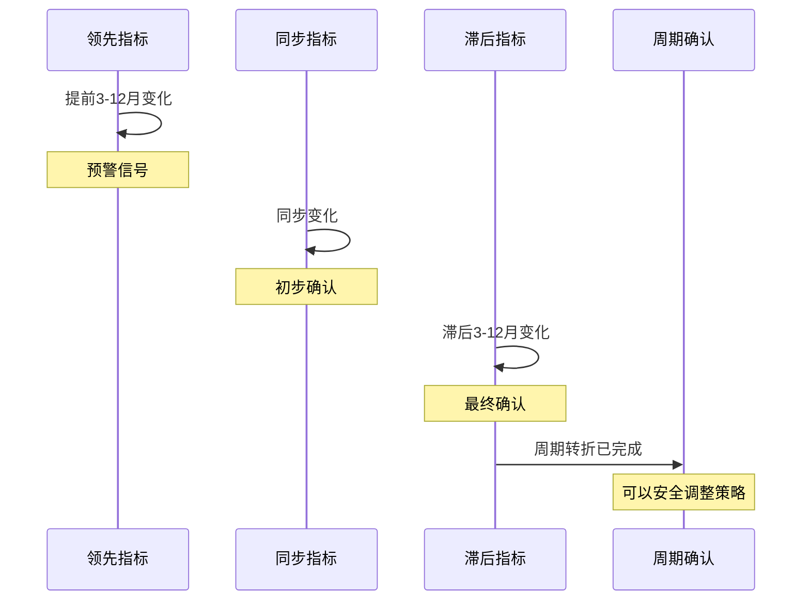
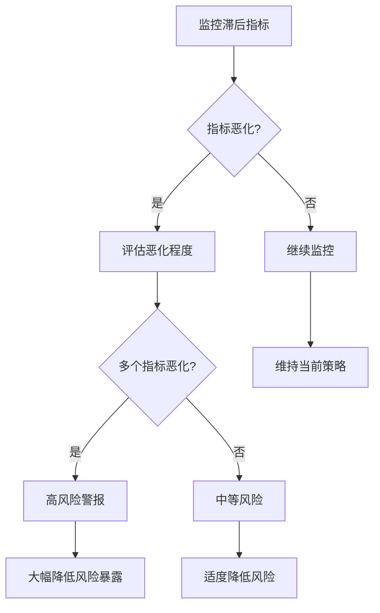

# 滞后指标详解

## 概述

滞后指标（Lagging Indicators）是在经济周期转折点之后才发生变化的经济统计数据。这些指标通常滞后经济周期转折点 3-12 个月，主要用于确认经济周期已经发生转折，验证领先指标和同步指标的信号。

**学习目标**：
1. 理解滞后指标的定义和验证机制
2. 掌握主要滞后指标的构成和解读方法
3. 学会运用滞后指标确认经济周期转折
4. 了解滞后指标在风险管理中的应用
5. 认识滞后指标与其他指标的配合使用

**为什么重要**：
- 确认经济周期转折点
- 验证投资决策的正确性
- 评估经济复苏的可持续性
- 识别虚假信号

## 核心概念

### 滞后指标的定义

滞后指标是指在经济周期转折点之后才开始变化的经济变量。这些指标之所以"滞后"，是因为它们反映的是经济活动的结果和累积效应，而非当前的决策和预期。

**滞后机制**：
1. **累积效应**：需要时间积累才能显现
2. **调整滞后**：企业和个人调整行为需要时间
3. **数据滞后**：统计和发布存在时间差
4. **结构性因素**：长期趋势变化缓慢

### 滞后指标的特征

**时间滞后性**：
- 通常滞后经济周期转折点 3-12 个月
- 不同指标的滞后时间各不相同
- 滞后时间相对稳定

**稳定性**：
- 波动幅度较小
- 趋势性强
- 虚假信号少

**确认性**：
- 用于验证周期转折
- 提供最终确认
- 可靠性高

## 主要滞后指标体系

### 1. 美国滞后经济指标指数（LAG）

美国咨商会编制的综合滞后指标，包含 7 个核心指标：

#### LAG 七大组成指标

1. **平均失业持续时间**
   - 失业者平均失业周数
   - 反映劳动力市场松紧程度
   - 权重：0.03%
   - **解读**：
     - 持续时间延长表明就业困难
     - 缩短表明劳动力市场改善
     - 滞后时间：6-12 个月

2. **库存销售比（制造业和贸易）**
   - 库存与销售的比率
   - 反映供需平衡状况
   - 权重：0.10%
   - **解读**：
     - 比率上升表明库存积压
     - 比率下降表明需求旺盛
     - 企业调整库存需要时间

3. **单位劳动力成本变化**
   - 每单位产出的劳动成本
   - 反映生产效率和工资压力
   - 权重：0.11%
   - **解读**：
     - 上升表明成本压力增加
     - 下降表明生产效率提高
     - 影响企业盈利能力

4. **平均优惠利率**
   - 银行对优质客户的贷款利率
   - 反映信贷成本
   - 权重：0.24%
   - **解读**：
     - 上升表明货币政策收紧
     - 下降表明货币政策宽松
     - 滞后于央行政策调整

5. **商业和工业贷款余额**
   - 企业借款总额
   - 反映企业融资需求
   - 权重：0.19%
   - **解读**：
     - 增长表明企业扩张
     - 下降表明企业去杠杆
     - 滞后于投资决策

6. **消费者分期信贷与个人收入比**
   - 消费者债务负担
   - 反映家庭杠杆水平
   - 权重：0.27%
   - **解读**：
     - 上升表明债务负担加重
     - 下降表明去杠杆
     - 影响未来消费能力

7. **消费者价格指数（CPI）服务业变化**
   - 服务业通胀率
   - 反映工资和成本压力
   - 权重：0.06%
   - **解读**：
     - 上升表明通胀压力
     - 下降表明通胀缓解
     - 服务业通胀更具粘性

### 2. 中国滞后指标

**中国滞后指数（LAG）**包括：

1. **工业企业利润增速**
   - 反映企业盈利状况
   - 滞后于生产和销售
   - 季度数据

2. **城镇登记失业率**
   - 劳动力市场状况
   - 调整缓慢
   - 季度发布

3. **企业资产负债率**
   - 企业杠杆水平
   - 反映财务健康度
   - 调整需要时间

4. **居民储蓄率**
   - 家庭储蓄行为
   - 反映收入预期
   - 变化缓慢

5. **银行不良贷款率**
   - 信贷质量指标
   - 滞后于经济周期
   - 季度数据

### 3. 其他重要滞后指标

#### 劳动力市场指标

**长期失业率**：
- 失业超过 27 周的比例
- 反映劳动力市场深层问题
- 滞后时间：9-12 个月

**就业成本指数（ECI）**：
- 综合工资和福利成本
- 反映劳动力成本压力
- 季度发布

**劳动生产率**：
- 每小时产出
- 反映经济效率
- 滞后于产出变化

#### 企业财务指标

**企业利润率**：
- 净利润占收入比例
- 反映盈利能力
- 滞后于销售变化

**企业债务负担**：
- 债务与 EBITDA 比率
- 反映财务压力
- 调整缓慢

**破产率**：
- 企业破产数量
- 反映经济压力
- 显著滞后

#### 通胀指标

**核心 CPI**：
- 扣除食品和能源的 CPI
- 反映潜在通胀压力
- 滞后于需求变化

**工资增长率**：
- 平均时薪同比增速
- 反映劳动力市场紧张度
- 滞后于就业变化

**租金通胀**：
- 住房租金变化
- 调整缓慢
- 显著滞后

## 滞后指标的应用

### 1. 确认经济周期转折

**周期转折确认框架**：

**确认标准**：
- **衰退确认**：LAG 连续 3 个月下降，失业持续时间延长
- **复苏确认**：LAG 连续 3 个月上升，企业利润改善
- **转折确认**：需要多个滞后指标共同验证

### 2. 验证投资决策

**决策验证矩阵**：

| 投资决策 | 预期结果 | 滞后指标验证 | 结论 |
|---------|---------|------------|------|
| 衰退前减仓 | 避免损失 | 失业率上升，利润下降 | 决策正确 |
| 复苏初期加仓 | 获取收益 | 失业率下降，利润改善 | 决策正确 |
| 过早加仓 | 继续下跌 | 失业率继续上升 | 决策过早 |
| 过晚减仓 | 错失高点 | 利润已经见顶 | 决策滞后 |

**应用场景**：
- 评估周期判断的准确性
- 调整未来决策时机
- 改进投资框架

### 3. 评估经济复苏质量

**复苏质量指标**：

**高质量复苏**：
- 失业持续时间快速缩短
- 企业利润强劲增长
- 工资增长加速
- 信贷质量改善

**低质量复苏**：
- 失业持续时间居高不下
- 企业利润增长缓慢
- 工资增长停滞
- 信贷质量恶化

**投资含义**：
- 高质量复苏：可持续，适合长期投资
- 低质量复苏：脆弱，需要谨慎

### 4. 风险管理应用

**风险评估框架**：

**风险信号**：
- 失业持续时间突然延长
- 企业利润率大幅下降
- 债务负担快速上升
- 破产率显著增加

## 三类指标的综合应用

### 完整分析框架

**时间序列分析**：

| 时间 | 领先指标 | 同步指标 | 滞后指标 | 经济状态 | 投资策略 |
|-----|---------|---------|---------|---------|---------|
| T-12 | ↓ | → | → | 晚期扩张 | 开始减仓 |
| T-6 | ↓ | ↓ | → | 早期衰退 | 继续减仓 |
| T | ↓ | ↓ | ↓ | 衰退确认 | 防御为主 |
| T+6 | ↑ | ↑ | ↓ | 早期复苏 | 开始加仓 |
| T+12 | ↑ | ↑ | ↑ | 复苏确认 | 积极进攻 |

### 投资决策时机

**最佳买入时机**：
- 领先指标见底回升
- 同步指标开始改善
- 滞后指标仍在恶化
- **原因**：市场已经反映最坏情况

**最佳卖出时机**：
- 领先指标见顶回落
- 同步指标开始恶化
- 滞后指标仍在改善
- **原因**：市场尚未充分反映风险

**持有时机**：
- 三类指标同向变化
- 趋势明确
- 无需频繁调整

## 历史案例分析

### 案例 1：2008-2010 年金融危机周期

**滞后指标表现**：

**2008-2009 年**（衰退期）：
- 失业持续时间：从 17 周延长至 40 周
- 企业利润：下降 50%+
- 商业贷款：持续收缩
- LAG 指数：2009 年 9 月见底

**2010-2011 年**（复苏期）：
- 失业持续时间：缓慢下降
- 企业利润：强劲反弹
- 商业贷款：2010 年底开始增长
- LAG 指数：2010 年开始上升

**投资启示**：
- 滞后指标在 2009 年 9 月确认衰退结束
- 此时股市已经反弹 50%+
- 等待滞后指标确认会错过最佳买入时机
- 但提供了安全的二次买入机会

### 案例 2：2020 年疫情冲击

**滞后指标表现**：

**2020 年 4-6 月**：
- 失业持续时间：飙升至历史高位
- 企业利润：暴跌
- 商业贷款：激增（应急借款）
- LAG 指数：急剧下降

**2020 年下半年**：
- 失业持续时间：快速下降
- 企业利润：V 型反转
- 商业贷款：开始正常化
- LAG 指数：快速恢复

**特殊性**：
- 外生冲击导致的极端波动
- 政策刺激改变了正常周期模式
- 滞后指标的滞后时间缩短

### 案例 3：2022-2023 年通胀周期

**滞后指标表现**：

**2022-2023 年**：
- 失业持续时间：保持低位
- 企业利润：受通胀影响分化
- 工资增长：加速上升
- 服务业通胀：持续高位

**特点**：
- 劳动力市场异常紧张
- 工资-通胀螺旋风险
- 滞后指标显示经济韧性

**启示**：
- 滞后指标帮助确认软着陆
- 劳动力市场是关键
- 通胀粘性需要时间消化

## 常见误区

### 误区 1：用滞后指标预测未来

**问题**：
- 滞后指标反映过去
- 无法预测未来
- 可能误导决策

**正确做法**：
- 用于确认而非预测
- 结合领先指标判断
- 理解指标的时间属性

### 误区 2：等待滞后指标确认才行动

**问题**：
- 错过最佳时机
- 市场已经充分反映
- 收益大幅降低

**正确做法**：
- 基于领先指标提前布局
- 用滞后指标验证决策
- 分批建仓降低风险

### 误区 3：忽视滞后指标的价值

**问题**：
- 可能被虚假信号误导
- 无法确认周期转折
- 增加决策风险

**正确做法**：
- 重视滞后指标的确认作用
- 用于风险管理
- 评估投资决策质量

### 误区 4：机械应用滞后时间

**问题**：
- 滞后时间并非固定
- 不同周期差异大
- 可能误判时机

**正确做法**：
- 关注指标变化趋势
- 考虑当前环境特殊性
- 灵活调整判断标准

## 实战应用技巧

### 1. 构建验证系统

**核心验证指标**：
- 劳动力市场：失业持续时间、就业成本
- 企业部门：利润率、债务负担
- 通胀：核心 CPI、工资增长
- 信贷：贷款余额、不良率

**验证流程**：
1. 基于领先指标做出投资决策
2. 用同步指标初步验证
3. 用滞后指标最终确认
4. 评估决策质量
5. 改进决策框架

### 2. 风险管理应用

**预警级别**：
- **一级**：单个滞后指标恶化
- **二级**：多个滞后指标恶化
- **三级**：LAG 指数持续下降

**应对措施**：
- 一级：密切关注，准备调整
- 二级：适度降低风险暴露
- 三级：大幅降低风险，确认周期转折

### 3. 投资组合调整

**调整时机**：
- 领先指标发出信号：初步调整（30%）
- 同步指标确认：进一步调整（30%）
- 滞后指标验证：完成调整（40%）

**调整幅度**：
- 根据三类指标的一致性
- 一致性越高，调整幅度越大
- 存在矛盾时保持谨慎

## 延伸阅读

### 推荐书籍

1. **《经济指标解读》** - Bernard Baumohl
   - 全面介绍滞后指标
   - 实用的应用方法

2. **《周期》** - Howard Marks
   - 周期思维
   - 投资时机把握

3. **《投资最重要的事》** - Howard Marks
   - 风险管理
   - 逆向思维

### 在线资源

1. **美国咨商会**
   - LAG 指数官方发布
   - 详细方法论

2. **FRED 经济数据库**
   - 免费数据平台
   - 历史数据下载

3. **NBER**
   - 经济周期官方认定
   - 学术研究

### 相关文章

- [领先指标：提前预警经济转折](./leading-indicators.html)
- [同步指标：实时把握经济脉搏](./coincident-indicators.html)
- [综合指数：整合多维度信息](./composite-indices.html)
- [经济周期概述：理解周期规律](../economic-cycles/cycle-overview.html)

## 参考文献

1. Conference Board. (2023). "The Conference Board Lagging Economic Index® (LAG) for the U.S."
2. Bureau of Labor Statistics. (2023). "Labor Force Statistics."
3. Federal Reserve. (2023). "Commercial and Industrial Loans."
4. Bureau of Economic Analysis. (2023). "Corporate Profits."
5. Stock, J. H., & Watson, M. W. (1989). "New indexes of coincident and leading economic indicators."
6. Burns, A. F., & Mitchell, W. C. (1946). "Measuring Business Cycles." NBER.
7. Zarnowitz, V. (1992). "Business Cycles: Theory, History, Indicators, and Forecasting."
8. National Bureau of Economic Research. (2023). "Business Cycle Dating Committee."
9. Marks, H. (2018). "Mastering the Market Cycle." Houghton Mifflin Harcourt.
10. Dalio, R. (2018). "A Template for Understanding Big Debt Crises." Bridgewater Associates.

---

**下一步学习**：
- 探索[综合指数](./composite-indices.html)，学习如何整合三类指标
- 回顾[领先指标](./leading-indicators.html)和[同步指标](./coincident-indicators.html)，建立完整框架
- 应用[美林时钟](../economic-cycles/merrill-lynch-clock.html)，实践周期投资
- 研究[经济周期理论](../economic-cycles/cycle-overview.html)，深化理论理解
