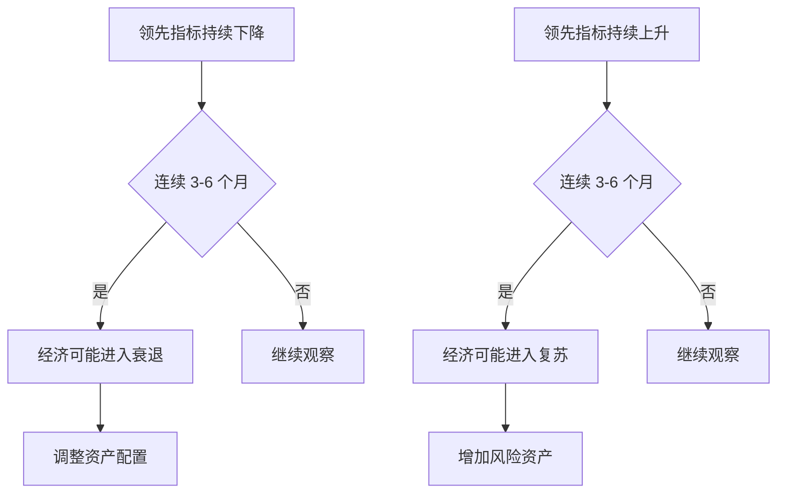
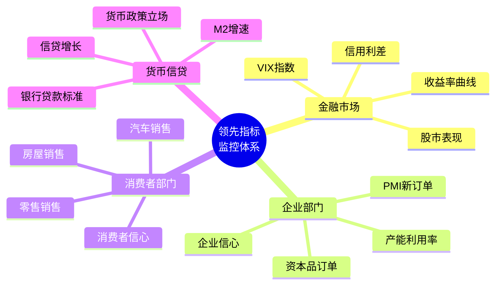

# 领先指标详解

## 概述

领先指标（Leading Indicators）是能够提前反映经济活动未来走向的经济统计数据。这些指标通常在经济周期转折点之前 3-12 个月发生变化，为投资者和政策制定者提供了宝贵的预警信号。

**学习目标**：
1. 理解领先指标的定义和预测机制
2. 掌握主要领先指标的构成和计算方法
3. 学会运用领先指标判断经济周期位置
4. 了解领先指标在投资决策中的应用
5. 认识领先指标的局限性和误判风险

**为什么重要**：
- 提前预警经济衰退和复苏
- 指导资产配置和行业轮动
- 帮助企业制定战略决策
- 协助央行调整货币政策

## 核心概念

### 领先指标的定义

领先指标是指在经济周期转折点之前就开始变化的经济变量。这些指标之所以能够"领先"，是因为它们反映了经济主体对未来的预期和当前的决策行为。

**领先机制**：
1. **预期驱动**：企业和消费者基于对未来的预期做出决策
2. **投资先行**：投资决策影响未来的生产和就业
3. **库存调整**：企业根据预期调整库存水平
4. **金融市场**：资产价格反映对未来现金流的预期

### 领先指标的特征

**时间领先性**：
- 通常领先经济周期转折点 3-12 个月
- 不同指标的领先时间各不相同
- 领先时间可能随经济环境变化

**波动性**：
- 波动幅度通常大于同步指标
- 对经济变化更加敏感
- 可能出现虚假信号

**前瞻性**：
- 反映经济主体的预期
- 包含未来信息
- 具有预测价值

## 主要领先指标体系

### 1. 美国领先经济指标指数（LEI）

美国咨商会（Conference Board）编制的综合领先指标，包含 10 个子指标：

#### LEI 十大组成指标

1. **平均每周工作时间（制造业）**
   - 反映劳动力需求的早期变化
   - 企业通常先调整工时再调整雇佣
   - 权重：0.26%

2. **首次申请失业救济人数**
   - 劳动力市场健康度的即时指标
   - 数据每周发布，及时性强
   - 权重：0.03%

3. **制造业新订单（消费品和材料）**
   - 反映未来生产活动
   - 订单增加预示产出增长
   - 权重：0.09%

4. **供应商交货时间指数（ISM）**
   - 交货时间延长表明需求旺盛
   - 反映供应链压力
   - 权重：0.03%

5. **制造业新订单（非国防资本品，扣除飞机）**
   - 企业投资意愿的指标
   - 资本品订单领先设备投资
   - 权重：0.02%

6. **建筑许可证**
   - 住宅投资的领先指标
   - 反映房地产市场预期
   - 权重：0.03%

7. **标普 500 指数**
   - 股市反映对未来盈利的预期
   - 财富效应影响消费
   - 权重：0.04%

8. **领先信贷指数**
   - 信贷条件影响经济活动
   - 包含利差和信贷标准
   - 权重：0.08%

9. **消费者预期指数**
   - 消费者信心影响支出决策
   - 反映家庭部门预期
   - 权重：0.03%

10. **M2 货币供应量（实际）**
    - 流动性影响经济活动
    - 货币供应领先信贷扩张
    - 权重：0.35%

### 2. 中国领先指标

**中国先行指数（CLI）**由国家统计局编制，包括：

1. **制造业 PMI 新订单指数**
   - 反映制造业需求变化
   - 50 为荣枯分界线

2. **消费者信心指数**
   - 衡量消费者预期
   - 影响消费支出

3. **货币供应量 M1 增速**
   - 反映流动性状况
   - 领先经济活动

4. **房地产新开工面积**
   - 房地产投资的领先指标
   - 影响上下游产业

5. **出口订单指数**
   - 外需变化的早期信号
   - 影响制造业生产

6. **股票市场指数**
   - 反映市场预期
   - 财富效应

### 3. 其他重要领先指标

#### 金融市场指标

**收益率曲线**：
- 10 年期与 2 年期国债利差
- 倒挂通常预示衰退
- 领先时间：6-18 个月

**信用利差**：
- 企业债与国债利差
- 扩大表明风险上升
- 反映信贷条件

**股市波动率（VIX）**：
- 恐慌指数
- 飙升预示市场压力
- 短期领先指标

#### 企业调查指标

**采购经理人指数（PMI）**：
- 制造业和服务业 PMI
- 新订单分项最为领先
- 50 为荣枯分界线

**企业信心指数**：
- 反映企业家预期
- 影响投资决策
- 各国央行定期调查

**产能利用率**：
- 高产能利用率预示投资增加
- 低产能利用率预示产出下降
- 影响企业扩张决策

#### 消费者指标

**消费者信心指数**：
- 密歇根大学消费者信心指数
- 咨商会消费者信心指数
- 预期分项更具领先性

**零售销售增长率**：
- 消费支出的直接指标
- 占 GDP 约 70%（美国）
- 月度数据，及时性强

**汽车销售**：
- 大额消费的代表
- 反映消费者信心
- 影响制造业生产

## 领先指标的应用

### 1. 经济周期判断

**周期转折点识别**：

**判断规则**：
- **衰退信号**：LEI 连续 3 个月下降，且累计降幅超过 2%
- **复苏信号**：LEI 连续 3 个月上升，且累计升幅超过 1%
- **确认信号**：需要多个领先指标共同验证

### 2. 投资决策应用

**资产配置策略**：

| 领先指标信号 | 经济预期 | 股票 | 债券 | 大宗商品 | 现金 |
|------------|---------|------|------|---------|------|
| 强劲上升 | 复苏加速 | 超配 | 低配 | 超配 | 低配 |
| 温和上升 | 稳定增长 | 标配 | 标配 | 标配 | 标配 |
| 持平 | 增长放缓 | 低配 | 超配 | 低配 | 标配 |
| 下降 | 衰退风险 | 低配 | 超配 | 低配 | 超配 |

**行业轮动**：
- **领先指标上升**：配置周期性行业（科技、工业、金融）
- **领先指标下降**：配置防御性行业（公用事业、必需消费品、医疗）
- **领先指标见底**：提前布局周期性行业

### 3. 风险管理

**预警系统**：
1. **一级预警**：单个关键领先指标恶化
2. **二级预警**：多个领先指标同时恶化
3. **三级预警**：综合领先指数连续下降

**应对措施**：
- 降低组合风险暴露
- 增加对冲头寸
- 提高现金比例
- 缩短久期

## 历史案例分析

### 案例 1：2008 年金融危机预警

**领先指标表现**（2007-2008）：

1. **收益率曲线倒挂**（2006 年中）
   - 10 年期与 2 年期利差转负
   - 领先衰退约 18 个月

2. **房屋建筑许可**（2006 年初见顶）
   - 2006 年 1 月达到峰值
   - 随后持续下降 30 个月

3. **LEI 指数**（2007 年中开始下降）
   - 2007 年 7 月见顶
   - 领先衰退约 6 个月

4. **信用利差扩大**（2007 年中）
   - 次贷危机爆发
   - 信用市场冻结

**投资启示**：
- 多个领先指标在 2006-2007 年发出预警
- 及时关注领先指标可以提前规避风险
- 收益率曲线倒挂是最可靠的衰退预警信号之一

### 案例 2：2020 年疫情冲击与快速复苏

**领先指标表现**：

**衰退阶段**（2020 年 2-3 月）：
- PMI 暴跌至历史低点（35-40）
- 首次申请失业救济人数飙升至 600 万+
- 股市暴跌 35%
- 消费者信心指数崩溃

**复苏阶段**（2020 年 4 月开始）：
- PMI 快速反弹至 50 以上
- 股市 V 型反转
- 房屋销售和建筑许可快速恢复
- 货币供应量大幅增加

**特殊性**：
- 外生冲击导致的快速衰退
- 政策刺激推动的快速复苏
- 领先指标的预测价值在特殊时期受限

### 案例 3：2022-2023 年衰退预期

**领先指标信号**（2022 年）：
- 收益率曲线倒挂（2022 年 7 月）
- LEI 连续下降（2022 年 3 月开始）
- 消费者信心指数下降
- PMI 新订单指数走弱

**实际结果**：
- 经济增长放缓但未陷入衰退
- 劳动力市场保持强劲
- 通胀成为主要问题

**启示**：
- 领先指标并非完美预测工具
- 需要结合其他信息综合判断
- 政策应对可以改变经济轨迹

## 领先指标的局限性

### 1. 虚假信号

**历史记录**：
- 保罗·萨缪尔森名言："股市预测了过去五次衰退中的九次"
- 收益率曲线倒挂有时不会导致衰退
- 单个指标的误判率较高

**原因**：
- 市场过度反应
- 政策及时干预
- 结构性变化
- 外部冲击

### 2. 领先时间不稳定

**变化因素**：
- 经济结构变化
- 政策响应速度
- 全球化程度
- 技术进步

**应对方法**：
- 使用多个指标交叉验证
- 关注指标变化趋势而非单点
- 结合同步和滞后指标

### 3. 数据修正

**问题**：
- 初值经常被修正
- 修正幅度可能很大
- 影响实时判断

**解决方案**：
- 关注趋势而非单月数据
- 等待数据确认
- 使用多个数据源

### 4. 结构性变化

**影响因素**：
- 经济结构转型（制造业→服务业）
- 全球化和供应链变化
- 技术革命
- 人口结构变化

**调整方法**：
- 定期更新指标权重
- 引入新指标
- 剔除过时指标

## 实战应用框架

### 领先指标监控仪表板

**核心监控指标**：

**监控频率**：
- **每日**：股市、利差、VIX
- **每周**：首次申请失业救济
- **每月**：PMI、零售销售、房屋数据
- **每季度**：综合评估和策略调整

### 决策流程

**步骤 1：数据收集**
- 收集所有关键领先指标最新数据
- 对比历史均值和趋势
- 识别异常值

**步骤 2：信号识别**
- 单个指标是否发出明确信号
- 多个指标是否共振
- 信号强度评估

**步骤 3：交叉验证**
- 与同步指标对比
- 与其他领先指标验证
- 检查是否存在矛盾信号

**步骤 4：情景分析**
- 乐观情景：领先指标改善
- 基准情景：领先指标持平
- 悲观情景：领先指标恶化

**步骤 5：投资决策**
- 调整资产配置
- 行业轮动
- 风险管理措施

## 不同市场环境下的应用

### 1. 正常经济周期

**特征**：
- 领先指标按预期运行
- 领先时间相对稳定
- 预测准确度较高

**策略**：
- 严格遵循领先指标信号
- 提前布局周期转换
- 动态调整资产配置

### 2. 政策主导环境

**特征**：
- 政策变化频繁
- 领先指标可能失效
- 政策预期更重要

**策略**：
- 关注政策信号
- 领先指标作为辅助
- 快速响应政策变化

### 3. 危机时期

**特征**：
- 领先指标剧烈波动
- 传统关系可能失效
- 不确定性极高

**策略**：
- 关注流动性指标
- 重视风险管理
- 保持灵活性

### 4. 结构转型期

**特征**：
- 经济结构变化
- 传统指标可能过时
- 新指标尚未成熟

**策略**：
- 更新指标体系
- 关注新经济指标
- 谨慎解读信号

## 常见误区

### 误区 1：过度依赖单一指标

**问题**：
- 单一指标误判率高
- 忽视其他重要信息
- 可能错过重要信号

**正确做法**：
- 构建指标组合
- 交叉验证
- 综合判断

### 误区 2：忽视领先时间变化

**问题**：
- 领先时间并非固定
- 过早或过晚行动
- 错失最佳时机

**正确做法**：
- 关注指标变化趋势
- 等待信号确认
- 保持灵活性

### 误区 3：机械应用历史规律

**问题**：
- 经济环境不断变化
- 历史不会简单重复
- 结构性因素改变

**正确做法**：
- 理解指标背后的经济逻辑
- 考虑当前环境特殊性
- 动态调整判断标准

### 误区 4：忽视数据质量

**问题**：
- 初值经常被修正
- 数据可能有偏差
- 影响判断准确性

**正确做法**：
- 等待数据确认
- 使用多个数据源
- 关注趋势而非单点

## 延伸阅读

### 推荐书籍

1. **《经济指标解读》** - Bernard Baumohl
   - 全面介绍各类经济指标
   - 实用的解读方法
   - 投资应用案例

2. **《预测经济周期》** - Lakshman Achuthan & Anirvan Banerji
   - ECRI 研究院的周期预测方法
   - 领先指标的科学应用
   - 历史案例分析

3. **《宏观交易》** - Greg Jensen
   - 桥水基金的宏观分析框架
   - 领先指标在投资中的应用
   - 实战经验分享

### 在线资源

1. **美国咨商会（Conference Board）**
   - LEI 指数官方发布
   - 详细方法论文档
   - 历史数据下载

2. **FRED 经济数据库**
   - 圣路易斯联储数据平台
   - 免费获取各类领先指标
   - 可视化工具

3. **OECD 领先指标**
   - 全球主要经济体 CLI
   - 国际比较
   - 定期报告

### 相关文章

- [同步指标：实时把握经济脉搏](./coincident-indicators.html)
- [滞后指标：验证经济周期判断](./lagging-indicators.html)
- [综合指数：整合多维度信息](./composite-indices.html)
- [美林时钟：周期投资的实战应用](../economic-cycles/merrill-lynch-clock.html)

## 参考文献

1. Conference Board. (2023). "The Conference Board Leading Economic Index® (LEI) for the U.S."
2. Stock, J. H., & Watson, M. W. (1989). "New indexes of coincident and leading economic indicators." NBER Macroeconomics Annual, 4, 351-394.
3. Estrella, A., & Mishkin, F. S. (1998). "Predicting U.S. recessions: Financial variables as leading indicators." Review of Economics and Statistics, 80(1), 45-61.
4. Achuthan, L., & Banerji, A. (2004). "Beating the Business Cycle." Currency Doubleday.
5. Baumohl, B. (2012). "The Secrets of Economic Indicators: Hidden Clues to Future Economic Trends and Investment Opportunities." Wharton School Publishing.
6. Zarnowitz, V., & Boschan, C. (1975). "Cyclical indicators: An evaluation and new leading indexes." Business Conditions Digest, 15(5), v-xix.
7. OECD. (2023). "OECD System of Composite Leading Indicators."
8. Federal Reserve Bank of St. Louis. (2023). "FRED Economic Data."
9. National Bureau of Economic Research. (2023). "Business Cycle Dating."
10. Dalio, R. (2018). "A Template for Understanding Big Debt Crises." Bridgewater Associates.
11. Rosenberg, D. (2019). "Breakfast with Dave: Economic Insights and Market Commentary."
12. Shiller, R. J. (2015). "Irrational Exuberance." Princeton University Press.
13. Reinhart, C. M., & Rogoff, K. S. (2009). "This Time Is Different: Eight Centuries of Financial Folly." Princeton University Press.
14. Minsky, H. P. (1986). "Stabilizing an Unstable Economy." Yale University Press.
15. Kindleberger, C. P., & Aliber, R. Z. (2011). "Manias, Panics, and Crashes: A History of Financial Crises." Palgrave Macmillan.

---

**下一步学习**：
- 深入学习[同步指标](./coincident-indicators.html)，了解如何实时监控经济状态
- 研究[滞后指标](./lagging-indicators.html)，学会验证经济周期判断
- 探索[综合指数](./composite-indices.html)，掌握多指标整合方法
- 应用[美林时钟](../economic-cycles/merrill-lynch-clock.html)，实践周期投资策略
