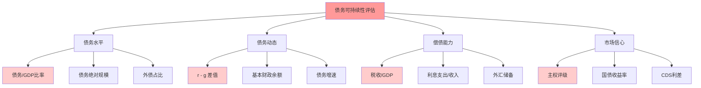
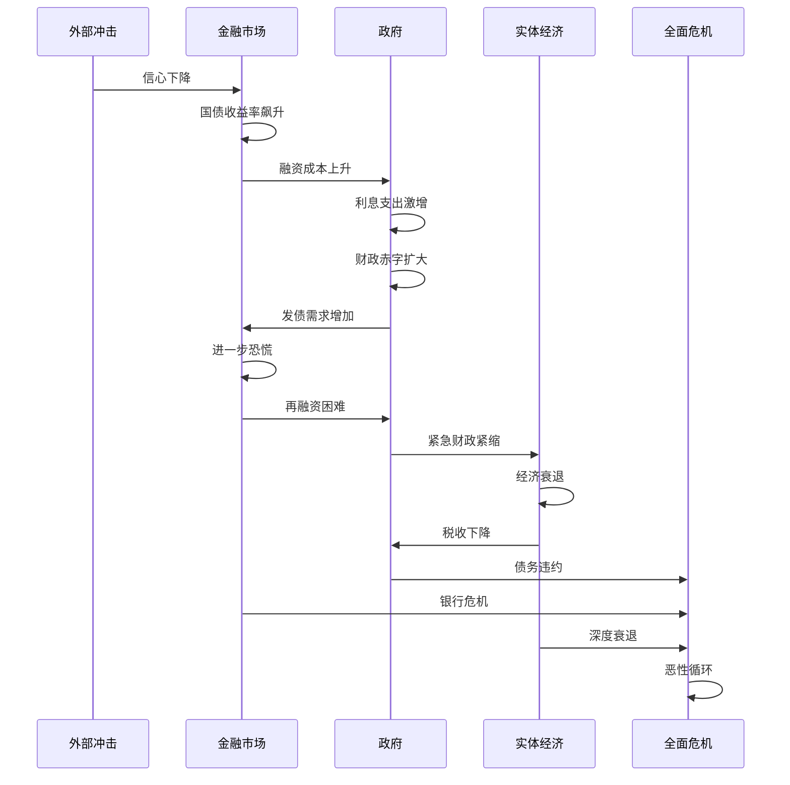

# 债务可持续性

## 概述

政府债务可持续性是指政府能够在不违约的情况下，长期偿还债务本息的能力。随着全球债务水平不断攀升，债务可持续性成为宏观经济稳定和投资决策的核心关注点。理解债务动态、评估债务风险，对于投资者至关重要。

**学习目标**：
1. 掌握债务可持续性的定义和评估标准
2. 理解债务动态方程和影响因素
3. 分析债务危机的形成机制和传导路径
4. 评估不同国家的债务风险
5. 研究历史债务危机案例和应对策略

## 债务可持续性的定义

### 基本概念

**债务可持续性**：政府能够在不违约、不过度通胀、不实施金融压抑的情况下，持续偿还债务本息的能力。

**关键要素**：
1. 偿债能力：税收收入足以支付利息
2. 市场信心：能够以合理利率借新还旧
3. 经济增长：债务增速不超过GDP增速
4. 财政纪律：赤字可控，债务趋于稳定

### 债务动态方程

**基本公式**：
$$
\Delta d_t = (r_t - g_t) \cdot d_{t-1} + pb_t
$$

其中：
- $d_t$ = 债务/GDP比率
- $r_t$ = 实际利率
- $g_t$ = 实际GDP增长率
- $pb_t$ = 基本财政赤字/GDP（不含利息支出）

**关键洞察**：
- 当 $r > g$：债务/GDP比率趋于上升（雪球效应）
- 当 $r < g$：债务/GDP比率可能下降
- 需要基本财政盈余来稳定债务

**稳定债务的条件**：
$$
pb_t = -(r_t - g_t) \cdot d_{t-1}
$$

**案例分析**：
- 假设债务/GDP = 100%，r = 3%，g = 2%
- 需要基本财政盈余 = 1% GDP
- 才能稳定债务水平

### 债务可持续性的判断标准

## 债务水平的国际比较

### 主要经济体债务状况（2023）

| 国家/地区 | 债务/GDP | 财政赤字/GDP | 利息支出/GDP | 主权评级 |
|----------|---------|-------------|-------------|---------|
| 日本 | 264% | -5.5% | 1.2% | A+ |
| 希腊 | 171% | -2.3% | 3.5% | BB+ |
| 意大利 | 144% | -5.3% | 3.8% | BBB |
| 美国 | 123% | -6.3% | 2.4% | AA+ |
| 法国 | 112% | -4.9% | 2.0% | AA |
| 英国 | 101% | -5.2% | 2.5% | AA |
| 中国 | 77% | -5.0% | 1.5% | A+ |
| 德国 | 66% | -2.5% | 0.8% | AAA |

**关键观察**：
- 发达国家普遍高债务
- 日本债务最高但利率极低
- 评级不完全取决于债务水平
- 增长潜力和制度质量很重要

### 债务阈值

**IMF研究**：
- 发达国家：债务/GDP > 90%，增长显著放缓
- 新兴市场：债务/GDP > 60%，风险上升
- 低收入国家：债务/GDP > 40%，危机概率高

**但阈值不是绝对的**：
- 日本债务260%仍可持续（本币债务、低利率）
- 希腊债务180%违约（外币债务、高利率）
- 取决于多种因素

## 影响债务可持续性的因素

### 1. 利率-增长差(r - g)

**黄金法则**：
- $r < g$：债务可持续性强
- $r > g$：债务雪球效应

**历史趋势**：
- 1980年代：r > g（高利率时代）
- 2010年代：r < g（低利率时代）
- 2020年代：r 上升，g 下降（挑战加大）

**影响因素**：
- 货币政策：宽松降低r
- 经济增长：结构改革提高g
- 人口老龄化：降低g
- 技术进步：提高g

### 2. 基本财政余额

**定义**：财政收入 - 非利息支出

**重要性**：
- 正值：债务趋于下降
- 负值：债务趋于上升
- 需要足够盈余抵消(r-g)效应

**改善途径**：
- 增加税收
- 削减支出
- 提高效率
- 经济增长

### 3. 债务结构

**本币 vs 外币债务**：
- 本币债务：可通过通胀或货币化减轻
- 外币债务：无法货币化，风险更高
- 新兴市场"原罪"：难以发行本币债务

**期限结构**：
- 短期债务：再融资风险高
- 长期债务：利率风险低
- 平均到期期限越长越好

**持有者结构**：
- 国内持有：风险较低
- 外国持有：资本外流风险
- 央行持有：货币化风险

### 4. 经济基本面

**增长潜力**：
- 人口结构
- 技术创新
- 制度质量
- 人力资本

**财政能力**：
- 税收征管能力
- 财政透明度
- 政治稳定性
- 改革意愿

**外部平衡**：
- 经常账户
- 外汇储备
- 汇率稳定性
- 资本流动

### 5. 市场信心

**信心的重要性**：
- 自我实现的预言
- 信心丧失 → 利率飙升 → 债务危机
- 信心维持 → 低利率 → 债务可持续

**影响信心的因素**：
- 主权评级
- 政策可信度
- 历史记录
- 国际支持

## 债务危机的形成机制

### 危机的触发因素

**1. 外部冲击**
- 全球金融危机
- 大宗商品价格暴跌
- 资本突然停止流入
- 贸易条件恶化

**2. 政策失误**
- 过度财政扩张
- 汇率高估
- 金融监管不力
- 结构改革滞后

**3. 市场恐慌**
- 信心丧失
- 自我实现的危机
- 羊群效应
- 流动性枯竭

### 危机的传导路径

### 债务-通缩螺旋

**Irving Fisher理论**：
1. 债务清偿 → 资产抛售
2. 资产价格下跌 → 通缩
3. 实际债务负担上升
4. 破产增加 → 信贷收缩
5. 经济衰退 → 收入下降
6. 债务负担进一步上升
7. 恶性循环

**案例：1930年代大萧条**

## 历史债务危机案例

### 拉美债务危机（1980年代）

**背景**：
- 1970年代石油美元回流
- 拉美国家大量借债
- 1979年美联储大幅加息
- 1982年墨西哥宣布无法偿债

**传导**：
- 美元升值，债务负担加重
- 大宗商品价格下跌
- 资本外流
- 多国陷入危机

**应对**：
- 债务重组
- 布雷迪债券计划
- 结构调整贷款
- "失去的十年"

**教训**：
- 外币债务风险
- 依赖外部融资的脆弱性
- 需要结构性改革

### 亚洲金融危机（1997-1998）

**背景**：
- 固定汇率制度
- 短期外债激增
- 资产泡沫
- 1997年泰铢贬值引发危机

**传导**：
- 货币贬值 → 外债负担激增
- 资本外逃
- 银行危机
- 经济崩溃

**受影响国家**：
- 泰国、印尼、韩国最严重
- 马来西亚、菲律宾
- 香港受冲击

**应对**：
- IMF救助
- 汇率浮动
- 银行重组
- 结构改革

**教训**：
- 短期外债风险
- 固定汇率脆弱性
- 需要充足外汇储备

### 欧债危机（2010-2012）

**背景**：
- 欧元区统一货币，分散财政
- 南欧国家竞争力下降
- 2008年金融危机后财政恶化
- 2009年希腊赤字造假曝光

**危机国家**：
- 希腊：债务/GDP 180%，违约重组
- 爱尔兰：银行救助导致债务飙升
- 葡萄牙：竞争力弱，赤字高
- 西班牙：房地产泡沫破裂
- 意大利：高债务，低增长

**传导机制**：
- 主权债务危机 → 银行危机
- 银行危机 → 信贷紧缩
- 信贷紧缩 → 经济衰退
- 经济衰退 → 财政恶化
- 恶性循环

**应对措施**：
- 欧洲稳定机制(ESM)
- 欧央行OMT计划（"不惜一切代价"）
- 财政紧缩
- 结构改革

**结果**：
- 希腊：深度衰退，GDP下降25%
- 其他国家逐步复苏
- 欧元区改革（银行联盟）
- 但结构性问题未完全解决

**教训**：
- 货币联盟需要财政协调
- 央行最后贷款人角色关键
- 过度紧缩有害
- 需要增长友好型改革

### 日本：高债务但可持续

**特点**：
- 债务/GDP超260%（全球最高）
- 但从未违约
- 国债收益率极低（0-0.5%）

**可持续的原因**：
1. 本币债务（可货币化）
2. 国内持有（90%+）
3. 经常账户盈余
4. 充足外汇储备
5. 央行购买国债（YCC）
6. 低通胀环境

**但面临挑战**：
- 人口老龄化加速
- 增长潜力下降
- 央行资产负债表膨胀
- 退出QE困难

**启示**：
- 债务水平不是唯一标准
- 债务结构和货币主权重要
- 但不可无限扩张

## 债务可持续性评估框架

### IMF债务可持续性分析(DSA)

**评估维度**：
1. 基线情景：债务轨迹预测
2. 压力测试：不利情景分析
3. 热力图：风险可视化
4. 政策建议：改善路径

**关键指标**：
- 债务/GDP比率及趋势
- 总融资需求/GDP
- 外债/出口比率
- 债务偿付率
- 储备/短期外债

### 主权评级方法

**三大评级机构**：
- 标普(S&P)
- 穆迪(Moody's)
- 惠誉(Fitch)

**评级因素**：
1. 制度和治理（25%）
2. 经济结构和增长（25%）
3. 外部流动性和地位（20%）
4. 财政表现和灵活性（20%）
5. 货币灵活性（10%）

**评级等级**：
- AAA/Aaa：最高信用
- AA/Aa：高信用
- A：中上信用
- BBB/Baa：中等信用（投资级最低）
- BB/Ba及以下：投机级（垃圾债券）

### 市场指标

**国债收益率**：
- 反映市场对风险的定价
- 与评级高度相关
- 但更及时

**CDS利差**：
- 信用违约互换利差
- 直接反映违约风险
- 流动性好，反应快

**汇率**：
- 贬值压力反映信心
- 外债国家尤其重要

## 应对债务问题的政策选项

### 1. 财政整顿

**增收措施**：
- 提高税率
- 扩大税基
- 加强征管
- 减少逃税

**减支措施**：
- 削减非必要支出
- 提高效率
- 养老金改革
- 公共部门改革

**挑战**：
- 短期经济阵痛
- 政治阻力大
- 需要社会共识
- 时机选择重要

### 2. 经济增长

**供给侧改革**：
- 提高生产率
- 劳动力市场改革
- 产品市场改革
- 创新和技术

**需求侧管理**：
- 出口导向
- 投资促进
- 消费升级

**优势**：
- 最可持续的方式
- 改善债务动态
- 提高生活水平

**挑战**：
- 见效慢
- 需要深层改革
- 既得利益阻碍

### 3. 通货膨胀

**机制**：
- 通胀降低实际债务负担
- 名义GDP增长
- 金融压抑（负实际利率）

**历史案例**：
- 二战后发达国家
- 通过温和通胀降低债务

**风险**：
- 失控的恶性通胀
- 损害经济
- 破坏信用
- 伤害债权人

**现代约束**：
- 央行独立性
- 通胀目标制
- 债务指数化
- 难以实施

### 4. 债务重组

**方式**：
- 延长期限
- 降低利率
- 部分减免（haircut）
- 债转股

**自愿 vs 强制**：
- 自愿重组：维护信用
- 强制重组：违约，信用受损

**案例**：
- 希腊：2012年私人部门参与(PSI)，减免53%
- 阿根廷：多次违约和重组

**后果**：
- 短期：融资困难
- 长期：信用受损
- 但可能是必要的

### 5. 货币化

**定义**：央行购买政府债券，直接融资

**方式**：
- 量化宽松(QE)
- 直接货币融资(OMF)
- 永续债

**案例**：
- 日本：央行持有国债超50%
- 疫情期间各国QE

**风险**：
- 通胀失控
- 央行独立性丧失
- 财政纪律弱化
- 汇率贬值

**现代货币理论(MMT)**：
- 主张本币债务可货币化
- 只要通胀可控
- 争议很大

## 投资者视角

### 主权债务投资

**风险评估**：
- 违约风险
- 利率风险
- 汇率风险
- 流动性风险

**收益来源**：
- 票息收入
- 资本利得
- 汇率收益

**投资策略**：
- 核心配置：高评级国家（美国、德国、日本）
- 高收益：新兴市场（风险更高）
- 分散投资：不同国家和货币
- 久期管理：利率风险控制

### 债务危机的投资机会

**危机前**：
- 识别风险信号
- 减持高风险国家债券
- 做空或买入CDS

**危机中**：
- 避险资产（美债、黄金）
- 等待底部
- 关注政策应对

**危机后**：
- 重组债券（高收益）
- 复苏国家股市
- 改革受益行业

**案例：希腊危机**
- 2010年：国债收益率飙升至30%+
- 2012年：重组，损失53%
- 2013年后：逐步复苏
- 2019年：重返市场，收益率降至2%
- 买入重组后债券的投资者获得巨额回报

### 风险信号

**早期预警**：
- 债务/GDP快速上升
- 财政赤字扩大
- 经常账户赤字
- 外汇储备下降
- CDS利差扩大
- 评级下调

**临界信号**：
- 国债收益率飙升
- 货币大幅贬值
- 资本外逃
- 银行挤兑
- 政治动荡

## 常见误区

**误区1：高债务一定违约**
- 日本债务260%未违约
- 债务结构和货币主权重要

**误区2：低债务一定安全**
- 阿根廷多次违约时债务不高
- 制度和政策更重要

**误区3：发达国家不会违约**
- 希腊是发达国家但违约
- 没有绝对安全

**误区4：债务可以无限货币化**
- 通胀约束
- 汇率约束
- 信用约束

## 延伸阅读

### 经典著作

1. **《这次不一样》** - Carmen Reinhart & Kenneth Rogoff
   - 800年金融危机史
   - 债务危机规律

2. **《债务和魔鬼》** - Adair Turner
   - 债务、货币和金融危机

3. **《主权债务危机》** - Ugo Panizza
   - 系统分析主权债务

### 研究报告

1. IMF Fiscal Monitor - 全球债务分析
2. World Bank Debt Report - 发展中国家债务
3. BIS Quarterly Review - 国际债务趋势

### 实时数据

1. **IMF数据库** - 全球债务数据
2. **世界银行数据库** - 发展中国家债务
3. **各国财政部** - 债务详细信息
4. **Bloomberg/Reuters** - 市场数据

## 参考文献

1. Reinhart, C. M., & Rogoff, K. S. (2009). *This Time Is Different: Eight Centuries of Financial Folly*. Princeton University Press.
2. IMF (2023). *Fiscal Monitor: Debt in a Time of High Inflation*. International Monetary Fund.
3. Blanchard, O. (2019). "Public Debt and Low Interest Rates." *American Economic Review*, 109(4), 1197-1229.
4. Eichengreen, B., & Portes, R. (1995). *Crisis? What Crisis? Orderly Workouts for Sovereign Debtors*. CEPR.
5. Alesina, A., & Ardagna, S. (2010). "Large Changes in Fiscal Policy: Taxes versus Spending." *Tax Policy and the Economy*, 24(1), 35-68.
6. Ghosh, A. R., et al. (2013). "Fiscal Fatigue, Fiscal Space and Debt Sustainability in Advanced Economies." *Economic Journal*, 123(566), F4-F30.
7. Turner, A. (2015). *Between Debt and the Devil: Money, Credit, and Fixing Global Finance*. Princeton University Press.
8. Panizza, U., Sturzenegger, F., & Zettelmeyer, J. (2009). "The Economics and Law of Sovereign Debt and Default." *Journal of Economic Literature*, 47(3), 651-698.
9. Obstfeld, M. (2013). "Finance at Center Stage: Some Lessons of the Euro Crisis." *European Economy - Economic Papers*, No. 493.
10. Krugman, P. (1988). "Financing vs. Forgiving a Debt Overhang." *Journal of Development Economics*, 29(3), 253-268.

## 深度分析

### 核心机制解析

理解本主题需要从多个维度进行系统性分析。以下从理论基础、实践应用和历史验证三个层面展开深度探讨。

**理论基础层面**：本主题的核心逻辑建立在经济学和金融学的基本原理之上。通过对基础理论的深入理解，投资者能够建立起稳固的分析框架，避免被市场短期噪音所干扰。

**实践应用层面**：理论必须与实践相结合才能产生价值。在实际投资决策中，需要将抽象的概念转化为具体的分析工具和决策标准。

**历史验证层面**：金融市场有着丰富的历史记录，通过研究历史案例，我们可以验证理论的有效性，并从中提炼出具有普遍意义的规律。

### 关键影响因素

影响本主题的关键因素可以从以下几个维度进行分析：

1. **宏观经济环境**：利率水平、通货膨胀率、经济增长速度等宏观变量对本主题有着深远影响。在不同的宏观经济周期中，相关指标的表现会呈现出显著差异。

2. **市场结构因素**：市场参与者的构成、信息传播机制、流动性状况等市场结构因素决定了价格发现的效率和准确性。

3. **政策监管环境**：政府政策、监管框架的变化会直接影响相关市场的运作规则和参与者行为。

4. **技术创新驱动**：技术进步不断改变着金融市场的运作方式，从算法交易到区块链技术，每一次技术革新都带来新的机遇和挑战。

5. **全球化与地缘政治**：在全球化背景下，各国市场之间的联动性日益增强，地缘政治风险的影响也越来越不可忽视。

### 量化分析框架

为了更精确地分析和评估，可以采用以下量化框架：

| 分析维度 | 关键指标 | 参考基准 | 分析方法 |
|---------|---------|---------|---------|
| 规模评估 | 绝对值与相对值 | 历史均值 | 趋势分析 |
| 质量评估 | 稳定性指标 | 行业对标 | 横向比较 |
| 风险评估 | 波动率指标 | 风险阈值 | 情景分析 |
| 价值评估 | 估值倍数 | 历史区间 | 回归分析 |

通过系统性地应用上述框架，投资者可以对目标进行全面、客观的评估，从而做出更加理性的投资决策。

## 高级分析与前沿研究

### 学术研究进展

近年来，学术界对本领域的研究取得了重要进展。以下是几个值得关注的研究方向：

**行为金融学视角**：传统金融理论假设市场参与者是完全理性的，但行为金融学的研究表明，认知偏差和情绪因素在投资决策中扮演着重要角色。诺贝尔经济学奖得主丹尼尔·卡尼曼（Daniel Kahneman）和理查德·塞勒（Richard Thaler）的研究为我们理解市场非理性行为提供了重要框架。

**因子投资研究**：尤金·法玛（Eugene Fama）和肯尼斯·弗伦奇（Kenneth French）的三因子模型，以及后续发展的五因子模型，为系统性地解释股票收益差异提供了理论基础。这些研究表明，市值、账面市值比、盈利能力和投资模式等因子能够解释大部分股票收益的横截面差异。

**市场微观结构研究**：对市场流动性、价格发现机制和交易成本的深入研究，帮助我们更好地理解市场的运作机制，并为优化交易策略提供指导。

### 实战案例深度解析

**案例一：长期价值创造的典范**

以沃伦·巴菲特（Warren Buffett）的伯克希尔·哈撒韦（Berkshire Hathaway）为例，其长达数十年的卓越投资业绩证明了价值投资理念的有效性。从1965年至今，伯克希尔的账面价值年均增长率约为19.8%，远超同期标普500指数的约10.2%年均回报。

巴菲特的成功秘诀在于：
- 专注于具有持久竞争优势的优质企业
- 以合理价格买入，而非追求最低价格
- 长期持有，让复利效应充分发挥
- 保持充足的安全边际，控制下行风险

**案例二：危机中的机遇识别**

2008年金融危机期间，大多数投资者恐慌性抛售，但少数具有前瞻性的投资者却在危机中发现了历史性的投资机会。约翰·保尔森（John Paulson）通过做空次级抵押贷款相关证券，在危机中获得了约150亿美元的利润，成为金融史上最成功的单笔交易之一。

这个案例告诉我们：
- 深入的基本面研究能够发现市场定价错误
- 逆向思维往往能够发现被市场忽视的机会
- 风险管理和仓位控制是成功的关键

### 跨市场比较分析

不同市场在结构、监管、投资者构成等方面存在显著差异，这些差异对投资策略的选择有重要影响：

**美国市场特征**：
- 机构投资者主导，市场效率较高
- 信息披露制度完善，分析师覆盖广泛
- 衍生品市场发达，对冲工具丰富
- 长期牛市历史，但也经历过多次重大调整

**中国市场特征**：
- 散户投资者比例较高，市场波动性较大
- 政策因素影响显著，需要密切关注监管动向
- 新兴行业发展迅速，成长投资机会丰富
- A股、港股、美股中概股形成多层次市场体系

**欧洲市场特征**：
- 价值股比例较高，估值相对保守
- 受地缘政治和欧元区政策影响较大
- 部分行业（如奢侈品、工业）具有全球竞争优势
- ESG投资理念推广较为领先

