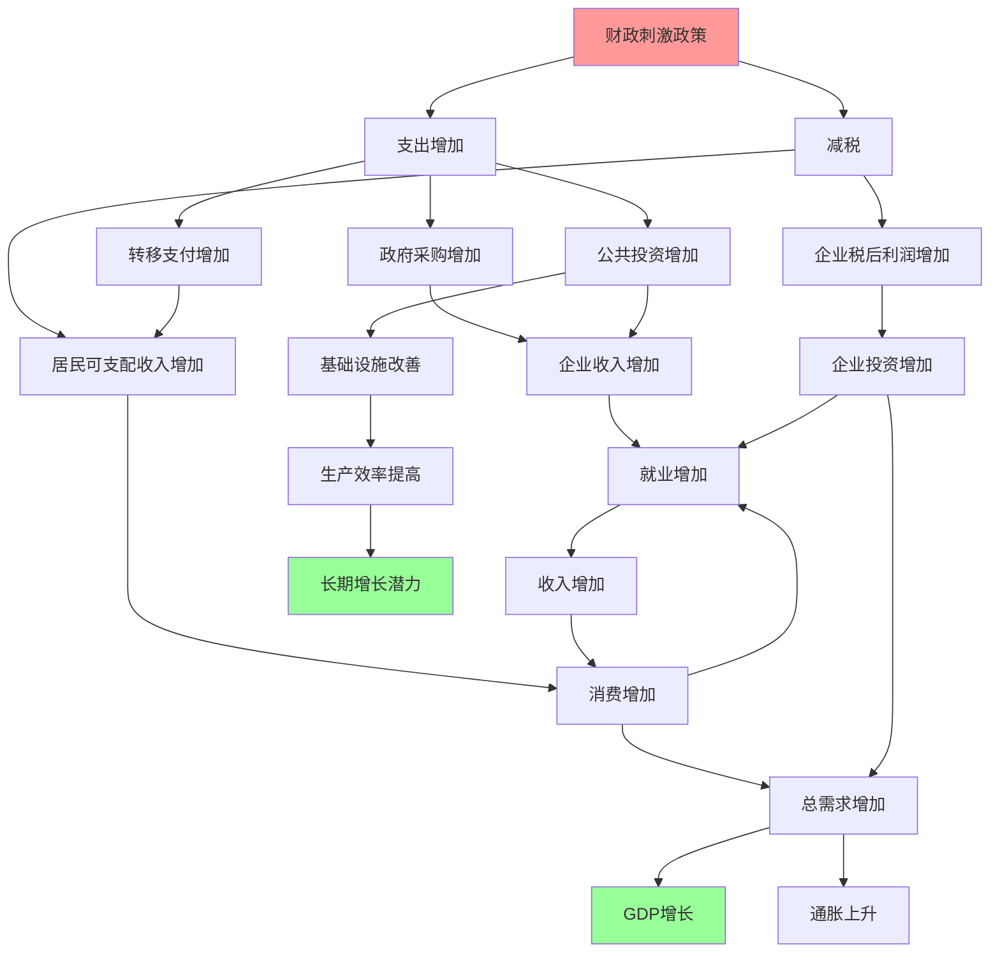

# 财政刺激

## 概述

财政刺激是政府在经济衰退或增长乏力时，通过扩大支出或减税来刺激总需求、促进经济复苏的政策措施。2008年金融危机和2020年新冠疫情期间，全球主要经济体都实施了大规模财政刺激，其效果和副作用值得深入研究。

**学习目标**：
1. 理解财政刺激的理论基础和政策工具
2. 掌握财政刺激的传导机制和乘数效应
3. 分析不同类型刺激措施的效果差异
4. 评估财政刺激的时机、规模和退出策略
5. 研究主要经济体的财政刺激实践和经验教训

## 财政刺激的理论基础

### 凯恩斯主义理论

**核心观点**：
- 经济衰退源于总需求不足
- 市场无法自动恢复充分就业
- 政府应主动干预，刺激需求
- 短期内财政政策比货币政策更有效

**有效需求原理**：
$$
Y = C + I + G + (X - M)
$$

其中：
- Y = 总产出
- C = 消费
- I = 投资
- G = 政府支出
- X - M = 净出口

**政策含义**：
- 衰退时：增加G或减税提高C
- 通过乘数效应放大影响
- 弥补私人部门需求缺口

### 乘数效应

**财政支出乘数**：
$$
k = \frac{1}{1 - MPC(1-t) + MPM}
$$

其中：
- MPC = 边际消费倾向
- t = 税率
- MPM = 边际进口倾向

**税收乘数**：
$$
k_t = \frac{-MPC}{1 - MPC(1-t) + MPM}
$$

**关键洞察**：
- 支出乘数 > 税收乘数（绝对值）
- 增加支出比减税效果更直接
- 但减税可能更受欢迎

### 自动稳定器 vs 相机抉择

**自动稳定器**：
- 无需政策调整自动发挥作用
- 例：累进税制、失业保险
- 优点：及时、无政策滞后
- 缺点：力度有限

**相机抉择**：
- 根据经济形势主动调整政策
- 例：刺激计划、减税方案
- 优点：力度可控、针对性强
- 缺点：存在认识、决策、执行滞后

## 财政刺激的政策工具

### 支出端刺激

**1. 基础设施投资**
- 特点：
  - 乘数效应大（1.5-2.0）
  - 创造就业
  - 形成长期资产
  - 见效相对较慢
- 适用：经济深度衰退、基建缺口大
- 案例：中国"四万亿"、美国新政

**2. 转移支付**
- 特点：
  - 见效快
  - 针对性强
  - 乘数效应中等（0.8-1.2）
  - 不形成资产
- 类型：
  - 失业救济
  - 现金补贴
  - 食品券
  - 租金补助
- 适用：紧急救助、精准扶贫

**3. 政府消费**
- 特点：
  - 直接增加需求
  - 乘数效应稳定（1.0-1.5）
  - 可能挤出私人消费
- 包括：
  - 公共服务扩大
  - 政府采购增加
  - 公务员加薪

### 税收端刺激

**1. 个人所得税减免**
- 方式：
  - 降低税率
  - 提高起征点
  - 增加扣除额
  - 退税
- 效果：
  - 增加可支配收入
  - 乘数效应较小（0.5-1.0）
  - 高收入者储蓄率高，效果打折

**2. 企业税收优惠**
- 方式：
  - 降低企业所得税率
  - 加速折旧
  - 投资税收抵免
  - 研发费用加计扣除
- 效果：
  - 提高企业利润
  - 鼓励投资
  - 创造就业
  - 见效较慢

**3. 消费税减免**
- 方式：
  - 降低增值税、消费税
  - 购置补贴（汽车、家电）
- 效果：
  - 刺激消费
  - 见效快
  - 可能透支未来需求

### 刺激工具对比

| 工具类型 | 乘数效应 | 见效速度 | 持续时间 | 针对性 | 政治可行性 |
|---------|---------|---------|---------|--------|-----------|
| 基建投资 | 高(1.5-2.0) | 慢(6-12月) | 长 | 中 | 中 |
| 转移支付 | 中(0.8-1.2) | 快(1-3月) | 短 | 高 | 高 |
| 政府消费 | 中(1.0-1.5) | 中(3-6月) | 中 | 低 | 中 |
| 个税减免 | 低(0.5-1.0) | 中(3-6月) | 中 | 低 | 高 |
| 企业税优惠 | 中(0.8-1.5) | 慢(6-12月) | 长 | 中 | 中 |
| 消费税减免 | 中(1.0-1.5) | 快(1-3月) | 短 | 中 | 高 |

## 财政刺激的传导机制

### 关键传导环节

**1. 流动性约束**
- 低收入家庭：流动性约束强，MPC高
- 高收入家庭：流动性约束弱，MPC低
- 政策启示：向低收入群体转移支付效果更好

**2. 预期效应**
- 永久性政策：改变长期预期，效果强
- 临时性政策：效果打折
- 政策可信度影响效果

**3. 信心渠道**
- 大规模刺激 → 提振市场信心
- 稳定预期 → 鼓励投资消费
- 避免恐慌性储蓄

**4. 金融加速器**
- 需求增加 → 企业盈利改善
- 资产负债表修复 → 融资能力提升
- 投资扩大 → 放大刺激效果

## 财政刺激的效果评估

### 成功的条件

**1. 时机选择**
- 经济深度衰退时效果最好
- 产能利用率低
- 失业率高
- 通胀压力小

**2. 规模适当**
- 足够大以弥补需求缺口
- 不过度导致通胀和债务危机
- 经验法则：产出缺口的1-2倍

**3. 结构合理**
- 支出和减税组合
- 短期救助 + 长期投资
- 针对性强的措施

**4. 政策协调**
- 货币政策配合（宽松）
- 避免挤出效应
- 国际政策协调

**5. 执行效率**
- 快速实施
- 减少浪费和腐败
- 透明度和问责制

### 效果的衡量指标

**短期指标**：
- GDP增长率
- 就业增长
- 消费和投资变化
- 企业和消费者信心

**长期指标**：
- 潜在产出增长
- 全要素生产率
- 债务可持续性
- 收入分配

**成本效益分析**：
- 每单位刺激创造的GDP
- 每单位刺激创造的就业
- 债务增加的代价
- 长期增长效应

## 历史案例分析

### 美国大萧条与罗斯福新政（1933-1939）

**背景**：
- 1929年股市崩盘
- 1933年失业率达25%
- GDP下降30%
- 银行大量倒闭

**政策措施**：
- 公共工程计划(PWA, WPA)
- 农业调整法(AAA)
- 社会保障法案
- 银行改革

**效果**：
- 1933-1937年GDP年均增长9%
- 失业率降至14%
- 但1937-1938年再次衰退
- 二战支出最终结束大萧条

**教训**：
- 财政刺激需要持续
- 过早退出导致二次衰退
- 需要结构性改革配合

### 日本"失去的十年"（1990s-2000s）

**背景**：
- 1990年资产泡沫破裂
- 银行坏账严重
- 通缩和经济停滞

**政策措施**：
- 10次财政刺激计划
- 总规模超100万亿日元
- 大量基建投资
- 多次减税

**效果**：
- 短期提振，长期效果有限
- GDP增长率长期低迷
- 公共债务飙升至GDP的200%+
- 陷入"流动性陷阱"

**教训**：
- 财政刺激无法解决结构性问题
- 需要银行体系改革
- 需要货币政策配合
- 避免"僵尸企业"存续

### 2008年金融危机应对

**美国：ARRA（2009）**
- 规模：7870亿美元（GDP的5.5%）
- 构成：
  - 减税：2880亿（37%）
  - 转移支付：2240亿（28%）
  - 基建和其他支出：2750亿（35%）
- 效果：
  - 创造/保留200-300万就业
  - GDP增长2-3个百分点
  - 避免更深度衰退
  - 但复苏缓慢

**中国："四万亿"（2008-2010）**
- 规模：4万亿人民币（GDP的13%）
- 构成：
  - 基础设施：1.8万亿（45%）
  - 灾后重建：1万亿（25%）
  - 民生工程：0.4万亿（10%）
  - 其他：0.8万亿（20%）
- 效果：
  - 2009年GDP增长9.4%
  - 率先走出危机
  - 但产能过剩、债务高企
  - 房地产泡沫

**欧盟：财政紧缩**
- 2010年后转向紧缩
- 削减赤字和债务
- 结果：
  - 经济二次衰退
  - 失业率高企
  - 社会动荡
- 教训：过早紧缩有害

### 2020年新冠疫情应对

**美国：史无前例的刺激**
- CARES Act（2020年3月）：2.2万亿
- 后续法案：累计超5万亿
- 措施：
  - 直接现金补贴（每人1400美元）
  - 失业救济增强
  - PPP小企业贷款
  - 州和地方政府援助
- 效果：
  - 2021年GDP增长5.9%
  - 快速复苏
  - 但通胀飙升至9%
  - 债务/GDP升至130%

**欧盟：共同发债**
- 7500亿欧元复苏基金
- 首次共同发债
- 标志性突破
- 支持绿色和数字转型

**中国：精准施策**
- 规模相对温和
- 结构性政策为主
- 避免"大水漫灌"
- 2020年GDP增长2.2%（唯一正增长主要经济体）

**共同特点**：
- 规模空前
- 速度极快
- 货币政策极度宽松配合
- 避免了大萧条式崩溃
- 但留下通胀和债务问题

## 财政刺激的副作用

### 1. 债务积累

**机制**：
- 刺激需要借债融资
- 债务/GDP比率上升
- 利息负担增加

**风险**：
- 债务可持续性问题
- 主权债务危机
- 挤占未来财政空间
- 代际不公平

**案例**：
- 日本：债务/GDP超250%
- 希腊：债务危机
- 美国：债务/GDP从60%升至130%

### 2. 通货膨胀

**传导路径**：
- 需求增加 > 供给能力
- 产能利用率接近100%
- 劳动力市场紧张
- 价格和工资螺旋上升

**2021-2022年通胀**：
- 美国：CPI达9.1%（40年新高）
- 欧元区：CPI达10.6%
- 原因：
  - 疫情刺激过度
  - 供应链中断
  - 能源价格飙升
  - 劳动力短缺

### 3. 资产泡沫

**机制**：
- 流动性泛滥
- 低利率环境
- 资金流向资产市场
- 估值脱离基本面

**表现**：
- 股市估值过高
- 房地产价格暴涨
- 加密货币泡沫
- 收入不平等加剧

### 4. 资源错配

**问题**：
- 政府投资效率低于私人部门
- "面子工程"和浪费
- 僵尸企业存续
- 产能过剩

**中国案例**：
- 四万亿后产能过剩
- 钢铁、水泥、煤炭行业
- 地方债务激增
- 房地产泡沫

### 5. 道德风险

**表现**：
- 企业依赖政府救助
- 不进行必要的结构调整
- "大而不倒"问题
- 市场纪律弱化

**金融危机教训**：
- 救助银行导致道德风险
- 鼓励过度冒险
- 需要配套监管改革

## 退出策略

### 退出的时机

**过早退出**：
- 经济二次衰退
- 欧洲2010-2012年教训
- 日本1997年增税失败

**过晚退出**：
- 通胀失控
- 债务危机
- 资产泡沫

**判断标准**：
- 产出缺口基本消除
- 失业率接近自然率
- 通胀稳定在目标水平
- 私人部门需求恢复

### 退出的方式

**1. 渐进式退出**
- 逐步减少刺激规模
- 给市场适应时间
- 避免"财政悬崖"
- 推荐方式

**2. 自动退出**
- 设定日落条款
- 经济复苏后自动终止
- 减少政治阻力

**3. 结构性改革**
- 提高财政收入（税改）
- 优化支出结构
- 提高效率
- 长期可持续

### 退出的挑战

**政治阻力**：
- 受益群体反对
- 选举周期影响
- 短期痛苦

**经济风险**：
- 增长放缓
- 失业率反弹
- 市场波动

**协调问题**：
- 货币政策配合
- 国际政策协调
- 避免竞争性贬值

## 投资者视角

### 刺激政策对市场的影响

**股市**：
- 短期：大幅上涨（流动性和增长预期）
- 中期：取决于经济复苏
- 长期：警惕通胀和加息

**受益行业**：
- 基建刺激：建筑、建材、机械
- 消费刺激：零售、汽车、家电
- 科技投资：半导体、新能源、5G

**债市**：
- 短期：收益率下降（避险需求）
- 中期：收益率上升（供给增加、通胀预期）
- 长期：取决于债务可持续性

**大宗商品**：
- 基建需求 → 工业金属上涨
- 通胀预期 → 黄金上涨
- 能源需求 → 油价上涨

### 投资策略

**刺激宣布期**：
- 增配股票，尤其是周期股
- 减配债券（收益率上升）
- 增配大宗商品

**刺激实施期**：
- 关注政策受益板块
- 警惕估值过高
- 分散投资

**刺激退出期**：
- 转向防御性资产
- 增配债券
- 关注加息影响

**长期配置**：
- 关注结构性机会（新基建、绿色经济）
- 警惕债务风险高的国家
- 配置通胀对冲资产

## 常见误区

**误区1：刺激越大越好**
- 忽视债务可持续性
- 忽视通胀风险
- 忽视资源错配

**误区2：刺激无效**
- 忽视衰退期的特殊性
- 忽视乘数效应
- 混淆短期和长期

**误区3：刺激可以解决所有问题**
- 无法解决结构性问题
- 无法替代改革
- 需要配套政策

**误区4：刺激一定导致通胀**
- 取决于产出缺口
- 取决于货币政策
- 日本QE未导致通胀

## 延伸阅读

### 经典著作

1. **《就业、利息和货币通论》** - John Maynard Keynes
   - 财政刺激理论基础

2. **《萧条经济学的回归》** - Paul Krugman
   - 现代财政刺激分析

3. **《这次不一样》** - Carmen Reinhart & Kenneth Rogoff
   - 金融危机和政策应对

### 研究报告

1. IMF Fiscal Monitor - 全球财政政策分析
2. OECD Economic Outlook - 刺激政策评估
3. CBO Reports - 美国刺激政策分析

### 实时资源

1. **各国财政部官网** - 刺激计划详情
2. **IMF数据库** - 全球财政数据
3. **FRED数据库** - 美国经济数据

## 参考文献

1. Keynes, J. M. (1936). *The General Theory of Employment, Interest and Money*. Macmillan.
2. Romer, C. D., & Romer, D. H. (2010). "The Macroeconomic Effects of Tax Changes: Estimates Based on a New Measure of Fiscal Shocks." *American Economic Review*, 100(3), 763-801.
3. Auerbach, A. J., & Gorodnichenko, Y. (2012). "Fiscal Multipliers in Recession and Expansion." In *Fiscal Policy after the Financial Crisis* (pp. 63-98). University of Chicago Press.
4. Blanchard, O., & Leigh, D. (2013). "Growth Forecast Errors and Fiscal Multipliers." *American Economic Review*, 103(3), 117-120.
5. Ramey, V. A. (2019). "Ten Years After the Financial Crisis: What Have We Learned from the Renaissance in Fiscal Research?" *Journal of Economic Perspectives*, 33(2), 89-114.
6. IMF (2023). *Fiscal Monitor: Helping People Bounce Back*. International Monetary Fund.
7. CBO (2023). *Estimated Impact of the American Recovery and Reinvestment Act*. Congressional Budget Office.
8. Reinhart, C. M., & Rogoff, K. S. (2009). *This Time Is Different: Eight Centuries of Financial Folly*. Princeton University Press.
9. Krugman, P. (2009). *The Return of Depression Economics and the Crisis of 2008*. W.W. Norton & Company.
10. Eichengreen, B., & O'Rourke, K. H. (2010). "A Tale of Two Depressions: What Do the New Data Tell Us?" *VoxEU.org*, March 8.
