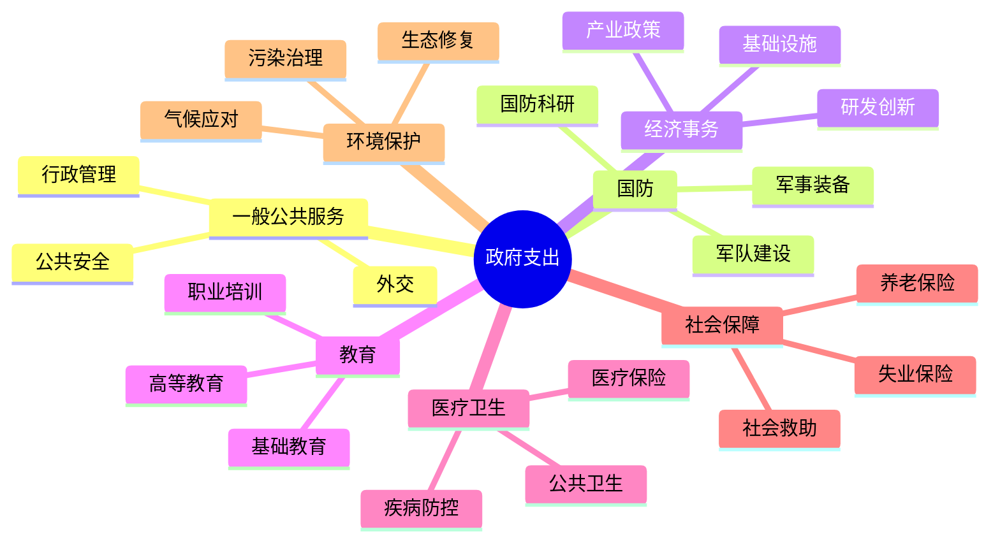
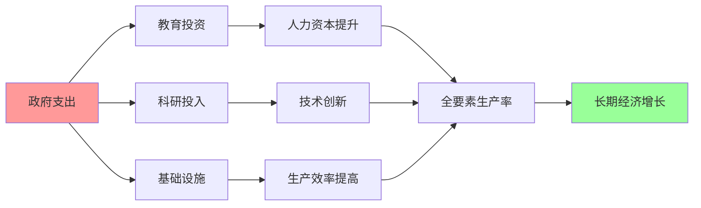
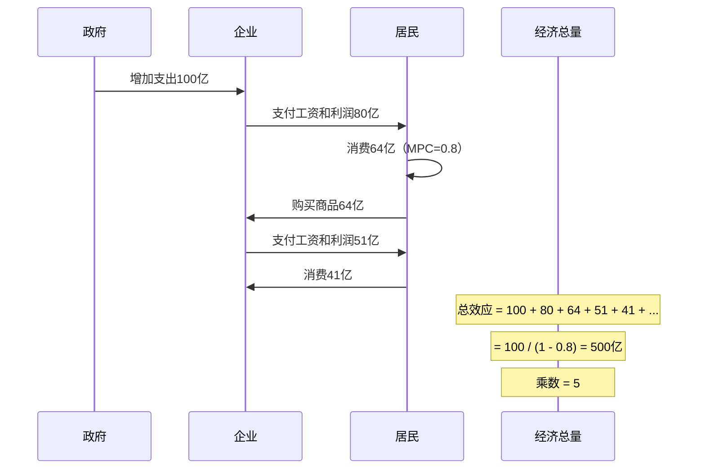
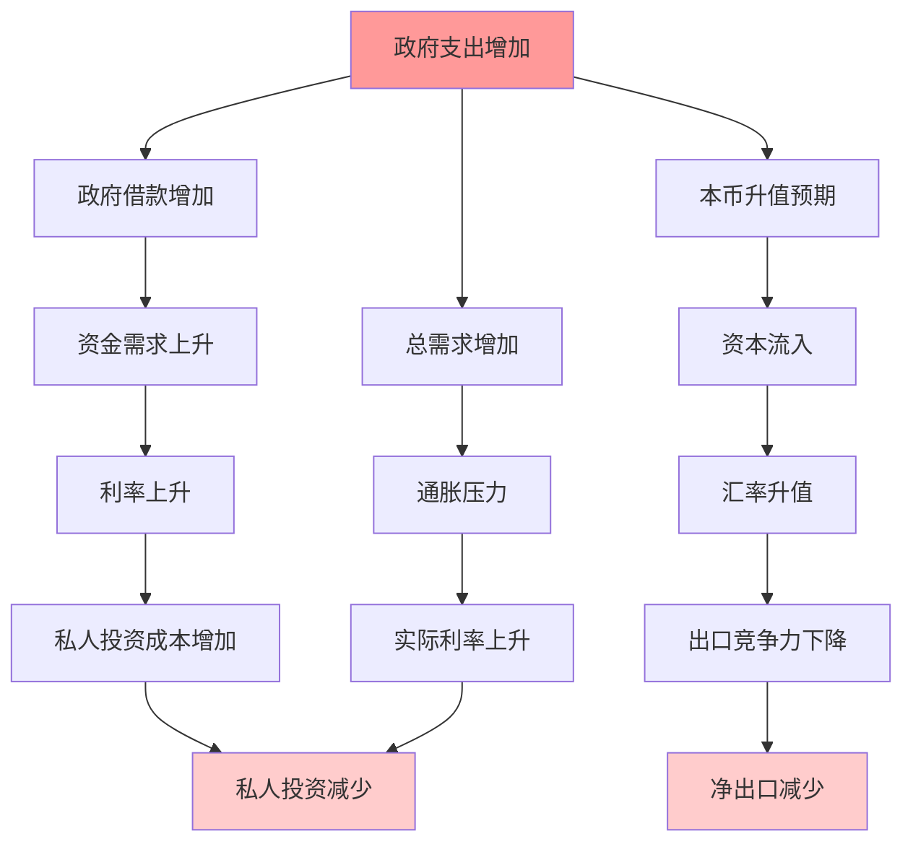

# 政府支出分析

## 概述

政府支出是财政政策的核心工具之一，通过公共资金的配置和使用，政府可以直接影响总需求、资源配置和收入分配。理解政府支出的构成、功能和经济效应，对于分析宏观经济走势和投资决策至关重要。

**学习目标**：
1. 掌握政府支出的分类和构成
2. 理解政府支出的经济功能
3. 分析财政乘数效应的原理和影响因素
4. 评估不同类型支出的经济效果
5. 认识主要经济体的政府支出特点

## 政府支出的分类

### 按经济性质分类

**1. 消费性支出**
- 定义：政府日常运作和提供公共服务的支出
- 包括：
  - 公务员工资和福利
  - 办公费用和行政开支
  - 公共服务运营成本
  - 国防日常开支
- 特点：经常性、刚性、不形成资产

**2. 投资性支出（资本支出）**
- 定义：形成固定资产的支出
- 包括：
  - 基础设施建设（道路、桥梁、机场）
  - 公共设施投资（学校、医院、公园）
  - 科技研发投入
  - 国防装备采购
- 特点：一次性、可调整、形成资产、长期效益

**3. 转移支付**
- 定义：政府无偿转移给个人或机构的支出
- 包括：
  - 社会保障（养老金、失业救济）
  - 医疗补贴
  - 教育补助
  - 农业补贴
  - 企业补贴
- 特点：再分配功能、不直接购买商品和服务

### 按功能分类

### 主要经济体支出结构对比

| 支出类别 | 美国 | 欧盟 | 中国 | 日本 |
|---------|------|------|------|------|
| 社会保障 | 35% | 40% | 25% | 38% |
| 医疗卫生 | 25% | 15% | 7% | 20% |
| 教育 | 13% | 10% | 15% | 9% |
| 国防 | 15% | 3% | 6% | 2% |
| 基础设施 | 4% | 8% | 20% | 6% |
| 其他 | 8% | 24% | 27% | 25% |

**特点分析**：
- 美国：社保和医疗占比高，国防支出大
- 欧盟：福利支出占主导，国防较低
- 中国：基础设施投资比重大，社保占比相对较低但快速增长
- 日本：老龄化导致社保支出高企

## 政府支出的经济功能

### 1. 资源配置功能

**市场失灵的矫正**：
- 公共产品提供（国防、司法、基础设施）
- 外部性内部化（环保、教育、科研）
- 自然垄断管理（公用事业）
- 信息不对称纠正（食品安全监管）

**案例：基础设施投资**
- 私人部门投资不足（回报周期长、外部性大）
- 政府投资高速公路、高铁、机场
- 降低全社会交易成本
- 促进经济一体化和增长

### 2. 收入分配功能

**再分配机制**：
- 累进税收 + 转移支付
- 社会保障体系
- 教育和医疗补贴
- 区域平衡发展

**效果**：
- 缩小贫富差距
- 提高社会公平
- 增强社会稳定
- 扩大中等收入群体

### 3. 经济稳定功能

**自动稳定器**：
- 失业保险（经济下行时支出自动增加）
- 累进税制（收入下降时税负自动减轻）
- 农产品价格支持
- 社会救助

**相机抉择**：
- 反周期调节
- 经济衰退时扩大支出
- 经济过热时压缩支出
- 熨平经济波动

### 4. 经济增长功能

**长期增长支持**：
- 教育投资（人力资本）
- 科研投入（技术进步）
- 基础设施（生产效率）
- 产业政策（结构优化）

**增长路径**：

## 财政乘数效应

### 乘数原理

**定义**：政府支出增加1单位，最终导致国民收入增加超过1单位的现象。

**基本公式**：
$$
\text{财政乘数} = \frac{1}{1 - MPC \times (1 - t)}
$$

其中：
- MPC = 边际消费倾向
- t = 税率

**传导机制**：

### 影响乘数大小的因素

**1. 边际消费倾向(MPC)**
- MPC越高，乘数越大
- 低收入群体MPC高（接近1）
- 高收入群体MPC低（储蓄率高）
- 政策启示：向低收入群体转移支付效果更好

**2. 税率**
- 税率越高，乘数越小
- 税收漏出减少可支配收入
- 累进税制降低乘数效应

**3. 进口倾向**
- 进口倾向越高，乘数越小
- 支出流向国外，国内乘数效应减弱
- 开放经济体乘数小于封闭经济体

**4. 经济周期阶段**
- 衰退期：产能过剩，乘数大（1.5-2.0）
- 繁荣期：接近充分就业，乘数小（0.5-1.0）
- 挤出效应在繁荣期更明显

**5. 货币政策配合**
- 宽松货币政策：乘数大
- 紧缩货币政策：挤出效应，乘数小
- 零利率下限：乘数最大

### 不同支出类型的乘数

| 支出类型 | 短期乘数 | 长期乘数 | 特点 |
|---------|---------|---------|------|
| 基础设施投资 | 1.5-2.0 | 2.0-3.0 | 见效慢，持续时间长 |
| 转移支付 | 0.8-1.2 | 1.0-1.5 | 见效快，但效果递减 |
| 政府消费 | 1.0-1.5 | 1.0-1.5 | 效果稳定 |
| 国防支出 | 0.6-1.0 | 0.5-0.8 | 乘数较小 |
| 教育科研 | 1.0-1.5 | 3.0-5.0 | 长期效果显著 |

## 挤出效应

### 定义与机制

**挤出效应**：政府支出增加导致私人投资减少的现象。

**传导路径**：

### 挤出效应的大小

**完全挤出**（极端情况）：
- 条件：充分就业、货币供给固定
- 结果：政府支出完全替代私人支出
- 总需求不变，只是结构调整

**部分挤出**（常见情况）：
- 条件：经济未充分就业
- 结果：私人投资部分减少
- 净效应仍为正

**零挤出**（特殊情况）：
- 条件：严重衰退、零利率下限
- 结果：私人投资不受影响
- 财政政策效果最大

### 减少挤出效应的方法

1. **货币政策配合**：央行增加货币供给，稳定利率
2. **利用闲置资源**：经济衰退期实施扩张政策
3. **提高支出效率**：投资于高回报项目
4. **国际资本流动**：开放经济体可吸引外资

## 政府支出效率

### 效率评估指标

**1. 投入产出比**
- 单位支出带来的GDP增长
- 公共服务覆盖率
- 基础设施利用率

**2. 社会效益**
- 教育水平提升
- 健康指标改善
- 贫困率下降
- 环境质量提高

**3. 财政可持续性**
- 债务/GDP比率
- 财政赤字水平
- 长期财政平衡

### 提高支出效率的途径

**1. 优化支出结构**
- 增加生产性支出（教育、科研、基建）
- 控制行政成本
- 提高转移支付精准度

**2. 加强预算管理**
- 绩效预算制度
- 支出评估和审计
- 透明度和问责制

**3. 推进体制改革**
- 简政放权
- 政府职能转变
- 公共服务市场化

**4. 利用技术创新**
- 数字政府建设
- 大数据精准施策
- 人工智能提升效率

## 主要经济体的政府支出特点

### 美国：市场主导型

**特点**：
- 政府支出占GDP比重相对较低（约35%）
- 国防支出全球最高
- 社保和医疗支出快速增长
- 基础设施投资不足

**挑战**：
- 财政赤字长期高企
- 债务上限争议
- 社保体系可持续性
- 基建老化

### 欧盟：福利国家型

**特点**：
- 政府支出占GDP比重高（45-55%）
- 社会福利体系完善
- 教育和医疗公共化程度高
- 区域发展相对均衡

**挑战**：
- 高福利导致财政压力
- 人口老龄化加剧负担
- 经济增长动力不足
- 债务危机风险

### 中国：发展导向型

**特点**：
- 基础设施投资比重大
- 经济建设支出占主导
- 社保支出快速增长
- 中央和地方分权明显

**转型**：
- 从投资驱动向消费驱动
- 加大民生领域投入
- 提高社保覆盖和水平
- 优化支出结构

### 日本：老龄化应对型

**特点**：
- 社保支出占比极高
- 公共债务全球最高
- 基建投资用于刺激经济
- 财政可持续性堪忧

**困境**：
- 人口老龄化加速
- 财政赤字难以控制
- 经济增长乏力
- 债务货币化风险

## 投资者视角

### 政府支出对市场的影响

**股市**：
- 扩张性支出 → 经济增长预期 → 股市上涨
- 基建投资 → 相关行业受益（建筑、建材、机械）
- 科技投入 → 科技股长期利好
- 国防支出 → 军工股受益

**债市**：
- 支出增加 → 发债需求上升 → 债券收益率上升
- 挤出效应 → 利率上升 → 债券价格下跌
- 但经济增长 → 信用风险下降

**汇率**：
- 短期：支出增加 → 经济向好 → 本币升值
- 长期：财政赤字 → 债务担忧 → 本币贬值

### 投资策略

**扩张期**：
- 增配周期性行业（建筑、机械、材料）
- 关注政策受益板块
- 适度配置通胀对冲资产

**紧缩期**：
- 转向防御性行业（医药、消费）
- 增配债券
- 关注财政整顿影响

**长期配置**：
- 关注政府支出方向（科技、新能源、医疗）
- 投资于政策支持的新兴产业
- 警惕财政不可持续的国家

## 常见误区

**误区1：政府支出越多越好**
- 忽视挤出效应
- 忽视效率问题
- 忽视债务可持续性

**误区2：政府支出无效**
- 忽视市场失灵
- 忽视公共产品的必要性
- 忽视长期增长效应

**误区3：财政乘数是常数**
- 乘数随经济周期变化
- 不同支出类型乘数不同
- 受货币政策影响

**误区4：基建投资一定有效**
- 需要考虑项目质量
- 需要考虑债务负担
- 需要考虑维护成本

## 延伸阅读

### 经典著作

1. **《就业、利息和货币通论》** - John Maynard Keynes
   - 财政政策理论基础
   - 乘数效应原理

2. **《公共财政学》** - Harvey S. Rosen & Ted Gayer
   - 政府支出系统分析
   - 效率与公平

3. **《财政学》** - Richard A. Musgrave
   - 政府支出三大功能
   - 经典财政理论

### 研究报告

1. IMF Fiscal Monitor - 全球财政政策分析
2. OECD Government at a Glance - 政府支出国际比较
3. 世界银行 Public Expenditure Review - 支出效率评估

### 实时数据

1. **各国财政部官网** - 预算和支出数据
2. **OECD数据库** - 国际比较数据
3. **IMF数据库** - 全球财政数据

## 参考文献

1. Keynes, J. M. (1936). *The General Theory of Employment, Interest and Money*. Macmillan.
2. Romer, C., & Bernstein, J. (2009). "The Job Impact of the American Recovery and Reinvestment Plan." Council of Economic Advisers.
3. Auerbach, A. J., & Gorodnichenko, Y. (2012). "Measuring the Output Responses to Fiscal Policy." *American Economic Journal: Economic Policy*, 4(2), 1-27.
4. Ramey, V. A. (2011). "Can Government Purchases Stimulate the Economy?" *Journal of Economic Literature*, 49(3), 673-685.
5. IMF (2023). *Fiscal Monitor: Helping People Bounce Back*.
6. OECD (2023). *Government at a Glance*.
7. Musgrave, R. A. (1959). *The Theory of Public Finance*. McGraw-Hill.
8. Rosen, H. S., & Gayer, T. (2014). *Public Finance* (10th ed.). McGraw-Hill.
9. Blanchard, O., & Perotti, R. (2002). "An Empirical Characterization of the Dynamic Effects of Changes in Government Spending and Taxes on Output." *Quarterly Journal of Economics*, 117(4), 1329-1368.
10. Barro, R. J. (1974). "Are Government Bonds Net Wealth?" *Journal of Political Economy*, 82(6), 1095-1117.
