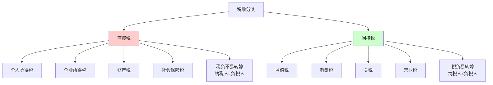
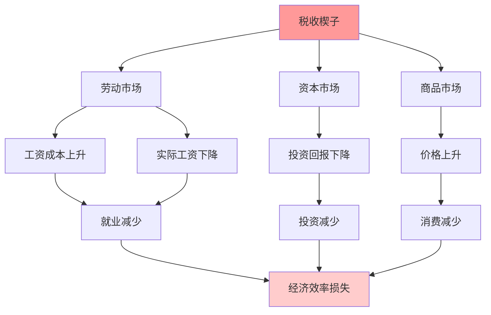

# 税收政策

## 概述

税收是政府筹集财政收入的主要手段，也是调节经济和收入分配的重要工具。税收政策的设计和调整直接影响企业投资决策、居民消费行为、资源配置效率和经济增长动力。

**学习目标**：
1. 掌握税收的基本分类和主要税种
2. 理解税收的经济效应和传导机制
3. 分析税收政策对投资和消费的影响
4. 评估不同税制的优劣和改革方向
5. 认识主要经济体的税收制度特点

## 税收的基本分类

### 按征税对象分类

**1. 所得税**
- 个人所得税：对个人收入征税
- 企业所得税：对企业利润征税
- 特点：直接税、累进性、弹性大

**2. 商品和服务税**
- 增值税(VAT)：对商品和服务增值部分征税
- 消费税：对特定消费品征税
- 营业税：对营业额征税
- 特点：间接税、易转嫁、税基广

**3. 财产税**
- 房产税：对房地产征税
- 遗产税：对遗产继承征税
- 财富税：对净资产征税
- 特点：存量税、难转嫁、调节财富分配

**4. 资源税**
- 资源税：对自然资源开采征税
- 环境税：对污染排放征税
- 特点：调节资源利用、环保功能

### 按税负能否转嫁分类

### 按税率形式分类

**1. 比例税**
- 税率固定不变
- 例：企业所得税25%
- 特点：简单、中性

**2. 累进税**
- 税率随税基增加而提高
- 例：个人所得税3%-45%
- 特点：公平、调节收入分配

**3. 累退税**
- 税率随税基增加而降低
- 实际中较少使用
- 间接税实际效果可能累退

## 主要税种详解

### 个人所得税

**税制结构**：
- 综合所得：工资、劳务、稿酬、特许权使用费
- 分类所得：利息、股息、财产租赁、财产转让
- 专项扣除：社保、公积金、子女教育、住房贷款等

**累进税率表（中国）**：

| 级数 | 全年应纳税所得额 | 税率 | 速算扣除数 |
|------|----------------|------|-----------|
| 1 | 不超过36,000元 | 3% | 0 |
| 2 | 36,000-144,000元 | 10% | 2,520 |
| 3 | 144,000-300,000元 | 20% | 16,920 |
| 4 | 300,000-420,000元 | 25% | 31,920 |
| 5 | 420,000-660,000元 | 30% | 52,920 |
| 6 | 660,000-960,000元 | 35% | 85,920 |
| 7 | 超过960,000元 | 45% | 181,920 |

**经济效应**：
- 收入再分配：累进税率缩小贫富差距
- 劳动供给：高税率可能抑制工作积极性
- 储蓄投资：影响资本积累
- 人才流动：高税率国家可能面临人才流失

### 企业所得税

**基本税率**：
- 中国：25%（小微企业5-20%）
- 美国：21%（2017年税改后）
- 欧盟：19-35%（各国不同）
- 爱尔兰：12.5%（吸引外资）

**税收优惠**：
- 高新技术企业：15%
- 研发费用加计扣除：75-100%
- 固定资产加速折旧
- 区域性优惠（经济特区、自贸区）

**经济效应**：
- 投资决策：税率影响投资回报率
- 国际竞争：税率竞争吸引外资
- 创新激励：研发优惠促进创新
- 资本流动：税率差异导致利润转移

### 增值税(VAT)

**原理**：
- 对商品和服务增值部分征税
- 多环节征收，层层抵扣
- 最终由消费者承担

**税率结构（中国）**：
- 13%：货物销售、加工修理
- 9%：交通运输、建筑、不动产
- 6%：现代服务、金融服务
- 0%：出口货物（退税）

**优势**：
- 税基广、收入稳定
- 中性：不重复征税
- 易于征管
- 鼓励出口（零税率）

**劣势**：
- 累退性：低收入群体负担相对重
- 征管复杂：需要完善的发票制度
- 对小企业不利

### 资本利得税

**定义**：对资产增值部分征税

**税率（美国）**：
- 短期（持有<1年）：按普通所得税率（最高37%）
- 长期（持有≥1年）：0%、15%或20%
- 鼓励长期投资

**各国差异**：
- 美国：分短期和长期
- 中国：股票转让暂免征收
- 新加坡：无资本利得税
- 影响投资决策和资本流动

## 税收原则

### 亚当·斯密的四原则

**1. 公平原则**
- 横向公平：相同情况相同对待
- 纵向公平：不同情况不同对待
- 能力原则：按纳税能力征税
- 受益原则：按受益程度征税

**2. 确定性原则**
- 税法明确、稳定
- 纳税义务清晰
- 减少不确定性
- 便于纳税人规划

**3. 便利性原则**
- 征收时间和方式便利
- 降低纳税成本
- 简化申报程序
- 利用信息技术

**4. 经济性原则**
- 征税成本最小化
- 提高征管效率
- 减少逃税漏税
- 降低遵从成本

### 现代税收原则

**效率原则**：
- 中性：最小化对经济决策的扭曲
- 超额负担最小化
- 促进资源优化配置

**简明原则**：
- 税制简单易懂
- 减少税种数量
- 统一税基和税率
- 降低遵从成本

**灵活原则**：
- 适应经济变化
- 自动稳定器功能
- 相机抉择空间

## 拉弗曲线

### 理论原理

**拉弗曲线**：描述税率与税收收入之间的关系

**关键点**：
- 税率为0：税收收入为0
- 税率为100%：无人工作，税收收入为0
- 存在最优税率使税收收入最大化
- 超过最优税率，提高税率反而减少收入

### 传导机制

**税率过高的负面效应**：
1. 抑制劳动供给（工作积极性下降）
2. 抑制投资（资本回报率下降）
3. 鼓励逃税避税
4. 资本和人才外流
5. 地下经济扩大

**实证研究**：
- 最优税率因国家和税种而异
- 个人所得税：40-70%
- 企业所得税：20-30%
- 增值税：15-20%

### 政策启示

**减税的条件**：
- 当前税率高于最优税率
- 经济处于拉弗曲线右侧
- 减税可能增加税收收入

**案例：美国里根减税（1981-1986）**
- 最高个税税率从70%降至28%
- 企业所得税率从46%降至34%
- 短期税收下降，长期经济增长
- 但财政赤字扩大

## 税收的经济效应

### 替代效应与收入效应

**替代效应**：
- 税收提高工作的机会成本
- 工作相对于闲暇变得不划算
- 减少劳动供给

**收入效应**：
- 税收降低实际收入
- 需要更多工作维持生活水平
- 增加劳动供给

**净效应**：
- 低收入群体：收入效应主导
- 高收入群体：替代效应主导
- 税率越高，替代效应越强

### 税收楔子

**定义**：税收导致的买方支付价格与卖方收到价格之间的差额

**影响**：

### 税收归宿

**定义**：税收的最终负担者

**影响因素**：
1. 供需弹性
   - 需求弹性小：消费者承担更多
   - 供给弹性小：生产者承担更多
2. 市场结构
   - 完全竞争：易转嫁
   - 垄断：转嫁能力强
3. 时间长短
   - 短期：难以调整
   - 长期：更易转嫁

**案例：增值税**
- 名义上企业缴纳
- 实际上消费者承担
- 通过价格传导

## 税收与经济增长

### 税收对增长的影响

**负面影响**：
- 降低储蓄和投资
- 抑制劳动供给
- 扭曲资源配置
- 降低创新激励

**正面影响**：
- 提供公共产品（基础设施、教育）
- 稳定宏观经济
- 收入再分配促进社会稳定
- 矫正市场失灵

**最优税率**：
- 平衡收入和效率
- 考虑公共支出需求
- 因国家发展阶段而异

### 税收竞争

**国际税收竞争**：
- 各国降低税率吸引投资
- "逐底竞争"风险
- 税基侵蚀和利润转移(BEPS)

**应对措施**：
- 国际税收协调
- 最低税率协议（OECD 15%）
- 反避税规则
- 数字税

## 主要经济体税制比较

### 美国：联邦制税制

**特点**：
- 联邦、州、地方三级征税
- 个人所得税是主要收入来源
- 企业所得税率较低（21%）
- 无增值税，有销售税

**2017年税改**：
- 企业所得税从35%降至21%
- 个人所得税最高税率从39.6%降至37%
- 标准扣除额翻倍
- 限制州税抵扣

**效果**：
- 短期刺激经济
- 企业回流资金
- 财政赤字扩大
- 收入不平等加剧

### 欧盟：高税收高福利

**特点**：
- 税负水平高（占GDP 40-50%）
- 增值税是主要收入来源
- 社会保险税比重大
- 累进性强

**北欧模式**：
- 税负最高（占GDP 45-50%）
- 福利最完善
- 收入分配最平等
- 经济竞争力强

**挑战**：
- 高税负影响竞争力
- 人口老龄化加剧负担
- 税收协调困难

### 中国：转型中的税制

**特点**：
- 以间接税为主（增值税、消费税）
- 直接税比重较低
- 企业税负相对较重
- 个人所得税覆盖面窄

**改革方向**：
- 降低间接税，提高直接税
- 完善个人所得税（综合与分类结合）
- 推进房地产税立法
- 优化企业税负结构
- 环境税改革

**减税降费**：
- 2018-2020年减税降费超2万亿
- 增值税税率下调
- 小微企业优惠
- 社保费率降低

## 投资者视角

### 税收对投资决策的影响

**股票投资**：
- 资本利得税：影响持有期限
- 股息税：影响分红政策偏好
- 税收递延账户：401(k)、IRA

**债券投资**：
- 利息税：影响债券吸引力
- 市政债券免税：税后收益率优势
- 税收等价收益率计算

**房地产投资**：
- 房产税：持有成本
- 资本利得税：卖出时机
- 折旧抵税：现金流优化
- 1031交换：递延税收

### 税收筹划策略

**合法避税**：
- 利用税收优惠政策
- 优化资产配置
- 时间安排（实现损失抵税）
- 地域选择（低税率地区）

**税收损失收割**：
- 卖出亏损资产抵税
- 保持投资组合配置
- 注意洗售规则

**退休账户优化**：
- 传统IRA：当期抵税
- Roth IRA：未来免税
- 根据当前和未来税率选择

### 税改对市场的影响

**减税**：
- 短期：股市上涨（企业利润增加）
- 长期：取决于经济增长效果
- 行业差异：高税率行业受益更多

**加税**：
- 短期：股市下跌（利润预期下降）
- 长期：取决于财政可持续性
- 防御性行业相对抗跌

**案例：美国2017年税改**
- 标普500指数上涨19%（2017年）
- 企业回购股票激增
- 科技股受益显著
- 但长期效果存疑

## 常见误区

**误区1：税率越低越好**
- 忽视公共服务需求
- 忽视收入分配
- 忽视财政可持续性

**误区2：企业不承担税负**
- 企业税最终由股东、员工、消费者承担
- 但分配比例不确定
- 影响投资和就业决策

**误区3：减税一定促进增长**
- 取决于当前税率水平
- 取决于支出削减程度
- 取决于经济周期阶段

**误区4：富人不缴税**
- 高收入群体承担大部分个税
- 但有效税率可能低于名义税率
- 资本收入税率低于劳动收入

## 延伸阅读

### 经典著作

1. **《国富论》** - Adam Smith
   - 税收四原则
   - 经济学基础

2. **《最优税收理论》** - James Mirrlees
   - 诺贝尔奖得主
   - 税收设计理论

3. **《公共财政学》** - Harvey S. Rosen
   - 税收理论与实践
   - 系统全面

### 研究报告

1. OECD Tax Policy Studies - 国际税收比较
2. IMF Fiscal Monitor - 全球税收政策
3. Tax Foundation - 美国税收分析

### 实用工具

1. **各国税务局官网** - 税法和税率
2. **OECD税收数据库** - 国际比较
3. **税收计算器** - 个人和企业税负

## 参考文献

1. Smith, A. (1776). *An Inquiry into the Nature and Causes of the Wealth of Nations*. W. Strahan and T. Cadell.
2. Mirrlees, J. A. (1971). "An Exploration in the Theory of Optimum Income Taxation." *Review of Economic Studies*, 38(2), 175-208.
3. Saez, E., Slemrod, J., & Giertz, S. H. (2012). "The Elasticity of Taxable Income with Respect to Marginal Tax Rates: A Critical Review." *Journal of Economic Literature*, 50(1), 3-50.
4. Piketty, T., & Saez, E. (2003). "Income Inequality in the United States, 1913-1998." *Quarterly Journal of Economics*, 118(1), 1-41.
5. Auerbach, A. J., & Hines, J. R. (2002). "Taxation and Economic Efficiency." In A. J. Auerbach & M. Feldstein (Eds.), *Handbook of Public Economics* (Vol. 3, pp. 1347-1421). Elsevier.
6. OECD (2023). *Revenue Statistics*. OECD Publishing.
7. IMF (2023). *Fiscal Monitor: Taxing Times*. International Monetary Fund.
8. Rosen, H. S., & Gayer, T. (2014). *Public Finance* (10th ed.). McGraw-Hill.
9. Slemrod, J., & Bakija, J. (2017). *Taxing Ourselves* (5th ed.). MIT Press.
10. Laffer, A. B. (2004). "The Laffer Curve: Past, Present, and Future." *The Heritage Foundation Backgrounder*, No. 1765.
