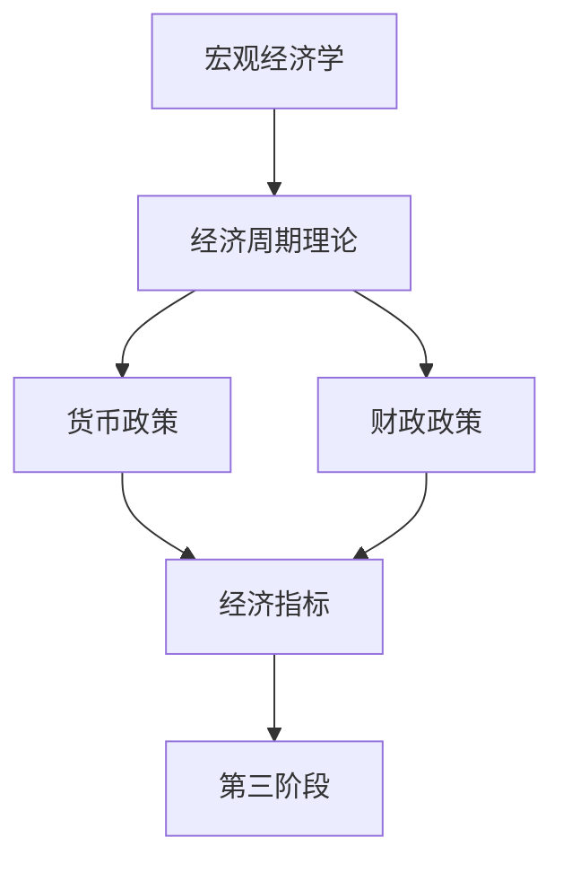

# 第二阶段：经济学基础

## 阶段概述

在建立了金融认知基础后，本阶段将深入学习宏观经济学理论和经济周期分析。你将掌握解读经济数据的能力，理解经济周期的运行规律，学会分析货币和财政政策的影响。这些知识是进行宏观分析和把握市场节奏的关键。

**学习时长**：2 个月（60 天）  
**每日投入**：1.5-2 小时  
**难度级别**：中级

## 学习目标

完成本阶段学习后，你将能够：

1. 理解并解读主要宏观经济指标（GDP、CPI、利率、就业）
2. 掌握经济周期理论和美林时钟应用
3. 分析货币政策和财政政策的影响
4. 建立宏观经济分析的基础框架
5. 理解经济数据与资产价格的关系

## 核心子模块

### 1. [宏观经济学](macroeconomics/index.html)
**学习时间**：2 周 | **文件数**：6 个

掌握宏观经济学的核心概念：
- GDP 分析与经济增长
- CPI 与通胀测量
- 利率机制与利率曲线
- 就业指标与劳动力市场
- 贸易平衡与国际收支

**为什么重要**：这些是理解经济运行的基础指标，是所有宏观分析的起点。

---

### 2. [经济周期理论](economic-cycles/index.html)
**学习时间**：3 周 | **文件数**：8 个

深入理解经济周期的运行规律：
- 经济周期总览（四阶段）
- 基钦周期（库存周期，3-5 年）
- 朱格拉周期（设备投资周期，8-10 年）
- 库兹涅茨周期（建筑周期，15-25 年）
- 康德拉季耶夫长波（技术创新周期，50-60 年）
- 美林时钟详解（资产配置利器）
- 周期指标体系（领先、同步、滞后）

**为什么重要**：理解周期是把握市场节奏的关键，美林时钟是实用的资产配置工具。

---

### 3. [货币政策](monetary-policy/index.html)
**学习时间**：2 周 | **文件数**：7 个

掌握货币政策的工具和传导机制：
- 货币政策工具总览
- 利率政策机制
- 准备金政策
- 公开市场操作
- 量化宽松详解
- 政策传导机制

**为什么重要**：货币政策是影响资产价格的最重要因素之一。

---

### 4. [财政政策](fiscal-policy/index.html)
**学习时间**：1 周 | **文件数**：5 个

理解政府财政政策的影响：
- 政府支出分析
- 税收政策
- 财政刺激
- 债务可持续性

**为什么重要**：财政政策与货币政策共同影响经济运行。

---

### 5. [经济指标](economic-indicators/index.html)
**学习时间**：1 周 | **文件数**：5 个

建立完整的经济指标体系：
- 领先指标详解
- 同步指标
- 滞后指标
- 综合指数

**为什么重要**：经济指标是判断经济周期位置的工具。

## 推荐学习顺序

## 学习计划建议

### 第 1-2 周：宏观经济学基础
- 学习 GDP、CPI、利率、就业等核心指标
- 理解各指标之间的关系
- 开始关注经济数据发布

### 第 3-5 周：经济周期深度学习
- 学习各种周期理论
- 重点掌握美林时钟
- 分析历史周期案例
- 尝试判断当前周期位置

### 第 6-7 周：政策分析
- 学习货币政策和财政政策
- 理解政策传导机制
- 分析当前政策环境

### 第 8 周：综合与实践
- 学习经济指标体系
- 建立宏观分析框架
- 复习和总结

## 关键资源

### 必读书籍
1. 《宏观经济学》- N. Gregory Mankiw
2. 《经济周期》- Wesley C. Mitchell
3. 《美林时钟投资法》- 相关研究报告

### 数据来源
- FRED（Federal Reserve Economic Data）
- Trading Economics
- 各国统计局官网

## 学习检查点

- [ ] 能够解释货币政策如何影响经济
- [ ] 能够识别当前经济周期的位置
- [ ] 能够解读主要经济数据发布
- [ ] 理解美林时钟的资产配置逻辑

## 下一步行动

完成本阶段后，进入 [第三阶段：公司分析](../03-company-analysis/index.html)，开始学习如何分析具体企业。

---

[← 返回金融知识体系](../index.html) | [下一阶段：公司分析 →](../03-company-analysis/index.html)
