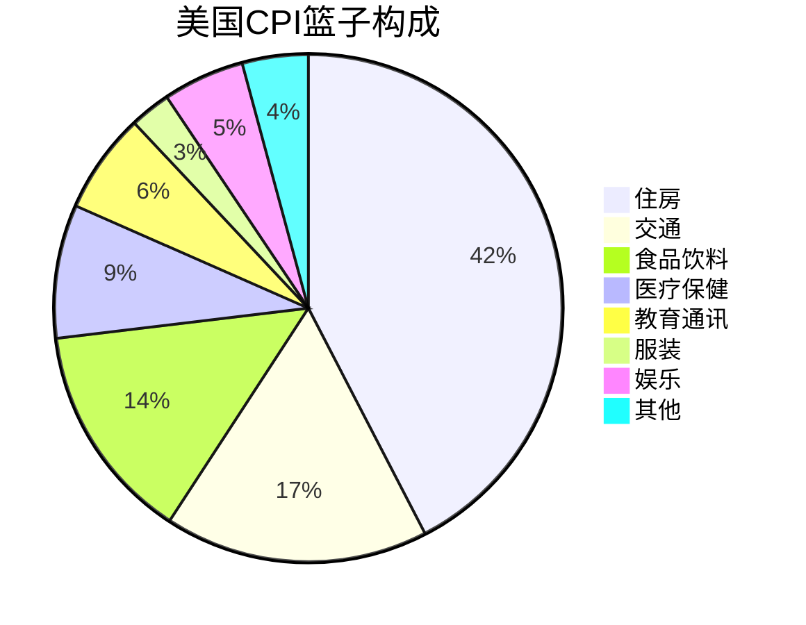
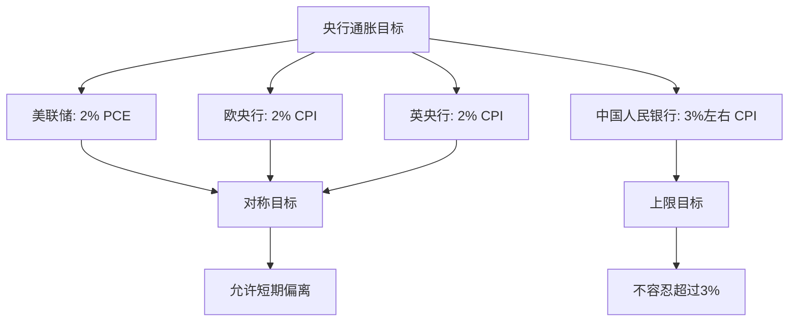
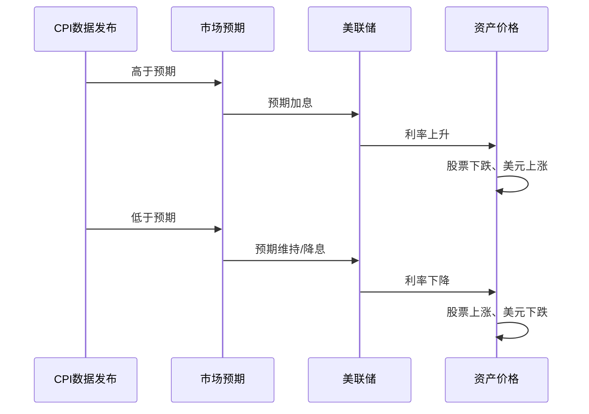

# CPI与通胀：理解价格水平变化的核心指标

## 概述

消费者物价指数（CPI, Consumer Price Index）是衡量通货膨胀最重要和最常用的指标。理解CPI不仅是掌握宏观经济分析的基础，更是投资决策中判断货币政策走向、评估资产实际回报的关键工具。


**学习目标**：
- 掌握CPI的定义、计算方法和权重结构
- 理解核心CPI、PCE等不同通胀指标的差异
- 学会使用通胀数据分析货币政策和投资机会
- 了解通胀对不同资产类别的影响

**为什么重要**：通胀是"隐形税"，侵蚀购买力和投资回报。央行的首要目标是控制通胀，CPI数据直接影响利率决策。投资者必须理解通胀，才能做出正确的资产配置和估值判断。

## 核心概念

### CPI的定义

CPI是反映一定时期内城市居民家庭购买的消费品和服务价格水平变动情况的相对数。

**核心特征**：
- **固定篮子**：选定一篮子代表性商品和服务
- **权重固定**：根据消费支出比例确定权重
- **价格变化**：追踪这篮子商品的价格变化
- **基期比较**：与基期价格比较得出指数

**计算公式（拉氏指数）**：
```
CPI_t = (Σ P_t × Q_0) / (Σ P_0 × Q_0) × 100
```
- P_t：当期价格
- P_0：基期价格
- Q_0：基期数量（固定）

### CPI的篮子构成

**美国CPI权重结构（2024）**：




**中国CPI权重结构**：
- 食品烟酒：30%（比美国高，反映发展阶段）
- 居住：23%
- 交通通信：14%
- 教育文化娱乐：11%
- 医疗保健：9%
- 生活用品及服务：6%
- 衣着：5%
- 其他：2%

**权重调整**：
- 美国：每2年更新一次
- 中国：每5年更新一次
- 反映消费结构变化

### 通胀率的计算

**同比通胀率（YoY）**：
```
通胀率 = (CPI_本月 - CPI_去年同月) / CPI_去年同月 × 100%
```

**环比通胀率（MoM）**：
```
环比通胀率 = (CPI_本月 - CPI_上月) / CPI_上月 × 100%
```

**年化通胀率**：
```
年化通胀率 = (1 + 环比通胀率)^12 - 1
```

**通胀水平分类**：
- 温和通胀：2-3%（央行目标）
- 高通胀：>5%
- 恶性通胀：>50%/月
- 通缩：<0%


## 不同的通胀指标

### 核心CPI（Core CPI）

**定义**：剔除食品和能源价格的CPI

**原因**：
- 食品和能源价格波动大（天气、地缘政治）
- 短期波动不反映长期通胀趋势
- 央行更关注核心通胀

**公式**：
```
核心CPI = CPI总指数 - 食品 - 能源
```

**投资应用**：
- 核心CPI更能预测货币政策
- 美联储目标：核心PCE通胀2%

### PCE（个人消费支出价格指数）

**定义**：基于个人消费支出的价格指数

**与CPI的差异**：
- **权重更新**：PCE每月更新，CPI每2年更新
- **覆盖范围**：PCE更广（包括雇主支付的医保）
- **计算方法**：PCE用链式加权，CPI用固定权重

**美联储偏好PCE**：
- 更准确反映消费行为变化
- 避免替代偏差
- 核心PCE是美联储的官方通胀目标

### PPI（生产者物价指数）

**定义**：衡量生产者出厂价格的指数

**领先性**：
- PPI领先CPI约3-6个月
- 生产成本上升 → 最终传导到消费价格

**投资应用**：
- PPI上升：关注成本传导能力强的公司
- PPI-CPI剪刀差：反映企业利润空间


## 实践案例

### 案例1：2021-2022年美国通胀飙升

**背景**：疫情后供应链中断 + 财政刺激 + 货币宽松

**CPI数据**：
- 2021年1月：1.4%
- 2021年12月：7.0%
- 2022年6月：9.1%（40年新高）
- 2024年1月：3.1%（回落）

**通胀驱动因素**：
- 供应链瓶颈：芯片短缺、运输成本暴涨
- 需求激增：刺激支票、超额储蓄
- 能源价格：油价从$40涨到$120
- 劳动力短缺：工资上涨

**美联储应对**：
- 2022年3月开始加息
- 18个月内加息525个基点（0.25% → 5.5%）
- 同时缩表（量化紧缩）

**投资启示**：
- 通胀初期：大宗商品、能源股表现好
- 加息周期：成长股估值承压
- 通胀回落：债券收益率下降，股市反弹

### 案例2：日本的通缩困境（1990s-2010s）

**背景**：资产泡沫破裂后的长期通缩

**CPI数据**：
- 1990s-2010s：多数年份CPI为负或接近0
- 2013年后：安倍经济学推动通胀回升
- 目标：2%通胀率

**通缩的危害**：
- 消费延迟：预期价格下降，推迟购买
- 债务负担加重：实际债务价值上升
- 企业投资意愿下降
- 经济陷入螺旋下降


**政策应对**：
- 零利率政策（ZIRP）
- 量化宽松（QE）
- 负利率政策（NIRP）
- 收益率曲线控制（YCC）

**投资启示**：
- 通缩环境：现金为王，债券表现好
- 股市长期低迷（日经指数30年才回到1989年高点）
- 出口企业受益（日元贬值）

### 案例3：中国的温和通胀管理（2010-2024）

**CPI控制目标**：
- 官方目标：3%左右
- 实际表现：多数年份在1-3%区间

**2019-2020年猪周期**：
- 2019年：猪肉价格暴涨（非洲猪瘟）
- CPI一度达到4.5%
- 但核心CPI保持稳定（1.5%左右）
- 央行保持定力，未因猪肉涨价而收紧

**投资启示**：
- 区分结构性通胀和全面通胀
- 单一商品涨价不改变货币政策
- 关注核心通胀趋势

## 通胀测量的技术细节

### 替代偏差（Substitution Bias）

**问题**：CPI使用固定篮子，但消费者会替代
- 牛肉涨价 → 买鸡肉
- 固定篮子高估了生活成本上升

**解决方案**：
- 链式加权CPI（C-CPI-U）
- PCE使用链式加权


### 质量调整（Quality Adjustment）

**问题**：产品质量提升如何处理？
- 今天的iPhone vs 10年前的手机
- 价格上涨，但功能大幅提升

**方法**：
- 特征价格法（Hedonic Pricing）
- 将价格变化分解为：纯价格变化 + 质量改进

**争议**：
- 质量调整可能低估真实通胀
- 技术产品调整幅度大

### 新产品和消失产品

**挑战**：
- 新产品如何纳入篮子？（智能手机、电动车）
- 消失产品如何处理？（传呼机、胶卷）

**处理方式**：
- 定期更新篮子（美国每2年）
- 链式加权方法

## CPI与货币政策

### 央行的通胀目标




**为什么是2%？**
- 避免通缩风险（0%太接近通缩）
- 提供货币政策空间
- 允许相对价格调整
- 测量误差缓冲

### 泰勒规则（Taylor Rule）

**公式**：
```
联邦基金利率 = 2% + 当前通胀率 + 0.5×(通胀率 - 目标通胀率) + 0.5×产出缺口
```

**应用**：
- 预测央行利率决策
- 评估当前利率是否合理
- 判断政策立场（鹰派/鸽派）

**示例计算（2022年中）**：
- 当前通胀率：9%
- 目标通胀率：2%
- 产出缺口：0%
- 泰勒规则利率 = 2% + 9% + 0.5×(9%-2%) + 0 = 14.5%
- 实际利率：1.5%
- 结论：政策严重滞后，需要大幅加息

### CPI数据发布与市场反应

**发布时间**：
- 美国：每月15日左右（劳工统计局）
- 中国：每月10日左右（国家统计局）

**市场反应模式**：



## 通胀对资产的影响

### 不同资产类别的表现

**股票**：
- 温和通胀（2-3%）：正面（企业定价权、名义收入增长）
- 高通胀（>5%）：负面（利率上升、估值压缩）
- 通缩：负面（需求萎缩、盈利下降）

**债券**：
- 通胀上升：债券价格下跌（实际收益率下降）
- 通胀下降：债券价格上涨
- TIPS（通胀保护债券）：本金随CPI调整

**房地产**：
- 温和通胀：正面（租金上涨、资产保值）
- 高通胀 + 加息：负面（融资成本上升）

**大宗商品**：
- 通胀对冲工具
- 通胀预期上升时表现好
- 黄金、石油、农产品

**现金**：
- 通胀的最大受害者
- 购买力持续下降
- 实际收益率 = 名义利率 - 通胀率

### 实际收益率的计算

**费雪方程式（Fisher Equation）**：
```
实际利率 ≈ 名义利率 - 通胀率
```

**精确公式**：
```
1 + 实际利率 = (1 + 名义利率) / (1 + 通胀率)
```

**投资应用**：
- 评估真实回报
- 比较不同时期的投资表现
- 判断资产是否跑赢通胀


## 常见误区

**误区1：CPI完全准确反映生活成本**
- 现实：存在替代偏差、质量调整争议
- 个人通胀率可能与CPI差异很大
- 正确认识：CPI是平均水平，个体差异大

**误区2：通胀越低越好**
- 现实：适度通胀有利于经济
- 通缩更危险（日本教训）
- 正确认识：2-3%温和通胀是健康的

**误区3：只看总CPI不看结构**
- 现实：不同分项变化差异大
- 核心CPI更重要
- 正确认识：分析通胀要看结构和驱动因素

**误区4：通胀数据一发布就交易**
- 现实：市场已经price in预期
- 关键是超预期还是低于预期
- 正确认识：关注预期差，不是绝对值

## 实战应用

### 通胀分析框架

**1. 判断通胀类型**：
- 需求拉动：经济过热、产出缺口为正
- 成本推动：供应冲击、PPI大幅上升
- 货币性通胀：货币超发、M2增速过快

**2. 预测通胀趋势**：
```
领先指标 → 通胀预测 → 政策预期 → 资产配置
```

**领先指标**：
- PPI（领先3-6个月）
- 大宗商品价格
- 货币供应量M2
- 产出缺口
- 工资增长


**3. 资产配置决策**：

| 通胀环境 | 股票 | 债券 | 大宗商品 | 现金 | 房地产 |
|----------|------|------|----------|------|--------|
| 低通胀(0-2%) | ++ | ++ | - | + | + |
| 温和通胀(2-4%) | ++ | + | + | - | ++ |
| 高通胀(>5%) | - | -- | ++ | -- | + |
| 通缩(<0%) | - | ++ | -- | ++ | - |

**4. 行业配置**：
- 通胀上升期：能源、原材料、金融
- 通胀下降期：科技、消费、医疗

### 实用工具

**通胀预期指标**：
- 10年期TIPS盈亏平衡通胀率
- 密歇根大学消费者通胀预期
- 专业预测机构调查

**数据源**：
- 美国劳工统计局：https://www.bls.gov/cpi/
- FRED数据库：CPI、核心CPI、PCE
- 中国国家统计局：http://www.stats.gov.cn/

## 延伸阅读

### 推荐书籍

1. **《通胀的真相》** - Murray Rothbard
   - 奥地利学派视角
   - 货币性通胀理论

2. **《这次不一样》** - Reinhart & Rogoff
   - 第10章：通胀与债务危机
   - 历史数据分析

3. **《美联储的诞生》** - Roger Lowenstein
   - 理解央行如何应对通胀


## 参考文献

### 官方文档

1. U.S. Bureau of Labor Statistics. "Consumer Price Index Manual: Concepts and Methods". 
   - CPI计算方法论
   - https://www.bls.gov/cpi/

2. 国家统计局. "居民消费价格指数编制方法". 
   - 中国CPI统计方法

### 学术文献

3. Boskin, M. J., et al. (1996). "Toward a More Accurate Measure of the Cost of Living". *Final Report to the Senate Finance Committee*.
   - CPI测量偏差研究（Boskin报告）

4. Bryan, M. F., & Cecchetti, S. G. (1994). "Measuring Core Inflation". *NBER Working Paper No. 4303*.
   - 核心通胀测量方法

5. Bernanke, B. S. (2015). "The Taylor Rule: A benchmark for monetary policy?". *Brookings Institution Blog*.
   - 泰勒规则应用

### 投资应用

6. Damodaran, A. (2012). *Investment Valuation*. Wiley.
   - 第6章：通胀与估值
   - 如何在DCF中处理通胀

7. Ilmanen, A. (2011). *Expected Returns*. Wiley.
   - 第15章：通胀与资产回报
   - 历史数据分析

8. Bodie, Z. (1976). "Common Stocks as a Hedge Against Inflation". *Journal of Finance*, 31(2), 459-470.
   - 股票能否对冲通胀？

---

**下一步学习**：理解CPI后，建议学习 [利率机制](interest-rates.html)，掌握央行如何通过利率工具应对通胀。
