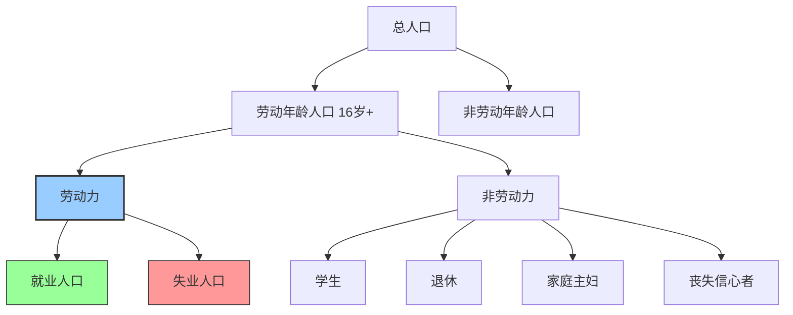

# 就业指标：劳动力市场的核心数据

## 概述

就业数据是宏观经济最重要的高频指标之一，直接反映经济活力和居民福祉。美联储的双重使命是"充分就业"和"价格稳定"，就业数据直接影响货币政策决策。


**学习目标**：
- 掌握失业率、非农就业等核心就业指标
- 理解劳动参与率、职位空缺等补充指标
- 学会使用就业数据判断经济周期和预测政策
- 了解就业与通胀、利率的关系

**为什么重要**：就业是经济的"晴雨表"，也是政治的"温度计"。强劲的就业市场支撑消费、推高工资、引发通胀，最终影响央行政策和资产价格。每月第一个周五的非农就业报告是全球金融市场最关注的数据之一。

## 核心概念

### 劳动力市场的基本分类



**关键定义**：
- **劳动力**：就业人口 + 失业人口（正在找工作）
- **就业人口**：有工作的人（包括兼职）
- **失业人口**：无工作但正在找工作的人
- **非劳动力**：不工作也不找工作的人


### 失业率（Unemployment Rate）

**计算公式**：
```
失业率 = (失业人口 / 劳动力) × 100%
```

**失业类型**：

**1. 摩擦性失业（Frictional）**：
- 正常的工作转换
- 找工作需要时间
- 不可避免，约2-3%

**2. 结构性失业（Structural）**：
- 技能不匹配
- 产业转型
- 地理错配

**3. 周期性失业（Cyclical）**：
- 经济衰退导致
- 需求不足
- 政策可以缓解

**自然失业率（NAIRU）**：
```
自然失业率 = 摩擦性失业率 + 结构性失业率
```
- 美国：约4-4.5%
- 低于自然失业率 → 通胀压力
- 高于自然失业率 → 经济疲软

### 非农就业人数（Nonfarm Payrolls）

**定义**：非农业部门新增就业人数

**为什么重要**：
- 最及时的就业指标（每月第一个周五）
- 反映就业市场动能
- 市场高度关注

**数据来源**：
- 调查约14万家企业
- 覆盖约6000万个工作岗位
- 约占美国总就业的1/3


**健康水平**：
- 强劲：>200K/月
- 稳健：100-200K/月
- 疲软：<100K/月
- 衰退：负增长

**历史修正**：
- 初值经常被修正
- 关注修正方向和幅度

### 劳动参与率（Labor Force Participation Rate）

**计算公式**：
```
劳动参与率 = (劳动力 / 劳动年龄人口) × 100%
```

**美国趋势**：
- 2000年：67.3%（高点）
- 2015年：62.4%（低点，金融危机后）
- 2024年：62.5%（缓慢恢复）

**影响因素**：
- 人口老龄化（退休人口增加）
- 教育年限延长（学生增加）
- 丧失信心者（discouraged workers）
- 残疾和健康问题

**投资含义**：
- 劳动参与率下降 → 劳动力供给减少
- 工资上涨压力
- 通胀风险

## 补充就业指标

### U6失业率（广义失业率）

**包含**：
- U3失业人口（官方失业率）
- 兼职但想全职的人
- 边缘劳动力（想工作但未找）

**公式**：
```
U6 = (U3失业 + 非自愿兼职 + 边缘劳动力) / (劳动力 + 边缘劳动力)
```

**典型关系**：
- U6通常是U3的1.5-2倍
- U3 = 4% → U6 ≈ 7-8%


### 职位空缺率（Job Openings Rate）

**JOLTS报告**（Job Openings and Labor Turnover Survey）：
- 职位空缺数
- 招聘人数
- 离职人数（自愿/非自愿）

**贝弗里奇曲线（Beveridge Curve）**：
```
职位空缺率 vs 失业率
```
- 向外移动：劳动力市场效率下降
- 向内移动：匹配效率提高

**投资应用**：
- 职位空缺/失业人数比率 > 1：劳动力短缺
- 工资上涨压力 → 通胀风险
- 央行可能收紧政策

### 平均时薪（Average Hourly Earnings）

**计算**：
```
时薪同比增长率 = (本月时薪 - 去年同月时薪) / 去年同月时薪 × 100%
```

**健康水平**：
- 正常：3-4%（略高于通胀）
- 过热：>5%（通胀风险）
- 疲软：<2%（需求不足）

**工资-通胀螺旋**：


## 实践案例

### 案例1：2021-2022年美国劳动力短缺

**背景**：
- 疫情后经济快速重启
- 劳动力供给恢复慢


**数据表现**：
- 失业率：快速降至3.5%（50年低点）
- 职位空缺：1100万（历史新高）
- 职位空缺/失业人数：2.0（严重短缺）
- 时薪增长：5-6%（远超通胀目标）

**经济影响**：
- 工资上涨 → 成本推动通胀
- 劳动力短缺 → 供应链问题
- 服务业涨价（餐饮、酒店）

**美联储应对**：
- 激进加息（抑制需求）
- 目标：降温劳动力市场
- "软着陆"：降低职位空缺但不大幅增加失业

**投资启示**：
- 劳动力短缺 → 通胀持续 → 利率上升
- 关注工资增长拐点
- 劳动密集型行业成本压力大

### 案例2：2008年金融危机的就业冲击

**就业数据**：
- 2007年12月：失业率5.0%
- 2009年10月：失业率10.0%（峰值）
- 累计失业人数增加：870万
- 恢复到危机前水平：2014年（6年）

**就业恢复慢于GDP**：
- GDP：2009年Q3恢复增长
- 就业：2010年才开始净增长
- 失业率：2016年才回到5%

**原因**：
- 企业谨慎招聘
- 提高现有员工工作时间
- 自动化替代部分岗位


**投资启示**：
- 就业是滞后指标
- 失业率见顶时，股市可能已经反弹
- 关注就业增长拐点，不是绝对水平

### 案例3：中国就业结构转型

**调查失业率**：
- 2018年开始公布城镇调查失业率
- 目标：5.5%以内
- 实际：多数时间在5-5.5%

**就业结构变化**：
- 制造业就业占比下降
- 服务业就业占比上升（超过50%）
- 灵活就业、平台经济兴起

**政策重点**：
- 稳就业优先于稳增长
- 支持中小企业（吸纳80%就业）
- 职业培训和技能提升

**投资启示**：
- 服务业扩张机会
- 职业教育、培训行业
- 灵活用工平台

## 就业与经济周期

### 奥肯定律（Okun's Law）

**关系**：
```
失业率变化 ≈ -0.5 × (实际GDP增长率 - 潜在GDP增长率)
```

**含义**：
- GDP增长高于潜在增速 → 失业率下降
- GDP增长低于潜在增速 → 失业率上升
- 系数约-0.5（美国经验值）

**应用**：
- 预测失业率变化
- 评估经济增长的就业效应
- 判断经济是否过热或过冷


### 菲利普斯曲线（Phillips Curve）

**原始关系**：
```
通胀率 = f(失业率)
```
- 失业率下降 → 工资上涨 → 通胀上升
- 短期权衡：低失业 vs 低通胀

**现代版本（预期增强）**：
```
通胀率 = 预期通胀率 - α × (失业率 - 自然失业率)
```

**政策含义**：
- 失业率低于自然失业率 → 通胀压力
- 央行需要加息降温
- 美联储的两难：就业 vs 通胀

**近年变化**：
- 菲利普斯曲线变平坦
- 失业率很低但通胀温和（2015-2019）
- 原因：全球化、技术进步、预期锚定

## 就业报告解读

### 美国非农就业报告（NFP）

**发布时间**：每月第一个周五，美东时间8:30

**核心数据**：
1. 非农就业人数变化
2. 失业率
3. 劳动参与率
4. 平均时薪

**市场反应模式**：
- 超预期强劲 → 加息预期 → 股市下跌、美元上涨
- 低于预期 → 降息预期 → 股市上涨、美元下跌
- 符合预期 → 市场平静

**"好消息是坏消息"**：
- 就业太强 → 通胀风险 → 加息预期 → 股市负面
- 就业疲软 → 降息预期 → 股市正面
- 取决于经济周期阶段


### 中国就业数据

**主要指标**：
- 城镇调查失业率（月度）
- 城镇新增就业人数（年度目标）
- 农民工就业监测

**数据特点**：
- 调查失业率波动小
- 新增就业目标（如1200万/年）
- 关注重点群体（大学生、农民工）

## 常见误区

**误区1：失业率越低越好**
- 现实：过低失业率引发通胀
- 低于自然失业率不可持续
- 正确认识：4-5%是健康水平

**误区2：只看失业率不看就业增长**
- 现实：失业率可能因劳动参与率下降而降低
- 就业增长更直接反映经济活力
- 正确认识：综合看多个指标

**误区3：忽视就业质量**
- 现实：兼职、临时工增加不等于就业改善
- 工资增长更重要
- 正确认识：关注全职就业和工资水平

## 实战应用

### 就业数据分析框架

**1. 综合评估劳动力市场**：
```
失业率 + 就业增长 + 劳动参与率 + 工资增长 → 市场强度
```

**2. 预测货币政策**：
- 就业强劲 + 工资上涨 → 通胀风险 → 加息
- 就业疲软 + 工资停滞 → 降息


**3. 行业配置**：
- 就业强劲：周期股（消费、金融）
- 就业疲软：防御股（医疗、公用事业）

**4. 关注结构性变化**：
- 哪些行业招聘？哪些裁员？
- 制造业 vs 服务业
- 科技行业就业趋势

### 实用工具

**数据源**：
- **美国劳工统计局**：https://www.bls.gov/
  - 就业报告、JOLTS
- **ADP就业报告**：非农就业的先行指标
- **初请失业金人数**：每周四发布，高频指标

**分析检查清单**：
- [ ] 非农就业人数变化（vs预期）
- [ ] 失业率（vs自然失业率）
- [ ] 劳动参与率趋势
- [ ] 平均时薪增长（vs通胀）
- [ ] 职位空缺数据
- [ ] 历史数据修正
- [ ] 分行业就业变化

## 延伸阅读

### 推荐书籍

1. **《就业、利息和货币通论》** - John Maynard Keynes
   - 宏观经济学奠基之作
   - 理解就业与总需求的关系

2. **《宏观经济学》** - N. Gregory Mankiw
   - 第6章：失业
   - 第13章：总需求与总供给

3. **《21世纪资本论》** - Thomas Piketty
   - 劳动收入与资本收入
   - 长期趋势分析


## 参考文献

### 官方文档

1. U.S. Bureau of Labor Statistics. "How the Government Measures Unemployment". 
   - 失业率计算方法
   - https://www.bls.gov/cps/cps_htgm.htm

2. U.S. Bureau of Labor Statistics. "The Employment Situation". 
   - 月度就业报告
   - https://www.bls.gov/news.release/empsit.toc.htm

### 学术文献

3. Okun, A. M. (1962). "Potential GNP: Its Measurement and Significance". *Proceedings of the Business and Economics Statistics Section*, American Statistical Association.
   - 奥肯定律

4. Phillips, A. W. (1958). "The Relation Between Unemployment and the Rate of Change of Money Wage Rates in the United Kingdom, 1861-1957". *Economica*, 25(100), 283-299.
   - 菲利普斯曲线原始论文

5. Blanchard, O., & Diamond, P. (1989). "The Beveridge Curve". *Brookings Papers on Economic Activity*, 1989(1), 1-76.
   - 贝弗里奇曲线理论

### 投资应用

6. Shiller, R. J. (2015). *Irrational Exuberance* (3rd ed.). Princeton University Press.
   - 第7章：就业与市场周期

7. Siegel, J. J. (2014). *Stocks for the Long Run*. McGraw-Hill.
   - 就业数据与股市回报

---

**下一步学习**：理解就业指标后，建议学习 [贸易平衡](trade-balance.html)，掌握国际经济关系对宏观经济的影响。
