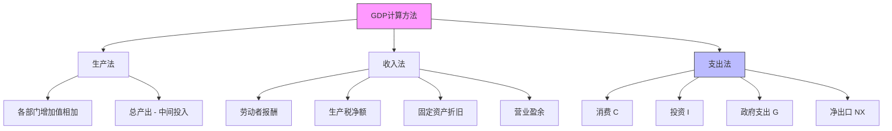
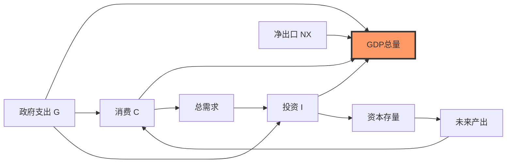
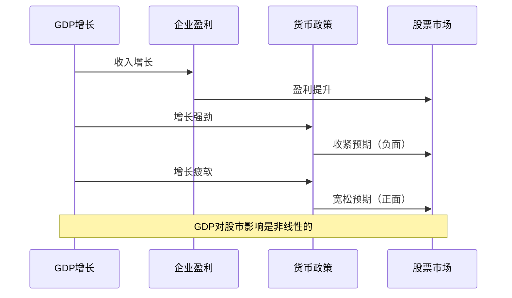

# GDP分析：理解经济总量的核心指标

## 概述

国内生产总值（GDP, Gross Domestic Product）是衡量一个国家或地区经济活动总量的最重要指标。理解GDP不仅是掌握宏观经济分析的基础，更是投资决策中判断经济周期、评估市场环境的关键工具。


**学习目标**：
- 掌握GDP的定义和三种计算方法
- 理解GDP的四大组成部分及其经济含义
- 学会使用GDP数据分析经济增长和周期
- 了解GDP指标的局限性和替代指标

**为什么重要**：GDP是宏观经济的"体温计"，投资者通过GDP增长率判断经济周期位置，预测货币政策走向，评估股票市场的整体估值水平。工程师的系统思维能帮助更好地理解GDP各组成部分之间的相互作用。

## 核心概念

### GDP的定义

GDP是指一个国家或地区在一定时期内（通常为一年或一季度）所有常住单位生产的最终产品和服务的市场价值总和。

**关键要点**：
- **最终产品**：只计算最终产品，避免重复计算（不包括中间产品）
- **市场价值**：以市场价格计量，便于加总不同产品
- **常住单位**：按地域原则，不论国籍
- **一定时期**：流量概念，不是存量

**GDP vs GNP**：
- GDP（国内生产总值）：地域原则，境内生产
- GNP（国民生产总值）：国民原则，本国国民生产
- 关系：GNP = GDP + 本国居民海外收入 - 外国居民境内收入


### GDP的三种计算方法



#### 1. 生产法（Production Approach）

从生产角度计算，将各部门的增加值相加：

**公式**：
```
GDP = Σ(各部门总产出 - 各部门中间投入)
    = Σ各部门增加值
```

**应用**：主要用于分析产业结构、识别经济增长的驱动部门

#### 2. 收入法（Income Approach）

从收入分配角度计算，将生产要素获得的收入相加：

**公式**：
```
GDP = 劳动者报酬 + 生产税净额 + 固定资产折旧 + 营业盈余
```

**应用**：分析收入分配结构、劳动收入占比变化


#### 3. 支出法（Expenditure Approach）

从最终使用角度计算，是最常用的方法：

**公式**：
```
GDP = C + I + G + (X - M)
    = 消费 + 投资 + 政府支出 + 净出口
```

**各组成部分详解**：

**C (Consumption) - 居民消费**：
- 耐用品：汽车、家电（占10-15%）
- 非耐用品：食品、服装（占20-25%）
- 服务：医疗、教育、娱乐（占60-65%）
- 美国：约占GDP的68%
- 中国：约占GDP的55%（消费升级空间大）

**I (Investment) - 固定资产投资**：
- 企业设备投资
- 住宅投资
- 库存变化
- 注意：金融投资（买股票）不计入GDP
- 美国：约占18%
- 中国：约占43%（投资驱动型经济）

**G (Government Spending) - 政府支出**：
- 政府消费支出
- 公共投资
- 不包括转移支付（社保、失业金）
- 美国：约占17%
- 中国：约占16%

**NX (Net Exports) - 净出口**：
- 出口 - 进口
- 正值：贸易顺差
- 负值：贸易逆差
- 美国：约-3%（逆差）
- 中国：约+2%（顺差）


## GDP的衍生指标

### 名义GDP vs 实际GDP

**名义GDP（Nominal GDP）**：
- 按当期价格计算
- 包含价格变化影响
- 公式：Σ(当期产量 × 当期价格)

**实际GDP（Real GDP）**：
- 按不变价格（基期价格）计算
- 剔除价格变化，反映真实产出
- 公式：Σ(当期产量 × 基期价格)

**GDP平减指数（GDP Deflator）**：
```
GDP平减指数 = (名义GDP / 实际GDP) × 100
```
- 衡量整体价格水平变化
- 比CPI更全面（包含所有商品和服务）

### GDP增长率

**计算公式**：
```
实际GDP增长率 = [(本期实际GDP - 上期实际GDP) / 上期实际GDP] × 100%
```

**环比增长率（QoQ）**：与上一季度比较
**同比增长率（YoY）**：与去年同期比较
**年化增长率（Annualized）**：季度增长率年化

**增长率的经济含义**：
- 3-4%：发达国家健康增长
- 6-8%：发展中国家正常增长
- >8%：高速增长（可能过热）
- <2%：增长乏力
- 负增长：经济衰退


### 人均GDP

**公式**：
```
人均GDP = GDP总量 / 总人口
```

**经济发展阶段划分**：
- 低收入国家：< $1,000
- 中低收入：$1,000 - $4,000
- 中高收入：$4,000 - $12,500
- 高收入国家：> $12,500

**2024年主要经济体人均GDP**：
- 美国：~$80,000
- 德国：~$52,000
- 日本：~$42,000
- 中国：~$13,000（刚进入高收入门槛）

## GDP组成分析框架

### 支出法四大组件的相互关系




### 消费驱动型 vs 投资驱动型经济

**美国模式（消费驱动）**：
- 消费占比：68%
- 特点：内需强劲、服务业发达
- 优势：经济稳定性高、抗外部冲击
- 挑战：储蓄率低、贸易逆差

**中国模式（投资驱动）**：
- 投资占比：43%
- 特点：基建投资大、制造业强
- 优势：增长速度快、产能扩张快
- 挑战：投资效率下降、债务积累

**转型趋势**：
- 中国正从投资驱动向消费驱动转型
- 消费占比逐年提升（2010年35% → 2024年55%）
- 投资者关注：消费升级、服务业增长机会

## 实践案例

### 案例1：2008年金融危机后的GDP变化

**背景**：2008年全球金融危机导致需求骤降

**美国GDP变化**：
- 2008 Q4：-8.4%（年化，环比）
- 2009 Q1：-4.4%
- 主要拖累：消费下降、投资暴跌、出口萎缩

**政策应对**：
- 财政刺激：$787B美国复苏与再投资法案
- 货币宽松：零利率 + QE
- 效果：2009 Q3恢复正增长

**投资启示**：
- GDP负增长时期：防御性资产表现好（国债、黄金）
- 政策刺激后：周期性行业率先反弹
- 关注GDP组成：哪个部分拖累？哪个部分恢复？


### 案例2：中国经济结构转型（2010-2024）

**GDP组成变化**：

| 年份 | 消费占比 | 投资占比 | 净出口占比 |
|------|----------|----------|------------|
| 2010 | 35% | 48% | 4% |
| 2015 | 38% | 45% | 3% |
| 2020 | 54% | 43% | 2% |
| 2024 | 55% | 43% | 2% |

**转型特征**：
- 消费占比提升20个百分点
- 投资占比下降但仍高于发达国家
- 服务业占GDP比重超过50%

**投资机会**：
- 消费升级：品牌消费、服务消费
- 科技创新：替代传统投资驱动
- 内需市场：减少对出口依赖

### 案例3：疫情冲击与GDP恢复（2020-2021）

**2020年各国GDP表现**：
- 中国：+2.2%（唯一正增长的主要经济体）
- 美国：-3.4%
- 欧元区：-6.4%
- 日本：-4.5%

**中国快速恢复的原因**：
- 疫情控制有效，生产快速恢复
- 出口强劲（防疫物资、居家办公设备）
- 政策刺激精准（新基建、消费券）

**投资启示**：
- 关注各国GDP恢复节奏差异
- 供应链优势转化为投资机会
- 政策支持方向指引行业配置


## GDP分析框架

### 增长驱动因素分解

**索洛增长模型（Solow Growth Model）**：
```
Y = A × F(K, L)
```
- Y：产出（GDP）
- A：全要素生产率（技术进步）
- K：资本投入
- L：劳动投入

**增长来源**：
1. **资本积累**：投资增加 → 资本存量增加
2. **劳动力增长**：人口增长、劳动参与率提高
3. **技术进步**：创新、效率提升（最重要的长期驱动力）

**中国增长驱动演变**：
- 1980-2000：劳动力 + 资本（人口红利 + 投资）
- 2000-2010：资本 + 出口（加入WTO）
- 2010-2020：资本 + 技术（产业升级）
- 2020-现在：技术 + 消费（高质量发展）

### 潜在GDP与产出缺口

**潜在GDP（Potential GDP）**：
- 经济在充分就业、资源充分利用时的产出水平
- 不引发通胀的最大产出

**产出缺口（Output Gap）**：
```
产出缺口 = (实际GDP - 潜在GDP) / 潜在GDP × 100%
```

**经济含义**：
- 正缺口（>0）：经济过热，通胀压力 → 央行可能加息
- 负缺口（<0）：经济疲软，失业率高 → 央行可能降息
- 接近0：经济运行在合理区间

**投资应用**：
- 产出缺口是判断货币政策方向的关键指标
- 负缺口扩大：买入周期性股票（政策将宽松）
- 正缺口扩大：减持周期股（政策将收紧）


### GDP与资产价格的关系



**关系特征**：
- **早周期**：GDP加速 + 政策宽松 → 股市大涨
- **中周期**：GDP高位 + 政策收紧 → 股市震荡
- **晚周期**：GDP减速 + 政策收紧 → 股市下跌
- **衰退期**：GDP负增长 + 政策宽松 → 股市筑底

**领先与滞后**：
- 股市通常领先GDP 6-9个月
- 股市是GDP的领先指标
- 投资者根据预期交易，不是当前数据

## 深入理解

### GDP的局限性

**1. 不反映分配**：
- GDP增长不等于人人受益
- 收入不平等可能扩大
- 基尼系数需要单独关注

**2. 不包括非市场活动**：
- 家务劳动不计入
- 地下经济未统计
- 志愿服务被忽略


**3. 不衡量福利**：
- 环境污染不扣除
- 资源消耗不考虑
- 生活质量未体现

**4. 质量改进难以衡量**：
- 产品质量提升难以量化
- 新产品价值难以比较
- 技术进步的真实贡献被低估

**5. 统计误差**：
- 数据收集延迟
- 修正频繁（初值、修正值、终值）
- 不同国家统计口径差异

### 替代和补充指标

**GNI（国民总收入）**：
- 更关注国民福利
- 包括海外收入

**GNH（国民幸福总值）**：
- 不丹提出的概念
- 关注生活质量和幸福感

**HDI（人类发展指数）**：
- 联合国开发计划署编制
- 综合考虑：收入、教育、健康

**绿色GDP**：
- 扣除环境成本
- 可持续发展视角

## 常见误区

**误区1：GDP增长越快越好**
- 现实：过快增长可能导致通胀、资产泡沫、债务积累
- 正确认识：适度增长更健康（发达国家2-3%，发展中国家5-7%）

**误区2：GDP下降就是灾难**
- 现实：短期波动正常，关键看趋势
- 正确认识：一两个季度负增长不等于经济崩溃


**误区3：只看GDP总量不看结构**
- 现实：GDP组成比总量更重要
- 正确认识：分析C、I、G、NX各自贡献和变化趋势

**误区4：名义GDP和实际GDP混淆**
- 现实：通胀会扭曲名义GDP
- 正确认识：分析增长必须用实际GDP

**误区5：忽视GDP修正**
- 现实：初值经常被大幅修正
- 正确认识：关注修正方向和幅度，反映经济真实状态

## 实战应用

### 投资决策中的GDP分析

**1. 判断经济周期位置**：
```
GDP增速 + 产出缺口 → 周期阶段 → 资产配置
```

**2. 预测货币政策**：
- GDP增速 > 潜在增速 + 通胀上升 → 加息概率大
- GDP增速 < 潜在增速 + 通胀下降 → 降息概率大

**3. 行业配置**：
- GDP加速期：周期股（金融、工业、原材料）
- GDP减速期：防御股（医疗、公用事业、必需消费）

**4. 区域配置**：
- 比较各国GDP增速
- 资金流向高增长地区
- 关注增速差异收敛/发散


### 实用分析工具

**GDP数据发布时间表**：
- 美国：每季度末后约1个月（初值）
- 中国：每季度后约2周
- 欧元区：每季度后约6周

**关键数据源**：
- 美国：Bureau of Economic Analysis (BEA)
- 中国：国家统计局
- 全球：World Bank, IMF

**分析检查清单**：
- [ ] 实际GDP增长率（YoY, QoQ）
- [ ] GDP组成变化（C, I, G, NX各自贡献）
- [ ] 与潜在GDP比较（产出缺口）
- [ ] 与市场预期比较（超预期/低于预期）
- [ ] 历史修正情况
- [ ] 同期其他指标（就业、通胀、PMI）

## 延伸阅读

### 推荐书籍

1. **《宏观经济学》** - N. Gregory Mankiw
   - 经典教材，清晰易懂
   - 重点章节：第2章（GDP测量）、第10章（总需求）

2. **《经济学原理》** - Paul Samuelson
   - 诺贝尔奖得主经典著作
   - 系统讲解GDP理论基础

3. **《这次不一样：八百年金融危机史》** - Reinhart & Rogoff
   - 用GDP数据分析历史危机
   - 理解GDP与债务、危机的关系


### 在线资源

- **FRED (Federal Reserve Economic Data)**：https://fred.stlouisfed.org/
  - 美联储经济数据库，免费、权威
  - 可视化工具强大

- **Trading Economics**：https://tradingeconomics.com/
  - 全球GDP数据和预测
  - 实时更新

- **国家统计局**：http://www.stats.gov.cn/
  - 中国官方GDP数据
  - 季度和年度报告

### 进阶主题

- 绿色GDP核算方法
- GDP与股市市值比率（巴菲特指标）
- 跨国GDP比较的购买力平价（PPP）调整
- GDP预测模型和方法

## 参考文献

### 学术文献

1. Kuznets, S. (1934). "National Income, 1929-1932". *Senate Document No. 124, 73rd Congress, 2nd Session*.
   - GDP概念的奠基性论文

2. Solow, R. M. (1956). "A Contribution to the Theory of Economic Growth". *Quarterly Journal of Economics*, 70(1), 65-94.
   - 经济增长理论经典

3. Okun, A. M. (1962). "Potential GNP: Its Measurement and Significance". *Proceedings of the Business and Economics Statistics Section*, American Statistical Association.
   - 潜在GDP和产出缺口


### 官方报告

4. Bureau of Economic Analysis. "National Income and Product Accounts". 
   - 美国GDP官方数据和方法论
   - https://www.bea.gov/data/gdp

5. 国家统计局. "中国国民经济核算体系". 
   - 中国GDP核算方法
   - 与国际标准的对接

### 专业书籍

6. Coyle, D. (2014). *GDP: A Brief but Affectionate History*. Princeton University Press.
   - GDP历史和演进
   - 通俗易懂

7. Stiglitz, J., Sen, A., & Fitoussi, J. P. (2010). *Mismeasuring Our Lives: Why GDP Doesn't Add Up*. The New Press.
   - GDP的局限性
   - 替代指标探讨

8. Bernanke, B., & Abel, A. (2016). *Macroeconomics* (9th ed.). Pearson.
   - 现代宏观经济学教材
   - GDP理论和应用

### 投资应用

9. Damodaran, A. (2012). *Investment Valuation* (3rd ed.). Wiley.
   - 第4章：宏观经济与估值
   - GDP增长率在DCF中的应用

10. Siegel, J. J. (2014). *Stocks for the Long Run* (5th ed.). McGraw-Hill.
    - 第9章：GDP增长与股市回报
    - 长期数据分析

---

**下一步学习**：完成GDP分析后，建议学习 [CPI与通胀](cpi-inflation.html)，理解价格水平变化如何影响实际GDP和投资决策。
