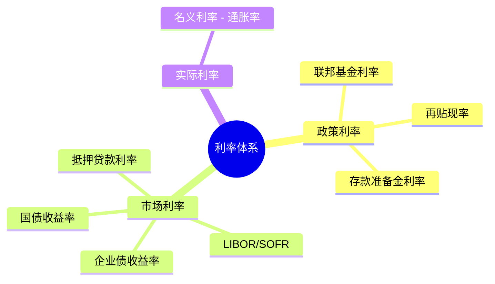
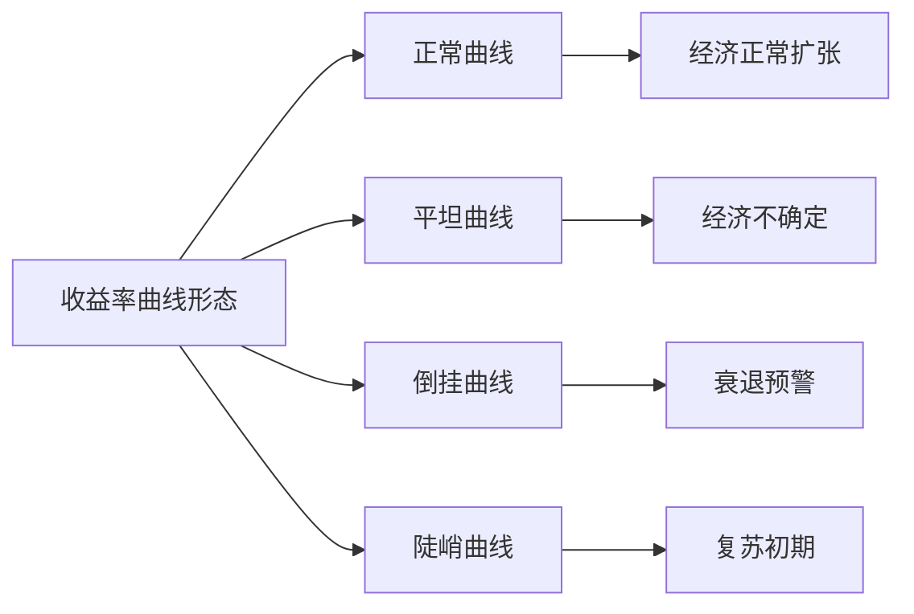
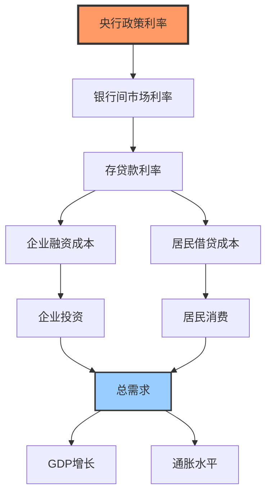

# 利率机制：金融市场的核心价格

## 概述

利率是资金的价格，是金融市场最核心的变量。理解利率不仅是掌握宏观经济分析的关键，更是所有资产定价的基础。


**学习目标**：
- 掌握利率的决定因素和传导机制
- 理解收益率曲线的形态和经济含义
- 学会使用利率数据预测经济周期和货币政策
- 了解利率对不同资产估值的影响

**为什么重要**：利率是"万物之锚"，影响所有资产的估值。股票的DCF估值、债券价格、房地产价值、货币汇率，都与利率密切相关。巴菲特说："利率之于资产价格，就像地心引力之于物体。"

## 核心概念

### 利率的定义和类型

**基本定义**：
```
利率 = 利息 / 本金 × 100%
```

**主要利率类型**：



**1. 政策利率（Policy Rates）**：
- **联邦基金利率**（Fed Funds Rate）：美国银行间隔夜拆借利率
- **再贴现率**（Discount Rate）：央行向商业银行贷款利率
- **存款准备金利率**（IOER）：央行支付给银行的准备金利息

**2. 市场利率（Market Rates）**：
- **国债收益率**：无风险利率基准
- **SOFR**（Secured Overnight Financing Rate）：替代LIBOR的新基准
- **企业债收益率**：国债收益率 + 信用利差


**3. 实际利率 vs 名义利率**：
- **名义利率**：市场观察到的利率
- **实际利率**：扣除通胀后的利率
- **关系**：实际利率 = 名义利率 - 预期通胀率

### 利率的决定因素

**古典理论：储蓄-投资平衡**
```
利率 = f(储蓄供给, 投资需求)
```
- 储蓄增加 → 利率下降
- 投资需求增加 → 利率上升

**流动性偏好理论（凯恩斯）**：
```
利率 = f(货币供给, 货币需求)
```
- 央行增加货币供给 → 利率下降
- 经济活动增加货币需求 → 利率上升

**费雪效应（Fisher Effect）**：
```
名义利率 = 实际利率 + 预期通胀率
```
- 通胀预期上升 → 名义利率上升
- 长期：名义利率跟随通胀变化

**现代综合框架**：
```
利率 = 实际均衡利率 + 预期通胀 + 风险溢价 + 期限溢价
```

## 收益率曲线

### 曲线形态与经济含义




**1. 正常曲线（Normal/Upward Sloping）**：
- 长期利率 > 短期利率
- 经济正常扩张
- 通胀预期稳定
- 例：2年期2%, 10年期4%

**2. 平坦曲线（Flat）**：
- 长短期利率接近
- 经济增长不确定
- 政策转向信号
- 例：2年期3.5%, 10年期3.7%

**3. 倒挂曲线（Inverted）**：
- 短期利率 > 长期利率
- 衰退预警信号（准确率高）
- 央行过度收紧
- 例：2年期4.5%, 10年期4.0%

**4. 陡峭曲线（Steep）**：
- 长短期利差扩大
- 经济复苏初期
- 宽松政策 + 增长预期
- 例：2年期0.5%, 10年期3.5%

### 收益率曲线倒挂与衰退

**历史规律**：
- 过去50年，每次衰退前都出现倒挂
- 倒挂后平均12-18个月进入衰退
- 准确率：7次倒挂，7次衰退

**2022-2023年倒挂**：
- 2022年7月开始倒挂
- 最大倒挂：-108个基点（2023年7月）
- 持续时间：20+个月（历史最长）
- 市场预期：2024年可能衰退

**为什么倒挂预测衰退？**
- 央行过度加息 → 短期利率飙升
- 市场预期未来降息 → 长期利率下降
- 信贷收紧 → 经济活动放缓 → 衰退


## 实践案例

### 案例1：2018-2019年美联储政策转向

**背景**：
- 2018年：美联储持续加息（4次）
- 联邦基金利率：1.5% → 2.5%
- 收益率曲线逐渐平坦

**市场反应**：
- 2018年12月：2-10年曲线倒挂
- 股市大跌（S&P 500跌20%）
- 市场担忧衰退

**政策转向**：
- 2019年1月：鲍威尔转鸽派
- 2019年：降息3次
- 曲线恢复正常

**投资启示**：
- 曲线倒挂是重要预警信号
- 央行会根据市场反应调整政策
- 提前布局防御性资产

### 案例2：2020年疫情冲击与零利率

**政策应对**：
- 2020年3月：紧急降息至0-0.25%
- 同时启动无限量QE
- 购买国债和MBS

**收益率曲线变化**：
- 短端：接近0%（政策锚定）
- 长端：先跌后升（通胀预期）
- 曲线陡峭化（0.5% vs 1.8%）

**投资机会**：
- 零利率 + QE：股市大涨
- 陡峭曲线：银行股受益（净息差扩大）
- 通胀预期：大宗商品、TIPS


### 案例3：中国利率市场化改革

**改革历程**：
- 2013年：放开贷款利率下限
- 2015年：放开存款利率上限
- 2019年：LPR改革（贷款市场报价利率）

**LPR机制**：
```
LPR = MLF利率 + 加点
```
- MLF（中期借贷便利）：央行政策利率
- 加点：银行根据市场情况确定
- 每月20日报价

**影响**：
- 利率传导更市场化
- 降低实体经济融资成本
- 银行净息差收窄

**投资启示**：
- 关注LPR变化（政策信号）
- 银行股估值受净息差影响
- 利率下降利好地产、基建

## 利率传导机制

### 从政策利率到市场利率




**传导路径**：
1. **利率渠道**：政策利率 → 市场利率 → 投资和消费
2. **信贷渠道**：利率上升 → 银行惜贷 → 信贷收缩
3. **资产价格渠道**：利率上升 → 股价下跌 → 财富效应 → 消费下降
4. **汇率渠道**：利率上升 → 本币升值 → 出口下降
5. **预期渠道**：政策信号 → 预期改变 → 行为调整

**传导时滞**：
- 短期（1-3个月）：金融市场反应
- 中期（6-12个月）：实体经济影响
- 长期（12-24个月）：通胀和就业效果

### 实际利率的重要性

**费雪方程式**：
```
实际利率 = 名义利率 - 预期通胀率
```

**经济含义**：
- 实际利率是真实的资金成本
- 负实际利率：鼓励借贷和投资
- 高实际利率：抑制需求

**投资应用**：
- 实际利率 < 0：利好股票、房地产、黄金
- 实际利率 > 3%：利好现金、债券
- 实际利率是资产配置的关键变量

## 收益率曲线深度分析

### 期限结构理论

**1. 预期理论（Expectations Theory）**：
```
长期利率 = 未来短期利率的平均预期
```
- 10年期利率 = 未来10年短期利率的平均
- 曲线形态反映利率预期


**2. 流动性偏好理论（Liquidity Preference）**：
```
长期利率 = 预期短期利率 + 流动性溢价
```
- 长期债券流动性差，要求更高回报
- 曲线通常向上倾斜

**3. 市场分割理论（Market Segmentation）**：
- 不同期限债券市场相对独立
- 供需决定各期限利率
- 央行可以通过购债影响特定期限

**4. 偏好栖息地理论（Preferred Habitat）**：
- 投资者偏好特定期限
- 但价格合适会跨期限投资
- 综合了预期和分割理论

### 收益率曲线的关键点位

**关键利差**：

**10年期-2年期利差**：
- 最重要的衰退预测指标
- 倒挂（<0）：衰退概率高
- 正常：50-150个基点

**10年期-3个月利差**：
- 另一个重要指标
- 倒挂持续3个月：衰退信号强

**30年期-10年期利差**：
- 反映长期增长预期
- 收窄：长期增长悲观

## 利率与资产估值

### 股票估值

**DCF模型中的利率**：
```
股票价值 = Σ [未来现金流 / (1 + 折现率)^t]
折现率 = 无风险利率 + 股权风险溢价
```

**利率上升的影响**：
- 折现率上升 → 现值下降
- 成长股影响更大（现金流在远期）
- 价值股相对抗跌（现金流在近期）


**市盈率与利率的关系**：
```
合理市盈率 ≈ 1 / 无风险利率
```
- 10年期国债收益率5% → 合理PE约20倍
- 10年期国债收益率2% → 合理PE约50倍
- 这是简化模型，实际还要考虑增长率和风险

### 债券价格

**债券定价公式**：
```
债券价格 = Σ [票息 / (1+r)^t] + [面值 / (1+r)^n]
```
- r：到期收益率（市场利率）
- 利率上升 → 债券价格下降
- 久期越长，价格敏感度越高

**久期（Duration）**：
```
久期 ≈ 价格变化% / 利率变化%
```
- 10年期国债久期约9年
- 利率上升1% → 价格下跌约9%

### 房地产估值

**抵押贷款利率影响**：
```
月供 = 贷款额 × [r(1+r)^n] / [(1+r)^n - 1]
```
- 利率上升 → 月供增加 → 购买力下降
- 房价承压

**资本化率（Cap Rate）**：
```
房地产价值 = 年租金 / 资本化率
资本化率 = 无风险利率 + 风险溢价
```
- 利率上升 → 资本化率上升 → 房价下降

## 常见误区

**误区1：利率越低越好**
- 现实：负利率扭曲资源配置
- 日本、欧洲负利率效果有限
- 正确认识：适度正利率更健康


**误区2：曲线倒挂立即衰退**
- 现实：倒挂后平均12-18个月才衰退
- 有时间窗口调整配置
- 正确认识：倒挂是预警，不是立即信号

**误区3：只看名义利率**
- 现实：实际利率更重要
- 高通胀时名义利率5%可能是负实际利率
- 正确认识：始终关注实际利率

**误区4：忽视全球利差**
- 现实：资本跨境流动
- 美国加息 → 全球资金回流美国
- 正确认识：关注主要经济体利差变化

## 实战应用

### 利率分析框架

**1. 判断利率周期**：
```
当前利率 vs 历史均值 → 高位/低位
实际利率 vs 中性利率 → 紧缩/宽松
收益率曲线形态 → 周期阶段
```

**2. 预测利率走势**：
- 通胀趋势（主要驱动力）
- 经济增长（GDP、就业）
- 央行态度（会议纪要、讲话）
- 财政政策（赤字、发债）

**3. 资产配置决策**：

| 利率环境 | 股票 | 债券 | 黄金 | 房地产 |
|----------|------|------|------|--------|
| 低利率+下降 | ++ | ++ | + | ++ |
| 低利率+稳定 | ++ | + | + | + |
| 高利率+上升 | -- | -- | ++ | - |
| 高利率+稳定 | + | ++ | + | - |


**4. 行业配置**：
- 利率下降：金融（银行、保险）、地产、公用事业
- 利率上升：能源、原材料、必需消费

### 实用工具

**关键数据源**：
- **美国国债收益率**：https://www.treasury.gov/
- **FRED**：完整收益率曲线历史数据
- **Bloomberg**：实时利率和曲线
- **中国债券信息网**：http://www.chinabond.com.cn/

**分析检查清单**：
- [ ] 联邦基金利率目标区间
- [ ] 2年期、10年期国债收益率
- [ ] 10-2利差（倒挂？）
- [ ] 实际利率（名义利率 - 通胀）
- [ ] 与历史均值比较
- [ ] 市场对未来利率的预期（期货市场）

## 延伸阅读

### 推荐书籍

1. **《利率史》** - Sidney Homer & Richard Sylla
   - 4000年利率历史
   - 理解利率的长期规律

2. **《债券市场分析与策略》** - Frank Fabozzi
   - 第5章：利率期限结构
   - 收益率曲线详解

3. **《货币金融学》** - Frederic Mishkin
   - 第4-6章：利率决定和风险结构
   - 系统理论框架


## 参考文献

### 学术文献

1. Fisher, I. (1930). *The Theory of Interest*. Macmillan.
   - 利率理论奠基之作
   - 费雪效应

2. Estrella, A., & Mishkin, F. S. (1998). "Predicting U.S. Recessions: Financial Variables as Leading Indicators". *Review of Economics and Statistics*, 80(1), 45-61.
   - 收益率曲线预测衰退

3. Taylor, J. B. (1993). "Discretion versus Policy Rules in Practice". *Carnegie-Rochester Conference Series on Public Policy*, 39, 195-214.
   - 泰勒规则原始论文

### 央行文献

4. Federal Reserve. "Implementation Note issued by the Federal Open Market Committee".
   - 利率政策实施细节
   - https://www.federalreserve.gov/

5. Bernanke, B. S. (2020). "The New Tools of Monetary Policy". *American Economic Review*, 110(4), 943-983.
   - 现代货币政策工具

### 投资应用

6. Damodaran, A. (2012). *Investment Valuation*. Wiley.
   - 第7章：无风险利率
   - 估值中的利率选择

7. Ilmanen, A. (2011). *Expected Returns*. Wiley.
   - 第3章：债券风险溢价
   - 第14章：利率与资产回报

---

**下一步学习**：掌握利率机制后，建议学习 [就业指标](employment-indicators.html)，理解劳动力市场如何影响通胀和利率。
8. Mankiw, N. G. (2019). *Macroeconomics* (10th ed.). Worth Publishers.

