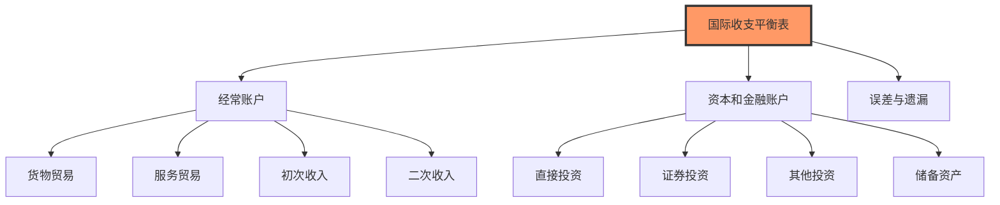
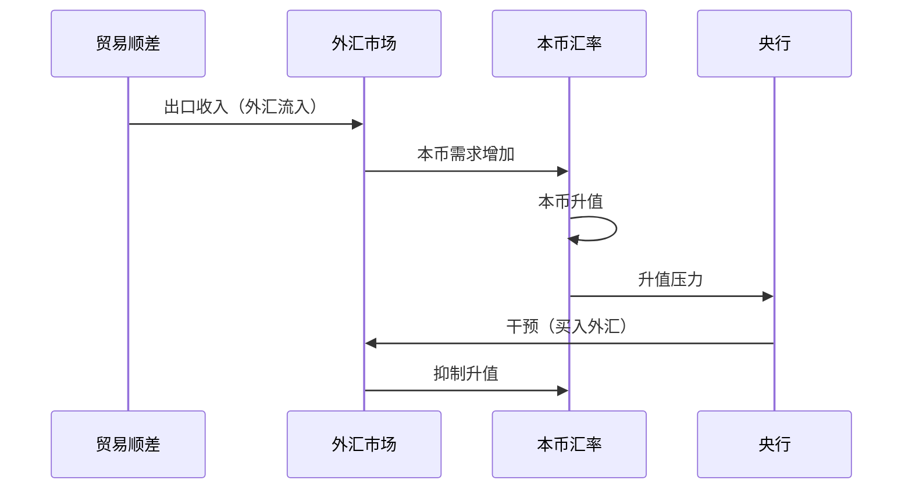

# 贸易平衡：国际经济关系的核心指标

## 概述

贸易平衡（Trade Balance）是一国出口与进口的差额，反映国际竞争力和经济结构。理解贸易平衡不仅是掌握国际经济的基础，更是分析汇率、资本流动和全球经济格局的关键。


**学习目标**：
- 掌握贸易平衡、经常账户、资本账户的定义和关系
- 理解国际收支平衡表的结构和分析方法
- 学会使用贸易数据分析汇率和经济结构
- 了解贸易失衡的原因和影响

**为什么重要**：贸易数据反映一国的国际竞争力和经济开放度。贸易顺差/逆差影响汇率、就业、产业结构，也是地缘政治博弈的焦点（如中美贸易摩擦）。投资者需要理解贸易格局，才能把握全球资本流动和货币政策。

## 核心概念

### 贸易平衡的定义

**公式**：
```
贸易平衡 = 出口 - 进口
```

**分类**：
- **贸易顺差**（Trade Surplus）：出口 > 进口，正值
- **贸易逆差**（Trade Deficit）：出口 < 进口，负值
- **贸易平衡**：出口 = 进口，零

**商品贸易 vs 服务贸易**：
- **商品贸易**：实物商品（汽车、电子产品、农产品）
- **服务贸易**：无形服务（旅游、金融、咨询、软件）
- 美国：商品逆差大，服务顺差
- 中国：商品顺差大，服务逆差

### 国际收支平衡表




**恒等式**：
```
经常账户 + 资本和金融账户 + 误差与遗漏 = 0
```

**经常账户（Current Account）**：
1. **货物贸易**：商品进出口
2. **服务贸易**：服务进出口
3. **初次收入**：投资收益（利息、股息）
4. **二次收入**：转移支付（援助、侨汇）

**资本和金融账户（Capital and Financial Account）**：
1. **直接投资**（FDI）：跨国公司投资
2. **证券投资**：股票、债券投资
3. **其他投资**：贷款、存款
4. **储备资产**：外汇储备变化

### 贸易平衡与GDP

**在GDP中的位置**：
```
GDP = C + I + G + (X - M)
```
- X：出口
- M：进口
- (X - M)：净出口 = 贸易平衡

**贸易对GDP的贡献**：
- 顺差扩大：拉动GDP增长
- 逆差扩大：拖累GDP增长
- 但不是越大越好（需要看结构）

## 贸易失衡的原因

### 储蓄-投资缺口理论

**恒等式**：
```
经常账户 = 储蓄 - 投资
```

**推导**：
```
GDP = C + I + G + (X - M)
GDP = C + S + T (收入角度)
→ (X - M) = (S - I) + (T - G)
```


**含义**：
- **美国逆差**：储蓄 < 投资（借外国钱投资和消费）
- **中国顺差**：储蓄 > 投资（储蓄过剩，输出资本）

### 竞争力因素

**1. 汇率**：
- 本币贬值 → 出口竞争力提升 → 顺差扩大
- 本币升值 → 进口增加 → 顺差收窄

**2. 生产成本**：
- 劳动力成本
- 能源成本
- 技术水平

**3. 产业结构**：
- 制造业强 → 商品出口多
- 服务业强 → 服务出口多

**4. 贸易政策**：
- 关税
- 配额
- 非关税壁垒

## 实践案例

### 案例1：美国长期贸易逆差

**数据**：
- 1976年开始持续逆差
- 2024年：约-$800B/年（占GDP约3%）
- 主要逆差来源：中国、墨西哥、德国、日本

**原因分析**：
- 储蓄率低（3-5%）
- 消费文化（超前消费）
- 美元储备货币地位（可以印钱买东西）
- 产业空心化（制造业外移）

**可持续性争议**：
- 悲观派：不可持续，美元终将崩溃
- 乐观派：美元霸权，可以持续
- 现实：逐步调整，不会突然崩溃


**投资启示**：
- 美国逆差 → 美元长期贬值压力
- 但短期受利率、避险需求影响
- 关注逆差占GDP比例（>5%警戒）

### 案例2：中国贸易顺差演变

**历史趋势**：
- 2000年：$240B
- 2008年：$2980B（峰值，占GDP 8%）
- 2024年：$8000B（绝对值增加，但占GDP比例降至2%）

**结构变化**：
- 加工贸易占比下降
- 一般贸易占比上升
- 高技术产品出口增加
- 服务贸易逆差扩大（旅游、教育）

**政策调整**：
- 扩大进口（进博会）
- 鼓励消费（减少储蓄）
- 产业升级（从量到质）
- 人民币汇率市场化

**投资启示**：
- 顺差收窄：人民币升值压力减小
- 进口增加：消费升级机会
- 出口升级：高端制造业机会

### 案例3：德国的持续顺差

**数据**：
- 经常账户顺差：占GDP 7-8%
- 主要顺差来源：欧元区内、美国

**原因**：
- 制造业竞争力强（汽车、机械）
- 欧元相对德国马克被低估
- 高储蓄率
- 工资增长克制


**争议**：
- 欧盟内部批评（吸走其他国家需求）
- 美国施压（要求扩大内需）

**投资启示**：
- 德国出口企业长期受益
- 欧元区内失衡是结构性问题
- 关注德国内需政策变化

## 贸易与汇率

### 贸易平衡对汇率的影响



**顺差国**：
- 外汇流入 → 本币升值压力
- 央行干预 → 积累外汇储备
- 例：中国、德国、日本

**逆差国**：
- 外汇流出 → 本币贬值压力
- 需要资本流入平衡
- 例：美国、英国

### 马歇尔-勒纳条件（Marshall-Lerner Condition）

**条件**：
```
|出口需求弹性| + |进口需求弹性| > 1
```

**含义**：
- 满足条件：贬值改善贸易平衡
- 不满足：贬值恶化贸易平衡

**J曲线效应**：
- 贬值初期：贸易平衡恶化（价格效应）
- 6-12个月后：贸易平衡改善（数量效应）


## 资本流动

### 资本账户的组成

**1. 直接投资（FDI）**：
- 长期投资，建厂、并购
- 稳定性高
- 中国：FDI流入大国

**2. 证券投资（Portfolio Investment）**：
- 股票、债券投资
- 流动性强，波动大
- 热钱（Hot Money）主要形式

**3. 其他投资**：
- 银行贷款
- 贸易信贷

**4. 储备资产**：
- 央行外汇储备
- 黄金储备

### 资本流动的驱动因素

**利差驱动**：
```
资本流动 = f(利差, 汇率预期, 风险)
```
- 美国加息 → 利差扩大 → 资本流入美国
- 新兴市场危机 → 风险上升 → 资本外流

**风险偏好**：
- Risk-on：资金流向新兴市场、高收益资产
- Risk-off：资金流向美国、日本、瑞士（避险）

## 实践案例

### 案例1：中美贸易摩擦（2018-2020）

**背景**：
- 美国对华贸易逆差：$4000B+/年
- 特朗普政府加征关税

**数据变化**：
- 2018年：中国对美出口$5400B
- 2019年：下降至$4200B
- 但美国总逆差未明显改善（转向越南、墨西哥）


**经济影响**：
- 供应链重组
- 企业转移产能
- 消费者承担部分关税成本

**投资启示**：
- 贸易摩擦是长期趋势
- 关注供应链多元化受益者（越南、印度）
- 中国企业加速出海和产业升级

### 案例2：1997年亚洲金融危机

**背景**：
- 泰国、韩国、印尼等国经常账户逆差
- 依赖短期外债和热钱流入
- 固定汇率制度

**危机爆发**：
- 泰铢贬值 → 资本外逃
- 外汇储备耗尽
- 货币大幅贬值（30-50%）
- 经济衰退

**教训**：
- 经常账户逆差 + 短期外债 = 脆弱
- 固定汇率难以维持
- 外汇储备是安全垫

**投资启示**：
- 关注新兴市场的"双赤字"（财政+经常账户）
- 外债/外汇储备比率
- 汇率制度的可持续性

### 案例3：日本的长期顺差

**数据**：
- 1980s-2010s：持续经常账户顺差
- 主要来源：商品出口（汽车、电子）
- 2010s后：投资收益成为主要来源

**结构变化**：
- 制造业外移 → 商品顺差收窄
- 海外投资收益 → 收入顺差扩大
- 从"贸易立国"到"投资立国"


**投资启示**：
- 成熟经济体：投资收益越来越重要
- 日本企业全球布局
- 海外资产配置的重要性

## 常见误区

**误区1：顺差一定好，逆差一定坏**
- 现实：取决于原因和可持续性
- 投资驱动的逆差可能是好事（引入资本和技术）
- 消费驱动的逆差可能不可持续
- 正确认识：分析贸易失衡的结构和原因

**误区2：贸易战能消除逆差**
- 现实：逆差根源是储蓄-投资失衡
- 关税只是转移贸易伙伴
- 正确认识：需要结构性改革（提高储蓄或降低投资）

**误区3：忽视服务贸易**
- 现实：服务贸易越来越重要
- 美国服务贸易顺差$2000B+
- 正确认识：综合看商品和服务

**误区4：只看双边贸易**
- 现实：全球价值链复杂
- 中国对美出口包含日韩零部件
- 正确认识：看全球贸易格局

## 实战应用

### 贸易数据分析框架

**1. 评估经济竞争力**：
```
贸易顺差 + 高附加值出口 → 竞争力强
贸易逆差 + 低端产品进口 → 竞争力弱
```


**2. 预测汇率走势**：
- 顺差扩大 → 本币升值压力
- 逆差扩大 → 本币贬值压力
- 结合利差、风险偏好综合判断

**3. 行业配置**：
- 出口导向型经济：关注出口企业
- 内需驱动型经济：关注消费、服务
- 贸易摩擦：关注供应链重组受益者

**4. 新兴市场风险评估**：
```
风险评分 = f(经常账户/GDP, 外债/储备, 汇率制度)
```
- 经常账户逆差 > 5% GDP：警戒
- 短期外债 > 外汇储备：危险
- 固定汇率 + 资本开放：脆弱

### 实用工具

**数据源**：
- **美国商务部**：https://www.bea.gov/
  - 贸易平衡、经常账户
- **中国海关总署**：http://www.customs.gov.cn/
  - 月度进出口数据
- **IMF**：https://www.imf.org/
  - 全球国际收支数据

**分析检查清单**：
- [ ] 贸易平衡（商品+服务）
- [ ] 经常账户余额
- [ ] 经常账户/GDP比率
- [ ] 主要贸易伙伴
- [ ] 出口产品结构
- [ ] 资本流动方向
- [ ] 外汇储备变化

## 延伸阅读

### 推荐书籍

1. **《国际经济学》** - Paul Krugman & Maurice Obstfeld
   - 第2-3章：贸易理论
   - 第12-13章：国际收支


2. **《全球失衡》** - Maurice Obstfeld & Kenneth Rogoff
   - 全球贸易失衡分析
   - 调整机制

3. **《货币战争？》** - Fred Bergsten
   - 汇率操纵争议
   - 贸易政策

## 参考文献

### 学术文献

1. Obstfeld, M., & Rogoff, K. (1995). "The Intertemporal Approach to the Current Account". *Handbook of International Economics*, 3, 1731-1799.
   - 经常账户理论

2. Blanchard, O., & Milesi-Ferretti, G. M. (2009). "Global Imbalances: In Midstream?". *IMF Staff Position Note*, SPN/09/29.
   - 全球失衡分析

3. Gourinchas, P. O., & Rey, H. (2007). "International Financial Adjustment". *Journal of Political Economy*, 115(4), 665-703.
   - 国际收支调整机制

### 官方报告

4. U.S. Bureau of Economic Analysis. "U.S. International Transactions".
   - 美国国际收支数据
   - https://www.bea.gov/data/intl-trade-investment

5. 国家外汇管理局. "国际收支平衡表".
   - 中国国际收支数据
   - http://www.safe.gov.cn/

### 投资应用

6. Dalio, R. (2018). "A Template for Understanding Big Debt Crises". Bridgewater Associates.
   - 第3部分：国际收支危机

7. Rogoff, K., & Reinhart, C. (2009). *This Time Is Different*. Princeton University Press.
   - 第10章：贸易失衡与危机

---

**下一步学习**：完成宏观经济学基础后，建议学习 [经济周期理论](../economic-cycles/cycle-overview.html)，理解经济如何在扩张和收缩之间循环。
8. Mankiw, N. G. (2019). *Macroeconomics* (10th ed.). Worth Publishers.


## 深度分析

### 核心机制解析

理解本主题需要从多个维度进行系统性分析。以下从理论基础、实践应用和历史验证三个层面展开深度探讨。

**理论基础层面**：本主题的核心逻辑建立在经济学和金融学的基本原理之上。通过对基础理论的深入理解，投资者能够建立起稳固的分析框架，避免被市场短期噪音所干扰。

**实践应用层面**：理论必须与实践相结合才能产生价值。在实际投资决策中，需要将抽象的概念转化为具体的分析工具和决策标准。

**历史验证层面**：金融市场有着丰富的历史记录，通过研究历史案例，我们可以验证理论的有效性，并从中提炼出具有普遍意义的规律。

### 关键影响因素

影响本主题的关键因素可以从以下几个维度进行分析：

1. **宏观经济环境**：利率水平、通货膨胀率、经济增长速度等宏观变量对本主题有着深远影响。在不同的宏观经济周期中，相关指标的表现会呈现出显著差异。

2. **市场结构因素**：市场参与者的构成、信息传播机制、流动性状况等市场结构因素决定了价格发现的效率和准确性。

3. **政策监管环境**：政府政策、监管框架的变化会直接影响相关市场的运作规则和参与者行为。

4. **技术创新驱动**：技术进步不断改变着金融市场的运作方式，从算法交易到区块链技术，每一次技术革新都带来新的机遇和挑战。

5. **全球化与地缘政治**：在全球化背景下，各国市场之间的联动性日益增强，地缘政治风险的影响也越来越不可忽视。

### 量化分析框架

为了更精确地分析和评估，可以采用以下量化框架：

| 分析维度 | 关键指标 | 参考基准 | 分析方法 |
|---------|---------|---------|---------|
| 规模评估 | 绝对值与相对值 | 历史均值 | 趋势分析 |
| 质量评估 | 稳定性指标 | 行业对标 | 横向比较 |
| 风险评估 | 波动率指标 | 风险阈值 | 情景分析 |
| 价值评估 | 估值倍数 | 历史区间 | 回归分析 |

通过系统性地应用上述框架，投资者可以对目标进行全面、客观的评估，从而做出更加理性的投资决策。

