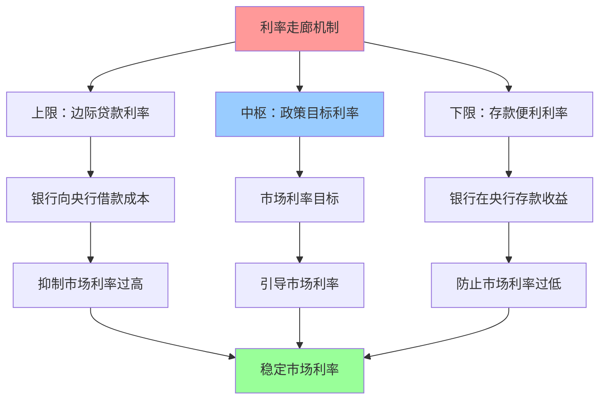
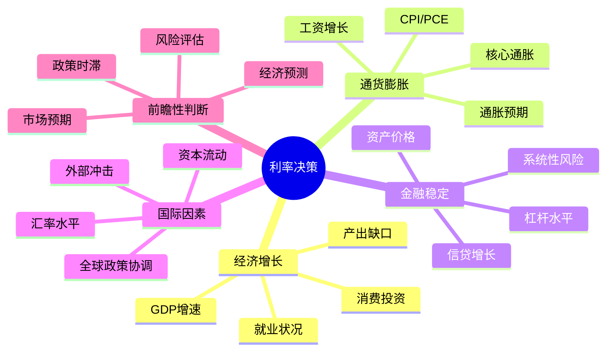
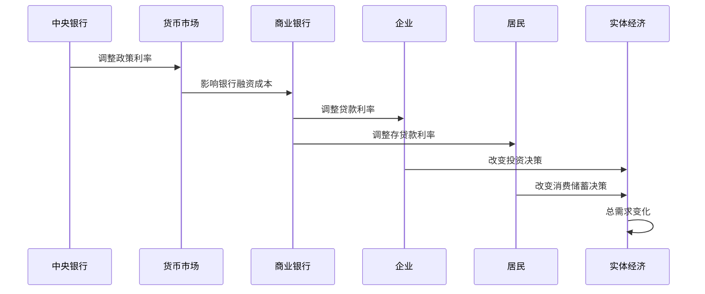

# 利率政策机制

## 概述

利率政策是中央银行最核心、最常用的货币政策工具。通过调整政策利率，央行可以影响整个经济体的借贷成本、投资决策和消费行为，进而实现价格稳定和经济增长的目标。理解利率政策的运作机制，是把握宏观经济走向和进行投资决策的关键。

**学习目标**：
1. 掌握政策利率的定义、类型和决定机制
2. 理解利率传导的多重渠道和影响路径
3. 分析利率政策对不同经济主体的影响
4. 认识利率政策的局限性和副作用
5. 学会跟踪和解读央行利率决策

## 政策利率体系

### 主要政策利率类型

**1. 美联储：联邦基金利率 (Federal Funds Rate)**

联邦基金利率是美国银行间隔夜拆借利率的目标区间，是美联储最重要的政策工具。

- **定义**：银行间隔夜无抵押贷款利率
- **目标区间**：FOMC设定目标区间（如2.25%-2.50%）
- **实现机制**：通过公开市场操作调控
- **锚定工具**：
  - IOER（超额准备金利率）：利率走廊上限
  - ON RRP（隔夜逆回购利率）：利率走廊下限

**2. 欧央行：三大关键利率**

欧央行使用三个利率构成利率走廊：

- **主要再融资利率 (MRO Rate)**：基准利率，银行从央行获得一周期资金的利率
- **边际贷款便利利率 (MLF Rate)**：走廊上限，银行隔夜借款利率
- **存款便利利率 (Deposit Facility Rate)**：走廊下限，银行在央行存款利率（可为负）

**3. 中国人民银行：LPR改革**

2019年LPR（贷款市场报价利率）改革后，中国形成了新的利率体系：

- **MLF利率（中期借贷便利）**：政策利率锚
- **LPR（贷款市场报价利率）**：贷款定价基准
  - 1年期LPR：短期贷款参考
  - 5年期以上LPR：房贷等长期贷款参考
- **存款基准利率**：仍保留但逐步市场化

**4. 日本央行：政策利率与YCC**

- **政策利率**：长期维持在-0.1%
- **收益率曲线控制(YCC)**：将10年期国债收益率控制在0%附近（±0.5%波动区间）

### 利率走廊机制

利率走廊通过设定上下限，将市场利率稳定在目标区间内：
- **上限**：银行不会以高于边际贷款利率的成本借入资金
- **下限**：银行不会以低于存款利率的收益贷出资金
- **中枢**：央行通过公开市场操作将市场利率引导至目标水平

## 利率决策机制

### 决策机构与流程

**美联储FOMC（联邦公开市场委员会）**

- **成员**：7名理事+5名地区联储主席（纽约联储主席为常任，其他4席轮换）
- **会议频率**：每年8次定期会议
- **决策流程**：
  1. 经济数据分析和预测
  2. 各成员发表观点
  3. 投票决定利率目标区间
  4. 发布政策声明
  5. 主席召开新闻发布会
  6. 三周后公布会议纪要

**欧央行理事会**

- **成员**：6名执委+19国央行行长
- **会议频率**：每6周一次
- **决策方式**：共识决策，避免投票

**中国人民银行货币政策委员会**

- **成员**：央行行长+相关部委+专家学者
- **会议频率**：每季度一次
- **决策方式**：讨论货币政策大方向，具体操作由央行决定

### 利率决策的考量因素

**1. 双重使命（美联储）**
- **充分就业**：失业率接近自然失业率（约4%）
- **价格稳定**：通胀率维持在2%左右

**2. 单一目标（欧央行）**
- **价格稳定**：中期通胀率低于但接近2%

**3. 多目标（中国人民银行）**
- 保持货币币值稳定
- 促进经济增长
- 维护金融稳定
- 平衡内外均衡

## 利率传导机制

### 传导渠道详解

**1. 利率渠道（Interest Rate Channel）**

这是最直接的传导路径：

**传导路径**：
- 政策利率↓ → 市场利率↓ → 贷款利率↓ → 借贷成本↓ → 投资消费↑ → 总需求↑

**影响因素**：
- 银行竞争程度
- 贷款需求弹性
- 企业融资结构
- 居民债务水平

**2. 信贷渠道（Credit Channel）**

利率变化影响银行的放贷能力和意愿：

**银行贷款渠道**：
- 降息 → 银行资金成本↓ → 放贷能力↑ → 信贷供给↑ → 投资消费↑

**资产负债表渠道**：
- 降息 → 企业资产价值↑ → 抵押品价值↑ → 借贷能力↑ → 投资↑

**3. 资产价格渠道（Asset Price Channel）**

利率变化影响各类资产的估值：

**股票市场**：
- 降息 → 贴现率↓ → 股票估值↑ → 财富效应 → 消费↑
- 降息 → 企业融资成本↓ → 盈利预期↑ → 股价↑

**房地产市场**：
- 降息 → 房贷利率↓ → 购房成本↓ → 房价↑ → 财富效应 → 消费↑

**债券市场**：
- 降息 → 债券价格↑ → 资本利得 → 财富效应

**4. 汇率渠道（Exchange Rate Channel）**

利率变化影响资本流动和汇率：

- 降息 → 利差缩小 → 资本流出 → 本币贬值 → 出口↑进口↓ → 净出口↑

**5. 预期渠道（Expectations Channel）**

央行的利率决策和前瞻性指引影响市场预期：

- 降息信号 → 宽松预期 → 长期利率↓ → 投资消费↑
- 前瞻性指引 → 稳定预期 → 降低不确定性 → 促进投资

### 传导效率的影响因素

**1. 金融市场发达程度**
- 市场化程度高 → 传导效率高
- 金融工具丰富 → 传导渠道多元

**2. 银行体系健康度**
- 银行资本充足 → 放贷能力强
- 不良贷款率低 → 传导顺畅

**3. 企业和居民资产负债状况**
- 杠杆率适中 → 对利率敏感
- 杠杆率过高 → 去杠杆压力，传导受阻

**4. 经济周期阶段**
- 扩张期 → 传导效率高
- 衰退期 → 流动性陷阱，传导受阻

## 利率政策的经济影响

### 对不同经济主体的影响

**1. 企业**

**降息影响**：
- ✓ 融资成本降低，利好高负债企业
- ✓ 投资回报率相对提高，刺激资本开支
- ✓ 现金流改善，减轻债务负担
- ✗ 存款收益降低

**加息影响**：
- ✗ 融资成本上升，压缩利润空间
- ✗ 投资回报率要求提高，抑制扩张
- ✗ 债务负担加重
- ✓ 存款收益提高

**2. 居民**

**降息影响**：
- ✓ 房贷车贷成本降低
- ✓ 资产价格上涨（股票、房产）
- ✗ 存款收益降低
- ✗ 储蓄意愿下降

**加息影响**：
- ✗ 贷款成本上升
- ✗ 资产价格下跌
- ✓ 存款收益提高
- ✓ 储蓄意愿上升

**3. 金融机构**

**降息影响**：
- ✗ 净息差收窄，盈利压力
- ✓ 资产质量改善（借款人还款能力提升）
- ✓ 贷款需求增加

**加息影响**：
- ✓ 净息差扩大，盈利改善
- ✗ 资产质量恶化风险
- ✗ 贷款需求下降

**4. 政府**

**降息影响**：
- ✓ 债务成本降低
- ✓ 经济刺激，税收增加
- ✗ 通胀压力上升

**加息影响**：
- ✗ 债务成本上升
- ✗ 经济放缓，税收减少
- ✓ 通胀压力下降

### 对资产价格的影响

**股票市场**

**降息利好**：
- 贴现率下降，估值提升
- 企业盈利改善
- 流动性充裕，资金流入
- 风险偏好上升

**行业差异**：
- 高成长股（科技）：对利率敏感度高，降息大幅受益
- 金融股：净息差收窄，降息利空
- 公用事业：类债券属性，降息受益
- 周期股：经济复苏预期，降息受益

**债券市场**

**降息影响**：
- 债券价格上涨（收益率下降）
- 长期债券涨幅大于短期债券
- 信用债表现优于国债

**收益率曲线变化**：
- 降息 → 曲线陡峭化（短端下降快）
- 加息 → 曲线平坦化（短端上升快）

**房地产市场**

**降息影响**：
- 房贷利率下降，购房成本降低
- 购房需求增加
- 房价上涨
- 房地产投资增加

**时滞效应**：
- 利率变化 → 3-6个月后影响房价
- 房价变化 → 6-12个月后影响投资

**外汇市场**

**降息影响**：
- 利差缩小，资本流出
- 本币贬值压力
- 出口竞争力提升

**汇率传导**：
- 利率差异 → 资本流动 → 汇率变化 → 贸易平衡

## 利率政策的实践案例

### 案例1：沃尔克加息抗通胀（1979-1982）

**背景**：
- 1970年代美国陷入滞胀，通胀率超过13%
- 1979年保罗·沃尔克出任美联储主席

**政策行动**：
- 1979-1981年：联邦基金利率从11%大幅提高至20%
- 采用货币供应量目标制，容忍利率大幅波动
- 坚定的反通胀立场

**效果**：
- 通胀率从13.5%（1980）降至3.2%（1983）
- 代价：1981-1982年经济衰退，失业率升至10.8%
- 长期：恢复美联储信誉，奠定低通胀基础

**启示**：
- 控制通胀需要坚定决心和短期代价
- 央行独立性和信誉至关重要
- 预期管理是关键

### 案例2：格林斯潘的渐进式加息（2004-2006）

**背景**：
- 2001-2003年互联网泡沫破裂后，美联储大幅降息至1%
- 2004年经济复苏，需要退出宽松政策

**政策行动**：
- 2004年6月至2006年6月：17次连续加息，每次25bp
- 联邦基金利率从1%升至5.25%
- 明确的前瞻性指引："以可衡量的步伐"加息

**效果**：
- 经济实现软着陆，通胀得到控制
- 但房地产泡沫继续膨胀
- 为2008年金融危机埋下隐患

**启示**：
- 渐进式加息可以减少市场波动
- 但可能错过最佳时机
- 需要关注资产泡沫风险

### 案例3：2015-2018年美联储加息周期

**背景**：
- 2008年金融危机后，联邦基金利率维持在0-0.25%长达7年
- 2015年经济复苏稳固，失业率降至5%以下

**政策行动**：
- 2015年12月首次加息25bp
- 2016年加息1次，2017年加息3次，2018年加息4次
- 利率从0.25%升至2.5%
- 同时缩减资产负债表（缩表）

**市场反应**：
- 2018年底股市大幅下跌
- 新兴市场资本外流
- 美元走强

**政策调整**：
- 2019年转向降息，应对经济放缓
- "鹰派加息，鸽派暂停"

**启示**：
- 加息周期需要灵活调整
- 关注金融条件收紧的累积效应
- 全球溢出效应不可忽视

### 案例4：2020-2023年疫情后的利率周期

**第一阶段：紧急降息（2020年3月）**
- 两周内两次紧急降息，利率降至0-0.25%
- 配合无限量QE
- 稳定金融市场

**第二阶段：长期维持低利率（2020-2021）**
- 承诺维持低利率直到充分就业和通胀达标
- 平均通胀目标制：容忍通胀超过2%

**第三阶段：激进加息（2022-2023）**
- 2022年3月开始加息
- 2022年连续4次加息75bp（40年来首次）
- 利率从0.25%升至5.5%（2023年7月）
- 加息速度为1980年代以来最快

**效果**：
- 通胀从9.1%（2022年6月）降至3%左右（2023年底）
- 经济保持韧性，避免严重衰退
- 但银行业出现压力（硅谷银行倒闭）

**启示**：
- 应对通胀需要果断行动
- 快速加息的副作用需要关注
- 金融稳定与价格稳定的平衡

## 利率政策的局限性

### 零利率下限问题

**流动性陷阱**：
- 利率接近零时，货币政策失效
- 企业和居民不愿借贷投资
- 需要非常规工具（QE、负利率）

**负利率的争议**：
- 理论上可以突破零下限
- 但对银行盈利和金融稳定的负面影响
- 效果有限，可能适得其反

### 时滞效应

**内部时滞**：
- 认识时滞：识别经济问题需要时间
- 决策时滞：政策制定需要时间

**外部时滞**：
- 利率变化 → 6-12个月后影响投资
- 利率变化 → 12-18个月后影响通胀
- 可能错过最佳时机

### 不对称性

**推绳子效应**：
- 加息容易收紧经济
- 降息难以刺激经济（企业不愿借贷）
- 宽松政策效果有限

### 副作用

**资产泡沫**：
- 长期低利率推高资产价格
- 股市、房地产泡沫风险
- 加剧财富不平等

**僵尸企业**：
- 低利率使低效企业存续
- 资源错配，降低生产率

**金融稳定风险**：
- 低利率鼓励过度冒险
- 金融脆弱性上升

## 投资者应对策略

### 跟踪利率政策

**1. 关注政策会议**
- 美联储FOMC会议（每年8次）
- 欧央行理事会（每6周）
- 中国人民银行LPR报价（每月20日）

**2. 解读政策信号**
- 政策声明措辞变化
- 经济预测（点阵图）
- 主席讲话和会议纪要

**3. 跟踪经济数据**
- 通胀数据（CPI、PCE）
- 就业数据（非农就业、失业率）
- GDP增长
- 工资增长

### 资产配置调整

**降息周期**：
- ✓ 增配股票（尤其是成长股、科技股）
- ✓ 增配长期债券
- ✓ 增配房地产
- ✗ 减配现金

**加息周期**：
- ✗ 减配高估值成长股
- ✓ 增配价值股、金融股
- ✓ 增配短期债券
- ✓ 增配现金

**利率见顶期**：
- 最佳买入时机
- 关注政策转向信号
- 提前布局受益资产

### 行业轮动策略

**利率敏感行业**：
- 房地产、公用事业、REITs：降息受益
- 金融（银行）：加息受益（净息差扩大）
- 科技成长股：降息受益（估值提升）

**利率不敏感行业**：
- 必需消费品
- 医疗保健
- 能源

## 常见误区

**误区1：降息一定利好股市**
- 降息可能反映经济恶化
- 需要综合判断经济基本面
- 关注降息的原因和力度

**误区2：加息一定利空股市**
- 加息可能反映经济强劲
- 温和加息有利于经济健康
- 关注加息的节奏和预期

**误区3：利率决定一切**
- 利率只是影响因素之一
- 企业盈利、估值、风险偏好同样重要
- 需要综合分析

**误区4：简单线性外推**
- 利率政策会根据经济变化调整
- 不要假设趋势会持续
- 关注政策转向信号

## 延伸阅读

### 经典著作

1. **《利率史》** - Sidney Homer & Richard Sylla
   - 4000年利率历史
   - 理解利率的长期规律

2. **《货币政策的艺术》** - Alan S. Blinder
   - 前美联储副主席的实践经验
   - 利率决策的艺术

3. **《这次不一样：八百年金融危机史》** - Reinhart & Rogoff
   - 利率与金融危机的关系

### 学术论文

1. Taylor, J. B. (1993). "Discretion versus Policy Rules in Practice"
   - 泰勒规则：利率决策的经验法则
2. Bernanke, B. S., & Gertler, M. (1995). "Inside the Black Box: The Credit Channel of Monetary Policy Transmission"
3. Woodford, M. (2001). "The Taylor Rule and Optimal Monetary Policy"

### 实时资源

1. **美联储经济数据库(FRED)** - fred.stlouisfed.org
   - 联邦基金利率历史数据
   - 各类利率指标
2. **CME FedWatch Tool** - cmegroup.com/markets/interest-rates/cme-fedwatch-tool
   - 市场对未来利率的预期
3. **彭博终端** - 实时利率数据和分析

## 参考文献

1. Bernanke, B. S., & Mishkin, F. S. (1997). "Inflation Targeting: A New Framework for Monetary Policy?" *Journal of Economic Perspectives*, 11(2), 97-116.
2. Taylor, J. B. (1993). "Discretion versus Policy Rules in Practice." *Carnegie-Rochester Conference Series on Public Policy*, 39, 195-214.
3. Woodford, M. (2003). *Interest and Prices: Foundations of a Theory of Monetary Policy*. Princeton University Press.
4. Mishkin, F. S. (2019). *The Economics of Money, Banking, and Financial Markets* (12th ed.). Pearson.
5. Blinder, A. S. (2018). *Through a Crystal Ball Darkly: The Future of Monetary Policy Communication*. AEA Papers and Proceedings.
6. 易纲 (2021). 《货币政策的自主性、有效性与经济金融稳定》，《经济研究》
7. 中国人民银行 (2023). 《中国货币政策执行报告》各期
8. IMF (2023). *World Economic Outlook*
9. BIS (2023). *Annual Economic Report*
10. Federal Reserve (2023). *Monetary Policy Report*
