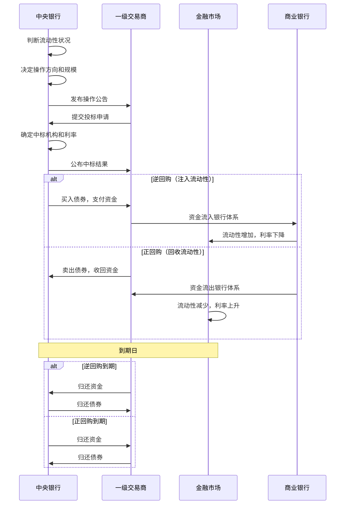
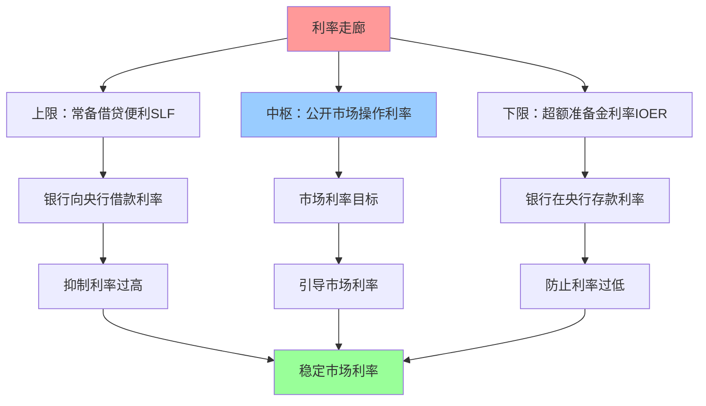

# 公开市场操作

## 概述

公开市场操作(Open Market Operations, OMO)是中央银行在公开市场上买卖政府债券等金融资产，以调节银行体系流动性和短期利率的操作。作为现代货币政策最重要、最灵活的工具，公开市场操作几乎每天都在进行，是央行实施货币政策的主要手段。

**学习目标**：
1. 掌握公开市场操作的基本原理和类型
2. 理解不同操作工具的特点和应用场景
3. 分析公开市场操作对流动性和利率的影响
4. 认识主要经济体的公开市场操作实践
5. 学会跟踪和解读央行的公开市场操作

## 公开市场操作基础

### 定义与原理

**公开市场操作**是指中央银行在金融市场上公开买卖有价证券（主要是政府债券），以调节货币供应量和利率水平的政策行为。

**基本原理**：

**买入操作（注入流动性）**：
- 央行购买债券 → 向市场支付资金 → 银行准备金增加 → 流动性增加 → 利率下降

**卖出操作（回收流动性）**：
- 央行出售债券 → 从市场收回资金 → 银行准备金减少 → 流动性减少 → 利率上升

### 公开市场操作的优势

**1. 灵活性强**
- 可以每天操作
- 操作规模可大可小
- 可以微调流动性

**2. 可逆性好**
- 买入可以卖出
- 操作可以对冲
- 易于纠正失误

**3. 主动性强**
- 央行主动发起
- 不依赖银行申请
- 操作时机可控

**4. 市场化程度高**
- 通过市场机制实现
- 价格由市场决定
- 透明度高

**5. 精准度高**
- 可以精确控制规模
- 可以针对特定期限
- 影响可预测

### 操作对象与交易对手

**操作对象（买卖的资产）**：
- 政府债券（国债、地方债）
- 央行票据
- 政策性金融债
- 高等级信用债
- 外汇（外汇市场操作）

**交易对手（一级交易商）**：
- 大型商业银行
- 政策性银行
- 证券公司
- 其他金融机构

**一级交易商制度**：
- 资格认定：资本实力、交易能力、风险管理
- 权利：参与公开市场操作、获得流动性支持
- 义务：做市、报价、承销国债

## 公开市场操作的类型

### 按操作方向分类

**1. 买入操作（扩张性）**

**目的**：向市场注入流动性，降低利率

**效果**：
- 银行准备金增加
- 货币供应量增加
- 市场利率下降
- 刺激信贷和投资

**应用场景**：
- 经济衰退，需要刺激
- 流动性紧张
- 利率过高
- 金融市场动荡

**2. 卖出操作（收缩性）**

**目的**：从市场回收流动性，提高利率

**效果**：
- 银行准备金减少
- 货币供应量减少
- 市场利率上升
- 抑制信贷和投资

**应用场景**：
- 经济过热，通胀压力
- 流动性过剩
- 利率过低
- 资产泡沫风险

### 按操作期限分类

**1. 永久性操作（Outright Operations）**

**特点**：
- 买断或卖断，不可逆
- 永久改变基础货币
- 影响长期流动性

**应用**：
- 长期流动性调节
- 配合准备金政策
- 量化宽松(QE)

**2. 临时性操作（Temporary Operations）**

**特点**：
- 回购或逆回购，可逆
- 临时调节流动性
- 到期自动对冲

**应用**：
- 日常流动性管理
- 平滑短期波动
- 实现利率目标

### 按操作工具分类

**1. 回购协议（Repurchase Agreement, Repo）**

**正回购（Repo）**：
- 央行卖出债券，约定未来买回
- 回收流动性
- 期限：7天、14天、28天等

**逆回购（Reverse Repo）**：
- 央行买入债券，约定未来卖回
- 注入流动性
- 期限：隔夜、7天、14天等

**优势**：
- 灵活性强，可逆性好
- 有抵押品，风险低
- 期限多样，精准调控

**2. 买断式操作（Outright Purchase/Sale）**

**特点**：
- 永久买入或卖出
- 不可逆转
- 影响长期流动性

**应用**：
- 量化宽松
- 长期流动性投放
- 调整央行资产负债表

**3. 央行票据（Central Bank Bills）**

**特点**：
- 央行发行的短期债务凭证
- 用于回收流动性
- 期限：3个月、6个月、1年等

**应用**：
- 中国人民银行常用工具
- 对冲外汇占款
- 流动性管理

## 公开市场操作机制

### 操作流程

### 操作决策机制

**1. 流动性监测**

**监测指标**：
- 银行间市场利率（Shibor, DR007等）
- 超额准备金率
- 货币市场成交量
- 债券收益率曲线
- 外汇市场流动性

**2. 操作决策**

**考虑因素**：
- 政策利率目标
- 流动性缺口
- 季节性因素（春节、季末、年末）
- 财政收支
- 外汇流动
- 金融市场稳定

**3. 操作实施**

**操作方式**：
- 数量招标：固定利率，竞争数量
- 利率招标：固定数量，竞争利率
- 混合招标：数量和利率都竞争

**4. 效果评估**

**评估指标**：
- 市场利率变化
- 流动性状况改善
- 政策目标实现程度
- 市场预期引导效果

### 利率走廊机制

**利率走廊的作用**：
- 上限：银行不会以高于SLF利率的成本借入资金
- 下限：银行不会以低于IOER的收益贷出资金
- 中枢：通过公开市场操作将市场利率引导至目标水平

## 主要经济体的公开市场操作

### 美联储：FOMC与公开市场操作

**操作机构**：
- 联邦公开市场委员会(FOMC)：决策机构
- 纽约联储交易台：执行机构

**主要工具**：

**1. 永久性公开市场操作(POMO)**
- 买断式购买或出售国债
- 用于长期流动性调节
- QE期间大规模使用

**2. 临时性公开市场操作(TOMO)**
- 回购和逆回购
- 日常流动性管理
- 实现联邦基金利率目标

**3. 隔夜逆回购工具(ON RRP)**
- 利率走廊下限
- 吸收过剩流动性
- 稳定短期利率

**操作特点**：
- 高度市场化
- 透明度高
- 操作规范

### 欧央行：主要再融资操作

**主要工具**：

**1. 主要再融资操作(MRO)**
- 每周一次
- 期限1周
- 提供流动性的主要渠道

**2. 长期再融资操作(LTRO)**
- 期限3个月至4年
- 提供长期流动性
- 支持银行放贷

**3. 定向长期再融资操作(TLTRO)**
- 与银行放贷挂钩
- 激励银行向实体经济放贷
- 利率可低至负值

**4. 资产购买计划(APP)**
- 购买政府债券、企业债券
- 量化宽松的主要形式
- 规模曾达每月800亿欧元

**操作特点**：
- 工具多样
- 结构性特征明显
- 支持银行放贷

### 中国人民银行：多工具组合

**主要工具**：

**1. 公开市场逆回购**
- 7天、14天、28天等期限
- 日常流动性管理
- 最常用工具

**2. 中期借贷便利(MLF)**
- 期限3个月、6个月、1年
- 中期流动性投放
- MLF利率是LPR的锚

**3. 常备借贷便利(SLF)**
- 隔夜、7天、1个月
- 利率走廊上限
- 流动性应急支持

**4. 央行票据**
- 回收流动性
- 对冲外汇占款
- 使用频率降低

**5. 国库现金定存**
- 通过商业银行定存国库资金
- 注入流动性
- 辅助工具

**操作特点**：
- 工具丰富
- 数量型为主
- 结构性调控

### 日本央行：量化质化宽松

**主要工具**：

**1. 国债购买**
- 大规模购买长期国债
- 压低长期利率
- 资产负债表扩张

**2. ETF和REITs购买**
- 购买股票ETF
- 购买房地产投资信托
- 支撑资产价格

**3. 收益率曲线控制(YCC)**
- 将10年期国债收益率控制在0%附近
- 无限量购买国债
- 维持超低利率

**操作特点**：
- 极度宽松
- 资产购买规模巨大
- 政策创新

## 公开市场操作的影响

### 对流动性的影响

**短期影响**：
- 直接改变银行准备金
- 影响银行间市场利率
- 调节流动性松紧

**中长期影响**：
- 影响货币供应量
- 改变信贷条件
- 影响经济活动

### 对利率的影响

**短期利率**：
- 直接影响银行间市场利率
- 实现政策利率目标
- 稳定短期利率波动

**长期利率**：
- 通过预期渠道影响
- 大规模购买压低长期利率
- 影响债券收益率曲线

### 对金融市场的影响

**债券市场**：
- 买入推高债券价格，降低收益率
- 卖出压低债券价格，提高收益率
- 影响收益率曲线形态

**股票市场**：
- 流动性宽松利好股市
- 利率下降提升估值
- 风险偏好上升

**外汇市场**：
- 流动性变化影响汇率
- 利差变化引发资本流动
- 影响本币汇率

### 对实体经济的影响

**信贷渠道**：
- 流动性 → 银行放贷能力 → 信贷供给 → 投资消费

**利率渠道**：
- 市场利率 → 贷款利率 → 借贷成本 → 投资消费

**资产价格渠道**：
- 流动性 → 资产价格 → 财富效应 → 消费

**预期渠道**：
- 政策信号 → 市场预期 → 投资决策

## 公开市场操作的实践案例

### 案例1：2008年金融危机期间的流动性支持

**背景**：
- 雷曼兄弟破产，信贷市场冻结
- 银行间市场利率飙升
- 金融体系面临崩溃风险

**美联储应对**：
- 大规模逆回购操作，注入流动性
- 扩大抵押品范围，接受MBS等
- 创新工具：TAF、TSLF、CPFF等
- 与其他央行货币互换

**效果**：
- 稳定银行间市场
- 恢复信贷功能
- 防止金融体系崩溃

**启示**：
- 危机时期需要果断行动
- 工具创新的重要性
- 国际协调的必要性

### 案例2：中国2013年"钱荒"事件

**背景**：
- 2013年6月，银行间市场流动性骤紧
- Shibor隔夜利率飙升至13.44%
- 部分银行面临流动性危机

**原因**：
- 季末考核，银行惜贷
- 外汇占款增速放缓
- 影子银行规模扩大
- 央行有意收紧流动性，去杠杆

**央行应对**：
- 初期未大规模注入流动性
- 后期通过SLF、再贷款等工具定向支持
- 引导银行加强流动性管理

**效果**：
- 市场利率逐步回落
- 银行加强流动性管理
- 影子银行扩张放缓

**启示**：
- 流动性管理的重要性
- 央行与市场的博弈
- 宏观审慎管理的必要性

### 案例3：2020年疫情期间的流动性投放

**背景**：
- 新冠疫情爆发，经济停摆
- 金融市场剧烈波动
- 企业和居民面临资金困难

**各国央行应对**：

**美联储**：
- 紧急降息至零
- 无限量QE，每天购买750亿美元国债和500亿美元MBS
- 扩大回购操作规模
- 创新工具支持企业和地方政府

**欧央行**：
- 推出疫情紧急购买计划(PEPP)，规模1.85万亿欧元
- 放宽抵押品要求
- 提供超长期再融资操作

**中国人民银行**：
- 降准释放1.75万亿元流动性
- 增加再贷款再贴现额度1.8万亿元
- 创设普惠小微企业贷款延期支持工具
- 保持流动性合理充裕

**效果**：
- 稳定金融市场
- 支持实体经济
- 防止经济深度衰退

**启示**：
- 危机应对需要快速、大规模行动
- 工具创新支持特定领域
- 货币政策与财政政策协调

### 案例4：2022-2023年美联储缩表

**背景**：
- 通胀率飙升至9.1%
- 需要收紧货币政策
- 资产负债表规模达9万亿美元

**缩表计划**：
- 2022年6月开始缩表
- 初期每月缩减475亿美元（国债300亿+MBS175亿）
- 9月起加速至每月950亿美元（国债600亿+MBS350亿）
- 被动缩表：到期不再续作，不主动卖出

**影响**：
- 流动性收紧
- 长期利率上升
- 金融条件收紧
- 配合加息抑制通胀

**挑战**：
- 2023年3月银行业压力（硅谷银行倒闭）
- 需要平衡缩表与金融稳定
- 市场对缩表节奏敏感

**启示**：
- 缩表需要渐进、可预测
- 关注金融稳定风险
- 与加息政策协调

## 投资者应对策略

### 跟踪公开市场操作

**1. 关注操作公告**
- 美联储：每日公布操作计划和结果
- 欧央行：每周公布操作结果
- 中国人民银行：每日公布逆回购操作

**2. 解读操作信号**
- 操作方向：注入或回收
- 操作规模：大规模或小规模
- 操作期限：短期或中长期
- 操作利率：变化趋势

**3. 跟踪流动性指标**
- 银行间市场利率（DR007、Shibor）
- 超额准备金率
- 货币市场成交量
- 债券收益率

### 资产配置调整

**流动性宽松期**：
- ✓ 增配股票、债券等风险资产
- ✓ 增配长久期债券
- ✗ 减配现金

**流动性收紧期**：
- ✗ 减配高估值股票
- ✓ 增配短久期债券
- ✓ 增配现金

**流动性转向期**：
- 提高警惕，降低仓位
- 关注政策信号
- 灵活调整

### 交易策略

**1. 利率交易**
- 预期宽松：做多债券
- 预期收紧：做空债券或减仓

**2. 曲线交易**
- 宽松预期：曲线陡峭化
- 收紧预期：曲线平坦化

**3. 跨市场套利**
- 利用流动性变化的时滞
- 债券与股票的轮动
- 不同期限的利差交易

## 常见误区

**误区1：公开市场操作等于印钞**
- 回购操作是临时性的，到期会对冲
- 不一定增加货币供应量
- 需要区分临时性和永久性操作

**误区2：操作规模越大越好**
- 需要根据流动性缺口决定
- 过度注入可能导致通胀
- 适度最优

**误区3：忽视操作期限**
- 短期操作影响短期利率
- 长期操作影响长期利率
- 期限结构很重要

**误区4：简单线性外推**
- 操作会根据情况调整
- 不要假设趋势会持续
- 关注政策转向信号

## 延伸阅读

### 经典著作

1. **《货币政策的艺术》** - Alan S. Blinder
   - 公开市场操作的实践经验
2. **《中央银行的勇气》** - Ben Bernanke
   - 金融危机期间的操作创新
3. **《货币银行学》** - Frederic S. Mishkin
   - 公开市场操作的理论基础

### 学术论文

1. Bernanke, B. S., & Reinhart, V. R. (2004). "Conducting Monetary Policy at Very Low Short-Term Interest Rates"
2. Gagnon, J., et al. (2011). "The Financial Market Effects of the Federal Reserve's Large-Scale Asset Purchases"

### 实时资源

1. **美联储纽约分行** - newyorkfed.org
   - 每日操作公告和结果
2. **中国人民银行** - pbc.gov.cn
   - 公开市场操作公告
3. **彭博终端** - 实时流动性数据

## 参考文献

1. Bernanke, B. S., & Reinhart, V. R. (2004). "Conducting Monetary Policy at Very Low Short-Term Interest Rates." *American Economic Review*, 94(2), 85-90.
2. Gagnon, J., Raskin, M., Remache, J., & Sack, B. (2011). "The Financial Market Effects of the Federal Reserve's Large-Scale Asset Purchases." *International Journal of Central Banking*, 7(1), 3-43.
3. Mishkin, F. S. (2019). *The Economics of Money, Banking, and Financial Markets* (12th ed.). Pearson.
4. 中国人民银行 (2023). 《中国货币政策执行报告》各期
5. 孙国峰 (2019). 《公开市场操作与利率走廊》，《中国金融》
6. Federal Reserve Bank of New York (2023). *Open Market Operations*
7. ECB (2023). *Monetary Policy Instruments*
8. BIS (2023). *Central Bank Market Operations*
9. IMF (2023). *Global Financial Stability Report*
10. 易纲 (2021). 《货币政策的自主性、有效性与经济金融稳定》，《经济研究》
