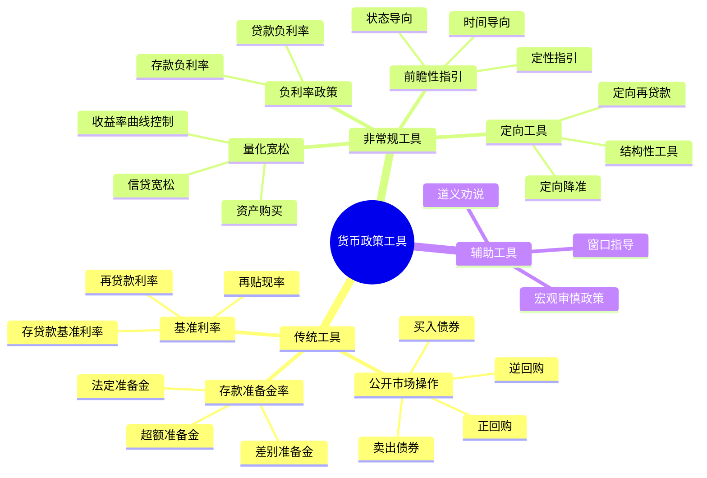
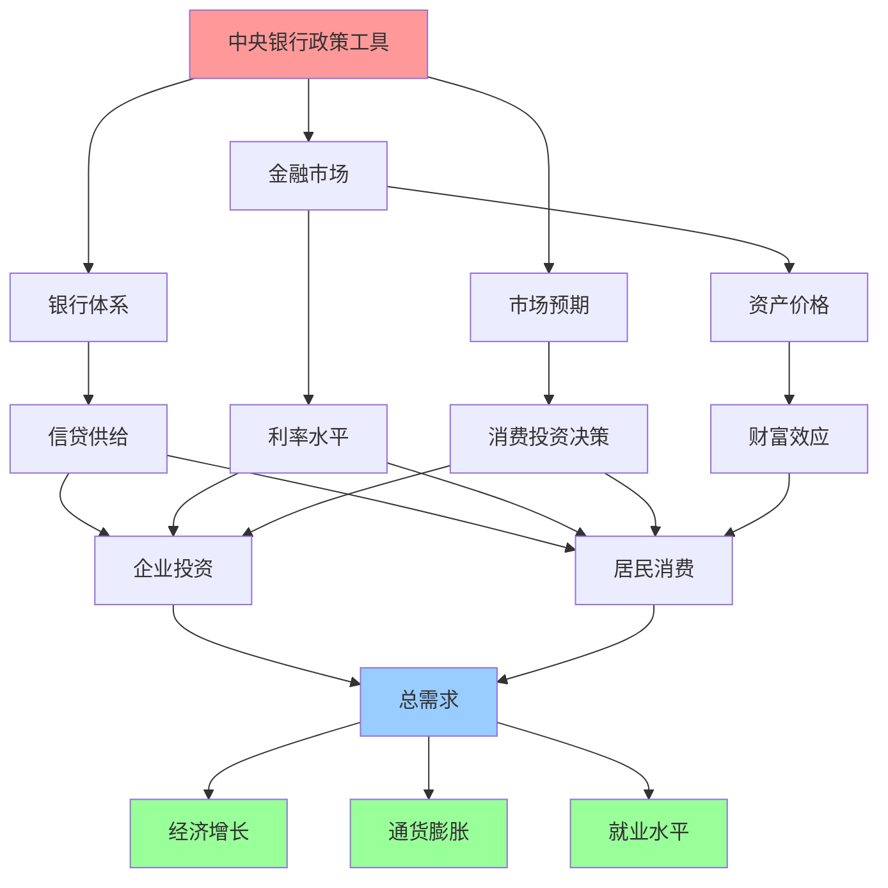

# 货币政策工具总览

## 概述

货币政策工具是中央银行调控经济的核心手段，通过影响货币供应量、利率水平和信贷条件，实现价格稳定、充分就业和经济增长等政策目标。理解货币政策工具的原理和应用，是把握宏观经济走向和资产价格变化的关键。

**学习目标**：
1. 掌握传统货币政策工具的分类和作用机制
2. 理解非常规货币政策工具的创新和应用
3. 分析不同工具的优势、局限和适用场景
4. 认识货币政策工具对金融市场和实体经济的影响
5. 建立货币政策分析的系统框架

## 货币政策工具分类

### 传统货币政策工具

传统货币政策工具是中央银行在正常经济环境下使用的常规手段，主要包括三大类：

**1. 公开市场操作 (Open Market Operations)**

公开市场操作是中央银行通过在公开市场买卖政府债券等金融资产，调节银行体系流动性和短期利率的操作。这是现代中央银行最常用、最灵活的政策工具。

- **买入操作**：央行购买债券，向市场注入流动性，降低利率
- **卖出操作**：央行出售债券，从市场回收流动性，提高利率
- **优势**：操作灵活、可逆性强、影响精准
- **应用**：日常流动性管理、利率调控

**2. 存款准备金率 (Reserve Requirements)**

存款准备金率是商业银行必须在中央银行存放的准备金占其存款总额的比例。调整准备金率直接影响银行的可贷资金规模。

- **提高准备金率**：减少银行可贷资金，收紧货币供应
- **降低准备金率**：增加银行可贷资金，放松货币供应
- **优势**：影响力度大、信号意义强
- **局限**：调整频率低、影响粗放

**3. 再贴现率/基准利率 (Discount Rate/Policy Rate)**

再贴现率是商业银行向中央银行借款的利率，也称政策利率或基准利率。它是利率体系的锚，影响整个金融市场的利率水平。

- **提高利率**：增加借贷成本，抑制信贷扩张
- **降低利率**：降低借贷成本，刺激信贷增长
- **优势**：信号明确、传导直接
- **应用**：利率走廊机制、流动性支持

### 非常规货币政策工具

2008年金融危机后，当传统工具达到极限（零利率下限）时，中央银行创新了一系列非常规工具：

**1. 量化宽松 (Quantitative Easing, QE)**

央行大规模购买长期国债、抵押贷款支持证券等资产，直接向市场注入大量流动性，压低长期利率。

- **机制**：扩大央行资产负债表，增加基础货币
- **目标**：降低长期利率、刺激信贷和投资
- **代表**：美联储QE1-QE3、欧央行PSPP、日本央行QQE

**2. 前瞻性指引 (Forward Guidance)**

央行明确承诺在一定时期内维持低利率或宽松政策，引导市场预期，影响长期利率和投资决策。

- **时间导向**："在2024年底前维持零利率"
- **状态导向**："直到通胀率达到2%"
- **效果**：降低不确定性、稳定市场预期

**3. 负利率政策 (Negative Interest Rate Policy, NIRP)**

将政策利率降至零以下，对银行在央行的超额准备金收取费用，迫使银行增加放贷。

- **应用**：欧央行、日本央行、瑞士央行
- **目标**：刺激信贷、防止通缩
- **争议**：对银行盈利的负面影响、效果有限

**4. 定向宽松工具**

针对特定部门或领域的流动性支持工具，如定向中期借贷便利(TMLF)、中小企业贷款支持计划等。

- **特点**：精准滴灌、结构性调控
- **应用**：支持小微企业、绿色金融、科技创新

## 货币政策工具箱框架

## 各类工具的比较分析

### 工具特征对比

| 工具类型 | 灵活性 | 精准度 | 力度 | 可逆性 | 使用频率 | 主要用途 |
|---------|--------|--------|------|--------|----------|----------|
| 公开市场操作 | 高 | 高 | 中 | 强 | 日常 | 流动性管理 |
| 准备金率 | 低 | 低 | 高 | 中 | 低频 | 总量调控 |
| 基准利率 | 中 | 中 | 中 | 强 | 定期 | 利率引导 |
| 量化宽松 | 中 | 中 | 高 | 弱 | 危机时 | 极端宽松 |
| 前瞻性指引 | 高 | 中 | 中 | 强 | 持续 | 预期管理 |
| 负利率 | 低 | 低 | 中 | 中 | 罕见 | 突破零下限 |
| 定向工具 | 中 | 高 | 中 | 中 | 定期 | 结构调整 |

### 工具选择的考量因素

**1. 经济周期阶段**
- **扩张期**：侧重总量控制，使用准备金率、利率工具
- **衰退期**：侧重刺激需求，使用降息、降准、QE
- **危机期**：使用非常规工具，提供流动性支持

**2. 政策目标**
- **控通胀**：提高利率、收紧流动性
- **促增长**：降低利率、增加流动性
- **稳就业**：宽松政策、定向支持
- **防风险**：宏观审慎工具、结构性调控

**3. 金融市场状况**
- **流动性充裕**：使用回收工具
- **流动性紧张**：使用注入工具
- **市场波动**：使用稳定预期工具

**4. 国际环境**
- **资本流动**：考虑汇率影响
- **全球宽松**：协调政策节奏
- **贸易摩擦**：平衡内外均衡

## 主要经济体的工具应用

### 美联储 (Federal Reserve)

**常规工具**：
- **联邦基金利率**：主要政策工具，通过公开市场操作调控
- **贴现窗口**：向银行提供短期流动性支持
- **准备金利率**：对超额准备金支付利息(IOER)

**非常规工具**：
- **QE1-QE3**：2008-2014年购买4.5万亿美元资产
- **前瞻性指引**：承诺长期低利率
- **收益率曲线控制**：2020年疫情期间的资产购买

**特点**：工具箱完善、操作透明、市场化程度高

### 欧洲央行 (ECB)

**常规工具**：
- **主要再融资利率**：基准利率
- **存款便利利率**：银行在央行存款的利率
- **边际贷款便利利率**：银行向央行借款的利率

**非常规工具**：
- **负利率政策**：2014年起实施，存款利率-0.5%
- **资产购买计划(APP)**：购买政府债券、企业债券
- **定向长期再融资操作(TLTRO)**：支持银行放贷

**特点**：多国协调、负利率先行者、结构性工具丰富

### 中国人民银行 (PBOC)

**常规工具**：
- **存款准备金率**：使用频率高，调整幅度大
- **公开市场操作**：逆回购、正回购、MLF、SLF
- **基准利率**：LPR（贷款市场报价利率）改革

**创新工具**：
- **定向降准**：支持小微企业、三农
- **定向中期借贷便利(TMLF)**：结构性支持
- **碳减排支持工具**：绿色金融
- **普惠小微贷款支持工具**：精准滴灌

**特点**：数量型为主、结构性工具丰富、渐进式改革

### 日本央行 (BOJ)

**常规工具**：
- **政策利率**：长期维持零利率或负利率
- **公开市场操作**：购买国债、ETF、REITs

**非常规工具**：
- **量化质化宽松(QQE)**：2013年起大规模资产购买
- **负利率政策**：2016年起实施
- **收益率曲线控制(YCC)**：将10年期国债收益率控制在0%附近

**特点**：长期宽松、资产购买规模巨大、政策创新

## 货币政策工具的传导机制

### 传导路径分析

**1. 利率传导渠道**
- 政策利率 → 市场利率 → 借贷成本 → 投资消费 → 总需求

**2. 信贷传导渠道**
- 准备金率 → 银行可贷资金 → 信贷供给 → 投资消费 → 总需求

**3. 资产价格渠道**
- 流动性 → 股票债券价格 → 财富效应 → 消费 → 总需求

**4. 预期渠道**
- 政策信号 → 市场预期 → 投资决策 → 总需求

**5. 汇率渠道**
- 利率差异 → 资本流动 → 汇率变化 → 净出口 → 总需求

## 工具应用的实践案例

### 案例1：2008年金融危机应对

**背景**：雷曼兄弟破产引发全球金融危机，信贷市场冻结，经济急剧衰退。

**美联储应对**：
1. **紧急降息**：2007年9月至2008年12月，联邦基金利率从5.25%降至0-0.25%
2. **量化宽松**：
   - QE1（2008-2010）：购买1.725万亿美元MBS和国债
   - QE2（2010-2011）：购买6000亿美元国债
   - QE3（2012-2014）：每月购买850亿美元资产
3. **前瞻性指引**：承诺长期维持低利率
4. **流动性工具**：TAF、TSLF、CPFF等紧急流动性支持

**效果**：
- 稳定金融市场，恢复信贷功能
- 降低长期利率，支持经济复苏
- 资产负债表从9000亿扩大到4.5万亿美元
- 但也带来资产泡沫和收入不平等加剧

### 案例2：欧债危机与负利率

**背景**：2010-2012年欧洲主权债务危机，经济低迷，通缩风险上升。

**欧央行应对**：
1. **降息至零**：2012年主要再融资利率降至0.75%
2. **负利率政策**：2014年6月存款利率降至-0.1%，后续降至-0.5%
3. **资产购买计划**：2015年起每月购买600-800亿欧元资产
4. **TLTRO**：向银行提供低成本长期资金，鼓励放贷

**效果**：
- 压低借贷成本，支持经济复苏
- 欧元贬值，提升出口竞争力
- 但负利率对银行盈利造成压力
- 通胀仍长期低于2%目标

### 案例3：中国疫情期间的结构性工具

**背景**：2020年新冠疫情冲击，中小企业面临资金困难。

**人民银行应对**：
1. **降准降息**：2020年三次降准，释放1.75万亿元流动性；LPR下调30bp
2. **再贷款再贴现**：增加1.8万亿元额度，支持小微企业
3. **定向工具**：
   - 普惠小微企业贷款延期支持工具
   - 普惠小微企业信用贷款支持计划
   - 碳减排支持工具
4. **结构性降准**：对支持小微企业的银行定向降准

**特点**：
- 总量适度，避免"大水漫灌"
- 结构性工具为主，精准滴灌
- 直达实体经济，支持薄弱环节
- 保持政策定力，不搞强刺激

## 工具使用的局限性

### 传统工具的局限

**1. 零利率下限 (Zero Lower Bound)**
- 名义利率无法大幅低于零
- 限制了降息空间
- 需要非常规工具补充

**2. 流动性陷阱**
- 利率极低时，货币政策失效
- 企业和居民不愿借贷投资
- 需要财政政策配合

**3. 时滞效应**
- 政策传导需要时间（6-18个月）
- 可能错过最佳时机
- 难以精准调控

**4. 不对称性**
- 收紧容易，放松难
- 推绳子效应：宽松时企业不一定借贷

### 非常规工具的副作用

**1. 资产泡沫**
- 大量流动性推高资产价格
- 股市、房地产泡沫风险
- 加剧财富不平等

**2. 央行资产负债表风险**
- 资产规模膨胀，退出困难
- 利率上升时面临账面损失
- 财政化风险

**3. 金融稳定风险**
- 长期低利率鼓励过度冒险
- 僵尸企业存续
- 金融脆弱性上升

**4. 国际溢出效应**
- 资本流动波动
- 汇率竞争性贬值
- 新兴市场压力

## 未来发展趋势

### 1. 数字货币与货币政策

**央行数字货币(CBDC)**的发展将改变货币政策工具：
- 直接向公众提供数字货币
- 可能实现更负的利率
- 提高政策传导效率
- 增强金融包容性

### 2. 宏观审慎政策框架

**货币政策与宏观审慎政策协调**：
- 货币政策关注总量和价格稳定
- 宏观审慎政策关注金融稳定
- 双支柱框架成为主流

### 3. 气候变化与绿色货币政策

**绿色金融工具创新**：
- 绿色再贷款、绿色债券购买
- 差别化准备金率
- 气候风险压力测试
- 支持碳中和目标

### 4. 人工智能与政策决策

**技术赋能货币政策**：
- 大数据实时监测经济
- AI辅助政策模拟和预测
- 提高政策精准度和时效性

## 投资者的应对策略

### 理解政策信号

**1. 关注政策会议**
- 美联储FOMC会议、欧央行理事会、中国货币政策委员会
- 政策声明、会议纪要、主席讲话

**2. 解读政策立场**
- 鹰派（偏紧）vs 鸽派（偏松）
- 政策转向的信号
- 前瞻性指引的变化

**3. 跟踪政策工具使用**
- 利率决议
- 资产购买规模
- 准备金率调整
- 新工具推出

### 资产配置调整

**宽松周期**：
- 增配股票、房地产等风险资产
- 减配现金、短期债券
- 关注受益行业（科技、消费）

**紧缩周期**：
- 增配债券、现金等防御性资产
- 减配高估值成长股
- 关注价值股、公用事业

**政策转向期**：
- 提高灵活性，降低仓位
- 关注政策敏感行业
- 做好风险对冲

## 常见误区

**误区1：货币政策万能论**
- 货币政策有局限性，不能解决所有问题
- 结构性问题需要结构性改革
- 需要财政政策、产业政策配合

**误区2：简单线性思维**
- 降息不一定利好股市（可能反映经济恶化）
- 加息不一定利空股市（可能反映经济强劲）
- 需要综合分析经济基本面

**误区3：忽视时滞效应**
- 政策效果需要时间显现
- 不要期待立竿见影
- 关注领先指标

**误区4：过度依赖央行**
- 央行不是市场的保姆
- 道德风险问题
- 培养独立判断能力

## 实战应用

### 构建货币政策监测框架

**1. 数据跟踪**
- 政策利率变化
- 央行资产负债表规模
- 货币供应量(M1, M2)
- 社会融资规模
- 银行间利率

**2. 政策评估**
- 政策立场（紧缩/中性/宽松）
- 政策力度（温和/激进）
- 政策持续性
- 政策协调性

**3. 影响分析**
- 对利率曲线的影响
- 对汇率的影响
- 对资产价格的影响
- 对经济增长的影响

### 投资决策整合

将货币政策分析整合到投资决策流程：
1. **宏观判断**：确定货币政策周期位置
2. **资产配置**：根据政策立场调整大类资产配置
3. **行业选择**：选择政策受益行业
4. **个股精选**：选择政策敏感度适中的优质公司
5. **风险管理**：根据政策不确定性调整仓位

## 延伸阅读

### 经典著作

1. **《货币政策的艺术》** - Alan S. Blinder
   - 前美联储副主席的实践经验
   - 深入浅出讲解货币政策

2. **《中央银行的勇气》** - Ben Bernanke
   - 2008年金融危机应对回顾
   - 非常规货币政策的实践

3. **《货币数量论研究》** - Milton Friedman
   - 货币主义经典
   - 货币政策理论基础

4. **《利率史》** - Sidney Homer & Richard Sylla
   - 4000年利率历史
   - 理解利率的长期规律

### 学术论文

1. Bernanke, B. S., & Blinder, A. S. (1992). "The Federal Funds Rate and the Channels of Monetary Transmission"
2. Mishkin, F. S. (1996). "The Channels of Monetary Transmission: Lessons for Monetary Policy"
3. Woodford, M. (2012). "Methods of Policy Accommodation at the Interest-Rate Lower Bound"

### 实时资源

1. **美联储官网** - federalreserve.gov
   - FOMC声明、会议纪要、经济预测
2. **欧央行官网** - ecb.europa.eu
   - 政策决议、经济公报
3. **中国人民银行官网** - pbc.gov.cn
   - 货币政策执行报告、统计数据
4. **国际清算银行(BIS)** - bis.org
   - 全球货币政策研究、数据库

## 参考文献

1. Bernanke, B. S. (2020). *The New Tools of Monetary Policy*. American Economic Review, 110(4), 943-983.
2. Blinder, A. S. (2018). *Through a Crystal Ball Darkly: The Future of Monetary Policy Communication*. AEA Papers and Proceedings, 108, 567-571.
3. Mishkin, F. S. (2019). *The Economics of Money, Banking, and Financial Markets* (12th ed.). Pearson.
4. Taylor, J. B. (2019). *Reform of the International Monetary System: Why and How?* Cambridge University Press.
5. Woodford, M. (2003). *Interest and Prices: Foundations of a Theory of Monetary Policy*. Princeton University Press.
6. 中国人民银行 (2023). 《中国货币政策执行报告》各期
7. 易纲 (2021). 《货币政策的自主性、有效性与经济金融稳定》，《经济研究》
8. 盛松成 (2020). 《现代货币理论与货币政策实践》，中国金融出版社
9. IMF (2023). *Global Financial Stability Report*
10. BIS (2023). *Annual Economic Report*
