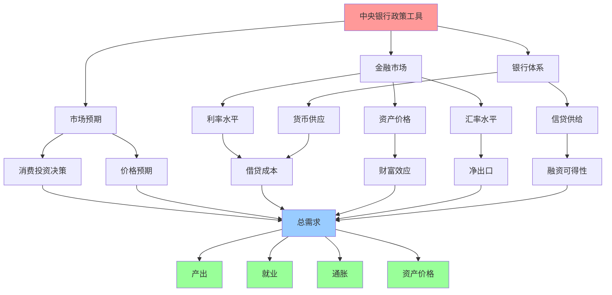
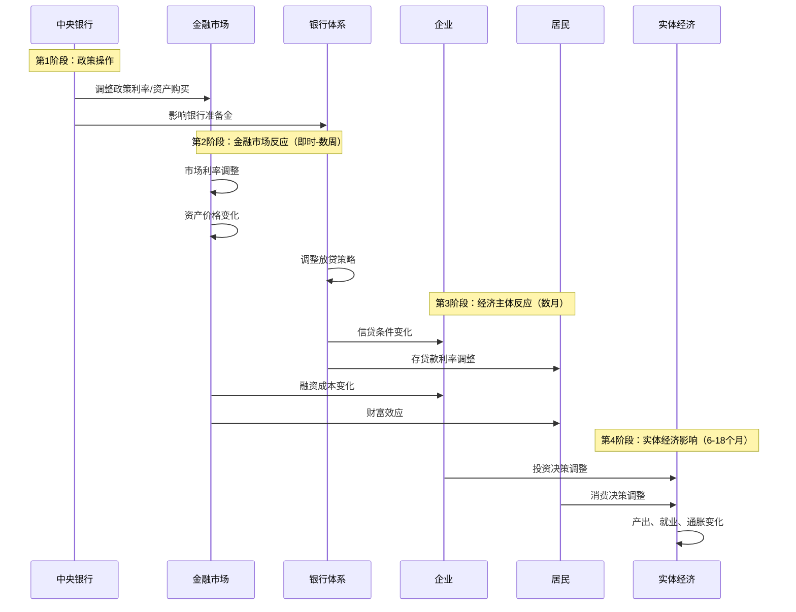

# 政策传导机制

## 概述

货币政策传导机制是指中央银行的政策操作如何通过金融体系和市场机制，最终影响实体经济的过程。理解传导机制对于把握货币政策的实际效果、预测经济走向和进行投资决策至关重要。

**学习目标**：
1. 掌握货币政策传导的主要渠道和路径
2. 理解不同传导渠道的作用机制和影响
3. 分析传导效率的影响因素和障碍
4. 认识不同经济体传导机制的差异
5. 学会评估政策传导的效果和时滞

## 传导机制总览

### 完整传导路径

### 传导时序

## 主要传导渠道

### 1. 利率渠道

**传导路径**：
政策利率 → 市场利率 → 贷款利率 → 借贷成本 → 投资消费 → 总需求 → 产出和通胀

**作用机制**：

**降息效应**：
- 政策利率↓ → 银行间市场利率↓
- 市场利率↓ → 贷款利率↓、债券收益率↓
- 借贷成本↓ → 企业投资↑、居民消费↑
- 总需求↑ → 产出↑、就业↑、通胀↑

**影响因素**：
- 金融市场竞争程度
- 利率市场化程度
- 企业和居民对利率的敏感度
- 经济周期阶段

**传导效率**：
- 发达经济体：高（利率市场化）
- 新兴经济体：中等（利率管制）
- 危机时期：低（流动性陷阱）

### 2. 信贷渠道

信贷渠道强调银行在货币政策传导中的特殊作用，分为两个子渠道：

**银行贷款渠道**：

**传导路径**：
政策操作 → 银行准备金 → 放贷能力 → 信贷供给 → 投资消费 → 总需求

**作用机制**：
- 宽松政策 → 银行准备金↑ → 放贷能力↑
- 放贷能力↑ → 信贷供给↑ → 企业和居民获得贷款↑
- 投资消费↑ → 总需求↑

**关键假设**：
- 银行贷款不能被其他融资方式完全替代
- 银行面临资本或流动性约束

**资产负债表渠道**：

**传导路径**：
政策操作 → 资产价格 → 抵押品价值 → 借贷能力 → 投资消费

**作用机制**：
- 宽松政策 → 资产价格↑（股票、房地产）
- 资产价格↑ → 企业净值↑、抵押品价值↑
- 借贷能力↑ → 获得信贷↑ → 投资↑

**金融加速器效应**：
- 资产价格上涨 → 企业净值提高 → 信用风险下降 → 融资成本降低 → 投资增加 → 资产价格进一步上涨
- 形成正反馈循环，放大政策效果

### 3. 资产价格渠道

**股票市场渠道**：

**托宾Q理论**：
- Q = 企业市值 / 资本重置成本
- 宽松政策 → 股价↑ → Q↑ → 投资吸引力↑ → 企业投资↑

**财富效应**：
- 宽松政策 → 股价↑ → 居民财富↑ → 消费↑
- 美国财富效应较强（股票持有比例高）
- 中国财富效应相对较弱

**房地产渠道**：

**传导路径**：
政策利率↓ → 房贷利率↓ → 购房成本↓ → 房价↑ → 财富效应 → 消费↑

**抵押品效应**：
- 房价↑ → 房屋净值↑ → 抵押贷款能力↑ → 消费和投资↑

**重要性**：
- 房地产是居民最大资产
- 财富效应显著
- 对经济影响深远

### 4. 汇率渠道

**传导路径**：
政策利率↓ → 利差缩小 → 资本流出 → 本币贬值 → 出口↑进口↓ → 净出口↑ → 总需求↑

**作用机制**：

**利率平价理论**：
- 国内利率↓ → 本币资产吸引力↓
- 资本流出 → 本币贬值
- 本币贬值 → 出口竞争力↑

**贸易平衡效应**：
- 本币贬值 → 出口商品价格↓（外币计价）
- 进口商品价格↑（本币计价）
- 净出口↑ → 总需求↑

**J曲线效应**：
- 短期：贬值可能恶化贸易平衡（价格效应快于数量效应）
- 中长期：贸易平衡改善

**影响因素**：
- 汇率制度（浮动/固定）
- 资本账户开放程度
- 贸易依存度
- 汇率传递效应

### 5. 预期渠道

**传导路径**：
政策信号 → 市场预期 → 长期利率 → 投资消费决策 → 总需求

**作用机制**：

**前瞻性指引**：
- 央行承诺未来政策路径
- 影响市场对未来利率的预期
- 降低长期利率
- 鼓励当前投资消费

**通胀预期**：
- 宽松政策 → 通胀预期↑
- 实际利率↓（名义利率 - 预期通胀）
- 借贷吸引力↑ → 投资消费↑

**信心效应**：
- 政策信号 → 市场信心↑
- 不确定性↓ → 投资意愿↑

**预期管理的重要性**：
- 现代货币政策的核心
- 沟通策略至关重要
- 信誉是关键

## 传导效率的影响因素

### 金融体系因素

**1. 金融市场发达程度**
- 市场化程度高 → 传导效率高
- 金融工具丰富 → 传导渠道多元
- 价格发现机制完善 → 传导精准

**2. 银行体系健康度**
- 资本充足率高 → 放贷能力强
- 不良贷款率低 → 传导顺畅
- 流动性充裕 → 响应及时

**3. 融资结构**
- 直接融资比重高 → 利率渠道重要
- 间接融资为主 → 信贷渠道重要
- 多元化融资 → 传导渠道丰富

### 经济结构因素

**1. 经济周期阶段**
- 扩张期：传导效率高，企业投资意愿强
- 衰退期：传导受阻，流动性陷阱
- 复苏期：传导逐步恢复

**2. 企业和居民资产负债状况**
- 杠杆率适中 → 对政策敏感
- 杠杆率过高 → 去杠杆压力，传导受阻
- 杠杆率过低 → 加杠杆空间大

**3. 产业结构**
- 资本密集型产业 → 对利率敏感
- 劳动密集型产业 → 对利率不敏感
- 出口导向型 → 对汇率敏感

### 制度环境因素

**1. 利率市场化程度**
- 完全市场化 → 传导顺畅
- 利率管制 → 传导受阻
- 双轨制 → 传导扭曲

**2. 汇率制度**
- 浮动汇率 → 汇率渠道有效
- 固定汇率 → 汇率渠道失效
- 有管理浮动 → 汇率渠道部分有效

**3. 资本账户开放度**
- 完全开放 → 汇率渠道强
- 资本管制 → 汇率渠道弱
- 部分开放 → 汇率渠道有限

### 政策协调因素

**1. 货币政策与财政政策协调**
- 协调一致 → 效果放大
- 相互冲突 → 效果抵消
- 独立运作 → 效果有限

**2. 货币政策与宏观审慎政策协调**
- 双支柱框架 → 兼顾增长和稳定
- 单一目标 → 可能顾此失彼

**3. 国际政策协调**
- 全球同步宽松 → 效果增强
- 政策分化 → 溢出效应

## 传导障碍与失效

### 流动性陷阱

**定义**：
利率降至极低水平时，货币政策失效，增加货币供应无法刺激经济。

**原因**：
- 利率接近零下限，无法进一步降低
- 企业和居民不愿借贷投资
- 银行惜贷，信贷传导受阻
- 通缩预期，实际利率仍高

**历史案例**：
- 日本1990年代至今
- 美国2008-2015年
- 欧元区2012-2019年

**应对措施**：
- 非常规货币政策（QE、负利率）
- 财政政策配合
- 结构性改革

### 信贷配给

**定义**：
即使降低利率，银行也不愿意增加贷款，或只向优质客户放贷。

**原因**：
- 银行风险偏好下降
- 不良贷款率上升
- 资本充足率约束
- 信息不对称

**影响**：
- 信贷渠道受阻
- 中小企业融资难
- 经济复苏缓慢

**应对措施**：
- 定向宽松工具
- 信贷支持计划
- 担保机制

### 推绳子效应

**定义**：
宽松政策难以刺激经济，就像推绳子一样无力。

**原因**：
- 企业投资意愿低
- 居民消费意愿弱
- 悲观预期
- 资产负债表衰退

**对比**：
- 收紧政策容易（拉绳子）
- 宽松政策困难（推绳子）

### 时滞效应

**内部时滞**：
- 认识时滞：识别经济问题需要时间（1-3个月）
- 决策时滞：政策制定需要时间（1-2个月）
- 操作时滞：政策实施需要时间（即时-1个月）

**外部时滞**：
- 金融市场反应：即时-数周
- 信贷条件变化：1-3个月
- 投资决策调整：3-6个月
- 产出影响：6-12个月
- 通胀影响：12-18个月

**总时滞**：6-24个月

**挑战**：
- 可能错过最佳时机
- 政策效果滞后
- 难以精准调控

## 不同经济体的传导机制

### 美国：市场主导型

**特点**：
- 金融市场高度发达
- 直接融资比重高
- 利率市场化程度高

**主要渠道**：
- 利率渠道：最重要
- 资产价格渠道：股市财富效应强
- 预期渠道：前瞻性指引有效

**传导效率**：高

### 欧元区：银行主导型

**特点**：
- 银行融资为主
- 多国协调复杂
- 结构性差异大

**主要渠道**：
- 信贷渠道：最重要
- 利率渠道：重要
- 汇率渠道：对外贸易依赖

**传导效率**：中等（各国差异大）

### 中国：转型中的体系

**特点**：
- 银行主导，逐步市场化
- 利率双轨制
- 资本账户部分开放

**主要渠道**：
- 信贷渠道：最重要
- 数量型工具为主
- 结构性工具丰富

**传导效率**：中等（改革中提升）

**改革方向**：
- 利率市场化（LPR改革）
- 汇率市场化
- 发展直接融资
- 完善传导机制

### 日本：长期低利率环境

**特点**：
- 长期零利率或负利率
- 银行主导
- 老龄化社会

**主要渠道**：
- 资产价格渠道：QE推动
- 汇率渠道：日元贬值
- 信贷渠道：受阻（需求不足）

**传导效率**：低（流动性陷阱）

## 实践案例分析

### 案例1：2008年金融危机后的传导受阻

**背景**：
- 金融危机导致信贷市场冻结
- 银行惜贷，企业和居民去杠杆
- 传统货币政策传导受阻

**传导障碍**：
- 信贷渠道：银行不愿放贷，企业不愿借贷
- 利率渠道：零利率下限，无法进一步降息
- 预期渠道：悲观预期，信心不足

**政策应对**：
- 非常规货币政策：QE、前瞻性指引
- 直接支持信贷市场：TALF、CPFF等
- 财政政策配合：大规模刺激计划

**效果**：
- 逐步恢复传导机制
- 经济缓慢复苏
- 但传导效率低于正常时期

**启示**：
- 危机时期传导机制受损严重
- 需要多种工具组合
- 财政政策配合至关重要

### 案例2：中国利率市场化改革

**背景**：
- 利率双轨制：存贷款基准利率+市场利率
- 传导效率低，政策效果打折扣
- 2019年LPR改革

**改革措施**：
- LPR（贷款市场报价利率）改革
- MLF利率作为LPR的锚
- 打通政策利率到贷款利率的传导

**效果**：
- 贷款利率市场化程度提高
- 政策利率传导更顺畅
- 企业融资成本下降

**启示**：
- 利率市场化是提高传导效率的关键
- 制度改革比政策调整更重要
- 渐进式改革降低风险

### 案例3：2020年疫情冲击下的传导

**背景**：
- 疫情导致经济停摆
- 企业和居民收入锐减
- 传导机制面临挑战

**传导特点**：
- 利率渠道：有效但不足
- 信贷渠道：银行风险偏好下降
- 预期渠道：不确定性极高

**政策创新**：
- 直达实体经济的工具
- 定向支持受困行业
- 财政货币政策协调

**效果**：
- 快速稳定市场
- 支持企业渡过难关
- 经济V型复苏

**启示**：
- 特殊时期需要特殊工具
- 精准滴灌比大水漫灌更有效
- 政策协调至关重要

## 投资者应用

### 评估传导效果

**1. 跟踪传导指标**

**金融市场指标**：
- 市场利率（银行间利率、国债收益率）
- 信贷利差（企业债利差、贷款利率）
- 资产价格（股市、房价）
- 汇率水平

**实体经济指标**：
- 信贷增速（社会融资规模、M2）
- 投资增速（固定资产投资）
- 消费增速（社会消费品零售总额）
- 产出增速（GDP、工业增加值）

**2. 判断传导效率**

**高效传导**：
- 政策调整后，市场利率快速响应
- 信贷增速明显变化
- 投资消费数据改善
- 经济增长加速

**传导受阻**：
- 市场利率反应迟钝
- 信贷增速变化不大
- 投资消费疲弱
- 经济增长乏力

**3. 识别传导障碍**

**流动性陷阱信号**：
- 利率极低但经济不振
- 货币供应增加但信贷不增
- 企业和居民不愿借贷

**信贷配给信号**：
- 政策宽松但贷款难
- 中小企业融资困难
- 银行风险偏好下降

### 投资策略调整

**传导顺畅期**：
- 宽松政策 → 增配风险资产
- 紧缩政策 → 增配防御资产
- 政策效果可预期

**传导受阻期**：
- 政策效果打折扣
- 关注政策创新
- 降低预期收益
- 提高风险警惕

**传导转向期**：
- 关注传导效率变化
- 提前布局
- 灵活调整

### 行业影响分析

**利率敏感行业**：
- 房地产、公用事业、金融
- 传导顺畅时影响大
- 传导受阻时影响小

**信贷敏感行业**：
- 基建、制造业、中小企业
- 信贷渠道畅通时受益
- 信贷配给时受损

**汇率敏感行业**：
- 出口企业、进口替代
- 汇率渠道有效时影响大

## 常见误区

**误区1：政策调整立即见效**
- 传导需要时间（6-18个月）
- 不要期待立竿见影
- 关注领先指标

**误区2：所有渠道同等重要**
- 不同经济体渠道重要性不同
- 不同时期渠道效果不同
- 需要具体分析

**误区3：传导机制一成不变**
- 金融创新改变传导机制
- 制度改革影响传导效率
- 需要动态评估

**误区4：忽视传导障碍**
- 危机时期传导受阻
- 结构性问题影响传导
- 不能简单线性外推

## 延伸阅读

### 经典著作

1. **《货币政策传导机制》** - Frederic S. Mishkin
   - 传导机制的系统论述
2. **《货币银行学》** - Mishkin
   - 传导渠道的理论基础
3. **《宏观经济学》** - Mankiw
   - 传导机制的宏观视角

### 学术论文

1. Bernanke, B. S., & Gertler, M. (1995). "Inside the Black Box: The Credit Channel of Monetary Policy Transmission"
2. Mishkin, F. S. (1996). "The Channels of Monetary Transmission: Lessons for Monetary Policy"
3. Taylor, J. B. (1995). "The Monetary Transmission Mechanism: An Empirical Framework"

### 实时资源

1. **各国央行官网** - 货币政策报告
2. **BIS** - 货币政策传导研究
3. **IMF** - 全球金融稳定报告

## 参考文献

1. Bernanke, B. S., & Gertler, M. (1995). "Inside the Black Box: The Credit Channel of Monetary Policy Transmission." *Journal of Economic Perspectives*, 9(4), 27-48.
2. Mishkin, F. S. (1996). "The Channels of Monetary Transmission: Lessons for Monetary Policy." *NBER Working Paper* No. 5464.
3. Taylor, J. B. (1995). "The Monetary Transmission Mechanism: An Empirical Framework." *Journal of Economic Perspectives*, 9(4), 11-26.
4. Boivin, J., Kiley, M. T., & Mishkin, F. S. (2010). "How Has the Monetary Transmission Mechanism Evolved Over Time?" *Handbook of Monetary Economics*, 3, 369-422.
5. Mishkin, F. S. (2019). *The Economics of Money, Banking, and Financial Markets* (12th ed.). Pearson.
6. 易纲 (2021). 《货币政策的自主性、有效性与经济金融稳定》，《经济研究》
7. 孙国峰 (2019). 《货币政策传导机制的新变化》，《中国金融》
8. 中国人民银行 (2023). 《中国货币政策执行报告》各期
9. IMF (2023). *Global Financial Stability Report*
10. BIS (2023). *Monetary Policy Frameworks and Central Bank Market Operations*

## 深度分析

### 核心机制解析

理解本主题需要从多个维度进行系统性分析。以下从理论基础、实践应用和历史验证三个层面展开深度探讨。

**理论基础层面**：本主题的核心逻辑建立在经济学和金融学的基本原理之上。通过对基础理论的深入理解，投资者能够建立起稳固的分析框架，避免被市场短期噪音所干扰。

**实践应用层面**：理论必须与实践相结合才能产生价值。在实际投资决策中，需要将抽象的概念转化为具体的分析工具和决策标准。

**历史验证层面**：金融市场有着丰富的历史记录，通过研究历史案例，我们可以验证理论的有效性，并从中提炼出具有普遍意义的规律。

### 关键影响因素

影响本主题的关键因素可以从以下几个维度进行分析：

1. **宏观经济环境**：利率水平、通货膨胀率、经济增长速度等宏观变量对本主题有着深远影响。在不同的宏观经济周期中，相关指标的表现会呈现出显著差异。

2. **市场结构因素**：市场参与者的构成、信息传播机制、流动性状况等市场结构因素决定了价格发现的效率和准确性。

3. **政策监管环境**：政府政策、监管框架的变化会直接影响相关市场的运作规则和参与者行为。

4. **技术创新驱动**：技术进步不断改变着金融市场的运作方式，从算法交易到区块链技术，每一次技术革新都带来新的机遇和挑战。

5. **全球化与地缘政治**：在全球化背景下，各国市场之间的联动性日益增强，地缘政治风险的影响也越来越不可忽视。

### 量化分析框架

为了更精确地分析和评估，可以采用以下量化框架：

| 分析维度 | 关键指标 | 参考基准 | 分析方法 |
|---------|---------|---------|---------|
| 规模评估 | 绝对值与相对值 | 历史均值 | 趋势分析 |
| 质量评估 | 稳定性指标 | 行业对标 | 横向比较 |
| 风险评估 | 波动率指标 | 风险阈值 | 情景分析 |
| 价值评估 | 估值倍数 | 历史区间 | 回归分析 |

通过系统性地应用上述框架，投资者可以对目标进行全面、客观的评估，从而做出更加理性的投资决策。

## 高级分析与前沿研究

### 学术研究进展

近年来，学术界对本领域的研究取得了重要进展。以下是几个值得关注的研究方向：

**行为金融学视角**：传统金融理论假设市场参与者是完全理性的，但行为金融学的研究表明，认知偏差和情绪因素在投资决策中扮演着重要角色。诺贝尔经济学奖得主丹尼尔·卡尼曼（Daniel Kahneman）和理查德·塞勒（Richard Thaler）的研究为我们理解市场非理性行为提供了重要框架。

**因子投资研究**：尤金·法玛（Eugene Fama）和肯尼斯·弗伦奇（Kenneth French）的三因子模型，以及后续发展的五因子模型，为系统性地解释股票收益差异提供了理论基础。这些研究表明，市值、账面市值比、盈利能力和投资模式等因子能够解释大部分股票收益的横截面差异。

**市场微观结构研究**：对市场流动性、价格发现机制和交易成本的深入研究，帮助我们更好地理解市场的运作机制，并为优化交易策略提供指导。

### 实战案例深度解析

**案例一：长期价值创造的典范**

以沃伦·巴菲特（Warren Buffett）的伯克希尔·哈撒韦（Berkshire Hathaway）为例，其长达数十年的卓越投资业绩证明了价值投资理念的有效性。从1965年至今，伯克希尔的账面价值年均增长率约为19.8%，远超同期标普500指数的约10.2%年均回报。

巴菲特的成功秘诀在于：
- 专注于具有持久竞争优势的优质企业
- 以合理价格买入，而非追求最低价格
- 长期持有，让复利效应充分发挥
- 保持充足的安全边际，控制下行风险

**案例二：危机中的机遇识别**

2008年金融危机期间，大多数投资者恐慌性抛售，但少数具有前瞻性的投资者却在危机中发现了历史性的投资机会。约翰·保尔森（John Paulson）通过做空次级抵押贷款相关证券，在危机中获得了约150亿美元的利润，成为金融史上最成功的单笔交易之一。

这个案例告诉我们：
- 深入的基本面研究能够发现市场定价错误
- 逆向思维往往能够发现被市场忽视的机会
- 风险管理和仓位控制是成功的关键

### 跨市场比较分析

不同市场在结构、监管、投资者构成等方面存在显著差异，这些差异对投资策略的选择有重要影响：

**美国市场特征**：
- 机构投资者主导，市场效率较高
- 信息披露制度完善，分析师覆盖广泛
- 衍生品市场发达，对冲工具丰富
- 长期牛市历史，但也经历过多次重大调整

**中国市场特征**：
- 散户投资者比例较高，市场波动性较大
- 政策因素影响显著，需要密切关注监管动向
- 新兴行业发展迅速，成长投资机会丰富
- A股、港股、美股中概股形成多层次市场体系

**欧洲市场特征**：
- 价值股比例较高，估值相对保守
- 受地缘政治和欧元区政策影响较大
- 部分行业（如奢侈品、工业）具有全球竞争优势
- ESG投资理念推广较为领先

