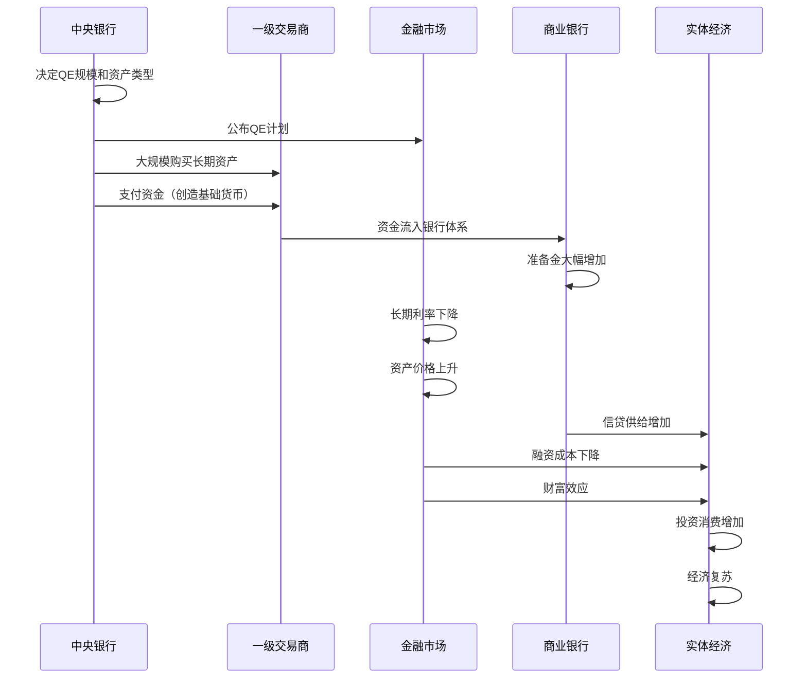
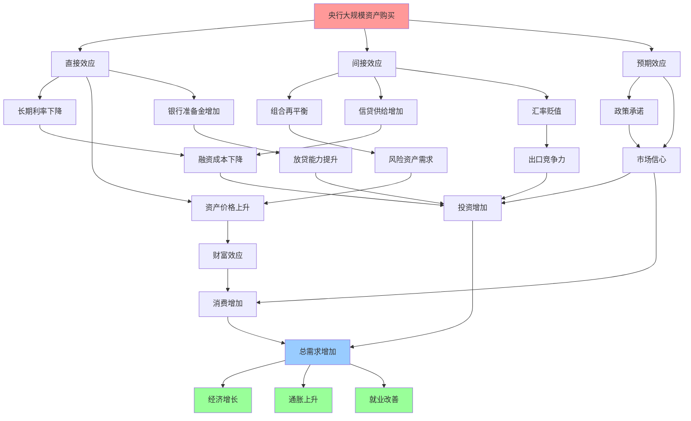

# 量化宽松详解

## 概述

量化宽松(Quantitative Easing, QE)是中央银行在传统货币政策工具失效（利率接近零下限）时采用的非常规货币政策。通过大规模购买长期国债、抵押贷款支持证券等资产，央行直接向市场注入大量流动性，压低长期利率，刺激经济复苏。

**学习目标**：
1. 理解量化宽松的定义、原理和实施机制
2. 掌握QE与传统货币政策的区别
3. 分析QE的传导渠道和经济影响
4. 认识主要经济体的QE实践和效果
5. 评估QE的副作用和退出挑战

## 量化宽松的基本原理

### 定义与背景

**量化宽松(QE)**是指中央银行通过大规模购买长期金融资产（主要是国债和抵押贷款支持证券），向市场注入大量基础货币，以降低长期利率、刺激信贷和投资的非常规货币政策。

**产生背景**：
- 传统货币政策达到极限（零利率下限）
- 经济陷入严重衰退或通缩
- 需要更强力的刺激手段
- 日本在1990年代末首次尝试
- 2008年金融危机后被广泛采用

### QE与传统货币政策的区别

| 维度 | 传统货币政策 | 量化宽松(QE) |
|------|-------------|-------------|
| 目标变量 | 短期利率 | 长期利率、资产价格 |
| 操作方式 | 调整政策利率 | 大规模资产购买 |
| 资产负债表 | 规模相对稳定 | 大幅扩张 |
| 购买资产 | 短期国债 | 长期国债、MBS等 |
| 使用条件 | 正常经济环境 | 零利率下限、危机时期 |
| 可逆性 | 强 | 弱（退出困难） |
| 副作用 | 相对较小 | 较大（资产泡沫、不平等） |

### QE的理论基础

**1. 组合平衡理论(Portfolio Balance Theory)**

央行购买长期债券 → 债券供给减少 → 债券价格上升、收益率下降 → 投资者转向其他资产（股票、企业债、房地产）→ 这些资产价格上升 → 财富效应和融资成本下降 → 刺激消费和投资

**2. 信号效应(Signaling Effect)**

大规模QE向市场传递央行将长期维持宽松政策的信号 → 稳定市场预期 → 降低长期利率 → 鼓励借贷和投资

**3. 流动性效应(Liquidity Effect)**

央行注入大量流动性 → 银行准备金增加 → 放贷能力提升 → 信贷供给增加 → 经济活动扩张

## QE的实施机制

### 操作流程

### 购买资产的选择

**1. 政府债券（国债）**
- 最常见的QE资产
- 流动性好，风险低
- 直接压低长期利率
- 支持政府融资

**2. 抵押贷款支持证券(MBS)**
- 美联储QE的重要组成
- 支持房地产市场
- 降低房贷利率
- 修复金融体系

**3. 企业债券**
- 欧央行、日本央行购买
- 直接降低企业融资成本
- 支持企业投资
- 风险相对较高

**4. 股票ETF**
- 日本央行创新
- 直接支撑股市
- 争议较大
- 扭曲市场机制

## 主要经济体的QE实践

### 美联储：三轮QE

**QE1 (2008年11月-2010年3月)**
- 规模：1.725万亿美元
- 购买：MBS 1.25万亿、机构债1750亿、国债3000亿
- 目标：稳定金融市场，修复信贷功能
- 效果：金融市场稳定，信贷利差收窄

**QE2 (2010年11月-2011年6月)**
- 规模：6000亿美元
- 购买：长期国债
- 目标：降低长期利率，支持经济复苏
- 效果：10年期国债收益率下降约0.2%

**QE3 (2012年9月-2014年10月)**
- 规模：开放式，每月购买850亿美元（后调整为650亿）
- 购买：MBS 400亿/月，国债450亿/月
- 目标：促进就业，支持经济增长
- 效果：失业率从8.1%降至5.9%

**总体效果**：
- 资产负债表从9000亿扩大到4.5万亿美元
- 10年期国债收益率从3.8%降至1.5%
- 股市大幅上涨（标普500涨幅超200%）
- 经济实现复苏，但增长温和
- 收入不平等加剧

### 欧央行：资产购买计划

**证券市场计划(SMP, 2010-2012)**
- 购买欧债危机国家国债
- 规模：2190亿欧元
- 目标：稳定主权债务市场

**资产购买计划(APP, 2015-2018)**
- 规模：每月600-800亿欧元
- 购买：政府债券、企业债券、资产支持证券
- 目标：提振通胀，支持经济
- 效果：通胀从负值回升，但长期低于2%目标

**疫情紧急购买计划(PEPP, 2020-2022)**
- 规模：1.85万亿欧元
- 灵活购买各国债券
- 应对疫情冲击
- 效果：稳定金融市场，支持经济复苏

### 日本央行：量化质化宽松

**量化宽松(QE, 2001-2006)**
- 日本首创QE
- 购买国债，增加准备金
- 效果有限，经济仍低迷

**量化质化宽松(QQE, 2013至今)**
- 规模：每年增加80万亿日元基础货币
- 购买：国债、ETF、REITs
- 目标：实现2%通胀目标
- 特点：
  - 购买股票ETF（每年6万亿日元）
  - 收益率曲线控制(YCC)
  - 资产负债表占GDP比例超100%

**效果**：
- 日元贬值，出口受益
- 股市大幅上涨
- 但通胀目标长期未实现
- 央行持有大量资产，退出困难

### 中国人民银行：结构性宽松

中国未采用大规模QE，而是使用结构性工具：
- 定向降准
- 定向中期借贷便利(TMLF)
- 再贷款再贴现
- 普惠小微贷款支持工具

**特点**：
- 精准滴灌，避免大水漫灌
- 支持特定领域（小微、三农、绿色）
- 保持政策定力
- 资产负债表扩张温和

## QE的传导机制

### 传导渠道分析

**1. 利率渠道**
- 购买长期债券 → 长期利率下降 → 企业和居民融资成本降低 → 投资消费增加

**2. 资产价格渠道**
- 流动性充裕 → 股票、房地产等资产价格上涨 → 财富效应 → 消费增加

**3. 信贷渠道**
- 银行准备金增加 → 放贷能力提升 → 信贷供给增加 → 投资消费增加

**4. 汇率渠道**
- 货币供应增加 → 本币贬值 → 出口竞争力提升 → 净出口增加

**5. 预期渠道**
- 政策承诺 → 稳定市场预期 → 降低不确定性 → 鼓励投资

## QE的效果评估

### 积极效果

**1. 稳定金融市场**
- 2008年危机后迅速稳定市场
- 降低信贷利差
- 恢复市场信心

**2. 降低长期利率**
- 10年期国债收益率大幅下降
- 企业和居民融资成本降低
- 支持投资和消费

**3. 支持经济复苏**
- 避免经济深度衰退
- 促进就业增长
- 防止通缩

**4. 提振资产价格**
- 股市大幅上涨
- 房地产市场复苏
- 财富效应显现

### 副作用与争议

**1. 资产泡沫风险**
- 股市、房地产价格过高
- 估值脱离基本面
- 泡沫破裂风险

**2. 收入不平等加剧**
- 资产持有者受益
- 工薪阶层受益有限
- 贫富差距扩大

**3. 金融稳定风险**
- 长期低利率鼓励过度冒险
- 僵尸企业存续
- 金融脆弱性上升

**4. 通胀风险**
- 货币供应大幅增加
- 潜在通胀压力
- 但实际通胀长期低迷

**5. 央行资产负债表风险**
- 资产规模膨胀
- 退出困难
- 利率上升时面临账面损失

**6. 国际溢出效应**
- 资本流向新兴市场
- 新兴市场资产泡沫
- 退出时资本回流冲击

**7. 效果递减**
- 多轮QE效果逐渐减弱
- 边际效用下降
- 依赖性增强

## QE的退出挑战

### 退出策略

**1. 停止购买（Tapering）**
- 逐步减少每月购买规模
- 给市场适应时间
- 避免"缩减恐慌"

**2. 到期不再续作**
- 让资产自然到期
- 被动缩表
- 影响相对温和

**3. 主动出售资产**
- 加速缩表
- 影响较大
- 风险较高

**4. 提高利率**
- 配合缩表
- 收紧货币条件
- 需要谨慎平衡

### 退出困难

**1. 市场依赖**
- 市场习惯央行支持
- 退出引发波动
- "缩减恐慌"(Taper Tantrum)

**2. 经济脆弱**
- 经济复苏不稳固
- 过早退出可能导致衰退
- 需要等待时机

**3. 政治压力**
- 退出可能影响资产价格
- 面临政治阻力
- 央行独立性受挑战

**4. 技术挑战**
- 如何定价大量资产
- 市场流动性问题
- 操作复杂

### 历史退出案例

**美联储缩减购买(2013-2014)**
- 2013年5月伯南克暗示缩减购买
- 市场剧烈波动，"缩减恐慌"
- 10年期国债收益率从1.6%升至3%
- 新兴市场资本外流
- 2014年10月完成退出

**美联储缩表(2017-2019)**
- 2017年10月开始缩表
- 初期每月缩减100亿，逐步增至500亿
- 被动缩表，到期不再续作
- 2019年8月提前结束（经济放缓）

**美联储缩表(2022-2023)**
- 2022年6月开始缩表
- 每月缩减950亿（国债600亿+MBS350亿）
- 配合激进加息
- 2023年3月银行业压力（硅谷银行倒闭）

## 投资者应对策略

### QE期间的投资策略

**资产配置**：
- ✓ 增配股票（流动性推动）
- ✓ 增配房地产（低利率受益）
- ✓ 增配大宗商品（通胀对冲）
- ✗ 减配现金和短期债券（收益率低）

**行业选择**：
- 科技成长股（低利率高估值）
- 金融股（资产价格上涨）
- 房地产（低利率受益）
- 出口企业（汇率贬值受益）

**风险管理**：
- 关注估值水平
- 警惕资产泡沫
- 保持适度流动性
- 分散投资

### QE退出期间的策略

**提前布局**：
- 关注央行政策信号
- 提前减仓高估值资产
- 增加防御性配置

**资产调整**：
- 减配长久期债券（利率上升）
- 减配高估值成长股
- 增配价值股、金融股
- 增配现金和短期债券

**风险对冲**：
- 使用期权对冲
- 分散地域配置
- 关注新兴市场风险

## 常见误区

**误区1：QE等于印钞票**
- QE是资产交换，不是直接印钞
- 增加的是基础货币，不一定增加广义货币
- 需要银行放贷才能创造货币

**误区2：QE一定导致恶性通胀**
- 实际通胀长期低迷
- 货币流通速度下降
- 产出缺口抵消通胀压力

**误区3：QE可以无限使用**
- 效果递减
- 副作用累积
- 退出困难

**误区4：QE对所有人都有利**
- 资产持有者受益
- 工薪阶层受益有限
- 加剧不平等

## 延伸阅读

### 经典著作

1. **《中央银行的勇气》** - Ben Bernanke
   - 2008年危机应对回顾
   - QE的决策过程

2. **《大空头》** - Michael Lewis
   - 金融危机背景
   - 理解QE的必要性

3. **《21世纪资本论》** - Thomas Piketty
   - QE与收入不平等

### 学术论文

1. Bernanke, B. S. (2020). "The New Tools of Monetary Policy"
2. Gagnon, J., et al. (2011). "The Financial Market Effects of the Federal Reserve's Large-Scale Asset Purchases"
3. Krishnamurthy, A., & Vissing-Jorgensen, A. (2011). "The Effects of Quantitative Easing on Interest Rates"

### 实时资源

1. **美联储官网** - federalreserve.gov
   - QE政策声明和数据
2. **欧央行官网** - ecb.europa.eu
   - 资产购买计划详情
3. **日本央行官网** - boj.or.jp
   - QQE政策框架

## 参考文献

1. Bernanke, B. S. (2020). "The New Tools of Monetary Policy." *American Economic Review*, 110(4), 943-983.
2. Gagnon, J., Raskin, M., Remache, J., & Sack, B. (2011). "The Financial Market Effects of the Federal Reserve's Large-Scale Asset Purchases." *International Journal of Central Banking*, 7(1), 3-43.
3. Krishnamurthy, A., & Vissing-Jorgensen, A. (2011). "The Effects of Quantitative Easing on Interest Rates: Channels and Implications for Policy." *Brookings Papers on Economic Activity*, 2011(2), 215-287.
4. Joyce, M., Miles, D., Scott, A., & Vayanos, D. (2012). "Quantitative Easing and Unconventional Monetary Policy – An Introduction." *Economic Journal*, 122(564), F271-F288.
5. Mishkin, F. S. (2019). *The Economics of Money, Banking, and Financial Markets* (12th ed.). Pearson.
6. Federal Reserve (2023). *Monetary Policy Report*
7. ECB (2023). *Economic Bulletin*
8. Bank of Japan (2023). *Outlook for Economic Activity and Prices*
9. IMF (2023). *Global Financial Stability Report*
10. BIS (2023). *Annual Economic Report*

## 深度分析

### 核心机制解析

理解本主题需要从多个维度进行系统性分析。以下从理论基础、实践应用和历史验证三个层面展开深度探讨。

**理论基础层面**：本主题的核心逻辑建立在经济学和金融学的基本原理之上。通过对基础理论的深入理解，投资者能够建立起稳固的分析框架，避免被市场短期噪音所干扰。

**实践应用层面**：理论必须与实践相结合才能产生价值。在实际投资决策中，需要将抽象的概念转化为具体的分析工具和决策标准。

**历史验证层面**：金融市场有着丰富的历史记录，通过研究历史案例，我们可以验证理论的有效性，并从中提炼出具有普遍意义的规律。

### 关键影响因素

影响本主题的关键因素可以从以下几个维度进行分析：

1. **宏观经济环境**：利率水平、通货膨胀率、经济增长速度等宏观变量对本主题有着深远影响。在不同的宏观经济周期中，相关指标的表现会呈现出显著差异。

2. **市场结构因素**：市场参与者的构成、信息传播机制、流动性状况等市场结构因素决定了价格发现的效率和准确性。

3. **政策监管环境**：政府政策、监管框架的变化会直接影响相关市场的运作规则和参与者行为。

4. **技术创新驱动**：技术进步不断改变着金融市场的运作方式，从算法交易到区块链技术，每一次技术革新都带来新的机遇和挑战。

5. **全球化与地缘政治**：在全球化背景下，各国市场之间的联动性日益增强，地缘政治风险的影响也越来越不可忽视。

### 量化分析框架

为了更精确地分析和评估，可以采用以下量化框架：

| 分析维度 | 关键指标 | 参考基准 | 分析方法 |
|---------|---------|---------|---------|
| 规模评估 | 绝对值与相对值 | 历史均值 | 趋势分析 |
| 质量评估 | 稳定性指标 | 行业对标 | 横向比较 |
| 风险评估 | 波动率指标 | 风险阈值 | 情景分析 |
| 价值评估 | 估值倍数 | 历史区间 | 回归分析 |

通过系统性地应用上述框架，投资者可以对目标进行全面、客观的评估，从而做出更加理性的投资决策。

## 高级分析与前沿研究

### 学术研究进展

近年来，学术界对本领域的研究取得了重要进展。以下是几个值得关注的研究方向：

**行为金融学视角**：传统金融理论假设市场参与者是完全理性的，但行为金融学的研究表明，认知偏差和情绪因素在投资决策中扮演着重要角色。诺贝尔经济学奖得主丹尼尔·卡尼曼（Daniel Kahneman）和理查德·塞勒（Richard Thaler）的研究为我们理解市场非理性行为提供了重要框架。

**因子投资研究**：尤金·法玛（Eugene Fama）和肯尼斯·弗伦奇（Kenneth French）的三因子模型，以及后续发展的五因子模型，为系统性地解释股票收益差异提供了理论基础。这些研究表明，市值、账面市值比、盈利能力和投资模式等因子能够解释大部分股票收益的横截面差异。

**市场微观结构研究**：对市场流动性、价格发现机制和交易成本的深入研究，帮助我们更好地理解市场的运作机制，并为优化交易策略提供指导。

### 实战案例深度解析

**案例一：长期价值创造的典范**

以沃伦·巴菲特（Warren Buffett）的伯克希尔·哈撒韦（Berkshire Hathaway）为例，其长达数十年的卓越投资业绩证明了价值投资理念的有效性。从1965年至今，伯克希尔的账面价值年均增长率约为19.8%，远超同期标普500指数的约10.2%年均回报。

巴菲特的成功秘诀在于：
- 专注于具有持久竞争优势的优质企业
- 以合理价格买入，而非追求最低价格
- 长期持有，让复利效应充分发挥
- 保持充足的安全边际，控制下行风险

**案例二：危机中的机遇识别**

2008年金融危机期间，大多数投资者恐慌性抛售，但少数具有前瞻性的投资者却在危机中发现了历史性的投资机会。约翰·保尔森（John Paulson）通过做空次级抵押贷款相关证券，在危机中获得了约150亿美元的利润，成为金融史上最成功的单笔交易之一。

这个案例告诉我们：
- 深入的基本面研究能够发现市场定价错误
- 逆向思维往往能够发现被市场忽视的机会
- 风险管理和仓位控制是成功的关键

### 跨市场比较分析

不同市场在结构、监管、投资者构成等方面存在显著差异，这些差异对投资策略的选择有重要影响：

**美国市场特征**：
- 机构投资者主导，市场效率较高
- 信息披露制度完善，分析师覆盖广泛
- 衍生品市场发达，对冲工具丰富
- 长期牛市历史，但也经历过多次重大调整

**中国市场特征**：
- 散户投资者比例较高，市场波动性较大
- 政策因素影响显著，需要密切关注监管动向
- 新兴行业发展迅速，成长投资机会丰富
- A股、港股、美股中概股形成多层次市场体系

**欧洲市场特征**：
- 价值股比例较高，估值相对保守
- 受地缘政治和欧元区政策影响较大
- 部分行业（如奢侈品、工业）具有全球竞争优势
- ESG投资理念推广较为领先

## 实用工具与操作指南

### 分析工具推荐

**数据获取工具**：
- **Bloomberg Terminal**：专业级金融数据平台，提供实时行情、历史数据、新闻资讯等全方位服务，是机构投资者的首选工具
- **Wind资讯（万得）**：中国最权威的金融数据平台，覆盖A股、债券、基金等全市场数据
- **FactSet**：提供全球股票、固定收益、另类投资等多资产类别的综合数据服务
- **免费替代方案**：Yahoo Finance、Google Finance、东方财富、同花顺等提供基础数据服务

**分析软件工具**：
- **Excel/Python**：用于财务模型构建、数据分析和可视化
- **Tableau/Power BI**：用于数据可视化和仪表板创建
- **R语言**：适合统计分析和量化研究

### 实操步骤指南

**第一步：信息收集**
1. 获取目标公司/资产的基本信息和历史数据
2. 收集行业报告和竞争对手数据
3. 整理宏观经济背景信息
4. 查阅相关学术研究和专业分析报告

**第二步：定量分析**
1. 建立财务模型，计算关键指标
2. 进行历史趋势分析
3. 与同行业公司进行横向比较
4. 构建估值模型，计算合理价值区间

**第三步：定性分析**
1. 评估竞争优势和护城河
2. 分析管理层质量和公司治理
3. 识别主要风险因素
4. 评估行业发展趋势

**第四步：综合判断**
1. 整合定量和定性分析结果
2. 进行情景分析（乐观/基准/悲观）
3. 确定投资论点和关键假设
4. 制定投资决策和风险管理方案

### 常见错误与规避方法

| 常见错误 | 产生原因 | 规避方法 |
|---------|---------|---------|
| 过度依赖历史数据 | 忽视结构性变化 | 结合前瞻性分析 |
| 锚定效应 | 过度依赖初始信息 | 定期重新评估假设 |
| 确认偏误 | 只寻找支持观点的证据 | 主动寻找反驳证据 |
| 过度自信 | 高估自身分析能力 | 保持谦逊，设置安全边际 |
| 忽视流动性风险 | 只关注收益不关注风险 | 全面评估风险因素 |

