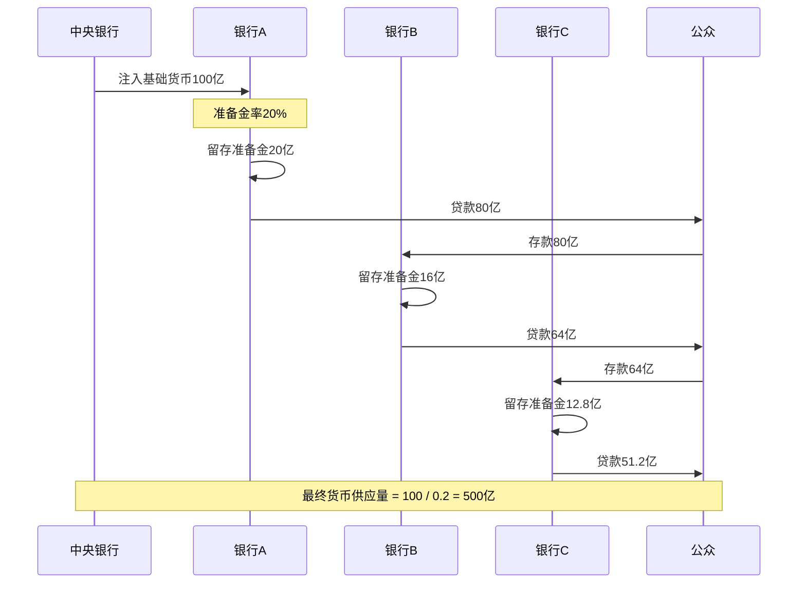
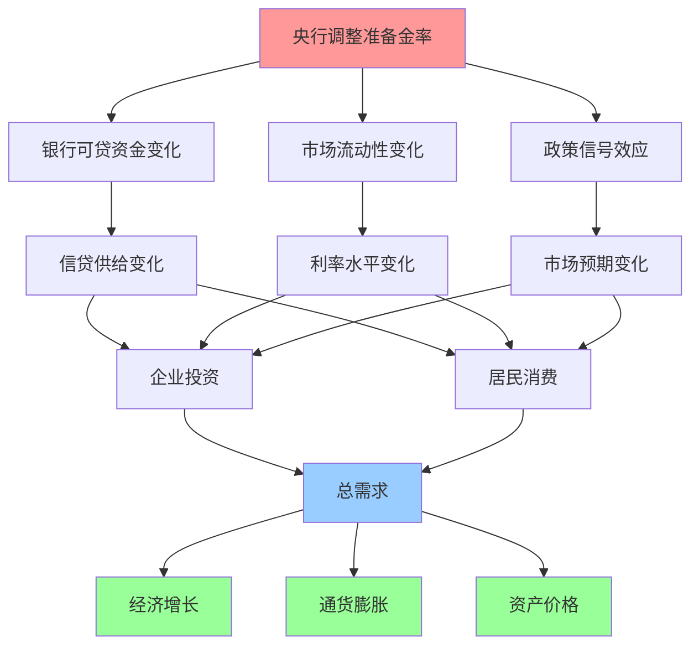

# 准备金政策

## 概述

存款准备金制度是现代银行体系的基石，也是中央银行调控货币供应的重要工具。通过调整商业银行必须在央行存放的准备金比例，央行可以直接影响银行的放贷能力和货币创造过程。理解准备金政策的运作机制，对于把握货币供应变化和信贷周期至关重要。

**学习目标**：
1. 掌握存款准备金制度的基本原理和类型
2. 理解准备金率与货币乘数的关系
3. 分析准备金政策的传导机制和经济影响
4. 认识不同国家准备金制度的差异
5. 学会跟踪和解读准备金政策调整

## 准备金制度基础

### 准备金的定义与类型

**存款准备金 (Reserve Requirements)**

存款准备金是商业银行为保证客户提取存款和资金清算需要而在中央银行存放的资金。

**准备金的两种形式**：

**1. 法定准备金 (Required Reserves)**
- 央行规定的最低准备金要求
- 计算公式：法定准备金 = 存款总额 × 法定准备金率
- 不能用于日常支付清算

**2. 超额准备金 (Excess Reserves)**
- 超过法定要求的准备金
- 银行自愿持有，用于应对流动性需求
- 可以用于放贷或投资

**总准备金 = 法定准备金 + 超额准备金**

### 准备金率的类型

**1. 按存款类型分类**

- **活期存款准备金率**：通常较高（流动性强）
- **定期存款准备金率**：通常较低（流动性弱）

**2. 按机构类型分类**

- **大型银行准备金率**：通常较高
- **中小银行准备金率**：通常较低（差别准备金制度）

**3. 按币种分类**

- **本币存款准备金率**
- **外币存款准备金率**

### 准备金制度的功能

**1. 保证支付清算**
- 确保银行有足够资金应对提款需求
- 维护银行体系稳定

**2. 调控货币供应**
- 通过改变银行可贷资金规模
- 影响货币创造过程

**3. 流动性管理**
- 吸收或释放银行体系流动性
- 配合其他货币政策工具

**4. 宏观审慎管理**
- 防范系统性风险
- 抑制信贷过度扩张

## 货币乘数与准备金

### 货币乘数原理

货币乘数描述了基础货币如何通过银行体系的信贷创造过程放大为广义货币。

**简化货币乘数公式**：

$$
m = \frac{1}{r}
$$

其中：
- m = 货币乘数
- r = 法定准备金率

**完整货币乘数公式**：

$$
m = \frac{1 + c}{r + e + c}
$$

其中：
- c = 现金漏损率（公众持有现金/存款比率）
- r = 法定准备金率
- e = 超额准备金率

### 货币创造过程

**货币创造示例**（准备金率20%）：

| 轮次 | 新增存款 | 新增准备金 | 新增贷款 |
|------|----------|------------|----------|
| 第1轮 | 100 | 20 | 80 |
| 第2轮 | 80 | 16 | 64 |
| 第3轮 | 64 | 12.8 | 51.2 |
| 第4轮 | 51.2 | 10.24 | 40.96 |
| ... | ... | ... | ... |
| 总计 | 500 | 100 | 400 |

**货币乘数 = 500 / 100 = 5 = 1 / 0.2**

### 准备金率调整的影响

**降低准备金率**：

1. **直接效应**：
   - 释放银行可贷资金
   - 增加货币供应量
   - 提高货币乘数

2. **数量示例**（准备金率从20%降至15%）：
   - 原货币乘数：1/0.2 = 5
   - 新货币乘数：1/0.15 = 6.67
   - 货币供应增加：(6.67-5)/5 = 33.4%

3. **经济影响**：
   - 信贷扩张
   - 投资消费增加
   - 经济增长加速
   - 通胀压力上升

**提高准备金率**：

1. **直接效应**：
   - 冻结银行可贷资金
   - 减少货币供应量
   - 降低货币乘数

2. **经济影响**：
   - 信贷收缩
   - 投资消费减少
   - 经济增长放缓
   - 通胀压力下降

## 准备金政策的传导机制

### 传导路径

### 传导渠道分析

**1. 数量渠道**

- **降准** → 可贷资金↑ → 信贷供给↑ → 投资消费↑ → 总需求↑
- **升准** → 可贷资金↓ → 信贷供给↓ → 投资消费↓ → 总需求↓

**传导效率**：
- 直接影响银行放贷能力
- 效果明显但较为粗放
- 对所有银行一视同仁

**2. 价格渠道**

- **降准** → 流动性↑ → 市场利率↓ → 借贷成本↓ → 投资消费↑
- **升准** → 流动性↓ → 市场利率↑ → 借贷成本↑ → 投资消费↓

**3. 信号渠道**

- **降准信号** → 宽松预期 → 风险偏好↑ → 投资意愿↑
- **升准信号** → 紧缩预期 → 风险偏好↓ → 投资意愿↓

**信号意义**：
- 准备金率调整频率低
- 单次调整幅度大（通常50-100bp）
- 政策信号强烈

**4. 资产负债表渠道**

- **降准** → 银行资产负债表扩张能力↑ → 信贷扩张
- **升准** → 银行资产负债表收缩压力↑ → 信贷收缩

### 传导效率的影响因素

**1. 银行体系状况**
- 资本充足率高 → 传导效率高
- 不良贷款率低 → 传导顺畅
- 风险偏好强 → 放贷意愿高

**2. 信贷需求**
- 经济扩张期 → 需求旺盛，传导效率高
- 经济衰退期 → 需求疲弱，传导受阻

**3. 金融市场发达程度**
- 融资渠道多元 → 准备金政策影响相对减弱
- 银行主导型金融体系 → 准备金政策影响大

**4. 超额准备金水平**
- 超额准备金高 → 降准效果有限
- 超额准备金低 → 降准效果明显

## 主要经济体的准备金制度

### 中国：高准备金率体系

**制度特点**：
- 准备金率较高（历史上曾达21.5%）
- 使用频率高，调整幅度大
- 差别准备金制度

**当前水平**（2024年）：
- 大型银行：10.5%
- 中小银行：7.5%
- 外币存款：5%

**调整历史**：
- 2007-2011年：连续上调，从9%升至21.5%（抑制信贷过热）
- 2012-2018年：多次下调，释放流动性
- 2018-2020年：定向降准，支持小微企业
- 2020-2023年：疫情期间多次降准

**政策特点**：
- 总量调控为主
- 结构性工具丰富（定向降准）
- 配合其他工具使用

### 美国：低准备金率体系

**制度演变**：
- 2020年3月前：准备金率0-10%（按存款规模分档）
- 2020年3月后：准备金率降至0%

**零准备金率的原因**：
1. 金融危机后超额准备金大量增加
2. 准备金率约束作用减弱
3. 转向利率走廊机制（IOER）

**当前机制**：
- 不再依赖准备金率调控
- 通过超额准备金利率(IOER)和隔夜逆回购利率(ON RRP)构建利率走廊
- 公开市场操作为主要工具

### 欧元区：低准备金率体系

**制度特点**：
- 统一准备金率：1%
- 准备金率长期稳定，很少调整
- 对准备金支付利息

**政策工具**：
- 主要依赖利率政策和资产购买
- 准备金率不作为主要调控工具

### 日本：低准备金率体系

**制度特点**：
- 准备金率：0.05%-1.3%（按存款类型和规模分档）
- 长期稳定，基本不调整
- 超额准备金规模巨大（QE后果）

**政策重点**：
- 量化质化宽松(QQE)
- 负利率政策
- 收益率曲线控制(YCC)

### 制度比较

| 国家/地区 | 准备金率水平 | 调整频率 | 主要作用 | 政策重点 |
|----------|-------------|----------|----------|----------|
| 中国 | 高（7.5%-10.5%） | 高 | 主要工具 | 数量型调控 |
| 美国 | 零 | 极低 | 已废弃 | 利率调控 |
| 欧元区 | 低（1%） | 极低 | 辅助工具 | 利率调控 |
| 日本 | 低（0.05%-1.3%） | 极低 | 辅助工具 | 量化宽松 |

## 准备金政策的实践案例

### 案例1：中国2008年应对通胀

**背景**：
- 2007-2008年经济过热，通胀率超过8%
- 信贷快速扩张，资产价格泡沫

**政策行动**：
- 2007年1月至2008年6月：10次上调准备金率
- 大型银行准备金率从9%升至17.5%
- 中小银行准备金率从7%升至15.5%
- 配合加息和公开市场操作

**效果**：
- 冻结流动性约1.6万亿元
- 信贷增速放缓
- 通胀得到控制
- 但2008年下半年全球金融危机爆发，政策迅速转向

**启示**：
- 准备金率是强力工具，效果明显
- 需要根据经济形势灵活调整
- 与其他工具配合使用

### 案例2：中国2018-2020年定向降准

**背景**：
- 经济下行压力加大
- 小微企业融资难、融资贵
- 去杠杆导致信用收缩

**政策行动**：
- 2018年：4次降准，其中3次定向降准
- 2019年：3次降准，全面降准+定向降准
- 2020年：3次降准，释放1.75万亿元流动性

**定向降准特点**：
- 对支持小微企业的银行额外降准0.5-1.5个百分点
- 对债转股、普惠金融达标银行定向降准
- 精准滴灌，避免大水漫灌

**效果**：
- 降低银行资金成本
- 引导资金流向实体经济
- 支持小微企业和民营企业
- 保持流动性合理充裕

**创新点**：
- 结构性货币政策工具
- 激励相容机制
- 精准调控

### 案例3：美国2020年准备金率归零

**背景**：
- 2008年金融危机后，美联储实施QE
- 银行体系超额准备金规模巨大（2.7万亿美元）
- 准备金率约束已失去意义

**政策行动**：
- 2020年3月26日：将准备金率降至0%
- 简化监管，降低银行合规成本
- 转向利率走廊机制

**影响**：
- 释放约2000亿美元流动性
- 但实际影响有限（超额准备金充裕）
- 标志着美国货币政策框架转型

**启示**：
- 准备金制度需要与时俱进
- 金融市场发达国家更依赖价格型工具
- 制度改革需要考虑金融体系特点

### 案例4：中国2023年降准支持经济复苏

**背景**：
- 疫情后经济复苏不均衡
- 房地产市场低迷
- 需要稳增长、稳就业

**政策行动**：
- 2023年3月：全面降准25bp
- 释放长期资金约5000亿元
- 配合LPR下调

**政策目标**：
- 保持流动性合理充裕
- 降低银行资金成本
- 支持实体经济融资
- 稳定市场预期

**效果**：
- 银行间利率下降
- 信贷投放增加
- 支持经济复苏

## 准备金政策的优势与局限

### 优势

**1. 影响力度大**
- 直接影响银行可贷资金规模
- 通过货币乘数放大效应
- 对货币供应影响显著

**2. 覆盖面广**
- 对所有银行一视同仁
- 系统性影响整个银行体系
- 不存在选择性问题

**3. 信号意义强**
- 调整频率低，单次幅度大
- 政策立场明确
- 市场关注度高

**4. 成本低**
- 不需要央行资金支持
- 行政命令即可执行
- 操作简单

### 局限性

**1. 调控精度低**
- 一刀切，缺乏灵活性
- 难以针对特定部门或行业
- 可能产生意外后果

**2. 时滞效应**
- 政策传导需要时间
- 效果显现较慢
- 难以精准调控

**3. 不可逆性**
- 降准容易，升准难
- 市场对升准反应敏感
- 政策调整受限

**4. 对银行盈利的影响**
- 提高准备金率增加银行成本
- 降低银行放贷能力
- 可能影响金融稳定

**5. 在金融市场发达国家效果有限**
- 企业融资渠道多元
- 银行中介作用下降
- 准备金政策影响减弱

## 准备金政策的未来趋势

### 1. 从数量型向价格型转变

**发展方向**：
- 降低准备金率水平
- 减少调整频率
- 更多依赖利率工具

**原因**：
- 金融市场化改革
- 融资渠道多元化
- 提高政策精准度

### 2. 结构性工具创新

**定向降准**：
- 支持特定领域（小微、三农、绿色）
- 激励相容机制
- 精准滴灌

**差别准备金**：
- 根据银行类型、规模、业务差异化设置
- 宏观审慎管理
- 防范系统性风险

### 3. 与宏观审慎政策结合

**逆周期调节**：
- 经济过热时提高准备金率
- 经济下行时降低准备金率
- 平滑经济周期波动

**防范金融风险**：
- 针对系统重要性银行设置更高要求
- 动态调整准备金率
- 维护金融稳定

### 4. 数字货币时代的准备金制度

**CBDC的影响**：
- 可能改变货币创造机制
- 准备金制度需要重新设计
- 央行与商业银行关系变化

## 投资者应对策略

### 跟踪准备金政策

**1. 关注政策动向**
- 央行货币政策委员会会议
- 央行工作会议
- 政府工作报告

**2. 解读政策信号**
- 降准：宽松信号，利好股市、债市
- 升准：紧缩信号，利空风险资产
- 定向降准：结构性宽松，关注受益行业

**3. 跟踪数据指标**
- 准备金率水平
- 超额准备金率
- 货币供应量(M1, M2)
- 社会融资规模
- 信贷增速

### 资产配置调整

**降准周期**：
- ✓ 增配股票（尤其是银行、地产、基建）
- ✓ 增配债券（流动性宽松，利率下行）
- ✓ 增配大宗商品（流动性推动）
- ✗ 减配现金

**升准周期**：
- ✗ 减配高估值股票
- ✗ 减配周期性行业
- ✓ 增配防御性资产
- ✓ 增配现金

**定向降准**：
- 关注受益行业（小微金融、农业、绿色）
- 关注政策支持方向
- 中长期布局

### 行业影响分析

**降准受益行业**：
- 银行：可贷资金增加，业务扩张
- 房地产：信贷宽松，融资改善
- 基建：资金支持，项目加速
- 券商：市场活跃度提升

**降准利空行业**：
- 银行（短期）：净息差收窄
- 保险：投资收益率下降

## 常见误区

**误区1：降准等于放水**
- 降准是调整货币政策工具
- 需要结合经济形势判断
- 不一定导致通胀

**误区2：降准一定利好股市**
- 需要看降准的原因和背景
- 如果是应对经济恶化，可能利空
- 综合判断经济基本面

**误区3：准备金率越低越好**
- 过低可能导致信贷过度扩张
- 需要平衡增长和稳定
- 适度水平最优

**误区4：忽视结构性差异**
- 定向降准与全面降准效果不同
- 关注政策的结构性特征
- 分析受益领域

## 延伸阅读

### 经典著作

1. **《货币银行学》** - Frederic S. Mishkin
   - 准备金制度的理论基础
   - 货币创造过程详解

2. **《货币数量论研究》** - Milton Friedman
   - 货币供应与经济的关系
   - 货币主义视角

3. **《中国货币政策实践》** - 易纲
   - 中国准备金制度的演进
   - 政策实践经验

### 学术论文

1. Bernanke, B. S., & Blinder, A. S. (1988). "Credit, Money, and Aggregate Demand"
2. Kashyap, A. K., & Stein, J. C. (2000). "What Do a Million Observations on Banks Say about the Transmission of Monetary Policy?"
3. 盛松成, 谢洁玉 (2013). 《存款准备金率:货币政策的重要工具》

### 实时资源

1. **中国人民银行官网** - pbc.gov.cn
   - 准备金率调整公告
   - 货币政策执行报告
2. **各国央行官网**
   - 准备金制度说明
   - 统计数据
3. **Wind、Bloomberg** - 准备金率历史数据

## 参考文献

1. Bernanke, B. S., & Blinder, A. S. (1988). "Credit, Money, and Aggregate Demand." *American Economic Review*, 78(2), 435-439.
2. Kashyap, A. K., & Stein, J. C. (2000). "What Do a Million Observations on Banks Say about the Transmission of Monetary Policy?" *American Economic Review*, 90(3), 407-428.
3. Mishkin, F. S. (2019). *The Economics of Money, Banking, and Financial Markets* (12th ed.). Pearson.
4. 易纲 (2018). 《中国货币政策调控方式转型》，《经济研究》
5. 盛松成, 谢洁玉 (2013). 《存款准备金率:货币政策的重要工具》，《中国金融》
6. 中国人民银行 (2023). 《中国货币政策执行报告》各期
7. 马骏 (2020). 《货币政策的"两个支柱"调控框架》，《中国金融》
8. IMF (2023). *Global Financial Stability Report*
9. BIS (2023). *Monetary Policy Frameworks and Central Bank Market Operations*
10. Federal Reserve (2020). *Reserve Requirements: History, Current Practice, and Potential Reform*
