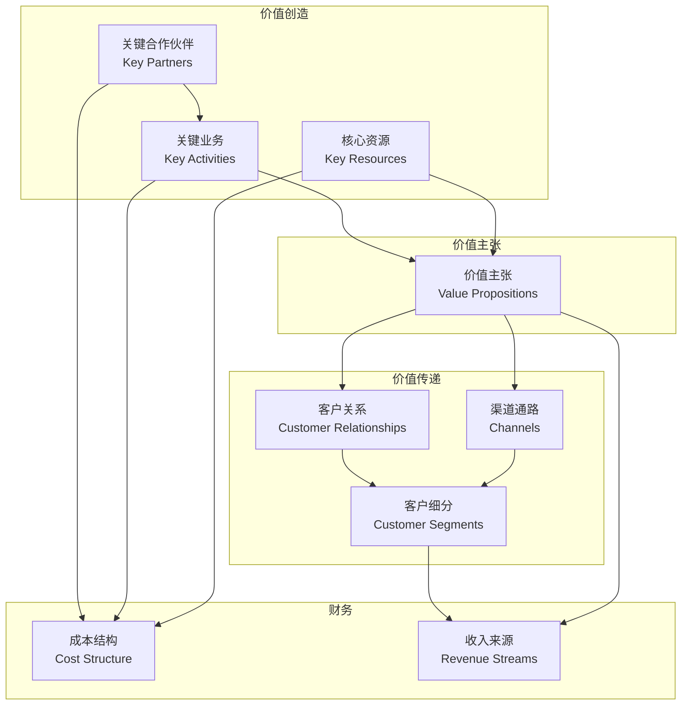

# 商业模式画布 - 系统化分析企业商业模式

## 概述

商业模式画布（Business Model Canvas）是由亚历山大·奥斯特瓦德（Alexander Osterwalder）开发的战略管理工具，用一张画布系统化地描述、分析和设计商业模式。它将复杂的商业模式分解为九个相互关联的构成要素，帮助投资者和创业者快速理解企业如何创造、传递和获取价值。

商业模式画布已成为全球最流行的商业模式分析工具，被数百万企业和投资者使用。

### 学习目标

完成本文学习后，你将能够：

1. 理解商业模式画布的九大构成要素
2. 使用画布系统化分析任何企业的商业模式
3. 识别商业模式的优势和弱点
4. 评估商业模式的可持续性和盈利能力
5. 比较不同企业的商业模式差异
6. 将商业模式分析应用于投资决策

### 为什么商业模式画布重要？

- **系统化思维**：提供完整的商业模式分析框架
- **可视化工具**：一张图展示整个商业逻辑
- **快速理解**：帮助投资者快速把握企业核心
- **发现问题**：识别商业模式的薄弱环节
- **比较分析**：便于对比不同企业的模式差异

## 商业模式画布的九大要素

### 1. 客户细分（Customer Segments）

**定义**：企业想要服务的不同人群或组织。

**关键问题**：
- 我们为谁创造价值？
- 谁是我们最重要的客户？
- 客户有哪些细分群体？

**客户细分类型**：
- **大众市场**：不区分客户群体（可口可乐）
- **利基市场**：服务特定细分市场（劳斯莱斯）
- **区隔化市场**：多个相关客户群体（亚马逊）
- **多元化市场**：完全不同的客户群体（通用电气）
- **多边平台**：服务两个或多个相互依存的客户群体（淘宝）

**案例分析**：

**苹果公司**：
- 消费者市场：iPhone、iPad、Mac 用户
- 企业市场：企业客户使用 Mac 和 iPad
- 开发者市场：App Store 开发者
- 内容创作者：音乐人、视频创作者

**特斯拉**：
- 早期采用者：科技爱好者、环保人士
- 高端市场：Model S/X 客户
- 大众市场：Model 3/Y 客户
- 企业市场：商业车队

### 2. 价值主张（Value Propositions）

**定义**：企业为特定客户细分创造价值的产品和服务组合。

**关键问题**：
- 我们向客户传递什么价值？
- 我们帮助客户解决什么问题？
- 我们满足客户什么需求？
- 我们为每个客户细分提供什么产品和服务组合？

**价值主张类型**：
- **新颖性**：满足全新需求（iPhone）
- **性能**：改进产品性能（英特尔芯片）
- **定制化**：针对特定客户需求定制（Salesforce）
- **把事情做好**：帮助客户完成任务（FedEx）
- **设计**：卓越设计（苹果、戴森）
- **品牌/地位**：展示身份地位（劳力士、爱马仕）
- **价格**：以更低价格提供相似价值（小米、Costco）
- **成本降低**：帮助客户降低成本（AWS）
- **风险降低**：降低客户风险（保险）
- **可及性**：让原本难以获得的产品或服务变得可及（Netflix）
- **便利性/可用性**：更方便使用（Uber、美团）

**案例分析**：

**Netflix**：
- 海量内容库随时观看
- 无广告观看体验
- 个性化推荐算法
- 多设备同步观看
- 原创独家内容
- 固定月费无限观看

**Costco**：
- 极致低价（毛利率仅 11%）
- 高品质商品保证
- 大包装节省单价
- 无条件退货政策
- 会员专享优惠

### 3. 渠道通路（Channels）

**定义**：企业如何与客户细分进行沟通并传递价值主张。

**关键问题**：
- 客户希望通过哪些渠道接触我们？
- 我们现在如何接触客户？
- 我们的渠道如何整合？
- 哪些渠道最有效？
- 哪些渠道成本效益最高？

**渠道阶段**：
1. **认知**：如何提高对产品和服务的认知？
2. **评估**：如何帮助客户评估价值主张？
3. **购买**：如何让客户购买产品和服务？
4. **传递**：如何向客户传递价值主张？
5. **售后**：如何提供售后客户支持？

**渠道类型**：
- **自有渠道**：
  - 直销团队
  - 网站
  - 自有门店
- **合作伙伴渠道**：
  - 合作伙伴门店
  - 批发商
  - 分销商

**案例分析**：

**苹果**：
- 自有渠道：Apple Store 零售店、官网、Apple App
- 合作渠道：运营商门店、授权经销商、电商平台
- 线上线下融合：线上预约线下体验

**特斯拉**：
- 直销模式：官网直接销售，无经销商
- 体验中心：城市中心展示厅
- 移动服务：上门维修服务
- OTA 更新：远程软件升级

### 4. 客户关系（Customer Relationships）

**定义**：企业与特定客户细分建立的关系类型。

**关键问题**：
- 每个客户细分期望我们建立和保持什么类型的关系？
- 我们已经建立了哪些关系？
- 这些关系的成本如何？
- 如何将它们与商业模式的其他部分整合？

**客户关系类型**：
- **个人助理**：基于人际互动（私人银行）
- **专用个人助理**：专门客户经理（企业软件）
- **自助服务**：客户自助完成（ATM、自助结账）
- **自动化服务**：个性化自动服务（亚马逊推荐）
- **社区**：用户社区互动（小米社区、苹果论坛）
- **共同创造**：客户参与价值创造（YouTube、知乎）

**案例分析**：

**亚马逊**：
- 自助服务：网站自助购物
- 自动化推荐：AI 个性化推荐
- Prime 会员：专属服务和优惠
- 客户评价：用户生成内容
- 24/7 客服：全天候支持

**Salesforce**：
- 专属客户经理：大客户专人服务
- 在线社区：Trailblazer 社区
- 培训认证：免费在线培训
- 年度大会：Dreamforce 用户大会

### 5. 收入来源（Revenue Streams）

**定义**：企业从每个客户细分获得的现金收入。

**关键问题**：
- 客户真正愿意付费的价值是什么？
- 他们现在为什么付费？
- 他们如何付费？
- 他们更愿意如何付费？
- 每个收入来源对总收入的贡献是多少？

**收入类型**：
- **资产销售**：出售实物产品所有权（汽车、手机）
- **使用费**：按使用量收费（电信、云服务）
- **订阅费**：持续使用服务收费（Netflix、SaaS）
- **租赁费**：临时使用资产收费（租车、共享单车）
- **授权费**：授权知识产权收费（专利、版权）
- **经纪费**：中介服务收费（房产中介、投行）
- **广告费**：广告展示收费（Google、Facebook）

**定价机制**：
- **固定定价**：
  - 标价：固定价格
  - 产品特性定价：按功能定价
  - 客户细分定价：按客户类型定价
  - 数量定价：按购买量定价
- **动态定价**：
  - 议价：协商定价
  - 收益管理：根据库存和需求动态定价（航空、酒店）
  - 实时市场定价：根据供需实时定价（Uber）
  - 拍卖：竞价定价

**案例分析**：

**苹果**：
- 硬件销售：iPhone、iPad、Mac、Apple Watch（70%+ 收入）
- 服务订阅：Apple Music、iCloud、Apple TV+（增长最快）
- App Store 佣金：应用内购买 30% 分成
- 授权费：专利授权

**腾讯**：
- 增值服务：游戏、音乐、视频会员（60%+ 收入）
- 网络广告：微信、QQ、腾讯视频广告（20% 收入）
- 金融科技：支付、理财服务（20% 收入）
- 其他：云服务、企业服务

### 6. 核心资源（Key Resources）

**定义**：让商业模式运转所需的最重要资产。

**关键问题**：
- 我们的价值主张需要什么核心资源？
- 我们的渠道通路需要什么？
- 客户关系需要什么？
- 收入来源需要什么？

**资源类型**：
- **实物资源**：
  - 制造设施（工厂、设备）
  - 建筑物（门店、办公室）
  - 车辆、机器、系统
  - 分销网络
- **知识资源**：
  - 品牌（可口可乐、苹果）
  - 专利和版权（高通、迪士尼）
  - 客户数据库（亚马逊）
  - 合作伙伴关系
- **人力资源**：
  - 创意人才（皮克斯）
  - 工程师（Google、特斯拉）
  - 销售团队（Oracle）
- **财务资源**：
  - 现金和信贷额度
  - 股票期权池

**案例分析**：

**可口可乐**：
- 品牌：全球最有价值品牌之一
- 配方：秘密配方
- 生产网络：全球装瓶合作伙伴
- 分销网络：覆盖全球的分销系统

**台积电**：
- 先进制程技术：3nm、5nm 工艺
- 生产设备：数百亿美元的光刻机等设备
- 工程师团队：数万名半导体工程师
- 客户关系：与苹果、AMD、NVIDIA 等的长期合作

### 7. 关键业务（Key Activities）

**定义**：企业为使商业模式运转而必须做的最重要的事情。

**关键问题**：
- 我们的价值主张需要什么关键业务？
- 我们的渠道通路需要什么？
- 客户关系需要什么？
- 收入来源需要什么？

**业务类型**：
- **生产制造**：设计、制造、交付产品（汽车、电子产品）
- **问题解决**：为客户问题提供新解决方案（咨询、医疗）
- **平台/网络**：平台管理、服务提供、平台推广（淘宝、Uber）

**案例分析**：

**亚马逊**：
- 平台运营：电商平台维护和优化
- 物流配送：FBA 仓储和配送网络
- 技术开发：AWS 云服务开发
- 内容制作：Prime Video 原创内容

**Netflix**：
- 内容采购：购买影视版权
- 原创制作：制作原创剧集和电影
- 技术开发：推荐算法、流媒体技术
- 平台运营：全球流媒体平台运营

### 8. 重要合作（Key Partnerships）

**定义**：让商业模式运转所需的供应商和合作伙伴网络。

**关键问题**：
- 谁是我们的重要合作伙伴？
- 谁是我们的重要供应商？
- 我们从合作伙伴那里获取哪些核心资源？
- 合作伙伴执行哪些关键业务？

**合作动机**：
- **优化和规模经济**：降低成本
- **降低风险和不确定性**：分散风险
- **获取特定资源和业务**：获得自己不具备的能力

**合作类型**：
- **战略联盟**：非竞争者之间的合作
- **竞合**：竞争者之间的战略合作
- **合资企业**：开发新业务
- **供应商关系**：确保可靠供应

**案例分析**：

**苹果**：
- 供应商：富士康（组装）、台积电（芯片制造）
- 内容提供商：音乐公司、电影公司
- 运营商：AT&T、Verizon、中国移动
- 开发者：App Store 开发者生态

**特斯拉**：
- 电池供应商：松下、LG、宁德时代
- 充电网络：与其他充电网络合作
- 自动驾驶：与芯片供应商合作
- 能源合作：与电力公司合作

### 9. 成本结构（Cost Structure）

**定义**：运营商业模式所产生的所有成本。

**关键问题**：
- 我们商业模式中最重要的固有成本是什么？
- 哪些核心资源最昂贵？
- 哪些关键业务最昂贵？

**成本结构类型**：
- **成本驱动**：专注于最小化成本（廉价航空、Costco）
- **价值驱动**：专注于创造价值（奢侈品、苹果）

**成本特征**：
- **固定成本**：不随产量变化（工厂、工资）
- **可变成本**：随产量变化（原材料）
- **规模经济**：规模越大，单位成本越低
- **范围经济**：业务范围越广，成本优势越大

**案例分析**：

**Netflix**：
- 内容成本：版权采购和原创制作（最大成本）
- 技术成本：AWS 云服务、CDN
- 营销成本：用户获取成本
- 管理成本：员工工资和办公

**Costco**：
- 商品成本：采购成本（89% 收入）
- 运营成本：仓储、物流、人工（10% 收入）
- 极低毛利率：仅 11%，靠会员费盈利

## 商业模式画布应用

### 分析现有企业

**步骤**：
1. 收集企业信息（年报、新闻、分析报告）
2. 填写九大要素
3. 识别关键驱动因素
4. 评估商业模式优劣
5. 与竞争对手对比

### 识别投资机会

**优秀商业模式特征**：
- **强价值主张**：解决真实痛点
- **可扩展性**：边际成本递减
- **网络效应**：用户越多价值越大
- **高转换成本**：客户难以离开
- **多元收入**：收入来源多样化
- **资产轻**：不需要大量资本投入

### 风险识别

**商业模式风险**：
- **单一客户依赖**：过度依赖少数客户
- **单一供应商**：供应链脆弱
- **高固定成本**：经营杠杆高
- **低转换成本**：客户容易流失
- **技术颠覆**：商业模式被新技术颠覆

## 商业模式画布案例对比

### 案例 1：苹果 vs 小米

**苹果**：
- 价值主张：高端体验、生态系统
- 收入：硬件高毛利 + 服务订阅
- 成本结构：价值驱动，高研发投入
- 护城河：品牌 + 生态系统

**小米**：
- 价值主张：高性价比、互联网思维
- 收入：硬件低毛利 + 互联网服务
- 成本结构：成本驱动，效率优先
- 护城河：性价比 + 生态链

### 案例 2：Netflix vs 传统电视

**Netflix**：
- 客户：全球订阅用户
- 价值主张：随时随地、无广告、个性化
- 渠道：互联网直达
- 收入：订阅费
- 成本：内容 + 技术

**传统电视**：
- 客户：本地观众
- 价值主张：免费内容、直播
- 渠道：有线/卫星
- 收入：广告费
- 成本：内容 + 播出

## 实战应用

### 投资分析清单

使用商业模式画布分析企业时，问自己：

**价值创造**：
- [ ] 企业为客户创造了什么独特价值？
- [ ] 这个价值主张有多强？
- [ ] 核心资源是否稀缺且难以复制？
- [ ] 关键业务是否高效执行？

**价值传递**：
- [ ] 渠道是否高效触达客户？
- [ ] 客户关系是否牢固？
- [ ] 客户细分是否清晰？

**价值获取**：
- [ ] 收入模式是否可持续？
- [ ] 收入是否多元化？
- [ ] 成本结构是否合理？
- [ ] 盈利能力如何？

**整体评估**：
- [ ] 九大要素是否协调一致？
- [ ] 商业模式是否可扩展？
- [ ] 是否有护城河保护？
- [ ] 面临哪些颠覆风险？

### 常见错误

1. **只看收入，忽视成本**：关注收入增长但忽视成本结构
2. **孤立分析要素**：不看九大要素的协同关系
3. **静态分析**：不考虑商业模式的演进
4. **忽视竞争**：不与竞争对手对比
5. **过度复杂**：填写过多细节，失去重点

## 延伸阅读

### 推荐书籍

1. **《商业模式新生代》** - Alexander Osterwalder & Yves Pigneur
   - 商业模式画布的原创著作
   - 包含大量案例和实践指导

2. **《价值主张设计》** - Alexander Osterwalder
   - 深入讲解价值主张设计
   - 配套商业模式画布使用

3. **《商业模式全史》** - 三谷宏治
   - 140 个商业模式案例
   - 商业模式演进历史

4. **《平台革命》** - Geoffrey Parker
   - 平台商业模式深度分析
   - 网络效应和平台战略

5. **《精益创业》** - Eric Ries
   - 商业模式验证方法
   - 快速迭代和学习

### 在线资源

- **Strategyzer.com**：商业模式画布官方网站
- **Business Model Toolbox**：商业模式工具集
- **Coursera - Business Model Canvas**：在线课程

## 参考文献

1. Osterwalder, A., & Pigneur, Y. (2010). Business Model Generation. Wiley.
2. Osterwalder, A., et al. (2014). Value Proposition Design. Wiley.
3. Christensen, C. M. (1997). The Innovator's Dilemma. Harvard Business Review Press.
4. Porter, M. E. (1985). Competitive Advantage. Free Press.
5. Teece, D. J. (2010). "Business Models, Business Strategy and Innovation." Long Range Planning, 43(2-3), 172-194.

---

**下一步**：学习 [收入模式分类](revenue-models.html)，深入理解企业如何设计和优化收入来源。
6. Osterwalder, A., & Pigneur, Y. (2010). *Business Model Generation*. Wiley.
7. Christensen, C. M. (1997). *The Innovator's Dilemma*. Harvard Business School Press.
8. Parker, G. G., Van Alstyne, M. W., & Choudary, S. P. (2016). *Platform Revolution*. W.W. Norton.

