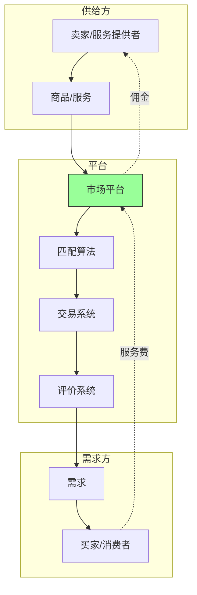

# 市场型模式 - 双边市场平台的商业逻辑

## 概述

市场型模式（Marketplace Model）是平台商业模式的一种重要类型，通过连接买家和卖家，促进交易发生，并从中获取佣金或服务费。与传统零售模式不同，市场平台不拥有库存，而是作为中介撮合交易。

市场型模式的核心优势在于轻资产、高可扩展性和强网络效应。全球最成功的市场平台包括：淘宝、亚马逊第三方市场、Uber、Airbnb、美团等。

### 学习目标

完成本文学习后，你将能够：

1. 理解市场型模式的核心机制
2. 掌握双边市场的平衡策略
3. 分析市场平台的关键指标
4. 评估市场平台的竞争优势
5. 识别市场模式的风险和挑战
6. 将市场分析应用于投资决策


### 为什么市场型模式重要？

- **轻资产**：不需要库存和物流基础设施
- **可扩展性**：边际成本接近零
- **网络效应**：供需双方互相吸引
- **高毛利率**：佣金模式，毛利率 70%-95%
- **赢家通吃**：市场集中度高

## 市场型模式核心机制

### 双边市场结构



### 价值创造机制

**传统零售**：
- 企业采购商品
- 企业承担库存风险
- 企业负责物流配送
- 企业赚取差价

**市场平台**：
- 连接买卖双方
- 不承担库存风险
- 促进交易发生
- 收取佣金或服务费

### 网络效应

**正向循环**：
1. 更多卖家 → 更多商品选择
2. 更多商品 → 吸引更多买家
3. 更多买家 → 吸引更多卖家
4. 形成良性循环

**临界规模**：
- 需要达到最小规模才能启动网络效应
- 冷启动问题：初期供需都少
- 突破临界规模后快速增长

## 市场型模式分类

### 1. 电商市场（E-commerce Marketplace）

**定义**：连接商品卖家和买家。

**案例**：

**淘宝/天猫**：
- 卖家：数百万商家
- 买家：9 亿+ 活跃用户
- GMV：8 万亿+ 人民币/年
- 佣金率：0.5%-5%（类目不同）
- 收入：佣金 + 广告 + 增值服务
- 市场份额：中国电商 50%+

**亚马逊第三方市场**：
- 卖家：数百万第三方卖家
- 买家：3 亿+ Prime 会员
- GMV：$3,000+ 亿/年
- 佣金率：8%-15%
- 收入占比：第三方卖家占 GMV 60%+

**拼多多**：
- 卖家：数百万商家
- 买家：8 亿+ 活跃用户
- GMV：3 万亿+ 人民币/年
- 特色：拼团、低价
- 增长：极快

**优势**：
- 商品丰富度高
- 价格竞争激烈
- 便利性强

**挑战**：
- 假货问题
- 商家质量参差不齐
- 价格战

### 2. 服务市场（Service Marketplace）

**定义**：连接服务提供者和需求者。

**案例**：

**Uber**：
- 司机：数百万司机
- 乘客：数亿用户
- 订单：数十亿次/年
- 佣金率：20%-30%
- 覆盖：全球 70+ 国家

**Airbnb**：
- 房东：600 万+ 房源
- 房客：数亿用户
- 订单：数亿间夜/年
- 佣金率：17%（房东 3% + 房客 14%）
- 覆盖：全球 220+ 国家

**美团**：
- 商家：数百万商家
- 用户：6 亿+ 活跃用户
- 订单：数十亿单/年
- 佣金率：外卖 18%-22%，到店 8%-10%
- 业务：外卖、到店、酒旅、出行

**Upwork**：
- 自由职业者：1,800 万+
- 客户：500 万+ 企业
- 服务：编程、设计、写作等
- 佣金率：5%-20%（阶梯式）

**优势**：
- 灵活就业
- 供需高效匹配
- 价格透明

**挑战**：
- 服务质量控制
- 劳工权益保护
- 监管风险

### 3. 租赁市场（Rental Marketplace）

**定义**：连接资产出租方和承租方。

**案例**：

**Turo**（汽车租赁）：
- 车主：数十万车主
- 租客：数百万用户
- 车辆：数十万辆
- 佣金率：25%-40%
- 模式：P2P 租车

**Fat Llama**（物品租赁）：
- 出租方：个人和企业
- 租客：需要临时使用物品的人
- 物品：相机、工具、派对用品等
- 佣金率：15%-25%

**优势**：
- 提高资产利用率
- 降低使用成本
- 环保

**挑战**：
- 资产损坏风险
- 保险问题
- 信任建立

### 4. 二手市场（Secondhand Marketplace）

**定义**：连接二手商品卖家和买家。

**案例**：

**闲鱼**：
- 用户：3 亿+ 用户
- 商品：数亿件商品
- 交易：C2C 为主
- 收入：广告、增值服务
- 特色：社区化、信用体系

**eBay**：
- 用户：1.3 亿+ 活跃买家
- 卖家：1,900 万+ 卖家
- GMV：$730+ 亿/年
- 佣金率：10%-15%
- 特色：拍卖 + 一口价

**Poshmark**（时尚二手）：
- 用户：8,000 万+ 用户
- 商品：服装、配饰
- 佣金率：20%（< $15）或 $2.95 + 20%（≥ $15）
- 特色：社交化购物

**优势**：
- 延长商品生命周期
- 环保可持续
- 价格优势

**挑战**：
- 商品质量鉴定
- 物流复杂
- 信任问题

## 市场平台关键指标

### 1. GMV（总交易额）

**定义**：Gross Merchandise Volume，平台上的总交易额。

**计算**：
```
GMV = 订单数 × 平均订单金额
```

**重要性**：
- 衡量平台规模
- 反映市场地位
- 投资者关注指标

**案例**：
- 淘宝/天猫：8 万亿+ 人民币
- 拼多多：3 万亿+ 人民币
- 美团：2 万亿+ 人民币

**注意**：
- GMV ≠ 收入
- GMV 包含退货和取消订单
- 需要关注 GMV 转化为收入的比率

### 2. Take Rate（佣金率）

**定义**：平台从交易中抽取的佣金比例。

**计算**：
```
Take Rate = 平台收入 / GMV
```

**行业基准**：
- 电商：0.5%-5%
- 服务市场：15%-30%
- 租赁市场：15%-40%
- 二手市场：10%-20%

**案例**：
- 淘宝：2%-3%
- Uber：20%-30%
- Airbnb：17%
- eBay：10%-15%

**影响因素**：
- 竞争程度
- 平台提供的价值
- 市场地位
- 服务复杂度

### 3. 活跃用户（Active Users）

**定义**：
- **MAU**（Monthly Active Users）：月活跃用户
- **DAU**（Daily Active Users）：日活跃用户

**重要性**：
- 衡量平台活跃度
- 反映用户粘性
- 增长潜力指标

**案例**：
- 淘宝：9 亿+ MAU
- 美团：6 亿+ MAU
- Uber：1.3 亿+ MAU

### 4. 订单频次（Order Frequency）

**定义**：用户平均订单频次。

**计算**：
```
订单频次 = 总订单数 / 活跃用户数
```

**重要性**：
- 反映用户粘性
- 高频业务更有价值
- 影响 LTV

**案例**：
- 美团外卖：每月 4-6 次
- 淘宝：每月 2-3 次
- Airbnb：每年 1-2 次

### 5. 供需平衡

**定义**：供给方和需求方的匹配程度。

**指标**：
- 供给利用率：供给方的订单完成率
- 需求满足率：需求方的订单成功率
- 匹配时间：从需求到匹配的时间

**重要性**：
- 平衡是市场健康的关键
- 供给过剩：价格下降，供给方流失
- 需求过剩：服务质量下降，需求方流失

**案例**：
- Uber：高峰期供不应求，动态定价
- Airbnb：热门城市供不应求，价格上涨

### 6. 客户获取成本（CAC）

**定义**：获取一个新用户的平均成本。

**计算**：
```
CAC = 营销费用 / 新增用户数
```

**重要性**：
- 评估营销效率
- 与 LTV 对比评估盈利能力

**优化方向**：
- 病毒式传播
- 口碑营销
- SEO/SEM 优化
- 合作伙伴渠道

### 7. 客户生命周期价值（LTV）

**定义**：客户在整个生命周期内为平台创造的总价值。

**计算**：
```
LTV = 平均订单价值 × 订单频次 × 客户生命周期 × Take Rate
```

**重要性**：
- 决定可承受的 CAC
- 评估业务可持续性

**LTV/CAC 比率**：
- 优秀：> 3
- 良好：2-3
- 需改进：< 2

## 市场平台成功要素

### 1. 冷启动策略

**挑战**：初期供需都少，难以吸引用户。

**策略**：

**单边补贴**：
- 补贴供给方：Uber 补贴司机
- 补贴需求方：美团补贴用户
- 目的：快速达到临界规模

**垂直整合**：
- 自己提供供给：Uber Eats 自营配送
- 保证初期供给
- 达到规模后开放第三方

**地理聚焦**：
- 先在一个城市达到临界规模
- 再扩展到其他城市
- 案例：Uber 从旧金山开始

**利基市场**：
- 从小众市场开始
- 降低冷启动难度
- 案例：Airbnb 从会议住宿开始

### 2. 信任机制

**挑战**：陌生人之间交易，信任缺失。

**机制**：

**评价系统**：
- 双向评价：买卖双方互评
- 评分可见：公开展示评分
- 案例：淘宝信用评级、Uber 评分

**身份验证**：
- 实名认证
- 资质审核
- 背景调查
- 案例：Airbnb 身份验证

**担保交易**：
- 平台托管资金
- 确认收货后放款
- 案例：支付宝担保交易

**保险保障**：
- 平台提供保险
- 降低交易风险
- 案例：Airbnb 房东保险

### 3. 供需平衡

**挑战**：供需失衡导致用户体验下降。

**策略**：

**动态定价**：
- 需求高时提价
- 供给多时降价
- 案例：Uber 动态加价

**激励机制**：
- 高峰期奖励供给方
- 淡季补贴需求方
- 案例：滴滴高峰奖励

**供给管理**：
- 控制供给方准入
- 淘汰低质量供给
- 案例：Uber 司机评分淘汰

**需求管理**：
- 会员优先
- 预约机制
- 案例：Airbnb 超赞房东优先

### 4. 质量控制

**挑战**：第三方提供服务，质量难以控制。

**机制**：

**准入标准**：
- 资质审核
- 培训认证
- 案例：Uber 司机审核

**质量监控**：
- 用户评价
- 神秘顾客
- 数据监控
- 案例：美团商家评分

**奖惩机制**：
- 高评分奖励
- 低评分处罚
- 严重违规清退
- 案例：淘宝商家处罚

**标准化**：
- 服务标准
- 流程规范
- 案例：Airbnb 房源标准

## 市场平台财务特征

### 收入模式

**主要收入**：
1. **交易佣金**：按 GMV 抽成（主要收入）
2. **广告收入**：商家推广（淘宝直通车）
3. **增值服务**：数据分析、营销工具
4. **会员费**：买家或卖家会员
5. **金融服务**：支付、贷款

### 成本结构

**主要成本**：
1. **营销费用**：用户获取（30%-50% 收入）
2. **技术开发**：平台维护和优化（10%-20%）
3. **客服成本**：客户支持（5%-10%）
4. **支付成本**：支付手续费（1%-3%）
5. **管理费用**：运营管理（5%-10%）

### 财务指标

**毛利率**：
- 电商市场：70%-80%
- 服务市场：80%-90%
- 轻资产，高毛利

**运营利润率**：
- 成熟期：10%-30%
- 增长期：可能为负（投入营销）

**现金流**：
- 良好：交易即时收款
- 可能有账期：给商家的账期

## 投资分析框架

### 评估市场平台

**市场地位**：
- [ ] 市场份额
- [ ] GMV 规模和增长
- [ ] 网络效应强度
- [ ] 竞争格局

**单位经济**：
- [ ] Take Rate 水平
- [ ] LTV/CAC 比率
- [ ] 订单频次
- [ ] 客户留存率

**增长潜力**：
- [ ] 市场渗透率
- [ ] 品类扩展空间
- [ ] 地理扩展空间
- [ ] 新业务机会

**运营效率**：
- [ ] 毛利率
- [ ] 营销费用率
- [ ] 运营杠杆
- [ ] 现金流状况

**风险因素**：
- [ ] 监管风险
- [ ] 竞争风险
- [ ] 供需平衡风险
- [ ] 质量控制风险

### 估值方法

**GMV 倍数**：
```
市值 / GMV = 0.2x - 2x
```

**收入倍数**：
```
市值 / 收入 = 3x - 15x
```

**案例**：
- 阿里巴巴：0.25x GMV
- 美团：0.5x GMV
- Uber：2x 收入

## 延伸阅读

### 推荐书籍

1. **《平台革命》** - Geoffrey Parker
   - 平台商业模式
   - 市场平台战略

2. **《平台战略》** - 陈威如
   - 中国市场平台案例
   - 平台竞争策略

3. **《网络效应》** - Andrew Chen
   - 网络效应机制
   - 冷启动问题

## 参考文献

1. Parker, G., et al. (2016). Platform Revolution. W. W. Norton & Company.
2. Eisenmann, T., et al. (2006). "Strategies for Two-Sided Markets." Harvard Business Review.
3. Evans, D. S., & Schmalensee, R. (2016). Matchmakers: The New Economics of Multisided Platforms. Harvard Business Review Press.

---

**下一步**：学习 [SaaS 商业模式](saas-models.html)，深入理解软件即服务的商业逻辑和财务特征。
4. Osterwalder, A., & Pigneur, Y. (2010). *Business Model Generation*. Wiley.
5. Christensen, C. M. (1997). *The Innovator's Dilemma*. Harvard Business School Press.
6. Parker, G. G., Van Alstyne, M. W., & Choudary, S. P. (2016). *Platform Revolution*. W.W. Norton.
7. Eisenmann, T., Parker, G., & Van Alstyne, M. W. (2006). "Strategies for Two-Sided Markets." *Harvard Business Review*, 84(10), 92-101.
8. Rochet, J. C., & Tirole, J. (2003). "Platform Competition in Two-Sided Markets." *Journal of the European Economic Association*, 1(4), 990-1029.

