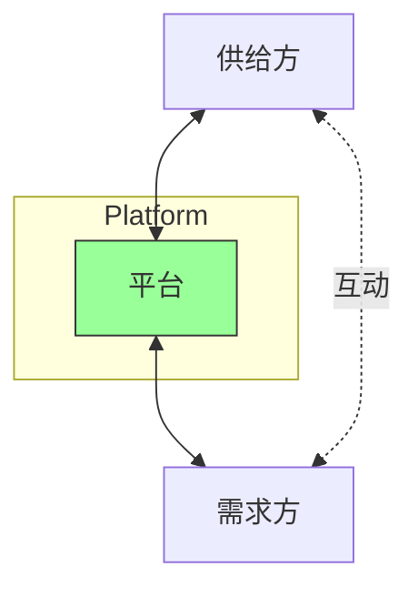
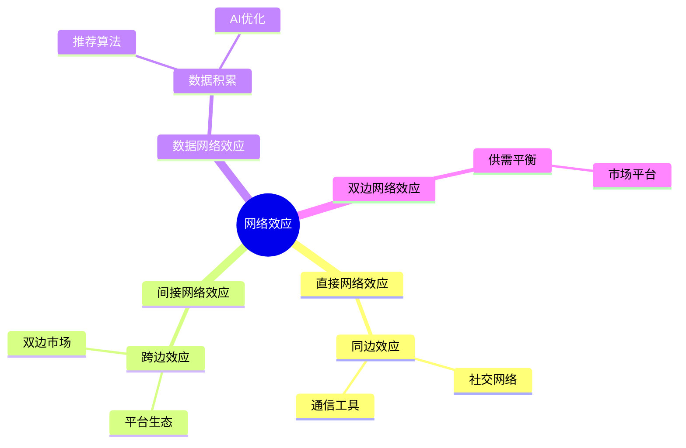

# 平台型商业模式 - 双边市场与网络效应

## 概述

平台型商业模式（Platform Business Model）是互联网时代最重要的商业创新之一。与传统的线性商业模式不同，平台连接两个或多个相互依存的用户群体，通过促进他们之间的互动和交易来创造价值。

平台企业往往具有极强的网络效应，一旦达到临界规模，就能形成"赢家通吃"的竞争格局。全球市值最高的企业中，大多数都是平台型企业：苹果、微软、亚马逊、Google、Meta、阿里巴巴、腾讯等。

### 学习目标

完成本文学习后，你将能够：

1. 理解平台商业模式的核心逻辑
2. 掌握网络效应的类型和机制
3. 分析平台的双边市场动态
4. 评估平台企业的竞争优势
5. 识别平台面临的挑战和风险
6. 将平台分析应用于投资决策

### 为什么平台模式重要？

- **网络效应**：用户越多，价值越大
- **可扩展性**：边际成本接近零
- **赢家通吃**：市场集中度极高
- **高估值**：平台企业估值倍数高
- **护城河**：网络效应形成强大护城河

## 平台 vs 传统商业模式

### 线性模式（Pipeline）

**特点**：
- 企业控制价值链
- 单向价值传递
- 规模经济有限
- 资产重

**案例**：沃尔玛、丰田、可口可乐

### 平台模式（Platform）

**特点**：
- 连接多方用户
- 促进互动和交易
- 网络效应显著
- 资产轻

**案例**：淘宝、Uber、Airbnb、微信

## 平台的核心要素

### 1. 双边或多边市场

**定义**：平台服务两个或多个相互依存的用户群体。

**典型结构**：

**双边市场**：
- **淘宝**：买家 ↔ 卖家
- **Uber**：乘客 ↔ 司机
- **Airbnb**：房客 ↔ 房东
- **App Store**：用户 ↔ 开发者

**多边市场**：
- **微信**：用户 ↔ 公众号 ↔ 广告主 ↔ 小程序开发者
- **美团**：消费者 ↔ 商家 ↔ 骑手 ↔ 广告主

### 2. 网络效应

**定义**：用户越多，平台对每个用户的价值越大。

**网络效应类型**：

**直接网络效应**（Same-Side Network Effects）：
- 同一边用户越多，对该边用户价值越大
- 案例：微信、Facebook、电话网络
- 公式：价值 ∝ n² (梅特卡夫定律)

**间接网络效应**（Cross-Side Network Effects）：
- 一边用户越多，对另一边用户价值越大
- 案例：淘宝（卖家多→买家多→卖家更多）
- 特点：需要平衡双边

**数据网络效应**（Data Network Effects）：
- 用户越多，数据越多，服务越好
- 案例：Google 搜索、Netflix 推荐、抖音算法
- 特点：AI 驱动，持续优化

### 3. 临界规模（Critical Mass）

**定义**：平台需要达到的最小用户规模，之后网络效应开始发挥作用。

**冷启动问题**：
- 初期用户少，价值低
- 难以吸引新用户
- 需要补贴或其他激励

**突破临界规模的策略**：
1. **单边补贴**：补贴一边吸引用户（Uber 补贴司机）
2. **垂直整合**：自己提供供给（Uber Eats 自营配送）
3. **地理聚焦**：先在一个城市达到临界规模
4. **利基市场**：从小众市场开始（Facebook 从哈佛开始）
5. **生产者优先**：先吸引供给方（YouTube 先吸引创作者）

### 4. 平台治理

**定义**：平台制定规则，管理参与者行为。

**治理机制**：
- **准入规则**：谁可以加入平台
- **行为规则**：参与者可以做什么
- **定价规则**：如何定价和分成
- **争议解决**：如何处理纠纷
- **质量控制**：如何保证服务质量

**案例**：
- **淘宝**：卖家信用评级、假货处罚
- **Uber**：司机评分、乘客评分
- **App Store**：应用审核、30% 分成

## 平台类型分类

### 1. 交易平台（Transaction Platform）

**定义**：促进买卖双方交易。

**案例**：

**淘宝/天猫**：
- 买家：9 亿+ 活跃用户
- 卖家：数百万商家
- GMV：8 万亿+ 人民币/年
- 收入：佣金 + 广告
- 网络效应：极强

**Airbnb**：
- 房客：数亿用户
- 房东：600 万+ 房源
- 订单：数亿间夜/年
- 佣金：17%（房东 3% + 房客 14%）
- 轻资产：不拥有房产

**eBay**：
- 买家：1.3 亿+ 活跃用户
- 卖家：1,900 万+ 卖家
- GMV：$730+ 亿/年
- 佣金：10%-15%

### 2. 创新平台（Innovation Platform）

**定义**：提供技术基础设施，让第三方开发者创新。

**案例**：

**iOS/App Store**：
- 用户：20 亿+ iOS 设备
- 开发者：数百万开发者
- 应用：数百万个 App
- 分成：苹果 30%，开发者 70%
- 生态系统价值：数千亿美元

**Android/Google Play**：
- 用户：30 亿+ Android 设备
- 开发者：数百万开发者
- 应用：数百万个 App
- 更开放：审核宽松

**AWS（亚马逊云服务）**：
- 客户：数百万企业和开发者
- 服务：200+ 云服务
- 收入：$800+ 亿/年
- 生态：支撑无数互联网服务

### 3. 社交平台（Social Platform）

**定义**：连接人与人，促进社交互动。

**案例**：

**微信**：
- 用户：13 亿+ MAU
- 功能：聊天、朋友圈、公众号、小程序、支付
- 网络效应：极强（所有人都在用）
- 收入：游戏、广告、金融服务
- 护城河：社交关系链

**Facebook/Meta**：
- 用户：30 亿+ MAU（Facebook + Instagram + WhatsApp）
- 网络效应：社交图谱
- 收入：广告（$110+ 亿/年）
- 数据：用户行为数据

**LinkedIn**：
- 用户：9 亿+ 会员
- 定位：职业社交
- 收入：招聘、广告、Premium 订阅
- 网络效应：职业关系网

### 4. 内容平台（Content Platform）

**定义**：连接内容创作者和消费者。

**案例**：

**YouTube**：
- 用户：25 亿+ MAU
- 创作者：数千万频道
- 视频：数十亿个视频
- 收入：广告（创作者分成 55%）
- 网络效应：内容越多，用户越多

**抖音/TikTok**：
- 用户：10 亿+ MAU
- 创作者：数千万创作者
- 算法：个性化推荐
- 收入：广告、直播打赏、电商
- 增长：极快

**知乎**：
- 用户：1 亿+ MAU
- 创作者：数百万答主
- 内容：高质量问答
- 收入：广告、会员、职业培训

### 5. 支付平台（Payment Platform）

**定义**：连接支付方和收款方。

**案例**：

**Visa/Mastercard**：
- 持卡人：数十亿
- 商户：数千万
- 交易量：数万亿美元/年
- 佣金：1.5%-3%
- 网络效应：双边网络

**支付宝**：
- 用户：10 亿+
- 商户：数千万
- 交易量：数十万亿人民币/年
- 收入：支付手续费、金融服务
- 生态：蚂蚁金服

**微信支付**：
- 用户：9 亿+
- 商户：数千万
- 场景：社交红包、线下支付
- 收入：支付手续费
- 优势：社交场景

## 平台战略

### 1. 先发优势 vs 后发优势

**先发优势**：
- 快速达到临界规模
- 建立网络效应护城河
- 占据用户心智
- 案例：淘宝、微信、Facebook

**后发优势**：
- 学习先行者经验
- 避免先行者错误
- 技术更先进
- 案例：抖音（后于快手）、拼多多（后于淘宝）

### 2. 补贴策略

**目的**：快速达到临界规模

**补贴对象选择**：
- **补贴供给方**：供给稀缺时（Uber 补贴司机）
- **补贴需求方**：需求稀缺时（外卖补贴用户）
- **双边补贴**：初期双边都补贴

**补贴退出**：
- 达到临界规模后逐步减少
- 转向精准补贴（新用户、新市场）
- 风险：过早退出导致用户流失

**案例**：

**滴滴 vs Uber 中国**：
- 补贴大战：数十亿美元
- 结果：滴滴胜出，Uber 退出中国
- 教训：烧钱不可持续，需要盈利路径

**美团外卖**：
- 初期：大量补贴用户和商家
- 中期：减少补贴，提高佣金
- 现在：盈利，但仍有竞争压力

### 3. 多归属 vs 单归属

**多归属**（Multi-homing）：
- 用户同时使用多个平台
- 案例：用户同时用淘宝和京东
- 平台竞争激烈
- 需要差异化

**单归属**（Single-homing）：
- 用户只使用一个平台
- 案例：微信（社交关系链锁定）
- 网络效应更强
- 赢家通吃

**降低多归属的策略**：
- 提高转换成本（数据、关系链）
- 独家内容或服务
- 会员体系（Prime、88VIP）
- 生态系统锁定

### 4. 平台开放 vs 封闭

**开放平台**：
- 允许第三方接入
- 生态系统繁荣
- 创新更多
- 案例：Android、AWS

**封闭平台**：
- 严格控制准入
- 质量更高
- 用户体验更好
- 案例：iOS、微信小程序

**权衡**：
- 开放：创新多，但质量难控制
- 封闭：质量高，但创新受限

## 平台财务特征

### 收入模式

**主要收入来源**：
1. **交易佣金**：按交易额抽成（淘宝、Uber）
2. **广告收入**：展示广告（Google、Facebook）
3. **订阅费**：会员服务（Amazon Prime、88VIP）
4. **增值服务**：额外付费服务（淘宝直通车）
5. **数据服务**：数据分析和洞察

### 财务指标

**关键指标**：
- **GMV**（Gross Merchandise Volume）：总交易额
- **Take Rate**：佣金率（收入/GMV）
- **MAU/DAU**：月活/日活用户
- **ARPU**：Average Revenue Per User
- **LTV/CAC**：客户生命周期价值/获客成本
- **网络密度**：用户互动频率

**典型财务特征**：
- 毛利率：70%-95%（轻资产）
- 边际成本：接近零
- 规模经济：显著
- 现金流：良好（预收款或即时收款）
- 增长：指数级增长

### 估值

**估值方法**：
- **GMV 倍数**：市值/GMV（0.5x-2x）
- **收入倍数**：市值/收入（5x-20x）
- **用户价值**：市值/MAU（$50-$500/用户）
- **DCF**：现金流折现（考虑网络效应）

**估值案例**：
- **阿里巴巴**：GMV 8 万亿，市值 2 万亿（0.25x GMV）
- **美团**：GMV 2 万亿，市值 1 万亿（0.5x GMV）
- **Meta**：30 亿 MAU，市值 $8,000 亿（$267/用户）

## 平台风险与挑战

### 1. 监管风险

**反垄断**：
- 平台容易形成垄断
- 监管机构加强监管
- 案例：阿里巴巴反垄断罚款 182 亿

**数据隐私**：
- 平台收集大量用户数据
- 隐私保护法规趋严
- 案例：GDPR、中国个人信息保护法

**劳工权益**：
- 零工经济劳工保护
- 案例：Uber 司机分类争议

### 2. 竞争风险

**新进入者**：
- 低成本复制模式
- 补贴抢夺用户
- 案例：拼多多挑战淘宝

**跨界竞争**：
- 其他平台进入
- 案例：抖音做电商，挑战淘宝

**多归属**：
- 用户同时使用多个平台
- 降低网络效应

### 3. 平台治理挑战

**内容审核**：
- 海量内容难以审核
- 违规内容风险
- 案例：YouTube、抖音内容审核

**假货/欺诈**：
- 平台上假货、欺诈行为
- 损害平台信誉
- 案例：淘宝假货问题

**数据安全**：
- 用户数据泄露风险
- 案例：Facebook 数据泄露

### 4. 技术颠覆

**新技术**：
- 新技术可能颠覆现有平台
- 案例：Web3、区块链、AI

**去中心化**：
- 区块链去中心化平台
- 挑战中心化平台

## 投资分析框架

### 评估平台企业

**网络效应强度**：
- [ ] 网络效应类型（直接/间接/数据）
- [ ] 网络密度和活跃度
- [ ] 多归属程度
- [ ] 转换成本高低

**市场地位**：
- [ ] 市场份额
- [ ] 是否达到临界规模
- [ ] 竞争格局（赢家通吃 vs 多寡头）
- [ ] 护城河宽度

**增长潜力**：
- [ ] 用户增长空间
- [ ] 变现率提升空间
- [ ] 新业务拓展
- [ ] 国际化机会

**盈利能力**：
- [ ] 毛利率水平
- [ ] 规模经济效应
- [ ] 盈利路径清晰度
- [ ] 现金流状况

**风险因素**：
- [ ] 监管风险
- [ ] 竞争风险
- [ ] 技术颠覆风险
- [ ] 治理挑战

### 投资案例

**成功案例**：
- **腾讯**：微信社交平台，网络效应极强
- **阿里巴巴**：淘宝电商平台，双边网络效应
- **Meta**：Facebook 社交平台，全球最大社交网络

**失败案例**：
- **Groupon**：团购平台，网络效应弱，被美团超越
- **Uber 中国**：补贴战失败，退出中国市场
- **Quibi**：短视频平台，未达临界规模，关闭

## 延伸阅读

### 推荐书籍

1. **《平台革命》** - Geoffrey Parker, Marshall Van Alstyne, Sangeet Paul Choudary
   - 平台商业模式圣经
   - 网络效应深度分析
   - 大量案例研究

2. **《平台战略》** - 陈威如、余卓轩
   - 平台战略框架
   - 中国平台案例
   - 实战指导

3. **《网络效应》** - Andrew Chen
   - 网络效应机制
   - 冷启动问题
   - 增长策略

4. **《赢家通吃的社会》** - Robert Frank, Philip Cook
   - 网络效应经济学
   - 市场集中度分析

5. **《创新者的窘境》** - Clayton Christensen
   - 颠覆性创新
   - 平台如何被颠覆

### 学术论文

1. Rochet, J. C., & Tirole, J. (2003). "Platform Competition in Two-Sided Markets." Journal of the European Economic Association.
2. Eisenmann, T., et al. (2006). "Strategies for Two-Sided Markets." Harvard Business Review.
3. Parker, G., & Van Alstyne, M. (2005). "Two-Sided Network Effects: A Theory of Information Product Design." Management Science.

## 参考文献

1. Parker, G., et al. (2016). Platform Revolution. W. W. Norton & Company.
2. Chen, A. (2021). The Cold Start Problem. Harper Business.
3. Cusumano, M., et al. (2019). The Business of Platforms. Harper Business.
4. Evans, D. S., & Schmalensee, R. (2016). Matchmakers: The New Economics of Multisided Platforms. Harvard Business Review Press.
5. Hagiu, A., & Wright, J. (2015). "Multi-Sided Platforms." International Journal of Industrial Organization, 43, 162-174.

---

**下一步**：学习 [订阅模式](subscription-models.html)，深入理解订阅经济的商业逻辑和财务特征。
6. Osterwalder, A., & Pigneur, Y. (2010). *Business Model Generation*. Wiley.
7. Christensen, C. M. (1997). *The Innovator's Dilemma*. Harvard Business School Press.
8. Parker, G. G., Van Alstyne, M. W., & Choudary, S. P. (2016). *Platform Revolution*. W.W. Norton.
9. Eisenmann, T., Parker, G., & Van Alstyne, M. W. (2006). "Strategies for Two-Sided Markets." *Harvard Business Review*, 84(10), 92-101.
10. Rochet, J. C., & Tirole, J. (2003). "Platform Competition in Two-Sided Markets." *Journal of the European Economic Association*, 1(4), 990-1029.

## 高级分析与前沿研究

### 学术研究进展

近年来，学术界对本领域的研究取得了重要进展。以下是几个值得关注的研究方向：

**行为金融学视角**：传统金融理论假设市场参与者是完全理性的，但行为金融学的研究表明，认知偏差和情绪因素在投资决策中扮演着重要角色。诺贝尔经济学奖得主丹尼尔·卡尼曼（Daniel Kahneman）和理查德·塞勒（Richard Thaler）的研究为我们理解市场非理性行为提供了重要框架。

**因子投资研究**：尤金·法玛（Eugene Fama）和肯尼斯·弗伦奇（Kenneth French）的三因子模型，以及后续发展的五因子模型，为系统性地解释股票收益差异提供了理论基础。这些研究表明，市值、账面市值比、盈利能力和投资模式等因子能够解释大部分股票收益的横截面差异。

**市场微观结构研究**：对市场流动性、价格发现机制和交易成本的深入研究，帮助我们更好地理解市场的运作机制，并为优化交易策略提供指导。

### 实战案例深度解析

**案例一：长期价值创造的典范**

以沃伦·巴菲特（Warren Buffett）的伯克希尔·哈撒韦（Berkshire Hathaway）为例，其长达数十年的卓越投资业绩证明了价值投资理念的有效性。从1965年至今，伯克希尔的账面价值年均增长率约为19.8%，远超同期标普500指数的约10.2%年均回报。

巴菲特的成功秘诀在于：
- 专注于具有持久竞争优势的优质企业
- 以合理价格买入，而非追求最低价格
- 长期持有，让复利效应充分发挥
- 保持充足的安全边际，控制下行风险

**案例二：危机中的机遇识别**

2008年金融危机期间，大多数投资者恐慌性抛售，但少数具有前瞻性的投资者却在危机中发现了历史性的投资机会。约翰·保尔森（John Paulson）通过做空次级抵押贷款相关证券，在危机中获得了约150亿美元的利润，成为金融史上最成功的单笔交易之一。

这个案例告诉我们：
- 深入的基本面研究能够发现市场定价错误
- 逆向思维往往能够发现被市场忽视的机会
- 风险管理和仓位控制是成功的关键

### 跨市场比较分析

不同市场在结构、监管、投资者构成等方面存在显著差异，这些差异对投资策略的选择有重要影响：

**美国市场特征**：
- 机构投资者主导，市场效率较高
- 信息披露制度完善，分析师覆盖广泛
- 衍生品市场发达，对冲工具丰富
- 长期牛市历史，但也经历过多次重大调整

**中国市场特征**：
- 散户投资者比例较高，市场波动性较大
- 政策因素影响显著，需要密切关注监管动向
- 新兴行业发展迅速，成长投资机会丰富
- A股、港股、美股中概股形成多层次市场体系

**欧洲市场特征**：
- 价值股比例较高，估值相对保守
- 受地缘政治和欧元区政策影响较大
- 部分行业（如奢侈品、工业）具有全球竞争优势
- ESG投资理念推广较为领先

## 实用工具与操作指南

### 分析工具推荐

**数据获取工具**：
- **Bloomberg Terminal**：专业级金融数据平台，提供实时行情、历史数据、新闻资讯等全方位服务，是机构投资者的首选工具
- **Wind资讯（万得）**：中国最权威的金融数据平台，覆盖A股、债券、基金等全市场数据
- **FactSet**：提供全球股票、固定收益、另类投资等多资产类别的综合数据服务
- **免费替代方案**：Yahoo Finance、Google Finance、东方财富、同花顺等提供基础数据服务

**分析软件工具**：
- **Excel/Python**：用于财务模型构建、数据分析和可视化
- **Tableau/Power BI**：用于数据可视化和仪表板创建
- **R语言**：适合统计分析和量化研究

### 实操步骤指南

**第一步：信息收集**
1. 获取目标公司/资产的基本信息和历史数据
2. 收集行业报告和竞争对手数据
3. 整理宏观经济背景信息
4. 查阅相关学术研究和专业分析报告

**第二步：定量分析**
1. 建立财务模型，计算关键指标
2. 进行历史趋势分析
3. 与同行业公司进行横向比较
4. 构建估值模型，计算合理价值区间

**第三步：定性分析**
1. 评估竞争优势和护城河
2. 分析管理层质量和公司治理
3. 识别主要风险因素
4. 评估行业发展趋势

**第四步：综合判断**
1. 整合定量和定性分析结果
2. 进行情景分析（乐观/基准/悲观）
3. 确定投资论点和关键假设
4. 制定投资决策和风险管理方案

### 常见错误与规避方法

| 常见错误 | 产生原因 | 规避方法 |
|---------|---------|---------|
| 过度依赖历史数据 | 忽视结构性变化 | 结合前瞻性分析 |
| 锚定效应 | 过度依赖初始信息 | 定期重新评估假设 |
| 确认偏误 | 只寻找支持观点的证据 | 主动寻找反驳证据 |
| 过度自信 | 高估自身分析能力 | 保持谦逊，设置安全边际 |
| 忽视流动性风险 | 只关注收益不关注风险 | 全面评估风险因素 |

## 扩展参考资料

### 经典著作推荐

**基础理论类**：
1. 本杰明·格雷厄姆（Benjamin Graham）《聪明的投资者》（The Intelligent Investor, 1949）- 价值投资圣经，巴菲特称之为"有史以来最伟大的投资书籍"
2. 菲利普·费雪（Philip Fisher）《怎样选择成长股》（Common Stocks and Uncommon Profits, 1958）- 成长投资经典，强调定性分析的重要性
3. 彼得·林奇（Peter Lynch）《彼得·林奇的成功投资》（One Up on Wall Street, 1989）- 普通投资者如何发现十倍股
4. 霍华德·马克斯（Howard Marks）《投资最重要的事》（The Most Important Thing, 2011）- 橡树资本创始人的投资智慧

**宏观经济类**：
5. 瑞·达里奥（Ray Dalio）《原则》（Principles, 2017）- 桥水基金创始人的生活和工作原则
6. 约翰·梅纳德·凯恩斯（John Maynard Keynes）《就业、利息和货币通论》（The General Theory, 1936）- 现代宏观经济学奠基之作
7. 米尔顿·弗里德曼（Milton Friedman）《货币的祸害》（Money Mischief, 1992）- 货币主义经典著作

**量化投资类**：
8. 伊曼纽尔·德曼（Emanuel Derman）《宽客人生》（My Life as a Quant, 2004）- 量化金融先驱的回忆录
9. 马科维茨（Harry Markowitz）《组合选择》（Portfolio Selection, 1952）- 现代投资组合理论奠基论文

### 权威研究报告

- **美联储经济研究**：https://www.federalreserve.gov/econres.htm
- **国际货币基金组织（IMF）报告**：https://www.imf.org/en/Publications
- **世界银行研究**：https://www.worldbank.org/en/research
- **国际清算银行（BIS）季报**：https://www.bis.org/publ/qtrpdf/
- **中国人民银行货币政策报告**：http://www.pbc.gov.cn

### 在线学习资源

- **Coursera金融课程**：耶鲁大学Robert Shiller的《金融市场》课程
- **MIT OpenCourseWare**：麻省理工学院金融工程相关课程
- **CFA Institute**：特许金融分析师协会的专业学习资源
- **Investopedia**：金融术语和概念的权威解释网站
- **SSRN**：社会科学研究网络，提供大量金融学术论文

