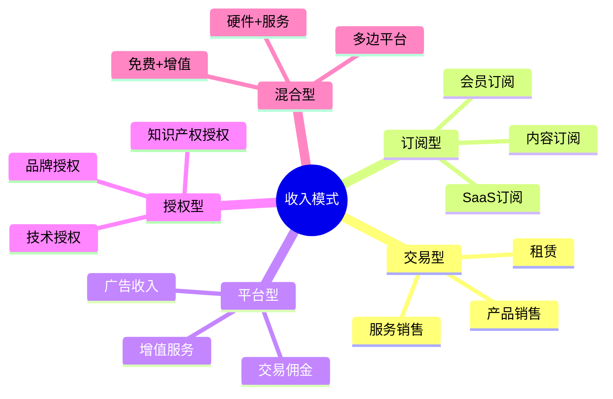

# 收入模式分类 - 企业盈利模式深度解析

## 概述

收入模式（Revenue Model）是企业商业模式的核心组成部分，描述了企业如何从其价值主张中获取收入。理解不同的收入模式对于投资者评估企业的盈利能力、可持续性和增长潜力至关重要。

不同的收入模式具有不同的财务特征、风险特征和增长特征。选择正确的收入模式往往决定了企业的成败。

### 学习目标

完成本文学习后，你将能够：

1. 理解 10+ 种主要收入模式的特点
2. 分析不同收入模式的财务特征
3. 评估收入模式的可持续性和可扩展性
4. 识别企业收入模式的优势和风险
5. 比较不同企业的收入模式差异
6. 将收入模式分析应用于投资决策

### 为什么收入模式重要？

- **盈利能力**：决定企业能否持续盈利
- **现金流**：影响企业现金流特征
- **估值**：不同收入模式有不同估值倍数
- **可扩展性**：决定企业增长潜力
- **风险特征**：影响收入的稳定性和可预测性

## 收入模式分类框架

## 主要收入模式详解

### 1. 产品销售模式（Product Sales）

**定义**：通过销售实物产品获得一次性收入。

**特点**：
- 一次性交易
- 收入确认在交付时
- 需要持续获取新客户
- 库存管理重要

**财务特征**：
- 毛利率：20%-60%（取决于行业）
- 现金流：销售时收款
- 收入波动：可能有季节性
- 客户获取成本：需要持续营销

**典型案例**：

**苹果 iPhone**：
- 收入模式：硬件销售
- 平均售价：$800-$1,200
- 毛利率：38%-42%
- 销售周期：年度新品发布
- 升级周期：2-3 年

**茅台**：
- 收入模式：白酒销售
- 平均售价：1,000-3,000 元/瓶
- 毛利率：90%+
- 销售特点：供不应求，价格持续上涨
- 渠道：经销商 + 直营

**优势**：
- 收入立即实现
- 商业模式简单清晰
- 容易理解和预测

**劣势**：
- 需要持续获客
- 收入波动性大
- 难以建立客户粘性
- 库存风险

### 2. 订阅模式（Subscription）

**定义**：客户定期支付费用以持续使用产品或服务。

**特点**：
- 周期性收入（月度/年度）
- 客户生命周期价值（LTV）高
- 收入可预测性强
- 重视客户留存

**财务特征**：
- 毛利率：60%-90%（软件）
- 现金流：预收款，现金流好
- 收入增长：复合增长
- 关键指标：MRR、ARR、Churn Rate、LTV/CAC

**典型案例**：

**Netflix**：
- 订阅费：$6.99-$19.99/月
- 全球订阅用户：2.3 亿+
- 月度流失率：2-3%
- LTV/CAC：3-4 倍
- 收入可预测性：非常高

**Adobe Creative Cloud**：
- 订阅费：$54.99/月（全套）
- 从永久授权转向订阅
- 转型后收入增长加速
- 客户留存率：95%+
- 现金流大幅改善

**Microsoft 365**：
- 个人版：$6.99/月
- 家庭版：$9.99/月
- 企业版：$5-$35/用户/月
- 订阅用户：6 亿+
- 收入稳定增长

**优势**：
- 收入可预测
- 现金流稳定
- 客户生命周期价值高
- 估值倍数高

**劣势**：
- 初期收入增长慢
- 需要持续提供价值
- 客户流失影响大
- 需要持续投入产品开发

**关键指标**：
- **MRR**（月度经常性收入）：Monthly Recurring Revenue
- **ARR**（年度经常性收入）：Annual Recurring Revenue
- **Churn Rate**（流失率）：客户流失比例
- **LTV**（客户生命周期价值）：Lifetime Value
- **CAC**（客户获取成本）：Customer Acquisition Cost
- **LTV/CAC 比率**：理想值 > 3

### 3. 交易佣金模式（Transaction Fee）

**定义**：作为中介平台，从每笔交易中抽取佣金。

**特点**：
- 按交易量收费
- 轻资产模式
- 网络效应强
- 规模经济显著

**财务特征**：
- 毛利率：70%-95%
- 佣金率：1%-30%（取决于行业）
- 边际成本：接近零
- 现金流：交易时收款

**典型案例**：

**Visa/Mastercard**：
- 佣金率：1.5%-3% 每笔交易
- 交易量：数万亿美元/年
- 毛利率：95%+
- 网络效应：商户和持卡人双边网络
- 护城河：极宽

**淘宝/天猫**：
- 佣金率：0.5%-5%（类目不同）
- 广告收入：关键词竞价
- 增值服务：店铺装修、数据分析
- GMV：8 万亿+ 人民币/年
- 活跃买家：9 亿+

**Airbnb**：
- 房东佣金：3%
- 房客服务费：14%
- 总佣金率：约 17%
- 订单量：数亿间夜/年
- 轻资产：不拥有房产

**美团**：
- 外卖佣金：18%-22%
- 到店佣金：8%-10%
- 交易额：万亿级
- 订单量：数十亿单/年

**优势**：
- 轻资产，可扩展性强
- 边际成本低
- 网络效应带来护城河
- 现金流好

**劣势**：
- 需要达到临界规模
- 双边市场平衡难
- 监管风险
- 竞争激烈

### 4. 广告模式（Advertising）

**定义**：通过向用户展示广告获得收入。

**特点**：
- 用户免费使用
- 广告主付费
- 依赖流量和用户数据
- 规模效应显著

**财务特征**：
- 毛利率：80%-90%
- 收入波动：受经济周期影响
- 关键指标：DAU、MAU、ARPU、广告加载率
- 边际成本：低

**典型案例**：

**Google**：
- 广告收入：$200+ 亿/年
- 广告形式：搜索广告、展示广告、YouTube 广告
- 用户：20 亿+ 搜索用户
- ARPU：$100+/年
- 毛利率：85%+

**Facebook/Meta**：
- 广告收入：$110+ 亿/年
- 用户：30 亿+ MAU
- ARPU：$40+/年
- 广告精准度：基于用户数据
- 广告加载率：持续优化

**字节跳动**：
- 广告收入：数百亿美元/年
- 产品：抖音、今日头条
- 算法推荐：精准广告投放
- 用户时长：极高
- 广告形式：信息流广告

**优势**：
- 用户免费，易获取
- 规模效应显著
- 边际成本低
- 可扩展性强

**劣势**：
- 用户体验与广告平衡
- 隐私监管风险
- 受经济周期影响
- 需要巨大流量

**关键指标**：
- **DAU/MAU**：日活/月活用户
- **ARPU**：Average Revenue Per User
- **广告加载率**：广告展示频率
- **eCPM**：每千次展示收入
- **填充率**：广告请求被填充比例

### 5. 免费增值模式（Freemium）

**定义**：基础功能免费，高级功能付费。

**特点**：
- 免费用户转化为付费用户
- 病毒式传播
- 转化率通常 2%-5%
- 需要大量免费用户

**财务特征**：
- 毛利率：70%-90%
- 转化率：2%-5%
- 免费用户成本：需要控制
- 付费用户 ARPU：较高

**典型案例**：

**Dropbox**：
- 免费：2GB 存储
- 付费：$9.99/月起（2TB）
- 转化率：约 4%
- 用户：7 亿+ 注册用户
- 付费用户：1,700 万+

**Spotify**：
- 免费：有广告
- Premium：$9.99/月，无广告
- 转化率：约 45%（极高）
- 用户：5 亿+ MAU
- 付费用户：2.2 亿+

**LinkedIn**：
- 免费：基础社交功能
- Premium：$29.99-$99.99/月
- 转化率：约 2%
- 用户：9 亿+ 会员
- 付费用户：约 1,800 万

**优势**：
- 用户获取成本低
- 病毒式传播
- 用户可以试用后付费
- 网络效应

**劣势**：
- 需要大量用户才能盈利
- 免费用户成本高
- 转化率优化难
- 免费与付费功能平衡难

### 6. 授权模式（Licensing）

**定义**：授权他人使用知识产权以获得授权费。

**特点**：
- 轻资产
- 高毛利率
- 依赖知识产权保护
- 收入稳定

**财务特征**：
- 毛利率：90%+
- 授权费：固定费用或销售分成
- 现金流：稳定
- 资本支出：低

**典型案例**：

**高通**：
- 专利授权：5G、4G 专利
- 授权费：手机售价的 3%-5%
- 授权收入：数十亿美元/年
- 毛利率：95%+
- 客户：全球手机厂商

**迪士尼**：
- IP 授权：米老鼠、漫威、星球大战
- 授权收入：数十亿美元/年
- 授权产品：玩具、服装、主题公园
- 授权费：销售额的 5%-15%

**ARM**：
- 芯片架构授权
- 授权费：一次性 + 销售分成
- 客户：苹果、高通、三星等
- 市场份额：移动芯片 95%+

**优势**：
- 极高毛利率
- 轻资产
- 可扩展性强
- 收入稳定

**劣势**：
- 依赖知识产权保护
- 法律诉讼风险
- 技术迭代风险
- 客户集中度风险

### 7. 租赁模式（Leasing/Rental）

**定义**：客户支付费用临时使用资产。

**特点**：
- 按使用时间收费
- 资产重复利用
- 需要资产管理
- 现金流稳定

**财务特征**：
- 毛利率：30%-60%
- 资产周转率：关键指标
- 资本支出：高（购买资产）
- 折旧：重要成本

**典型案例**：

**神州租车**：
- 租金：$30-$100/天
- 车队规模：10 万+ 辆
- 资产周转率：70%+
- 平均租期：3-5 天
- 资本密集

**共享单车（美团单车）**：
- 收费：$0.5-$1/30 分钟
- 单车数量：数百万辆
- 日均骑行：数千万次
- 单车成本：$100-$300/辆
- 回本周期：6-12 个月

**优势**：
- 资产重复利用
- 收入稳定
- 客户无需大额投资

**劣势**：
- 资本密集
- 资产折旧和维护成本高
- 资产利用率风险
- 需要规模效应

### 8. 使用量计费模式（Usage-Based）

**定义**：根据客户实际使用量收费。

**特点**：
- 按需付费
- 收入与使用量直接相关
- 客户成本可控
- 收入波动性

**财务特征**：
- 毛利率：60%-90%
- 收入波动：随使用量变化
- 客户粘性：高
- 扩展性：强

**典型案例**：

**AWS（亚马逊云服务）**：
- 计费：按计算、存储、流量使用量
- 定价：$0.01-$1/小时（不同服务）
- 收入：$800+ 亿/年
- 毛利率：25%-30%
- 客户：数百万

**Twilio**：
- 计费：按 API 调用次数
- 定价：$0.0075/短信
- 收入：$30+ 亿/年
- 毛利率：50%+
- 客户：25 万+

**电信运营商**：
- 计费：按通话时长、流量使用
- 套餐：固定套餐 + 超额计费
- 收入：稳定
- 客户粘性：高

**优势**：
- 客户成本可控
- 收入随客户增长而增长
- 客户粘性高
- 公平定价

**劣势**：
- 收入可预测性低
- 客户使用量波动
- 定价复杂
- 需要精确计量

### 9. 数据变现模式（Data Monetization）

**定义**：通过收集、分析和销售数据获得收入。

**特点**：
- 数据是核心资产
- 隐私合规重要
- 规模效应显著
- 边际成本低

**财务特征**：
- 毛利率：80%-95%
- 边际成本：接近零
- 数据价值：随规模增加
- 监管风险：高

**典型案例**：

**彭博终端（Bloomberg Terminal）**：
- 订阅费：$24,000/年/终端
- 用户：35 万+ 终端
- 收入：$100+ 亿/年
- 数据：金融市场实时数据
- 护城河：数据完整性和及时性

**Wind 资讯**：
- 订阅费：数万元/年
- 用户：数十万金融机构
- 数据：中国金融市场数据
- 护城河：数据覆盖和准确性

**优势**：
- 高毛利率
- 可扩展性强
- 数据护城河
- 边际成本低

**劣势**：
- 隐私监管风险
- 数据安全责任
- 需要持续更新数据
- 竞争激烈

### 10. 混合模式（Hybrid）

**定义**：结合多种收入模式。

**特点**：
- 收入来源多元化
- 风险分散
- 复杂度高
- 协同效应

**典型案例**：

**亚马逊**：
- 电商销售：产品销售
- Prime 会员：订阅费
- AWS：使用量计费
- 广告：广告收入
- 第三方卖家：佣金
- 收入多元化：降低风险

**腾讯**：
- 游戏：虚拟物品销售
- 会员：视频、音乐订阅
- 广告：展示广告
- 金融：支付手续费
- 云服务：使用量计费

**苹果**：
- 硬件：iPhone、Mac 销售
- 服务：App Store 佣金、Apple Music 订阅
- 授权：专利授权
- 广告：App Store 搜索广告

**优势**：
- 收入多元化
- 风险分散
- 协同效应
- 客户生命周期价值高

**劣势**：
- 管理复杂
- 资源分散
- 战略聚焦难
- 协同难度大

## 收入模式财务特征对比

| 收入模式 | 毛利率 | 现金流 | 可预测性 | 可扩展性 | 资本需求 |
|---------|--------|--------|----------|----------|----------|
| 产品销售 | 20-60% | 中等 | 低 | 中等 | 中等 |
| 订阅 | 60-90% | 优秀 | 高 | 高 | 低 |
| 交易佣金 | 70-95% | 优秀 | 中等 | 极高 | 低 |
| 广告 | 80-90% | 良好 | 中等 | 高 | 低 |
| 免费增值 | 70-90% | 良好 | 中等 | 高 | 低 |
| 授权 | 90%+ | 优秀 | 高 | 高 | 极低 |
| 租赁 | 30-60% | 稳定 | 中等 | 中等 | 高 |
| 使用量计费 | 60-90% | 良好 | 低 | 高 | 低 |
| 数据变现 | 80-95% | 优秀 | 高 | 高 | 低 |
| 混合 | 变化大 | 良好 | 中高 | 高 | 中等 |

## 投资分析应用

### 评估收入模式质量

**优质收入模式特征**：
1. **高毛利率**：> 60%
2. **可预测性强**：订阅、授权
3. **可扩展性高**：边际成本低
4. **现金流好**：预收款或即时收款
5. **客户粘性高**：高转换成本

### 收入模式风险识别

**风险信号**：
- 单一收入来源占比 > 80%
- 收入波动性大
- 客户集中度高
- 收入确认政策激进
- 应收账款增长快于收入

### 估值影响

不同收入模式的估值倍数：
- **SaaS 订阅**：10-20x ARR
- **交易平台**：5-15x GMV
- **广告模式**：15-30x P/E
- **产品销售**：1-3x P/S
- **授权模式**：20-40x P/E

## 实战案例分析

### 案例：Adobe 从产品销售到订阅

**转型前（2012）**：
- 收入模式：永久授权销售
- 价格：$2,600（Creative Suite）
- 收入：$43 亿
- 增长率：5%
- 现金流：波动大

**转型后（2023）**：
- 收入模式：订阅（Creative Cloud）
- 价格：$54.99/月
- 收入：$180+ 亿
- 增长率：15%+
- 现金流：稳定增长

**转型效果**：
- 收入增长 4 倍
- 毛利率提升至 88%
- 现金流大幅改善
- 市值增长 10 倍+
- 客户留存率 95%+

### 案例：特斯拉的混合收入模式

**收入来源**：
1. **汽车销售**（85%）：
   - Model 3/Y/S/X 销售
   - 毛利率：25%-30%

2. **能源业务**（5%）：
   - 太阳能板、储能系统
   - 毛利率：15%-20%

3. **服务和其他**（10%）：
   - 充电服务
   - 软件升级（FSD）
   - 保险
   - 毛利率：40%+

**未来收入模式演进**：
- FSD 订阅：$99-$199/月
- Robotaxi：按里程收费
- 能源服务：订阅模式
- 软件收入占比提升

## 延伸阅读

### 推荐书籍

1. **《商业模式新生代》** - Alexander Osterwalder
   - 商业模式画布详解
   - 包含收入模式设计

2. **《订阅经济》** - Tien Tzuo
   - 订阅模式深度分析
   - Salesforce、Netflix 案例

3. **《平台革命》** - Geoffrey Parker
   - 平台收入模式
   - 网络效应和定价策略

4. **《免费》** - Chris Anderson
   - 免费增值模式
   - 互联网经济学

5. **《精益数据分析》** - Alistair Croll
   - 不同收入模式的关键指标
   - 数据驱动增长

## 参考文献

1. Osterwalder, A., & Pigneur, Y. (2010). Business Model Generation. Wiley.
2. Tzuo, T., & Weisert, G. (2018). Subscribed. Portfolio.
3. Anderson, C. (2009). Free: The Future of a Radical Price. Hyperion.
4. Parker, G., et al. (2016). Platform Revolution. W. W. Norton & Company.
5. Christensen, C. M., et al. (2016). "Know Your Customers' Jobs to Be Done." Harvard Business Review.

---

**下一步**：学习 [平台型商业模式](platform-business.html)，深入理解双边市场和网络效应的商业逻辑。
6. Osterwalder, A., & Pigneur, Y. (2010). *Business Model Generation*. Wiley.
7. Christensen, C. M. (1997). *The Innovator's Dilemma*. Harvard Business School Press.
8. Parker, G. G., Van Alstyne, M. W., & Choudary, S. P. (2016). *Platform Revolution*. W.W. Norton.

