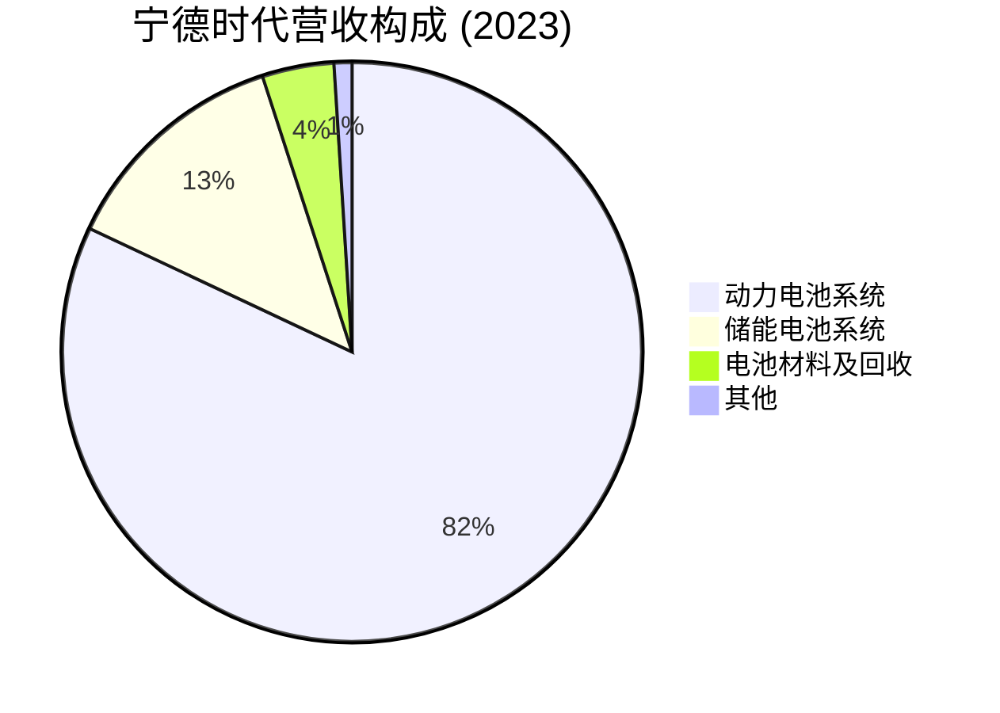
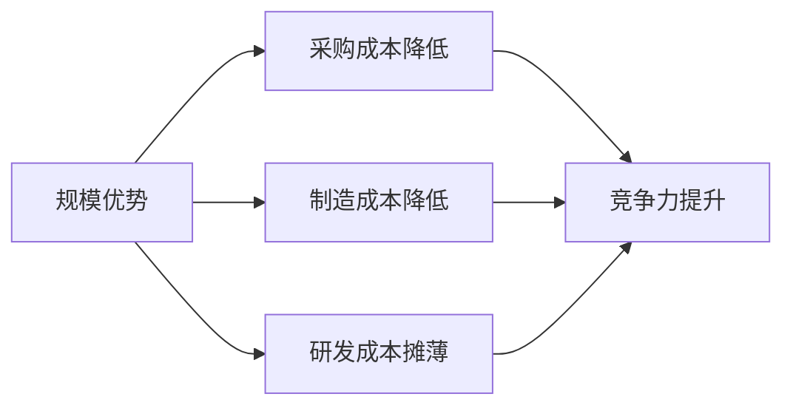

# 宁德时代 - 案例研究

## 公司概况

**基本信息**
- **公司名称**: 宁德时代新能源科技股份有限公司 (Contemporary Amperex Technology Co. Limited, CATL)
- **股票代码**: 300750.SZ (深圳证券交易所创业板)
- **成立时间**: 2011年12月16日
- **总部位置**: 中国福建省宁德市
- **创始人**: 曾毓群 (Robin Zeng)
- **现任董事长**: 曾毓群

**主营业务**
- 动力电池系统 (电动汽车电池)
- 储能电池系统 (电网储能、家庭储能)
- 电池材料 (正极材料、负极材料、电解液、隔膜)
- 电池回收 (废旧电池回收利用)

**市值规模** (截至2024年)
- 市值: ~1.2万亿人民币 (约$1700亿美元)
- 全球动力电池市值第一
- 中国创业板市值第一

**上市信息**
- 上市时间: 2018年6月11日
- 发行价: 25.14元/股
- 创业板成分股

## 商业模式分析

### 价值主张

宁德时代的核心价值主张:

1. **技术领先**
   - 全球领先的电池技术
   - 高能量密度、长续航
   - 快充技术、安全性能
   - 持续的研发创新

2. **规模优势**
   - 全球最大动力电池供应商
   - 产能规模领先
   - 成本控制能力强
   - 供应链整合能力

3. **全球化布局**
   - 服务全球主流车企
   - 海外工厂建设
   - 国际市场份额提升

### 客户细分

**主要客户群体**:
- 新能源车企: 特斯拉、比亚迪、蔚来、理想、小鹏等
- 传统车企: 大众、宝马、奔驰、丰田、本田等
- 储能客户: 电网公司、工商业用户
- 其他客户: 电动工具、电动船舶等

**地理分布** (2023年营收):
- 中国市场: ~70%
- 海外市场: ~30%

### 收入来源

**业务结构**:
- **动力电池系统** (82%): 电动汽车电池
- **储能电池系统** (13%): 电网储能、家庭储能
- **电池材料及回收** (4%): 上游材料、回收业务
- **其他** (1%): 技术服务等

### 核心资源

1. **技术专利**: 15000+项专利，全球领先
2. **生产能力**: 年产能超600GWh
3. **客户资源**: 服务全球主流车企
4. **供应链**: 完整的产业链布局
5. **人才团队**: 20000+研发人员

### 关键活动

1. **研发创新**: 持续的技术研发投入
2. **规模生产**: 大规模制造能力
3. **质量控制**: 严格的质量管理体系
4. **客户服务**: 定制化解决方案
5. **产能扩张**: 全球工厂建设

## 财务分析

### 收入增长

**10年营收趋势** (单位: 亿元人民币)

| 年份 | 营收 | 同比增长 | 净利润 | 净利率 |
|------|------|----------|--------|--------|
| 2015 | 57 | - | 10 | 18% |
| 2018 | 296 | - | 34 | 11% |
| 2019 | 458 | +55% | 46 | 10% |
| 2020 | 503 | +10% | 56 | 11% |
| 2021 | 1304 | +159% | 159 | 12% |
| 2022 | 3286 | +152% | 307 | 9% |
| 2023 | 4009 | +22% | 441 | 11% |

**关键观察**:
- 2015-2023年复合增长率 (CAGR): ~70%
- 2021-2022年爆发式增长 (新能源车渗透率提升)
- 2023年增长放缓但仍保持双位数
- 净利率相对稳定在10%左右

### 盈利能力

**关键盈利指标**:

| 指标 | 2019 | 2020 | 2021 | 2022 | 2023 | 行业平均 |
|------|------|------|------|------|------|----------|
| 毛利率 | 29.1% | 27.8% | 26.3% | 21.2% | 22.8% | 20-25% |
| 营业利润率 | 12.5% | 13.2% | 14.5% | 11.2% | 13.5% | 8-12% |
| 净利率 | 10.0% | 11.1% | 12.2% | 9.3% | 11.0% | 6-10% |
| ROE | 18.5% | 15.2% | 25.6% | 22.8% | 18.5% | 12-18% |
| ROA | 10.2% | 8.5% | 14.2% | 11.5% | 9.2% | 6-10% |

**盈利能力分析**:
1. **毛利率承压** (22%): 
   - 原材料价格波动
   - 竞争加剧
   - 规模效应部分抵消

2. **稳定的净利率** (11%):
   - 成本控制能力强
   - 规模优势显现
   - 技术溢价

3. **优秀的ROE** (18%+):
   - 高增长带来高回报
   - 资本使用效率高

### 现金流

**现金流表现** (单位: 亿元人民币):

| 财年 | 经营现金流 | 资本支出 | 自由现金流 | FCF利润率 |
|------|------------|----------|------------|-----------|
| 2019 | 98 | -68 | 30 | 7% |
| 2020 | 188 | -95 | 93 | 18% |
| 2021 | 295 | -185 | 110 | 8% |
| 2022 | 512 | -425 | 87 | 3% |
| 2023 | 685 | -520 | 165 | 4% |

**现金流特点**:
- 经营现金流强劲增长
- 资本支出巨大 (产能扩张)
- FCF利润率较低 (重资产特征)
- 需要持续融资支持扩张

## 竞争分析

### 行业地位

**全球动力电池市场** (市场份额, 2023):
- 宁德时代: ~37%
- LG新能源: ~14%
- 比亚迪: ~16%
- 松下: ~7%
- 三星SDI: ~5%
- 其他: ~21%

**关键观察**:
- 宁德时代全球市场份额第一
- 中国市场占据主导地位 (~50%)
- 海外市场份额持续提升

### 竞争优势 (护城河分析)

#### 1. 技术领先护城河 (★★★★☆)

**技术优势**:
- 能量密度: 行业领先水平
- 快充技术: 15分钟充电80%
- 安全性能: 通过针刺试验
- 循环寿命: 超过2000次

**研发投入**:
- 年研发投入超150亿
- 研发人员20000+
- 专利数量15000+

#### 2. 规模优势护城河 (★★★★★)

**规模效应**:
- 年产能超600GWh
- 全球最大动力电池供应商
- 采购规模带来成本优势
- 规模经济显著

**成本优势**:

#### 3. 客户资源护城河 (★★★★☆)

**客户优势**:
- 服务全球主流车企
- 与特斯拉、宝马等深度合作
- 客户粘性强
- 转换成本高

**客户关系**:
- 长期供货协议
- 定制化解决方案
- 技术协同开发
- 战略合作伙伴

#### 4. 产业链整合护城河 (★★★★☆)

**产业链布局**:
- 上游: 矿产资源、材料
- 中游: 电池制造
- 下游: 电池回收

**整合优势**:
- 供应链安全
- 成本控制
- 技术协同
- 循环经济

### 主要竞争对手

#### 比亚迪
- **优势**: 垂直整合, 自产自用, 成本控制强
- **劣势**: 外供规模小, 技术路线单一
- **竞争领域**: 中国动力电池市场

#### LG新能源
- **优势**: 技术实力强, 国际化程度高
- **劣势**: 成本高, 中国市场份额小
- **竞争领域**: 海外高端市场

#### 松下
- **优势**: 与特斯拉深度合作, 技术成熟
- **劣势**: 产能扩张慢, 市场份额下降
- **竞争领域**: 高端电动车市场

## 投资论点

### 看多理由 (Bull Case)

#### 1. 新能源车渗透率提升 (★★★★★)
- 全球新能源车渗透率持续提升
- 2023年渗透率~18%, 目标2030年50%+
- 动力电池需求持续增长
- 行业长期增长确定性强

#### 2. 技术和规模双重领先 (★★★★★)
- 技术领先优势明显
- 规模优势带来成本竞争力
- 双重护城河难以撼动

#### 3. 储能业务增长潜力 (★★★★☆)
- 储能市场快速增长
- 2023年储能营收占比13%
- 未来占比有望提升至20%+
- 新的增长引擎

#### 4. 全球化扩张 (★★★★☆)
- 海外工厂建设加速
- 欧洲、北美市场份额提升
- 服务全球主流车企
- 国际化空间大

#### 5. 产业链整合价值 (★★★☆☆)
- 上游矿产资源布局
- 电池回收业务
- 循环经济模式
- 增强供应链安全

### 风险因素 (Bear Case)

#### 1. 竞争加剧 (★★★★☆)
- 比亚迪外供规模扩大
- LG、松下等国际巨头竞争
- 新进入者增多
- 价格战风险

#### 2. 原材料价格波动 (★★★★☆)
- 锂、钴、镍等原材料价格波动
- 成本传导能力有限
- 毛利率承压
- 盈利波动性增加

#### 3. 技术路线风险 (★★★☆☆)
- 固态电池等新技术
- 技术迭代风险
- 需要持续研发投入
- 技术领先优势可能被削弱

#### 4. 资本支出压力 (★★★☆☆)
- 产能扩张需要巨额投资
- 自由现金流为负
- 融资压力大
- 财务杠杆提升

#### 5. 估值风险 (★★★☆☆)
- 当前估值处于历史中高位
- PE 30-40倍
- 增长放缓可能导致估值回调

### 估值分析

**当前估值** (2024年初):
- P/E: ~35x
- P/S: ~3.5x
- P/B: ~6x

**历史估值**:
- 历史平均P/E: 45x
- 当前估值略低于历史平均
- 反映市场对增长放缓的担忧

**投资评级**: **持有** (Hold)

**目标价**: 180-220元 (基于2024年初200元)

**理由**:
- ✅ 行业长期增长确定性强
- ✅ 技术和规模双重领先
- ✅ 储能业务增长潜力
- ⚠️ 竞争加剧，毛利率承压
- ⚠️ 估值不便宜
- ⚠️ 资本支出压力大

## 历史表现

### 股价走势

**长期表现**:
- 2018年上市: 25.14元
- 2020年: 200元
- 2021年: 690元 (历史高点)
- 2022年: 400元 (回调)
- 2024年: 200元

**累计回报**:
- 上市至今 (6年): +700%
- 过去5年: +300%
- 过去3年: -40%

**年化回报率**:
- 6年: ~40% CAGR
- 5年: ~32% CAGR

### 与指数对比

**相对表现**:
- 2018-2021: 大幅跑赢创业板指数
- 2021-2023: 跑输大盘 (估值回调)
- 长期仍是优秀成长股

## 关键学习点

### 1. 新能源革命的投资机会

**核心洞察**: 宁德时代是新能源革命的最大受益者。

**新能源趋势**:
- 全球碳中和目标
- 新能源车渗透率提升
- 储能市场爆发
- 产业链投资机会

**投资启示**: 
- 关注产业趋势性机会
- 选择产业链核心环节
- 长期增长确定性

### 2. 技术领先的价值

**核心洞察**: 技术领先是核心竞争力。

**技术优势**:
- 能量密度、安全性、成本
- 持续研发投入
- 专利壁垒
- 技术迭代能力

**投资启示**:
- 技术是制造业的护城河
- 关注研发投入和专利
- 技术领先带来溢价

### 3. 规模效应的重要性

**核心洞察**: 规模是制造业的核心竞争力。

**规模优势**:
- 成本优势
- 采购议价能力
- 研发成本摊薄
- 客户资源

**投资启示**:
- 制造业关注规模
- 规模带来成本优势
- 赢家通吃效应

### 4. 重资产业务的特点

**核心洞察**: 动力电池是重资产业务。

**重资产特征**:
- 资本支出巨大
- 自由现金流为负
- 需要持续融资
- 财务杠杆高

**投资启示**:
- 重资产业务需要关注资本支出
- 现金流管理重要
- 融资能力是关键

### 5. 产业链整合的价值

**核心洞察**: 宁德时代布局全产业链。

**产业链布局**:
- 上游矿产资源
- 中游电池制造
- 下游电池回收
- 循环经济

**投资启示**:
- 产业链整合增强竞争力
- 供应链安全重要
- 循环经济是趋势

### 6. 全球化的机遇与挑战

**核心洞察**: 宁德时代积极拓展海外市场。

**全球化进程**:
- 欧洲、北美建厂
- 服务全球车企
- 海外份额提升
- 地缘政治风险

**投资启示**:
- 全球化是成长空间
- 关注地缘政治风险
- 本土化能力重要

### 7. 成长股的估值挑战

**核心洞察**: 高成长股面临估值波动。

**估值特点**:
- 高增长支撑高估值
- 增长放缓导致估值回调
- 估值波动性大
- 需要动态评估

**投资启示**:
- 成长股估值波动大
- 关注增长可持续性
- 估值与增长匹配

### 8. 中国制造的崛起

**核心洞察**: 宁德时代代表中国制造的崛起。

**中国制造优势**:
- 完整产业链
- 工程师红利
- 规模优势
- 成本竞争力

**投资启示**:
- 中国制造具有全球竞争力
- 关注产业链优势
- 制造业投资机会

## 延伸阅读

### 推荐书籍

1. **《新能源汽车产业链投资指南》** - 中信证券
   - 新能源车产业链分析
   - 动力电池行业研究

2. **《锂电池技术与应用》** - 陈立泉
   - 锂电池技术原理
   - 行业发展趋势

3. **《中国制造2025》** - 国务院
   - 中国制造业战略
   - 新能源产业政策

### 相关案例

- [贵州茅台 - 品牌护城河](./moutai.html)
- [腾讯控股 - 平台生态](./tencent.html)
- [特斯拉 - 电动车革命](../../../05-global-perspective/us-market/consumer/discretionary/tesla.html)
- [比亚迪 - 垂直整合](../../../05-global-perspective/china-market/new-energy/ev-makers/byd.html)
- [新能源行业分析](../../../05-global-perspective/china-market/new-energy/index.html)

## 参考文献

1. 宁德时代新能源科技股份有限公司年度报告 (2018-2023)
2. 宁德时代新能源科技股份有限公司招股说明书 (2018)
3. 中国汽车动力电池产业创新联盟. 《动力电池月度数据》(2023)
4. 中金公司. 《宁德时代深度报告》(2023)
5. 中信证券. 《动力电池行业深度分析》(2023)
6. 国泰君安. 《宁德时代竞争力研究》(2023)
7. 华泰证券. 《新能源车产业链投资机会》(2023)
8. 招商证券. 《宁德时代估值分析》(2023)
9. 申万宏源. 《储能市场前景研究》(2023)
10. 兴业证券. 《动力电池技术路线分析》(2023)
11. SNE Research. 《Global EV Battery Market Report》(2023)
12. Bloomberg NEF. 《Battery Price Survey》(2023)
13. IEA. 《Global EV Outlook》(2023)
14. Wood Mackenzie. 《Battery Supply Chain Analysis》(2023)
15. Benchmark Mineral Intelligence. 《Lithium Market Report》(2023)

---

**最后更新**: 2024年1月16日  
**下次审查**: 2024年7月16日  
**数据截止**: 2023财年 (2023年12月31日)

**免责声明**: 本案例研究仅供教育和学习目的，不构成投资建议。投资决策应基于个人研究和专业咨询。
