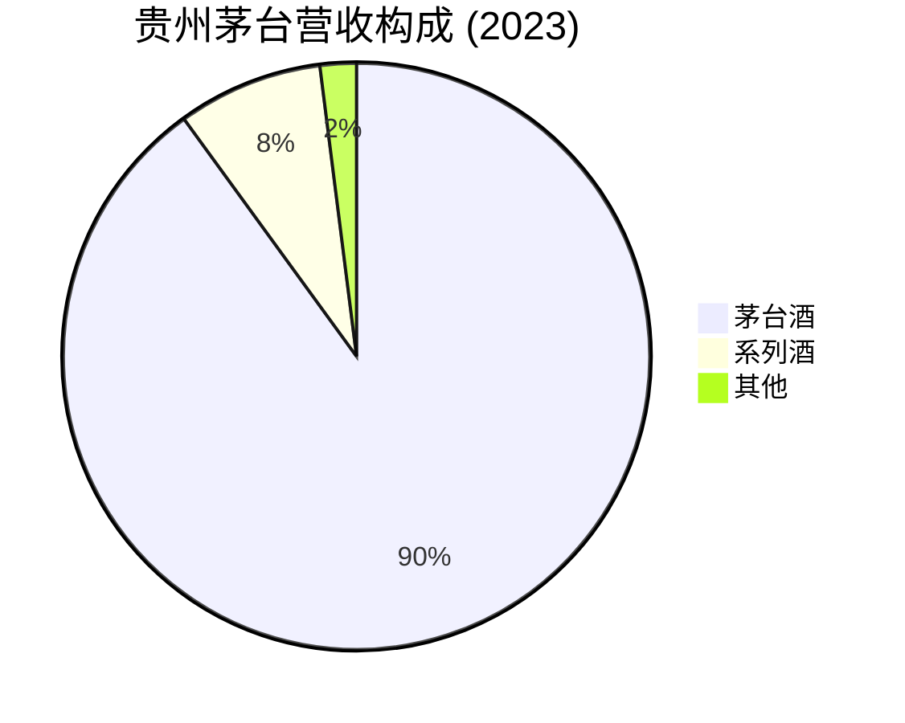
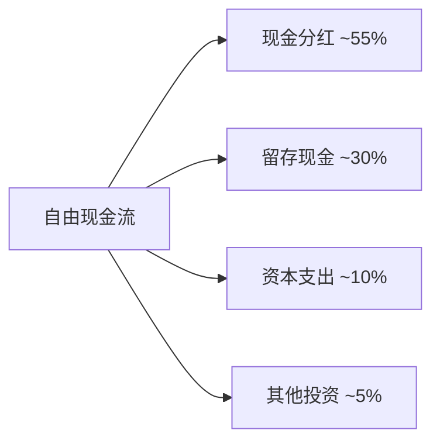
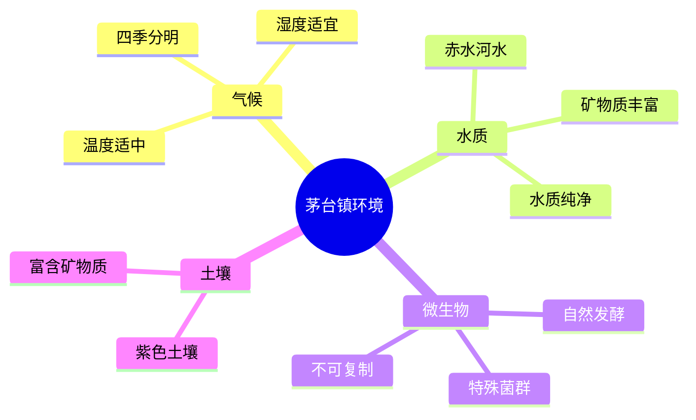

# 贵州茅台 - 案例研究

## 公司概况

**基本信息**
- **公司名称**: 贵州茅台酒股份有限公司 (Kweichow Moutai Co., Ltd.)
- **股票代码**: 600519.SH (上海证券交易所)
- **成立时间**: 1999年11月20日 (改制上市)
- **总部位置**: 中国贵州省遵义市仁怀市茅台镇
- **历史渊源**: 茅台酒生产历史可追溯至1704年
- **现任董事长**: 丁雄军 (2021年至今)

**主营业务**
- 茅台酒系列 (飞天茅台、五星茅台、年份酒等)
- 系列酒 (茅台王子酒、茅台迎宾酒、汉酱酒等)
- 其他业务 (茅台葡萄酒、保健酒等)

**市值规模** (截至2024年)
- 市值: ~2.5万亿人民币 (约$3500亿美元)
- 中国A股市值第一
- 全球酒类公司市值第一

**上市信息**
- 上市时间: 2001年8月27日
- 发行价: 31.39元/股
- 连续分红: 23年
- 累计分红: 超过3000亿元

## 商业模式分析

### 价值主张

贵州茅台的核心价值主张:

1. **国酒地位与文化象征**
   - "国酒茅台"的历史地位
   - 中国白酒文化的代表
   - 国宴用酒、外交礼品
   - 身份和地位的象征

2. **稀缺性与收藏价值**
   - 产能受限 (地理、工艺、时间)
   - 越陈越香，具有收藏价值
   - 供不应求的市场状态
   - 保值增值属性

3. **卓越品质保证**
   - 独特的酿造工艺 (12987工艺)
   - 不可复制的地理环境
   - 严格的质量控制
   - 300+年品牌历史

### 客户细分

**主要客户群体**:
- 高端商务人士 (核心消费群)
- 政府机关和国企 (公务消费)
- 收藏投资者 (投资需求)
- 送礼需求 (社交礼品)
- 宴请场合 (婚宴、寿宴等)

**消费特征**:
- 价格不敏感
- 品牌忠诚度极高
- 重复购买率高
- 口碑传播强

### 收入来源



**产品结构**:
- **茅台酒** (90%营收): 飞天茅台、五星茅台、年份酒
- **系列酒** (8%营收): 茅台王子酒、茅台迎宾酒
- **其他** (2%营收): 茅台葡萄酒、保健酒

**定价策略**:
- 官方指导价: 1499元/瓶 (53度飞天茅台)
- 市场价格: 2500-3000元/瓶
- 年份酒: 数千至数万元/瓶
- 持续提价能力强

### 成本结构

**主要成本项**:
- **原材料成本** (~15% 营收): 高粱、小麦
- **生产成本** (~10% 营收): 人工、能源、包装
- **销售费用** (~5% 营收): 渠道费用、市场推广
- **管理费用** (~3% 营收): 行政管理

**成本优势**:
- 原材料成本占比极低
- 规模效应显著
- 品牌溢价能力强
- 毛利率超过90%

### 核心资源

1. **独特地理环境**: 茅台镇特殊的气候、水质、微生物环境
2. **酿造工艺**: 12987工艺 (1年生产周期、2次投料、9次蒸煮、8次发酵、7次取酒)
3. **品牌资产**: 300+年历史，"国酒"地位
4. **基酒储备**: 数万吨优质基酒库存
5. **渠道网络**: 覆盖全国的经销商体系

### 关键活动

1. **酿造生产**: 严格遵循传统工艺，5年生产周期
2. **品质控制**: 多层次质量检验体系
3. **品牌建设**: 文化营销、高端定位
4. **渠道管理**: 经销商管理、直营店拓展
5. **价格管理**: 控制市场价格稳定

### 关键合作伙伴

**经销商体系**:
- 一级经销商: 约2000家
- 二级经销商: 数万家
- 直营店: 茅台专卖店、1935体验店

**供应商**:
- 高粱供应商 (贵州本地)
- 包装材料供应商
- 物流服务商

**战略合作**:
- 电商平台 (天猫、京东)
- 金融机构 (茅台金融)
- 文化机构 (茅台学院)

## 财务分析

### 收入增长

**20年营收趋势** (单位: 亿元人民币)

| 年份 | 营收 | 同比增长 | 净利润 | 净利率 |
|------|------|----------|--------|--------|
| 2003 | 29 | - | 8 | 28% |
| 2008 | 99 | - | 49 | 49% |
| 2013 | 310 | - | 152 | 49% |
| 2018 | 772 | +26% | 352 | 46% |
| 2019 | 889 | +15% | 412 | 46% |
| 2020 | 949 | +7% | 467 | 49% |
| 2021 | 1094 | +15% | 525 | 48% |
| 2022 | 1241 | +13% | 627 | 51% |
| 2023 | 1506 | +21% | 747 | 50% |

**关键观察**:
- 2003-2023年复合增长率 (CAGR): ~21%
- 净利率长期维持在45-50%
- 增长稳定，抗周期性强
- 2023年营收突破1500亿

### 盈利能力

**关键盈利指标**:

| 指标 | 2019 | 2020 | 2021 | 2022 | 2023 | 行业平均 |
|------|------|------|------|------|------|----------|
| 毛利率 | 91.3% | 91.4% | 91.8% | 92.0% | 92.6% | 70-75% |
| 营业利润率 | 51.2% | 53.8% | 52.9% | 54.5% | 54.2% | 25-30% |
| 净利率 | 46.3% | 49.2% | 48.0% | 50.5% | 49.6% | 20-25% |
| ROE | 33.8% | 30.6% | 29.1% | 32.5% | 34.2% | 15-20% |
| ROA | 26.5% | 24.1% | 23.2% | 26.1% | 27.8% | 10-15% |
| ROIC | 35.2% | 32.8% | 31.5% | 34.8% | 36.5% | 15-20% |

**盈利能力分析**:
1. **超高毛利率** (92%+): 
   - 品牌溢价能力极强
   - 原材料成本占比极低
   - 全球最赚钱的消费品公司之一

2. **稳定的ROE** (30%+):
   - 高利润率 × 低杠杆
   - 长期维持在30%以上
   - 股东回报优异

3. **卓越的ROIC** (35%+):
   - 资本使用效率极高
   - 轻资产运营模式
   - 持续创造股东价值

### 现金流

**现金流表现** (单位: 亿元人民币):

| 财年 | 经营现金流 | 资本支出 | 自由现金流 | FCF利润率 |
|------|------------|----------|------------|-----------|
| 2019 | 568 | -22 | 546 | 61% |
| 2020 | 595 | -25 | 570 | 60% |
| 2021 | 672 | -28 | 644 | 59% |
| 2022 | 780 | -32 | 748 | 60% |
| 2023 | 920 | -38 | 882 | 59% |

**现金流特点**:
- **强劲的现金生成**: FCF利润率60%
- **极低资本支出**: CapEx仅占营收2-3%
- **高分红能力**: 分红率50-60%
- **现金储备充足**: 账上现金超2000亿

**资本配置策略**:


### 财务健康

**资产负债表** (2023财年, 单位: 亿元人民币):

**资产**:
- 流动资产: 2800亿 (现金2100亿, 存货400亿, 应收账款50亿)
- 非流动资产: 1200亿 (固定资产600亿, 在建工程200亿, 其他400亿)
- 总资产: 4000亿

**负债**:
- 流动负债: 1500亿 (预收款项1200亿, 应付账款150亿, 其他150亿)
- 非流动负债: 300亿
- 总负债: 1800亿

**股东权益**: 2200亿

**财务比率**:
- 流动比率: 1.87
- 速动比率: 1.60
- 资产负债率: 45%
- 无有息负债

**财务健康评估**:
- ✅ 现金流极其强劲
- ✅ 零有息负债，财务极其稳健
- ✅ 预收款项高 (反映需求旺盛)
- ✅ 存货为优质基酒 (价值持续增长)

## 竞争分析

### 行业地位

**中国白酒市场** (市场份额, 2023):
- 贵州茅台: ~25% (高端市场)
- 五粮液: ~15%
- 泸州老窖: ~8%
- 洋河股份: ~7%
- 其他: ~45%

**关键观察**:
- 茅台在高端白酒市场占据绝对主导地位
- 品牌价值远超竞争对手
- 市值是第二名的3-4倍

### 竞争优势 (护城河分析)

#### 1. 品牌护城河 (★★★★★)

**品牌价值**:
- 中国最有价值品牌之一 (价值超5000亿)
- "国酒"地位深入人心
- 品牌认知度和美誉度极高
- 文化象征意义

**品牌特质**:
- 300+年历史积淀
- 国宴用酒、外交礼品
- 身份和地位的象征
- 收藏和投资价值

**品牌护城河表现**:
- 定价权极强 (持续提价)
- 供不应求的市场状态
- 品牌忠诚度极高
- 新产品推出成功率高

#### 2. 地理护城河 (★★★★★)

**独特地理环境**:
- 茅台镇特殊的气候条件
- 赤水河独特的水质
- 特定的微生物环境
- 不可复制的自然条件

**地理优势**:


**竞争壁垒**:
- 离开茅台镇无法酿造同样品质的酒
- 地理标志产品保护
- 产能受地理环境限制
- 竞争对手无法复制

#### 3. 工艺护城河 (★★★★★)

**12987酿造工艺**:
- 1年生产周期
- 2次投料
- 9次蒸煮
- 8次发酵
- 7次取酒
- 5年窖藏

**工艺特点**:
- 传承300+年
- 纯手工酿造
- 时间成本极高
- 难以工业化复制

**竞争壁垒**:
- 学习曲线陡峭
- 时间投入巨大
- 技艺传承困难
- 质量难以保证

#### 4. 稀缺性护城河 (★★★★★)

**供给限制**:
- 产能受地理环境限制
- 生产周期长 (5年)
- 产量增长缓慢
- 供不应求状态

**需求旺盛**:
- 高端消费升级
- 收藏投资需求
- 送礼社交需求
- 品牌效应强化

**稀缺性表现**:
- 市场价格远超官方指导价
- 一瓶难求
- 黄牛倒卖现象
- 保值增值属性

### 主要竞争对手

#### 五粮液
- **优势**: 品牌历史悠久, 产品线丰富, 产能较大
- **劣势**: 品牌力弱于茅台, 定价权不足
- **竞争领域**: 高端白酒市场

#### 泸州老窖
- **优势**: 历史悠久, 国窖1573品牌力强
- **劣势**: 市场份额小, 品牌影响力有限
- **竞争领域**: 高端白酒市场

#### 洋河股份
- **优势**: 绵柔型白酒创新, 渠道能力强
- **劣势**: 高端市场竞争力不足
- **竞争领域**: 中高端白酒市场

### 竞争策略

**茅台的差异化策略**:
1. **品牌至上**: 持续强化"国酒"地位
2. **稀缺性**: 控制产量，维持供不应求
3. **高端定位**: 坚守高端市场
4. **文化营销**: 强调历史和文化价值
5. **渠道优化**: 直营+经销商双轨制

**竞争优势持续性**: ★★★★★
- 品牌、地理、工艺三重护城河
- 300+年历史积淀
- 不可复制的竞争优势

## 投资论点

### 看多理由 (Bull Case)

#### 1. 无可替代的品牌护城河 (★★★★★)

**品牌优势**:
- 中国最强消费品牌
- "国酒"地位无可撼动
- 文化象征意义深远

**投资价值**: 品牌护城河支撑长期定价权

#### 2. 消费升级长期趋势 (★★★★☆)

**增长机会**:
- 中国中产阶级持续扩大
- 高端消费需求增长
- 商务消费恢复
- 收藏投资需求旺盛

**财务影响**: 量价齐升，营收持续增长

#### 3. 稀缺性价值 (★★★★★)

**供需失衡**:
- 产能增长缓慢 (年增长5-8%)
- 需求持续旺盛
- 供不应求状态长期存在

**投资价值**: 稀缺性支撑价格上涨

#### 4. 卓越的财务表现 (★★★★★)

**财务特点**:
- 毛利率92%+
- ROE 30%+
- 自由现金流充沛
- 零有息负债

**投资价值**: 优异的股东回报

#### 5. 持续分红能力 (★★★★☆)

**分红特点**:
- 分红率50-60%
- 股息率2-3%
- 连续23年分红
- 累计分红超3000亿

**投资价值**: 为投资者提供稳定现金流

### 风险因素 (Bear Case)

#### 1. 政策风险 (★★★★☆)

**挑战**:
- 反腐政策影响公务消费
- 限制三公消费
- 行业监管政策变化

**影响**: 需求可能受到抑制

#### 2. 估值风险 (★★★☆☆)

**挑战**:
- 当前估值处于历史高位
- PE 40-50倍
- 市值超2.5万亿

**影响**: 估值回调风险

#### 3. 增长放缓 (★★★☆☆)

**挑战**:
- 产能增长有限
- 高基数效应
- 市场渗透率提升空间有限

**影响**: 营收增长可能放缓至个位数

#### 4. 竞争加剧 (★★☆☆☆)

**挑战**:
- 五粮液等竞品追赶
- 新兴白酒品牌崛起
- 洋酒市场份额提升

**影响**: 市场份额可能受到挤压

#### 5. 消费习惯变化 (★★☆☆☆)

**挑战**:
- 年轻一代饮酒习惯改变
- 健康意识提升
- 白酒消费量下降

**影响**: 长期需求可能受影响

### 估值分析

#### DCF估值

**假设**:
- 营收增长率: 2024-2028年 12-15%, 2029-2033年 8-10%
- 自由现金流利润率: 58%
- WACC: 8%
- 永续增长率: 3%

**计算**:
```
未来5年FCF现值: 4500亿
未来5年后FCF现值: 5000亿
终值现值: 18000亿
企业价值: 27500亿
减: 净现金 -2000亿
股权价值: 29500亿
当前市值: 25000亿
```

**结论**: 当前估值略低于DCF合理值

#### 相对估值

**可比公司** (2024年初):

| 公司 | P/E | P/S | 股息率 | 营收增长 | 净利率 |
|------|-----|-----|--------|----------|--------|
| 贵州茅台 | 45x | 16x | 2.2% | 15% | 50% |
| 五粮液 | 28x | 8x | 2.5% | 10% | 35% |
| 泸州老窖 | 32x | 10x | 2.0% | 12% | 38% |
| 洋河股份 | 22x | 6x | 3.0% | 8% | 28% |

**观察**:
- 茅台P/E和P/S显著高于同行
- 反映市场对其品牌和增长的认可
- 估值溢价合理

#### 历史估值

**P/E历史区间**:
- 历史最低: 15x (2014年反腐高峰)
- 历史最高: 60x (2021年)
- 历史平均: 35x
- 当前: 45x (75th百分位)

**估值驱动因素**:
- 2012-2014: 反腐政策，估值压缩
- 2015-2019: 消费升级，估值修复
- 2020-2021: 疫情后复苏，估值高峰
- 2022-2024: 估值回调后企稳

### 投资建议

**目标价区间**: 1900-2200元 (基于2024年初1800元价格)

**情景分析**:

| 情景 | 概率 | 目标价 | 回报率 | 关键假设 |
|------|------|--------|--------|----------|
| 乐观 | 30% | 2400元 | +33% | 消费强劲复苏, 产能扩张加速 |
| 基准 | 50% | 2000元 | +11% | 稳定增长, 估值维持 |
| 悲观 | 20% | 1500元 | -17% | 消费疲软, 估值回调 |

**期望回报**: (30%×33%) + (50%×11%) + (20%×-17%) = +12.4%

**投资评级**: **买入** (Buy)

**理由**:
- ✅ 无可替代的品牌护城河
- ✅ 卓越的财务表现
- ✅ 稳定的现金流和分红
- ✅ 消费升级长期趋势
- ⚠️ 估值处于历史高位
- ⚠️ 短期增长可能放缓

**适合投资者**:
- 价值投资者 (长期持有)
- 收益型投资者 (稳定分红)
- 对中国消费升级有信心的投资者

**不适合投资者**:
- 短期交易者 (波动性低)
- 对估值敏感的投资者
- 寻求高增长的投资者

## 历史表现

### 股价走势

**长期表现** (复权后股价):
- 2001年上市: 31.39元
- 2008年: 120元
- 2012年: 180元 (反腐前高点)
- 2014年: 120元 (反腐低点)
- 2018年: 700元
- 2021年: 2600元 (历史高点)
- 2024年: 1800元

**累计回报**:
- 上市至今 (23年): +5700%
- 过去20年: +15000%
- 过去10年: +600%
- 过去5年: +120%

**年化回报率**:
- 23年: ~19% CAGR
- 20年: ~27% CAGR
- 10年: ~21% CAGR
- 5年: ~17% CAGR

### 与指数对比

**相对表现** (过去20年):

| 期间 | 茅台 | 沪深300 | 超额回报 |
|------|------|---------|----------|
| 2004-2024 | +15000% | +200% | +14800% |
| 2014-2024 | +600% | +30% | +570% |

**观察**:
- 长期大幅跑赢大盘
- 中国A股最佳长期投资标的之一
- "茅台信仰"的由来

### 股息历史

**股息政策**:
- 2001年开始派息
- 连续23年分红
- 累计分红超3000亿元

**股息增长**:
- 2010年: 3.27元/股/年
- 2015年: 6.11元/股/年
- 2020年: 17.06元/股/年
- 2023年: 30.94元/股/年

**股息率**: 2.2% (基于当前股价)

## 关键学习点

### 1. 品牌护城河的极致体现

**核心洞察**: 茅台展示了品牌护城河的最高境界。

**关键要素**:
- **历史积淀**: 300+年品牌建设
- **文化象征**: 超越产品的文化价值
- **稀缺性**: 供不应求强化品牌价值
- **定价权**: 持续提价能力

**投资启示**: 
- 品牌是最强大的护城河
- 文化价值难以复制
- 稀缺性增强品牌力

### 2. 地理护城河的不可复制性

**核心洞察**: 茅台镇的地理环境是真正的护城河。

**茅台的地理优势**:
- 特殊的气候、水质、微生物
- 离开茅台镇无法复制
- 产能受地理限制
- 竞争对手无法进入

**投资启示**:
- 地理护城河极其稳固
- 自然资源优势难以复制
- 产能限制创造稀缺性

### 3. 超高盈利能力的价值

**核心洞察**: 茅台的盈利能力是全球消费品公司的标杆。

**财务特点**:
- 毛利率92%+
- 净利率50%
- ROE 30%+
- 自由现金流充沛

**投资启示**:
- 寻找高盈利能力的公司
- 关注现金流而非账面利润
- 高ROE公司长期回报优异

### 4. 稀缺性的投资价值

**核心洞察**: 供不应求创造持续的价值增长。

**茅台的稀缺性**:
- 产能增长缓慢
- 需求持续旺盛
- 市场价格远超官方价
- 保值增值属性

**投资启示**:
- 稀缺性是重要的投资主题
- 供需失衡支撑价格上涨
- 关注产能限制的行业

### 5. 中国消费升级的受益者

**核心洞察**: 茅台是中国消费升级的最大受益者。

**消费升级趋势**:
- 中产阶级扩大
- 高端消费需求增长
- 品牌意识提升
- 品质消费升级

**投资启示**:
- 关注消费升级主题
- 高端品牌受益最大
- 中国市场潜力巨大

### 6. 长期持有的复利效应

**核心洞察**: 茅台是中国最佳长期投资标的之一。

**长期持有的回报**:
- 23年年化回报19%
- 远超大盘和通胀
- 股息持续增长
- 复利效应显著

**投资启示**:
- 找到优秀公司后长期持有
- 时间是优秀公司的朋友
- 复利创造惊人财富

### 7. 估值与价值的平衡

**核心洞察**: 即使是优秀公司，也要关注估值。

**茅台的估值挑战**:
- 估值处于历史高位
- PE 40-50倍
- 增长放缓风险

**投资启示**:
- 优秀公司也要合理价格买入
- 估值过高会影响未来回报
- 关注安全边际

### 8. 中国特色的投资机会

**核心洞察**: 茅台体现了中国特色的投资价值。

**中国特色**:
- 白酒文化深厚
- 社交礼品需求
- 收藏投资属性
- 国企背景

**投资启示**:
- 理解本土文化和消费习惯
- 关注中国特色的投资机会
- 文化认同创造投资价值

## 延伸阅读

### 推荐书籍

1. **《茅台传》** - 张思民
   - 茅台300+年历史
   - 品牌建设和发展历程

2. **《中国白酒产业发展报告》** - 中国酒业协会
   - 白酒行业分析
   - 市场趋势和竞争格局

3. **《价值投资在中国》** - 李驰
   - 茅台投资案例分析
   - 中国价值投资实践

4. **《投资中最简单的事》** - 邱国鹭
   - 消费品投资逻辑
   - 茅台作为经典案例

### 推荐文章

1. **贵州茅台年报和定期报告**
   - 最权威的财务和业务信息
   - 链接: [上交所信息披露](http://www.sse.com.cn)

2. **《茅台的护城河》** - 雪球网
   - 深度分析茅台的竞争优势
   - 投资者讨论和分析

3. **《白酒行业深度报告》** - 各大券商研报
   - 行业分析和公司对比
   - 投资建议和估值分析

### 相关案例

- [腾讯控股 - 互联网巨头](./tencent.html)
- [宁德时代 - 新能源龙头](./catl.html)
- [Coca-Cola - 全球品牌标杆](../consumer-brands/coca-cola.html)
- [经济护城河分析](../../competitive-analysis/economic-moats.html)
- [中国市场分析](../../../05-global-perspective/china-market/index.html)

## 参考文献

1. 贵州茅台酒股份有限公司年度报告 (2001-2023)
2. 贵州茅台酒股份有限公司招股说明书 (2001)
3. 中国酒业协会. 《中国白酒产业发展报告》(2023)
4. 张思民. 《茅台传》. 中信出版社 (2018)
5. 李驰. 《白金分析师》. 中国经济出版社 (2015)
6. 邱国鹭. 《投资中最简单的事》. 中国人民大学出版社 (2014)
7. 中金公司. 《贵州茅台深度报告》(2023)
8. 国泰君安. 《白酒行业深度分析》(2023)
9. 招商证券. 《茅台的护城河研究》(2022)
10. 申万宏源. 《高端白酒竞争格局分析》(2023)
11. 华泰证券. 《茅台估值分析》(2023)
12. 中信证券. 《消费升级与白酒投资》(2022)
13. 国信证券. 《茅台渠道变革研究》(2023)
14. 兴业证券. 《白酒行业供需分析》(2023)
15. 东方证券. 《茅台长期投资价值》(2022)

---

**最后更新**: 2024年1月16日  
**下次审查**: 2024年7月16日  
**数据截止**: 2023财年 (2023年12月31日)

**免责声明**: 本案例研究仅供教育和学习目的，不构成投资建议。投资决策应基于个人研究和专业咨询。
