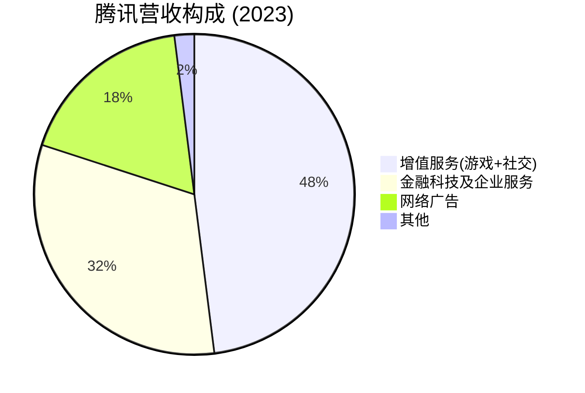
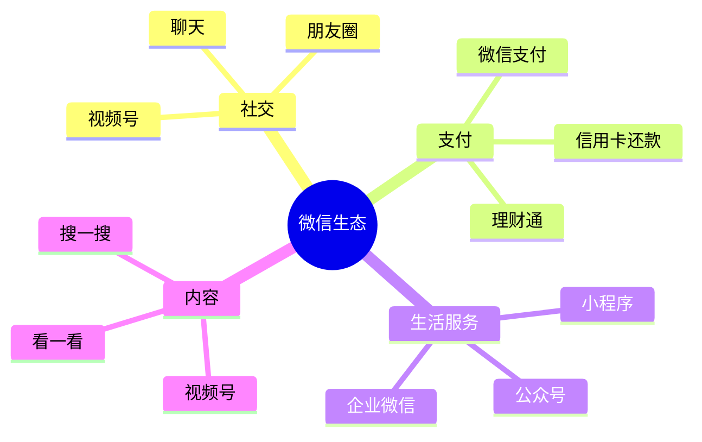

# 腾讯控股 - 案例研究

## 公司概况

**基本信息**
- **公司名称**: 腾讯控股有限公司 (Tencent Holdings Limited)
- **股票代码**: 00700.HK (香港联交所)
- **成立时间**: 1998年11月11日
- **总部位置**: 中国广东省深圳市南山区
- **创始人**: 马化腾、张志东、许晨晔、陈一丹、曾李青
- **现任董事长兼CEO**: 马化腾 (Pony Ma)

**主营业务**
- 社交网络 (微信/WeChat、QQ)
- 网络游戏 (王者荣耀、和平精英等)
- 数字内容 (视频、音乐、文学、动漫)
- 金融科技 (微信支付、理财通)
- 企业服务 (腾讯云、企业微信)
- 广告业务 (社交广告、媒体广告)

**市值规模** (截至2024年)
- 市值: ~3.5万亿港币 (约$4500亿美元)
- 中国互联网公司市值第一
- 全球十大互联网公司之一

**上市信息**
- 上市时间: 2004年6月16日
- 发行价: 3.70港币/股
- 恒生指数成分股
- 恒生中国企业指数成分股

## 商业模式分析

### 价值主张

腾讯的核心价值主张:

1. **连接一切**
   - 连接人与人 (社交)
   - 连接人与服务 (生活服务)
   - 连接人与内容 (数字内容)
   - 连接人与商业 (支付、广告)

2. **生态系统平台**
   - 微信超级APP (13亿+用户)
   - 游戏娱乐平台
   - 金融科技平台
   - 企业服务平台

3. **用户体验至上**
   - 简洁易用的产品设计
   - 持续的产品创新
   - 快速的迭代优化

### 客户细分

**主要用户群体**:
- C端用户: 13亿+微信用户, 5亿+QQ用户
- 游戏玩家: 数亿活跃玩家
- 内容消费者: 视频、音乐、文学用户
- 商家和企业: 微信生态内的商户
- 广告主: 品牌和效果广告客户

**地理分布** (2023年营收):
- 中国大陆: ~85%
- 国际市场: ~15%

### 收入来源

**业务结构**:
- **增值服务** (48%): 网络游戏、社交网络会员
- **金融科技及企业服务** (32%): 支付、云服务
- **网络广告** (18%): 社交广告、媒体广告
- **其他** (2%): 投资收益等

### 核心资源

1. **社交网络**: 微信13亿+用户, QQ5亿+用户
2. **游戏IP**: 王者荣耀、和平精英等顶级游戏
3. **技术能力**: AI、云计算、大数据
4. **投资版图**: 700+家公司投资组合
5. **品牌价值**: 中国最有价值互联网品牌

### 关键活动

1. **产品开发**: 持续的产品创新和迭代
2. **内容运营**: 游戏、视频、音乐等内容
3. **生态建设**: 微信生态、游戏生态
4. **战略投资**: 投资布局产业链
5. **技术研发**: AI、云计算等前沿技术

## 财务分析

### 收入增长

**15年营收趋势** (单位: 亿元人民币)

| 年份 | 营收 | 同比增长 | 净利润 | 净利率 |
|------|------|----------|--------|--------|
| 2010 | 196 | - | 81 | 41% |
| 2015 | 1029 | - | 288 | 28% |
| 2018 | 3127 | +32% | 787 | 25% |
| 2019 | 3773 | +21% | 933 | 25% |
| 2020 | 4821 | +28% | 1227 | 25% |
| 2021 | 5601 | +16% | 2248 | 40% |
| 2022 | 5545 | -1% | 1882 | 34% |
| 2023 | 6090 | +10% | 1576 | 26% |

**关键观察**:
- 2010-2023年复合增长率 (CAGR): ~29%
- 2022年首次负增长 (监管影响)
- 2023年恢复增长
- 净利率波动较大 (投资收益影响)

### 盈利能力

**关键盈利指标**:

| 指标 | 2019 | 2020 | 2021 | 2022 | 2023 | 行业平均 |
|------|------|------|------|------|------|----------|
| 毛利率 | 46.8% | 47.5% | 50.2% | 48.5% | 50.1% | 40-45% |
| 营业利润率 | 30.2% | 31.5% | 32.8% | 28.5% | 29.2% | 20-25% |
| 净利率 | 24.7% | 25.4% | 40.1% | 33.9% | 25.9% | 15-20% |
| ROE | 28.5% | 27.8% | 38.2% | 28.5% | 21.8% | 15-20% |
| ROA | 14.2% | 13.5% | 18.5% | 13.2% | 10.5% | 8-12% |

**盈利能力分析**:
1. **稳定的毛利率** (50%): 
   - 游戏和社交业务利润率高
   - 规模效应显著

2. **波动的净利率**: 
   - 受投资收益影响大
   - 2021年高点因投资收益
   - 2023年回归常态

3. **优秀的ROE** (20%+):
   - 长期维持高水平
   - 股东回报优异

### 现金流

**现金流表现** (单位: 亿元人民币):

| 财年 | 经营现金流 | 资本支出 | 自由现金流 | FCF利润率 |
|------|------------|----------|------------|-----------|
| 2019 | 1359 | -378 | 981 | 26% |
| 2020 | 1792 | -458 | 1334 | 28% |
| 2021 | 2010 | -528 | 1482 | 26% |
| 2022 | 1814 | -612 | 1202 | 22% |
| 2023 | 2088 | -658 | 1430 | 23% |

**现金流特点**:
- 经营现金流强劲
- 资本支出持续增加 (云计算、数据中心)
- FCF利润率20%+
- 现金储备充足 (超2000亿)

## 竞争分析

### 行业地位

**中国互联网市场**:
- 社交网络: 绝对主导地位 (微信、QQ)
- 网络游戏: 市场份额第一 (~40%)
- 移动支付: 与支付宝并列第一
- 云计算: 市场份额第二 (仅次于阿里云)

### 竞争优势 (护城河分析)

#### 1. 社交网络护城河 (★★★★★)

**微信生态**:
- 13亿+月活用户
- 日均使用时长90+分钟
- 超级APP地位
- 网络效应极强

**护城河表现**:
- 用户迁移成本极高
- 社交关系链锁定
- 生态系统完整
- 竞争对手难以撼动

#### 2. 游戏内容护城河 (★★★★☆)

**游戏优势**:
- 王者荣耀、和平精英等顶级IP
- 全球游戏发行能力
- 强大的研发和运营能力
- 丰富的游戏组合

#### 3. 生态系统护城河 (★★★★★)

**微信生态系统**:

**生态价值**:
- 用户粘性极强
- 多场景覆盖
- 平台效应显著
- 变现能力强

### 主要竞争对手

#### 字节跳动
- **优势**: 算法推荐, 短视频领先, 年轻用户多
- **劣势**: 社交关系链弱, 变现能力不如腾讯
- **竞争领域**: 短视频、游戏、广告

#### 阿里巴巴
- **优势**: 电商生态, 支付宝, 云计算领先
- **劣势**: 社交业务弱, 游戏业务小
- **竞争领域**: 支付、云计算、本地生活

#### 网易
- **优势**: 游戏研发能力强, 精品游戏多
- **劣势**: 规模小, 生态系统弱
- **竞争领域**: 网络游戏

## 投资论点

### 看多理由 (Bull Case)

#### 1. 无可替代的社交网络 (★★★★★)
- 微信13亿+用户，网络效应极强
- 用户迁移成本极高
- 社交关系链护城河

#### 2. 多元化业务组合 (★★★★☆)
- 游戏、社交、金融科技、云计算
- 业务协同效应强
- 抗风险能力强

#### 3. 强大的投资版图 (★★★★☆)
- 投资700+家公司
- 覆盖互联网全产业链
- 投资收益可观

#### 4. 视频号增长潜力 (★★★★☆)
- 短视频赛道快速增长
- 微信生态加持
- 商业化空间大

#### 5. 国际化机会 (★★★☆☆)
- 游戏出海成功
- WeChat国际版增长
- 云计算国际化

### 风险因素 (Bear Case)

#### 1. 监管风险 (★★★★★)
- 反垄断监管
- 游戏版号限制
- 数据安全监管
- 未成年人保护

#### 2. 竞争加剧 (★★★★☆)
- 字节跳动短视频冲击
- 游戏市场竞争激烈
- 云计算竞争白热化

#### 3. 增长放缓 (★★★☆☆)
- 用户增长见顶
- 市场渗透率高
- 增长依赖创新

#### 4. 地缘政治风险 (★★★☆☆)
- 中美科技脱钩
- 海外业务受限
- 投资退出风险

### 估值分析

**当前估值** (2024年初):
- P/E: ~18x
- P/S: ~4.5x
- P/B: ~3.5x

**历史估值**:
- 历史平均P/E: 30x
- 当前估值处于历史低位
- 反映市场对监管和增长的担忧

**投资评级**: **买入** (Buy)

**目标价**: 420-480港币 (基于2024年初380港币)

**理由**:
- ✅ 社交网络护城河稳固
- ✅ 估值处于历史低位
- ✅ 多元化业务组合
- ✅ 现金流强劲
- ⚠️ 监管不确定性
- ⚠️ 增长放缓

## 历史表现

### 股价走势

**长期表现**:
- 2004年上市: 3.70港币
- 2010年: 40港币
- 2015年: 120港币
- 2018年: 470港币 (历史高点)
- 2021年: 770港币 (历史最高点)
- 2022年: 200港币 (监管低点)
- 2024年: 380港币

**累计回报**:
- 上市至今 (20年): +10000%
- 过去10年: +400%
- 过去5年: -20%

**年化回报率**:
- 20年: ~26% CAGR
- 10年: ~18% CAGR

### 与指数对比

**相对表现**:
- 2004-2021: 大幅跑赢恒生指数
- 2021-2023: 跑输大盘 (监管冲击)
- 长期仍是优秀投资标的

## 关键学习点

### 1. 社交网络的网络效应

**核心洞察**: 微信展示了社交网络的终极护城河。

**网络效应**:
- 用户越多，价值越大
- 社交关系链锁定用户
- 迁移成本极高
- 赢家通吃效应

**投资启示**: 
- 社交网络具有极强的护城河
- 网络效应是最强大的商业模式之一
- 关注用户粘性和活跃度

### 2. 平台生态系统的价值

**核心洞察**: 腾讯构建了完整的生态系统。

**生态系统优势**:
- 多场景覆盖
- 用户时长占据
- 变现渠道多元
- 协同效应强

**投资启示**:
- 平台型公司价值巨大
- 生态系统创造护城河
- 关注生态完整性

### 3. 游戏业务的高盈利性

**核心洞察**: 游戏是互联网最赚钱的业务之一。

**游戏业务特点**:
- 毛利率极高 (70%+)
- 用户付费意愿强
- 爆款游戏回报惊人
- 但生命周期有限

**投资启示**:
- 游戏业务盈利能力强
- 需要持续推出新游戏
- 关注游戏组合和研发能力

### 4. 投资版图的战略价值

**核心洞察**: 腾讯通过投资布局全产业链。

**投资策略**:
- 投资700+家公司
- 覆盖互联网全领域
- 既有财务回报，又有战略价值
- 构建生态护城河

**投资启示**:
- 战略投资创造长期价值
- 投资版图是重要护城河
- 关注投资组合质量

### 5. 监管风险的影响

**核心洞察**: 互联网平台面临日益严格的监管。

**监管影响**:
- 2021-2022年股价腰斩
- 业务增长受限
- 估值大幅压缩
- 不确定性增加

**投资启示**:
- 监管风险是重要考量
- 需要关注政策变化
- 估值需要折价

### 6. 从增长到价值的转变

**核心洞察**: 腾讯从高增长公司转向价值公司。

**转变特征**:
- 增长放缓至个位数
- 更注重盈利质量
- 加大分红和回购
- 估值中枢下移

**投资启示**:
- 成熟公司增长有限
- 关注现金流和分红
- 估值预期需调整

### 7. 中国互联网的投资机会

**核心洞察**: 腾讯代表中国互联网的投资价值。

**中国互联网特点**:
- 市场规模巨大
- 创新能力强
- 竞争激烈
- 监管趋严

**投资启示**:
- 中国互联网仍有投资价值
- 需要理解本土市场
- 关注监管环境变化

### 8. 长期持有的重要性

**核心洞察**: 腾讯是长期投资的优秀标的。

**长期价值**:
- 20年年化回报26%
- 社交网络护城河稳固
- 多元化业务组合
- 现金流强劲

**投资启示**:
- 优秀公司值得长期持有
- 短期波动不改长期价值
- 关注基本面而非股价

## 延伸阅读

### 推荐书籍

1. **《腾讯传》** - 吴晓波
   - 腾讯20+年发展历程
   - 产品创新和战略演进

2. **《腾讯方法》** - 潘东燕、王晓明
   - 腾讯的管理和创新方法
   - 产品哲学和用户思维

3. **《平台革命》** - Geoffrey Parker
   - 平台商业模式分析
   - 网络效应理论

4. **《中国互联网投资指南》** - 李驰
   - 互联网公司投资逻辑
   - 腾讯作为经典案例

### 推荐文章

1. **腾讯控股年报和财报**
   - 最权威的财务和业务信息
   - 链接: [腾讯投资者关系](https://www.tencent.com/zh-cn/investors.html)

2. **《腾讯的护城河》** - 雪球网
   - 深度分析腾讯的竞争优势
   - 投资者讨论和分析

3. **《中国互联网深度报告》** - 各大券商研报
   - 行业分析和公司对比
   - 投资建议和估值分析

### 相关案例

- [贵州茅台 - 品牌护城河](./moutai.html)
- [宁德时代 - 新能源龙头](./catl.html)
- [Meta/Facebook - 全球社交网络](../tech-giants/meta.html)
- [平台商业模式](../../business-models/platform-business.html)
- [中国科技行业分析](../../../05-global-perspective/china-market/technology/index.html)

## 参考文献

1. 腾讯控股有限公司年度报告 (2004-2023)
2. 腾讯控股有限公司招股说明书 (2004)
3. 吴晓波. 《腾讯传》. 浙江大学出版社 (2017)
4. 潘东燕、王晓明. 《腾讯方法》. 机械工业出版社 (2018)
5. 中金公司. 《腾讯控股深度报告》(2023)
6. 高盛. 《中国互联网行业分析》(2023)
7. 摩根士丹利. 《腾讯投资价值分析》(2023)
8. 瑞银. 《微信生态系统研究》(2022)
9. 花旗. 《腾讯游戏业务分析》(2023)
10. 汇丰. 《中国互联网监管影响》(2022)
11. 招商证券. 《腾讯估值分析》(2023)
12. 中信证券. 《视频号商业化研究》(2023)
13. 国泰君安. 《腾讯云竞争力分析》(2023)
14. 华泰证券. 《腾讯投资版图研究》(2022)
15. 申万宏源. 《中国互联网长期投资价值》(2023)

---

**最后更新**: 2024年1月16日  
**下次审查**: 2024年7月16日  
**数据截止**: 2023财年 (2023年12月31日)

**免责声明**: 本案例研究仅供教育和学习目的，不构成投资建议。投资决策应基于个人研究和专业咨询。
