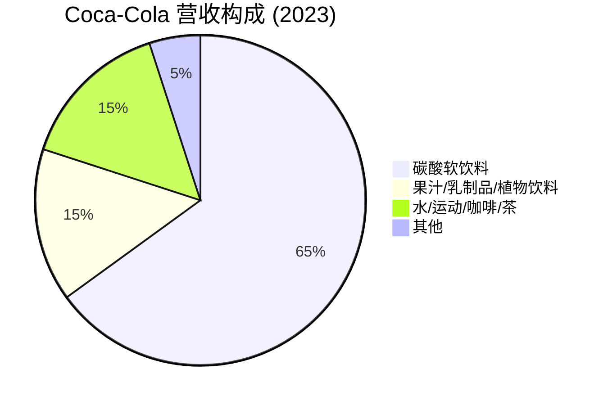
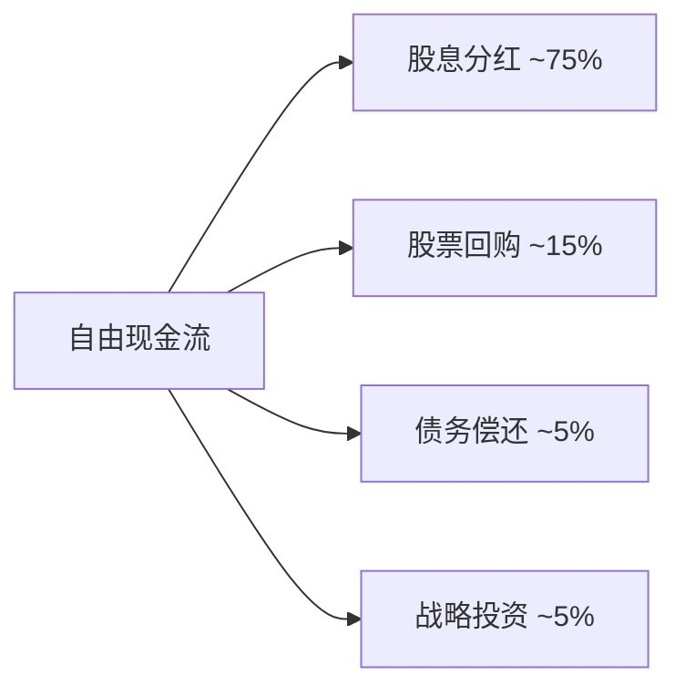
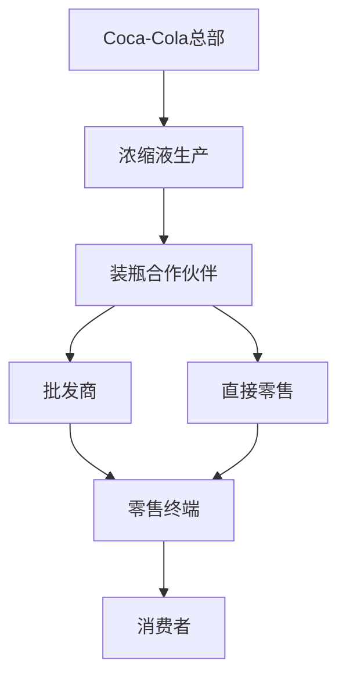

# Coca-Cola Company - 案例研究

## 公司概况

**基本信息**
- **公司名称**: The Coca-Cola Company
- **股票代码**: KO (NYSE)
- **成立时间**: 1892年1月29日
- **总部位置**: 美国佐治亚州亚特兰大
- **创始人**: 约翰·彭伯顿 (John Pemberton, 1886年发明配方)
- **现任CEO**: James Quincey (2017年至今)

**主营业务**
- 碳酸软饮料 (Coca-Cola, Sprite, Fanta等)
- 果汁饮料 (Minute Maid, Simply)
- 运动饮料 (Powerade, BodyArmor)
- 即饮茶和咖啡 (Gold Peak, Costa Coffee)
- 瓶装水 (Dasani, Smartwater)

**市值规模** (截至2024年)
- 市值: ~$260亿美元
- 道琼斯工业平均指数成分股
- 标普500指数成分股

**上市信息**
- 上市时间: 1919年
- 连续派息: 60+年 (股息贵族)
- 股息增长: 连续61年增长

## 商业模式分析

### 价值主张

Coca-Cola的核心价值主张:

1. **全球最知名品牌**
   - 品牌价值超$800亿 (Interbrand 2023)
   - 全球品牌认知度超过95%
   - "快乐"和"分享"的情感连接

2. **无处不在的可得性**
   - 全球200+国家和地区
   - 2800万+零售点
   - "一臂之遥"的购买便利性

3. **一致的产品体验**
   - 全球统一的口味和品质
   - 标志性的包装设计
   - 可靠的产品质量

### 客户细分

**主要客户群体**:
- 大众消费者 (核心市场)
- 年轻人群 (18-34岁，重度消费者)
- 家庭消费 (多人装、家庭装)
- 餐饮渠道 (餐厅、快餐店)
- 便利店和自动售货机用户

**地理分布** (2023年营收):
- 北美: ~35%
- 拉丁美洲: ~25%
- 欧洲、中东和非洲: ~25%
- 亚太地区: ~15%

### 收入来源



**商业模式特点**:
- **资产轻型模式**: 特许经营系统，公司专注品牌和浓缩液
- **装瓶合作伙伴**: 全球250+装瓶商负责生产、包装、分销
- **品牌组合**: 500+品牌，满足不同需求
- **定价策略**: 高端定位，品牌溢价

### 成本结构

**主要成本项**:
- **原材料成本** (~40% 营收): 糖、水、包装材料
- **营销费用** (~10% 营收): 广告、赞助、促销
- **运营费用** (~15% 营收): 管理、研发、物流
- **装瓶商支持** (~5% 营收): 对装瓶合作伙伴的支持

**成本优势**:
- 规模采购降低原材料成本
- 全球供应链优化
- 营销费用效率高 (品牌效应)
- 轻资产模式降低资本支出

### 核心资源

1. **品牌资产**: 全球最有价值品牌之一
2. **配方秘密**: 可口可乐配方保密130+年
3. **分销网络**: 全球最广泛的分销系统
4. **装瓶合作伙伴**: 长期稳定的合作关系
5. **客户忠诚度**: 极高的品牌忠诚度和复购率

### 关键活动

1. **品牌建设**: 持续的营销和广告投入
2. **产品创新**: 新口味、新包装、新品类
3. **渠道管理**: 优化分销网络和零售覆盖
4. **合作伙伴管理**: 支持装瓶商运营
5. **市场拓展**: 新兴市场渗透

### 关键合作伙伴

**装瓶合作伙伴**:
- Coca-Cola Consolidated (美国)
- Coca-Cola European Partners (欧洲)
- Coca-Cola Femsa (拉美)
- Swire Coca-Cola (亚太)

**供应商**:
- 糖供应商 (甘蔗、玉米糖浆)
- 包装材料供应商 (瓶子、罐子、标签)
- 设备制造商 (灌装设备、冷藏设备)

**战略合作**:
- 麦当劳、肯德基等快餐连锁 (独家供应)
- 体育赛事赞助 (奥运会、世界杯)
- 娱乐产业合作 (电影、音乐)

## 财务分析

### 收入增长

**50年营收趋势** (单位: 十亿美元)

| 年份 | 营收 | 同比增长 | 净利润 | 净利率 |
|------|------|----------|--------|--------|
| 1970 | 1.8 | - | 0.2 | 11% |
| 1980 | 5.9 | - | 0.4 | 7% |
| 1990 | 10.2 | - | 1.4 | 14% |
| 2000 | 20.5 | - | 2.2 | 11% |
| 2010 | 35.1 | - | 11.8 | 34% |
| 2015 | 44.3 | +3% | 7.4 | 17% |
| 2020 | 33.0 | -11% | 7.7 | 23% |
| 2021 | 38.7 | +17% | 9.8 | 25% |
| 2022 | 43.0 | +11% | 9.5 | 22% |
| 2023 | 45.8 | +7% | 10.7 | 23% |

**关键观察**:
- 1970-2023年复合增长率 (CAGR): ~6.5%
- 2020年疫情冲击显著 (餐饮渠道关闭)
- 2021-2023年强劲复苏
- 长期稳定增长，成熟业务特征

### 盈利能力

**关键盈利指标**:

| 指标 | 2019 | 2020 | 2021 | 2022 | 2023 | 行业平均 |
|------|------|------|------|------|------|----------|
| 毛利率 | 60.5% | 59.4% | 60.8% | 57.9% | 59.2% | 50-55% |
| 营业利润率 | 27.6% | 27.6% | 29.2% | 26.5% | 26.8% | 20-25% |
| 净利率 | 24.0% | 23.3% | 25.3% | 22.1% | 23.4% | 15-20% |
| ROE | 42.8% | 40.6% | 42.0% | 40.5% | 41.2% | 15-25% |
| ROA | 9.8% | 8.7% | 9.5% | 9.2% | 9.8% | 6-10% |
| ROIC | 15.2% | 14.1% | 15.8% | 15.5% | 16.1% | 10-15% |

**盈利能力分析**:
1. **高毛利率** (59%): 
   - 品牌溢价能力强
   - 浓缩液业务利润率高
   - 规模效应显著

2. **稳定的ROE** (41%):
   - 高利润率 × 适度杠杆
   - 长期维持在40%左右
   - 股息和回购提升ROE

3. **良好的ROIC** (16%):
   - 轻资产模式
   - 资本使用效率高
   - 持续创造股东价值

### 现金流

**现金流表现** (单位: 十亿美元):

| 财年 | 经营现金流 | 资本支出 | 自由现金流 | FCF利润率 |
|------|------------|----------|------------|-----------|
| 2019 | 10.5 | -2.1 | 8.4 | 22.5% |
| 2020 | 9.8 | -1.3 | 8.5 | 25.8% |
| 2021 | 11.3 | -1.4 | 9.9 | 25.6% |
| 2022 | 10.9 | -1.7 | 9.2 | 21.4% |
| 2023 | 11.8 | -1.9 | 9.9 | 21.6% |

**现金流特点**:
- **稳定的现金生成**: FCF利润率20%+
- **低资本支出**: CapEx仅占营收4%
- **高股息支付**: 派息率70-80%
- **持续回购**: 年度回购$10-20亿

**资本配置策略**:


### 财务健康

**资产负债表** (2023财年, 单位: 十亿美元):

**资产**:
- 流动资产: $28B (现金$11B, 应收账款$4B, 存货$4B)
- 非流动资产: $69B (固定资产$10B, 商誉$19B, 无形资产$23B, 其他$17B)
- 总资产: $97B

**负债**:
- 流动负债: $26B (应付账款$16B, 短期债务$4B, 其他$6B)
- 非流动负债: $48B (长期债务$39B, 其他$9B)
- 总负债: $74B

**股东权益**: $23B

**财务比率**:
- 流动比率: 1.08
- 速动比率: 0.92
- 资产负债率: 76%
- 利息覆盖倍数: 15+

**财务健康评估**:
- ✅ 现金流强劲，偿债能力充足
- ✅ 债务主要用于优化资本结构
- ✅ 信用评级: A+ (标普), A1 (穆迪)
- ⚠️ 杠杆率较高，但可控

## 竞争分析

### 行业地位

**全球软饮料市场** (市场份额, 2023):
- Coca-Cola: ~43% (碳酸饮料)
- PepsiCo: ~25%
- Keurig Dr Pepper: ~8%
- Nestlé: ~5%
- 其他: ~19%

**关键观察**:
- Coca-Cola在碳酸饮料市场占据主导地位
- 品牌组合广泛，覆盖多个品类
- 全球分销网络最广

### 竞争优势 (护城河分析)

#### 1. 品牌护城河 (★★★★★)

**品牌价值**:
- Interbrand 2023: 全球第6大品牌 ($800亿+)
- 品牌认知度: 全球95%+
- 品牌忠诚度: 极高的复购率

**品牌特质**:
- 130+年历史积淀
- "快乐"和"分享"的情感价值
- 标志性的红色和曲线瓶设计
- 全球统一的品牌形象

**品牌护城河表现**:
- 客户愿意为Coca-Cola支付溢价
- 新产品推出成功率高 (品牌延伸)
- 品牌价值持续增长

**巴菲特评价**: "如果你给我1000亿美元，让我击败可口可乐，我会把钱还给你，说这事做不到。"

#### 2. 分销网络护城河 (★★★★★)

**分销规模**:
- 全球200+国家和地区
- 2800万+零售点
- 250+装瓶合作伙伴
- 每天服务19亿份饮料

**分销优势**:


**竞争壁垒**:
- 建立全球分销网络需要数十年
- 与零售商的长期关系
- 冷藏设备投资巨大
- 物流和供应链复杂度高

#### 3. 规模优势 (★★★★☆)

**生产规模**:
- 年产量超过300亿箱 (单位箱)
- 全球最大的饮料公司
- 采购规模带来成本优势

**营销规模**:
- 年营销费用$40亿+
- 全球统一营销活动
- 体育赛事赞助 (奥运会、世界杯)
- 营销效率高

#### 4. 配方秘密 (★★★☆☆)

**秘密配方**:
- 1886年发明，保密至今
- 仅少数人知道完整配方
- 存放在亚特兰大总部金库

**实际价值**:
- 营销价值大于实际价值
- 现代技术可以分析成分
- 真正护城河是品牌，而非配方

### 主要竞争对手

#### PepsiCo (百事可乐)
- **优势**: 多元化业务 (饮料+零食), 创新能力强, 年轻化品牌形象
- **劣势**: 品牌价值低于Coca-Cola, 碳酸饮料市场份额落后
- **竞争领域**: 碳酸饮料、运动饮料、果汁

#### Nestlé (雀巢)
- **优势**: 品类广泛 (咖啡、水、营养品), 全球分销, 健康产品线
- **劣势**: 碳酸饮料业务弱, 品牌分散
- **竞争领域**: 瓶装水、即饮咖啡、营养饮料

#### Keurig Dr Pepper
- **优势**: 北美市场强势, 咖啡系统创新
- **劣势**: 全球化程度低, 品牌影响力有限
- **竞争领域**: 北美软饮料市场

### 竞争策略

**Coca-Cola的差异化策略**:
1. **品牌至上**: 持续投资品牌建设
2. **无处不在**: 最广泛的分销网络
3. **情感连接**: 营销强调快乐和分享
4. **产品创新**: 推出新口味和新包装
5. **健康转型**: 增加低糖、无糖产品

**竞争优势持续性**: ★★★★★
- 品牌和分销护城河极难复制
- 130+年历史积淀
- 全球化程度最高

## 巴菲特的投资案例

### 投资历史

**投资时间线**:
- **1988年**: 巴菲特开始建仓Coca-Cola
- **1988-1994年**: 持续增持，总投资$12.99亿
- **平均成本**: 约$3.25/股 (调整后)
- **持股数量**: 4亿股 (约占9.3%)
- **持有至今**: 35+年，从未卖出

**投资回报** (截至2024年):
- 当前市值: ~$240亿
- 累计回报: ~18倍
- 年化回报率: ~8.5%
- 累计股息收入: ~$80亿

### 投资逻辑

**巴菲特看中的要素**:

1. **简单易懂的商业模式**
   - "我能理解的生意"
   - 产品简单，商业模式清晰
   - 不需要复杂的技术分析

2. **强大的品牌护城河**
   - 全球最有价值的品牌之一
   - 品牌忠诚度极高
   - 竞争对手难以复制

3. **稳定的现金流**
   - 高利润率，低资本支出
   - 现金流可预测性强
   - 支持持续分红

4. **优秀的管理层**
   - Roberto Goizueta (1981-1997年CEO)
   - 专注股东价值
   - 资本配置能力强

5. **合理的估值**
   - 1988年P/E约15倍
   - 相对价值吸引
   - 长期增长潜力

**巴菲特名言**:
> "如果你给我1000亿美元，让我击败可口可乐，我会把钱还给你，说这事做不到。"

> "我们喜欢那种即使是傻瓜也能经营的企业，因为总有一天会有傻瓜来经营。"

### 投资表现

**持有期间表现** (1988-2024):

| 期间 | 股价涨幅 | 股息收益 | 总回报 | 年化回报 |
|------|----------|----------|--------|----------|
| 1988-1998 | +900% | +$20亿 | +1000% | +26% |
| 1999-2008 | -20% | +$25亿 | +15% | +1.5% |
| 2009-2018 | +80% | +$30亿 | +130% | +8.7% |
| 2019-2024 | +20% | +$15亿 | +50% | +8.5% |
| **总计** | +1700% | +$80亿 | +1900% | +8.5% |

**关键观察**:
- 1990年代表现优异 (年化26%)
- 2000年代增长放缓 (互联网泡沫后)
- 长期持有获得稳定回报
- 股息收入占总回报重要部分

### 投资启示

**巴菲特的投资原则体现**:

1. **能力圈原则**
   - 投资自己理解的生意
   - Coca-Cola商业模式简单清晰
   - 不投资复杂的科技公司

2. **护城河理论**
   - 寻找具有持久竞争优势的公司
   - 品牌是最强大的护城河之一
   - 护城河随时间加深

3. **长期持有**
   - 持有35+年，从未卖出
   - "我最喜欢的持有期是永远"
   - 复利的力量

4. **股息再投资**
   - 累计股息收入$80亿+
   - 股息率从2%增至当前成本的50%+
   - 股息增长提供额外回报

5. **集中投资**
   - Coca-Cola是伯克希尔第三大持仓
   - 对优秀公司下重注
   - 不过度分散

**对投资者的启示**:
- 寻找具有强大品牌的消费品公司
- 关注商业模式的简单性和可持续性
- 长期持有优秀公司
- 重视股息收入和复利效应
- 在合理估值时买入

## 投资论点

### 看多理由 (Bull Case)

#### 1. 全球品牌价值持续增长 (★★★★★)

**品牌优势**:
- 全球认知度最高的品牌之一
- 品牌价值持续增长
- 新兴市场品牌渗透提升

**投资价值**: 品牌护城河支撑长期定价权

#### 2. 新兴市场增长潜力 (★★★★☆)

**增长机会**:
- 印度、非洲、东南亚人均消费低
- 中产阶级崛起驱动需求
- 城市化提升消费频次

**财务影响**: 新兴市场营收占比提升

#### 3. 产品组合优化 (★★★★☆)

**健康转型**:
- 低糖、无糖产品占比提升
- 功能性饮料增长
- 适应健康趋势

**投资价值**: 应对消费者偏好变化

#### 4. 稳定的股息收入 (★★★★★)

**股息特点**:
- 连续61年股息增长
- 股息率3.0%
- 派息率70-80%，可持续

**投资价值**: 为收益型投资者提供稳定现金流

#### 5. 估值合理 (★★★☆☆)

**当前估值** (2024年初):
- P/E: ~25x
- P/S: ~5.5x
- 股息率: ~3.0%

**投资价值**: 相对历史估值合理

### 风险因素 (Bear Case)

#### 1. 健康趋势冲击 (★★★★☆)

**挑战**:
- 消费者健康意识提升
- 糖税在多国实施
- 碳酸饮料消费下降
- 肥胖问题关注度提升

**影响**:
- 核心产品需求下降
- 需要产品组合转型
- 利润率可能受压

#### 2. 市场饱和 (★★★☆☆)

**挑战**:
- 发达市场增长停滞
- 人均消费接近天花板
- 竞争加剧

**影响**: 营收增长依赖新兴市场

#### 3. 货币汇率风险 (★★★☆☆)

**挑战**:
- 全球业务受汇率波动影响
- 美元走强侵蚀海外收入
- 新兴市场货币贬值

**影响**: 财务业绩波动性增加

#### 4. 环境和可持续性压力 (★★★☆☆)

**挑战**:
- 塑料包装环保压力
- 水资源使用争议
- 碳排放目标

**影响**: 需要增加环保投资，成本上升

#### 5. 增长放缓 (★★★☆☆)

**挑战**:
- 成熟业务，增长有限
- 营收增长率低于GDP增长
- 难以找到新的增长引擎

**影响**: 估值倍数可能压缩

### 估值分析

#### DCF估值

**假设**:
- 营收增长率: 2024-2028年 4-5%, 2029-2033年 3-4%
- 自由现金流利润率: 21%
- WACC: 7%
- 永续增长率: 2.5%

**计算**:
```
未来5年FCF现值: $45B
未来5年后FCF现值: $50B
终值现值: $180B
企业价值: $275B
减: 净债务 $35B
股权价值: $240B
当前市值: $260B
```

**结论**: 当前估值略高于DCF合理值

#### 相对估值

**可比公司** (2024年初):

| 公司 | P/E | P/S | 股息率 | 营收增长 | 净利率 |
|------|-----|-----|--------|----------|--------|
| Coca-Cola | 25x | 5.5x | 3.0% | 5% | 23% |
| PepsiCo | 24x | 2.8x | 2.7% | 6% | 11% |
| Nestlé | 22x | 3.2x | 2.5% | 4% | 15% |
| Keurig Dr Pepper | 20x | 3.0x | 2.8% | 3% | 18% |

**观察**:
- Coca-Cola P/E略高于同行
- P/S显著高于同行 (反映高利润率)
- 股息率具有竞争力

#### 历史估值

**P/E历史区间**:
- 历史最低: 15x (2008年金融危机)
- 历史最高: 40x (1998年)
- 历史平均: 22x
- 当前: 25x (60th百分位)

**估值驱动因素**:
- 1990年代: 高增长，高估值
- 2000-2010: 增长放缓，估值压缩
- 2010-2020: 稳定增长，估值修复
- 2020-2024: 疫情后复苏，估值维持

### 投资建议

**目标价区间**: $58-65 (基于2024年初$60价格)

**情景分析**:

| 情景 | 概率 | 目标价 | 回报率 | 关键假设 |
|------|------|--------|--------|----------|
| 乐观 | 25% | $70 | +17% | 新兴市场强劲增长, 产品创新成功 |
| 基准 | 50% | $62 | +3% | 稳定增长, 股息持续增长 |
| 悲观 | 25% | $50 | -17% | 健康趋势冲击, 增长停滞 |

**期望回报**: (25%×17%) + (50%×3%) + (25%×-17%) = +1.8%

**投资评级**: **持有** (Hold)

**理由**:
- ✅ 强大的品牌护城河
- ✅ 稳定的现金流和股息
- ✅ 巴菲特长期持有的信心
- ⚠️ 增长放缓，成熟业务
- ⚠️ 健康趋势带来长期挑战
- ⚠️ 估值不便宜

**适合投资者**:
- 收益型投资者 (追求稳定股息)
- 价值投资者 (长期持有)
- 保守型投资者 (低波动性)

**不适合投资者**:
- 成长型投资者 (增长有限)
- 短期交易者 (波动性低)
- 对健康趋势敏感的投资者

## 历史表现

### 股价走势

**长期表现** (调整后股价):
- 1919年上市: $40
- 1980年: $1.50
- 1990年: $3.00
- 2000年: $25.00 (历史高点)
- 2010年: $15.00
- 2020年: $50.00
- 2024年: $60.00

**累计回报**:
- 上市至今 (105年): +150,000%
- 过去50年: +4,000%
- 过去30年: +2,000%
- 过去10年: +80%

**年化回报率**:
- 105年: ~7.5% CAGR
- 50年: ~8.0% CAGR
- 30年: ~10.5% CAGR
- 10年: ~6.0% CAGR

### 与指数对比

**相对表现** (过去30年):

| 期间 | KO | S&P 500 | 超额回报 |
|------|-----|---------|----------|
| 1994-2024 | +2000% | +1200% | +800% |
| 2014-2024 | +80% | +180% | -100% |

**观察**:
- 1990年代大幅跑赢大盘
- 2000年代表现落后
- 近10年跑输大盘 (成熟业务)

### 股息历史

**股息政策**:
- 1920年开始派息
- 连续派息100+年
- 连续增长61年 (股息贵族)

**股息增长**:
- 1990年: $0.20/股/年
- 2000年: $0.68/股/年
- 2010年: $0.88/股/年
- 2020年: $1.64/股/年
- 2024年: $1.84/股/年

**股息率**: 3.0% (高于标普500平均)

## 关键学习点

### 1. 品牌护城河的持久性

**核心洞察**: Coca-Cola证明了品牌护城河可以持续100+年。

**关键要素**:
- **历史积淀**: 130+年品牌建设
- **情感连接**: 超越产品本身的情感价值
- **全球一致性**: 统一的品牌形象和体验
- **持续投资**: 每年$40亿+营销投入

**投资启示**: 
- 品牌护城河是最持久的竞争优势之一
- 需要长期持续投资维护
- 品牌价值可以跨越代际传承

### 2. 简单商业模式的力量

**核心洞察**: 最好的生意往往是最简单的。

**Coca-Cola的简单性**:
- 产品简单: 糖水+碳酸
- 商业模式简单: 卖浓缩液给装瓶商
- 价值主张简单: 快乐和分享

**巴菲特的评价**: "我能理解的生意"

**投资启示**:
- 简单的商业模式更容易理解和预测
- 复杂不等于优秀
- 简单的生意更容易长期持续

### 3. 分销网络的价值

**核心洞察**: 全球分销网络是难以复制的竞争优势。

**Coca-Cola分销优势**:
- 100+年建设的全球网络
- 2800万+零售点
- 与零售商的长期关系
- 冷藏设备投资

**投资启示**:
- 分销网络是重要的护城河
- 建立需要时间和资本
- 一旦建立，难以被颠覆

### 4. 股息投资的价值

**核心洞察**: 稳定增长的股息提供长期回报。

**Coca-Cola股息特点**:
- 连续61年增长
- 派息率70-80%
- 股息率3.0%

**巴菲特的收益**:
- 1988年投资$13亿
- 累计股息收入$80亿+
- 当前年度股息$7亿+ (成本的50%+)

**投资启示**:
- 股息是总回报的重要组成部分
- 股息增长提供复利效应
- 适合长期持有的收益型投资者

### 5. 成熟业务的挑战

**核心洞察**: 即使是伟大的公司，也会面临增长放缓。

**Coca-Cola的挑战**:
- 市场饱和，增长有限
- 健康趋势冲击
- 难以找到新的增长引擎

**投资启示**:
- 成熟业务增长有限
- 需要调整估值预期
- 关注股息而非增长

### 6. 长期持有的力量

**核心洞察**: 巴菲特35+年持有Coca-Cola，从未卖出。

**长期持有的好处**:
- 复利效应最大化
- 避免频繁交易成本
- 享受股息增长
- 税收优惠

**巴菲特名言**: "我最喜欢的持有期是永远"

**投资启示**:
- 找到优秀公司后长期持有
- 不要被短期波动影响
- 时间是优秀公司的朋友

### 7. 能力圈原则

**核心洞察**: 投资自己理解的生意。

**巴菲特的能力圈**:
- 理解Coca-Cola的商业模式
- 能够评估其竞争优势
- 可以预测其长期前景

**投资启示**:
- 只投资自己理解的公司
- 不懂不投
- 能力圈比能力圈大小更重要

### 8. 护城河随时间加深

**核心洞察**: Coca-Cola的护城河随时间加深，而非减弱。

**护城河加深的原因**:
- 品牌价值持续增长
- 分销网络不断扩大
- 客户忠诚度提升
- 规模优势增强

**投资启示**:
- 寻找护城河随时间加深的公司
- 避免护城河被侵蚀的公司
- 时间是护城河的试金石

## 延伸阅读

### 推荐书籍

1. **《巴菲特致股东的信》** - 沃伦·巴菲特
   - 多次提到Coca-Cola投资案例
   - 阐述品牌护城河理论

2. **《可口可乐传》** - Mark Pendergrast
   - Coca-Cola 130+年历史
   - 品牌建设和全球扩张

3. **《巴菲特之道》** - Robert Hagstrom
   - 详细分析Coca-Cola投资案例
   - 巴菲特的投资哲学

4. **《股市长线法宝》** - Jeremy Siegel
   - 长期持有优质股票的回报
   - Coca-Cola作为经典案例

### 推荐文章

1. **Berkshire Hathaway年报**
   - 巴菲特关于Coca-Cola的评论
   - 链接: [Berkshire Hathaway](https://www.berkshirehathaway.com)

2. **Coca-Cola年报和10-K文件**
   - 最权威的财务和业务信息
   - 链接: [Coca-Cola Investor Relations](https://investors.coca-colacompany.com)

3. **Aswath Damodaran - Coca-Cola估值案例**
   - 纽约大学教授的估值分析
   - 经典的DCF估值案例

### 相关案例

- [Nike - 品牌护城河](./nike.html)
- [Starbucks - 体验经济](./starbucks.html)
- [Berkshire Hathaway - 巴菲特投资帝国](../financial-institutions/berkshire-hathaway.html)
- [经济护城河分析](../../competitive-analysis/economic-moats.html)
- [价值投资原则](../../../04-investment-system/value-investing/buffett-evolution.html)

## 参考文献

1. The Coca-Cola Company Annual Reports (1970-2023)
2. The Coca-Cola Company 10-K Filings, SEC
3. Berkshire Hathaway Annual Reports (1988-2023)
4. Pendergrast, M. (2013). *For God, Country, and Coca-Cola*. Basic Books
5. Greising, D. (1998). *I'd Like the World to Buy a Coke*. Wiley
6. Allen, F. (1994). *Secret Formula*. HarperBusiness
7. Buffett, W. (1988-2023). *Letters to Berkshire Shareholders*
8. Hagstrom, R. (2013). *The Warren Buffett Way*. Wiley
9. Siegel, J. (2014). *Stocks for the Long Run*. McGraw-Hill
10. Damodaran, A. (2023). "Coca-Cola Valuation". *NYU Stern*
11. Interbrand Best Global Brands Report (2023)
12. Beverage Digest Market Share Reports (2023)
13. Morgan Stanley Consumer Research (2020-2023)
14. Goldman Sachs Beverages Research (2023)
15. Credit Suisse: "Coca-Cola: Brand Power Analysis" (2022)

---

**最后更新**: 2024年1月16日  
**下次审查**: 2024年7月16日  
**数据截止**: 2023财年 (2023年12月31日)

**免责声明**: 本案例研究仅供教育和学习目的，不构成投资建议。投资决策应基于个人研究和专业咨询。
