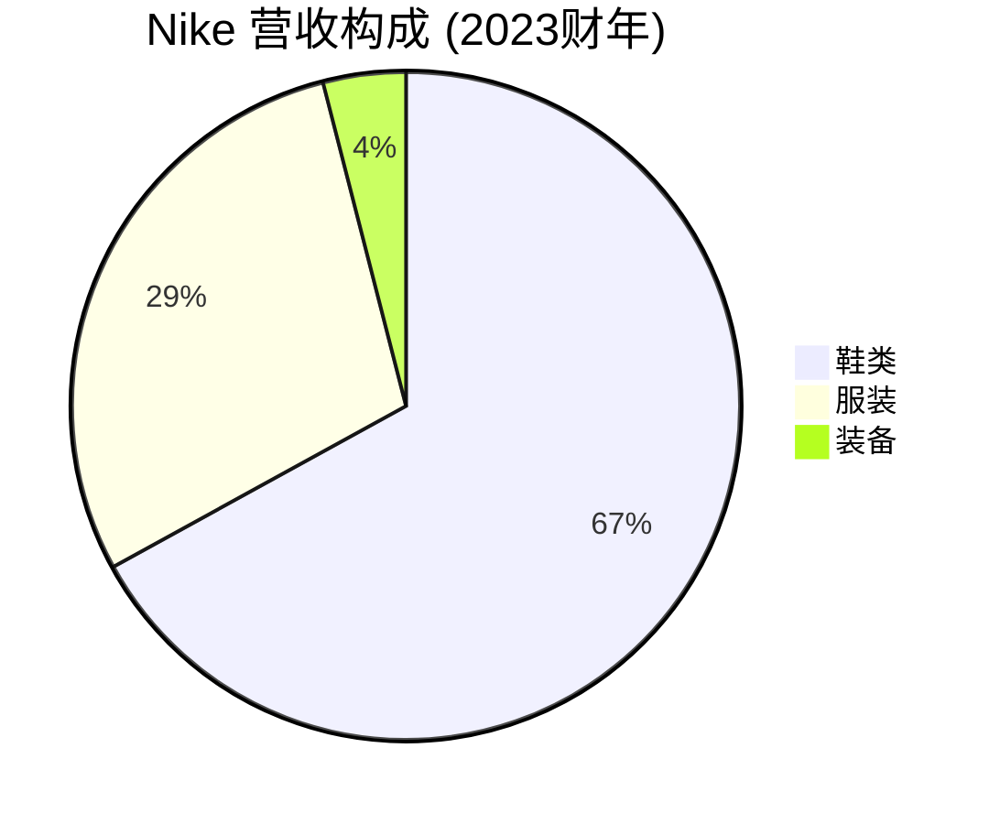
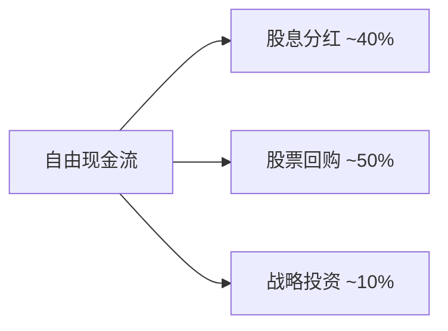

# Nike Inc. - 案例研究

## 公司概况

**基本信息**
- **公司名称**: Nike, Inc.
- **股票代码**: NKE (NYSE)
- **成立时间**: 1964年 (Blue Ribbon Sports), 1971年更名为Nike
- **总部位置**: 美国俄勒冈州比弗顿
- **创始人**: 菲尔·奈特 (Phil Knight) 和比尔·鲍尔曼 (Bill Bowerman)
- **现任CEO**: John Donahoe (2020年至今)

**主营业务**
- 运动鞋类 (跑步、篮球、足球、训练等)
- 运动服装 (运动服、运动裤、运动内衣等)
- 运动装备 (背包、袜子、配件等)
- 数字产品和服务 (Nike App, Nike Training Club, Nike Run Club)

**市值规模** (截至2024年)
- 市值: ~$1600亿美元
- 全球最大的运动品牌公司
- 道琼斯工业平均指数成分股

**上市信息**
- 首次公开募股 (IPO): 1980年12月2日
- IPO价格: $22/股 (调整后约$0.16/股)
- 累计股票分拆: 2次 (1:2)

## 商业模式分析

### 价值主张

Nike的核心价值主张:

1. **"Just Do It" 精神**
   - 激励和赋能运动员
   - 突破自我极限的文化
   - 运动与生活方式的结合

2. **创新与性能**
   - 持续的产品技术创新
   - 专业运动员认可
   - 性能与时尚的平衡

3. **品牌文化**
   - 与顶级运动员合作
   - 体育赛事赞助
   - 街头文化影响力

### 客户细分

**主要客户群体**:
- 专业运动员和运动爱好者
- 年轻消费者 (18-35岁核心群体)
- 时尚潮流追随者
- 健身和健康生活方式人群

**地理分布** (2023财年营收):
- 北美: ~42%
- 欧洲、中东和非洲: ~28%
- 大中华区: ~15%
- 亚太和拉美: ~15%

### 收入来源

**产品线营收**:
1. **鞋类** (~67%): 核心业务，高利润率
2. **服装** (~29%): 增长快速
3. **装备** (~4%): 配件和数字服务

**渠道分布**:
- 批发渠道: ~65%
- 直接面向消费者 (DTC): ~35% (快速增长)
  - Nike.com: ~20%
  - Nike门店: ~15%

### 成本结构

**主要成本项**:
- **产品成本** (~50% 营收): 制造、材料、物流
- **需求创造费用** (~10% 营收): 营销、广告、赞助
- **运营费用** (~30% 营收): 零售、管理、研发
- **资本支出** (~3% 营收): 门店、数字平台、设施

**成本优势**:
- 规模采购降低材料成本
- 外包制造降低固定成本
- 营销效率高 (品牌效应)
- 数字化降低运营成本

### 核心资源

1. **品牌资产**: 全球最有价值运动品牌 ($330亿+)
2. **创新能力**: Air, Flyknit, React等技术平台
3. **运动员网络**: 与顶级运动员的长期合作
4. **供应链**: 全球高效的制造和分销网络
5. **数字平台**: Nike App生态系统，1.6亿+会员

### 关键活动

1. **产品创新**: 持续的技术研发和设计
2. **品牌营销**: 运动员代言、赛事赞助、广告
3. **渠道管理**: 批发合作伙伴和DTC渠道
4. **数字化转型**: 电商平台和会员体系
5. **供应链优化**: 全球制造和物流协调

### 关键合作伙伴

**制造合作伙伴**:
- 越南、中国、印尼的代工厂
- 长期稳定的供应商关系

**零售合作伙伴**:
- Foot Locker, Dick's Sporting Goods等专业零售商
- 百货商店和电商平台

**运动员和团队**:
- 迈克尔·乔丹 (Jordan Brand)
- 勒布朗·詹姆斯、克里斯蒂亚诺·罗纳尔多等顶级运动员
- NBA, NFL, 英超等职业联赛

## 财务分析

### 收入增长

**10年营收趋势** (单位: 十亿美元, 财年截至5月31日)

| 财年 | 营收 | 同比增长 | 鞋类营收 | DTC占比 |
|------|------|----------|----------|---------|
| 2014 | 27.8 | +10% | 17.5 | 22% |
| 2015 | 30.6 | +10% | 19.1 | 23% |
| 2016 | 32.4 | +6% | 20.3 | 25% |
| 2017 | 34.4 | +6% | 21.1 | 27% |
| 2018 | 36.4 | +6% | 22.3 | 29% |
| 2019 | 39.1 | +7% | 24.2 | 31% |
| 2020 | 37.4 | -4% | 23.3 | 32% |
| 2021 | 44.5 | +19% | 28.0 | 35% |
| 2022 | 46.7 | +5% | 29.0 | 39% |
| 2023 | 51.2 | +10% | 33.0 | 42% |

**关键观察**:
- 2014-2023年复合增长率 (CAGR): ~7%
- DTC渠道占比从22%提升至42%
- 2020年疫情冲击，2021年强劲反弹
- 数字化转型加速

### 盈利能力

**关键盈利指标**:

| 指标 | 2019 | 2020 | 2021 | 2022 | 2023 | 行业平均 |
|------|------|------|------|------|------|----------|
| 毛利率 | 44.7% | 43.4% | 44.8% | 46.0% | 44.2% | 40-45% |
| 营业利润率 | 13.0% | 10.6% | 14.9% | 15.6% | 13.8% | 10-12% |
| 净利率 | 10.1% | 7.8% | 12.4% | 12.9% | 11.0% | 8-10% |
| ROE | 42.5% | 35.3% | 48.1% | 43.7% | 38.2% | 20-30% |
| ROA | 16.2% | 12.8% | 18.5% | 17.2% | 15.1% | 10-15% |
| ROIC | 28.5% | 22.1% | 32.8% | 30.5% | 26.8% | 15-20% |

**盈利能力分析**:
1. **稳定的毛利率** (44%): 品牌溢价和产品组合优化
2. **优秀的ROE** (38%): 高利润率和适度杠杆
3. **强劲的ROIC** (27%): 资本使用效率高，轻资产模式

### 现金流

**现金流表现** (单位: 十亿美元):

| 财年 | 经营现金流 | 资本支出 | 自由现金流 | FCF利润率 |
|------|------------|----------|------------|-----------|
| 2019 | 5.3 | -1.0 | 4.3 | 11.0% |
| 2020 | 3.5 | -0.8 | 2.7 | 7.2% |
| 2021 | 8.3 | -1.0 | 7.3 | 16.4% |
| 2022 | 6.7 | -1.1 | 5.6 | 12.0% |
| 2023 | 6.5 | -1.2 | 5.3 | 10.4% |

**现金流特点**:
- 稳定的现金生成能力
- 低资本支出 (轻资产模式)
- 现金用于股息和回购
- 库存管理影响现金流

**资本配置策略**:

## 竞争分析

### 行业地位

**全球运动鞋服市场** (市场份额, 2023):
- Nike: ~38% (鞋类), ~28% (服装)
- Adidas: ~20% (鞋类), ~15% (服装)
- Puma: ~5%
- Under Armour: ~3%
- 其他: ~34%

**关键观察**:
- Nike在全球运动品牌市场占据主导地位
- 品牌价值远超竞争对手
- 在篮球、跑步等核心品类领先

### 竞争优势 (护城河分析)

#### 1. 品牌护城河 (★★★★★)

**品牌价值**:
- Interbrand 2023: 全球第12大品牌 ($330亿)
- 品牌认知度: 全球90%+
- "Just Do It" 标语深入人心

**品牌特质**:
- 与顶级运动员的深度绑定
- 运动与文化的完美结合
- 创新和性能的代名词

**品牌护城河表现**:
- 产品溢价能力强 (比竞品高20-30%)
- 新产品发布引发抢购
- 品牌忠诚度极高

#### 2. 创新护城河 (★★★★☆)

**技术创新**:
- Air气垫技术 (1979年)
- Flyknit编织技术 (2012年)
- React泡棉技术 (2017年)
- ZoomX超轻泡棉 (2019年)

**创新优势**:
- 年研发投入$10亿+
- 专利组合庞大
- 持续的产品迭代

#### 3. 运动员网络 (★★★★★)

**顶级代言人**:
- 迈克尔·乔丹 (Jordan Brand, 终身合约)
- 勒布朗·詹姆斯 (终身合约, $10亿+)
- 克里斯蒂亚诺·罗纳尔多 (终身合约)
- 塞雷娜·威廉姆斯、凯文·杜兰特等

**网络效应**:
- 运动员使用提升品牌可信度
- 粉丝效应驱动销售
- 形成良性循环

#### 4. 规模优势 (★★★★☆)

**生产规模**:
- 年产量超过10亿双鞋
- 全球最大的运动品牌
- 采购规模带来成本优势

**营销规模**:
- 年营销费用$40亿+
- 全球统一营销活动
- 营销效率高

### 主要竞争对手

#### Adidas (阿迪达斯)
- **优势**: 足球市场强势, 时尚合作 (Yeezy), 欧洲市场领先
- **劣势**: 品牌价值低于Nike, 北美市场弱, 创新能力不足
- **竞争领域**: 足球、跑步、时尚运动

#### Puma (彪马)
- **优势**: 时尚定位, 价格竞争力, 新兴市场增长
- **劣势**: 品牌影响力有限, 规模小, 技术创新弱
- **竞争领域**: 时尚运动、足球

#### Under Armour (安德玛)
- **优势**: 性能导向, 训练品类强, 北美市场
- **劣势**: 品牌老化, 国际化不足, 财务压力
- **竞争领域**: 训练、跑步

#### 中国品牌 (安踏、李宁等)
- **优势**: 本土市场优势, 价格竞争力, 快速响应
- **劣势**: 国际化程度低, 品牌影响力有限
- **竞争领域**: 中国市场

### 竞争策略

**Nike的差异化策略**:
1. **品牌至上**: 持续投资品牌建设和运动员代言
2. **创新驱动**: 技术创新保持产品领先
3. **数字化转型**: DTC渠道和会员体系
4. **文化影响力**: 运动与街头文化结合
5. **全球化**: 平衡全球扩张和本地化

**竞争优势持续性**: ★★★★★
- 品牌和运动员网络难以复制
- 创新能力持续领先
- 规模优势不断扩大

## 投资论点

### 看多理由 (Bull Case)

#### 1. 数字化转型加速 (★★★★★)

**DTC增长**:
- DTC占比从22% (2014) 提升至42% (2023)
- 目标: 50%+ DTC占比
- 更高利润率 (DTC毛利率50%+ vs 批发35%)

**数字会员**:
- Nike App会员1.6亿+
- 会员消费频次和金额更高
- 数据驱动的个性化

**投资价值**: DTC转型提升利润率和估值倍数

#### 2. 中国市场增长潜力 (★★★★☆)

**增长机会**:
- 中国运动市场快速增长
- 中产阶级崛起
- 健康意识提升

**Nike优势**:
- 品牌认知度高
- 产品创新领先
- 数字化布局完善

**投资价值**: 中国市场营收占比提升

#### 3. 产品创新持续 (★★★★☆)

**创新管道**:
- 新材料和技术
- 可持续产品线
- 数字化产品 (NFT, 元宇宙)

**投资价值**: 创新驱动ASP提升和市场份额增长

#### 4. 品牌价值持续增长 (★★★★★)

**品牌优势**:
- 全球最有价值运动品牌
- 与顶级运动员的长期合作
- 文化影响力持续扩大

**投资价值**: 品牌护城河支撑长期定价权

#### 5. 股东回报计划 (★★★★☆)

**资本返还**:
- 年度股息$15亿+
- 股票回购$30亿+/年
- 总返还占FCF 90%+

**投资价值**: 持续回购提升每股价值

### 风险因素 (Bear Case)

#### 1. 竞争加剧 (★★★★☆)

**挑战**:
- Adidas, Puma等竞争对手创新
- 中国本土品牌崛起
- 新兴DTC品牌 (Allbirds, On等)

**影响**: 市场份额和利润率压力

#### 2. 中国市场风险 (★★★★☆)

**挑战**:
- 地缘政治紧张
- 新疆棉事件影响
- 本土品牌竞争

**影响**: 中国营收增长放缓或下降

#### 3. 供应链风险 (★★★☆☆)

**挑战**:
- 过度依赖亚洲制造
- 原材料成本上涨
- 物流成本增加

**影响**: 毛利率压力

#### 4. 库存管理 (★★★☆☆)

**挑战**:
- 2022-2023年库存积压
- 需要折扣清库存
- 影响品牌形象

**影响**: 短期利润率下降

#### 5. 估值风险 (★★★☆☆)

**当前估值** (2024年初):
- P/E: ~30x
- P/S: ~3.5x
- 估值处于历史高位

**影响**: 估值回归可能导致股价下跌

### 投资建议

**目标价区间**: $105-120 (基于2024年初$110价格)

**情景分析**:

| 情景 | 概率 | 目标价 | 回报率 | 关键假设 |
|------|------|--------|--------|----------|
| 乐观 | 25% | $135 | +23% | DTC加速, 中国复苏, 创新成功 |
| 基准 | 50% | $115 | +5% | 稳定增长, DTC持续, 利润率改善 |
| 悲观 | 25% | $90 | -18% | 竞争加剧, 中国下滑, 库存问题 |

**期望回报**: (25%×23%) + (50%×5%) + (25%×-18%) = +3.8%

**投资评级**: **持有** (Hold)

**理由**:
- ✅ 强大的品牌护城河
- ✅ DTC转型提升利润率
- ✅ 创新能力领先
- ⚠️ 估值不便宜
- ⚠️ 中国市场不确定性
- ⚠️ 竞争加剧

**适合投资者**:
- 长期成长投资者
- 相信品牌价值的投资者
- 看好数字化转型的投资者

**不适合投资者**:
- 对估值敏感的价值投资者
- 短期交易者
- 对中国市场担忧的投资者

## 历史表现

### 股价走势

**长期表现** (调整后股价):
- 1980年IPO: $0.16
- 1990年: $1.50
- 2000年: $3.00
- 2010年: $10.00
- 2020年: $100.00
- 2024年: $110.00

**累计回报**:
- IPO至今 (44年): +68,000%
- 过去20年: +3,500%
- 过去10年: +1,000%
- 过去5年: +50%

**年化回报率**:
- 44年: ~16% CAGR
- 20年: ~19% CAGR
- 10年: ~27% CAGR
- 5年: ~8% CAGR

### 与指数对比

**相对表现** (过去10年):

| 期间 | NKE | S&P 500 | 超额回报 |
|------|-----|---------|----------|
| 2014-2024 | +1000% | +180% | +820% |
| 2019-2024 | +50% | +80% | -30% |

**观察**:
- 2014-2019年大幅跑赢大盘
- 2020-2024年表现落后 (疫情后复苏慢)

## 关键学习点

### 1. 品牌与运动员的深度绑定

**核心洞察**: Nike通过与顶级运动员的长期合作建立了难以复制的品牌护城河。

**关键案例**:
- Michael Jordan: Jordan Brand年营收$50亿+
- LeBron James: 终身合约，品牌大使
- Cristiano Ronaldo: 全球影响力

**投资启示**: 运动员代言不仅是营销，更是品牌资产的一部分

### 2. 数字化转型的价值

**核心洞察**: DTC转型提升利润率和客户关系。

**转型成果**:
- DTC占比从22%提升至42%
- DTC毛利率50%+ vs 批发35%
- 会员体系1.6亿+

**投资启示**: 数字化转型是传统品牌的必经之路

### 3. 创新驱动增长

**核心洞察**: 持续的产品创新保持品牌活力和竞争力。

**创新历程**:
- Air气垫 (1979) → Flyknit (2012) → React (2017) → ZoomX (2019)
- 每次创新都带来新的增长周期

**投资启示**: 创新是品牌长期增长的动力

### 4. 文化影响力的价值

**核心洞察**: Nike不仅是运动品牌，更是文化符号。

**文化影响**:
- 篮球文化 (Jordan, LeBron)
- 街头文化 (Air Force 1, Dunk)
- 社会议题 (Colin Kaepernick)

**投资启示**: 文化影响力扩大品牌边界

### 5. 轻资产模式的优势

**核心洞察**: 外包制造，专注品牌和设计。

**模式优势**:
- 低资本支出
- 高资本回报率
- 灵活应对市场变化

**投资启示**: 轻资产模式提升资本效率

## 延伸阅读

### 推荐书籍

1. **《鞋狗》** - 菲尔·奈特
   - Nike创始人自传
   - 创业历程和品牌建设

2. **《Just Do It: Nike的品牌故事》** - Donald Katz
   - Nike品牌营销策略
   - 运动员代言模式

3. **《Swoosh: Nike的非授权故事》** - J.B. Strasser
   - Nike发展历史
   - 竞争和挑战

### 相关案例

- [Coca-Cola - 品牌护城河](./coca-cola.html)
- [Starbucks - 体验经济](./starbucks.html)
- [Apple - 生态系统](../tech-giants/apple.html)
- [经济护城河分析](../../competitive-analysis/economic-moats.html)
- [平台商业模式](../../business-models/platform-business.html)

## 参考文献

1. Nike, Inc. Annual Reports (2014-2023)
2. Nike, Inc. 10-K Filings, SEC
3. Knight, P. (2016). *Shoe Dog*. Scribner
4. Katz, D. (1994). *Just Do It*. Random House
5. Strasser, J.B. (1991). *Swoosh*. Harcourt Brace
6. Interbrand Best Global Brands Report (2023)
7. NPD Group Sports Market Reports (2023)
8. Morgan Stanley Apparel Research (2020-2023)
9. Goldman Sachs Athletic Footwear Research (2023)
10. Credit Suisse: "Nike: Digital Transformation" (2022)

---

**最后更新**: 2024年1月16日  
**下次审查**: 2024年7月16日  
**数据截止**: 2023财年 (2023年5月31日)

**免责声明**: 本案例研究仅供教育和学习目的，不构成投资建议。投资决策应基于个人研究和专业咨询。
