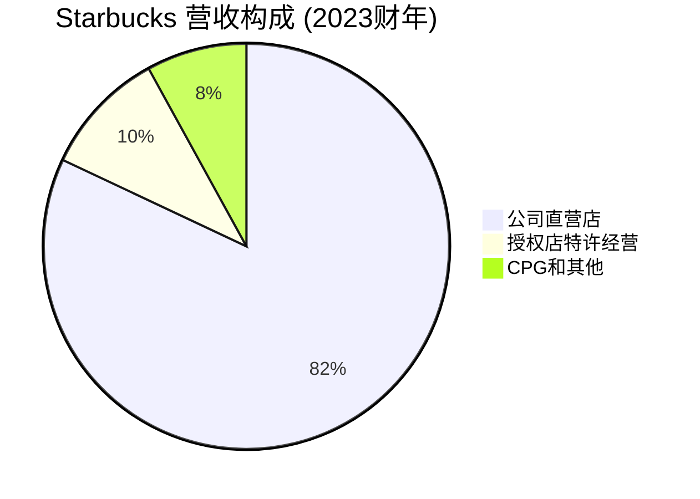
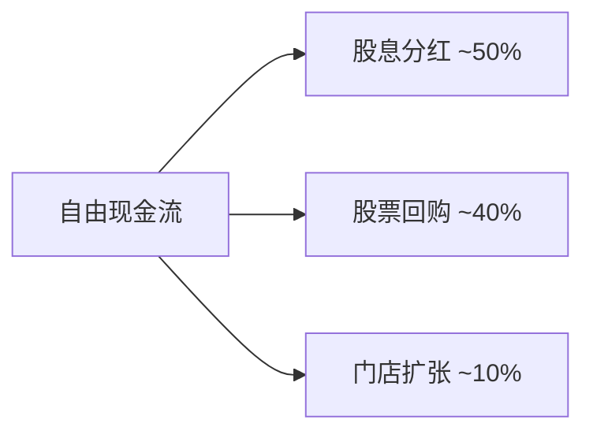

# Starbucks Corporation - 案例研究

## 公司概况

**基本信息**
- **公司名称**: Starbucks Corporation
- **股票代码**: SBUX (NASDAQ)
- **成立时间**: 1971年 (西雅图第一家店), 1987年现代Starbucks成立
- **总部位置**: 美国华盛顿州西雅图
- **创始人**: 杰瑞·鲍德温、泽夫·西格尔、戈登·鲍克 (1971), 霍华德·舒尔茨 (现代Starbucks, 1987)
- **现任CEO**: Laxman Narasimhan (2023年至今)

**主营业务**
- 咖啡饮品 (浓缩咖啡、手冲咖啡、冷萃等)
- 茶饮和其他饮料
- 食品 (糕点、三明治、沙拉等)
- 咖啡豆和周边产品
- 数字产品和会员服务

**市值规模** (截至2024年)
- 市值: ~$1100亿美元
- 全球最大的咖啡连锁企业
- 标普500指数成分股

**上市信息**
- 首次公开募股 (IPO): 1992年6月26日
- IPO价格: $17/股 (调整后约$0.25/股)
- 累计股票分拆: 6次 (1:2)

## 商业模式分析

### 价值主张

Starbucks的核心价值主张:

1. **"第三空间"体验**
   - 家和办公室之外的第三个空间
   - 舒适的社交和工作环境
   - 社区聚会场所

2. **高品质咖啡**
   - 精选咖啡豆
   - 专业咖啡师
   - 一致的产品质量

3. **个性化定制**
   - 超过87,000种饮品组合
   - 满足个人口味偏好
   - 名字写在杯子上的个人化服务

### 客户细分

**主要客户群体**:
- 城市白领 (核心客户)
- 学生群体
- 咖啡爱好者
- 社交聚会人群
- 移动办公人群

**地理分布** (2023财年营收):
- 北美: ~72%
- 国际: ~20%
- 渠道发展 (授权店、CPG): ~8%

### 收入来源

**商业模式特点**:
- **直营为主**: 82%营收来自公司直营店
- **授权模式**: 机场、酒店等特殊场所
- **CPG渠道**: 超市销售咖啡豆和即饮产品
- **数字化**: 移动订单和会员计划

### 成本结构

**主要成本项**:
- **产品成本** (~28% 营收): 咖啡豆、牛奶、食品
- **门店运营** (~45% 营收): 租金、人工、水电
- **管理费用** (~7% 营收): 总部、营销、研发
- **资本支出** (~6% 营收): 新店开设、翻新

**成本优势**:
- 规模采购降低咖啡豆成本
- 标准化运营提升效率
- 数字化降低人工成本
- 品牌效应降低营销成本

### 核心资源

1. **品牌资产**: 全球最有价值咖啡品牌 ($150亿+)
2. **门店网络**: 全球38,000+门店
3. **供应链**: 咖啡豆采购和烘焙网络
4. **会员体系**: Starbucks Rewards 3400万+活跃会员
5. **数字平台**: 移动应用和支付系统

### 关键活动

1. **门店运营**: 标准化的门店管理和服务
2. **产品创新**: 季节性饮品和新品开发
3. **会员运营**: 会员计划和数字化营销
4. **供应链管理**: 咖啡豆采购、烘焙、配送
5. **品牌建设**: 社区参与和企业社会责任

### 关键合作伙伴

**供应商**:
- 全球咖啡豆种植农场
- 乳制品供应商
- 食品供应商

**战略合作**:
- 雀巢 (CPG产品全球分销)
- 阿里巴巴 (中国数字化)
- Uber Eats, DoorDash (外卖配送)

**授权合作伙伴**:
- 机场、酒店、大学校园的授权经营商

## 财务分析

### 收入增长

**10年营收趋势** (单位: 十亿美元, 财年截至9月30日)

| 财年 | 营收 | 同比增长 | 门店数 | 同店销售增长 |
|------|------|----------|--------|--------------|
| 2014 | 16.4 | +11% | 21,366 | +5% |
| 2015 | 19.2 | +17% | 23,043 | +7% |
| 2016 | 21.3 | +11% | 25,085 | +6% |
| 2017 | 22.4 | +5% | 27,339 | +3% |
| 2018 | 24.7 | +10% | 29,324 | +3% |
| 2019 | 26.5 | +7% | 31,256 | +4% |
| 2020 | 23.5 | -11% | 32,660 | -9% |
| 2021 | 29.1 | +24% | 33,833 | +17% |
| 2022 | 32.3 | +11% | 35,711 | +7% |
| 2023 | 35.9 | +11% | 38,038 | +8% |

**关键观察**:
- 2014-2023年复合增长率 (CAGR): ~9%
- 2020年疫情冲击显著，2021年强劲反弹
- 门店数持续增长，全球扩张
- 同店销售增长稳定

### 盈利能力

**关键盈利指标**:

| 指标 | 2019 | 2020 | 2021 | 2022 | 2023 | 行业平均 |
|------|------|------|------|------|------|----------|
| 毛利率 | 27.8% | 25.5% | 28.2% | 27.3% | 28.5% | 25-30% |
| 营业利润率 | 16.0% | 11.8% | 17.2% | 14.3% | 15.8% | 10-15% |
| 净利率 | 12.4% | 8.5% | 14.3% | 11.2% | 12.9% | 8-12% |
| ROE | 55.2% | 43.8% | 115.3% | 87.4% | 108.7% | 20-30% |
| ROA | 15.8% | 10.2% | 18.5% | 14.2% | 16.3% | 8-12% |
| ROIC | 28.5% | 19.2% | 35.8% | 28.7% | 32.1% | 15-20% |

**盈利能力分析**:
1. **稳定的毛利率** (28%): 品牌溢价和运营效率
2. **超高的ROE** (109%): 高利润率和财务杠杆
3. **优秀的ROIC** (32%): 资本使用效率高

### 现金流

**现金流表现** (单位: 十亿美元):

| 财年 | 经营现金流 | 资本支出 | 自由现金流 | FCF利润率 |
|------|------------|----------|------------|-----------|
| 2019 | 5.8 | -1.8 | 4.0 | 15.1% |
| 2020 | 4.2 | -1.4 | 2.8 | 11.9% |
| 2021 | 6.8 | -1.7 | 5.1 | 17.5% |
| 2022 | 5.5 | -2.1 | 3.4 | 10.5% |
| 2023 | 6.7 | -2.2 | 4.5 | 12.5% |

**现金流特点**:
- 稳定的现金生成能力
- 资本支出用于新店开设和翻新
- 现金用于股息和回购
- 门店扩张影响资本支出

**资本配置策略**:

## 竞争分析

### 行业地位

**全球咖啡连锁市场** (市场份额, 2023):
- Starbucks: ~40% (按营收)
- Dunkin': ~8%
- Tim Hortons: ~5%
- Costa Coffee: ~4%
- 其他: ~43%

**关键观察**:
- Starbucks在全球咖啡连锁市场占据主导地位
- 品牌价值和门店数量遥遥领先
- 在高端咖啡市场几乎垄断

### 竞争优势 (护城河分析)

#### 1. 品牌护城河 (★★★★★)

**品牌价值**:
- Interbrand 2023: 全球第50大品牌 ($150亿)
- 品牌认知度: 全球85%+
- "第三空间"概念深入人心

**品牌特质**:
- 高品质咖啡的代名词
- 生活方式品牌
- 社区和社交的象征

**品牌护城河表现**:
- 产品溢价能力强 (比竞品高50-100%)
- 客户忠诚度极高
- 品牌延伸能力强

#### 2. 规模优势 (★★★★★)

**门店规模**:
- 全球38,000+门店
- 覆盖80+国家和地区
- 密集的门店网络

**规模优势**:
- 采购规模降低成本
- 品牌曝光度高
- 便利性优势

#### 3. 会员体系 (★★★★☆)

**Starbucks Rewards**:
- 3400万+活跃会员
- 会员贡献营收55%+
- 会员消费频次和金额更高

**数字化优势**:
- 移动订单占比40%+
- 支付便利性
- 个性化营销

#### 4. 体验护城河 (★★★★☆)

**"第三空间"体验**:
- 舒适的环境设计
- 一致的服务标准
- 社区归属感

**体验优势**:
- 难以复制的氛围
- 客户停留时间长
- 重复购买率高

### 主要竞争对手

#### Dunkin' (唐恩都乐)
- **优势**: 价格竞争力, 快速服务, 东海岸市场强
- **劣势**: 品牌价值低, 体验感弱, 国际化不足
- **竞争领域**: 快速咖啡、早餐

#### Tim Hortons (提姆霍顿斯)
- **优势**: 加拿大市场主导, 价格优势
- **劣势**: 国际化程度低, 品牌老化
- **竞争领域**: 加拿大市场

#### Luckin Coffee (瑞幸咖啡)
- **优势**: 中国市场快速增长, 数字化领先, 价格低
- **劣势**: 品牌信任度受损, 国际化缺失
- **竞争领域**: 中国市场

#### 精品咖啡店
- **优势**: 咖啡品质更高, 本地化特色
- **劣势**: 规模小, 标准化不足
- **竞争领域**: 高端咖啡市场

### 竞争策略

**Starbucks的差异化策略**:
1. **体验至上**: "第三空间"概念
2. **品质保证**: 精选咖啡豆和专业咖啡师
3. **数字化领先**: 移动订单和会员体系
4. **全球化**: 平衡全球扩张和本地化
5. **产品创新**: 季节性饮品和新品类

**竞争优势持续性**: ★★★★★
- 品牌和体验护城河难以复制
- 规模优势不断扩大
- 数字化能力领先

## 投资论点

### 看多理由 (Bull Case)

#### 1. 中国市场增长潜力 (★★★★★)

**增长机会**:
- 中国咖啡市场快速增长 (年增长15%+)
- 门店数从6,000+扩张至9,000+ (目标)
- 中产阶级崛起驱动需求

**投资价值**: 中国市场营收占比提升至20%+

#### 2. 数字化和会员体系 (★★★★★)

**数字化优势**:
- 移动订单占比40%+
- 会员3400万+，贡献营收55%+
- 数据驱动的个性化营销

**投资价值**: 提升客户粘性和利润率

#### 3. 产品创新和高端化 (★★★★☆)

**创新方向**:
- 冷萃咖啡和氮气咖啡
- 植物基饮品
- 酒精饮品 (Starbucks Evenings)

**投资价值**: ASP提升和新客户群体

#### 4. 门店扩张 (★★★★☆)

**扩张计划**:
- 全球门店数目标: 55,000+ (2030年)
- 重点市场: 中国、印度、东南亚
- 新店型: 得来速、快取店

**投资价值**: 营收和利润持续增长

#### 5. 股东回报计划 (★★★★☆)

**资本返还**:
- 年度股息$20亿+
- 股票回购$20亿+/年
- 总返还占FCF 90%+

**投资价值**: 持续回购提升每股价值

### 风险因素 (Bear Case)

#### 1. 竞争加剧 (★★★★☆)

**挑战**:
- 中国市场Luckin Coffee快速增长
- 精品咖啡店分流高端客户
- 快餐连锁进入咖啡市场

**影响**: 市场份额和利润率压力

#### 2. 成本上涨 (★★★★☆)

**挑战**:
- 咖啡豆价格波动
- 人工成本上涨
- 租金成本增加

**影响**: 毛利率压力

#### 3. 消费者偏好变化 (★★★☆☆)

**挑战**:
- 健康意识提升，减少咖啡因摄入
- 年轻消费者偏好变化
- 在家办公减少门店客流

**影响**: 同店销售增长放缓

#### 4. 中国市场风险 (★★★☆☆)

**挑战**:
- 本土竞争对手崛起
- 经济增长放缓
- 消费降级趋势

**影响**: 中国营收增长不及预期

#### 5. 估值风险 (★★★☆☆)

**当前估值** (2024年初):
- P/E: ~28x
- P/S: ~3.0x
- 估值处于历史中高位

**影响**: 估值回归可能导致股价下跌

### 投资建议

**目标价区间**: $95-105 (基于2024年初$100价格)

**情景分析**:

| 情景 | 概率 | 目标价 | 回报率 | 关键假设 |
|------|------|--------|--------|----------|
| 乐观 | 25% | $120 | +20% | 中国强劲增长, 数字化成功, 利润率改善 |
| 基准 | 50% | $102 | +2% | 稳定增长, 门店扩张, 股息持续 |
| 悲观 | 25% | $80 | -20% | 竞争加剧, 成本上涨, 中国放缓 |

**期望回报**: (25%×20%) + (50%×2%) + (25%×-20%) = +1.0%

**投资评级**: **持有** (Hold)

**理由**:
- ✅ 强大的品牌和体验护城河
- ✅ 中国市场增长潜力
- ✅ 数字化和会员体系领先
- ⚠️ 估值不便宜
- ⚠️ 竞争加剧
- ⚠️ 成本上涨压力

**适合投资者**:
- 长期成长投资者
- 相信体验经济的投资者
- 看好中国市场的投资者

**不适合投资者**:
- 对估值敏感的价值投资者
- 短期交易者
- 对竞争担忧的投资者

## 历史表现

### 股价走势

**长期表现** (调整后股价):
- 1992年IPO: $0.25
- 2000年: $2.00
- 2010年: $10.00
- 2020年: $85.00
- 2024年: $100.00

**累计回报**:
- IPO至今 (32年): +40,000%
- 过去20年: +5,000%
- 过去10年: +900%
- 过去5年: +60%

**年化回报率**:
- 32年: ~21% CAGR
- 20年: ~21% CAGR
- 10年: ~26% CAGR
- 5年: ~10% CAGR

### 与指数对比

**相对表现** (过去10年):

| 期间 | SBUX | S&P 500 | 超额回报 |
|------|------|---------|----------|
| 2014-2024 | +900% | +180% | +720% |
| 2019-2024 | +60% | +80% | -20% |

**观察**:
- 2014-2019年大幅跑赢大盘
- 2020-2024年表现落后 (疫情冲击和复苏慢)

## 关键学习点

### 1. "第三空间"的价值

**核心洞察**: Starbucks创造的不仅是咖啡，更是一种生活方式和社交空间。

**"第三空间"概念**:
- 家 (第一空间) 和办公室 (第二空间) 之外
- 舒适、放松、社交的场所
- 社区归属感

**投资启示**: 体验经济创造的价值超越产品本身

### 2. 品牌溢价的力量

**核心洞察**: Starbucks咖啡价格比竞品高50-100%，但客户愿意支付。

**溢价来源**:
- 品牌价值
- 体验价值
- 便利性价值

**投资启示**: 强大的品牌可以支撑高溢价

### 3. 数字化转型的价值

**核心洞察**: 移动订单和会员体系提升客户体验和运营效率。

**数字化成果**:
- 移动订单占比40%+
- 会员3400万+
- 减少排队时间，提升翻台率

**投资启示**: 数字化是传统零售的必经之路

### 4. 标准化与本地化的平衡

**核心洞察**: 全球统一的品牌形象，但产品适应本地口味。

**平衡策略**:
- 核心产品全球统一
- 季节性和地区性产品本地化
- 门店设计融入本地文化

**投资启示**: 全球化企业需要平衡标准化和本地化

### 5. 会员体系的价值

**核心洞察**: Starbucks Rewards创造了强大的客户粘性。

**会员价值**:
- 会员贡献营收55%+
- 会员消费频次和金额更高
- 数据驱动的个性化营销

**投资启示**: 会员体系是零售企业的核心竞争力

### 6. 门店密度的网络效应

**核心洞察**: 密集的门店网络创造便利性优势。

**网络效应**:
- 门店越多，便利性越高
- 便利性越高，客户越多
- 客户越多，开更多门店的经济性越好

**投资启示**: 门店网络具有网络效应

### 7. 社会责任与品牌价值

**核心洞察**: Starbucks的社会责任实践提升品牌价值。

**社会责任**:
- 公平贸易咖啡豆
- 环保包装和可持续发展
- 员工福利 (医疗保险、股票期权)

**投资启示**: 社会责任是长期品牌建设的一部分

### 8. 创始人精神的重要性

**核心洞察**: 霍华德·舒尔茨两次回归拯救Starbucks。

**创始人贡献**:
- 2008年回归，应对金融危机
- 2022年再次回归，应对运营挑战
- 保持品牌初心和文化

**投资启示**: 创始人精神对企业长期发展至关重要

## 延伸阅读

### 推荐书籍

1. **《将心注入》** - 霍华德·舒尔茨
   - Starbucks创始人自传
   - 品牌建设和企业文化

2. **《一路向前》** - 霍华德·舒尔茨
   - 2008年回归后的变革
   - 危机管理和品牌重塑

3. **《星巴克体验》** - Joseph Michelli
   - Starbucks服务理念
   - 客户体验管理

### 相关案例

- [Coca-Cola - 品牌护城河](./coca-cola.html)
- [Nike - 品牌与文化](./nike.html)
- [Apple - 体验经济](../tech-giants/apple.html)
- [经济护城河分析](../../competitive-analysis/economic-moats.html)
- [订阅模式](../../business-models/subscription-models.html)

## 参考文献

1. Starbucks Corporation Annual Reports (2014-2023)
2. Starbucks Corporation 10-K Filings, SEC
3. Schultz, H. (1997). *Pour Your Heart Into It*. Hyperion
4. Schultz, H. (2011). *Onward*. Rodale Books
5. Michelli, J. (2006). *The Starbucks Experience*. McGraw-Hill
6. Behar, H. (2007). *It's Not About the Coffee*. Portfolio
7. Interbrand Best Global Brands Report (2023)
8. Technomic Coffee Market Reports (2023)
9. Morgan Stanley Restaurant Research (2020-2023)
10. Goldman Sachs Coffee Chain Research (2023)

---

**最后更新**: 2024年1月16日  
**下次审查**: 2024年7月16日  
**数据截止**: 2023财年 (2023年10月1日)

**免责声明**: 本案例研究仅供教育和学习目的，不构成投资建议。投资决策应基于个人研究和专业咨询。
