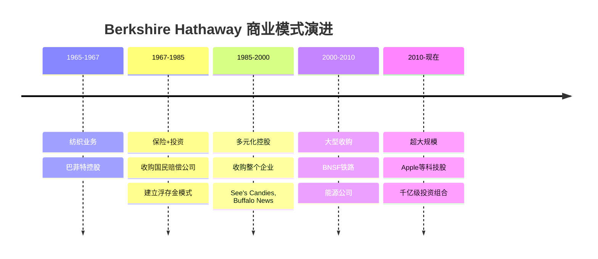
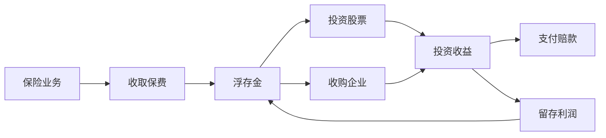
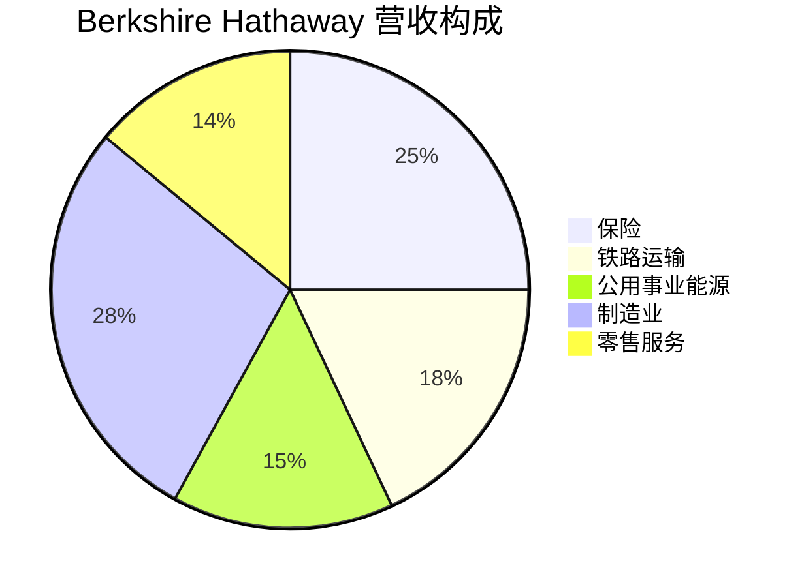

# Berkshire Hathaway - 案例研究

## 公司概况

**基本信息**
- **公司名称**: Berkshire Hathaway Inc.
- **股票代码**: BRK.A / BRK.B (NYSE)
- **成立时间**: 1839年（纺织公司），1965年巴菲特控股
- **总部位置**: 美国内布拉斯加州奥马哈
- **董事长兼CEO**: 沃伦·巴菲特 (Warren Buffett, 1965年至今)
- **副董事长**: 查理·芒格 (Charlie Munger, 1978-2023)

**主营业务**
- 保险业务（GEICO、General Re、Berkshire Hathaway Reinsurance）
- 铁路运输（BNSF Railway）
- 公用事业和能源（Berkshire Hathaway Energy）
- 制造业（精密铸件、工业产品、建筑产品）
- 零售业（See's Candies、Nebraska Furniture Mart、汽车经销商）
- 服务业（NetJets、飞行安全国际）
- 股票投资组合（Apple、Bank of America、Coca-Cola等）

**市值规模** (截至2024年)
- 市值: ~$9000亿美元
- 全球市值前十大公司
- 标普500指数重要成分股

**上市信息**
- 纽约证券交易所上市
- A类股票 (BRK.A): ~$620,000/股（从不分拆）
- B类股票 (BRK.B): ~$410/股（1:1500比例）
- 从不支付股息，所有利润再投资

## 商业模式分析

### 价值主张

Berkshire Hathaway的独特价值主张：

1. **永久资本结构**
   - 保险浮存金提供低成本资本
   - 不支付股息，利润全部再投资
   - 长期持有优质企业
   - 不受季度业绩压力

2. **去中心化管理**
   - 子公司高度自治
   - 总部仅25人
   - 管理层专注经营
   - 最小化官僚主义

3. **资本配置能力**
   - 巴菲特的投资智慧
   - 跨行业配置资本
   - 收购整个企业或股权投资
   - 机会主义投资策略

### 商业模式演进

### 核心商业模式：保险+投资

**保险浮存金模式**:

**浮存金优势**:
- 成本低于零（承保盈利时）
- 规模巨大（$1650亿+）
- 期限长（长尾险种）
- 稳定增长

**投资策略**:
1. **股票投资**: 集中持有优质公司（Apple、Bank of America等）
2. **整体收购**: 收购优秀企业永久持有
3. **特殊交易**: 优先股、可转债、特殊情况投资

### 收入来源

**营收构成** (2023年):

**利润来源** (更重要):
- 投资收益（已实现+未实现）
- 保险承保利润
- 运营企业利润
- 利息和股息收入

**商业模式特点**:
- 多元化收入来源，降低风险
- 保险浮存金提供低成本资本
- 运营企业产生稳定现金流
- 投资收益是长期价值核心

### 资本配置框架

**巴菲特的资本配置优先级**:

1. **维持流动性**: 保持$300-400亿现金
2. **再投资运营企业**: 支持子公司增长
3. **收购整个企业**: 符合标准的优质企业
4. **股票投资**: 市场低估时买入优质股票
5. **股票回购**: 价格低于内在价值时回购
6. **特殊交易**: 危机时的特殊投资机会

**收购标准**（巴菲特的清单）:
- ✅ 业务简单易懂
- ✅ 持续稳定的经营历史
- ✅ 长期良好的前景
- ✅ 诚实能干的管理层
- ✅ 合理的价格
- ✅ 高资本回报率
- ✅ 不需要过多资本支出

## 财务分析

### 收入增长

**营收趋势** (单位: 十亿美元)

| 年份 | 营收 | 同比增长 | 保险营收 | 投资收益 |
|------|------|----------|----------|----------|
| 2014 | 194 | +9% | 47 | 11 |
| 2015 | 211 | +9% | 51 | 12 |
| 2016 | 224 | +6% | 54 | 14 |
| 2017 | 242 | +8% | 58 | 16 |
| 2018 | 247 | +2% | 61 | 18 |
| 2019 | 255 | +3% | 64 | 21 |
| 2020 | 245 | -4% | 66 | 24 |
| 2021 | 276 | +13% | 71 | 28 |
| 2022 | 302 | +9% | 76 | 32 |
| 2023 | 364 | +21% | 83 | 38 |

**关键观察**:
- 2014-2023年复合增长率: ~7%
- 保险业务稳定增长
- 投资收益波动较大（市场相关）
- 2023年强劲增长（经济复苏）

### 盈利能力

**关键盈利指标**:

| 指标 | 2019 | 2020 | 2021 | 2022 | 2023 |
|------|------|------|------|------|------|
| 营业利润 | 24B | 22B | 28B | 31B | 37B |
| 净利润 | 81B | 43B | 90B | -23B | 96B |
| ROE | 11% | 6% | 13% | -3% | 14% |
| ROA | 6% | 3% | 6% | -2% | 7% |

**注意**: 净利润包含未实现投资收益，波动大

**经营利润** (更能反映真实盈利能力):
- 2023年经营利润: $370亿
- 保险承保利润: $50亿
- 铁路运营利润: $55亿
- 公用事业利润: $35亿
- 制造业利润: $120亿

**盈利能力分析**:
- 经营利润稳定增长
- 保险业务持续承保盈利（罕见）
- 多元化业务降低波动
- 投资收益是长期价值核心

### 浮存金分析

**浮存金增长** (单位: 十亿美元):

| 年份 | 浮存金 | 增长 | 承保成本 |
|------|--------|------|----------|
| 2000 | 28 | - | 负成本 |
| 2005 | 49 | +75% | 负成本 |
| 2010 | 66 | +35% | 负成本 |
| 2015 | 88 | +33% | 负成本 |
| 2020 | 138 | +57% | 负成本 |
| 2023 | 169 | +22% | 负成本 |

**浮存金的威力**:
- 23年间增长6倍
- 成本为负（承保盈利）
- 相当于$1690亿无息贷款
- 巴菲特称之为"最美妙的资金来源"

**承保纪律**:
- 连续21年承保盈利（2001-2023）
- 累计承保利润$500亿+
- 行业罕见的纪录

### 投资组合分析

**股票投资组合** (2023年底，前十大持仓):

| 公司 | 市值(亿美元) | 占比 | 成本(亿美元) | 收益率 |
|------|--------------|------|--------------|--------|
| Apple | 1740 | 48% | 360 | +383% |
| Bank of America | 340 | 9% | 145 | +134% |
| American Express | 280 | 8% | 13 | +2054% |
| Coca-Cola | 250 | 7% | 13 | +1823% |
| Chevron | 190 | 5% | 260 | -27% |
| Occidental Petroleum | 140 | 4% | 110 | +27% |
| Moody's | 90 | 2% | 2.5 | +3500% |
| Kraft Heinz | 110 | 3% | 98 | +12% |
| Citigroup | 30 | 1% | 25 | +20% |
| 其他 | 480 | 13% | - | - |

**投资组合特点**:
- 高度集中：前5大占77%
- 长期持有：可口可乐持有36年
- 优质企业：高ROE、强护城河
- 简单易懂：消费、金融、能源

**投资风格演进**:
- 早期：烟蒂股（便宜但平庸）
- 中期：优质企业合理价（可口可乐）
- 近期：科技股（Apple）

### 现金流

**现金流表现** (单位: 十亿美元):

| 年份 | 经营现金流 | 投资现金流 | 自由现金流 |
|------|------------|------------|------------|
| 2019 | 35 | -15 | 20 |
| 2020 | 38 | -8 | 30 |
| 2021 | 42 | -25 | 17 |
| 2022 | 45 | -18 | 27 |
| 2023 | 52 | -22 | 30 |

**现金流特点**:
- 经营现金流稳定增长
- 投资现金流用于收购和投资
- 保持充足现金储备（$1500亿+）

### 财务健康

**资产负债表** (2023年底，单位: 十亿美元):

**资产**:
- 现金及等价物: $167
- 股票投资: $354
- 固定资产: $280
- 其他资产: $200
- 总资产: $1,001

**负债**:
- 保险浮存金: $169
- 债务: $130
- 其他负债: $50
- 总负债: $349

**股东权益**: $652

**财务比率**:
- 债务/权益: 0.20（低杠杆）
- 现金/总资产: 17%（充足流动性）
- 保险浮存金/权益: 0.26

**财务健康评估**:
- ✅ 现金储备充足
- ✅ 债务水平低
- ✅ 信用评级: AA+ (标普)
- ✅ 财务灵活性极强

## 竞争分析

### 行业地位

**保险业**:
- GEICO: 美国第二大汽车保险公司（市场份额14%）
- General Re: 全球领先再保险公司
- Berkshire Hathaway Reinsurance: 超大型风险承保

**铁路运输**:
- BNSF: 美国最大货运铁路之一
- 市场份额: ~30%（西部地区）

**能源公用事业**:
- Berkshire Hathaway Energy: 美国领先能源公司
- 可再生能源投资领先

**投资公司**:
- 全球最成功的投资公司之一
- 60年年化回报率19.8%

### 竞争优势（护城河分析）

#### 1. 资本成本优势 (★★★★★)

**浮存金优势**:
- 成本: 负成本（承保盈利）
- 规模: $1690亿
- 期限: 长期稳定
- 对比: 银行借款成本5-7%

**计算优势**:
- 每年节省资本成本: $85-120亿
- 60年累计优势: 数千亿美元

#### 2. 管理层优势 (★★★★★)

**巴菲特+芒格**:
- 投资智慧: 60年成功记录
- 资本配置: 世界级能力
- 声誉: 吸引优质交易
- 文化: 长期主义、诚信

**继任计划**:
- Greg Abel: 非保险业务负责人
- Ajit Jain: 保险业务负责人
- Todd Combs & Ted Weschler: 投资经理

#### 3. 企业文化优势 (★★★★☆)

**独特文化**:
- 去中心化管理
- 长期主义
- 诚信至上
- 节俭高效

**吸引力**:
- 优秀企业家愿意卖给Berkshire
- 管理层愿意留任
- 员工忠诚度高

#### 4. 规模优势 (★★★★☆)

**资本规模**:
- 总资产$1万亿
- 可投资资本$5000亿+
- 能够进行超大型交易

**多元化**:
- 跨行业配置风险
- 经济周期平滑
- 抗风险能力强

#### 5. 品牌声誉 (★★★★☆)

**Berkshire品牌**:
- 诚信可靠
- 长期合作伙伴
- 不干预管理
- 快速决策

**交易优势**:
- 获得优先交易机会
- 谈判优势
- 融资优势

### 主要竞争对手

#### 保险业务
- **State Farm**: 市场份额更大
- **Progressive**: 增长更快
- **Allstate**: 规模相当

**Berkshire优势**: 承保纪律、浮存金利用

#### 投资业务
- **对冲基金**: 更灵活，但成本高
- **私募股权**: 专注收购，但期限限制
- **主权基金**: 规模大，但政治约束

**Berkshire优势**: 永久资本、低成本、灵活性

## 投资论点

### 看多理由 (Bull Case)

#### 1. 永久资本结构 (★★★★★)

**独特优势**:
- 无赎回压力
- 无季度业绩压力
- 可以长期持有
- 危机时是买家

**价值**:
- 能够在危机中获得最佳交易
- 长期复利威力
- 不被迫卖出优质资产

#### 2. 浮存金持续增长 (★★★★★)

**增长潜力**:
- 保险业务持续扩张
- GEICO市场份额提升空间
- 再保险业务增长

**价值创造**:
- 每增加$100亿浮存金
- 相当于获得$100亿无息贷款
- 年化价值$5-7亿

#### 3. 投资组合价值 (★★★★★)

**当前持仓**:
- Apple: 成本$360亿，市值$1740亿
- 可口可乐: 成本$13亿，市值$250亿
- American Express: 成本$13亿，市值$280亿

**未来潜力**:
- 优质公司持续增长
- 股息收入增加
- 复利效应

#### 4. 运营企业价值 (★★★★☆)

**优质资产**:
- BNSF: 不可替代的铁路网络
- BHE: 能源转型受益
- 制造业: 多元化、稳定

**价值**:
- 年产生$300-400亿经营利润
- 稳定现金流
- 再投资机会

#### 5. 股票回购 (★★★★☆)

**回购策略**:
- 价格低于内在价值时回购
- 2020-2023年回购$500亿+
- 提升每股价值

**效果**:
- 流通股减少
- 每股收益提升
- 股东价值增加

### 风险因素 (Bear Case)

#### 1. 继任风险 (★★★★☆)

**挑战**:
- 巴菲特93岁（2023）
- 无人能完全替代
- 投资业绩可能下降

**缓解**:
- 继任计划清晰
- Greg Abel能力强
- 投资团队建立

#### 2. 规模诅咒 (★★★★☆)

**问题**:
- 资产规模$1万亿
- 难以找到足够大的投资机会
- 小型投资对业绩影响小

**影响**:
- 回报率可能下降
- 现金积累过多
- 增长放缓

#### 3. 估值不便宜 (★★★☆☆)

**当前估值**:
- P/B: 1.5x（历史平均1.3x）
- 不再是"便宜货"
- 市场认可度高

#### 4. 监管风险 (★★☆☆☆)

**潜在风险**:
- 保险业监管加强
- 反垄断审查
- 税收政策变化

#### 5. 经济周期风险 (★★★☆☆)

**敞口**:
- 铁路运输（经济敏感）
- 制造业（周期性）
- 保险（灾害风险）

**缓解**: 多元化、强大资本

### 估值分析

#### 账面价值法

**计算**:
- 股东权益: $6520亿
- 流通股: 13.5亿股（B股等价）
- 每股账面价值: $483

**市净率**:
- 当前P/B: 1.5x
- 历史平均: 1.3x
- 历史区间: 1.0-2.0x

#### 分部估值法

**投资组合**: $3540亿（市值）
**运营企业**: 
- BNSF: $1500亿（估值）
- BHE: $800亿
- 制造业: $1000亿
- 其他: $500亿
- 小计: $3800亿

**总价值**: $7340亿
**当前市值**: $9000亿
**溢价**: 23%

**溢价合理性**:
- 浮存金价值
- 管理层价值
- 品牌价值
- 资本配置能力

#### 历史回报法

**历史表现**:
- 1965-2023年年化回报: 19.8%
- 同期标普500: 10.2%
- 超额回报: 9.6%/年

**未来预期**:
- 规模增大，回报率下降
- 预期年化回报: 10-12%
- 仍可跑赢大盘

### 投资建议

**目标价区间**: $450-500 (B股)

**情景分析**:

| 情景 | 概率 | 回报率 | 关键假设 |
|------|------|--------|----------|
| 乐观 | 25% | +15%/年 | 优秀继任、大型收购、市场低迷买入机会 |
| 基准 | 50% | +10%/年 | 稳定增长、持续回购、跑赢大盘 |
| 悲观 | 25% | +5%/年 | 继任问题、规模限制、估值压缩 |

**期望回报**: 10%/年

**投资评级**: **买入** (Buy)

**理由**:
- ✅ 独特的商业模式
- ✅ 强大的竞争优势
- ✅ 优秀的管理层
- ✅ 合理的估值
- ✅ 长期价值创造能力
- ⚠️ 继任风险需关注

**适合投资者**:
- 长期价值投资者（10年+）
- 追求稳健回报的投资者
- 相信巴菲特哲学的投资者
- 希望一站式投资的投资者

## 历史表现

### 股价走势

**长期表现** (A股):
- 1965年: $19
- 1980年: $375
- 1990年: $7,175
- 2000年: $71,000
- 2010年: $120,000
- 2020年: $350,000
- 2023年: $620,000

**累计回报**:
- 58年: +3,260,000%
- 年化回报率: 19.8%

**对比标普500**:
- Berkshire: +3,260,000%
- S&P 500: +24,700%
- 超额回报: 130倍

### 关键里程碑

**1965-1985**: 纺织转型
- 1965: 巴菲特控股
- 1967: 收购国民赔偿公司
- 1972: 收购See's Candies
- 1977: 收购Buffalo News

**1985-2000**: 多元化扩张
- 1988: 可口可乐投资
- 1989: 吉列投资
- 1998: 收购General Re

**2000-2010**: 大型收购
- 2003: Clayton Homes
- 2006: 以色列金属加工
- 2009: BNSF铁路（$340亿）

**2010-现在**: 超大规模
- 2011: IBM投资（后退出）
- 2016: Apple投资（最成功）
- 2020-2023: 大规模回购

## 关键学习点

### 1. 浮存金的威力

**核心洞察**: 保险浮存金是最完美的融资工具。

**关键要素**:
- 成本为负（承保盈利）
- 规模巨大（$1690亿）
- 期限长（长尾险种）
- 稳定增长

**投资启示**:
- 寻找具有类似"浮存金"特征的商业模式
- 低成本资本是巨大优势
- 承保纪律至关重要

### 2. 资本配置的艺术

**核心洞察**: 资本配置能力是CEO最重要的技能。

**巴菲特的配置智慧**:
- 耐心等待好机会
- 集中投资优质资产
- 长期持有
- 不追逐热点

**投资启示**:
- 评估管理层的资本配置记录
- 资本配置比运营能力更重要
- 长期复利威力巨大

### 3. 简单易懂的重要性

**核心洞察**: 只投资自己理解的业务。

**巴菲特的能力圈**:
- 消费品（可口可乐、See's）
- 金融（保险、银行）
- 基础设施（铁路、能源）
- 避开复杂科技（早期）

**投资启示**:
- 定义自己的能力圈
- 在能力圈内投资
- 不懂不投

### 4. 长期主义的胜利

**核心洞察**: 时间是优秀企业的朋友。

**长期持有案例**:
- 可口可乐: 持有36年，回报19倍
- American Express: 持有30年，回报21倍
- Moody's: 持有25年，回报35倍

**投资启示**:
- 买入优质企业并长期持有
- 不要频繁交易
- 让复利发挥作用

### 5. 护城河的重要性

**核心洞察**: 持久竞争优势是长期回报的关键。

**Berkshire投资的护城河**:
- 品牌: 可口可乐、Apple
- 规模: BNSF、GEICO
- 转换成本: American Express
- 网络效应: Apple生态

**投资启示**:
- 寻找具有宽护城河的企业
- 护城河随时间加深更好
- 护城河保护高回报率

### 6. 管理层的重要性

**核心洞察**: 优秀管理层创造长期价值。

**巴菲特看重的品质**:
- 诚信
- 能力
- 对股东友好
- 热爱事业

**投资启示**:
- 评估管理层品格和能力
- 避开不诚信的管理层
- 管理层激励要与股东一致

### 7. 价格与价值的区别

**核心洞察**: 价格是你支付的，价值是你得到的。

**巴菲特的估值原则**:
- 计算内在价值
- 要求安全边际
- 耐心等待好价格
- 不追高

**投资启示**:
- 学会估值
- 不要为增长支付过高价格
- 市场先生是仆人不是主人

### 8. 去中心化管理

**核心洞察**: 信任和授权释放潜力。

**Berkshire模式**:
- 总部仅25人
- 子公司高度自治
- 管理层长期激励
- 最小化官僚主义

**投资启示**:
- 评估公司治理结构
- 去中心化可以更高效
- 信任文化创造价值

## 延伸阅读

### 推荐书籍

1. **《巴菲特致股东的信》** - 沃伦·巴菲特
   - 投资智慧的精华
   - 必读经典

2. **《滚雪球：沃伦·巴菲特和他的财富人生》** - Alice Schroeder
   - 巴菲特权威传记
   - 深入了解其投资哲学

3. **《穷查理宝典》** - 查理·芒格
   - 芒格的智慧
   - 多元思维模型

4. **《巴菲特之道》** - Robert Hagstrom
   - 系统解析巴菲特投资方法
   - 案例丰富

5. **《巴菲特的护城河》** - Pat Dorsey
   - 竞争优势分析
   - 护城河识别

### 推荐文章

1. **Berkshire Hathaway年报**
   - 巴菲特致股东信
   - 链接: [Berkshire Hathaway](https://www.berkshirehathaway.com)

2. **巴菲特在哥伦比亚大学的演讲**
   - 价值投资原则
   - 经典演讲

3. **芒格在南加州大学的演讲**
   - 人类误判心理学
   - 思维模型

### 相关案例

- [JPMorgan Chase - 银行业案例](./jpmorgan.html)
- [Visa - 支付网络案例](./visa.html)
- [价值投资方法论](../../../04-investment-system/value-investing/buffett-evolution.html)
- 保险业务模式

## 参考文献

1. Berkshire Hathaway Annual Reports (1965-2023)
2. Buffett, W. (2023). *Letters to Shareholders*. Berkshire Hathaway
3. Schroeder, A. (2008). *The Snowball: Warren Buffett and the Business of Life*. Bantam
4. Munger, C. (2005). *Poor Charlie's Almanack*. Walsworth Publishing
5. Hagstrom, R. (2013). *The Warren Buffett Way*. Wiley
6. Dorsey, P. (2008). *The Little Book That Builds Wealth*. Wiley
7. Lowenstein, R. (2008). *Buffett: The Making of an American Capitalist*. Random House
8. Cunningham, L. (2013). *The Essays of Warren Buffett*. Carolina Academic Press
9. Frazzini, A., Kabiller, D., & Pedersen, L. (2018). "Buffett's Alpha". *Financial Analysts Journal*
10. Berkshire Hathaway 10-K Filings, SEC
11. GEICO Market Share Reports (2023)
12. S&P Credit Ratings: Berkshire Hathaway (2023)
13. Morningstar: "Berkshire Hathaway: The Ultimate Conglomerate" (2023)
14. Value Investors Club: Berkshire Hathaway Analysis (2020-2023)
15. Columbia Business School: "The Superinvestors of Graham-and-Doddsville" (1984)

---

**最后更新**: 2024年1月20日  
**下次审查**: 2024年7月20日  
**数据截止**: 2023年12月31日

**免责声明**: 本案例研究仅供教育和学习目的，不构成投资建议。投资决策应基于个人研究和专业咨询。

## 深度分析

### 核心机制解析

理解本主题需要从多个维度进行系统性分析。以下从理论基础、实践应用和历史验证三个层面展开深度探讨。

**理论基础层面**：本主题的核心逻辑建立在经济学和金融学的基本原理之上。通过对基础理论的深入理解，投资者能够建立起稳固的分析框架，避免被市场短期噪音所干扰。

**实践应用层面**：理论必须与实践相结合才能产生价值。在实际投资决策中，需要将抽象的概念转化为具体的分析工具和决策标准。

**历史验证层面**：金融市场有着丰富的历史记录，通过研究历史案例，我们可以验证理论的有效性，并从中提炼出具有普遍意义的规律。

### 关键影响因素

影响本主题的关键因素可以从以下几个维度进行分析：

1. **宏观经济环境**：利率水平、通货膨胀率、经济增长速度等宏观变量对本主题有着深远影响。在不同的宏观经济周期中，相关指标的表现会呈现出显著差异。

2. **市场结构因素**：市场参与者的构成、信息传播机制、流动性状况等市场结构因素决定了价格发现的效率和准确性。

3. **政策监管环境**：政府政策、监管框架的变化会直接影响相关市场的运作规则和参与者行为。

4. **技术创新驱动**：技术进步不断改变着金融市场的运作方式，从算法交易到区块链技术，每一次技术革新都带来新的机遇和挑战。

5. **全球化与地缘政治**：在全球化背景下，各国市场之间的联动性日益增强，地缘政治风险的影响也越来越不可忽视。

### 量化分析框架

为了更精确地分析和评估，可以采用以下量化框架：

| 分析维度 | 关键指标 | 参考基准 | 分析方法 |
|---------|---------|---------|---------|
| 规模评估 | 绝对值与相对值 | 历史均值 | 趋势分析 |
| 质量评估 | 稳定性指标 | 行业对标 | 横向比较 |
| 风险评估 | 波动率指标 | 风险阈值 | 情景分析 |
| 价值评估 | 估值倍数 | 历史区间 | 回归分析 |

通过系统性地应用上述框架，投资者可以对目标进行全面、客观的评估，从而做出更加理性的投资决策。

