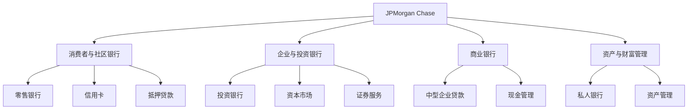
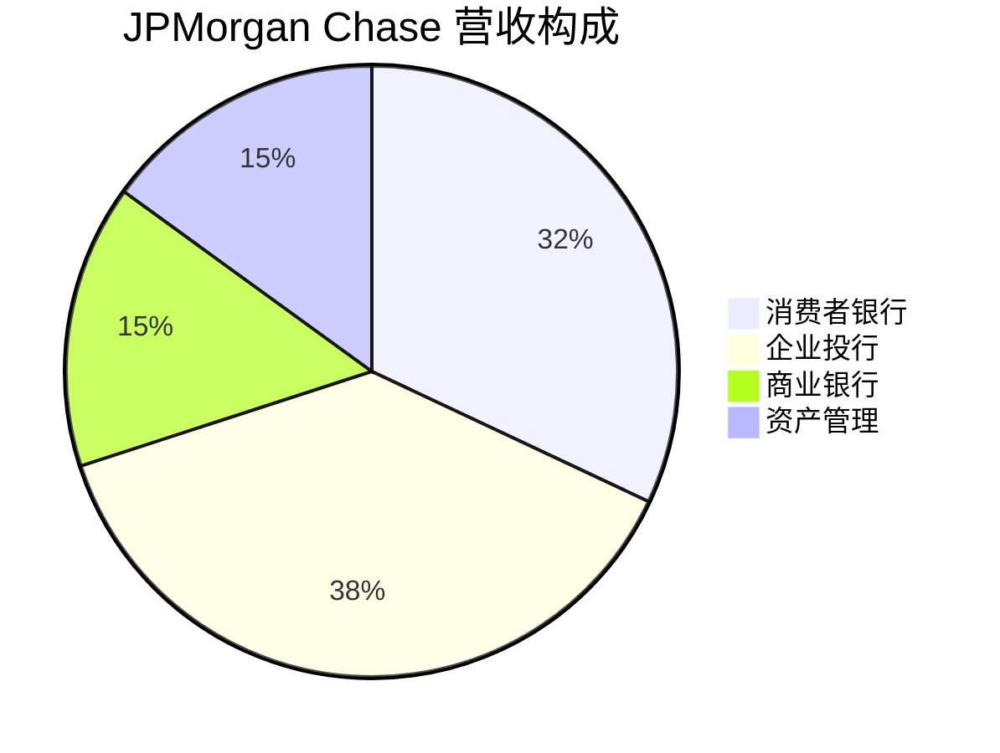

# JPMorgan Chase - 案例研究

## 公司概况

**基本信息**
- **公司名称**: JPMorgan Chase & Co.
- **股票代码**: JPM (NYSE)
- **成立时间**: 1799年（前身），2000年合并成立
- **总部位置**: 美国纽约市
- **董事长兼CEO**: 杰米·戴蒙 (Jamie Dimon, 2005年至今)

**主营业务**
- 消费者与社区银行（零售银行、信用卡）
- 企业与投资银行（投资银行、资本市场）
- 商业银行（中型企业银行服务）
- 资产与财富管理（私人银行、资产管理）

**市值规模** (截至2024年)
- 市值: ~$5500亿美元
- 美国最大银行
- 全球市值最大银行

**上市信息**
- 纽约证券交易所上市
- 道琼斯工业平均指数成分股
- 标普500指数重要成分股

## 商业模式分析

### 价值主张

JPMorgan Chase的核心价值主张：

1. **全方位金融服务**
   - 个人银行到投资银行
   - 一站式金融解决方案
   - 全球网络覆盖

2. **稳健可靠**
   - 强大的资本实力
   - 严格的风险管理
   - 危机中的避风港

3. **创新与科技**
   - 数字银行领先
   - 金融科技投资
   - 客户体验优化

### 业务板块结构

### 收入来源

**营收构成** (2023年):

**收入类型**:
- **净利息收入** (~55%): 存贷款利差
- **非利息收入** (~45%): 
  - 投资银行费用
  - 资产管理费
  - 交易收入
  - 信用卡费用

**商业模式特点**:
- 多元化收入来源
- 利率敏感性
- 周期性与稳定性结合
- 规模优势明显

### 核心资源

1. **资本实力**: 总资产$3.9万亿，资本充足率高
2. **品牌声誉**: 全球最受信赖的银行之一
3. **客户基础**: 6000万+消费者，数百万企业客户
4. **全球网络**: 100+国家和地区
5. **人才团队**: 30万+员工，顶尖金融人才
6. **技术平台**: 年投资$150亿于科技

### 关键活动

1. **存贷款业务**: 吸收存款，发放贷款
2. **投资银行**: 承销、并购顾问
3. **资产管理**: 管理$3.2万亿资产
4. **交易业务**: 固定收益、外汇、大宗商品
5. **风险管理**: 信用风险、市场风险、操作风险
6. **科技创新**: 数字银行、区块链、AI

## 财务分析

### 收入增长

**营收趋势** (单位: 十亿美元)

| 年份 | 营收 | 同比增长 | 净利息收入 | 非利息收入 |
|------|------|----------|------------|------------|
| 2014 | 95 | +5% | 48 | 47 |
| 2015 | 94 | -1% | 47 | 47 |
| 2016 | 96 | +2% | 48 | 48 |
| 2017 | 101 | +5% | 51 | 50 |
| 2018 | 111 | +10% | 55 | 56 |
| 2019 | 116 | +5% | 58 | 58 |
| 2020 | 120 | +3% | 55 | 65 |
| 2021 | 122 | +2% | 52 | 70 |
| 2022 | 128 | +5% | 66 | 62 |
| 2023 | 158 | +23% | 89 | 69 |

**关键观察**:
- 2014-2023年复合增长率: ~6%
- 2023年强劲增长（利率上升）
- 净利息收入大幅增长
- 非利息收入相对稳定

### 盈利能力

**关键盈利指标**:

| 指标 | 2019 | 2020 | 2021 | 2022 | 2023 |
|------|------|------|------|------|------|
| 净利润(亿美元) | 365 | 295 | 485 | 375 | 495 |
| ROE | 15% | 11% | 18% | 14% | 17% |
| ROA | 1.2% | 0.9% | 1.4% | 1.1% | 1.3% |
| 效率比率 | 55% | 58% | 52% | 56% | 51% |
| 净息差 | 2.5% | 1.9% | 1.7% | 2.1% | 2.5% |

**盈利能力分析**:
- ROE稳定在15%左右（优秀水平）
- 2023年盈利创历史新高
- 效率比率改善（成本控制）
- 净息差受利率环境影响

### 资产负债表

**资产** (2023年底，单位: 十亿美元):
- 现金及存放央行: $900
- 证券投资: $700
- 贷款: $1,300
- 其他资产: $1,000
- 总资产: $3,900

**负债**:
- 存款: $2,400
- 借款: $500
- 其他负债: $700
- 总负债: $3,600

**股东权益**: $300

**关键比率**:
- 贷存比: 54%（保守）
- 资本充足率: 15.0%（监管要求10.5%）
- 一级资本比率: 13.5%
- 杠杆率: 7.7倍（低杠杆）

### 贷款组合

**贷款构成** (2023年):

| 类别 | 金额(亿美元) | 占比 | 不良率 |
|------|--------------|------|--------|
| 消费者贷款 | 5,200 | 40% | 0.8% |
| 信用卡 | 2,100 | 16% | 1.5% |
| 商业贷款 | 3,500 | 27% | 0.5% |
| 企业贷款 | 2,200 | 17% | 0.3% |
| 总计 | 13,000 | 100% | 0.7% |

**资产质量**:
- 不良贷款率: 0.7%（行业领先）
- 拨备覆盖率: 200%+
- 信用损失准备金充足

### 资本管理

**资本返还** (2023年):
- 股息: $150亿
- 股票回购: $100亿
- 总返还: $250亿
- 派息率: 50%

**资本充足性**:
- CET1比率: 13.5%（远超监管要求）
- 压力测试: 连续通过
- 资本缓冲充足

## 竞争分析

### 行业地位

**美国银行业排名** (按资产):
1. JPMorgan Chase: $3.9万亿
2. Bank of America: $3.1万亿
3. Citigroup: $2.4万亿
4. Wells Fargo: $1.9万亿

**市场份额**:
- 存款市场份额: ~15%
- 信用卡市场份额: ~20%
- 投资银行费用: ~8%（全球）

### 竞争优势（护城河分析）

#### 1. 规模优势 (★★★★★)

**资产规模**:
- 总资产$3.9万亿
- 存款$2.4万亿
- 贷款$1.3万亿

**规模效应**:
- 分摊固定成本
- 技术投资能力
- 监管合规成本分摊
- 谈判议价能力

#### 2. 品牌与声誉 (★★★★☆)

**品牌价值**:
- 全球最受信赖银行之一
- 危机中表现稳健
- 监管合规记录良好

**客户信任**:
- 高净值客户首选
- 企业客户忠诚度高
- 存款稳定性强

#### 3. 多元化业务 (★★★★☆)

**业务组合**:
- 零售+投行+资管
- 周期性平滑
- 交叉销售机会

**收入稳定性**:
- 利率上升：净息差扩大
- 市场活跃：投行费用增加
- 经济衰退：存款增加

#### 4. 风险管理能力 (★★★★★)

**风险文化**:
- 严格的风险管理框架
- 保守的信贷标准
- 充足的资本缓冲

**历史表现**:
- 2008年危机表现最佳
- 2020年疫情快速应对
- 不良率持续低位

#### 5. 技术投资 (★★★★☆)

**科技支出**:
- 年投资$150亿
- 5万+技术人员
- 领先的数字银行

**技术优势**:
- 移动银行体验
- 数据分析能力
- 网络安全

### 主要竞争对手

#### Bank of America
- **优势**: 规模相当，零售网络广
- **劣势**: 投行业务弱于JPM
- **竞争领域**: 零售银行、信用卡

#### Citigroup
- **优势**: 国际业务强
- **劣势**: 盈利能力弱，监管问题
- **竞争领域**: 企业银行、投资银行

#### Wells Fargo
- **优势**: 零售银行强
- **劣势**: 丑闻影响，增长受限
- **竞争领域**: 零售银行、抵押贷款

#### Goldman Sachs
- **优势**: 投行业务顶尖
- **劣势**: 缺乏存款基础
- **竞争领域**: 投资银行、资产管理

## 投资论点

### 看多理由 (Bull Case)

#### 1. 利率环境有利 (★★★★★)

**利率上升受益**:
- 净息差扩大
- 净利息收入增长
- 2023年净利息收入+35%

**持续性**:
- 利率维持高位
- 存款成本上升慢
- 贷款收益率提升快

#### 2. 市场份额提升 (★★★★☆)

**增长机会**:
- 中小银行危机后份额转移
- 监管优势（大而不倒）
- 客户信任度提升

**数据支持**:
- 2023年存款增长
- 新客户获取加速
- 市场份额稳步提升

#### 3. 资本返还增加 (★★★★☆)

**股东回报**:
- 2023年返还$250亿
- 股息持续增长
- 回购力度加大

**可持续性**:
- 资本充足率高
- 盈利能力强
- 监管限制放松

#### 4. 数字化转型 (★★★★☆)

**科技投资**:
- 年投资$150亿
- 移动银行领先
- 运营效率提升

**效果**:
- 客户体验改善
- 成本收入比下降
- 竞争力增强

#### 5. 经济韧性 (★★★☆☆)

**宏观环境**:
- 美国经济稳健
- 就业市场强劲
- 信贷质量良好

**业务影响**:
- 贷款需求稳定
- 信用损失可控
- 盈利可预测性高

### 风险因素 (Bear Case)

#### 1. 经济衰退风险 (★★★★☆)

**潜在影响**:
- 贷款需求下降
- 信用损失增加
- 投行费用减少

**敏感性**:
- 消费者贷款敞口大
- 信用卡违约率上升
- 商业地产风险

#### 2. 监管风险 (★★★★☆)

**监管压力**:
- 资本要求提高
- 压力测试更严格
- 业务限制增加

**成本**:
- 合规成本上升
- 业务灵活性下降
- 资本返还受限

#### 3. 利率风险 (★★★☆☆)

**利率下降**:
- 净息差收窄
- 净利息收入下降
- 盈利压力

**存款成本**:
- 竞争加剧
- 存款成本上升
- 利差压缩

#### 4. 科技竞争 (★★★☆☆)

**金融科技挑战**:
- 支付公司（Stripe、Square）
- 数字银行（Chime、SoFi）
- 加密货币

**市场份额**:
- 年轻客户流失
- 支付业务竞争
- 利润率压力

#### 5. 地缘政治风险 (★★☆☆☆)

**国际业务**:
- 地缘政治紧张
- 制裁影响
- 新兴市场风险

### 估值分析

#### 市盈率法

**当前估值** (2024年初):
- P/E: 11x
- 历史平均: 12x
- 行业平均: 10x

**合理性**: 略高于行业，反映质量溢价

#### 市净率法

**当前估值**:
- P/B: 1.8x
- 历史平均: 1.5x
- 行业平均: 1.0x

**溢价原因**:
- ROE高（17%）
- 资产质量好
- 品牌价值

#### 股息折现模型

**假设**:
- 当前股息率: 2.5%
- 股息增长率: 5%
- 要求回报率: 10%

**合理价值**: 与当前价格接近

### 投资建议

**目标价**: $180-200

**情景分析**:

| 情景 | 概率 | 回报率 | 关键假设 |
|------|------|--------|----------|
| 乐观 | 25% | +25% | 利率维持高位、经济强劲、市场份额提升 |
| 基准 | 50% | +12% | 稳定增长、资本返还、估值维持 |
| 悲观 | 25% | -10% | 经济衰退、信用损失、监管收紧 |

**期望回报**: +10%

**投资评级**: **买入** (Buy)

**理由**:
- ✅ 强大的竞争优势
- ✅ 优秀的管理团队
- ✅ 稳健的财务状况
- ✅ 合理的估值
- ✅ 持续的资本返还
- ⚠️ 经济周期风险需关注

**适合投资者**:
- 价值投资者
- 追求稳定股息的投资者
- 看好美国经济的投资者
- 金融板块配置需求

## 关键学习点

### 1. 规模的力量

**核心洞察**: 在银行业，规模是最重要的护城河。

**规模优势**:
- 成本分摊
- 技术投资
- 监管优势
- 品牌效应

**投资启示**: 银行业投资首选龙头

### 2. 风险管理至关重要

**核心洞察**: 银行的本质是风险管理。

**JPM的风险文化**:
- 保守的信贷标准
- 充足的资本缓冲
- 多元化业务组合

**投资启示**: 评估银行要看风险管理能力

### 3. 管理层的重要性

**核心洞察**: 优秀CEO创造巨大价值。

**Jamie Dimon的贡献**:
- 危机中的领导力
- 战略眼光
- 风险管理
- 股东友好

**投资启示**: 管理层是银行投资的关键

### 4. 多元化的价值

**核心洞察**: 多元化业务平滑周期波动。

**JPM的多元化**:
- 零售+投行+资管
- 利率敏感+费用收入
- 国内+国际

**投资启示**: 多元化银行更稳健

### 5. 科技投资的必要性

**核心洞察**: 银行业正在被科技重塑。

**JPM的科技战略**:
- 年投资$150亿
- 数字银行领先
- 运营效率提升

**投资启示**: 科技投资是未来竞争力

## 延伸阅读

### 推荐书籍

1. **《大而不倒》** - Andrew Ross Sorkin
   - 2008年金融危机
   - JPM的角色

2. **《摩根财团》** - Ron Chernow
   - JPMorgan历史
   - 金融帝国兴衰

3. **《银行业的未来》** - Brett King
   - 数字化转型
   - 金融科技挑战

### 相关案例

- [Berkshire Hathaway - 投资公司案例](./berkshire-hathaway.html)
- [Visa - 支付网络案例](./visa.html)
- [Bank of America - 银行业案例](../../../05-global-perspective/us-market/financials/banks/bank-of-america.html)

## 参考文献

1. JPMorgan Chase Annual Reports (2014-2023)
2. JPMorgan Chase 10-K Filings, SEC
3. Dimon, J. (2023). *Annual Letter to Shareholders*
4. Federal Reserve Bank Reports (2023)
5. S&P Global: Banking Industry Analysis (2023)
6. McKinsey: "The Future of Banking" (2023)
7. BCG: "Digital Banking Transformation" (2022)
8. Moody's: JPMorgan Chase Credit Analysis (2023)
9. Goldman Sachs: Banking Sector Research (2023)
10. Morgan Stanley: JPMorgan Chase Equity Research (2023)

---

**最后更新**: 2024年1月20日  
**下次审查**: 2024年7月20日  
**数据截止**: 2023年12月31日

**免责声明**: 本案例研究仅供教育和学习目的，不构成投资建议。投资决策应基于个人研究和专业咨询。
