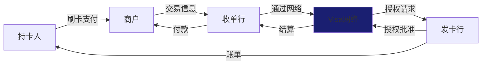
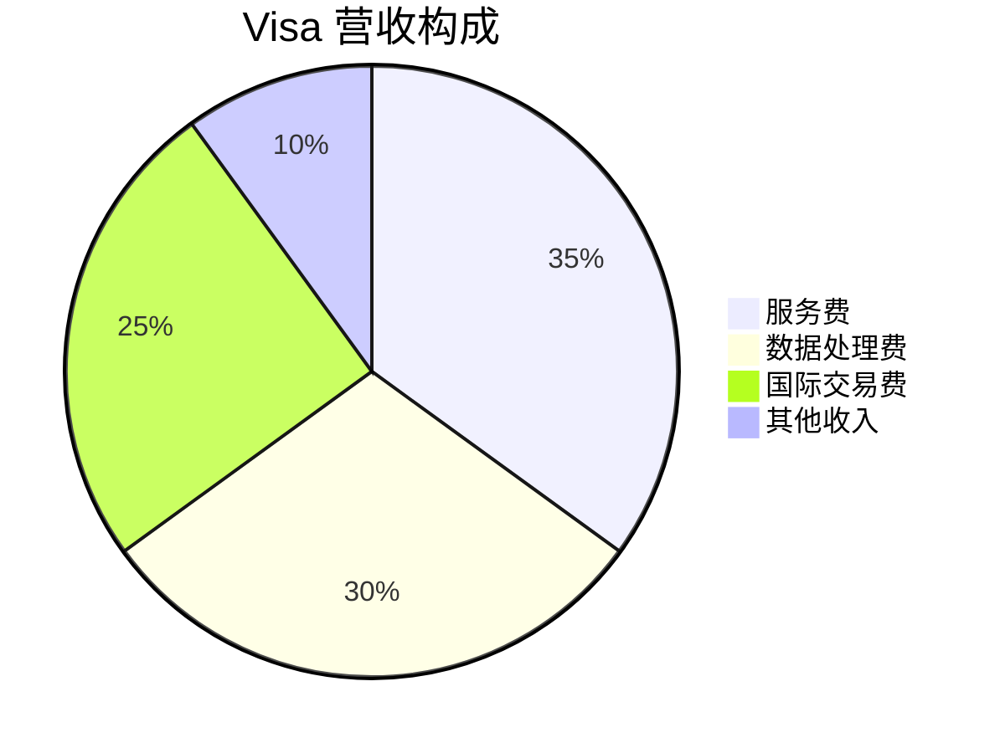
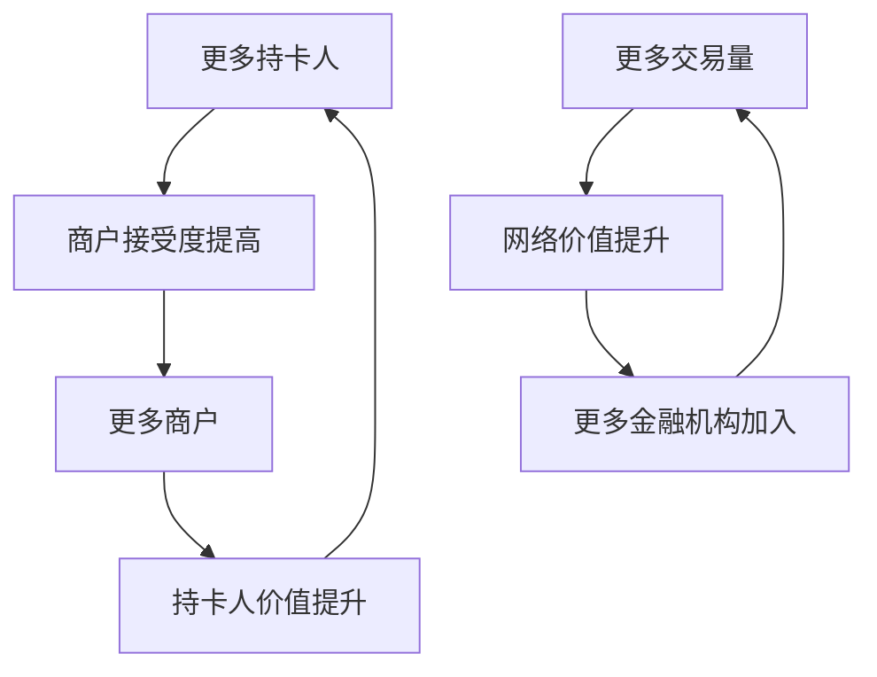

# Visa Inc. - 案例研究

## 公司概况

**基本信息**
- **公司名称**: Visa Inc.
- **股票代码**: V (NYSE)
- **成立时间**: 1958年（BankAmericard），2007年重组，2008年IPO
- **总部位置**: 美国加州福斯特城
- **CEO**: Ryan McInerney (2023年至今)

**主营业务**
- 支付网络运营（连接发卡行、收单行、商户）
- 支付处理服务
- 增值服务（欺诈检测、数据分析）
- 跨境支付解决方案

**市值规模** (截至2024年)
- 市值: ~$5500亿美元
- 全球最大支付网络
- 标普500指数重要成分股

**上市信息**
- 2008年3月IPO
- IPO价格: $44/股
- 当前价格: ~$270/股
- 上市以来回报: +500%+

## 商业模式分析

### 价值主张

Visa的核心价值主张：

1. **对消费者**
   - 便捷安全的支付方式
   - 全球通用
   - 奖励计划

2. **对商户**
   - 增加销售（接受卡支付）
   - 降低现金处理成本
   - 全球客户触达

3. **对金融机构**
   - 发卡收入
   - 客户粘性
   - 数据洞察

### 独特的商业模式

**四方模式** (Four-Party Model):

**关键特点**:
- Visa不发卡、不收单、不放贷
- 仅提供网络和处理服务
- 轻资产、高利润率模式
- 不承担信用风险

### 收入来源

**营收构成** (2023财年):

**收入类型详解**:

1. **服务费** (~35%):
   - 基于支付交易量
   - 发卡行支付
   - 与交易金额挂钩

2. **数据处理费** (~30%):
   - 基于交易笔数
   - 处理每笔交易收费
   - 固定费用

3. **国际交易费** (~25%):
   - 跨境交易附加费
   - 货币转换费
   - 高利润率

4. **其他收入** (~10%):
   - 增值服务
   - 许可费
   - 咨询服务

**商业模式优势**:
- 不承担信用风险
- 轻资产运营
- 规模经济显著
- 利润率极高（50%+）

### 网络效应

**双边网络效应**:

**网络效应强度**: ★★★★★

**表现**:
- 全球38亿张Visa卡
- 1亿+商户接受
- 200+国家和地区
- 网络效应持续加强

### 核心资源

1. **品牌**: 全球最知名支付品牌
2. **网络**: 全球最大支付网络
3. **技术**: VisaNet处理能力（65,000笔/秒）
4. **数据**: 海量交易数据
5. **合作伙伴**: 15,000+金融机构
6. **安全技术**: EMV芯片、令牌化

## 财务分析

### 收入增长

**营收趋势** (单位: 十亿美元)

| 财年 | 营收 | 同比增长 | 支付交易量 | 交易笔数 |
|------|------|----------|------------|----------|
| 2014 | 13 | +13% | 4.8万亿 | 74亿 |
| 2015 | 14 | +8% | 5.3万亿 | 82亿 |
| 2016 | 15 | +7% | 5.8万亿 | 91亿 |
| 2017 | 18 | +20% | 6.8万亿 | 111亿 |
| 2018 | 21 | +17% | 8.2万亿 | 127亿 |
| 2019 | 23 | +10% | 9.1万亿 | 138亿 |
| 2020 | 22 | -4% | 8.8万亿 | 140亿 |
| 2021 | 24 | +9% | 10.4万亿 | 165亿 |
| 2022 | 29 | +21% | 12.3万亿 | 192亿 |
| 2023 | 33 | +14% | 14.0万亿 | 212亿 |

**关键观察**:
- 2014-2023年复合增长率: ~11%
- 支付交易量增长更快（~13% CAGR）
- 2020年疫情影响，快速恢复
- 数字支付趋势加速

### 盈利能力

**关键盈利指标**:

| 指标 | 2019 | 2020 | 2021 | 2022 | 2023 |
|------|------|------|------|------|------|
| 营业利润率 | 67% | 65% | 66% | 67% | 68% |
| 净利率 | 53% | 51% | 52% | 51% | 54% |
| ROE | 38% | 35% | 40% | 42% | 45% |
| ROA | 17% | 15% | 18% | 19% | 21% |
| ROIC | 25% | 22% | 27% | 30% | 33% |

**盈利能力分析**:
- **超高利润率**: 净利率50%+，行业罕见
- **卓越ROE**: 40%+，远超大多数公司
- **轻资产模式**: 高ROIC，资本效率极高
- **稳定性**: 利润率波动小

**利润率驱动因素**:
- 规模经济
- 网络效应
- 定价权
- 低资本支出

### 现金流

**现金流表现** (单位: 十亿美元):

| 财年 | 经营现金流 | 资本支出 | 自由现金流 | FCF利润率 |
|------|------------|----------|------------|-----------|
| 2019 | 15 | -1.0 | 14 | 61% |
| 2020 | 14 | -0.8 | 13 | 59% |
| 2021 | 17 | -0.9 | 16 | 67% |
| 2022 | 19 | -1.1 | 18 | 62% |
| 2023 | 21 | -1.2 | 20 | 61% |

**现金流特点**:
- **强劲的现金生成**: FCF利润率60%+
- **极低资本支出**: CapEx仅占营收3-4%
- **轻资产模式**: 不需要大量固定资产投资
- **现金返还**: 年度分红+回购$150亿+

**资本配置**:
- 股息: ~20%自由现金流
- 回购: ~70%自由现金流
- 并购: ~10%自由现金流

### 财务健康

**资产负债表** (2023财年，单位: 十亿美元):

**资产**:
- 现金及等价物: $18
- 投资: $2
- 应收账款: $4
- 无形资产: $25
- 其他资产: $10
- 总资产: $89

**负债**:
- 应付账款: $3
- 债务: $20
- 其他负债: $16
- 总负债: $39

**股东权益**: $50

**财务比率**:
- 债务/权益: 0.40（低杠杆）
- 流动比率: 1.5
- 利息覆盖倍数: 30+
- 信用评级: AA- (标普)

**财务健康评估**:
- ✅ 现金流强劲
- ✅ 债务水平低
- ✅ 财务灵活性强
- ✅ 资本返还能力强

## 竞争分析

### 行业地位

**全球支付网络市场份额** (按交易量):
- Visa: ~40%
- Mastercard: ~25%
- 银联: ~20%
- American Express: ~5%
- Discover: ~2%
- 其他: ~8%

**关键市场**:
- 美国: 主导地位（50%+）
- 欧洲: 领先地位（40%+）
- 亚太: 增长快速（30%+）
- 拉美: 强势地位（45%+）

### 竞争优势（护城河分析）

#### 1. 网络效应 (★★★★★)

**双边网络**:
- 持卡人 ↔ 商户
- 规模越大，价值越高
- 新进入者难以复制

**网络规模**:
- 38亿张卡
- 1亿+商户
- 15,000+金融机构

**护城河强度**: 极强，几乎不可攻破

#### 2. 品牌优势 (★★★★★)

**品牌价值**:
- 全球最知名支付品牌
- 信任度高
- 安全可靠的象征

**品牌效应**:
- 消费者首选
- 商户必须接受
- 金融机构优先发行

#### 3. 规模优势 (★★★★★)

**规模经济**:
- 固定成本分摊
- 技术投资能力
- 谈判议价能力

**成本优势**:
- 单笔交易成本极低
- 边际成本接近零
- 利润率持续提升

#### 4. 转换成本 (★★★★☆)

**金融机构转换成本**:
- 系统集成复杂
- 客户习惯
- 品牌认知

**商户转换成本**:
- 设备投资
- 客户期望
- 多网络支持成本

#### 5. 监管壁垒 (★★★☆☆)

**监管要求**:
- 安全标准（PCI DSS）
- 合规成本高
- 许可证要求

**新进入者障碍**: 高

### 主要竞争对手

#### Mastercard
- **优势**: 商业模式相似，全球网络
- **劣势**: 规模略小，品牌认知度稍弱
- **市场份额**: 25%
- **竞争策略**: 跟随Visa，差异化服务

#### 银联 (UnionPay)
- **优势**: 中国市场主导，政府支持
- **劣势**: 国际化程度低
- **市场份额**: 20%（主要在中国）
- **竞争策略**: 国内主导，国际扩张

#### American Express
- **优势**: 高端市场，闭环模式
- **劣势**: 商户接受度低，规模小
- **市场份额**: 5%
- **竞争策略**: 高端定位，会员服务

#### 金融科技公司
- **PayPal, Square, Stripe**: 在线支付
- **Apple Pay, Google Pay**: 移动支付
- **挑战**: 用户界面，但底层仍用Visa网络
- **关系**: 竞合关系，更多是合作

### 竞争格局

**Visa vs Mastercard**:
- 双寡头格局
- 商业模式几乎相同
- 竞争温和，共同做大市场
- 定价相似

**竞争优势持续性**: ★★★★★
- 网络效应持续加强
- 品牌优势稳固
- 规模优势扩大
- 护城河几乎不可攻破

## 投资论点

### 看多理由 (Bull Case)

#### 1. 无现金化趋势 (★★★★★)

**全球趋势**:
- 现金使用率下降
- 数字支付渗透率提升
- 疫情加速转变

**增长空间**:
- 全球现金交易占比仍有50%+
- 新兴市场渗透率低
- 长期增长潜力巨大

**数据支持**:
- 美国现金交易占比从40%降至20%
- 中国数字支付渗透率80%+
- 全球趋势不可逆

#### 2. 跨境支付增长 (★★★★★)

**驱动因素**:
- 全球化
- 电商增长
- 旅游恢复

**高利润率**:
- 跨境交易费率高
- 利润率70%+
- 增长快于国内交易

**增长潜力**:
- 跨境电商爆发
- 数字游民增加
- B2B跨境支付

#### 3. 新支付方式 (★★★★☆)

**创新领域**:
- 移动支付（Apple Pay、Google Pay）
- 二维码支付
- 加密货币支付
- 嵌入式金融

**Visa策略**:
- 与科技公司合作
- 投资金融科技
- 开放API平台
- 底层网络提供商

**价值**: 无论支付方式如何变化，Visa网络仍是基础设施

#### 4. 增值服务 (★★★★☆)

**服务扩展**:
- 欺诈检测（Visa Advanced Authorization）
- 数据分析（Visa Analytics Platform）
- 咨询服务
- 网络安全

**价值**:
- 提升客户粘性
- 增加收入来源
- 提高利润率

#### 5. 股东回报 (★★★★☆)

**资本返还**:
- 年度分红+回购$150亿+
- 股息持续增长（15年CAGR 20%）
- 回购减少流通股

**可持续性**:
- 强劲现金流
- 低资本支出
- 财务灵活性强

### 风险因素 (Bear Case)

#### 1. 监管风险 (★★★★☆)

**反垄断**:
- 欧盟限制交换费
- 美国反垄断审查
- 费率下降压力

**影响**:
- 收入增长放缓
- 利润率压缩
- 估值下降

**历史**: 欧盟已多次降低交换费上限

#### 2. 竞争加剧 (★★★☆☆)

**新竞争者**:
- 实时支付网络（FedNow、PIX）
- 央行数字货币（CBDC）
- 加密货币
- 大科技公司（支付宝、微信支付）

**威胁**:
- 市场份额流失
- 定价压力
- 去中介化

#### 3. 技术颠覆 (★★★☆☆)

**潜在颠覆**:
- 区块链技术
- 去中心化金融（DeFi）
- 点对点支付
- 即时支付系统

**Visa应对**:
- 投资区块链
- 收购金融科技公司
- 开放平台战略

#### 4. 经济周期 (★★☆☆☆)

**周期性**:
- 交易量与经济相关
- 衰退时消费下降
- 跨境旅游减少

**缓解**:
- 长期趋势向上
- 多元化地理分布
- 必需消费占比高

#### 5. 估值风险 (★★★☆☆)

**当前估值**:
- P/E: 30x（历史平均25x）
- P/S: 17x（历史平均12x）
- 估值处于高位

**下行风险**: 估值回归均值可能导致20-30%下跌

### 估值分析

#### 市盈率法

**当前估值** (2024年初):
- P/E: 30x
- 历史平均: 25x
- 行业平均: 20x

**溢价原因**:
- 增长确定性高
- 利润率极高
- 护城河强大

#### 市销率法

**当前估值**:
- P/S: 17x
- 历史平均: 12x

**合理性**: 反映高利润率（50%+）

#### DCF估值

**假设**:
- 营收增长率: 10-12%（未来5年）
- 自由现金流利润率: 60%
- WACC: 8%
- 永续增长率: 4%

**合理价值**: $250-280
**当前价格**: $270
**结论**: 估值合理至略高

### 投资建议

**目标价**: $280-300

**情景分析**:

| 情景 | 概率 | 回报率 | 关键假设 |
|------|------|--------|----------|
| 乐观 | 25% | +20% | 无现金化加速、跨境支付爆发、监管友好 |
| 基准 | 50% | +10% | 稳定增长、估值维持、持续回购 |
| 悲观 | 25% | -15% | 监管收紧、竞争加剧、估值压缩 |

**期望回报**: +8%

**投资评级**: **持有** (Hold)

**理由**:
- ✅ 无与伦比的商业模式
- ✅ 强大的竞争优势
- ✅ 长期增长确定性高
- ✅ 优秀的财务表现
- ⚠️ 估值不便宜
- ⚠️ 监管风险需关注

**适合投资者**:
- 长期投资者（5-10年）
- 追求质量的投资者
- 看好数字支付趋势的投资者
- 希望持有核心资产的投资者

## 关键学习点

### 1. 网络效应的威力

**核心洞察**: 双边网络效应创造最强护城河。

**Visa的网络效应**:
- 持卡人越多→商户接受度越高
- 商户越多→持卡人价值越大
- 正反馈循环，赢家通吃

**投资启示**: 网络效应企业具有极高长期价值

### 2. 轻资产模式的优势

**核心洞察**: 轻资产模式创造高回报率。

**Visa的轻资产**:
- 不发卡、不放贷
- 仅提供网络服务
- 资本支出极低
- ROIC 30%+

**投资启示**: 轻资产商业模式值得溢价

### 3. 不承担风险的智慧

**核心洞察**: 提供服务但不承担风险。

**Visa的风险隔离**:
- 信用风险由发卡行承担
- 欺诈风险由发卡行承担
- Visa仅收取服务费

**投资启示**: 风险隔离的商业模式更稳健

### 4. 平台思维

**核心洞察**: 平台连接多方，创造价值。

**Visa的平台**:
- 连接持卡人、商户、金融机构
- 提供基础设施
- 生态系统价值

**投资启示**: 平台型企业具有规模优势

### 5. 长期趋势的力量

**核心洞察**: 顺应长期趋势的企业持续增长。

**无现金化趋势**:
- 不可逆转
- 全球性
- 长期持续

**投资启示**: 投资长期趋势受益者

### 6. 定价权的价值

**核心洞察**: 定价权保护利润率。

**Visa的定价权**:
- 网络效应支撑
- 品牌优势
- 转换成本高

**投资启示**: 定价权是护城河的体现

### 7. 规模经济

**核心洞察**: 规模越大，单位成本越低。

**Visa的规模经济**:
- 固定成本分摊
- 边际成本接近零
- 利润率持续提升

**投资启示**: 规模经济行业首选龙头

## 延伸阅读

### 推荐书籍

1. **《平台革命》** - Geoffrey Parker等
   - 平台商业模式
   - 网络效应

2. **《支付战争》** - Eric Jackson
   - PayPal的故事
   - 支付行业竞争

3. **《金融科技革命》** - Brett King
   - 支付行业变革
   - 未来趋势

### 相关案例

- [Mastercard - 支付网络案例](../../../05-global-perspective/us-market/financials/payments/mastercard.html)
- [PayPal - 在线支付案例](../../../05-global-perspective/us-market/financials/payments/paypal.html)
- [平台商业模式](../../business-models/platform-business.html)
- 网络效应分析

## 参考文献

1. Visa Inc. Annual Reports (2014-2023)
2. Visa Inc. 10-K Filings, SEC
3. Nilson Report: Global Payment Cards Data (2023)
4. McKinsey: "Global Payments Report" (2023)
5. BCG: "Digital Payments: The Future of Money" (2022)
6. Parker, G., Van Alstyne, M., & Choudary, S. (2016). *Platform Revolution*
7. Evans, D., & Schmalensee, R. (2016). *Matchmakers: The New Economics of Multisided Platforms*
8. Federal Reserve: "Payments Study" (2023)
9. BIS: "Payment Systems in the Digital Age" (2022)
10. Goldman Sachs: Visa Equity Research (2023)
11. Morgan Stanley: Payment Networks Analysis (2023)
12. Credit Suisse: "The Future of Payments" (2022)
13. Bernstein Research: "Visa: The Network Effect" (2023)
14. S&P Global: Visa Credit Analysis (2023)
15. Moody's: Payment Networks Industry Report (2023)

---

**最后更新**: 2024年1月20日  
**下次审查**: 2024年7月20日  
**数据截止**: 2023年9月30日

**免责声明**: 本案例研究仅供教育和学习目的，不构成投资建议。投资决策应基于个人研究和专业咨询。
