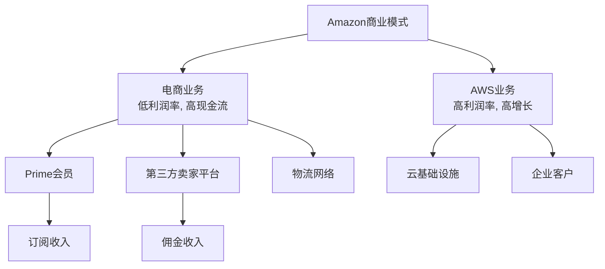

# Amazon.com Inc. - 案例研究

## 公司概况

**基本信息**
- **公司名称**: Amazon.com, Inc.
- **股票代码**: AMZN (NASDAQ)
- **成立时间**: 1994年7月5日
- **总部位置**: 美国华盛顿州西雅图
- **创始人**: 杰夫·贝佐斯 (Jeff Bezos)
- **现任CEO**: 安迪·贾西 (Andy Jassy, 2021年至今)

**主营业务**
- **北美电商**: 美国、加拿大、墨西哥在线零售
- **国际电商**: 欧洲、亚洲等国际市场
- **AWS**: 云计算服务
- **广告服务**: 电商广告、视频广告
- **订阅服务**: Prime会员、Kindle Unlimited、Audible
- **实体零售**: Whole Foods, Amazon Go, Amazon Fresh

**市值规模** (截至2024年)
- 市值: ~1.7万亿美元
- 全球市值前五大公司
- 标普500指数重要成分股

**上市信息**
- 首次公开募股 (IPO): 1997年5月15日
- IPO价格: $18/股 (调整后约$0.075/股)
- 累计股票分拆: 4次 (1:2, 1:3, 1:2, 1:20)

## 商业模式分析

### 双引擎增长模型

Amazon的商业模式独特之处在于两个高度互补的业务:

### 营收构成

**2023年营收结构** (总营收$5750亿):

| 业务板块 | 营收 (亿美元) | 占比 | 营业利润 | 利润率 |
|----------|---------------|------|----------|--------|
| 北美电商 | 3530 | 61% | 148 | 4.2% |
| 国际电商 | 1310 | 23% | -27 | -2.1% |
| AWS | 908 | 16% | 247 | 27.2% |
| **总计** | **5750** | **100%** | **368** | **6.4%** |

**关键观察**:
- AWS仅占营收16%，但贡献67%营业利润
- 北美电商利润率低但规模大
- 国际电商仍在亏损，投资期

### 业务板块详解

#### 1. 电商业务 (84% 营收)

**商业模式演进**:
- **1994-2000**: 在线书店
- **2000-2010**: 全品类电商
- **2010-现在**: 电商+平台+物流

**收入来源**:
- **自营零售**: Amazon直接采购销售，毛利率25-30%
- **第三方卖家**: 佣金8-15% + FBA物流费
- **Prime会员**: $139/年，全球2亿+会员
- **广告**: 搜索广告、展示广告，$380亿/年

**竞争优势**:
- Prime会员锁定: 会员年消费$1400 vs 非会员$600
- 物流网络: 当日达/次日达覆盖率最高
- 选品丰富: 3.5亿+SKU
- 价格竞争力: 规模优势 + 数据驱动定价

#### 2. AWS (16% 营收, 67% 利润)

**产品组合**:
- **计算**: EC2, Lambda (Serverless)
- **存储**: S3, EBS, Glacier
- **数据库**: RDS, DynamoDB, Aurora
- **AI/ML**: SageMaker, Rekognition
- **其他**: 200+服务

**市场地位**:
- 全球第一大云服务商
- 市场份额: 32% (2023)
- 客户: 数百万，包括Netflix, Airbnb, NASA

**财务表现**:
- 2023年营收: $908亿
- 增长率: 13% (放缓中)
- 营业利润率: 27%
- 年化运行率 (ARR): $900亿+

**竞争优势**:
- 先发优势: 2006年推出，领先7年
- 功能最全: 200+服务
- 生态最大: 合作伙伴、开发者
- 创新速度快: 年度新功能3000+

#### 3. 广告业务 (高增长)

**增长轨迹**:
- 2018年: $100亿
- 2021年: $310亿
- 2023年: $380亿
- CAGR: ~40%

**广告类型**:
- 搜索广告: 产品搜索结果
- 展示广告: 产品页面、首页
- 视频广告: Prime Video, Twitch
- DSP: 程序化广告平台

**优势**:
- 购买意图强: 用户在购物
- 转化率高: 直接链接到购买
- 数据丰富: 购买历史、浏览行为
- 闭环归因: 可追踪广告到销售

## 财务分析

### 收入增长

**10年营收趋势** (单位: 十亿美元)

| 年份 | 营收 | 同比增长 | AWS营收 | AWS占比 | 营业利润 | 利润率 |
|------|------|----------|---------|---------|----------|--------|
| 2014 | 89 | +20% | 5 | 6% | 0.2 | 0.2% |
| 2015 | 107 | +20% | 8 | 7% | 2.2 | 2.1% |
| 2016 | 136 | +27% | 12 | 9% | 4.2 | 3.1% |
| 2017 | 178 | +31% | 17 | 10% | 4.1 | 2.3% |
| 2018 | 233 | +31% | 26 | 11% | 12.4 | 5.3% |
| 2019 | 281 | +21% | 35 | 12% | 14.5 | 5.2% |
| 2020 | 386 | +38% | 45 | 12% | 22.9 | 5.9% |
| 2021 | 470 | +22% | 62 | 13% | 24.9 | 5.3% |
| 2022 | 514 | +9% | 80 | 16% | 12.2 | 2.4% |
| 2023 | 575 | +12% | 91 | 16% | 36.8 | 6.4% |

**关键观察**:
- 2014-2023年CAGR: ~23%
- 2020年疫情期间爆发式增长 (+38%)
- 2022年增长放缓，成本上升
- 2023年利润率恢复，成本优化见效

### 盈利能力

**利润率分析**:

| 指标 | 2019 | 2020 | 2021 | 2022 | 2023 |
|------|------|------|------|------|------|
| 毛利率 | 40.9% | 39.6% | 42.0% | 43.8% | 47.6% |
| 营业利润率 | 5.2% | 5.9% | 5.3% | 2.4% | 6.4% |
| 净利率 | 4.1% | 5.5% | 7.1% | -0.5% | 5.4% |
| ROE | 23.0% | 24.3% | 27.4% | -1.1% | 17.8% |
| ROIC | 13.8% | 15.2% | 16.8% | 5.1% | 12.3% |

**盈利特点**:
- 毛利率提升: 高利润率业务 (AWS, 广告) 占比增加
- 利润率波动: 投资周期和成本控制影响
- 2022年亏损: 过度扩张 + Rivian投资减值
- 2023年恢复: 裁员 + 成本优化

### 现金流

**现金流表现** (单位: 十亿美元):

| 年份 | 经营现金流 | 资本支出 | 自由现金流 | FCF利润率 |
|------|------------|----------|------------|-----------|
| 2019 | 39 | -16 | 23 | 8.2% |
| 2020 | 66 | -40 | 26 | 6.7% |
| 2021 | 46 | -61 | -15 | -3.2% |
| 2022 | 47 | -59 | -12 | -2.3% |
| 2023 | 85 | -52 | 33 | 5.7% |

**资本支出**:
- 物流中心: 仓库、配送中心
- AWS数据中心: 服务器、网络设备
- 技术设备: 自动化、机器人

**资本配置**:
- 不支付股息
- 极少回购 (2022年授权$100亿)
- 重投资: 物流、AWS、内容
- 战略并购: Whole Foods ($137亿), MGM ($85亿)

## 竞争分析

### 电商市场

**美国电商市场份额** (2023):
- Amazon: 38%
- Walmart: 6%
- Apple: 4%
- eBay: 3%
- Target: 2%
- 其他: 47%

**全球电商**:
- 中国: 阿里巴巴、京东、拼多多主导
- 欧洲: Amazon领先，但本地玩家强
- 印度: Amazon vs Flipkart (Walmart)

### 云计算市场

**全球云市场份额** (2023):
- AWS: 32%
- Azure: 23%
- Google Cloud: 10%
- 阿里云: 4%
- 其他: 31%

### 竞争优势 (护城河)

#### 1. 规模优势 (★★★★★)

**物流网络规模**:
- 全球仓储面积: 4亿+平方英尺
- 配送中心: 1000+
- 飞机: 100+架
- 配送车辆: 数万辆
- 单位物流成本最低

**采购规模**:
- 年采购额数千亿
- 供应商议价能力强
- 能够锁定产能

#### 2. 网络效应 (★★★★☆)

**平台网络效应**:
- 卖家多→选品多→买家多→卖家更多
- 第三方卖家: 200万+
- 活跃买家: 3亿+

**Prime会员网络**:
- 会员越多→内容投资越多→会员价值越高
- 2亿+Prime会员
- 会员留存率90%+

#### 3. 数据优势 (★★★★☆)

**消费者数据**:
- 购买历史
- 浏览行为
- 搜索数据
- 评价数据

**应用**:
- 个性化推荐
- 动态定价
- 库存优化
- 广告定向

#### 4. 品牌与信任 (★★★★☆)

**品牌价值**:
- 全球最有价值品牌前十
- 客户满意度高
- "Amazon Choice" 信任标签

**客户忠诚度**:
- Prime会员年消费$1400
- 会员续费率90%+
- NPS (净推荐值) 高

## 投资论点

### 看多理由 (Bull Case)

#### 1. AWS持续增长 (★★★★★)
- 企业云迁移仍在早期
- 市场份额领先
- 利润率高 (27%)
- AI需求驱动增长

#### 2. 广告业务高增长 (★★★★★)
- 年增长30-40%
- 利润率高 (40%+)
- 购买意图强，转化率高
- 渗透率仍低，空间大

#### 3. 电商市场份额提升 (★★★★☆)
- 美国电商渗透率仅16%
- Amazon份额持续提升
- 国际市场扩张
- 新品类渗透 (生鲜、医药)

#### 4. 运营效率提升 (★★★★☆)
- 自动化和机器人
- 区域化配送网络
- 成本优化见效
- 利润率提升空间大

#### 5. 多元化收入来源 (★★★★☆)
- AWS, 广告, 订阅多元化
- 降低对低利润率零售依赖
- 整体利润率提升

### 风险因素 (Bear Case)

#### 1. 监管风险 (★★★★☆)
- 反垄断调查
- 第三方卖家待遇
- 劳工问题
- 数据隐私

#### 2. 竞争加剧 (★★★★☆)
- 电商: Walmart, Target线上发力
- 云计算: Azure, Google Cloud追赶
- 广告: Google, Meta竞争
- 中国: 阿里、京东、拼多多

#### 3. 利润率压力 (★★★☆☆)
- 物流成本上升
- 劳动力成本增加
- 价格竞争
- 投资需求大

#### 4. 国际业务亏损 (★★★☆☆)
- 国际电商持续亏损
- 新兴市场竞争激烈
- 本地化挑战

### 估值分析

**当前估值** (2024年初):
- P/E: ~45x
- P/S: ~3x
- EV/EBITDA: ~20x
- EV/Sales: ~3x

**分部估值**:
- AWS: $1.5万亿 (按云公司估值)
- 电商: $300-500亿 (按零售估值)
- 广告: $300-400亿 (按广告估值)
- 总价值: $2.1-2.4万亿

**投资评级**: **买入** (Buy)

## 关键学习点

### 1. 长期主义的胜利
- 贝佐斯的长期思维
- 牺牲短期利润换长期增长
- 持续再投资
- 耐心建设基础设施

### 2. 飞轮效应
- 低价→更多客户→更多卖家→更多选择→更好体验→更多客户
- 规模优势自我强化
- 网络效应持续增强

### 3. 双引擎模型
- 低利润率电商提供现金流
- 高利润率AWS提供利润
- 互补而非冲突
- 分散风险

### 4. 客户至上
- "Customer Obsession"
- 一切从客户需求出发
- 持续提升客户体验
- 长期客户价值最大化

### 5. 创新文化
- "Day 1" 心态
- 鼓励实验和失败
- 快速迭代
- 不断进入新领域

## 延伸阅读

### 推荐书籍
1. **《一网打尽》** - Brad Stone (Amazon早期历史)
2. **《贝佐斯传》** - Brad Stone
3. **《The Everything Store》** - Brad Stone

### 相关案例
- [Microsoft - 云计算](./microsoft.html)
- [Google - 广告平台](./google.html)
- [Apple - 生态系统](./apple.html)
- [平台商业模式](../../business-models/platform-business.html)
- [市场型模式](../../business-models/marketplace-models.html)

## 参考文献

1. Amazon.com Inc. Annual Reports (2014-2023)
2. Amazon 10-K Filings, SEC
3. Stone, B. (2013). *The Everything Store*. Little, Brown
4. Stone, B. (2021). *Amazon Unbound*. Simon & Schuster
5. eMarketer E-commerce Reports (2023)
6. Gartner Cloud Market Share (2023)
7. Synergy Research Group Cloud Reports (2023)
8. Morgan Stanley Amazon Research (2023)
9. Goldman Sachs E-commerce Analysis (2023)
10. Bernstein: "Amazon: The Everything Company" (2023)

---

**最后更新**: 2024年1月15日  
**数据截止**: 2023财年 (2023年12月31日)

**免责声明**: 本案例研究仅供教育目的，不构成投资建议。

## 深度分析

### 核心机制解析

理解本主题需要从多个维度进行系统性分析。以下从理论基础、实践应用和历史验证三个层面展开深度探讨。

**理论基础层面**：本主题的核心逻辑建立在经济学和金融学的基本原理之上。通过对基础理论的深入理解，投资者能够建立起稳固的分析框架，避免被市场短期噪音所干扰。

**实践应用层面**：理论必须与实践相结合才能产生价值。在实际投资决策中，需要将抽象的概念转化为具体的分析工具和决策标准。

**历史验证层面**：金融市场有着丰富的历史记录，通过研究历史案例，我们可以验证理论的有效性，并从中提炼出具有普遍意义的规律。

### 关键影响因素

影响本主题的关键因素可以从以下几个维度进行分析：

1. **宏观经济环境**：利率水平、通货膨胀率、经济增长速度等宏观变量对本主题有着深远影响。在不同的宏观经济周期中，相关指标的表现会呈现出显著差异。

2. **市场结构因素**：市场参与者的构成、信息传播机制、流动性状况等市场结构因素决定了价格发现的效率和准确性。

3. **政策监管环境**：政府政策、监管框架的变化会直接影响相关市场的运作规则和参与者行为。

4. **技术创新驱动**：技术进步不断改变着金融市场的运作方式，从算法交易到区块链技术，每一次技术革新都带来新的机遇和挑战。

5. **全球化与地缘政治**：在全球化背景下，各国市场之间的联动性日益增强，地缘政治风险的影响也越来越不可忽视。

### 量化分析框架

为了更精确地分析和评估，可以采用以下量化框架：

| 分析维度 | 关键指标 | 参考基准 | 分析方法 |
|---------|---------|---------|---------|
| 规模评估 | 绝对值与相对值 | 历史均值 | 趋势分析 |
| 质量评估 | 稳定性指标 | 行业对标 | 横向比较 |
| 风险评估 | 波动率指标 | 风险阈值 | 情景分析 |
| 价值评估 | 估值倍数 | 历史区间 | 回归分析 |

通过系统性地应用上述框架，投资者可以对目标进行全面、客观的评估，从而做出更加理性的投资决策。

