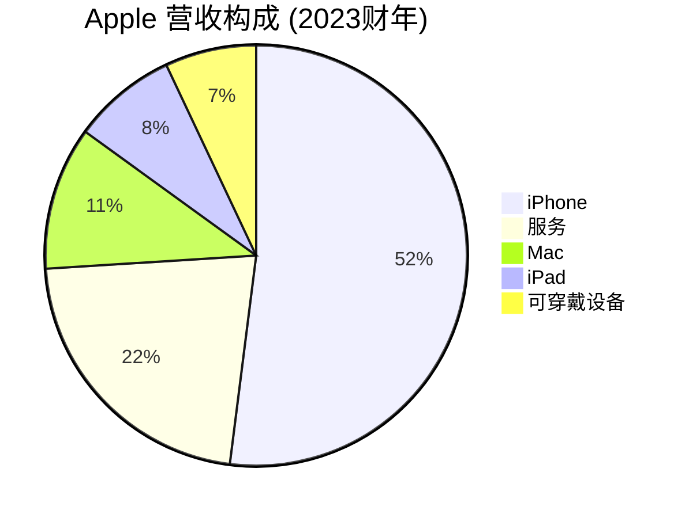
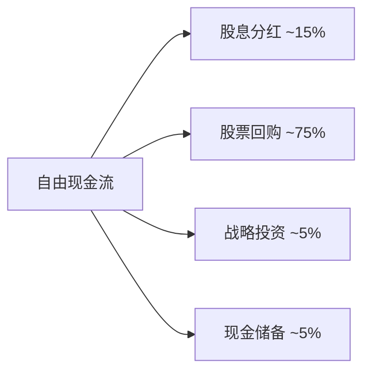
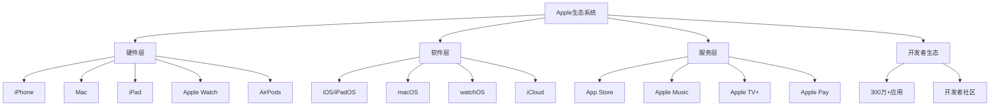

# Apple Inc. - 案例研究

## 公司概况

**基本信息**
- **公司名称**: Apple Inc.
- **股票代码**: AAPL (NASDAQ)
- **成立时间**: 1976年4月1日
- **总部位置**: 美国加州库比蒂诺
- **创始人**: 史蒂夫·乔布斯、史蒂夫·沃兹尼亚克、罗纳德·韦恩
- **现任CEO**: 蒂姆·库克 (Tim Cook, 2011年至今)

**主营业务**
- iPhone (智能手机)
- Mac (个人电脑)
- iPad (平板电脑)
- Apple Watch (智能手表)
- AirPods (无线耳机)
- 服务业务 (App Store, Apple Music, iCloud, Apple TV+, Apple Pay)

**市值规模** (截至2024年)
- 市值: ~3.0万亿美元
- 全球市值最大的公司之一
- 标普500指数权重最大成分股

**上市信息**
- 首次公开募股 (IPO): 1980年12月12日
- IPO价格: $22/股 (调整后约$0.10/股)
- 累计股票分拆: 5次 (1:2, 1:2, 1:2, 1:7, 1:4)

## 商业模式分析

### 价值主张

Apple 的核心价值主张围绕三个关键要素:

1. **卓越的用户体验**
   - 硬件、软件、服务的无缝整合
   - 简洁直观的设计理念
   - 高品质的产品工艺

2. **创新与设计**
   - 引领行业的产品创新
   - 标志性的工业设计
   - 持续的技术突破

3. **生态系统锁定**
   - 设备间的无缝协作
   - 数据和内容的云端同步
   - 应用和服务的深度整合

### 客户细分

**主要客户群体**:
- 高端消费者 (追求品质和体验)
- 专业创意人士 (设计师、音乐人、视频制作者)
- 企业用户 (日益增长的企业市场)
- 教育机构 (学校和大学)
- 开发者社区 (iOS/macOS 应用开发者)

**地理分布**:
- 美洲: ~45% 营收
- 欧洲: ~25% 营收
- 大中华区: ~18% 营收
- 日本: ~7% 营收
- 亚太其他地区: ~5% 营收

### 收入来源



**产品线营收**:
1. **iPhone** (~52%): 核心产品，高利润率
2. **服务** (~22%): 增长最快，利润率最高
3. **Mac** (~11%): 稳定增长
4. **iPad** (~8%): 成熟产品线
5. **可穿戴设备** (~7%): Apple Watch, AirPods

**商业模式特点**:
- 硬件销售为主，服务业务快速增长
- 高端定价策略，追求利润而非市场份额
- 年度产品更新周期，驱动升级需求
- 生态系统锁定，提高客户终身价值


### 成本结构

**主要成本项**:
- **产品成本** (~60-65% 营收): 元器件采购、制造、物流
- **研发费用** (~6-7% 营收): 产品开发、技术创新
- **销售与管理费用** (~6-7% 营收): 零售店、营销、管理
- **资本支出** (~3-4% 营收): 设备、设施、数据中心

**成本优势**:
- 规模采购降低元器件成本
- 垂直整合 (自研芯片) 降低依赖
- 高效的供应链管理
- 外包制造降低固定成本

### 核心资源

1. **品牌资产**: 全球最有价值品牌之一 (估值超$5000亿)
2. **技术专利**: 数万项专利，特别是芯片设计、用户界面
3. **生态系统**: 20亿+活跃设备，庞大的用户基础
4. **供应链**: 全球最高效的供应链之一
5. **人才团队**: 顶尖的设计师、工程师、产品经理
6. **现金储备**: 超$1600亿现金及等价物

### 关键活动

1. **产品研发**: 持续创新，年度产品更新
2. **供应链管理**: 全球采购、制造协调
3. **营销推广**: 产品发布会、广告营销
4. **零售运营**: 500+直营店，在线商店
5. **生态系统维护**: App Store审核、开发者支持
6. **客户服务**: Apple Care, Genius Bar

### 关键合作伙伴

**制造合作伙伴**:
- 富士康 (Foxconn): 主要组装厂商
- 和硕 (Pegatron): iPhone组装
- 台积电 (TSMC): 芯片代工

**供应商**:
- 三星: OLED屏幕、存储芯片
- 索尼: 摄像头传感器
- 高通: 调制解调器芯片 (逐步替代)

**内容合作伙伴**:
- 音乐厂牌、电影制片厂、出版商
- 应用开发者 (300万+)

## 财务分析

### 收入增长

**10年营收趋势** (单位: 十亿美元)

| 财年 | 营收 | 同比增长 | iPhone营收 | 服务营收 |
|------|------|----------|------------|----------|
| 2014 | 183 | +7% | 102 | 18 |
| 2015 | 234 | +28% | 155 | 20 |
| 2016 | 216 | -8% | 137 | 24 |
| 2017 | 229 | +6% | 141 | 30 |
| 2018 | 266 | +16% | 167 | 37 |
| 2019 | 260 | -2% | 142 | 46 |
| 2020 | 275 | +6% | 138 | 54 |
| 2021 | 366 | +33% | 192 | 68 |
| 2022 | 394 | +8% | 205 | 78 |
| 2023 | 383 | -3% | 201 | 85 |

**关键观察**:
- 2014-2023年复合增长率 (CAGR): ~8.5%
- iPhone营收占比从56%降至52%，多元化趋势
- 服务营收从10%增至22%，高利润率业务增长
- 2021年疫情后强劲反弹，创历史新高
- 2023年轻微下滑，面临市场饱和挑战


### 盈利能力

**关键盈利指标**:

| 指标 | 2019 | 2020 | 2021 | 2022 | 2023 | 行业平均 |
|------|------|------|------|------|------|----------|
| 毛利率 | 37.8% | 38.2% | 41.8% | 43.3% | 44.1% | 35-40% |
| 营业利润率 | 24.6% | 24.1% | 29.8% | 30.3% | 29.8% | 20-25% |
| 净利率 | 21.2% | 20.9% | 25.9% | 25.3% | 25.3% | 15-20% |
| ROE | 55.9% | 73.7% | 147.4% | 175.5% | 172.4% | 15-25% |
| ROA | 16.3% | 17.7% | 27.4% | 28.0% | 28.6% | 8-12% |
| ROIC | 29.5% | 35.3% | 50.4% | 56.0% | 58.1% | 12-18% |

**盈利能力分析**:
1. **超高毛利率** (44%): 
   - 品牌溢价能力强
   - 高端产品定价策略
   - 服务业务高利润率 (70%+)

2. **卓越的ROE** (172%):
   - 高利润率 × 高资产周转 × 财务杠杆
   - 股票回购减少股东权益，提升ROE
   - 远超行业平均水平

3. **优秀的ROIC** (58%):
   - 资本使用效率极高
   - 轻资产模式 (外包制造)
   - 强大的定价权和成本控制

### 现金流

**现金流表现** (单位: 十亿美元):

| 财年 | 经营现金流 | 资本支出 | 自由现金流 | FCF利润率 |
|------|------------|----------|------------|-----------|
| 2019 | 69 | -10 | 59 | 22.7% |
| 2020 | 81 | -7 | 74 | 26.9% |
| 2021 | 104 | -11 | 93 | 25.4% |
| 2022 | 122 | -11 | 111 | 28.2% |
| 2023 | 110 | -11 | 99 | 25.8% |

**现金流特点**:
- **强劲的现金生成能力**: FCF利润率25%+
- **轻资本支出**: CapEx仅占营收3%
- **现金返还股东**: 年度分红+回购超$900亿
- **现金储备充足**: $1600亿+现金及等价物

**资本配置策略**:


### 财务健康

**资产负债表** (2023财年, 单位: 十亿美元):

**资产**:
- 流动资产: $143B (现金$62B, 短期投资$31B, 应收账款$29B)
- 非流动资产: $209B (长期投资$100B, 固定资产$43B, 无形资产$66B)
- 总资产: $352B

**负债**:
- 流动负债: $145B (应付账款$62B, 短期债务$15B, 其他$68B)
- 非流动负债: $148B (长期债务$106B, 其他$42B)
- 总负债: $293B

**股东权益**: $59B (负债率高但现金充足)

**财务比率**:
- 流动比率: 0.99 (略低于1，但现金充足)
- 速动比率: 0.85
- 资产负债率: 83% (高杠杆，但可控)
- 利息覆盖倍数: 30+ (债务负担轻)

**财务健康评估**:
- ✅ 现金流强劲，偿债能力无忧
- ✅ 债务主要用于税务优化和股票回购
- ✅ 信用评级: AA+ (标普), Aa1 (穆迪)
- ⚠️ 负股东权益 (大规模回购导致)，但不影响运营


## 竞争分析

### 行业地位

**智能手机市场** (全球市场份额, 2023):
- Apple: ~18% (按出货量), ~50% (按利润)
- Samsung: ~20%
- 小米: ~13%
- OPPO: ~10%
- Vivo: ~8%
- 其他: ~31%

**关键观察**:
- Apple占据高端市场主导地位
- 虽然市场份额不是第一，但利润份额遥遥领先
- iPhone平均售价 (ASP) ~$900, 远高于行业平均$300

**个人电脑市场** (全球市场份额, 2023):
- Lenovo: ~24%
- HP: ~21%
- Dell: ~17%
- Apple: ~10%
- Acer: ~7%

**平板电脑市场**:
- Apple iPad: ~38% (绝对领导者)
- Samsung: ~18%
- Amazon: ~8%
- Lenovo: ~7%

**智能手表市场**:
- Apple Watch: ~35% (主导地位)
- Samsung: ~10%
- Garmin: ~8%
- Fitbit: ~5%

### 竞争优势 (护城河分析)

#### 1. 品牌护城河 (★★★★★)

**品牌价值**:
- Interbrand 2023: 全球最有价值品牌 ($5020亿)
- 品牌忠诚度: 90%+ iPhone用户留存率
- 品牌溢价: 产品售价比竞品高30-50%

**品牌特质**:
- 创新与设计的代名词
- 高端、时尚、品质的象征
- 强大的情感连接和社区归属感

**品牌护城河表现**:
- 客户愿意为Apple产品支付溢价
- 新产品发布引发全球关注
- 品牌延伸能力强 (从电脑到手机到手表)

#### 2. 生态系统护城河 (★★★★★)

**生态系统组成**:


**生态系统优势**:
- **设备互联**: Handoff, AirDrop, Universal Clipboard
- **数据同步**: iCloud无缝同步照片、文件、备忘录
- **服务整合**: Apple ID统一账户，跨设备体验
- **转换成本高**: 用户切换到其他平台成本巨大

**锁定效应**:
- 拥有多个Apple设备的用户，留存率接近100%
- 平均每个用户拥有2.2台Apple设备
- 生态系统内消费增加，客户终身价值提升

#### 3. 规模优势 (★★★★☆)

**采购规模**:
- 年采购额超$3000亿
- 对供应商有强大议价能力
- 能够锁定关键元器件产能

**研发规模**:
- 年研发投入$300亿+
- 能够自研核心芯片 (A系列, M系列)
- 技术积累深厚

**分销规模**:
- 500+直营零售店
- 全球分销网络
- 在线商店覆盖全球

#### 4. 转换成本 (★★★★★)

**用户转换成本**:
- **数据迁移**: 照片、联系人、应用数据
- **应用重购**: iOS应用无法转移到Android
- **学习成本**: 熟悉新系统的时间成本
- **设备投资**: 配件、周边产品投资
- **生态系统**: 家人朋友都在用iMessage, FaceTime

**估算转换成本**: $500-2000 (金钱) + 数十小时 (时间)

#### 5. 网络效应 (★★★☆☆)

**直接网络效应**:
- iMessage, FaceTime: 用户越多，价值越大
- AirDrop: 附近Apple用户间快速分享
- Find My: 设备网络越大，找回概率越高

**间接网络效应**:
- App Store: 用户多→开发者多→应用多→用户更多
- 配件生态: 用户多→配件厂商多→配件选择多

**网络效应强度**: 中等 (不如社交网络，但显著存在)


### 主要竞争对手

#### Samsung (三星)
- **优势**: 垂直整合 (芯片、屏幕、制造), 产品线广泛, 全球分销
- **劣势**: 品牌溢价能力弱, 软件生态依赖Google, 利润率低
- **竞争领域**: 智能手机、平板、可穿戴设备

#### Google (Alphabet)
- **优势**: Android生态系统, AI技术领先, 云服务
- **劣势**: 硬件业务规模小, 品牌认知度不如Apple
- **竞争领域**: 智能手机 (Pixel), 智能家居, 云服务

#### Microsoft
- **优势**: 企业市场强大, 云服务 (Azure), 生产力软件
- **劣势**: 消费电子市场份额小, 移动生态失败
- **竞争领域**: 个人电脑, 平板 (Surface), 云服务

#### 华为
- **优势**: 技术创新能力强, 中国市场主导, 5G领先
- **劣势**: 美国制裁影响, 国际市场受限, 芯片供应受限
- **竞争领域**: 智能手机 (中国市场), 可穿戴设备

### 竞争策略

**Apple的差异化策略**:
1. **高端定位**: 不参与价格战，专注高端市场
2. **垂直整合**: 硬件+软件+服务一体化
3. **用户体验**: 简洁、直观、无缝的体验
4. **生态系统**: 设备互联，服务整合
5. **品牌营销**: 情感连接，生活方式品牌

**竞争优势持续性**: ★★★★★
- 品牌和生态系统护城河短期内难以复制
- 持续创新能力保持领先
- 财务实力支持长期投资

## 投资论点

### 看多理由 (Bull Case)

#### 1. 服务业务高速增长 (★★★★★)

**增长驱动力**:
- 装机量持续增长: 20亿+活跃设备
- 服务渗透率提升: 付费订阅用户10亿+
- 新服务推出: Apple TV+, Apple Fitness+, Apple Card
- 高利润率: 服务毛利率70%+

**财务影响**:
- 服务营收从2019年$46B增至2023年$85B (CAGR 16%)
- 服务占比从18%提升至22%
- 提升整体利润率和估值倍数

**投资价值**: 服务业务类似"订阅模式"，现金流稳定，估值倍数高

#### 2. 生态系统护城河加深 (★★★★★)

**生态系统扩张**:
- 新产品类别: Vision Pro (空间计算), Apple Car (传闻)
- 设备互联增强: 更多Handoff功能，跨设备协作
- 服务整合: Apple One捆绑订阅

**锁定效应增强**:
- 多设备用户占比提升
- 家庭共享计划增加家庭锁定
- 企业市场渗透提升

**投资价值**: 生态系统越强，客户终身价值越高，竞争优势越持久

#### 3. 新产品周期 (★★★★☆)

**潜在催化剂**:
- **Vision Pro**: 空间计算新品类，长期潜力巨大
- **AI功能**: Apple Intelligence整合到所有设备
- **可折叠设备**: iPhone/iPad可折叠版本
- **健康功能**: Apple Watch健康监测功能扩展

**历史经验**: 
- iPhone (2007): 开创智能手机时代
- iPad (2010): 创造平板市场
- Apple Watch (2015): 主导智能手表市场
- AirPods (2016): 重新定义无线耳机

**投资价值**: 新产品周期带来营收增长和估值重估

#### 4. 股东回报计划 (★★★★☆)

**资本返还**:
- 年度分红: ~$150亿 (股息率0.5%)
- 股票回购: ~$800亿/年
- 总返还: ~$950亿/年 (占自由现金流95%)

**回购效果**:
- 2013-2023年回购$6000亿+
- 流通股数减少40%
- EPS增长超过净利润增长

**投资价值**: 持续回购提升每股价值，支撑股价

#### 5. 财务实力雄厚 (★★★★★)

**财务优势**:
- 现金储备$1600亿+
- 自由现金流$1000亿/年
- 信用评级AA+
- 债务成本低 (利率2-3%)

**战略灵活性**:
- 能够进行大规模并购
- 能够投资新技术和新市场
- 能够应对经济衰退


### 风险因素 (Bear Case)

#### 1. 市场饱和与增长放缓 (★★★★☆)

**挑战**:
- 智能手机市场成熟，增长放缓
- iPhone营收2023年下滑
- 发达市场渗透率接近饱和
- 换机周期延长 (3-4年)

**影响**:
- 营收增长依赖ASP提升和服务增长
- 估值倍数可能压缩
- 需要新产品类别驱动增长

**缓解措施**: 
- 拓展新兴市场 (印度、东南亚)
- 推出新产品类别 (Vision Pro)
- 提升服务业务占比

#### 2. 监管风险 (★★★★☆)

**反垄断调查**:
- **美国**: DOJ调查App Store垄断
- **欧盟**: 数字市场法案 (DMA) 要求开放生态
- **中国**: 反垄断审查

**潜在影响**:
- App Store佣金率下降 (30%→15%或更低)
- 被迫开放侧载 (sideloading)
- 服务营收和利润率下降
- 生态系统控制力减弱

**财务影响**: 服务营收可能下降10-20%

#### 3. 地缘政治风险 (★★★☆☆)

**中国市场风险**:
- 中国占营收18%，关键市场
- 中美关系紧张影响
- 华为复苏竞争加剧
- 政府采购限制

**供应链风险**:
- 过度依赖中国制造
- 地缘政治冲突影响供应
- 正在分散到印度、越南

**缓解措施**: 供应链多元化，但需要时间和成本

#### 4. 创新压力 (★★★☆☆)

**挑战**:
- iPhone创新增量减少
- 竞争对手技术追赶 (AI、折叠屏)
- Vision Pro市场接受度不确定
- Apple Car项目延迟/取消

**风险**:
- 失去创新领导者形象
- 品牌溢价能力下降
- 市场份额流失

#### 5. 估值风险 (★★★☆☆)

**当前估值** (2024年初):
- P/E: ~30x (历史平均15-20x)
- P/S: ~8x (历史平均3-5x)
- EV/EBITDA: ~23x

**估值担忧**:
- 估值处于历史高位
- 增长放缓但估值未调整
- 利率上升压制高估值股票

**下行风险**: 估值回归均值可能导致30-40%下跌

### 估值分析

#### DCF估值

**假设**:
- 营收增长率: 2024-2028年 5-7%, 2029-2033年 3-5%
- 自由现金流利润率: 25%
- WACC: 9%
- 永续增长率: 3%

**计算**:
```
未来5年FCF现值: $450B
未来5年后FCF现值: $550B
终值现值: $1,800B
企业价值: $2,800B
减: 净债务 $80B
股权价值: $2,720B
当前市值: $3,000B
```

**结论**: 当前估值略高于DCF合理值，隐含较高增长预期

#### 相对估值

**可比公司** (2024年初):

| 公司 | P/E | P/S | EV/EBITDA | 营收增长 | 净利率 |
|------|-----|-----|-----------|----------|--------|
| Apple | 30x | 8.0x | 23x | 5% | 25% |
| Microsoft | 35x | 12.0x | 27x | 12% | 35% |
| Google | 25x | 6.0x | 18x | 10% | 25% |
| Meta | 23x | 7.0x | 15x | 15% | 30% |
| Amazon | 45x | 2.5x | 20x | 12% | 5% |

**观察**:
- Apple P/E处于科技巨头中等水平
- P/S较高，反映高利润率
- 相对估值合理，但不便宜

#### 历史估值

**P/E历史区间**:
- 历史最低: 10x (2013年)
- 历史最高: 35x (2021年)
- 历史平均: 18x
- 当前: 30x (75th百分位)

**估值驱动因素变化**:
- 2013-2016: 低估值 (增长担忧)
- 2017-2019: 估值修复 (服务业务增长)
- 2020-2021: 估值扩张 (疫情受益, 低利率)
- 2022-2024: 估值维持高位 (AI预期, 服务增长)


### 投资建议

**目标价区间**: $170-200 (基于2024年初$185价格)

**情景分析**:

| 情景 | 概率 | 目标价 | 回报率 | 关键假设 |
|------|------|--------|--------|----------|
| 乐观 | 25% | $220 | +19% | Vision Pro成功, 服务高增长, 估值扩张 |
| 基准 | 50% | $190 | +3% | 稳定增长, 估值维持, 持续回购 |
| 悲观 | 25% | $150 | -19% | 增长停滞, 监管冲击, 估值压缩 |

**期望回报**: (25%×19%) + (50%×3%) + (25%×-19%) = +2.3%

**投资评级**: **持有** (Hold)

**理由**:
- ✅ 优秀的商业模式和竞争优势
- ✅ 强劲的现金流和股东回报
- ✅ 服务业务增长潜力
- ⚠️ 估值处于历史高位
- ⚠️ 增长放缓和监管风险
- ⚠️ 风险回报比不够吸引

**适合投资者**:
- 长期价值投资者 (持有5-10年)
- 追求稳定现金流的投资者
- 相信科技生态系统价值的投资者

**不适合投资者**:
- 追求高增长的投资者
- 对估值敏感的价值投资者
- 短期交易者

## 历史表现

### 股价走势

**长期表现** (调整后股价):
- 1980年IPO: $0.10
- 2000年: $1.00 (互联网泡沫)
- 2007年: $3.00 (iPhone发布)
- 2010年: $7.00 (iPad发布)
- 2015年: $25.00 (Apple Watch)
- 2020年: $80.00 (疫情后)
- 2023年: $185.00 (当前)

**累计回报**:
- IPO至今 (44年): +185,000%
- 过去20年: +5,000%
- 过去10年: +600%
- 过去5年: +300%

**年化回报率**:
- 44年: ~19% CAGR
- 20年: ~21% CAGR
- 10年: ~22% CAGR
- 5年: ~32% CAGR

### 与指数对比

**相对表现** (过去10年):

| 期间 | AAPL | S&P 500 | 纳斯达克 | 超额回报 |
|------|------|---------|----------|----------|
| 2014-2023 | +600% | +180% | +280% | +320% vs SPX |
| 2019-2023 | +300% | +80% | +120% | +180% vs SPX |

**观察**:
- 长期大幅跑赢大盘
- 2010年代是Apple黄金十年
- 近年表现依然强劲

### 关键里程碑

**产品里程碑**:
- 2007: iPhone发布，改变世界
- 2010: iPad发布，创造新品类
- 2011: 乔布斯去世，库克接任
- 2014: Apple Watch发布
- 2016: AirPods发布
- 2020: M1芯片发布，自研芯片
- 2023: Vision Pro发布

**财务里程碑**:
- 2012: 成为全球市值最大公司
- 2018: 首家市值突破$1万亿
- 2020: 市值突破$2万亿
- 2022: 市值突破$3万亿
- 2023: 年营收接近$4000亿

### 股息历史

**股息政策**:
- 1987-1995: 支付股息
- 1995-2012: 停止股息 (现金用于发展)
- 2012至今: 恢复股息并持续增长

**股息增长**:
- 2012: $0.38/股/年
- 2023: $0.96/股/年
- 11年CAGR: ~9%

**股息率**: 0.5% (较低，但持续增长)


## 关键学习点

### 1. 品牌护城河的力量

**核心洞察**: Apple证明了品牌可以成为最强大的护城河之一。

**关键要素**:
- **一致性**: 40年如一日的设计理念和品质承诺
- **情感连接**: 不仅是产品，更是生活方式和身份认同
- **溢价能力**: 客户愿意为品牌支付30-50%溢价

**投资启示**: 
- 寻找具有强大品牌的公司
- 品牌护城河需要长期建设，但一旦建立难以复制
- 品牌溢价直接转化为超额利润

### 2. 生态系统的威力

**核心洞察**: 生态系统创造的价值远大于单个产品。

**Apple生态系统特点**:
- **互补性**: 设备间相互增强价值
- **锁定效应**: 转换成本极高
- **网络效应**: 用户和开发者相互吸引
- **持续变现**: 从硬件到服务的持续收入

**投资启示**:
- 评估公司是否在构建生态系统
- 生态系统公司具有更高的客户终身价值
- 生态系统护城河随时间加深

### 3. 从硬件到服务的转型

**核心洞察**: 服务业务提升估值倍数和业务稳定性。

**转型路径**:
- 2014年: 服务占营收10%
- 2023年: 服务占营收22%
- 目标: 服务占营收30%+

**服务业务优势**:
- 高利润率 (70% vs 硬件36%)
- 经常性收入，现金流稳定
- 客户粘性更强
- 估值倍数更高

**投资启示**:
- 关注公司的服务化转型
- 服务业务占比提升通常带来估值重估
- 订阅模式创造长期价值

### 4. 资本配置的艺术

**核心洞察**: Apple的资本配置策略堪称典范。

**配置策略**:
- **优先级**: 运营投资 > 股东回报 > 并购
- **股票回购**: 大规模回购提升每股价值
- **股息**: 稳定增长的股息
- **债务**: 利用低成本债务优化资本结构

**效果**:
- 2013-2023年回购$6000亿+
- 流通股减少40%
- EPS增长超过净利润增长
- 股东总回报最大化

**投资启示**:
- 评估管理层的资本配置能力
- 股票回购在低估时最有效
- 资本配置是创造股东价值的关键

### 5. 创新与执行的平衡

**核心洞察**: Apple不一定是第一个创新者，但是最好的执行者。

**创新策略**:
- **不追求第一**: 等待技术成熟
- **追求最好**: 用户体验至上
- **整合创新**: 硬件+软件+服务整合
- **持续迭代**: 年度更新保持领先

**经典案例**:
- 智能手机: 不是第一个，但重新定义了品类
- 平板电脑: 不是第一个，但创造了市场
- 智能手表: 不是第一个，但成为主导者

**投资启示**:
- 创新不等于第一个
- 执行力和用户体验同样重要
- 持续创新比单次突破更有价值

### 6. 高端市场策略

**核心洞察**: 专注高端市场可以获得更高利润和更强品牌。

**策略特点**:
- 不参与价格战
- 不追求市场份额最大化
- 追求利润份额最大化
- 维护品牌高端形象

**结果**:
- 智能手机市场份额18%，但利润份额50%
- 毛利率44%，远高于行业平均
- 品牌价值持续提升

**投资启示**:
- 市场份额不等于利润份额
- 高端定位需要品牌和产品支撑
- 利润质量比营收规模更重要

### 7. 供应链管理的重要性

**核心洞察**: 卓越的供应链管理是竞争优势的来源。

**Apple供应链特点**:
- 全球采购，成本最优
- 库存周转极快 (5-10天)
- 准时交付，满足需求
- 供应商管理严格

**库克的贡献**: 
- 作为COO时建立了世界级供应链
- 成为CEO后继续优化
- 供应链效率转化为成本优势

**投资启示**:
- 供应链管理是隐形的竞争优势
- 高效供应链提升资本回报率
- 评估公司的库存周转率和供应链能力

### 8. 长期主义的胜利

**核心洞察**: Apple的成功是长期主义的胜利。

**长期主义体现**:
- 产品开发周期长 (3-5年)
- 不为短期业绩牺牲长期价值
- 持续投资研发和品牌
- 培养客户忠诚度

**乔布斯名言**: "如果你把眼光放在未来，现在的困难就不算什么。"

**投资启示**:
- 寻找具有长期主义的管理层
- 短期波动不改变长期价值
- 耐心持有优秀公司

## 延伸阅读

### 推荐书籍

1. **《史蒂夫·乔布斯传》** - Walter Isaacson
   - Apple创始人的权威传记
   - 了解Apple的创新文化和产品哲学

2. **《苹果往事》** - 安迪·赫茨菲尔德
   - Mac开发团队成员的第一手回忆
   - 深入了解Apple早期历史

3. **《蒂姆·库克传》** - Leander Kahney
   - 库克时代的Apple
   - 从创新者到运营大师的转变

4. **《一往无前》** - 雷军
   - 小米创始人学习Apple的经验
   - 中国视角看Apple模式

### 推荐文章

1. **Apple年报和10-K文件**
   - 最权威的财务和业务信息
   - 链接: [Apple Investor Relations](https://investor.apple.com)

2. **Ben Thompson - Stratechery**
   - 深度分析Apple战略和商业模式
   - 特别推荐关于生态系统的分析

3. **Horace Dediu - Asymco**
   - Apple财务和业务指标分析
   - 数据驱动的洞察

### 相关案例

- [Microsoft - 云转型案例](./microsoft.html)
- [Google - 广告商业模式](./google.html)
- [Amazon - 平台生态系统](./amazon.html)
- [经济护城河分析](../../competitive-analysis/economic-moats.html)
- [平台商业模式](../../business-models/platform-business.html)

## 参考文献

1. Apple Inc. Annual Reports (2014-2023)
2. Apple Inc. 10-K Filings, SEC
3. Isaacson, W. (2011). *Steve Jobs*. Simon & Schuster
4. Lashinsky, A. (2012). *Inside Apple*. Business Plus
5. Kahney, L. (2019). *Tim Cook: The Genius Who Took Apple to the Next Level*. Portfolio
6. Dediu, H. (2023). "Apple's Business Model Evolution". *Asymco*
7. Thompson, B. (2023). "Apple's Services Strategy". *Stratechery*
8. IDC Worldwide Quarterly Mobile Phone Tracker (2023)
9. Gartner PC Market Share Reports (2023)
10. Interbrand Best Global Brands Report (2023)
11. Morgan Stanley Apple Research Reports (2020-2023)
12. Goldman Sachs Technology Research (2023)
13. Bernstein Research: "Apple: The Ecosystem Advantage" (2022)
14. Credit Suisse: "Apple Valuation Framework" (2023)
15. McKinsey & Company: "The Power of Brand Ecosystems" (2021)

---

**最后更新**: 2024年1月15日  
**下次审查**: 2024年7月15日  
**数据截止**: 2023财年 (2023年9月30日)

**免责声明**: 本案例研究仅供教育和学习目的，不构成投资建议。投资决策应基于个人研究和专业咨询。
