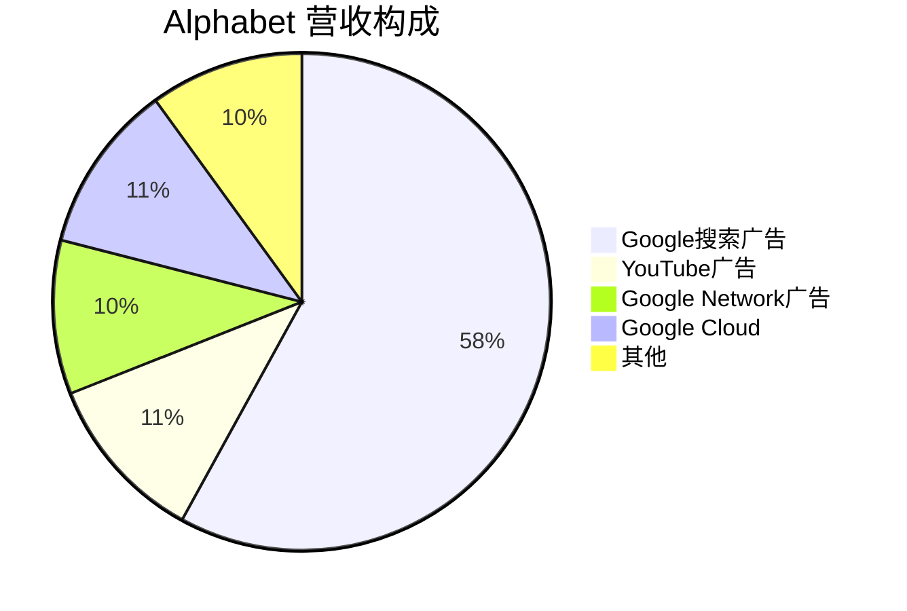

# Alphabet Inc. (Google) - 案例研究

## 公司概况

**基本信息**
- **公司名称**: Alphabet Inc. (Google母公司)
- **股票代码**: GOOGL, GOOG (NASDAQ)
- **成立时间**: Google 1998年, Alphabet 2015年重组
- **总部位置**: 美国加州山景城
- **创始人**: 拉里·佩奇、谢尔盖·布林
- **现任CEO**: 桑达尔·皮查伊 (Sundar Pichai, 2015年至今)

**主营业务**
- **Google Services**: 搜索、广告、YouTube、Android、Chrome、Maps
- **Google Cloud**: 云计算平台和企业解决方案
- **Other Bets**: Waymo (自动驾驶), Verily (生命科学), Wing (无人机配送)

**市值规模** (截至2024年)
- 市值: ~1.8万亿美元
- 全球市值前五大公司
- 标普500指数重要成分股

**上市信息**
- 首次公开募股 (IPO): 2004年8月19日
- IPO价格: $85/股
- 双重股权结构: A类(GOOGL, 1票), C类(GOOG, 无投票权)

## 商业模式分析

### 核心商业模式：广告驱动

**营收构成** (2023):

**广告业务特点**:
- 搜索广告: 高意图用户，转化率高，CPC高
- YouTube广告: 视频广告，品牌+效果广告
- Network广告: AdSense, AdMob分发网络
- 总广告营收占比: ~79%

### 业务板块详解

#### 1. Google Services (~90% 营收)

**搜索与广告**:
- Google Search: 全球搜索市场份额92%
- 日搜索量: 85亿+次
- 广告主: 数百万中小企业 + 大型品牌
- 商业模式: CPC (按点击付费), CPM (按展示付费)

**YouTube**:
- 月活用户: 25亿+
- 日观看时长: 10亿+小时
- 广告营收: $310亿 (2023)
- YouTube Premium订阅: 1亿+用户

**Android & Play Store**:
- Android市场份额: 72% (全球)
- Play Store应用: 350万+
- 应用内购买和订阅分成: 15-30%

**其他服务**:
- Gmail: 18亿+用户
- Google Maps: 10亿+用户
- Chrome浏览器: 65%市场份额
- Google Drive: 云存储服务

#### 2. Google Cloud (~11% 营收)

**产品组合**:
- Google Cloud Platform (GCP): IaaS/PaaS
- Google Workspace: 企业生产力工具
- AI/ML服务: Vertex AI, TensorFlow

**市场地位**:
- 全球第三大云服务商
- 市场份额: ~10%
- 增长率: 25-30%/年
- 2023年首次实现盈利

**竞争优势**:
- AI/ML技术领先
- 数据分析能力强
- 开源生态 (Kubernetes, TensorFlow)

#### 3. Other Bets (~1% 营收)

**主要项目**:
- **Waymo**: 自动驾驶技术，估值$300亿+
- **Verily**: 生命科学和健康技术
- **Wing**: 无人机配送
- **Calico**: 抗衰老研究

**特点**: 高风险高回报的"登月项目"，目前亏损但长期潜力大

## 财务分析

### 收入增长

**10年营收趋势** (单位: 十亿美元)

| 年份 | 营收 | 同比增长 | 广告营收 | 云营收 | 营业利润 |
|------|------|----------|----------|--------|----------|
| 2014 | 66 | +19% | 59 | - | 16 |
| 2015 | 75 | +14% | 67 | - | 19 |
| 2016 | 90 | +20% | 79 | - | 23 |
| 2017 | 111 | +23% | 95 | - | 27 |
| 2018 | 137 | +23% | 116 | 6 | 27 |
| 2019 | 162 | +18% | 135 | 9 | 34 |
| 2020 | 183 | +13% | 147 | 13 | 41 |
| 2021 | 258 | +41% | 209 | 19 | 79 |
| 2022 | 283 | +10% | 224 | 26 | 75 |
| 2023 | 307 | +9% | 238 | 33 | 84 |

**关键观察**:
- 2014-2023年CAGR: ~18%
- 2021年疫情后强劲反弹 (+41%)
- 广告业务占比从90%降至78%，多元化
- 云业务快速增长，2023年首次盈利

### 盈利能力

**关键指标**:

| 指标 | 2019 | 2020 | 2021 | 2022 | 2023 |
|------|------|------|------|------|------|
| 毛利率 | 55.6% | 56.9% | 56.9% | 55.5% | 56.9% |
| 营业利润率 | 21.0% | 22.4% | 30.6% | 26.5% | 27.4% |
| 净利率 | 21.2% | 22.3% | 29.5% | 21.2% | 23.5% |
| ROE | 17.7% | 18.2% | 30.2% | 20.6% | 24.1% |
| ROIC | 16.2% | 17.8% | 28.5% | 19.8% | 23.2% |

**盈利特点**:
- 高毛利率 (57%): 软件和广告边际成本低
- 2021年利润率飙升: 疫情期间广告需求激增
- 2022年回落: 经济放缓，广告支出下降
- ROE和ROIC优秀但低于Microsoft和Apple

### 现金流

**现金流表现** (单位: 十亿美元):

| 年份 | 经营现金流 | 资本支出 | 自由现金流 | FCF利润率 |
|------|------------|----------|------------|-----------|
| 2019 | 54 | -23 | 31 | 19% |
| 2020 | 65 | -22 | 43 | 23% |
| 2021 | 91 | -24 | 67 | 26% |
| 2022 | 91 | -31 | 60 | 21% |
| 2023 | 101 | -32 | 69 | 22% |

**资本配置**:
- 高资本支出: 数据中心、AI基础设施
- 股票回购: 年度$600-700亿
- 不支付股息 (保留现金用于创新)
- 战略并购: YouTube ($16.5亿), DoubleClick ($31亿), Fitbit ($21亿)

## 竞争分析

### 搜索市场主导地位

**全球搜索市场份额** (2023):
- Google: 92%
- Bing (Microsoft): 3%
- Yahoo: 1%
- Baidu (中国): 1%
- 其他: 3%

**搜索护城河**:
- 网络效应: 用户多→数据多→算法好→用户更多
- 品牌: "Google it" 成为搜索代名词
- 默认搜索引擎: 支付Apple/Mozilla等$200亿+/年
- 技术领先: 搜索算法、AI理解

### 竞争优势 (护城河)

#### 1. 网络效应 (★★★★★)

**搜索网络效应**:
- 85亿+日搜索量
- 海量数据训练算法
- 搜索质量持续提升
- 竞争对手难以追赶

**YouTube网络效应**:
- 创作者越多→内容越多→观众越多→创作者更多
- 25亿+月活用户
- 内容库无可匹敌

#### 2. 规模优势 (★★★★★)

**数据中心规模**:
- 全球30+数据中心
- 年资本支出$320亿
- 单位成本最低

**广告平台规模**:
- 数百万广告主
- 自动化竞价系统
- 精准定向能力

#### 3. 品牌与用户习惯 (★★★★☆)

**品牌价值**:
- 全球最有价值品牌之一
- "Google" 成为动词
- 用户信任度高

**用户习惯**:
- 搜索首选
- Chrome浏览器默认
- Android生态整合

#### 4. 技术领先 (★★★★★)

**AI/ML能力**:
- DeepMind (AlphaGo, AlphaFold)
- Transformer架构 (BERT, LaMDA)
- Gemini大语言模型
- TensorFlow开源框架

**创新文化**:
- 20%时间政策
- 登月项目 (Moonshots)
- 顶尖人才吸引力

### 主要竞争对手

#### 搜索领域
- **Microsoft Bing**: AI整合 (ChatGPT), 但市场份额仍小
- **DuckDuckGo**: 隐私保护，小众市场
- **百度**: 中国市场主导

#### 云计算领域
- **AWS**: 市场领导者
- **Azure**: 企业客户强
- **阿里云**: 亚洲市场

#### 视频领域
- **TikTok**: 短视频竞争激烈
- **Netflix**: 长视频内容
- **Meta (Instagram, Facebook)**: 社交视频

## 投资论点

### 看多理由 (Bull Case)

#### 1. 搜索广告护城河深厚 (★★★★★)
- 92%市场份额难以撼动
- AI搜索提升用户体验
- 广告主依赖度高
- 定价权强

#### 2. YouTube增长潜力 (★★★★☆)
- 短视频 (Shorts) 快速增长
- 订阅服务 (Premium, TV) 扩张
- 创作者经济繁荣
- 广告库存增加

#### 3. 云业务盈利转折 (★★★★☆)
- 2023年首次盈利
- AI/ML差异化优势
- 企业客户增长
- 利润率提升空间大

#### 4. AI领导地位 (★★★★★)
- Gemini大模型竞争力强
- AI整合到所有产品
- DeepMind技术领先
- 开源生态优势

#### 5. 财务实力雄厚 (★★★★★)
- 现金$1150亿
- 自由现金流$690亿/年
- 无债务
- 持续回购支撑股价

### 风险因素 (Bear Case)

#### 1. 监管风险 (★★★★★)
- **反垄断**: 美国DOJ诉讼，可能被拆分
- **隐私法规**: GDPR, CCPA限制数据使用
- **广告监管**: 透明度要求增加
- **应用商店**: Play Store佣金率压力

**潜在影响**: 搜索默认协议被禁，广告营收下降10-20%

#### 2. AI搜索颠覆风险 (★★★★☆)
- ChatGPT等AI工具改变搜索行为
- 用户直接获取答案，减少点击
- 广告展示机会减少
- 需要重新设计商业模式

#### 3. 广告市场周期性 (★★★☆☆)
- 经济衰退时广告支出下降
- 2022年增长放缓验证
- 对宏观经济敏感

#### 4. 云业务竞争激烈 (★★★☆☆)
- AWS和Azure领先优势
- 价格战压力
- 企业客户获取成本高

#### 5. 创新项目亏损 (★★☆☆☆)
- Other Bets持续亏损
- Waymo商业化缓慢
- 投资回报不确定

### 估值分析

**当前估值** (2024年初):
- P/E: ~25x
- P/S: ~6x
- EV/EBITDA: ~18x
- FCF Yield: ~4%

**DCF估值**: 合理价值$140-160
**相对估值**: 相对科技巨头估值合理

**投资评级**: **买入** (Buy)

**目标价**: $155 (基于$135当前价格, +15%上涨空间)

## 关键学习点

### 1. 网络效应的威力
- 搜索网络效应创造难以逾越的护城河
- 数据优势随时间累积
- 规模优势转化为成本优势

### 2. 广告商业模式的优势
- 双边市场: 用户免费，广告主付费
- 高利润率，可扩展性强
- 但依赖宏观经济和监管环境

### 3. 技术创新的重要性
- 持续投资AI/ML保持领先
- 开源策略建立生态
- 登月项目培养创新文化

### 4. 多元化的必要性
- 过度依赖广告的风险
- 云业务提供第二增长曲线
- Other Bets探索未来机会

### 5. 监管风险管理
- 科技巨头面临日益严格的监管
- 需要平衡增长和合规
- 反垄断风险是长期挑战

## 延伸阅读

### 推荐书籍
1. **《Google如何运营》** - Eric Schmidt, Jonathan Rosenberg
2. **《重新定义公司》** - Eric Schmidt
3. **《In the Plex》** - Steven Levy (Google内部运作)

### 相关案例
- [Microsoft - 云计算竞争](./microsoft.html)
- [Meta - 广告商业模式](./meta.html)
- [Amazon - AWS云服务](./amazon.html)
- [平台商业模式](../../business-models/platform-business.html)

## 参考文献

1. Alphabet Inc. Annual Reports (2014-2023)
2. Alphabet 10-K Filings, SEC
3. Schmidt, E., & Rosenberg, J. (2014). *How Google Works*
4. Levy, S. (2011). *In the Plex*. Simon & Schuster
5. StatCounter Global Stats - Search Engine Market Share
6. Gartner Cloud Market Share Reports (2023)
7. eMarketer Digital Advertising Reports (2023)
8. DOJ vs. Google Antitrust Case Documents (2023)
9. Goldman Sachs Alphabet Research (2023)
10. Morgan Stanley Internet Research (2023)

---

**最后更新**: 2024年1月15日  
**数据截止**: 2023财年 (2023年12月31日)

**免责声明**: 本案例研究仅供教育目的，不构成投资建议。

## 深度分析

### 核心机制解析

理解本主题需要从多个维度进行系统性分析。以下从理论基础、实践应用和历史验证三个层面展开深度探讨。

**理论基础层面**：本主题的核心逻辑建立在经济学和金融学的基本原理之上。通过对基础理论的深入理解，投资者能够建立起稳固的分析框架，避免被市场短期噪音所干扰。

**实践应用层面**：理论必须与实践相结合才能产生价值。在实际投资决策中，需要将抽象的概念转化为具体的分析工具和决策标准。

**历史验证层面**：金融市场有着丰富的历史记录，通过研究历史案例，我们可以验证理论的有效性，并从中提炼出具有普遍意义的规律。

### 关键影响因素

影响本主题的关键因素可以从以下几个维度进行分析：

1. **宏观经济环境**：利率水平、通货膨胀率、经济增长速度等宏观变量对本主题有着深远影响。在不同的宏观经济周期中，相关指标的表现会呈现出显著差异。

2. **市场结构因素**：市场参与者的构成、信息传播机制、流动性状况等市场结构因素决定了价格发现的效率和准确性。

3. **政策监管环境**：政府政策、监管框架的变化会直接影响相关市场的运作规则和参与者行为。

4. **技术创新驱动**：技术进步不断改变着金融市场的运作方式，从算法交易到区块链技术，每一次技术革新都带来新的机遇和挑战。

5. **全球化与地缘政治**：在全球化背景下，各国市场之间的联动性日益增强，地缘政治风险的影响也越来越不可忽视。

### 量化分析框架

为了更精确地分析和评估，可以采用以下量化框架：

| 分析维度 | 关键指标 | 参考基准 | 分析方法 |
|---------|---------|---------|---------|
| 规模评估 | 绝对值与相对值 | 历史均值 | 趋势分析 |
| 质量评估 | 稳定性指标 | 行业对标 | 横向比较 |
| 风险评估 | 波动率指标 | 风险阈值 | 情景分析 |
| 价值评估 | 估值倍数 | 历史区间 | 回归分析 |

通过系统性地应用上述框架，投资者可以对目标进行全面、客观的评估，从而做出更加理性的投资决策。

## 高级分析与前沿研究

### 学术研究进展

近年来，学术界对本领域的研究取得了重要进展。以下是几个值得关注的研究方向：

**行为金融学视角**：传统金融理论假设市场参与者是完全理性的，但行为金融学的研究表明，认知偏差和情绪因素在投资决策中扮演着重要角色。诺贝尔经济学奖得主丹尼尔·卡尼曼（Daniel Kahneman）和理查德·塞勒（Richard Thaler）的研究为我们理解市场非理性行为提供了重要框架。

**因子投资研究**：尤金·法玛（Eugene Fama）和肯尼斯·弗伦奇（Kenneth French）的三因子模型，以及后续发展的五因子模型，为系统性地解释股票收益差异提供了理论基础。这些研究表明，市值、账面市值比、盈利能力和投资模式等因子能够解释大部分股票收益的横截面差异。

**市场微观结构研究**：对市场流动性、价格发现机制和交易成本的深入研究，帮助我们更好地理解市场的运作机制，并为优化交易策略提供指导。

### 实战案例深度解析

**案例一：长期价值创造的典范**

以沃伦·巴菲特（Warren Buffett）的伯克希尔·哈撒韦（Berkshire Hathaway）为例，其长达数十年的卓越投资业绩证明了价值投资理念的有效性。从1965年至今，伯克希尔的账面价值年均增长率约为19.8%，远超同期标普500指数的约10.2%年均回报。

巴菲特的成功秘诀在于：
- 专注于具有持久竞争优势的优质企业
- 以合理价格买入，而非追求最低价格
- 长期持有，让复利效应充分发挥
- 保持充足的安全边际，控制下行风险

**案例二：危机中的机遇识别**

2008年金融危机期间，大多数投资者恐慌性抛售，但少数具有前瞻性的投资者却在危机中发现了历史性的投资机会。约翰·保尔森（John Paulson）通过做空次级抵押贷款相关证券，在危机中获得了约150亿美元的利润，成为金融史上最成功的单笔交易之一。

这个案例告诉我们：
- 深入的基本面研究能够发现市场定价错误
- 逆向思维往往能够发现被市场忽视的机会
- 风险管理和仓位控制是成功的关键

### 跨市场比较分析

不同市场在结构、监管、投资者构成等方面存在显著差异，这些差异对投资策略的选择有重要影响：

**美国市场特征**：
- 机构投资者主导，市场效率较高
- 信息披露制度完善，分析师覆盖广泛
- 衍生品市场发达，对冲工具丰富
- 长期牛市历史，但也经历过多次重大调整

**中国市场特征**：
- 散户投资者比例较高，市场波动性较大
- 政策因素影响显著，需要密切关注监管动向
- 新兴行业发展迅速，成长投资机会丰富
- A股、港股、美股中概股形成多层次市场体系

**欧洲市场特征**：
- 价值股比例较高，估值相对保守
- 受地缘政治和欧元区政策影响较大
- 部分行业（如奢侈品、工业）具有全球竞争优势
- ESG投资理念推广较为领先

