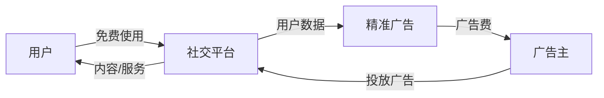

# Meta Platforms Inc. (Facebook) - 案例研究

## 公司概况

**基本信息**
- **公司名称**: Meta Platforms, Inc. (原Facebook, Inc.)
- **股票代码**: META (NASDAQ)
- **成立时间**: 2004年2月4日
- **总部位置**: 美国加州门洛帕克
- **创始人**: 马克·扎克伯格 (Mark Zuckerberg)
- **现任CEO**: 马克·扎克伯格 (2004年至今)

**主营业务**
- **Family of Apps (FoA)**: Facebook, Instagram, WhatsApp, Messenger
- **Reality Labs**: VR/AR硬件 (Quest), 元宇宙平台 (Horizon)
- **广告服务**: 社交媒体广告平台
- **商业工具**: Marketplace, Shops, Business Suite

**市值规模** (截至2024年)
- 市值: ~1.2万亿美元
- 全球市值前十大公司
- 标普500指数重要成分股

**上市信息**
- 首次公开募股 (IPO): 2012年5月18日
- IPO价格: $38/股
- 公司更名: 2021年10月从Facebook更名为Meta

**用户规模** (2023 Q4):
- Facebook月活用户 (MAU): 30.7亿
- Family of Apps日活用户 (DAU): 31.4亿
- 全球互联网用户渗透率: ~60%

## 商业模式分析

### 核心商业模式：广告驱动

**商业模式本质**:

**价值主张**:
- **对用户**: 免费社交网络，连接朋友家人
- **对广告主**: 精准定向，高ROI，大规模触达
- **对创作者**: 内容分发平台，变现机会

### 营收构成

**2023年营收结构** (总营收$1348亿):

| 业务板块 | 营收 (亿美元) | 占比 | 同比增长 |
|----------|---------------|------|----------|
| 广告收入 | 1315 | 97.5% | +16% |
| 其他收入 | 33 | 2.5% | +14% |
| **总计** | **1348** | **100%** | **16%** |

**地区分布**:
- 美国/加拿大: 48% 营收, 但仅8% 用户
- 欧洲: 24% 营收, 16% 用户
- 亚太: 19% 营收, 50% 用户
- 其他: 9% 营收, 26% 用户

**ARPU (每用户平均收入)**:
- 美国/加拿大: $60.57/季度
- 欧洲: $19.13/季度
- 亚太: $4.89/季度
- 全球平均: $11.23/季度

### 业务板块详解

#### 1. Family of Apps (97.5% 营收)

**Facebook** (核心平台):
- 月活用户: 30.7亿
- 日活用户: 21.1亿
- 用户参与度: 日均使用30-40分钟
- 功能: 动态、群组、Marketplace、Watch

**Instagram**:
- 月活用户: 20亿+
- 日活用户: 5亿+
- Reels (短视频): 快速增长，对抗TikTok
- Stories: 日活5亿+
- 商业化: 广告、购物、创作者变现

**WhatsApp**:
- 月活用户: 20亿+
- 全球最大即时通讯应用
- 商业化: Business API, 企业通讯
- 增长潜力: 商业化仍在早期

**Messenger**:
- 月活用户: 10亿+
- 功能: 即时通讯、视频通话、支付
- 商业化: 广告、商业工具

**广告产品**:
- **Feed广告**: 动态流广告
- **Stories广告**: 全屏沉浸式广告
- **Reels广告**: 短视频广告
- **Messenger广告**: 聊天广告
- **Audience Network**: 第三方应用广告网络

#### 2. Reality Labs (2.5% 营收, 大额亏损)

**硬件产品**:
- **Quest系列**: VR头显，市场份额50%+
- **Ray-Ban Stories**: 智能眼镜
- **未来产品**: AR眼镜 (Project Nazare)

**软件平台**:
- **Horizon Worlds**: 元宇宙社交平台
- **Horizon Workrooms**: VR会议
- **VR游戏和应用**: 生态系统建设

**财务表现**:
- 2023年营收: $18亿
- 2023年亏损: $163亿
- 累计投资: $500亿+ (2019-2023)

## 财务分析

### 收入增长

**10年营收趋势** (单位: 十亿美元)

| 年份 | 营收 | 同比增长 | 广告营收 | MAU (亿) | ARPU |
|------|------|----------|----------|----------|------|
| 2014 | 12.5 | +58% | 11.5 | 13.9 | $9.0 |
| 2015 | 17.9 | +44% | 17.1 | 15.5 | $11.5 |
| 2016 | 27.6 | +54% | 26.9 | 18.6 | $14.8 |
| 2017 | 40.7 | +47% | 39.9 | 21.3 | $19.1 |
| 2018 | 55.8 | +37% | 55.0 | 23.2 | $24.1 |
| 2019 | 70.7 | +27% | 69.7 | 25.2 | $28.0 |
| 2020 | 86.0 | +22% | 84.2 | 27.4 | $31.4 |
| 2021 | 118.0 | +37% | 115.0 | 29.3 | $40.3 |
| 2022 | 116.6 | -1% | 113.6 | 29.6 | $39.4 |
| 2023 | 134.8 | +16% | 131.5 | 30.7 | $43.9 |

**关键观察**:
- 2014-2023年CAGR: ~30%
- 2022年首次营收下滑 (宏观+iOS隐私)
- 2023年强劲反弹 (+16%)
- 用户增长放缓，ARPU提升驱动增长

### 盈利能力

**关键盈利指标**:

| 指标 | 2019 | 2020 | 2021 | 2022 | 2023 |
|------|------|------|------|------|------|
| 毛利率 | 82.0% | 80.8% | 80.8% | 78.9% | 81.5% |
| 营业利润率 | 34.1% | 38.1% | 40.0% | 25.3% | 36.3% |
| 净利率 | 26.1% | 33.9% | 33.4% | 20.4% | 29.1% |
| ROE | 20.5% | 23.6% | 31.5% | 18.6% | 29.7% |
| ROIC | 18.3% | 21.2% | 28.4% | 16.8% | 27.1% |

**盈利特点**:
- 超高毛利率 (81%): 软件和广告边际成本极低
- 2022年利润率下滑: Reality Labs亏损 + 成本上升
- 2023年恢复: 成本控制 ("效率年") + 营收增长

### 成本结构

**2023年成本分解** (单位: 十亿美元):

| 成本项 | 金额 | 占营收% | 说明 |
|--------|------|---------|------|
| 营收成本 | 25 | 19% | 数据中心、内容审核 |
| 研发 | 38 | 28% | 产品开发、AI、Reality Labs |
| 销售与营销 | 14 | 10% | 广告、销售团队 |
| 管理费用 | 9 | 7% | 总部管理 |
| **总成本** | **86** | **64%** | |

**Reality Labs亏损**:
- 2021年: -$101亿
- 2022年: -$137亿
- 2023年: -$163亿
- 累计亏损: $500亿+

### 现金流

**现金流表现** (单位: 十亿美元):

| 年份 | 经营现金流 | 资本支出 | 自由现金流 | FCF利润率 |
|------|------------|----------|------------|-----------|
| 2019 | 37 | -15 | 22 | 31% |
| 2020 | 38 | -16 | 22 | 26% |
| 2021 | 57 | -19 | 38 | 32% |
| 2022 | 40 | -32 | 8 | 7% |
| 2023 | 71 | -28 | 43 | 32% |

**资本配置**:
- 股票回购: 年度$200-400亿
- 不支付股息
- 高资本支出: AI基础设施、数据中心
- Reality Labs投资: 年度$150-200亿

## 竞争分析

### 社交媒体市场

**全球社交平台用户** (2023):
- Facebook: 30.7亿 MAU
- YouTube: 25亿+ MAU
- WhatsApp: 20亿+ MAU
- Instagram: 20亿+ MAU
- TikTok: 15亿+ MAU
- WeChat: 13亿+ MAU

### 竞争优势 (护城河)

#### 1. 网络效应 (★★★★★)

**强大的网络效应**:
- 用户越多→价值越大→吸引更多用户
- 30亿+用户的网络难以复制
- 朋友家人都在使用，转换成本高

**多层网络效应**:
- 用户网络: 社交图谱
- 内容网络: 创作者和观众
- 广告网络: 广告主和用户

#### 2. 数据优势 (★★★★★)

**海量用户数据**:
- 社交关系图谱
- 兴趣和行为数据
- 跨平台数据 (Facebook, Instagram, WhatsApp)

**数据应用**:
- 精准广告定向
- 内容推荐算法
- 产品优化

#### 3. 规模优势 (★★★★★)

**用户规模**:
- 31亿+日活用户
- 覆盖全球60%互联网用户
- 多个10亿+用户平台

**广告平台规模**:
- 1000万+广告主
- 自动化竞价系统
- 全球覆盖能力

#### 4. 品牌组合 (★★★★☆)

**多品牌策略**:
- Facebook: 综合社交
- Instagram: 视觉社交、年轻用户
- WhatsApp: 即时通讯
- Messenger: 聊天工具

**风险分散**: 不同平台覆盖不同用户群

### 主要竞争对手

#### TikTok (字节跳动)
- **优势**: 短视频算法领先，年轻用户吸引力强
- **威胁**: 抢占用户时间，特别是年轻用户
- **Meta应对**: Reels短视频，算法优化

#### YouTube (Google)
- **优势**: 视频内容最全，创作者生态成熟
- **竞争领域**: 视频广告、创作者平台

#### Snapchat
- **优势**: AR滤镜，年轻用户
- **竞争领域**: Stories功能，AR技术

#### Twitter/X
- **优势**: 实时新闻，公共讨论
- **竞争领域**: 新闻分发，公共话语权

## 投资论点

### 看多理由 (Bull Case)

#### 1. 广告业务恢复增长 (★★★★★)
- 2023年营收+16%，强劲反弹
- AI广告工具提升ROI
- Reels商业化加速
- WhatsApp商业化潜力大

#### 2. AI驱动的效率提升 (★★★★★)
- AI推荐算法提升参与度
- AI广告工具提升转化率
- 内容审核自动化降低成本
- "效率年"成本控制见效

#### 3. Reels增长 (★★★★☆)
- 日观看量2000亿+
- 用户参与度提升
- 商业化进展顺利
- 对抗TikTok有效

#### 4. 估值合理 (★★★★☆)
- P/E ~23x，低于历史平均
- 相对科技巨头估值便宜
- 成长性恢复，估值有提升空间

#### 5. 股票回购 (★★★★☆)
- 年度回购$200-400亿
- 流通股减少
- 支撑股价和EPS增长

### 风险因素 (Bear Case)

#### 1. 监管风险 (★★★★★)
- **反垄断**: 可能被拆分 (Instagram, WhatsApp)
- **隐私法规**: 限制数据使用和广告定向
- **内容监管**: 虚假信息、有害内容责任
- **青少年保护**: 限制未成年人使用

**潜在影响**: 广告效果下降，营收和利润率压力

#### 2. 用户增长放缓 (★★★★☆)
- 发达市场饱和
- 年轻用户流失到TikTok
- 用户参与度下降风险
- 依赖ARPU提升驱动增长

#### 3. Reality Labs巨额亏损 (★★★★☆)
- 年度亏损$160亿+
- 商业化前景不明
- 投资回报不确定
- 拖累整体利润率

#### 4. 竞争加剧 (★★★★☆)
- TikTok抢占用户时间
- YouTube视频广告竞争
- 新兴社交平台威胁
- 广告市场竞争激烈

#### 5. 宏观经济敏感 (★★★☆☆)
- 广告支出对经济周期敏感
- 经济衰退时广告预算削减
- 2022年验证了这一风险

### 估值分析

**当前估值** (2024年初):
- P/E: ~23x
- P/S: ~9x
- EV/EBITDA: ~16x
- FCF Yield: ~3.5%

**分部估值**:
- Family of Apps: $1.2-1.4万亿
- Reality Labs: -$200-300亿 (负值)
- 总价值: $1.0-1.2万亿

**投资评级**: **买入** (Buy)

**目标价**: $450 (基于$380当前价格, +18%上涨空间)

## 关键学习点

### 1. 网络效应的威力
- 社交网络的网络效应极强
- 30亿用户的网络难以复制
- 先发优势转化为持久优势

### 2. 广告商业模式的优势与风险
- 高利润率，可扩展性强
- 但依赖用户数据和隐私政策
- 监管风险是长期挑战

### 3. 平台组合策略
- 多个平台覆盖不同用户群
- 风险分散，增长多元化
- Instagram收购是经典案例

### 4. 转型的挑战
- 元宇宙转型投入巨大
- 短期拖累利润
- 长期前景不确定
- 需要平衡当前业务和未来投资

### 5. 效率的重要性
- 2023年"效率年"成效显著
- 成本控制提升利润率
- 裁员和优先级调整
- 增长和效率的平衡

## 延伸阅读

### 推荐书籍
1. **《Facebook效应》** - David Kirkpatrick
2. **《扎克伯格传》** - Steven Levy
3. **《The Ugly Truth》** - Sheera Frenkel, Cecilia Kang

### 相关案例
- [Google - 广告商业模式](./google.html)
- [Apple - 隐私政策影响](./apple.html)
- [Amazon - 平台经济](./amazon.html)
- [平台商业模式](../../business-models/platform-business.html)

## 参考文献

1. Meta Platforms Inc. Annual Reports (2014-2023)
2. Meta 10-K Filings, SEC
3. Kirkpatrick, D. (2010). *The Facebook Effect*. Simon & Schuster
4. Frenkel, S., & Kang, C. (2021). *An Ugly Truth*. Harper
5. Statista Social Media Statistics (2023)
6. eMarketer Digital Advertising Reports (2023)
7. IDC VR/AR Market Reports (2023)
8. Goldman Sachs Meta Research (2023)
9. Morgan Stanley Internet Research (2023)
10. Bernstein: "Meta: The Efficiency Transformation" (2023)

---

**最后更新**: 2024年1月15日  
**数据截止**: 2023财年 (2023年12月31日)

**免责声明**: 本案例研究仅供教育目的，不构成投资建议。

## 深度分析

### 核心机制解析

理解本主题需要从多个维度进行系统性分析。以下从理论基础、实践应用和历史验证三个层面展开深度探讨。

**理论基础层面**：本主题的核心逻辑建立在经济学和金融学的基本原理之上。通过对基础理论的深入理解，投资者能够建立起稳固的分析框架，避免被市场短期噪音所干扰。

**实践应用层面**：理论必须与实践相结合才能产生价值。在实际投资决策中，需要将抽象的概念转化为具体的分析工具和决策标准。

**历史验证层面**：金融市场有着丰富的历史记录，通过研究历史案例，我们可以验证理论的有效性，并从中提炼出具有普遍意义的规律。

### 关键影响因素

影响本主题的关键因素可以从以下几个维度进行分析：

1. **宏观经济环境**：利率水平、通货膨胀率、经济增长速度等宏观变量对本主题有着深远影响。在不同的宏观经济周期中，相关指标的表现会呈现出显著差异。

2. **市场结构因素**：市场参与者的构成、信息传播机制、流动性状况等市场结构因素决定了价格发现的效率和准确性。

3. **政策监管环境**：政府政策、监管框架的变化会直接影响相关市场的运作规则和参与者行为。

4. **技术创新驱动**：技术进步不断改变着金融市场的运作方式，从算法交易到区块链技术，每一次技术革新都带来新的机遇和挑战。

5. **全球化与地缘政治**：在全球化背景下，各国市场之间的联动性日益增强，地缘政治风险的影响也越来越不可忽视。

### 量化分析框架

为了更精确地分析和评估，可以采用以下量化框架：

| 分析维度 | 关键指标 | 参考基准 | 分析方法 |
|---------|---------|---------|---------|
| 规模评估 | 绝对值与相对值 | 历史均值 | 趋势分析 |
| 质量评估 | 稳定性指标 | 行业对标 | 横向比较 |
| 风险评估 | 波动率指标 | 风险阈值 | 情景分析 |
| 价值评估 | 估值倍数 | 历史区间 | 回归分析 |

通过系统性地应用上述框架，投资者可以对目标进行全面、客观的评估，从而做出更加理性的投资决策。

