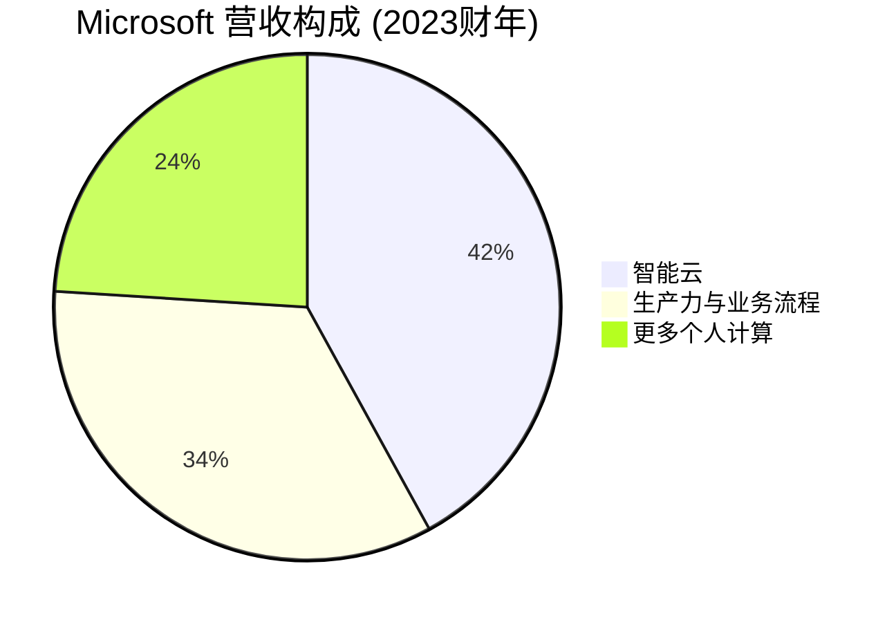

# Microsoft Corporation - 案例研究

## 公司概况

**基本信息**
- **公司名称**: Microsoft Corporation
- **股票代码**: MSFT (NASDAQ)
- **成立时间**: 1975年4月4日
- **总部位置**: 美国华盛顿州雷德蒙德
- **创始人**: 比尔·盖茨、保罗·艾伦
- **现任CEO**: 萨提亚·纳德拉 (Satya Nadella, 2014年至今)

**主营业务**
- **生产力与业务流程**: Office 365, LinkedIn, Dynamics 365
- **智能云**: Azure, SQL Server, Windows Server, GitHub
- **更多个人计算**: Windows, Surface, Xbox, 搜索广告

**市值规模** (截至2024年)
- 市值: ~3.1万亿美元
- 全球市值第二大公司
- 标普500指数重要成分股

**上市信息**
- 首次公开募股 (IPO): 1986年3月13日
- IPO价格: $21/股 (调整后约$0.07/股)
- 累计股票分拆: 9次

## 商业模式分析

### 价值主张

Microsoft 的核心价值主张经历了重大转型:

**传统价值主张** (1975-2014):
- Windows操作系统主导地位
- Office办公软件标准
- 企业IT基础设施

**新价值主张** (2014至今):
- 云优先、移动优先战略
- 智能云平台 (Azure)
- 订阅制生产力工具
- AI驱动的创新

### 业务板块

#### 1. 智能云 (Intelligent Cloud) - 42%

**核心产品**:
- **Azure**: 公有云平台，IaaS/PaaS/SaaS
- **SQL Server**: 数据库软件
- **Windows Server**: 服务器操作系统
- **GitHub**: 开发者平台
- **Enterprise Services**: 企业支持和咨询

**增长驱动力**:
- 企业数字化转型
- 云迁移加速
- AI和机器学习需求
- 混合云解决方案

**竞争地位**: 
- 全球第二大云服务商 (市场份额~23%)
- 仅次于AWS (~32%), 领先Google Cloud (~10%)

#### 2. 生产力与业务流程 (Productivity and Business Processes) - 34%

**核心产品**:
- **Office 365**: 云端办公套件 (Word, Excel, PowerPoint, Teams)
- **Microsoft 365**: 企业生产力平台
- **LinkedIn**: 职业社交网络 (2016年收购, $262亿)
- **Dynamics 365**: 企业资源规划 (ERP) 和客户关系管理 (CRM)

**商业模式转型**:
- 从一次性授权 → 订阅制 (SaaS)
- Office 2013: 一次性购买$400
- Office 365: 月费$10-20, 年费$100-240
- 订阅用户: 3.8亿+ (2023)

**优势**:
- 企业市场主导地位
- 高转换成本
- 网络效应 (Teams, LinkedIn)

#### 3. 更多个人计算 (More Personal Computing) - 24%

**核心产品**:
- **Windows**: PC操作系统 (OEM授权 + 企业授权)
- **Surface**: 自有品牌硬件
- **Xbox**: 游戏主机和游戏服务
- **搜索广告**: Bing搜索引擎

**业务特点**:
- Windows: 成熟业务，增长放缓
- Surface: 利润率低，展示Windows能力
- Xbox: 游戏订阅服务 (Game Pass) 增长
- 搜索: 市场份额小 (~3%), 但AI整合带来机会

### 收入模式演进

**历史转型**:

**收入模式对比**:

| 模式 | 传统授权 | 订阅制 | 云服务 |
|------|----------|--------|--------|
| 收入确认 | 一次性 | 经常性 | 按使用量 |
| 客户粘性 | 低 | 高 | 极高 |
| 利润率 | 中等 | 高 | 极高 |
| 增长潜力 | 有限 | 持续 | 快速 |
| 现金流 | 波动 | 稳定 | 强劲 |

### 成本结构

**主要成本** (占营收百分比):
- **产品成本** (~33%): 云基础设施、数据中心、硬件
- **研发费用** (~13%): 产品开发、AI研究
- **销售与营销** (~13%): 企业销售团队、营销活动
- **管理费用** (~5%): 总部管理、法务、财务

**成本优势**:
- 规模效应: 数据中心规模降低单位成本
- 软件边际成本低: 云服务边际成本递减
- 研发效率: 跨产品共享技术 (AI, 云平台)

### 关键资源

1. **技术资产**: 
   - Azure云平台
   - AI技术 (OpenAI合作, $130亿投资)
   - 专利组合 (6万+专利)

2. **客户基础**:
   - 企业客户: 95% 财富500强
   - Office 365用户: 3.8亿+
   - LinkedIn用户: 9.5亿+
   - Azure客户: 数百万

3. **品牌与生态**:
   - 企业市场信任度高
   - 开发者生态 (GitHub 1亿+用户)
   - 合作伙伴网络

4. **财务实力**:
   - 现金及投资: $1440亿
   - 年自由现金流: $650亿+
   - 信用评级: AAA

## 财务分析

### 收入增长

**10年营收趋势** (单位: 十亿美元)

| 财年 | 营收 | 同比增长 | 云营收 | 云占比 |
|------|------|----------|--------|--------|
| 2014 | 87 | +12% | 5 | 6% |
| 2015 | 94 | +8% | 8 | 9% |
| 2016 | 91 | -3% | 12 | 13% |
| 2017 | 96 | +5% | 19 | 20% |
| 2018 | 110 | +14% | 32 | 29% |
| 2019 | 126 | +14% | 44 | 35% |
| 2020 | 143 | +14% | 59 | 41% |
| 2021 | 168 | +18% | 75 | 45% |
| 2022 | 198 | +18% | 95 | 48% |
| 2023 | 211 | +7% | 111 | 53% |

**关键观察**:
- 2014-2023年CAGR: ~10%
- 云业务从6%增至53%，成功转型
- 2021-2022年疫情期间加速增长
- 2023年增长放缓，但仍保持健康

### 盈利能力

**关键盈利指标**:

| 指标 | 2019 | 2020 | 2021 | 2022 | 2023 | 行业平均 |
|------|------|------|------|------|------|----------|
| 毛利率 | 66.7% | 67.8% | 68.9% | 68.4% | 69.8% | 60-65% |
| 营业利润率 | 34.1% | 37.0% | 41.6% | 42.0% | 41.7% | 25-30% |
| 净利率 | 31.2% | 31.0% | 36.5% | 36.7% | 34.1% | 20-25% |
| ROE | 43.2% | 40.9% | 47.7% | 47.4% | 40.1% | 15-25% |
| ROA | 15.5% | 15.4% | 19.1% | 18.7% | 15.8% | 8-12% |
| ROIC | 27.3% | 28.1% | 35.2% | 35.8% | 30.2% | 12-18% |

**盈利能力分析**:
1. **超高毛利率** (70%): 软件和云服务边际成本低
2. **优秀的ROE** (40%): 高利润率 + 高效资产使用
3. **卓越的ROIC** (30%): 资本使用效率极高

### 现金流与资本配置

**现金流表现** (单位: 十亿美元):

| 财年 | 经营现金流 | 资本支出 | 自由现金流 | FCF利润率 |
|------|------------|----------|------------|-----------|
| 2019 | 52 | -13 | 39 | 31% |
| 2020 | 60 | -15 | 45 | 31% |
| 2021 | 76 | -20 | 56 | 33% |
| 2022 | 89 | -23 | 66 | 33% |
| 2023 | 87 | -28 | 59 | 28% |

**资本配置**:
- 股息: 年度分红$200亿+ (股息率0.8%)
- 回购: 年度回购$200-300亿
- 并购: 战略性收购 (LinkedIn $262亿, GitHub $75亿, Activision $687亿)
- 研发: 持续高投入 ($270亿/年)

## 竞争分析

### 云计算市场竞争

**市场份额** (2023):
- AWS (Amazon): 32%
- Azure (Microsoft): 23%
- Google Cloud: 10%
- 阿里云: 4%
- 其他: 31%

**Azure vs AWS**:

| 维度 | Azure | AWS |
|------|-------|-----|
| 市场份额 | 23% | 32% |
| 增长率 | 25-30% | 12-15% |
| 优势 | 企业客户、混合云、Office整合 | 先发优势、功能最全、生态最大 |
| 劣势 | 功能追赶中 | 增长放缓 |

**Azure竞争优势**:
- 企业客户关系深厚
- 混合云解决方案 (Azure Stack)
- Office 365整合
- AI能力 (OpenAI合作)

### 竞争优势 (护城河)

#### 1. 企业客户锁定 (★★★★★)

**转换成本极高**:
- Office生态系统深度整合
- Azure云基础设施迁移成本高
- 员工培训和习惯
- 数据迁移复杂

**客户粘性**:
- 企业客户续约率95%+
- 平均客户关系20年+
- 跨产品销售机会多

#### 2. 网络效应 (★★★★☆)

**多层网络效应**:
- **Teams**: 用户越多，价值越大
- **LinkedIn**: 职业社交网络效应
- **Azure**: 开发者和服务提供商生态
- **GitHub**: 开发者社区

#### 3. 规模优势 (★★★★★)

**云基础设施规模**:
- 全球60+数据中心区域
- 年资本支出$280亿+
- 规模带来成本优势

**研发规模**:
- 年研发投入$270亿
- 22万+员工
- AI领域大规模投资

#### 4. 品牌与信任 (★★★★☆)

**企业市场信任**:
- 50年企业软件经验
- 安全性和合规性
- 全球支持网络

## 投资论点

### 看多理由

#### 1. 云计算增长 (★★★★★)
- Azure增长25-30%/年
- 企业云迁移仍在早期
- 混合云优势明显

#### 2. AI领导地位 (★★★★★)
- OpenAI战略合作
- Copilot整合到所有产品
- AI驱动的生产力革命

#### 3. 订阅模式稳定 (★★★★☆)
- 经常性收入占比70%+
- 现金流可预测性强
- 客户终身价值高

#### 4. 财务实力雄厚 (★★★★★)
- 自由现金流$600亿+/年
- 现金储备$1440亿
- 持续股东回报

### 风险因素

#### 1. 云竞争加剧 (★★★☆☆)
- AWS领先优势
- Google Cloud追赶
- 价格战压力

#### 2. 监管风险 (★★★☆☆)
- 反垄断审查
- Activision收购审查
- 数据隐私法规

#### 3. AI投资回报不确定 (★★★☆☆)
- OpenAI投资$130亿
- AI变现模式待验证
- 竞争对手AI能力提升

### 估值分析

**当前估值** (2024年初):
- P/E: ~35x
- P/S: ~13x
- EV/EBITDA: ~25x

**DCF估值**: 合理价值$380-420
**相对估值**: 略高于历史平均，但增长支撑

**投资评级**: **买入** (Buy)

## 关键学习点

### 1. 成功的战略转型
- 从Windows到云的转型
- 纳德拉领导的文化变革
- "云优先、移动优先"战略

### 2. 订阅模式的威力
- 从授权到订阅的转型
- 经常性收入提升估值
- 客户终身价值最大化

### 3. 企业市场的价值
- B2B市场稳定性高
- 转换成本创造护城河
- 交叉销售机会多

### 4. AI战略布局
- OpenAI合作领先布局
- Copilot产品化
- AI驱动的增长

## 延伸阅读

### 推荐书籍
1. **《刷新》** - 萨提亚·纳德拉
2. **《微软重启》** - 罗伯特·斯莱特
3. **《硅谷钢铁侠》** - 关于科技巨头竞争

### 相关案例
- [Apple - 生态系统案例](./apple.html)
- [Amazon - AWS云服务](./amazon.html)
- [Google - 云计算竞争](./google.html)
- [SaaS商业模式](../../business-models/saas-models.html)

## 参考文献

1. Microsoft Corporation Annual Reports (2014-2023)
2. Microsoft 10-K Filings, SEC
3. Nadella, S. (2017). *Hit Refresh*. Harper Business
4. Gartner Cloud Market Share Reports (2023)
5. IDC Cloud Infrastructure Reports (2023)
6. Goldman Sachs Microsoft Research (2023)
7. Morgan Stanley Cloud Computing Research (2023)
8. Bernstein: "Microsoft: The AI Advantage" (2023)
9. Credit Suisse: "Azure Growth Analysis" (2023)
10. McKinsey: "Enterprise Cloud Adoption" (2022)

---

**最后更新**: 2024年1月15日  
**数据截止**: 2023财年 (2023年6月30日)

**免责声明**: 本案例研究仅供教育目的，不构成投资建议。

## 深度分析

### 核心机制解析

理解本主题需要从多个维度进行系统性分析。以下从理论基础、实践应用和历史验证三个层面展开深度探讨。

**理论基础层面**：本主题的核心逻辑建立在经济学和金融学的基本原理之上。通过对基础理论的深入理解，投资者能够建立起稳固的分析框架，避免被市场短期噪音所干扰。

**实践应用层面**：理论必须与实践相结合才能产生价值。在实际投资决策中，需要将抽象的概念转化为具体的分析工具和决策标准。

**历史验证层面**：金融市场有着丰富的历史记录，通过研究历史案例，我们可以验证理论的有效性，并从中提炼出具有普遍意义的规律。

### 关键影响因素

影响本主题的关键因素可以从以下几个维度进行分析：

1. **宏观经济环境**：利率水平、通货膨胀率、经济增长速度等宏观变量对本主题有着深远影响。在不同的宏观经济周期中，相关指标的表现会呈现出显著差异。

2. **市场结构因素**：市场参与者的构成、信息传播机制、流动性状况等市场结构因素决定了价格发现的效率和准确性。

3. **政策监管环境**：政府政策、监管框架的变化会直接影响相关市场的运作规则和参与者行为。

4. **技术创新驱动**：技术进步不断改变着金融市场的运作方式，从算法交易到区块链技术，每一次技术革新都带来新的机遇和挑战。

5. **全球化与地缘政治**：在全球化背景下，各国市场之间的联动性日益增强，地缘政治风险的影响也越来越不可忽视。

### 量化分析框架

为了更精确地分析和评估，可以采用以下量化框架：

| 分析维度 | 关键指标 | 参考基准 | 分析方法 |
|---------|---------|---------|---------|
| 规模评估 | 绝对值与相对值 | 历史均值 | 趋势分析 |
| 质量评估 | 稳定性指标 | 行业对标 | 横向比较 |
| 风险评估 | 波动率指标 | 风险阈值 | 情景分析 |
| 价值评估 | 估值倍数 | 历史区间 | 回归分析 |

通过系统性地应用上述框架，投资者可以对目标进行全面、客观的评估，从而做出更加理性的投资决策。

