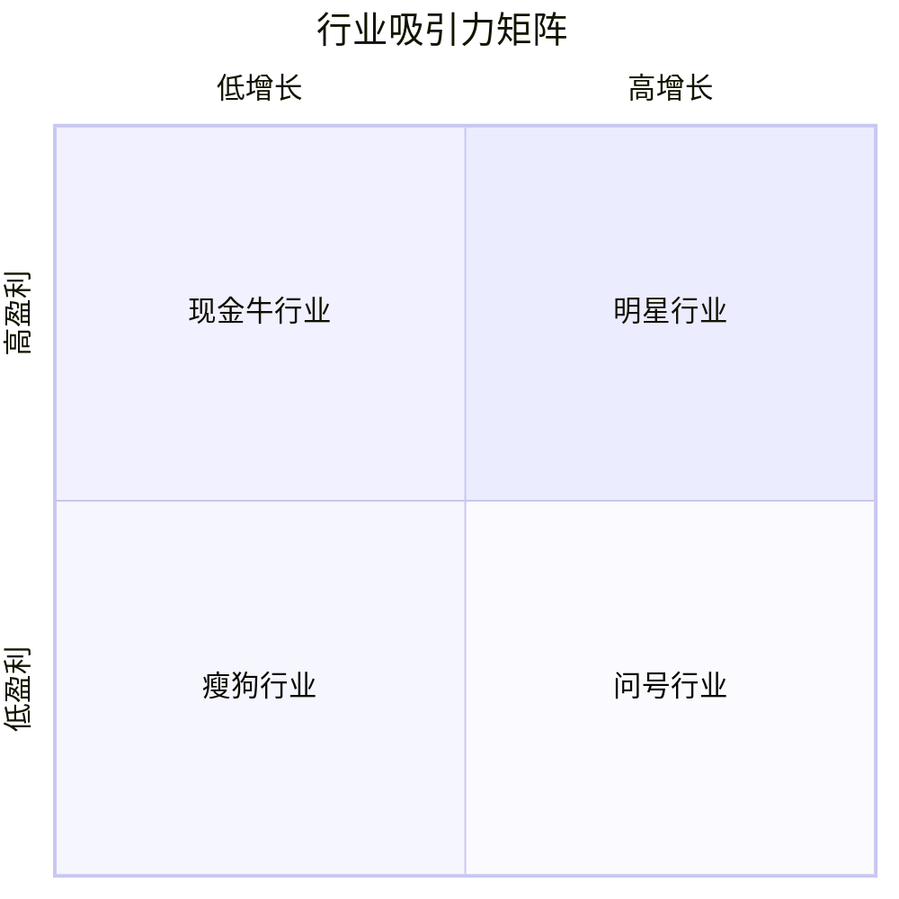

# 行业结构分析 - 理解行业特征与盈利潜力

## 概述

行业结构分析是理解企业竞争环境的基础。不同的行业结构决定了行业的盈利潜力、竞争强度和企业战略选择。

### 学习目标

1. 理解行业结构的关键要素
2. 掌握行业分类和特征分析
3. 评估行业吸引力
4. 识别行业演变趋势

## 行业结构要素

### 1. 市场集中度

**定义**：行业内企业的市场份额分布。

**衡量指标**：
- **CR4**：前四大企业市场份额之和
- **HHI**：赫芬达尔指数 = Σ(市场份额)²

**分类**：
- 高度集中（CR4 > 60%）：寡头垄断
- 中度集中（CR4 30-60%）：寡头竞争
- 低度集中（CR4 < 30%）：完全竞争

**案例**：
- 高集中：智能手机（苹果+三星 > 60%）
- 中集中：汽车行业
- 低集中：餐饮行业

### 2. 进入和退出壁垒

**进入壁垒**：
- 资本需求
- 规模经济
- 品牌忠诚度
- 政府监管
- 技术专利

**退出壁垒**：
- 专用资产
- 固定成本
- 劳动合同
- 政府限制

**影响**：
- 高进入+低退出 = 理想（高盈利）
- 低进入+高退出 = 最差（低盈利）

### 3. 产品差异化程度

**高差异化**：
- 品牌重要
- 价格竞争弱
- 利润率高
- 例：奢侈品、智能手机

**低差异化**：
- 价格竞争激烈
- 利润率低
- 规模重要
- 例：大宗商品、航空经济舱

### 4. 规模经济

**定义**：规模扩大导致单位成本下降。

**来源**：
- 生产规模经济
- 采购规模经济
- 营销规模经济
- 研发规模经济

**影响**：
- 规模经济显著 → 市场集中度高
- 规模经济不显著 → 市场分散

### 5. 垂直整合程度

**前向整合**：控制分销渠道
**后向整合**：控制供应链

**案例**：
- 高整合：特斯拉（自产电池、自建充电网络）
- 低整合：苹果（代工生产）

## 行业生命周期

### 1. 导入期（Introduction）

**特征**：
- 市场规模小
- 增长率高但不稳定
- 技术不成熟
- 竞争者少
- 亏损或微利

**投资策略**：高风险高回报，关注技术领先者

### 2. 成长期（Growth）

**特征**：
- 市场快速增长（20%+）
- 新进入者涌入
- 技术标准形成
- 开始盈利

**投资策略**：积极投资，关注市场份额增长

### 3. 成熟期（Maturity）

**特征**：
- 增长放缓（< 10%）
- 市场集中度提高
- 价格竞争加剧
- 稳定盈利

**投资策略**：关注行业领导者和现金流

### 4. 衰退期（Decline）

**特征**：
- 市场萎缩
- 企业退出
- 价格战
- 利润下降

**投资策略**：避免或寻找转型机会

## 行业分类

### 按竞争结构分类

**1. 完全竞争**
- 企业众多，无定价权
- 产品同质化
- 进入退出容易
- 例：农业、小餐馆

**2. 垄断竞争**
- 企业较多，有限定价权
- 产品差异化
- 进入相对容易
- 例：服装、化妆品

**3. 寡头垄断**
- 少数企业主导
- 相互依赖
- 进入困难
- 例：汽车、航空、电信

**4. 完全垄断**
- 单一企业
- 完全定价权
- 进入几乎不可能
- 例：公用事业（历史上）

### 按增长特征分类

**1. 高增长行业**
- 年增长 > 15%
- 例：云计算、新能源、AI

**2. 稳定增长行业**
- 年增长 5-15%
- 例：消费品、医疗保健

**3. 低增长行业**
- 年增长 < 5%
- 例：传统制造、公用事业

**4. 衰退行业**
- 负增长
- 例：传统媒体、煤炭

## 行业吸引力评估

### 评估框架

**1. 盈利能力**
- 行业平均 ROE
- 行业平均利润率
- 历史盈利稳定性

**2. 增长潜力**
- 市场规模增长率
- 渗透率提升空间
- 新应用场景

**3. 竞争强度**
- 五力分析得分
- 价格战频率
- 市场份额稳定性

**4. 风险因素**
- 技术颠覆风险
- 监管风险
- 周期性风险

### 吸引力矩阵

## 行业案例分析

### 案例 1：SaaS 软件行业

**结构特征**：
- 集中度：中等（前 10 名占 40%）
- 进入壁垒：中等（品牌和客户基础）
- 差异化：高（功能和集成）
- 规模经济：显著（边际成本低）

**吸引力**：高
- 高增长（20-30%）
- 高利润率（70%+ 毛利）
- 经常性收入
- 低资本支出

### 案例 2：航空业

**结构特征**：
- 集中度：中等
- 进入壁垒：高（资本、航线）
- 差异化：低（经济舱）
- 规模经济：显著

**吸引力**：低
- 低增长（成熟市场）
- 低利润率（5-10%）
- 高固定成本
- 周期性强

### 案例 3：奢侈品行业

**结构特征**：
- 集中度：高（LVMH、Richemont、Kering）
- 进入壁垒：极高（品牌需数十年）
- 差异化：极高
- 规模经济：中等

**吸引力**：极高
- 稳定增长（5-8%）
- 极高利润率（60%+ 毛利）
- 定价权强
- 抗周期

## 行业演变趋势

### 1. 技术驱动的变革

**颠覆性创新**：
- 数字化转型
- 人工智能应用
- 自动化

**案例**：
- 电商颠覆传统零售
- 流媒体颠覆有线电视
- 电动车颠覆燃油车

### 2. 监管变化

**影响**：
- 反垄断
- 数据隐私
- 环保要求

### 3. 消费者偏好变化

**趋势**：
- 可持续消费
- 健康意识
- 个性化需求

### 4. 全球化与本地化

**趋势**：
- 供应链重构
- 区域化生产
- 本地品牌崛起

## 投资应用

### 行业选择策略

**1. 自上而下**
- 选择有吸引力的行业
- 在行业内选择最佳企业

**2. 行业轮动**
- 根据经济周期调整行业配置
- 早周期：金融、工业
- 中周期：消费、科技
- 晚周期：医疗、公用事业

### 估值调整

不同行业结构对应不同估值水平：

| 行业特征 | P/E 倍数 | 原因 |
|---------|---------|------|
| 高增长+高壁垒 | 30-50x | 长期增长潜力 |
| 稳定增长+高壁垒 | 20-30x | 稳定现金流 |
| 低增长+高壁垒 | 15-20x | 现金牛 |
| 周期性+低壁垒 | 8-12x | 盈利波动大 |

## 常见误区

1. **忽视行业结构**：只看公司不看行业
2. **静态分析**：忽视行业演变
3. **过度外推**：线性预测增长
4. **忽视周期**：在周期顶部高估
5. **追逐热点**：忽视估值和风险

## 延伸阅读

1. Porter, M. E. (1980). *Competitive Strategy*. Free Press.
2. Christensen, C. M. (1997). *The Innovator's Dilemma*. Harvard Business School Press.
3. McGahan, A. M. (2004). *How Industries Evolve*. Harvard Business School Press.

## 参考文献

1. Porter, M. E. (1980). *Competitive Strategy: Techniques for Analyzing Industries and Competitors*. Free Press.
2. Schmalensee, R. (1985). "Do Markets Differ Much?". *American Economic Review*, 75(3), 341-351.
3. McGahan, A. M., & Porter, M. E. (1997). "How Much Does Industry Matter, Really?". *Strategic Management Journal*, 18, 15-30.
4. Christensen, C. M. (1997). *The Innovator's Dilemma: When New Technologies Cause Great Firms to Fail*. Harvard Business School Press.

---

**下一步**：学习 [SWOT 分析](swot-analysis.html)，掌握企业内外部环境分析工具。
5. Porter, M. E. (1985). *Competitive Advantage: Creating and Sustaining Superior Performance*. Free Press.
6. Barney, J. (1991). "Firm Resources and Sustained Competitive Advantage." *Journal of Management*, 17(1), 99-120.
7. Peteraf, M. A. (1993). "The Cornerstones of Competitive Advantage: A Resource-Based View." *Strategic Management Journal*, 14(3), 179-191.
8. Morningstar. (2016). *Why Moats Matter: The Morningstar Approach to Stock Investing*. Wiley.

## 深度分析

### 核心机制解析

理解本主题需要从多个维度进行系统性分析。以下从理论基础、实践应用和历史验证三个层面展开深度探讨。

**理论基础层面**：本主题的核心逻辑建立在经济学和金融学的基本原理之上。通过对基础理论的深入理解，投资者能够建立起稳固的分析框架，避免被市场短期噪音所干扰。

**实践应用层面**：理论必须与实践相结合才能产生价值。在实际投资决策中，需要将抽象的概念转化为具体的分析工具和决策标准。

**历史验证层面**：金融市场有着丰富的历史记录，通过研究历史案例，我们可以验证理论的有效性，并从中提炼出具有普遍意义的规律。

### 关键影响因素

影响本主题的关键因素可以从以下几个维度进行分析：

1. **宏观经济环境**：利率水平、通货膨胀率、经济增长速度等宏观变量对本主题有着深远影响。在不同的宏观经济周期中，相关指标的表现会呈现出显著差异。

2. **市场结构因素**：市场参与者的构成、信息传播机制、流动性状况等市场结构因素决定了价格发现的效率和准确性。

3. **政策监管环境**：政府政策、监管框架的变化会直接影响相关市场的运作规则和参与者行为。

4. **技术创新驱动**：技术进步不断改变着金融市场的运作方式，从算法交易到区块链技术，每一次技术革新都带来新的机遇和挑战。

5. **全球化与地缘政治**：在全球化背景下，各国市场之间的联动性日益增强，地缘政治风险的影响也越来越不可忽视。

### 量化分析框架

为了更精确地分析和评估，可以采用以下量化框架：

| 分析维度 | 关键指标 | 参考基准 | 分析方法 |
|---------|---------|---------|---------|
| 规模评估 | 绝对值与相对值 | 历史均值 | 趋势分析 |
| 质量评估 | 稳定性指标 | 行业对标 | 横向比较 |
| 风险评估 | 波动率指标 | 风险阈值 | 情景分析 |
| 价值评估 | 估值倍数 | 历史区间 | 回归分析 |

通过系统性地应用上述框架，投资者可以对目标进行全面、客观的评估，从而做出更加理性的投资决策。

## 高级分析与前沿研究

### 学术研究进展

近年来，学术界对本领域的研究取得了重要进展。以下是几个值得关注的研究方向：

**行为金融学视角**：传统金融理论假设市场参与者是完全理性的，但行为金融学的研究表明，认知偏差和情绪因素在投资决策中扮演着重要角色。诺贝尔经济学奖得主丹尼尔·卡尼曼（Daniel Kahneman）和理查德·塞勒（Richard Thaler）的研究为我们理解市场非理性行为提供了重要框架。

**因子投资研究**：尤金·法玛（Eugene Fama）和肯尼斯·弗伦奇（Kenneth French）的三因子模型，以及后续发展的五因子模型，为系统性地解释股票收益差异提供了理论基础。这些研究表明，市值、账面市值比、盈利能力和投资模式等因子能够解释大部分股票收益的横截面差异。

**市场微观结构研究**：对市场流动性、价格发现机制和交易成本的深入研究，帮助我们更好地理解市场的运作机制，并为优化交易策略提供指导。

### 实战案例深度解析

**案例一：长期价值创造的典范**

以沃伦·巴菲特（Warren Buffett）的伯克希尔·哈撒韦（Berkshire Hathaway）为例，其长达数十年的卓越投资业绩证明了价值投资理念的有效性。从1965年至今，伯克希尔的账面价值年均增长率约为19.8%，远超同期标普500指数的约10.2%年均回报。

巴菲特的成功秘诀在于：
- 专注于具有持久竞争优势的优质企业
- 以合理价格买入，而非追求最低价格
- 长期持有，让复利效应充分发挥
- 保持充足的安全边际，控制下行风险

**案例二：危机中的机遇识别**

2008年金融危机期间，大多数投资者恐慌性抛售，但少数具有前瞻性的投资者却在危机中发现了历史性的投资机会。约翰·保尔森（John Paulson）通过做空次级抵押贷款相关证券，在危机中获得了约150亿美元的利润，成为金融史上最成功的单笔交易之一。

这个案例告诉我们：
- 深入的基本面研究能够发现市场定价错误
- 逆向思维往往能够发现被市场忽视的机会
- 风险管理和仓位控制是成功的关键

### 跨市场比较分析

不同市场在结构、监管、投资者构成等方面存在显著差异，这些差异对投资策略的选择有重要影响：

**美国市场特征**：
- 机构投资者主导，市场效率较高
- 信息披露制度完善，分析师覆盖广泛
- 衍生品市场发达，对冲工具丰富
- 长期牛市历史，但也经历过多次重大调整

**中国市场特征**：
- 散户投资者比例较高，市场波动性较大
- 政策因素影响显著，需要密切关注监管动向
- 新兴行业发展迅速，成长投资机会丰富
- A股、港股、美股中概股形成多层次市场体系

**欧洲市场特征**：
- 价值股比例较高，估值相对保守
- 受地缘政治和欧元区政策影响较大
- 部分行业（如奢侈品、工业）具有全球竞争优势
- ESG投资理念推广较为领先

