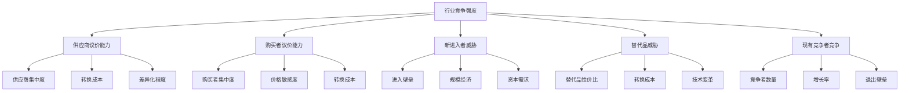
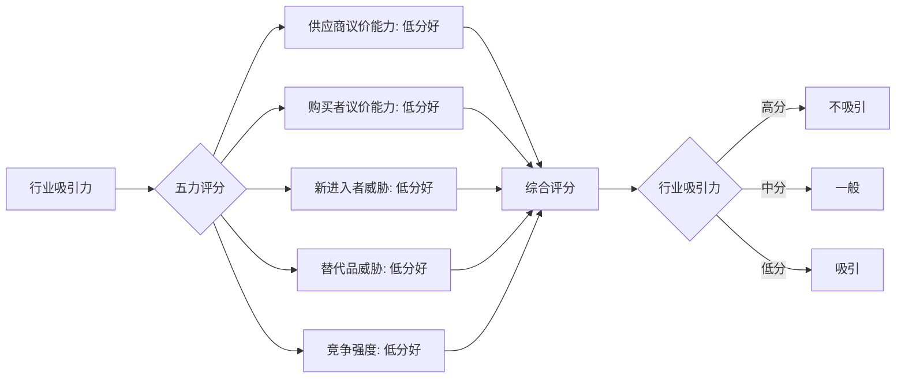

# 波特五力模型 - 行业竞争分析框架

## 概述

波特五力模型（Porter's Five Forces）是由哈佛商学院教授迈克尔·波特（Michael Porter）于 1979 年提出的行业竞争分析框架。这个模型通过分析五种竞争力量，帮助投资者和企业管理者评估行业的吸引力和盈利潜力。


### 学习目标

完成本文学习后，你将能够：

1. 理解波特五力模型的理论基础和应用场景
2. 掌握五种竞争力量的分析方法
3. 评估行业的整体吸引力和盈利潜力
4. 识别行业中的关键成功因素
5. 应用五力模型进行投资决策

### 为什么五力模型重要？

- **行业选择**：帮助投资者选择有吸引力的行业
- **竞争理解**：深入理解行业竞争格局
- **战略制定**：指导企业战略定位
- **风险识别**：识别行业结构性风险
- **估值基础**：行业盈利能力影响估值水平

## 波特五力模型框架

### 五力模型结构图




## 第一力：供应商议价能力

### 定义

供应商议价能力（Bargaining Power of Suppliers）指供应商对行业内企业施加压力、提高价格或降低质量的能力。

### 影响因素

**1. 供应商集中度**
- 供应商数量少，集中度高 → 议价能力强
- 供应商分散，选择多 → 议价能力弱
- 例：芯片行业（TSMC、三星）vs 农产品供应商

**2. 产品差异化和转换成本**
- 供应商产品独特，难以替代 → 议价能力强
- 转换供应商成本高 → 议价能力强
- 例：Intel 芯片 vs 通用零部件

**3. 前向整合威胁**
- 供应商有能力进入下游行业 → 议价能力强
- 例：富士康从代工转向自有品牌

**4. 行业对供应商的重要性**
- 行业是供应商的主要客户 → 议价能力弱
- 行业只是供应商的小客户 → 议价能力强

**5. 投入品对成本或差异化的重要性**
- 投入品占成本比重大 → 供应商议价能力影响大
- 投入品影响产品差异化 → 供应商议价能力强

### 评估方法

**供应商议价能力评分表**：

| 因素 | 弱(1分) | 中(3分) | 强(5分) |
|------|---------|---------|---------|
| 供应商集中度 | 高度分散 | 适度集中 | 高度集中 |
| 产品差异化 | 标准化 | 部分差异 | 高度差异 |
| 转换成本 | 低 | 中等 | 高 |
| 前向整合威胁 | 无 | 可能 | 强烈 |
| 行业重要性 | 主要客户 | 一般客户 | 次要客户 |

**总分解读**：
- 5-10 分：供应商议价能力弱，对行业有利
- 11-18 分：供应商议价能力中等
- 19-25 分：供应商议价能力强，对行业不利


## 第二力：购买者议价能力

### 定义

购买者议价能力（Bargaining Power of Buyers）指客户对行业内企业施加压力、压低价格或要求更高质量的能力。

### 影响因素

**1. 购买者集中度**
- 购买者数量少，集中度高 → 议价能力强
- 购买者分散 → 议价能力弱
- 例：沃尔玛对供应商 vs 个人消费者

**2. 购买量占比**
- 单个购买者采购量大 → 议价能力强
- 采购量占供应商收入比重高 → 议价能力强

**3. 产品标准化程度**
- 产品标准化，易于比较 → 议价能力强
- 产品差异化 → 议价能力弱
- 例：大宗商品 vs 奢侈品

**4. 转换成本**
- 转换供应商成本低 → 议价能力强
- 转换成本高（技术锁定、培训成本）→ 议价能力弱

**5. 价格敏感度**
- 产品占购买者成本比重大 → 价格敏感，议价能力强
- 产品对购买者质量/性能关键 → 价格不敏感，议价能力弱

**6. 后向整合威胁**
- 购买者有能力自己生产 → 议价能力强
- 例：苹果自研芯片威胁 Intel

### 评估方法

**购买者议价能力评分表**：

| 因素 | 弱(1分) | 中(3分) | 强(5分) |
|------|---------|---------|---------|
| 购买者集中度 | 高度分散 | 适度集中 | 高度集中 |
| 购买量占比 | 小 | 中等 | 大 |
| 产品标准化 | 高度差异 | 部分标准 | 完全标准 |
| 转换成本 | 高 | 中等 | 低 |
| 价格敏感度 | 低 | 中等 | 高 |


## 第三力：新进入者威胁

### 定义

新进入者威胁（Threat of New Entrants）指新竞争者进入行业的可能性和容易程度。新进入者会带来新产能、争夺市场份额、压低价格。

### 进入壁垒类型

**1. 规模经济（Economies of Scale）**
- 大规模生产降低单位成本
- 新进入者难以快速达到经济规模
- 例：汽车制造、半导体制造

**2. 资本需求（Capital Requirements）**
- 进入行业需要大量初始投资
- 固定资产、研发、营销投入
- 例：航空业、电信业、芯片制造

**3. 转换成本（Switching Costs）**
- 客户转换供应商的成本高
- 技术兼容性、培训、数据迁移
- 例：企业软件（SAP、Oracle）

**4. 渠道准入（Access to Distribution Channels）**
- 现有企业控制分销渠道
- 新进入者难以获得货架空间或分销网络
- 例：快消品、零售

**5. 成本优势（Cost Advantages Independent of Scale）**
- 专有技术、原材料优势、地理位置
- 学习曲线效应
- 政府补贴或优惠政策

**6. 政府政策和法规（Government Policy）**
- 许可证要求、专利保护
- 行业监管、环保标准
- 例：银行业、医药业、电信业

**7. 品牌忠诚度和客户关系**
- 强大的品牌认知和客户忠诚
- 网络效应和生态系统
- 例：可口可乐、苹果、微信

### 评估方法

**进入壁垒评分表**：

| 壁垒类型 | 低(1分) | 中(3分) | 高(5分) |
|----------|---------|---------|---------|
| 规模经济 | 不重要 | 适度重要 | 非常重要 |
| 资本需求 | < 1000万 | 1000万-1亿 | > 1亿 |
| 转换成本 | 低 | 中等 | 高 |
| 渠道准入 | 容易 | 适度困难 | 非常困难 |
| 成本优势 | 无 | 部分 | 显著 |
| 政府政策 | 宽松 | 适度监管 | 严格管制 |
| 品牌忠诚 | 弱 | 中等 | 强 |

**总分解读**：
- 7-14 分：进入壁垒低，新进入者威胁大
- 15-25 分：进入壁垒中等
- 26-35 分：进入壁垒高，新进入者威胁小


## 第四力：替代品威胁

### 定义

替代品威胁（Threat of Substitute Products or Services）指其他行业的产品或服务满足相同需求的可能性。替代品限制了行业的定价能力和盈利潜力。

### 影响因素

**1. 替代品的性价比**
- 替代品价格更低或性能更好 → 威胁大
- 替代品性价比提升速度 → 威胁增加
- 例：电动车替代燃油车、流媒体替代有线电视

**2. 转换成本**
- 转向替代品的成本低 → 威胁大
- 转换成本包括：经济成本、学习成本、心理成本
- 例：从 iPhone 转向 Android（生态系统锁定）

**3. 购买者转换倾向**
- 购买者对替代品的接受度
- 品牌忠诚度和使用习惯
- 例：年轻人更容易接受新技术

**4. 替代品的相对价格-性能权衡**
- 替代品在关键性能维度的表现
- 价格差异与性能差异的比较

### 识别替代品的方法

**1. 功能替代**
- 满足相同基本需求的不同产品
- 例：咖啡 vs 茶 vs 能量饮料（提神）

**2. 技术替代**
- 新技术提供更好的解决方案
- 例：数码相机替代胶卷相机

**3. 行为替代**
- 改变消费行为模式
- 例：视频会议替代商务旅行

### 评估方法

**替代品威胁评分表**：

| 因素 | 低(1分) | 中(3分) | 高(5分) |
|------|---------|---------|---------|
| 替代品性价比 | 差 | 相当 | 优越 |
| 转换成本 | 高 | 中等 | 低 |
| 购买者倾向 | 低 | 中等 | 高 |
| 技术趋势 | 不利替代品 | 中性 | 有利替代品 |

**总分解读**：
- 4-7 分：替代品威胁低
- 8-13 分：替代品威胁中等
- 14-20 分：替代品威胁高


## 第五力：现有竞争者竞争强度

### 定义

现有竞争者竞争强度（Rivalry Among Existing Competitors）指行业内现有企业之间的竞争激烈程度。这是五力中最直接和明显的竞争力量。

### 影响因素

**1. 竞争者数量和相对规模**
- 竞争者众多且规模相近 → 竞争激烈
- 市场领导者明确 → 竞争相对缓和
- 例：智能手机（苹果 vs 三星）vs PC（众多厂商）

**2. 行业增长率**
- 行业增长快 → 竞争缓和（蛋糕在变大）
- 行业增长慢或负增长 → 竞争激烈（零和博弈）
- 例：云计算（高增长）vs 传统 PC（低增长）

**3. 固定成本和存储成本**
- 固定成本高 → 企业倾向降价以提高产能利用率
- 存储成本高 → 企业急于出售库存
- 例：航空业、钢铁业

**4. 产品差异化**
- 产品同质化 → 价格竞争激烈
- 产品差异化 → 可以避免直接价格竞争
- 例：航空经济舱 vs 奢侈品

**5. 转换成本**
- 客户转换成本低 → 竞争激烈
- 转换成本高 → 客户粘性强，竞争缓和

**6. 产能增加的规模**
- 产能必须大规模增加 → 容易供过于求
- 产能可以小规模增加 → 供需平衡容易维持

**7. 退出壁垒**
- 退出壁垒高 → 亏损企业继续经营，竞争激烈
- 退出壁垒包括：专用资产、固定成本、情感因素、政府限制
- 例：钢铁业、造船业

**8. 战略多样性**
- 竞争者战略目标和方法差异大 → 竞争不可预测
- 例：国有企业 vs 民营企业 vs 外资企业

### 评估方法

**竞争强度评分表**：

| 因素 | 低(1分) | 中(3分) | 高(5分) |
|------|---------|---------|---------|
| 竞争者数量 | 少且集中 | 适度 | 众多且分散 |
| 行业增长率 | > 10% | 3-10% | < 3% |
| 固定成本 | 低 | 中等 | 高 |
| 产品差异化 | 高 | 中等 | 低 |
| 转换成本 | 高 | 中等 | 低 |
| 退出壁垒 | 低 | 中等 | 高 |

**总分解读**：
- 6-12 分：竞争强度低，行业盈利能力强
- 13-21 分：竞争强度中等
- 22-30 分：竞争强度高，行业盈利能力弱


## 行业吸引力综合评估

### 五力综合分析框架



### 综合评分方法

**总分计算**：
```
行业吸引力总分 = 供应商议价能力分数 + 购买者议价能力分数 
                + 新进入者威胁分数 + 替代品威胁分数 
                + 竞争强度分数
```

**评分解读**（注意：分数越低越好）：

| 总分范围 | 行业吸引力 | 投资建议 | 预期ROE |
|----------|-----------|---------|---------|
| 30-50 | 非常吸引 | 积极投资 | > 20% |
| 51-70 | 较吸引 | 可以投资 | 15-20% |
| 71-90 | 一般 | 谨慎投资 | 10-15% |
| 91-110 | 不吸引 | 避免投资 | < 10% |

### 权重调整（可选）

不同行业可以对五力赋予不同权重：

**示例权重方案**：
- 供应商议价能力：15%
- 购买者议价能力：25%
- 新进入者威胁：20%
- 替代品威胁：15%
- 竞争强度：25%

**加权总分** = Σ(各力得分 × 权重)


## 行业案例分析

### 案例 1：软件即服务（SaaS）行业

**行业特征**：云端软件订阅模式，高增长，高毛利

**五力分析**：

**1. 供应商议价能力：低（2分）**
- 主要成本是人力和云基础设施
- 云服务提供商（AWS、Azure、GCP）竞争激烈
- 人才市场虽然紧张，但供应充足
- **结论**：供应商议价能力弱，对行业有利

**2. 购买者议价能力：中（3分）**
- 企业客户有一定议价能力（大客户折扣）
- 转换成本中等（数据迁移、员工培训）
- 产品差异化程度高（功能、集成、用户体验）
- **结论**：购买者议价能力中等

**3. 新进入者威胁：中（3分）**
- 初始资本需求相对较低（云基础设施）
- 但建立品牌和客户基础需要时间
- 网络效应和生态系统形成壁垒
- **结论**：新进入者威胁中等

**4. 替代品威胁：低（2分）**
- 本地部署软件逐渐被淘汰
- 其他 SaaS 产品是竞争者而非替代品
- **结论**：替代品威胁低

**5. 竞争强度：中（3分）**
- 行业高速增长（20-30% CAGR）
- 产品差异化程度高
- 但竞争者众多，市场分散
- **结论**：竞争强度中等

**综合评分**：13 分（满分 25 分）
**行业吸引力**：非常吸引
**投资建议**：积极投资优质 SaaS 公司
**代表公司**：Salesforce、Adobe、Microsoft 365、Zoom

---

### 案例 2：航空业

**行业特征**：资本密集，周期性强，利润率低

**五力分析**：

**1. 供应商议价能力：高（5分）**
- 飞机制造商寡头垄断（波音、空客）
- 航空燃油价格波动大，无议价能力
- 飞机租赁公司集中度高
- **结论**：供应商议价能力极强

**2. 购买者议价能力：高（4分）**
- 乘客价格敏感，容易比价
- 转换成本极低（在线订票）
- 产品高度同质化（经济舱）
- 企业客户有议价能力
- **结论**：购买者议价能力强

**3. 新进入者威胁：低（2分）**
- 资本需求巨大（飞机、航线、人员）
- 航线时刻资源稀缺
- 监管严格（安全、许可）
- 规模经济重要
- **结论**：新进入者威胁低（但廉航曾成功进入）

**4. 替代品威胁：中（3分）**
- 短途：高铁、汽车
- 长途：视频会议减少商务旅行
- 疫情加速远程办公趋势
- **结论**：替代品威胁中等且上升

**5. 竞争强度：高（5分）**
- 竞争者众多，价格战频繁
- 行业增长慢（成熟市场）
- 固定成本极高（飞机、人员）
- 产品同质化（经济舱）
- 退出壁垒高（资产专用性）
- **结论**：竞争强度极高

**综合评分**：19 分（满分 25 分）
**行业吸引力**：不吸引
**投资建议**：避免投资，除非特殊情况（疫情后复苏、行业整合）
**历史验证**：巴菲特曾说"如果有先见之明，应该在莱特兄弟首飞时就把飞机打下来"

---

### 案例 3：奢侈品行业

**行业特征**：高毛利，品牌驱动，抗周期

**五力分析**：

**1. 供应商议价能力：低（2分）**
- 原材料供应商分散（皮革、面料）
- 奢侈品牌对供应商有强大控制力
- 垂直整合程度高（自有工坊）
- **结论**：供应商议价能力弱

**2. 购买者议价能力：低（1分）**
- 购买者分散（全球富裕消费者）
- 价格不敏感（身份象征）
- 产品高度差异化（品牌、设计）
- 转换成本高（品牌忠诚度）
- **结论**：购买者议价能力极弱

**3. 新进入者威胁：低（1分）**
- 品牌建设需要数十年甚至百年
- 资本需求大（营销、渠道）
- 工艺和传承难以复制
- 分销渠道控制严格
- **结论**：新进入者威胁极低

**4. 替代品威胁：低（2分）**
- 轻奢品牌（Coach、Michael Kors）
- 但真正的奢侈品消费者不会转向替代品
- 情感价值和社会地位无法替代
- **结论**：替代品威胁低

**5. 竞争强度：低（2分）**
- 竞争者数量有限（Hermès、LV、Chanel、Gucci）
- 行业增长稳定（5-8%）
- 产品高度差异化
- 品牌定位清晰，避免直接竞争
- **结论**：竞争强度低

**综合评分**：8 分（满分 25 分）
**行业吸引力**：极度吸引
**投资建议**：长期持有顶级奢侈品公司
**代表公司**：LVMH、Hermès、Richemont
**投资大师观点**：巴菲特投资 BYD 时也看中其品牌潜力


## 模型应用与局限性

### 应用场景

**1. 行业选择**
- 投资者选择有吸引力的行业
- 识别结构性优势行业
- 避免结构性不利行业

**2. 企业战略**
- 识别行业关键成功因素
- 制定竞争战略（成本领先、差异化、聚焦）
- 评估战略举措的影响

**3. 估值分析**
- 行业吸引力影响长期盈利能力
- 调整估值倍数和折现率
- 预测行业利润率趋势

**4. 风险评估**
- 识别行业结构性风险
- 评估竞争格局变化
- 监测新进入者和替代品

### 模型局限性

**1. 静态分析**
- 五力模型是某一时点的快照
- 行业结构会随时间变化
- 需要动态监测和更新

**2. 忽视互补品**
- 原模型未考虑互补品的作用
- 互补品可以增强行业吸引力
- 例：智能手机与 App 生态

**3. 忽视政府和监管**
- 政府政策可以显著影响行业
- 补贴、关税、监管变化
- 需要单独分析政策因素

**4. 难以量化**
- 评分具有主观性
- 不同分析师可能得出不同结论
- 需要结合定量数据验证

**5. 行业定义问题**
- 行业边界模糊
- 跨行业竞争增加
- 需要灵活定义行业范围

### 改进和扩展

**1. 第六力：互补品**
- 互补品的可得性和质量
- 互补品提供商的合作意愿
- 例：游戏机与游戏、手机与 App

**2. 动态分析**
- 分析五力的变化趋势
- 识别行业拐点
- 预测未来竞争格局

**3. 结合其他工具**
- PESTEL 分析（宏观环境）
- 价值链分析
- 资源基础观（RBV）
- 动态能力理论

## 实战应用指南

### 分析步骤

**Step 1：定义行业边界**
- 明确分析的行业范围
- 考虑地理范围（全球、区域、本地）
- 考虑产品范围（细分市场）

**Step 2：收集信息**
- 行业报告和研究
- 公司年报和财报
- 行业协会数据
- 专家访谈

**Step 3：逐一分析五力**
- 使用评分表系统评估
- 收集支持证据
- 考虑行业特殊性

**Step 4：综合评估**
- 计算总分
- 识别关键驱动因素
- 评估行业吸引力

**Step 5：得出结论**
- 投资建议
- 关键风险和机会
- 监测指标

### 分析模板

**行业五力分析报告模板**：

```markdown
# [行业名称] 五力分析报告

## 执行摘要
- 行业吸引力评级：[高/中/低]
- 综合得分：[X/25]
- 投资建议：[积极/谨慎/避免]

## 行业概况
- 市场规模：
- 增长率：
- 主要参与者：
- 关键趋势：

## 五力详细分析

### 1. 供应商议价能力 [X/5]
- 关键因素：
- 评分理由：
- 趋势预测：

### 2. 购买者议价能力 [X/5]
- 关键因素：
- 评分理由：
- 趋势预测：

### 3. 新进入者威胁 [X/5]
- 关键因素：
- 评分理由：
- 趋势预测：

### 4. 替代品威胁 [X/5]
- 关键因素：
- 评分理由：
- 趋势预测：

### 5. 竞争强度 [X/5]
- 关键因素：
- 评分理由：
- 趋势预测：

## 综合评估
- 总分：[X/25]
- 行业吸引力：
- 关键成功因素：
- 主要风险：

## 投资建议
- 推荐策略：
- 优选公司：
- 风险提示：
```

## 常见误区

1. **机械套用评分**
   - 不同行业权重不同
   - 需要结合行业特性
   - 定性判断同样重要

2. **忽视动态变化**
   - 行业结构会演变
   - 技术创新改变五力
   - 需要持续监测

3. **孤立分析单一力量**
   - 五力相互影响
   - 需要综合考虑
   - 识别主导因素

4. **忽视行业内差异**
   - 同一行业不同细分市场五力不同
   - 不同地理市场五力不同
   - 需要细分分析

5. **过度依赖模型**
   - 五力是工具而非答案
   - 需要结合其他分析
   - 最终依靠投资判断

## 延伸阅读

### 必读书籍

1. **《竞争战略》** - Michael E. Porter
   - 五力模型原创著作
   - 竞争战略理论基础
   - 经典必读

2. **《竞争优势》** - Michael E. Porter
   - 价值链分析
   - 竞争优势来源
   - 五力模型的延伸

3. **《蓝海战略》** - W. Chan Kim & Renée Mauborgne
   - 跳出五力竞争
   - 创造新市场空间
   - 战略创新

4. **《创新者的窘境》** - Clayton M. Christensen
   - 颠覆性创新
   - 行业结构变革
   - 新进入者威胁

5. **《从优秀到卓越》** - Jim Collins
   - 行业选择的重要性
   - 刺猬理念
   - 长期成功因素

### 推荐文章

1. Porter, M. E. (1979). "How Competitive Forces Shape Strategy". *Harvard Business Review*.
2. Porter, M. E. (2008). "The Five Competitive Forces That Shape Strategy". *Harvard Business Review*.
3. Grundy, T. (2006). "Rethinking and reinventing Michael Porter's five forces model". *Strategic Change*.

### 在线资源

1. **Harvard Business Review** - 战略管理文章
2. **McKinsey Quarterly** - 行业分析报告
3. **BCG Perspectives** - 竞争战略洞察
4. **Bain & Company Insights** - 行业研究

## 参考文献

1. Porter, M. E. (1980). *Competitive Strategy: Techniques for Analyzing Industries and Competitors*. Free Press.

2. Porter, M. E. (1985). *Competitive Advantage: Creating and Sustaining Superior Performance*. Free Press.

3. Porter, M. E. (2008). "The Five Competitive Forces That Shape Strategy". *Harvard Business Review*, 86(1), 78-93.

4. Grundy, T. (2006). "Rethinking and reinventing Michael Porter's five forces model". *Strategic Change*, 15(5), 213-229.

5. Dobbs, M. (2014). "Guidelines for applying Porter's five forces framework: a set of industry analysis templates". *Competitiveness Review*, 24(1), 32-45.

6. Kim, W. C., & Mauborgne, R. (2005). *Blue Ocean Strategy*. Harvard Business School Press.

7. Christensen, C. M. (1997). *The Innovator's Dilemma*. Harvard Business School Press.

8. Collins, J. (2001). *Good to Great*. HarperBusiness.

9. Barney, J. B. (1991). "Firm Resources and Sustained Competitive Advantage". *Journal of Management*, 17(1), 99-120.

10. Teece, D. J., Pisano, G., & Shuen, A. (1997). "Dynamic capabilities and strategic management". *Strategic Management Journal*, 18(7), 509-533.

---

**下一步**：学习 [经济护城河](economic-moats.html)，深入理解企业的持续竞争优势。
