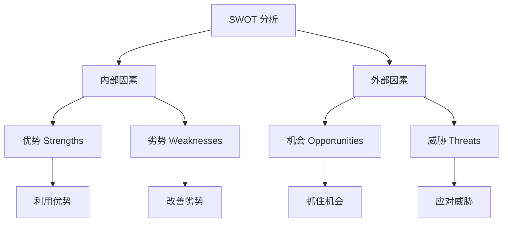

# SWOT 分析 - 企业战略分析工具

## 概述

SWOT 分析是一种战略规划工具，通过识别企业的优势（Strengths）、劣势（Weaknesses）、机会（Opportunities）和威胁（Threats），帮助企业制定战略和投资者评估投资价值。

### 学习目标

1. 理解 SWOT 分析的框架和应用
2. 掌握识别和评估 SWOT 要素的方法
3. 学会将 SWOT 分析应用于投资决策
4. 理解 SWOT 分析的局限性

## SWOT 框架

### 框架结构

### 四个维度

**内部因素（可控）**：
- **优势（S）**：企业擅长的、优于竞争对手的
- **劣势（W）**：企业不足的、劣于竞争对手的

**外部因素（不可控）**：
- **机会（O）**：外部环境中有利的趋势和事件
- **威胁（T）**：外部环境中不利的趋势和事件

## 优势（Strengths）分析

### 识别优势的维度

**1. 品牌和声誉**
- 品牌知名度
- 客户忠诚度
- 市场地位

**2. 财务资源**
- 现金储备
- 融资能力
- 盈利能力

**3. 人力资源**
- 管理团队
- 员工技能
- 企业文化

**4. 运营能力**
- 生产效率
- 供应链管理
- 质量控制

**5. 技术和创新**
- 专利和知识产权
- 研发能力
- 技术领先性

**6. 市场地位**
- 市场份额
- 客户基础
- 分销网络

### 优势评估标准

**VRIO 测试**：
- **V**aluable：是否有价值？
- **R**are：是否稀缺？
- **I**nimitable：是否难以模仿？
- **O**rganized：是否有效利用？

只有通过 VRIO 测试的才是真正的竞争优势。

### 优势案例

**苹果公司优势**：
- 强大的品牌价值
- 创新能力和设计
- 生态系统锁定
- 充裕的现金储备
- 高效的供应链管理

## 劣势（Weaknesses）分析

### 识别劣势的维度

**1. 资源限制**
- 资金不足
- 人才短缺
- 技术落后

**2. 运营问题**
- 成本过高
- 效率低下
- 质量问题

**3. 市场地位**
- 市场份额小
- 品牌认知度低
- 客户基础弱

**4. 组织问题**
- 管理混乱
- 决策缓慢
- 文化问题

**5. 财务问题**
- 高负债
- 现金流紧张
- 盈利能力弱

### 劣势评估

**严重程度**：
- 致命劣势：威胁生存
- 重大劣势：影响竞争力
- 一般劣势：可以改善

**改善可能性**：
- 容易改善
- 需要时间和资源
- 难以改善

### 劣势案例

**特斯拉早期劣势**：
- 生产规模小
- 制造经验不足
- 服务网络有限
- 持续亏损
- 依赖政府补贴

## 机会（Opportunities）分析

### 识别机会的来源

**1. 市场趋势**
- 市场增长
- 新兴市场
- 消费升级

**2. 技术变革**
- 新技术应用
- 数字化转型
- 自动化

**3. 政策支持**
- 产业政策
- 税收优惠
- 监管放松

**4. 竞争格局变化**
- 竞争对手退出
- 行业整合
- 新合作机会

**5. 社会文化变化**
- 人口结构变化
- 生活方式改变
- 价值观转变

### 机会评估

**吸引力**：
- 市场规模
- 增长潜力
- 盈利能力

**可行性**：
- 企业能力匹配
- 资源需求
- 时间窗口

### 机会案例

**电动车行业机会**：
- 环保政策支持
- 技术成熟度提升
- 充电基础设施完善
- 消费者接受度提高
- 传统车企转型缓慢

## 威胁（Threats）分析

### 识别威胁的来源

**1. 竞争加剧**
- 新进入者
- 价格战
- 替代品

**2. 技术颠覆**
- 新技术替代
- 商业模式创新
- 行业标准变化

**3. 市场变化**
- 需求下降
- 消费者偏好转移
- 市场饱和

**4. 政策风险**
- 监管收紧
- 政策不利
- 贸易壁垒

**5. 宏观经济**
- 经济衰退
- 利率上升
- 汇率波动

**6. 供应链风险**
- 原材料涨价
- 供应中断
- 物流问题

### 威胁评估

**严重程度**：
- 高：可能导致重大损失
- 中：影响业绩
- 低：影响有限

**发生概率**：
- 高：很可能发生
- 中：可能发生
- 低：不太可能

### 威胁案例

**传统零售业威胁**：
- 电商快速发展
- 消费者线上购物习惯
- 租金和人工成本上升
- 疫情影响客流
- 年轻消费者流失

## SWOT 矩阵分析

### 战略组合

**SO 战略（优势-机会）**：
- 利用优势抓住机会
- 进攻性战略
- 例：苹果利用品牌优势进入可穿戴设备市场

**WO 战略（劣势-机会）**：
- 克服劣势抓住机会
- 改进性战略
- 例：特斯拉扩大产能抓住电动车市场机会

**ST 战略（优势-威胁）**：
- 利用优势应对威胁
- 防御性战略
- 例：可口可乐利用品牌优势应对健康饮料威胁

**WT 战略（劣势-威胁）**：
- 最小化劣势和威胁
- 撤退或转型战略
- 例：柯达未能应对数码相机威胁

### SWOT 矩阵表

| 内部/外部 | 机会（O） | 威胁（T） |
|----------|----------|----------|
| 优势（S） | SO：增长战略 | ST：防御战略 |
| 劣势（W） | WO：改进战略 | WT：撤退战略 |

## 实战案例

### 案例 1：茅台 SWOT 分析

**优势（S）**：
- 品牌价值极高（国酒地位）
- 产品稀缺性
- 高利润率和现金流
- 无负债
- 文化认同深厚

**劣势（W）**：
- 产能增长受限
- 单一产品依赖
- 价格过高限制消费群体
- 年轻消费者接受度低

**机会（O）**：
- 高端消费升级
- 商务和礼品需求
- 国际化机会
- 收藏投资需求

**威胁（T）**：
- 反腐和限制三公消费
- 年轻人不喝白酒
- 健康意识提升
- 其他高端白酒竞争

**战略建议**：
- SO：利用品牌优势拓展高端市场
- WO：开发年轻化产品抓住新消费群体
- ST：利用稀缺性应对政策风险
- WT：多元化产品线降低依赖

### 案例 2：特斯拉 SWOT 分析

**优势（S）**：
- 技术领先（电池、自动驾驶）
- 品牌影响力
- 直销模式
- 马斯克个人魅力
- 垂直整合

**劣势（W）**：
- 生产规模相对小
- 质量控制问题
- 服务网络不足
- 依赖政府补贴
- 现金流压力

**机会（O）**：
- 电动车市场快速增长
- 环保政策支持
- 充电基础设施完善
- 自动驾驶技术成熟
- 能源业务机会

**威胁（T）**：
- 传统车企电动化
- 中国电动车企竞争
- 补贴退坡
- 原材料价格波动
- 技术路线不确定性

**战略建议**：
- SO：利用技术优势快速扩大市场份额
- WO：扩大产能和服务网络
- ST：持续创新保持技术领先
- WT：降低成本提高盈利能力

### 案例 3：传统银行 SWOT 分析

**优势（S）**：
- 客户基础庞大
- 品牌信任度高
- 资金实力雄厚
- 网点覆盖广
- 监管牌照

**劣势（W）**：
- 运营成本高
- 数字化转型慢
- 组织架构僵化
- 创新能力弱
- 不良贷款压力

**机会（O）**：
- 财富管理需求增长
- 普惠金融政策
- 金融科技应用
- 跨境业务机会
- 养老金融市场

**威胁（T）**：
- 互联网金融竞争
- 利率市场化
- 监管趋严
- 经济下行周期
- 金融脱媒

**战略建议**：
- SO：利用客户基础发展财富管理
- WO：加速数字化转型
- ST：利用监管优势应对互联网金融
- WT：降低成本提高效率

## 投资应用

### SWOT 在投资分析中的应用

**1. 投资机会识别**
- 优势明显、机会大的企业
- SO 战略清晰的企业

**2. 风险评估**
- 识别关键威胁
- 评估企业应对能力

**3. 估值调整**
- 优势多、威胁少 → 溢价
- 劣势多、威胁大 → 折价

**4. 投资时机选择**
- 机会窗口期
- 威胁缓解期

### 投资决策框架

**买入信号**：
- 优势强大且持续
- 重大机会出现
- 威胁可控
- 估值合理

**观望信号**：
- 优劣势均衡
- 机会和威胁并存
- 战略不清晰

**卖出信号**：
- 优势被侵蚀
- 劣势加剧
- 重大威胁出现
- 管理层应对不力

## SWOT 分析的局限性

### 主要局限

**1. 主观性强**
- 不同分析师可能得出不同结论
- 需要结合定量分析

**2. 静态分析**
- 只反映当前状态
- 需要动态更新

**3. 缺乏优先级**
- 所有因素平等对待
- 需要权重分析

**4. 缺乏行动指导**
- 只是诊断工具
- 需要配合战略规划

**5. 过于简化**
- 复杂情况难以完全涵盖
- 需要深入分析

### 改进方法

**1. 量化评分**
- 对每个因素打分（1-5 分）
- 计算总分和权重

**2. 动态监测**
- 定期更新 SWOT 分析
- 跟踪变化趋势

**3. 结合其他工具**
- 波特五力
- PESTEL 分析
- 价值链分析

**4. 深入研究**
- 每个因素详细分析
- 收集支持数据

## 实践练习

### 练习 1：个人 SWOT 分析

选择一家你熟悉的公司，完成完整的 SWOT 分析：
1. 列出 5-10 个优势
2. 列出 5-10 个劣势
3. 列出 5-10 个机会
4. 列出 5-10 个威胁
5. 制定 SWOT 矩阵战略
6. 得出投资结论

### 练习 2：对比分析

选择同一行业的两家公司，对比其 SWOT：
1. 识别各自的核心优势
2. 比较劣势差异
3. 评估谁更能抓住机会
4. 分析谁更能应对威胁
5. 得出相对投资价值

## 常见误区

1. **列举过多**：抓不住重点
2. **混淆内外部**：把机会当优势
3. **过于笼统**：缺乏具体性
4. **忽视验证**：不用数据支持
5. **一次性分析**：不持续更新

## 延伸阅读

1. Weihrich, H. (1982). "The TOWS Matrix—A Tool for Situational Analysis". *Long Range Planning*.
2. Hill, T., & Westbrook, R. (1997). "SWOT Analysis: It's Time for a Product Recall". *Long Range Planning*.
3. Pickton, D. W., & Wright, S. (1998). "What's SWOT in strategic analysis?". *Strategic Change*.

## 参考文献

1. Weihrich, H. (1982). "The TOWS Matrix—A Tool for Situational Analysis". *Long Range Planning*, 15(2), 54-66.

2. Hill, T., & Westbrook, R. (1997). "SWOT Analysis: It's Time for a Product Recall". *Long Range Planning*, 30(1), 46-52.

3. Pickton, D. W., & Wright, S. (1998). "What's SWOT in strategic analysis?". *Strategic Change*, 7(2), 101-109.

4. Helms, M. M., & Nixon, J. (2010). "Exploring SWOT analysis–where are we now?". *Journal of Strategy and Management*, 3(3), 215-251.

5. Learned, E. P., Christensen, C. R., Andrews, K. R., & Guth, W. D. (1969). *Business Policy: Text and Cases*. Irwin.

---

**下一步**：将竞争分析工具综合应用于 [公司案例研究](../case-studies/index.html)，深化理解。
