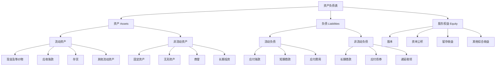
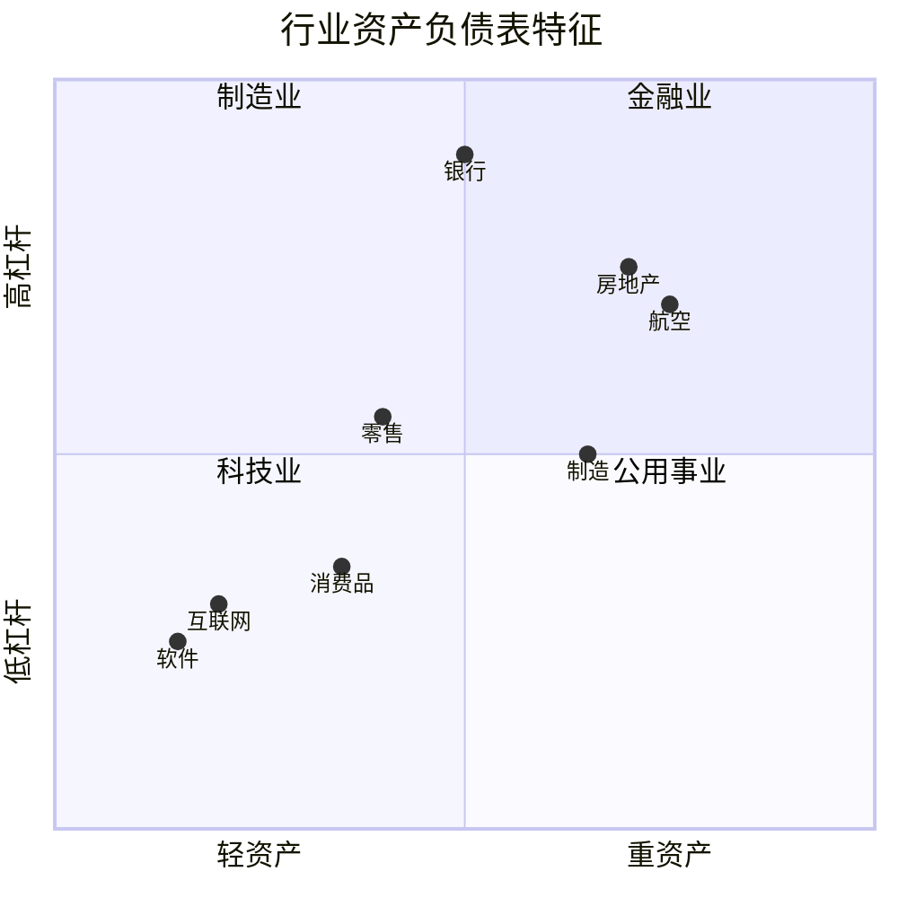

# 资产负债表深度解析

## 概述

资产负债表（Balance Sheet）是三大财务报表中最重要的一张，它展示了企业在特定时点的财务状况。巴菲特曾说："如果只能看一张财务报表，我会选择资产负债表。"

### 学习目标

完成本文学习后，你将能够：

1. 深入理解资产负债表的结构和会计等式
2. 掌握资产、负债和股东权益的详细分类
3. 计算和应用 20+ 个关键财务指标
4. 通过资产负债表评估企业的财务健康状况
5. 识别不同行业资产负债表的特征
6. 发现财务报表中的潜在风险信号

### 为什么资产负债表如此重要？


- **财务快照**：提供企业在某一时点的完整财务状况
- **资源配置**：展示企业如何配置和使用资源
- **风险评估**：揭示企业的债务水平和偿债能力
- **价值基础**：是企业估值的重要基础
- **质量指标**：反映企业资产和盈利的质量

## 资产负债表基本结构

### 会计恒等式

资产负债表基于最基本的会计等式：

```
资产 = 负债 + 股东权益
Assets = Liabilities + Shareholders' Equity
```

这个等式永远成立，体现了企业资源的来源（负债和权益）和使用（资产）之间的平衡关系。

### 资产负债表结构图



## 资产详解

### 流动资产（Current Assets）

流动资产是指预期在一年内或一个营业周期内变现、出售或耗用的资产。

#### 1. 现金及现金等价物（Cash and Cash Equivalents）

**定义**：
- 库存现金
- 银行存款
- 3 个月内到期的短期投资

**分析要点**：
- 现金充裕度：现金/总资产比率
- 现金使用效率：避免过多闲置现金
- 现金质量：区分自由现金和受限现金

**行业特征**：
- 科技公司：通常持有大量现金（如 Apple 1500 亿美元+）
- 零售公司：现金周转快，持有量相对较少
- 金融公司：现金是核心资产

#### 2. 应收账款（Accounts Receivable）

**定义**：企业因销售商品或提供服务而应向客户收取的款项。

**关键指标**：


1. **应收账款周转天数（DSO）**：
   ```
   DSO = (应收账款 / 年收入) × 365
   ```
   - 衡量收款效率
   - 越短越好，说明收款快
   - 行业差异大：B2B 通常 30-90 天，B2C 接近 0

2. **坏账准备率**：
   ```
   坏账准备率 = 坏账准备 / 应收账款总额
   ```
   - 反映应收账款质量
   - 比率上升可能预示收款困难

**风险信号**：
- DSO 持续上升：可能存在收款问题或虚增收入
- 应收账款增速 > 收入增速：需要警惕
- 坏账准备率异常低：可能低估风险

#### 3. 存货（Inventory）

**定义**：企业持有的用于销售或生产的商品和原材料。

**存货分类**：
- 原材料（Raw Materials）
- 在产品（Work in Progress）
- 产成品（Finished Goods）

**关键指标**：

1. **存货周转天数（DIO）**：
   ```
   DIO = (存货 / 年销售成本) × 365
   ```
   - 衡量存货管理效率
   - 越短越好，说明周转快
   - 行业差异：快消品 30-60 天，汽车 60-90 天

2. **存货周转率**：
   ```
   存货周转率 = 销售成本 / 平均存货
   ```
   - 次数越多越好
   - 反映存货变现速度

**风险信号**：
- DIO 持续上升：可能存在滞销或过时存货
- 存货增速 > 收入增速：需要警惕
- 存货跌价准备不足：可能高估资产价值

**行业案例**：
- **Dell 模式**：负存货周转天数（先收款后生产）
- **Zara**：快时尚，存货周转极快（30-40 天）
- **茅台**：存货是资产（酒越陈越香）

#### 4. 其他流动资产

- 预付款项
- 待摊费用
- 一年内到期的非流动资产
- 其他应收款

### 非流动资产（Non-Current Assets）

非流动资产是指使用期限超过一年的资产。

#### 1. 固定资产（Property, Plant & Equipment, PP&E）

**定义**：企业用于生产经营的长期有形资产。

**主要类别**：
- 土地（Land）：不折旧
- 建筑物（Buildings）
- 机器设备（Machinery）
- 运输工具（Vehicles）
- 办公设备（Office Equipment）

**关键概念**：

1. **原值（Gross PP&E）**：资产的购置成本
2. **累计折旧（Accumulated Depreciation）**：已计提的折旧总额
3. **净值（Net PP&E）**：原值 - 累计折旧

**关键指标**：

1. **固定资产周转率**：
   ```
   固定资产周转率 = 收入 / 平均固定资产净值
   ```
   - 衡量固定资产使用效率
   - 比率越高越好

2. **资本支出比率**：
   ```
   资本支出比率 = 资本支出 / 收入
   ```
   - 反映企业再投资强度
   - 重资产行业比率高

**行业特征**：
- **重资产行业**：制造业、航空、电信（固定资产占比 40-60%）
- **轻资产行业**：软件、咨询、互联网（固定资产占比 < 10%）


#### 2. 无形资产（Intangible Assets）

**定义**：没有实物形态但能为企业带来经济利益的资产。

**主要类别**：
- **专利（Patents）**：技术保护
- **商标（Trademarks）**：品牌标识
- **版权（Copyrights）**：内容保护
- **特许权（Franchises）**：经营权利
- **客户关系（Customer Relationships）**：客户基础
- **技术（Technology）**：专有技术

**会计处理**：
- 外购无形资产：按成本入账，分期摊销
- 自创无形资产：研发费用通常费用化（GAAP）或部分资本化（IFRS）
- 使用寿命：有限期限摊销，无限期限不摊销但需减值测试

**关键指标**：

1. **研发资本化率**：
   ```
   研发资本化率 = 资本化研发支出 / 总研发支出
   ```
   - 反映研发成果转化
   - 不同会计准则差异大

**行业特征**：
- **制药公司**：专利是核心资产
- **科技公司**：技术和软件
- **消费品牌**：商标价值巨大（可口可乐品牌价值 > 800 亿美元）

#### 3. 商誉（Goodwill）

**定义**：企业并购时支付的溢价，代表被收购企业的超额盈利能力。

**计算公式**：
```
商誉 = 收购价格 - 被收购企业可辨认净资产公允价值
```

**会计处理**：
- 不摊销（GAAP 和 IFRS）
- 每年进行减值测试
- 减值损失不可转回

**分析要点**：

1. **商誉占比**：
   ```
   商誉占比 = 商誉 / 总资产
   ```
   - 比率过高（> 30%）需要警惕
   - 反映企业并购激进程度

2. **商誉减值风险**：
   - 被收购业务业绩不达预期
   - 市场环境恶化
   - 管理层过度乐观

**风险案例**：
- **通用电气（GE）**：2018 年商誉减值 220 亿美元
- **惠普（HP）**：2012 年 Autonomy 并购商誉减值 88 亿美元
- **AOL-Time Warner**：史上最大商誉减值（990 亿美元）

#### 4. 长期投资

**分类**：
- **权益法投资**：持股 20-50%，有重大影响
- **成本法投资**：持股 < 20%，无重大影响
- **合并投资**：持股 > 50%，控制权

**分析要点**：
- 投资收益贡献
- 投资集中度风险
- 关联交易风险

## 负债详解

### 流动负债（Current Liabilities）

流动负债是指预期在一年内或一个营业周期内偿还的债务。

#### 1. 应付账款（Accounts Payable）

**定义**：企业因购买商品或接受服务而应向供应商支付的款项。

**关键指标**：

1. **应付账款周转天数（DPO）**：
   ```
   DPO = (应付账款 / 年销售成本) × 365
   ```
   - 衡量付款周期
   - 越长越好（占用供应商资金）
   - 但不能过长损害供应商关系

**分析要点**：
- DPO 过长：可能存在现金流问题
- DPO 过短：可能议价能力弱
- 最佳状态：DPO > DSO（收款快于付款）

#### 2. 短期借款（Short-term Debt）

**定义**：一年内到期的借款和债券。

**类型**：
- 银行短期贷款
- 商业票据
- 一年内到期的长期借款

**风险评估**：
- 短期偿债压力
- 再融资风险
- 利率风险


#### 3. 其他流动负债

- **应付工资**：员工薪酬
- **应交税费**：各类税款
- **预收款项**：客户预付款（对企业有利）
- **应付股利**：待支付的股息
- **其他应付款**：其他短期债务

### 非流动负债（Non-Current Liabilities）

#### 1. 长期借款（Long-term Debt）

**定义**：一年以上到期的借款和债券。

**类型**：
- 银行长期贷款
- 公司债券
- 可转换债券
- 租赁负债（IFRS 16）

**关键指标**：

1. **债务期限结构**：
   - 短期债务占比
   - 长期债务占比
   - 债务到期分布

2. **债务成本**：
   ```
   平均债务成本 = 利息费用 / 平均总债务
   ```
   - 反映融资成本
   - 与市场利率对比

**分析要点**：
- 债务集中到期风险
- 债务条款和限制性条款
- 担保和抵押情况

#### 2. 递延税项负债（Deferred Tax Liabilities）

**定义**：会计利润与税务利润的时间性差异导致的未来应付税款。

**产生原因**：
- 折旧方法差异
- 收入确认时间差异
- 费用扣除时间差异

**分析意义**：
- 通常不是真正的"债务"
- 可能永远不需要支付
- 某些分析师将其视为"准权益"

#### 3. 其他非流动负债

- 长期应付款
- 预计负债（如诉讼、环保等）
- 养老金负债
- 其他长期负债

## 股东权益详解

### 股东权益构成

股东权益 = 资产 - 负债，代表股东对企业净资产的所有权。

#### 1. 股本（Share Capital）

**定义**：股东投入的资本。

**分类**：
- **普通股（Common Stock）**：有投票权，享受剩余收益
- **优先股（Preferred Stock）**：优先分红，通常无投票权

**面值与市值**：
- 面值（Par Value）：账面记录的股票面值（通常很小，如 $0.01）
- 市值（Market Value）：股票市场价格

#### 2. 资本公积（Additional Paid-in Capital）

**定义**：股东投入超过面值的部分。

**计算**：
```
资本公积 = (发行价格 - 面值) × 发行股数
```

**来源**：
- 股票溢价发行
- 股票期权行权
- 资产重估增值

#### 3. 留存收益（Retained Earnings）

**定义**：企业历年累计的未分配利润。

**计算**：
```
期末留存收益 = 期初留存收益 + 净利润 - 股利
```

**分析要点**：
- 留存收益增长反映盈利积累
- 负留存收益说明累计亏损
- 留存收益 vs 分红政策

**投资启示**：
- 高留存收益：企业再投资能力强
- 持续分红：股东回报稳定
- 平衡：成长与回报的权衡

#### 4. 其他综合收益（Other Comprehensive Income）

**定义**：不计入利润表但影响权益的损益。

**主要项目**：
- 外币折算差额
- 可供出售金融资产公允价值变动
- 现金流套期损益
- 重新计量设定受益计划净负债

**分析意义**：
- 反映未实现损益
- 可能在未来转入利润表
- 影响账面价值

### 库存股（Treasury Stock）

**定义**：企业回购的自己的股票。

**会计处理**：
- 作为权益的减项
- 不确认损益

**回购目的**：
- 提升每股收益（EPS）
- 股价管理
- 员工激励计划
- 防御恶意收购

**分析要点**：
- 回购时机（低价回购增值）
- 回购资金来源
- 对股东价值的影响


## 20+ 关键财务指标

### 流动性指标

#### 1. 流动比率（Current Ratio）
```
流动比率 = 流动资产 / 流动负债
```
- **标准**：> 1.5 较安全，> 2.0 很安全
- **意义**：衡量短期偿债能力
- **局限**：不考虑资产质量

#### 2. 速动比率（Quick Ratio）
```
速动比率 = (流动资产 - 存货) / 流动负债
```
- **标准**：> 1.0 较安全
- **意义**：更严格的流动性指标
- **优势**：排除变现慢的存货

#### 3. 现金比率（Cash Ratio）
```
现金比率 = (现金 + 现金等价物) / 流动负债
```
- **标准**：> 0.5 较安全
- **意义**：最严格的流动性指标
- **应用**：危机时期特别重要

### 杠杆指标

#### 4. 资产负债率（Debt-to-Assets Ratio）
```
资产负债率 = 总负债 / 总资产
```
- **标准**：< 60% 较安全，行业差异大
- **意义**：衡量财务杠杆水平
- **风险**：比率过高增加财务风险

#### 5. 权益乘数（Equity Multiplier）
```
权益乘数 = 总资产 / 股东权益
```
- **关系**：权益乘数 = 1 / (1 - 资产负债率)
- **意义**：反映财务杠杆
- **应用**：杜邦分析的组成部分

#### 6. 债务权益比（Debt-to-Equity Ratio）
```
债务权益比 = 总负债 / 股东权益
```
- **标准**：< 1.0 较保守，< 2.0 可接受
- **意义**：债务与权益的相对关系
- **行业**：金融业可以很高（10+）

#### 7. 利息保障倍数（Interest Coverage Ratio）
```
利息保障倍数 = EBIT / 利息费用
```
- **标准**：> 3 较安全，> 5 很安全
- **意义**：衡量偿付利息能力
- **风险**：< 1.5 存在违约风险

### 效率指标

#### 8. 总资产周转率（Asset Turnover Ratio）
```
总资产周转率 = 收入 / 平均总资产
```
- **意义**：衡量资产使用效率
- **行业**：零售业高（2-3），重工业低（0.5-1.0）
- **趋势**：上升说明效率提升

#### 9. 营运资本周转率（Working Capital Turnover）
```
营运资本周转率 = 收入 / 平均营运资本
营运资本 = 流动资产 - 流动负债
```
- **意义**：衡量营运资本使用效率
- **应用**：评估运营管理能力

#### 10. 现金周转周期（Cash Conversion Cycle）
```
CCC = DSO + DIO - DPO
```
- **意义**：从付款到收款的时间
- **目标**：越短越好，甚至负数
- **案例**：Dell 曾实现负 CCC

### 盈利质量指标

#### 11. 净资产收益率（ROE）
```
ROE = 净利润 / 平均股东权益
```
- **标准**：> 15% 优秀，> 20% 卓越
- **意义**：股东投资回报率
- **应用**：巴菲特最看重的指标之一

#### 12. 总资产收益率（ROA）
```
ROA = 净利润 / 平均总资产
```
- **意义**：资产盈利能力
- **关系**：ROE = ROA × 权益乘数
- **应用**：跨行业比较

#### 13. 投入资本回报率（ROIC）
```
ROIC = NOPAT / 投入资本
NOPAT = 营业利润 × (1 - 税率)
投入资本 = 股东权益 + 有息负债
```
- **标准**：> WACC 创造价值
- **意义**：衡量资本使用效率
- **应用**：评估企业竞争优势

### 估值指标

#### 14. 市净率（P/B Ratio）
```
P/B = 市值 / 账面价值
```
- **标准**：< 1.0 可能低估（价值陷阱？）
- **意义**：市场价值 vs 账面价值
- **应用**：价值投资筛选

#### 15. 有形账面价值（Tangible Book Value）
```
有形账面价值 = 股东权益 - 无形资产 - 商誉
```
- **意义**：更保守的账面价值
- **应用**：金融股分析


### 资本结构指标

#### 16. 净债务（Net Debt）
```
净债务 = 总债务 - 现金及现金等价物
```
- **意义**：实际债务负担
- **应用**：企业估值（EV 计算）

#### 17. 净债务/EBITDA
```
净债务/EBITDA = 净债务 / EBITDA
```
- **标准**：< 3 较安全，< 2 很安全
- **意义**：债务偿还能力
- **应用**：信用评级重要指标

#### 18. 净资产（Net Assets）
```
净资产 = 总资产 - 总负债 = 股东权益
```
- **意义**：股东拥有的净值
- **应用**：清算价值估算

### 营运资本指标

#### 19. 营运资本（Working Capital）
```
营运资本 = 流动资产 - 流动负债
```
- **意义**：日常运营所需资金
- **正值**：流动性充足
- **负值**：可能存在流动性风险（或商业模式优势）

#### 20. 营运资本占收入比
```
营运资本占收入比 = 营运资本 / 年收入
```
- **意义**：运营资金需求
- **趋势**：下降说明效率提升

### 其他重要指标

#### 21. 商誉占总资产比
```
商誉占比 = 商誉 / 总资产
```
- **警戒线**：> 30% 需要关注
- **风险**：商誉减值风险

#### 22. 无形资产占比
```
无形资产占比 = 无形资产 / 总资产
```
- **意义**：资产"软"程度
- **行业**：科技、医药通常较高

## 公司对比案例分析

### 案例 1：Apple vs Microsoft（科技巨头对比）

**Apple（2023 财年）**：
- 总资产：$352B
- 现金：$166B（47%）
- 流动比率：0.98
- 资产负债率：31%
- ROE：147%（高杠杆+高回购）
- 特点：现金充裕，轻资产，高回报

**Microsoft（2023 财年）**：
- 总资产：$411B
- 现金：$111B（27%）
- 流动比率：1.77
- 资产负债率：36%
- ROE：36%
- 特点：资产多元化，云业务重资产化

**对比分析**：
- Apple 更激进的资本结构（回购+分红）
- Microsoft 更保守的财务策略
- 两者都是现金奶牛，但使用策略不同

### 案例 2：Amazon vs Walmart（零售巨头对比）

**Amazon（2023）**：
- 总资产：$527B
- 固定资产：$186B（35%）- AWS 数据中心
- 流动比率：1.09
- 资产负债率：57%
- 资产周转率：1.14
- 特点：重资产化（AWS），高增长

**Walmart（2023）**：
- 总资产：$252B
- 固定资产：$113B（45%）- 门店和配送中心
- 流动比率：0.80
- 资产负债率：61%
- 资产周转率：2.43
- 特点：传统零售，高周转

**对比分析**：
- Walmart 资产周转率更高（传统零售优势）
- Amazon 投资未来（AWS 基础设施）
- 两者都是负营运资本模式（先收款后付款）

### 案例 3：Tesla vs Toyota（汽车制造商对比）

**Tesla（2023）**：
- 总资产：$107B
- 固定资产：$31B（29%）
- 流动比率：1.73
- 资产负债率：43%
- 资产周转率：1.68
- 特点：轻资产，高增长，现金充裕

**Toyota（2023）**：
- 总资产：$690B
- 固定资产：$180B（26%）
- 流动比率：1.08
- 资产负债率：71%（含金融业务）
- 资产周转率：0.88
- 特点：传统制造，金融业务，全球布局

**对比分析**：
- Tesla 更高效的资产使用
- Toyota 庞大的金融业务（汽车贷款）
- 商业模式差异导致资产结构不同


### 案例 4：茅台 vs 五粮液（中国白酒对比）

**贵州茅台（2023）**：
- 总资产：¥2,850亿
- 现金：¥1,800亿（63%）
- 流动比率：5.8
- 资产负债率：22%
- ROE：32%
- 特点：现金奶牛，极低负债，高盈利

**五粮液（2023）**：
- 总资产：¥1,950亿
- 现金：¥650亿（33%）
- 流动比率：3.2
- 资产负债率：28%
- ROE：22%
- 特点：稳健财务，品牌价值高

**对比分析**：
- 茅台现金占比极高（定价权+预收款模式）
- 两者都是轻资产、高回报的优质企业
- 存货是资产（酒越陈越香）

### 案例 5：宁德时代 vs 比亚迪（新能源对比）

**宁德时代（2023）**：
- 总资产：¥6,800亿
- 固定资产：¥1,200亿（18%）
- 流动比率：1.85
- 资产负债率：62%
- 资产周转率：1.32
- 特点：高增长，重资本支出，行业领导者

**比亚迪（2023）**：
- 总资产：¥7,200亿
- 固定资产：¥1,800亿（25%）
- 流动比率：1.42
- 资产负债率：68%
- 资产周转率：1.45
- 特点：垂直整合，多元化业务

**对比分析**：
- 两者都处于高速扩张期
- 宁德专注电池，比亚迪全产业链
- 资本密集型行业，需要持续投资

## 行业特征分析

### 不同行业的资产负债表特征



### 行业对比表

| 行业 | 资产负债率 | 流动比率 | 固定资产占比 | ROE | 特点 |
|------|-----------|---------|-------------|-----|------|
| 软件/SaaS | 20-40% | 1.5-3.0 | < 10% | 20-40% | 轻资产，高回报 |
| 互联网 | 30-50% | 1.2-2.5 | 10-20% | 15-30% | 平台效应 |
| 消费品牌 | 40-60% | 1.0-2.0 | 20-40% | 20-35% | 品牌价值 |
| 零售 | 50-70% | 0.8-1.5 | 30-50% | 15-25% | 高周转 |
| 制造业 | 50-70% | 1.0-1.8 | 40-60% | 10-20% | 重资产 |
| 航空 | 60-80% | 0.6-1.2 | 60-80% | 5-15% | 资本密集 |
| 银行 | 85-95% | N/A | < 5% | 10-15% | 高杠杆 |
| 房地产 | 70-85% | 1.0-1.5 | 50-70% | 15-25% | 周期性 |

## 风险信号识别

### 流动性风险信号

1. **流动比率 < 1.0**：短期偿债压力
2. **速动比率 < 0.5**：严重流动性不足
3. **现金持续减少**：经营或融资问题
4. **短期债务占比过高**：再融资风险
5. **营运资本为负**：可能资金链断裂（除非商业模式特殊）

### 资产质量风险信号

1. **应收账款增速 > 收入增速**：可能虚增收入或收款困难
2. **存货增速 > 收入增速**：可能存在滞销
3. **商誉占比 > 30%**：减值风险
4. **其他应收款异常增加**：可能关联交易或资金占用
5. **固定资产减值准备不足**：可能高估资产

### 债务风险信号

1. **资产负债率 > 70%**（非金融业）：高财务风险
2. **利息保障倍数 < 2**：偿债压力大
3. **债务集中到期**：再融资风险
4. **净债务/EBITDA > 5**：债务负担重
5. **或有负债过大**：潜在风险

### 盈利质量风险信号

1. **ROE 持续下降**：盈利能力恶化
2. **ROA < 行业平均**：资产使用效率低
3. **ROIC < WACC**：毁灭价值
4. **资产周转率下降**：运营效率降低
5. **留存收益为负**：累计亏损

## 实战应用

### 巴菲特的资产负债表分析法

1. **寻找"护城河"**：
   - 高 ROE（> 15%）且持续
   - 低资本支出需求
   - 强大的品牌（无形资产）
   - 负营运资本（预收款模式）

2. **避免的特征**：
   - 高商誉占比
   - 高资本支出需求
   - 高债务水平
   - 复杂的资产结构

3. **偏好的特征**：
   - 简单易懂的资产结构
   - 充裕的现金
   - 低债务
   - 高 ROE

### 格雷厄姆的资产负债表分析法

1. **净流动资产价值（NCAV）**：
   ```
   NCAV = 流动资产 - 总负债
   ```
   - 寻找市值 < NCAV 的公司（深度价值）
   - 提供安全边际

2. **有形账面价值**：
   ```
   有形账面价值 = 股东权益 - 无形资产 - 商誉
   ```
   - 保守的清算价值
   - P/B < 1.0 可能低估

3. **财务安全性**：
   - 流动比率 > 2.0
   - 债务权益比 < 1.0
   - 充足的营运资本


## 常见误区

1. **只看账面价值**：
   - 账面价值 ≠ 市场价值
   - 账面价值 ≠ 清算价值
   - 需要结合盈利能力分析

2. **忽视资产质量**：
   - 不是所有资产都能变现
   - 商誉和无形资产可能一文不值
   - 应收账款可能收不回来

3. **不考虑行业差异**：
   - 不同行业的正常指标差异巨大
   - 金融业高杠杆是正常的
   - 科技业轻资产是优势

4. **静态分析**：
   - 必须结合趋势分析
   - 单一时点数据可能误导
   - 需要多期对比

5. **忽视表外项目**：
   - 经营租赁（IFRS 16 前）
   - 或有负债
   - 表外融资
   - 关联交易

## 深入理解

### 资产负债表的局限性

1. **历史成本原则**：
   - 资产按历史成本记录
   - 不反映当前市场价值
   - 土地、品牌可能严重低估

2. **无形资产问题**：
   - 自创品牌不入账
   - 人力资本不体现
   - 客户关系难以量化

3. **时点数据**：
   - 只反映某一时点状况
   - 可能被"粉饰"
   - 需要结合其他报表

4. **会计政策差异**：
   - 折旧方法影响资产价值
   - 存货计价方法（FIFO vs LIFO）
   - 会计准则差异（GAAP vs IFRS）

### 高级分析技巧

1. **调整后资产负债表**：
   - 将经营租赁资本化
   - 调整商誉和无形资产
   - 重估资产公允价值
   - 剔除非经常性项目

2. **经济资产负债表**：
   - 用市场价值替代账面价值
   - 包含表外项目
   - 反映真实经济状况

3. **杜邦分析扩展**：
   ```
   ROE = 净利率 × 资产周转率 × 权益乘数
   ```
   - 分解 ROE 的驱动因素
   - 识别改善方向

4. **Z-Score 破产预测模型**：
   ```
   Z = 1.2×(营运资本/总资产) + 1.4×(留存收益/总资产) 
       + 3.3×(EBIT/总资产) + 0.6×(市值/总负债) 
       + 1.0×(收入/总资产)
   ```
   - Z > 2.99：安全区
   - 1.81 < Z < 2.99：灰色区
   - Z < 1.81：危险区

## 实践练习

### 练习 1：完整分析一家公司

选择一家上市公司（建议：Apple, Microsoft, 茅台, 腾讯），完成以下分析：

1. 下载最近 3 年年报
2. 提取资产负债表数据
3. 计算本文提到的 20+ 个指标
4. 分析趋势和变化
5. 与同行业公司对比
6. 识别优势和风险
7. 得出投资结论

### 练习 2：行业对比分析

选择同一行业的 3-5 家公司，对比分析：

1. 资产结构差异
2. 负债水平对比
3. 盈利能力对比
4. 效率指标对比
5. 识别行业最佳实践
6. 找出投资机会

### 练习 3：风险识别

找出以下公司的财务风险信号：

1. 乐视网（2016-2017）
2. 康美药业（2018-2019）
3. 瑞幸咖啡（2019-2020）

分析：
- 哪些指标出现异常？
- 如何提前识别风险？
- 投资者应该如何应对？

## 延伸阅读

### 必读书籍

1. **《财务报表分析与证券定价》** - Stephen Penman
   - 学术权威，深度理论
   - 结合估值分析
   - 适合进阶学习

2. **《财务报表分析》** - Martin Fridson & Fernando Alvarez
   - 实战导向
   - 大量案例
   - CFA 推荐教材

3. **《聪明的投资者》** - Benjamin Graham
   - 第 11-14 章讲财务分析
   - 价值投资经典
   - 安全边际思想

4. **《巴菲特的护城河》** - Pat Dorsey
   - 从财务报表识别护城河
   - 晨星分析师经验
   - 实用性强

5. **《Quality of Earnings》** - Thornton O'glove
   - 盈利质量分析
   - 识别会计操纵
   - 经典之作

### 推荐文章

1. Warren Buffett's Letters to Shareholders（巴菲特致股东信）
2. "How to Read a Financial Report" - Merrill Lynch
3. "Financial Statement Analysis" - CFA Institute
4. Aswath Damodaran's Blog on Valuation

### 在线资源

1. **SEC EDGAR**：美国上市公司报表数据库
2. **巨潮资讯网**：中国上市公司报表
3. **Morningstar**：公司分析和评级
4. **GuruFocus**：价值投资数据和分析
5. **Seeking Alpha**：投资分析文章

## 参考文献

1. Penman, S. H. (2013). *Financial Statement Analysis and Security Valuation*. McGraw-Hill Education.

2. Fridson, M. S., & Alvarez, F. (2022). *Financial Statement Analysis: A Practitioner's Guide*. Wiley.

3. Graham, B., & Dodd, D. (2008). *Security Analysis*. McGraw-Hill Education.

4. Buffett, W. E. (1977-2023). *Berkshire Hathaway Letters to Shareholders*.

5. Damodaran, A. (2012). *Investment Valuation: Tools and Techniques for Determining the Value of Any Asset*. Wiley.

6. Palepu, K. G., Healy, P. M., & Peek, E. (2019). *Business Analysis and Valuation: IFRS Edition*. Cengage Learning.

7. White, G. I., Sondhi, A. C., & Fried, D. (2003). *The Analysis and Use of Financial Statements*. Wiley.

8. Altman, E. I. (1968). "Financial Ratios, Discriminant Analysis and the Prediction of Corporate Bankruptcy". *The Journal of Finance*, 23(4), 589-609.

9. CFA Institute. (2023). *CFA Program Curriculum Level I: Financial Reporting and Analysis*.

10. International Accounting Standards Board. (2023). *International Financial Reporting Standards (IFRS)*.

---

**下一步**：继续学习 [利润表分析](income-statement.html)，理解企业的盈利能力和经营成果。
