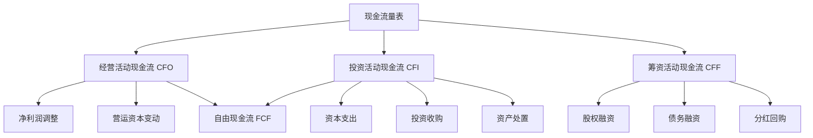

# 现金流量表深度分析

## 概述

现金流量表（Cash Flow Statement）是三大财务报表中最难造假的一张，它展示企业在一定期间内现金的流入和流出。巴菲特说："现金流是企业的血液，利润可以操纵，但现金流不会说谎。"

### 学习目标

1. 深入理解三大现金流活动的内涵
2. 掌握自由现金流的计算和应用
3. 评估现金流质量和可持续性
4. 识别现金流与利润的背离信号
5. 运用现金流进行企业估值
6. 理解不同商业模式的现金流特征

### 为什么现金流量表最重要？

- **真实性**：现金流动难以操纵
- **生存能力**：现金是企业生存的基础
- **投资决策**：DCF 估值的基础
- **分红能力**：现金流决定分红能力
- **风险预警**：现金流问题是破产的先兆


## 现金流量表结构

### 三大现金流活动



### 标准现金流量表格式

```
经营活动现金流（Operating Activities）
  净利润                                    $120
  调整项：
    折旧和摊销                               40
    股票薪酬                                 10
    递延税项                                  5
  营运资本变动：
    应收账款增加                            (20)
    存货增加                                (15)
    应付账款增加                             25
─────────────────────────────────────────
经营活动现金流净额                          165

投资活动现金流（Investing Activities）
  资本支出                                 (50)
  企业并购                                 (30)
  投资购买                                 (20)
  资产处置                                  10
─────────────────────────────────────────
投资活动现金流净额                         (90)

筹资活动现金流（Financing Activities）
  发行股票                                  20
  借款增加                                  30
  偿还债务                                (40)
  支付股利                                (30)
  股票回购                                (50)
─────────────────────────────────────────
筹资活动现金流净额                         (70)

现金净增加                                   5
期初现金                                   100
期末现金                                   105
```

## 经营活动现金流（CFO）

### 定义和重要性

经营活动现金流反映企业核心业务产生现金的能力，是最重要的现金流指标。

**计算方法**：

1. **间接法**（从净利润调整）：
   ```
   CFO = 净利润
       + 非现金费用（折旧、摊销）
       + 非现金损失
       - 非现金收益
       +/- 营运资本变动
   ```

2. **直接法**（直接列示现金收支）：
   ```
   CFO = 销售收现
       - 采购付现
       - 工资付现
       - 其他经营付现
   ```

### 关键调整项

#### 1. 折旧和摊销

- **性质**：非现金费用
- **调整**：加回净利润
- **意义**：恢复现金基础

#### 2. 营运资本变动

**应收账款变动**：
- 增加：占用现金（减项）
- 减少：释放现金（加项）

**存货变动**：
- 增加：占用现金（减项）
- 减少：释放现金（加项）

**应付账款变动**：
- 增加：延迟付款（加项）
- 减少：提前付款（减项）

### CFO 质量分析

**高质量 CFO 特征**：
1. CFO > 净利润（现金支持）
2. CFO 持续为正且增长
3. 营运资本变动合理
4. 应收账款质量高

**低质量 CFO 信号**：
1. CFO < 净利润（利润不转化为现金）
2. CFO 波动大或为负
3. 依赖营运资本释放
4. 应收账款激增

### 行业特征

**现金奶牛型**（CFO 强劲）：
- 软件/SaaS：订阅预收款
- 零售：先收款后付款
- 保险：保费预收

**现金消耗型**（CFO 弱）：
- 高增长科技公司
- 制造业扩张期
- 房地产开发

## 投资活动现金流（CFI）

### 主要项目

#### 1. 资本支出（CapEx）

**定义**：购买固定资产和无形资产的支出。

**分类**：
- **维持性资本支出**：维持现有业务
- **扩张性资本支出**：扩大业务规模

**关键指标**：

1. **资本支出率**：
   ```
   资本支出率 = 资本支出 / 收入
   ```
   - 重资产行业：10-20%+
   - 轻资产行业：< 5%

2. **资本支出/折旧比率**：
   ```
   CapEx/折旧 = 资本支出 / 折旧费用
   ```
   - > 1：扩张期
   - ≈ 1：维持期
   - < 1：收缩期

#### 2. 并购支出

**分析要点**：
- 并购频率和规模
- 并购整合效果
- 商誉减值风险

#### 3. 投资活动

- 金融资产投资
- 长期股权投资
- 联营企业投资

### CFI 分析

**健康的 CFI 特征**：
- 资本支出合理（支持增长但不过度）
- 并购谨慎（有战略意义）
- 投资回报清晰

**风险信号**：
- 资本支出激增（可能过度扩张）
- 频繁大额并购（整合风险）
- 投资回报不明

## 筹资活动现金流（CFF）

### 主要项目

#### 1. 股权融资

**发行股票**：
- IPO
- 增发
- 员工期权行权

**股票回购**：
- 提升 EPS
- 股价管理
- 资本配置

#### 2. 债务融资

**借款**：
- 银行贷款
- 发行债券
- 其他借款

**还款**：
- 到期偿还
- 提前还款

#### 3. 股利支付

**现金分红**：
- 定期分红
- 特别分红

**分红政策分析**：
- 分红率 = 股利 / 净利润
- 分红收益率 = 股利 / 股价

### CFF 分析

**成熟企业 CFF 特征**：
- 稳定分红
- 适度回购
- 债务管理稳健

**成长企业 CFF 特征**：
- 股权融资
- 低分红或不分红
- 债务融资支持扩张

## 自由现金流（FCF）

### 定义和计算

**企业自由现金流（FCFF）**：
```
FCFF = CFO - 资本支出
或
FCFF = EBIT × (1 - 税率) + 折旧 - 资本支出 - 营运资本增加
```

**股权自由现金流（FCFE）**：
```
FCFE = FCFF - 利息 × (1 - 税率) + 净借款
或
FCFE = 净利润 + 折旧 - 资本支出 - 营运资本增加 + 净借款
```

### FCF 的重要性

1. **估值基础**：DCF 模型的核心
2. **分红能力**：决定可持续分红水平
3. **财务灵活性**：应对危机的能力
4. **价值创造**：正 FCF 创造价值

### FCF 分析

**正 FCF**：
- 企业产生现金
- 可用于分红、回购、还债
- 财务健康

**负 FCF**：
- 企业消耗现金
- 需要外部融资
- 可能是增长期（正常）或困境（风险）

### FCF 收益率

```
FCF 收益率 = FCF / 市值
```
- 类似于股息收益率
- 衡量现金回报
- > 5% 通常有吸引力

## 现金流质量分析

### 现金流与利润对比

**理想状态**：
```
CFO > 净利润
FCF > 0
CFO 增长 ≈ 净利润增长
```

**风险信号**：
```
CFO < 净利润（利润不转化为现金）
FCF < 0（消耗现金）
CFO 下降但利润上升（质量问题）
```

### 应计项目分析

**应计项目**：
```
应计项目 = 净利润 - CFO
```

**分析**：
- 应计项目过大：可能存在盈余管理
- 应计项目持续为正：利润质量存疑
- 应计项目为负：保守会计

### 现金转换周期

```
现金转换周期 = DSO + DIO - DPO
```

**优化方向**：
- 缩短 DSO（加快收款）
- 降低 DIO（减少存货）
- 延长 DPO（延迟付款）

## 行业案例分析

### 案例 1：Apple（现金奶牛）

**2023 财年**：
- CFO：$111B
- 资本支出：$11B
- FCF：$100B
- FCF 收益率：3.5%

**特点**：
- 强大的现金产生能力
- 轻资产模式
- 大量回购和分红

### 案例 2：Amazon（投资期）

**2023**：
- CFO：$84B
- 资本支出：$48B
- FCF：$36B

**特点**：
- 高资本支出（AWS 基础设施）
- CFO 强劲但 FCF 相对较低
- 投资未来增长

### 案例 3：Tesla（高增长）

**2023**：
- CFO：$13B
- 资本支出：$9B
- FCF：$4B

**特点**：
- 从负 FCF 转为正
- 规模效应显现
- 现金流改善

### 案例 4：茅台（超级现金流）

**2023**：
- CFO：¥800亿
- 资本支出：¥50亿
- FCF：¥750亿
- FCF 收益率：3.5%

**特点**：
- 预收款模式
- 极低资本支出
- 现金流远超利润

## 常见误区

1. **只看 CFO**：
   - 忽视资本支出
   - 不计算 FCF
   - 忽视可持续性

2. **忽视现金流质量**：
   - 不分析营运资本变动
   - 忽视一次性项目
   - 不看现金流趋势

3. **不做行业对比**：
   - 不同行业现金流特征差异大
   - 成长期 vs 成熟期差异
   - 商业模式影响

## 延伸阅读

### 推荐书籍

1. 《现金流量表分析》- 张先治
2. 《Valuation》- McKinsey & Company
3. 《Investment Valuation》- Aswath Damodaran
4. 《巴菲特致股东信》- Warren Buffett

### 参考文献

1. Damodaran, A. (2012). *Investment Valuation*.
2. Koller, T., Goedhart, M., & Wessels, D. (2020). *Valuation: Measuring and Managing the Value of Companies*.
3. CFA Institute. (2023). *CFA Program Curriculum: Financial Reporting and Analysis*.

---

**下一步**：学习 [三表关系](statement-relationships.html)，理解财务报表之间的勾稽关系。
8. Penman, S. H. (2013). *Financial Statement Analysis and Security Valuation* (5th ed.). McGraw-Hill.
9. Palepu, K. G., Healy, P. M., & Peek, E. (2019). *Business Analysis and Valuation* (6th ed.). Cengage.
10. Fridson, M. S., & Alvarez, F. (2011). *Financial Statement Analysis: A Practitioner's Guide* (4th ed.). Wiley.


## 高级分析与前沿研究

### 学术研究进展

近年来，学术界对本领域的研究取得了重要进展。以下是几个值得关注的研究方向：

**行为金融学视角**：传统金融理论假设市场参与者是完全理性的，但行为金融学的研究表明，认知偏差和情绪因素在投资决策中扮演着重要角色。诺贝尔经济学奖得主丹尼尔·卡尼曼（Daniel Kahneman）和理查德·塞勒（Richard Thaler）的研究为我们理解市场非理性行为提供了重要框架。

**因子投资研究**：尤金·法玛（Eugene Fama）和肯尼斯·弗伦奇（Kenneth French）的三因子模型，以及后续发展的五因子模型，为系统性地解释股票收益差异提供了理论基础。这些研究表明，市值、账面市值比、盈利能力和投资模式等因子能够解释大部分股票收益的横截面差异。

**市场微观结构研究**：对市场流动性、价格发现机制和交易成本的深入研究，帮助我们更好地理解市场的运作机制，并为优化交易策略提供指导。

### 实战案例深度解析

**案例一：长期价值创造的典范**

以沃伦·巴菲特（Warren Buffett）的伯克希尔·哈撒韦（Berkshire Hathaway）为例，其长达数十年的卓越投资业绩证明了价值投资理念的有效性。从1965年至今，伯克希尔的账面价值年均增长率约为19.8%，远超同期标普500指数的约10.2%年均回报。

巴菲特的成功秘诀在于：
- 专注于具有持久竞争优势的优质企业
- 以合理价格买入，而非追求最低价格
- 长期持有，让复利效应充分发挥
- 保持充足的安全边际，控制下行风险

**案例二：危机中的机遇识别**

2008年金融危机期间，大多数投资者恐慌性抛售，但少数具有前瞻性的投资者却在危机中发现了历史性的投资机会。约翰·保尔森（John Paulson）通过做空次级抵押贷款相关证券，在危机中获得了约150亿美元的利润，成为金融史上最成功的单笔交易之一。

这个案例告诉我们：
- 深入的基本面研究能够发现市场定价错误
- 逆向思维往往能够发现被市场忽视的机会
- 风险管理和仓位控制是成功的关键

### 跨市场比较分析

不同市场在结构、监管、投资者构成等方面存在显著差异，这些差异对投资策略的选择有重要影响：

**美国市场特征**：
- 机构投资者主导，市场效率较高
- 信息披露制度完善，分析师覆盖广泛
- 衍生品市场发达，对冲工具丰富
- 长期牛市历史，但也经历过多次重大调整

**中国市场特征**：
- 散户投资者比例较高，市场波动性较大
- 政策因素影响显著，需要密切关注监管动向
- 新兴行业发展迅速，成长投资机会丰富
- A股、港股、美股中概股形成多层次市场体系

**欧洲市场特征**：
- 价值股比例较高，估值相对保守
- 受地缘政治和欧元区政策影响较大
- 部分行业（如奢侈品、工业）具有全球竞争优势
- ESG投资理念推广较为领先


## 实用工具与操作指南

### 分析工具推荐

**数据获取工具**：
- **Bloomberg Terminal**：专业级金融数据平台，提供实时行情、历史数据、新闻资讯等全方位服务，是机构投资者的首选工具
- **Wind资讯（万得）**：中国最权威的金融数据平台，覆盖A股、债券、基金等全市场数据
- **FactSet**：提供全球股票、固定收益、另类投资等多资产类别的综合数据服务
- **免费替代方案**：Yahoo Finance、Google Finance、东方财富、同花顺等提供基础数据服务

**分析软件工具**：
- **Excel/Python**：用于财务模型构建、数据分析和可视化
- **Tableau/Power BI**：用于数据可视化和仪表板创建
- **R语言**：适合统计分析和量化研究

### 实操步骤指南

**第一步：信息收集**
1. 获取目标公司/资产的基本信息和历史数据
2. 收集行业报告和竞争对手数据
3. 整理宏观经济背景信息
4. 查阅相关学术研究和专业分析报告

**第二步：定量分析**
1. 建立财务模型，计算关键指标
2. 进行历史趋势分析
3. 与同行业公司进行横向比较
4. 构建估值模型，计算合理价值区间

**第三步：定性分析**
1. 评估竞争优势和护城河
2. 分析管理层质量和公司治理
3. 识别主要风险因素
4. 评估行业发展趋势

**第四步：综合判断**
1. 整合定量和定性分析结果
2. 进行情景分析（乐观/基准/悲观）
3. 确定投资论点和关键假设
4. 制定投资决策和风险管理方案

### 常见错误与规避方法

| 常见错误 | 产生原因 | 规避方法 |
|---------|---------|---------|
| 过度依赖历史数据 | 忽视结构性变化 | 结合前瞻性分析 |
| 锚定效应 | 过度依赖初始信息 | 定期重新评估假设 |
| 确认偏误 | 只寻找支持观点的证据 | 主动寻找反驳证据 |
| 过度自信 | 高估自身分析能力 | 保持谦逊，设置安全边际 |
| 忽视流动性风险 | 只关注收益不关注风险 | 全面评估风险因素 |


## 扩展参考资料

### 经典著作推荐

**基础理论类**：
1. 本杰明·格雷厄姆（Benjamin Graham）《聪明的投资者》（The Intelligent Investor, 1949）- 价值投资圣经，巴菲特称之为"有史以来最伟大的投资书籍"
2. 菲利普·费雪（Philip Fisher）《怎样选择成长股》（Common Stocks and Uncommon Profits, 1958）- 成长投资经典，强调定性分析的重要性
3. 彼得·林奇（Peter Lynch）《彼得·林奇的成功投资》（One Up on Wall Street, 1989）- 普通投资者如何发现十倍股
4. 霍华德·马克斯（Howard Marks）《投资最重要的事》（The Most Important Thing, 2011）- 橡树资本创始人的投资智慧

**宏观经济类**：
5. 瑞·达里奥（Ray Dalio）《原则》（Principles, 2017）- 桥水基金创始人的生活和工作原则
6. 约翰·梅纳德·凯恩斯（John Maynard Keynes）《就业、利息和货币通论》（The General Theory, 1936）- 现代宏观经济学奠基之作
7. 米尔顿·弗里德曼（Milton Friedman）《货币的祸害》（Money Mischief, 1992）- 货币主义经典著作

**量化投资类**：
8. 伊曼纽尔·德曼（Emanuel Derman）《宽客人生》（My Life as a Quant, 2004）- 量化金融先驱的回忆录
9. 马科维茨（Harry Markowitz）《组合选择》（Portfolio Selection, 1952）- 现代投资组合理论奠基论文

### 权威研究报告

- **美联储经济研究**：https://www.federalreserve.gov/econres.htm
- **国际货币基金组织（IMF）报告**：https://www.imf.org/en/Publications
- **世界银行研究**：https://www.worldbank.org/en/research
- **国际清算银行（BIS）季报**：https://www.bis.org/publ/qtrpdf/
- **中国人民银行货币政策报告**：http://www.pbc.gov.cn

### 在线学习资源

- **Coursera金融课程**：耶鲁大学Robert Shiller的《金融市场》课程
- **MIT OpenCourseWare**：麻省理工学院金融工程相关课程
- **CFA Institute**：特许金融分析师协会的专业学习资源
- **Investopedia**：金融术语和概念的权威解释网站
- **SSRN**：社会科学研究网络，提供大量金融学术论文


## 综合评估框架

### 多维度评估矩阵

在进行全面分析时，需要从多个维度构建系统性的评估框架。以下矩阵提供了一个结构化的分析方法：

**维度一：基本面分析**
- 财务健康状况：资产负债结构、现金流质量、盈利能力趋势
- 业务竞争力：市场份额、定价权、客户粘性
- 管理层质量：战略执行力、资本配置能力、诚信记录
- 行业地位：竞争格局、进入壁垒、替代威胁

**维度二：估值分析**
- 绝对估值：DCF模型、资产重置价值、清算价值
- 相对估值：P/E、P/B、EV/EBITDA与历史均值和同行比较
- 成长性调整：PEG比率、EV/Sales对高成长企业的适用性
- 股息收益率：对价值型投资者的吸引力

**维度三：风险评估**
- 系统性风险：宏观经济、利率、汇率、地缘政治
- 非系统性风险：行业监管、竞争加剧、技术颠覆
- 流动性风险：市场深度、持仓集中度
- 信用风险：债务水平、再融资能力

**维度四：催化剂分析**
- 短期催化剂：季报超预期、新产品发布、并购重组
- 中期催化剂：行业周期转折、政策红利释放
- 长期催化剂：技术革命、人口结构变化、全球化趋势

### 决策树框架

```
投资决策流程
├── 1. 初步筛选
│   ├── 行业吸引力评估
│   ├── 公司基本面初筛
│   └── 估值合理性初判
├── 2. 深度研究
│   ├── 财务报表深度分析
│   ├── 竞争优势评估
│   ├── 管理层访谈/调研
│   └── 行业专家咨询
├── 3. 估值建模
│   ├── 构建DCF模型
│   ├── 相对估值比较
│   └── 情景分析
├── 4. 风险评估
│   ├── 识别主要风险因素
│   ├── 量化风险影响
│   └── 制定风险应对方案
└── 5. 投资决策
    ├── 确定仓位大小
    ├── 设定买入价格区间
    └── 制定退出策略
```

### 投资组合构建原则

在将单个投资标的纳入组合时，需要考虑以下原则：

1. **分散化原则**：不同行业、地区、资产类别的合理分散，降低非系统性风险
2. **相关性管理**：选择低相关性资产，提高组合的风险调整后收益
3. **仓位管理**：根据确信度和风险水平动态调整仓位
4. **再平衡机制**：定期或在偏离目标配置时进行再平衡
5. **流动性管理**：保持适当的现金或高流动性资产比例


## 历史数据与长期规律

### 长期市场数据回顾

金融市场的长期历史数据为我们提供了宝贵的参考依据。以下是一些关键的历史统计数据：

**全球主要股市长期回报（1900-2023年）**：
| 市场 | 年均实际回报率 | 年均名义回报率 | 年化波动率 |
|------|-------------|-------------|---------|
| 美国股市 | 6.4% | 9.5% | 19.8% |
| 英国股市 | 5.0% | 9.2% | 19.9% |
| 日本股市 | 4.1% | 8.7% | 29.8% |
| 中国A股 | N/A | ~10%* | ~25%* |

*注：中国A股数据自1990年代起，历史较短

**资产类别历史表现对比（美国市场，1926-2023年）**：
- 大盘股（S&P 500）：年均约10.2%
- 小盘股：年均约11.8%
- 长期国债：年均约5.5%
- 短期国债（现金）：年均约3.3%
- 通货膨胀率：年均约2.9%

**关键历史事件对市场的影响**：

| 事件 | 时间 | 市场最大跌幅 | 恢复时间 |
|------|------|-----------|---------|
| 大萧条 | 1929-1932 | -89% | 约25年 |
| 二战 | 1939-1945 | -40% | 约4年 |
| 石油危机 | 1973-1974 | -48% | 约7年 |
| 黑色星期一 | 1987 | -34% | 约2年 |
| 互联网泡沫 | 2000-2002 | -49% | 约7年 |
| 金融危机 | 2008-2009 | -57% | 约5年 |
| COVID崩盘 | 2020 | -34% | 约6个月 |

### 周期性规律总结

通过对历史数据的系统性研究，可以归纳出以下几个重要的周期性规律：

**经济周期与资产表现**：
- 复苏期：股票（尤其是周期股）表现最佳，债券开始走弱
- 繁荣期：股票持续上涨，大宗商品表现突出，债券承压
- 滞胀期：大宗商品（尤其是黄金）表现最佳，股票和债券均承压
- 衰退期：债券（尤其是国债）表现最佳，防御性股票相对抗跌

**估值均值回归规律**：
历史数据表明，市场估值具有强烈的均值回归特性。当市盈率（P/E）显著高于历史均值时，未来10年的预期回报往往较低；反之，当估值处于历史低位时，未来回报往往较高。

诺贝尔经济学奖得主罗伯特·席勒（Robert Shiller）开发的周期调整市盈率（CAPE，也称席勒P/E）是衡量市场长期估值的重要工具。历史数据显示，当CAPE超过30时，未来10年的年均实际回报往往低于5%；当CAPE低于15时，未来10年的年均实际回报往往超过10%。

**市场情绪与逆向投资**：
沃伦·巴菲特的名言"在别人贪婪时恐惧，在别人恐惧时贪婪"揭示了市场情绪的重要性。历史数据表明，在市场极度悲观时买入，往往能获得超额回报；而在市场极度乐观时保持谨慎，则能有效规避风险。

### 从历史中学习的方法论

**第一步：建立历史数据库**
- 收集目标市场/资产的长期历史数据
- 包括价格、估值、基本面指标等多维度数据
- 确保数据的准确性和完整性

**第二步：识别历史模式**
- 运用统计方法分析数据规律
- 识别周期性模式和结构性趋势
- 区分偶然事件和系统性规律

**第三步：理解背后逻辑**
- 不仅要知道"是什么"，更要理解"为什么"
- 将历史规律与经济学理论相结合
- 评估历史规律在当前环境下的适用性

**第四步：谨慎外推**
- 历史不会简单重复，但会押韵
- 注意结构性变化对历史规律的影响
- 保持开放心态，随时更新认知

