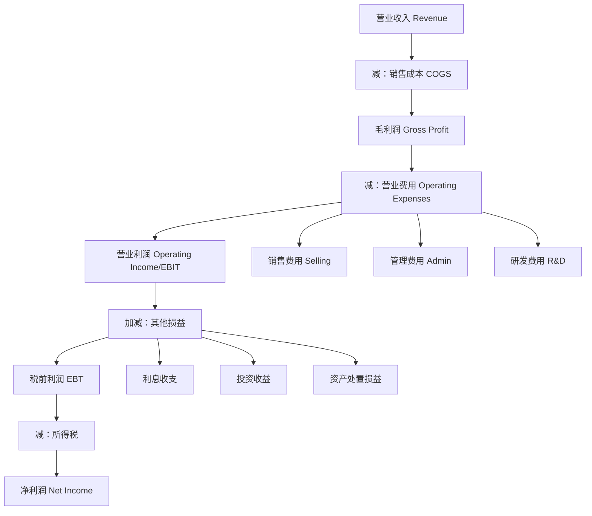

# 利润表深度分析

## 概述

利润表（Income Statement，也称损益表 P&L）展示企业在一定期间内的经营成果，是评估企业盈利能力的核心报表。彼得·林奇说："利润表告诉你企业是否在赚钱，这是投资最重要的问题。"

### 学习目标

完成本文学习后，你将能够：

1. 深入理解利润表的结构和利润层级
2. 掌握收入确认原则和成本结构分析
3. 计算和应用关键盈利能力指标
4. 识别盈利质量和可持续性
5. 进行行业对比和趋势分析
6. 发现利润操纵的预警信号

### 为什么利润表如此重要？

- **盈利能力**：直接反映企业赚钱能力
- **经营效率**：展示成本控制和运营管理水平
- **增长潜力**：收入和利润增长是股价上涨的基础
- **估值基础**：市盈率等估值指标的基础
- **现金流预测**：未来现金流的重要参考


## 利润表基本结构

### 利润层级

利润表采用多步式结构，展示从收入到净利润的逐层计算：



### 标准利润表格式

```
营业收入（Revenue）                           $1,000
  减：销售成本（Cost of Goods Sold）            (600)
─────────────────────────────────────────────
毛利润（Gross Profit）                          400
  毛利率：40%

  减：营业费用（Operating Expenses）
    销售费用（Selling Expenses）                (100)
    管理费用（Administrative Expenses）          (80)
    研发费用（R&D Expenses）                     (50)
─────────────────────────────────────────────
营业利润（Operating Income/EBIT）               170
  营业利润率：17%

  加：其他收入（Other Income）                    10
  减：利息费用（Interest Expense）               (20)
─────────────────────────────────────────────
税前利润（Earnings Before Tax, EBT）            160
  减：所得税（Income Tax）                       (40)
─────────────────────────────────────────────
净利润（Net Income）                            120
  净利率：12%

每股收益（EPS）                                $1.20
```

## 收入分析

### 收入确认原则

**五步法模型（IFRS 15 / ASC 606）**：

1. **识别合同**：与客户的合同
2. **识别履约义务**：合同中的承诺
3. **确定交易价格**：预期收取的对价
4. **分配交易价格**：按相对独立售价分配
5. **确认收入**：履行履约义务时确认

**关键原则**：
- 控制权转移时确认收入
- 不是收到现金时确认
- 可能早于或晚于收款

### 收入类型

#### 1. 商品销售收入

**确认时点**：商品控制权转移时
- 零售：交付时
- 批发：发货时（FOB shipping point）或收货时（FOB destination）
- 电商：客户确认收货时

**分析要点**：
- 退货政策影响
- 渠道折扣和返利
- 季节性波动

#### 2. 服务收入

**确认方法**：
- **时点法**：服务完成时一次性确认
- **时段法**：按完工进度确认

**案例**：
- 咨询服务：按项目进度确认
- 订阅服务：按时间均匀确认
- 维护服务：在服务期内确认

#### 3. 特许权使用费收入

**确认基础**：
- 销售额的百分比
- 固定费用 + 变动费用
- 按实际发生确认

#### 4. 利息和股利收入

**确认时点**：
- 利息：按时间比例确认
- 股利：宣告时确认

### 收入质量分析

**高质量收入特征**：
1. 现金收入占比高
2. 收入增长可持续
3. 客户集中度低
4. 合同条款清晰
5. 退货率低

**低质量收入信号**：
1. 应收账款增速 > 收入增速
2. 大量关联交易收入
3. 季末突击确认收入
4. 频繁调整收入确认政策
5. 客户过度集中

### 收入增长分析

**增长来源分解**：
```
收入增长 = 价格增长 + 数量增长 + 新产品/市场
```

**关键指标**：

1. **同比增长率（YoY Growth）**：
   ```
   YoY增长率 = (本期收入 - 去年同期收入) / 去年同期收入
   ```

2. **复合年增长率（CAGR）**：
   ```
   CAGR = (期末值 / 期初值)^(1/年数) - 1
   ```

3. **有机增长 vs 并购增长**：
   - 有机增长：内生增长，更可持续
   - 并购增长：外延增长，需要整合

**行业对比**：
- 高增长行业：科技、新能源（20-50%+）
- 稳定增长：消费品、医药（5-15%）
- 低增长：公用事业、传统制造（0-5%）

## 成本结构分析

### 销售成本（COGS）

**定义**：直接归属于产品或服务的成本。

**制造业 COGS 构成**：
- 直接材料（Direct Materials）
- 直接人工（Direct Labor）
- 制造费用（Manufacturing Overhead）

**零售业 COGS**：
- 采购成本
- 运输成本
- 仓储成本

**服务业 COGS**：
- 服务人员工资
- 直接服务成本
- 外包成本

**关键指标**：

1. **毛利率（Gross Margin）**：
   ```
   毛利率 = (收入 - 销售成本) / 收入 × 100%
   ```
   - 反映产品定价能力和成本控制
   - 行业差异巨大

2. **单位成本（Unit Cost）**：
   ```
   单位成本 = 总成本 / 销售数量
   ```
   - 衡量成本效率
   - 规模效应体现

**毛利率行业基准**：
- 软件/SaaS：70-90%
- 奢侈品：60-70%
- 品牌消费品：40-60%
- 零售：20-40%
- 大宗商品：5-15%

### 营业费用（Operating Expenses）

#### 1. 销售费用（Selling Expenses）

**主要项目**：
- 销售人员工资和佣金
- 广告和营销费用
- 运输和配送费用
- 售后服务费用

**分析要点**：
- 销售费用率 = 销售费用 / 收入
- 与收入增长的关系
- 营销效率（CAC - Customer Acquisition Cost）

#### 2. 管理费用（Administrative Expenses）

**主要项目**：
- 管理人员工资
- 办公费用
- 折旧和摊销
- 专业服务费（法律、审计）

**分析要点**：
- 管理费用率 = 管理费用 / 收入
- 规模效应（收入增长，费用率下降）
- 费用控制能力

#### 3. 研发费用（R&D Expenses）

**会计处理**：
- **费用化**：当期计入费用（GAAP 通常做法）
- **资本化**：符合条件的开发支出资本化（IFRS 允许）

**关键指标**：

1. **研发强度**：
   ```
   研发强度 = 研发费用 / 收入 × 100%
   ```
   - 科技公司：10-20%+
   - 制药公司：15-25%
   - 传统制造：2-5%

2. **研发效率**：
   - 新产品收入占比
   - 专利产出
   - 产品上市周期

**行业案例**：
- **Intel**：研发强度 15%，持续技术领先
- **辉瑞**：研发强度 20%，新药研发
- **茅台**：研发强度 < 1%，工艺改进为主


## 利润层级详解

### 营业利润（Operating Income / EBIT）

**定义**：扣除所有营业费用后的利润，反映核心业务盈利能力。

**计算公式**：
```
营业利润 = 毛利润 - 营业费用
EBIT = Earnings Before Interest and Tax
```

**关键指标**：

1. **营业利润率（Operating Margin）**：
   ```
   营业利润率 = 营业利润 / 收入 × 100%
   ```
   - 衡量核心业务盈利能力
   - 排除融资和税务影响
   - 便于跨公司对比

**行业基准**：
- 软件：25-40%
- 消费品牌：15-25%
- 零售：5-10%
- 航空：5-8%

### EBITDA

**定义**：税息折旧及摊销前利润。

**计算公式**：
```
EBITDA = 营业利润 + 折旧 + 摊销
或
EBITDA = 净利润 + 利息 + 税 + 折旧 + 摊销
```

**用途**：
- 衡量现金产生能力
- 排除资本结构影响
- 并购估值常用指标
- 债务偿还能力评估

**局限性**：
- 忽视资本支出需求
- 不等于自由现金流
- 可能被操纵

### 税前利润（EBT）

**定义**：扣除利息后、税前的利润。

**计算公式**：
```
税前利润 = 营业利润 + 其他损益 - 利息费用
```

**分析要点**：
- 反映融资成本影响
- 税前利润率 = 税前利润 / 收入
- 与营业利润对比看融资效率

### 净利润（Net Income）

**定义**：归属于股东的最终利润。

**计算公式**：
```
净利润 = 税前利润 - 所得税
```

**关键指标**：

1. **净利率（Net Margin）**：
   ```
   净利率 = 净利润 / 收入 × 100%
   ```
   - 综合盈利能力指标
   - 反映所有因素影响

2. **每股收益（EPS）**：
   ```
   基本EPS = (净利润 - 优先股股利) / 加权平均普通股股数
   稀释EPS = 净利润 / (普通股股数 + 潜在普通股)
   ```
   - 最重要的盈利指标之一
   - 市盈率计算基础

**行业净利率基准**：
- 软件/互联网：15-30%
- 金融服务：15-25%
- 消费品：8-15%
- 零售：2-5%
- 航空：1-3%

## 盈利能力指标

### 盈利能力比率

1. **资产收益率（ROA）**：
   ```
   ROA = 净利润 / 平均总资产
   ```

2. **净资产收益率（ROE）**：
   ```
   ROE = 净利润 / 平均股东权益
   ```

3. **投入资本回报率（ROIC）**：
   ```
   ROIC = NOPAT / 投入资本
   NOPAT = 营业利润 × (1 - 税率)
   ```

### 杜邦分析

**三因素杜邦分析**：
```
ROE = 净利率 × 资产周转率 × 权益乘数
    = (净利润/收入) × (收入/资产) × (资产/权益)
```

**五因素杜邦分析**：
```
ROE = 税负 × 利息负担 × 营业利润率 × 资产周转率 × 权益乘数
```

**应用**：
- 分解 ROE 驱动因素
- 识别改善方向
- 跨公司对比

## 行业对比分析

### 案例 1：科技巨头对比

**Apple（2023）**：
- 收入：$383B
- 毛利率：44%
- 营业利润率：30%
- 净利率：25%
- 特点：硬件+服务，高利润率

**Microsoft（2023）**：
- 收入：$211B
- 毛利率：69%
- 营业利润率：42%
- 净利率：34%
- 特点：软件为主，利润率更高

**Amazon（2023）**：
- 收入：$574B
- 毛利率：48%
- 营业利润率：6%
- 净利率：3%
- 特点：零售+云，规模大利润率低

### 案例 2：消费品对比

**茅台（2023）**：
- 收入：¥1,371亿
- 毛利率：92%
- 营业利润率：73%
- 净利率：52%
- 特点：定价权极强，利润率惊人

**可口可乐（2023）**：
- 收入：$46B
- 毛利率：60%
- 营业利润率：27%
- 净利率：23%
- 特点：品牌溢价，稳定盈利

### 案例 3：零售对比

**Costco（2023）**：
- 收入：$242B
- 毛利率：11%
- 营业利润率：3.5%
- 净利率：2.5%
- 特点：会员制，薄利多销

**Walmart（2023）**：
- 收入：$611B
- 毛利率：24%
- 营业利润率：4%
- 净利率：2%
- 特点：规模优势，低价策略

## 盈利质量分析

### 高质量盈利特征

1. **现金支持**：
   - 经营现金流 > 净利润
   - 应收账款增速 < 收入增速
   - 资本支出合理

2. **可持续性**：
   - 核心业务驱动
   - 非经常性损益占比低
   - 客户和产品多元化

3. **增长质量**：
   - 有机增长为主
   - 利润率稳定或提升
   - 市场份额增长

### 低质量盈利信号

1. **会计操纵迹象**：
   - 频繁调整会计政策
   - 大量非经常性收益
   - 递延收入异常变化
   - 关联交易占比高

2. **盈利不可持续**：
   - 依赖一次性收益
   - 成本削减到极限
   - 价格战导致的增长
   - 过度依赖并购

3. **现金流背离**：
   - 利润增长但现金流下降
   - 应收账款激增
   - 存货积压

## 常见误区

1. **只看净利润**：
   - 忽视利润质量
   - 不看现金流
   - 忽略非经常性损益

2. **忽视收入质量**：
   - 不分析收入来源
   - 忽视客户集中度
   - 不看收入确认政策

3. **不做行业对比**：
   - 不同行业利润率差异巨大
   - 脱离行业背景评估
   - 忽视行业周期

4. **忽视趋势**：
   - 只看单期数据
   - 不分析增长趋势
   - 忽视利润率变化

## 延伸阅读

### 推荐书籍

1. 《财务报表分析》- Martin Fridson
2. 《Quality of Earnings》- Thornton O'glove
3. 《Financial Shenanigans》- Howard Schilit
4. 《巴菲特致股东信》- Warren Buffett

### 参考文献

1. Penman, S. H. (2013). *Financial Statement Analysis and Security Valuation*.
2. Fridson, M. S., & Alvarez, F. (2022). *Financial Statement Analysis: A Practitioner's Guide*.
3. Schilit, H., & Perler, J. (2010). *Financial Shenanigans*.
4. CFA Institute. (2023). *CFA Program Curriculum: Financial Reporting and Analysis*.

---

**下一步**：学习 [现金流量表](cash-flow-statement.html)，理解企业的现金产生能力。
9. Palepu, K. G., Healy, P. M., & Peek, E. (2019). *Business Analysis and Valuation* (6th ed.). Cengage.
10. Fridson, M. S., & Alvarez, F. (2011). *Financial Statement Analysis: A Practitioner's Guide* (4th ed.). Wiley.


## 高级分析与前沿研究

### 学术研究进展

近年来，学术界对本领域的研究取得了重要进展。以下是几个值得关注的研究方向：

**行为金融学视角**：传统金融理论假设市场参与者是完全理性的，但行为金融学的研究表明，认知偏差和情绪因素在投资决策中扮演着重要角色。诺贝尔经济学奖得主丹尼尔·卡尼曼（Daniel Kahneman）和理查德·塞勒（Richard Thaler）的研究为我们理解市场非理性行为提供了重要框架。

**因子投资研究**：尤金·法玛（Eugene Fama）和肯尼斯·弗伦奇（Kenneth French）的三因子模型，以及后续发展的五因子模型，为系统性地解释股票收益差异提供了理论基础。这些研究表明，市值、账面市值比、盈利能力和投资模式等因子能够解释大部分股票收益的横截面差异。

**市场微观结构研究**：对市场流动性、价格发现机制和交易成本的深入研究，帮助我们更好地理解市场的运作机制，并为优化交易策略提供指导。

### 实战案例深度解析

**案例一：长期价值创造的典范**

以沃伦·巴菲特（Warren Buffett）的伯克希尔·哈撒韦（Berkshire Hathaway）为例，其长达数十年的卓越投资业绩证明了价值投资理念的有效性。从1965年至今，伯克希尔的账面价值年均增长率约为19.8%，远超同期标普500指数的约10.2%年均回报。

巴菲特的成功秘诀在于：
- 专注于具有持久竞争优势的优质企业
- 以合理价格买入，而非追求最低价格
- 长期持有，让复利效应充分发挥
- 保持充足的安全边际，控制下行风险

**案例二：危机中的机遇识别**

2008年金融危机期间，大多数投资者恐慌性抛售，但少数具有前瞻性的投资者却在危机中发现了历史性的投资机会。约翰·保尔森（John Paulson）通过做空次级抵押贷款相关证券，在危机中获得了约150亿美元的利润，成为金融史上最成功的单笔交易之一。

这个案例告诉我们：
- 深入的基本面研究能够发现市场定价错误
- 逆向思维往往能够发现被市场忽视的机会
- 风险管理和仓位控制是成功的关键

### 跨市场比较分析

不同市场在结构、监管、投资者构成等方面存在显著差异，这些差异对投资策略的选择有重要影响：

**美国市场特征**：
- 机构投资者主导，市场效率较高
- 信息披露制度完善，分析师覆盖广泛
- 衍生品市场发达，对冲工具丰富
- 长期牛市历史，但也经历过多次重大调整

**中国市场特征**：
- 散户投资者比例较高，市场波动性较大
- 政策因素影响显著，需要密切关注监管动向
- 新兴行业发展迅速，成长投资机会丰富
- A股、港股、美股中概股形成多层次市场体系

**欧洲市场特征**：
- 价值股比例较高，估值相对保守
- 受地缘政治和欧元区政策影响较大
- 部分行业（如奢侈品、工业）具有全球竞争优势
- ESG投资理念推广较为领先


## 实用工具与操作指南

### 分析工具推荐

**数据获取工具**：
- **Bloomberg Terminal**：专业级金融数据平台，提供实时行情、历史数据、新闻资讯等全方位服务，是机构投资者的首选工具
- **Wind资讯（万得）**：中国最权威的金融数据平台，覆盖A股、债券、基金等全市场数据
- **FactSet**：提供全球股票、固定收益、另类投资等多资产类别的综合数据服务
- **免费替代方案**：Yahoo Finance、Google Finance、东方财富、同花顺等提供基础数据服务

**分析软件工具**：
- **Excel/Python**：用于财务模型构建、数据分析和可视化
- **Tableau/Power BI**：用于数据可视化和仪表板创建
- **R语言**：适合统计分析和量化研究

### 实操步骤指南

**第一步：信息收集**
1. 获取目标公司/资产的基本信息和历史数据
2. 收集行业报告和竞争对手数据
3. 整理宏观经济背景信息
4. 查阅相关学术研究和专业分析报告

**第二步：定量分析**
1. 建立财务模型，计算关键指标
2. 进行历史趋势分析
3. 与同行业公司进行横向比较
4. 构建估值模型，计算合理价值区间

**第三步：定性分析**
1. 评估竞争优势和护城河
2. 分析管理层质量和公司治理
3. 识别主要风险因素
4. 评估行业发展趋势

**第四步：综合判断**
1. 整合定量和定性分析结果
2. 进行情景分析（乐观/基准/悲观）
3. 确定投资论点和关键假设
4. 制定投资决策和风险管理方案

### 常见错误与规避方法

| 常见错误 | 产生原因 | 规避方法 |
|---------|---------|---------|
| 过度依赖历史数据 | 忽视结构性变化 | 结合前瞻性分析 |
| 锚定效应 | 过度依赖初始信息 | 定期重新评估假设 |
| 确认偏误 | 只寻找支持观点的证据 | 主动寻找反驳证据 |
| 过度自信 | 高估自身分析能力 | 保持谦逊，设置安全边际 |
| 忽视流动性风险 | 只关注收益不关注风险 | 全面评估风险因素 |


## 扩展参考资料

### 经典著作推荐

**基础理论类**：
1. 本杰明·格雷厄姆（Benjamin Graham）《聪明的投资者》（The Intelligent Investor, 1949）- 价值投资圣经，巴菲特称之为"有史以来最伟大的投资书籍"
2. 菲利普·费雪（Philip Fisher）《怎样选择成长股》（Common Stocks and Uncommon Profits, 1958）- 成长投资经典，强调定性分析的重要性
3. 彼得·林奇（Peter Lynch）《彼得·林奇的成功投资》（One Up on Wall Street, 1989）- 普通投资者如何发现十倍股
4. 霍华德·马克斯（Howard Marks）《投资最重要的事》（The Most Important Thing, 2011）- 橡树资本创始人的投资智慧

**宏观经济类**：
5. 瑞·达里奥（Ray Dalio）《原则》（Principles, 2017）- 桥水基金创始人的生活和工作原则
6. 约翰·梅纳德·凯恩斯（John Maynard Keynes）《就业、利息和货币通论》（The General Theory, 1936）- 现代宏观经济学奠基之作
7. 米尔顿·弗里德曼（Milton Friedman）《货币的祸害》（Money Mischief, 1992）- 货币主义经典著作

**量化投资类**：
8. 伊曼纽尔·德曼（Emanuel Derman）《宽客人生》（My Life as a Quant, 2004）- 量化金融先驱的回忆录
9. 马科维茨（Harry Markowitz）《组合选择》（Portfolio Selection, 1952）- 现代投资组合理论奠基论文

### 权威研究报告

- **美联储经济研究**：https://www.federalreserve.gov/econres.htm
- **国际货币基金组织（IMF）报告**：https://www.imf.org/en/Publications
- **世界银行研究**：https://www.worldbank.org/en/research
- **国际清算银行（BIS）季报**：https://www.bis.org/publ/qtrpdf/
- **中国人民银行货币政策报告**：http://www.pbc.gov.cn

### 在线学习资源

- **Coursera金融课程**：耶鲁大学Robert Shiller的《金融市场》课程
- **MIT OpenCourseWare**：麻省理工学院金融工程相关课程
- **CFA Institute**：特许金融分析师协会的专业学习资源
- **Investopedia**：金融术语和概念的权威解释网站
- **SSRN**：社会科学研究网络，提供大量金融学术论文


## 综合评估框架

### 多维度评估矩阵

在进行全面分析时，需要从多个维度构建系统性的评估框架。以下矩阵提供了一个结构化的分析方法：

**维度一：基本面分析**
- 财务健康状况：资产负债结构、现金流质量、盈利能力趋势
- 业务竞争力：市场份额、定价权、客户粘性
- 管理层质量：战略执行力、资本配置能力、诚信记录
- 行业地位：竞争格局、进入壁垒、替代威胁

**维度二：估值分析**
- 绝对估值：DCF模型、资产重置价值、清算价值
- 相对估值：P/E、P/B、EV/EBITDA与历史均值和同行比较
- 成长性调整：PEG比率、EV/Sales对高成长企业的适用性
- 股息收益率：对价值型投资者的吸引力

**维度三：风险评估**
- 系统性风险：宏观经济、利率、汇率、地缘政治
- 非系统性风险：行业监管、竞争加剧、技术颠覆
- 流动性风险：市场深度、持仓集中度
- 信用风险：债务水平、再融资能力

**维度四：催化剂分析**
- 短期催化剂：季报超预期、新产品发布、并购重组
- 中期催化剂：行业周期转折、政策红利释放
- 长期催化剂：技术革命、人口结构变化、全球化趋势

### 决策树框架

```
投资决策流程
├── 1. 初步筛选
│   ├── 行业吸引力评估
│   ├── 公司基本面初筛
│   └── 估值合理性初判
├── 2. 深度研究
│   ├── 财务报表深度分析
│   ├── 竞争优势评估
│   ├── 管理层访谈/调研
│   └── 行业专家咨询
├── 3. 估值建模
│   ├── 构建DCF模型
│   ├── 相对估值比较
│   └── 情景分析
├── 4. 风险评估
│   ├── 识别主要风险因素
│   ├── 量化风险影响
│   └── 制定风险应对方案
└── 5. 投资决策
    ├── 确定仓位大小
    ├── 设定买入价格区间
    └── 制定退出策略
```

### 投资组合构建原则

在将单个投资标的纳入组合时，需要考虑以下原则：

1. **分散化原则**：不同行业、地区、资产类别的合理分散，降低非系统性风险
2. **相关性管理**：选择低相关性资产，提高组合的风险调整后收益
3. **仓位管理**：根据确信度和风险水平动态调整仓位
4. **再平衡机制**：定期或在偏离目标配置时进行再平衡
5. **流动性管理**：保持适当的现金或高流动性资产比例

