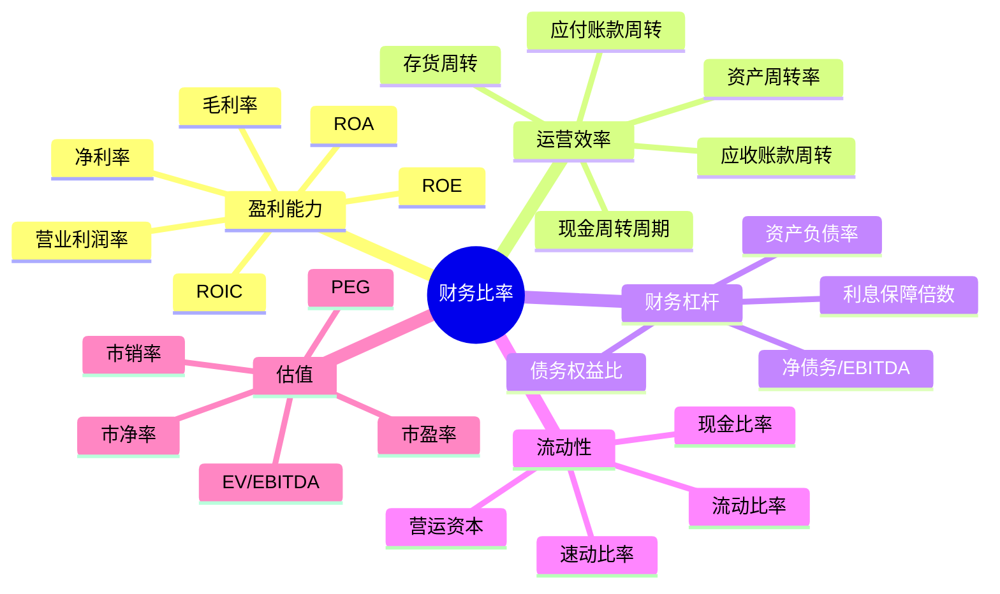

# 财务比率分析

## 概述

财务比率分析是将财务报表数据转化为可比较、可评估的指标体系，是财务分析的核心工具。本文系统介绍 50+ 个关键财务比率。

### 学习目标

1. 掌握五大类财务比率的计算和应用
2. 理解不同比率的经济含义
3. 建立系统的财务分析框架
4. 进行行业对比和趋势分析
5. 识别财务风险和投资机会


## 财务比率分类



## 一、盈利能力比率

### 1. 毛利率（Gross Margin）
```
毛利率 = (收入 - 销售成本) / 收入 × 100%
```
**意义**：产品定价能力和成本控制
**行业基准**：软件 70-90%，零售 20-40%

### 2. 营业利润率（Operating Margin）
```
营业利润率 = 营业利润 / 收入 × 100%
```
**意义**：核心业务盈利能力
**行业基准**：科技 20-40%，零售 5-10%

### 3. 净利率（Net Margin）
```
净利率 = 净利润 / 收入 × 100%
```
**意义**：综合盈利能力
**行业基准**：软件 15-30%，零售 2-5%

### 4. 净资产收益率（ROE）
```
ROE = 净利润 / 平均股东权益 × 100%
```
**意义**：股东投资回报率
**标准**：> 15% 优秀，> 20% 卓越

### 5. 总资产收益率（ROA）
```
ROA = 净利润 / 平均总资产 × 100%
```
**意义**：资产盈利能力
**关系**：ROE = ROA × 权益乘数

### 6. 投入资本回报率（ROIC）
```
ROIC = NOPAT / 投入资本
NOPAT = 营业利润 × (1 - 税率)
投入资本 = 股东权益 + 有息负债
```
**意义**：资本使用效率
**标准**：> WACC 创造价值

## 二、运营效率比率

### 7. 总资产周转率
```
总资产周转率 = 收入 / 平均总资产
```
**意义**：资产使用效率
**行业**：零售 2-3，重工业 0.5-1.0

### 8. 应收账款周转天数（DSO）
```
DSO = (应收账款 / 年收入) × 365
```
**意义**：收款效率
**标准**：越短越好，30-90 天正常

### 9. 存货周转天数（DIO）
```
DIO = (存货 / 年销售成本) × 365
```
**意义**：存货管理效率
**标准**：越短越好，行业差异大

### 10. 应付账款周转天数（DPO）
```
DPO = (应付账款 / 年销售成本) × 365
```
**意义**：付款周期
**策略**：越长越好（但不损害关系）

### 11. 现金周转周期（CCC）
```
CCC = DSO + DIO - DPO
```
**意义**：现金循环时间
**目标**：越短越好，甚至负数

## 三、财务杠杆比率

### 12. 资产负债率
```
资产负债率 = 总负债 / 总资产 × 100%
```
**标准**：< 60% 较安全（非金融业）

### 13. 债务权益比
```
债务权益比 = 总负债 / 股东权益
```
**标准**：< 1.0 保守，< 2.0 可接受

### 14. 利息保障倍数
```
利息保障倍数 = EBIT / 利息费用
```
**标准**：> 3 较安全，> 5 很安全

### 15. 净债务/EBITDA
```
净债务/EBITDA = (总债务 - 现金) / EBITDA
```
**标准**：< 3 较安全，< 2 很安全

## 四、流动性比率

### 16. 流动比率
```
流动比率 = 流动资产 / 流动负债
```
**标准**：> 1.5 较安全，> 2.0 很安全

### 17. 速动比率
```
速动比率 = (流动资产 - 存货) / 流动负债
```
**标准**：> 1.0 较安全

### 18. 现金比率
```
现金比率 = 现金及等价物 / 流动负债
```
**标准**：> 0.5 较安全

## 五、估值比率

### 19. 市盈率（P/E）
```
P/E = 股价 / 每股收益
```
**应用**：相对估值，行业对比

### 20. 市净率（P/B）
```
P/B = 市值 / 账面价值
```
**应用**：价值投资筛选

### 21. 市销率（P/S）
```
P/S = 市值 / 年收入
```
**应用**：亏损公司估值

### 22. EV/EBITDA
```
EV/EBITDA = 企业价值 / EBITDA
EV = 市值 + 净债务
```
**应用**：并购估值

### 23. PEG
```
PEG = P/E / 增长率
```
**标准**：< 1.0 可能低估

## 行业基准对比表

| 比率类别 | 软件 | 零售 | 制造 | 金融 |
|---------|------|------|------|------|
| 毛利率 | 70-90% | 20-40% | 30-50% | N/A |
| 营业利润率 | 25-40% | 5-10% | 10-20% | 30-50% |
| 净利率 | 15-30% | 2-5% | 5-10% | 15-25% |
| ROE | 20-40% | 15-25% | 10-20% | 10-15% |
| 资产周转率 | 0.5-1.0 | 2-3 | 1-2 | 0.1-0.2 |
| 资产负债率 | 20-40% | 50-70% | 50-70% | 85-95% |
| 流动比率 | 2-4 | 0.8-1.5 | 1-2 | N/A |

## 综合分析框架

### 杜邦分析
```
ROE = 净利率 × 资产周转率 × 权益乘数
```

### Z-Score 破产预测
```
Z = 1.2×(营运资本/总资产) + 1.4×(留存收益/总资产) 
    + 3.3×(EBIT/总资产) + 0.6×(市值/总负债) 
    + 1.0×(收入/总资产)
```
- Z > 2.99：安全
- 1.81 < Z < 2.99：灰色
- Z < 1.81：危险

## 实战应用

### 投资筛选标准

**巴菲特标准**：
- ROE > 15%
- 债务权益比 < 0.5
- 自由现金流 > 0
- 利润率稳定

**格雷厄姆标准**：
- P/E < 15
- P/B < 1.5
- 流动比率 > 2.0
- 债务权益比 < 1.0

## 常见误区

1. **孤立看单一比率**
2. **不做行业对比**
3. **忽视趋势分析**
4. **不考虑会计政策**

## 延伸阅读

### 推荐书籍
1. 《财务报表分析》- Martin Fridson
2. 《Valuation》- McKinsey
3. 《Investment Valuation》- Aswath Damodaran

### 参考文献
1. Penman, S. H. (2013). *Financial Statement Analysis*.
2. CFA Institute. (2023). *CFA Program Curriculum*.

---

**下一步**：学习 [趋势分析](trend-analysis.html)，掌握动态财务分析方法。
6. Palepu, K. G., Healy, P. M., & Peek, E. (2019). *Business Analysis and Valuation* (6th ed.). Cengage.
7. Fridson, M. S., & Alvarez, F. (2011). *Financial Statement Analysis: A Practitioner's Guide* (4th ed.). Wiley.
8. Subramanyam, K. R. (2014). *Financial Statement Analysis* (11th ed.). McGraw-Hill.
9. Wahlen, J. M., Baginski, S. P., & Bradshaw, M. T. (2017). *Financial Reporting, Financial Statement Analysis and Valuation* (9th ed.). Cengage.
10. Dechow, P. M., & Schrand, C. M. (2004). *Earnings Quality*. CFA Institute Research Foundation.


## 深度分析

### 核心机制解析

理解本主题需要从多个维度进行系统性分析。以下从理论基础、实践应用和历史验证三个层面展开深度探讨。

**理论基础层面**：本主题的核心逻辑建立在经济学和金融学的基本原理之上。通过对基础理论的深入理解，投资者能够建立起稳固的分析框架，避免被市场短期噪音所干扰。

**实践应用层面**：理论必须与实践相结合才能产生价值。在实际投资决策中，需要将抽象的概念转化为具体的分析工具和决策标准。

**历史验证层面**：金融市场有着丰富的历史记录，通过研究历史案例，我们可以验证理论的有效性，并从中提炼出具有普遍意义的规律。

### 关键影响因素

影响本主题的关键因素可以从以下几个维度进行分析：

1. **宏观经济环境**：利率水平、通货膨胀率、经济增长速度等宏观变量对本主题有着深远影响。在不同的宏观经济周期中，相关指标的表现会呈现出显著差异。

2. **市场结构因素**：市场参与者的构成、信息传播机制、流动性状况等市场结构因素决定了价格发现的效率和准确性。

3. **政策监管环境**：政府政策、监管框架的变化会直接影响相关市场的运作规则和参与者行为。

4. **技术创新驱动**：技术进步不断改变着金融市场的运作方式，从算法交易到区块链技术，每一次技术革新都带来新的机遇和挑战。

5. **全球化与地缘政治**：在全球化背景下，各国市场之间的联动性日益增强，地缘政治风险的影响也越来越不可忽视。

### 量化分析框架

为了更精确地分析和评估，可以采用以下量化框架：

| 分析维度 | 关键指标 | 参考基准 | 分析方法 |
|---------|---------|---------|---------|
| 规模评估 | 绝对值与相对值 | 历史均值 | 趋势分析 |
| 质量评估 | 稳定性指标 | 行业对标 | 横向比较 |
| 风险评估 | 波动率指标 | 风险阈值 | 情景分析 |
| 价值评估 | 估值倍数 | 历史区间 | 回归分析 |

通过系统性地应用上述框架，投资者可以对目标进行全面、客观的评估，从而做出更加理性的投资决策。


## 高级分析与前沿研究

### 学术研究进展

近年来，学术界对本领域的研究取得了重要进展。以下是几个值得关注的研究方向：

**行为金融学视角**：传统金融理论假设市场参与者是完全理性的，但行为金融学的研究表明，认知偏差和情绪因素在投资决策中扮演着重要角色。诺贝尔经济学奖得主丹尼尔·卡尼曼（Daniel Kahneman）和理查德·塞勒（Richard Thaler）的研究为我们理解市场非理性行为提供了重要框架。

**因子投资研究**：尤金·法玛（Eugene Fama）和肯尼斯·弗伦奇（Kenneth French）的三因子模型，以及后续发展的五因子模型，为系统性地解释股票收益差异提供了理论基础。这些研究表明，市值、账面市值比、盈利能力和投资模式等因子能够解释大部分股票收益的横截面差异。

**市场微观结构研究**：对市场流动性、价格发现机制和交易成本的深入研究，帮助我们更好地理解市场的运作机制，并为优化交易策略提供指导。

### 实战案例深度解析

**案例一：长期价值创造的典范**

以沃伦·巴菲特（Warren Buffett）的伯克希尔·哈撒韦（Berkshire Hathaway）为例，其长达数十年的卓越投资业绩证明了价值投资理念的有效性。从1965年至今，伯克希尔的账面价值年均增长率约为19.8%，远超同期标普500指数的约10.2%年均回报。

巴菲特的成功秘诀在于：
- 专注于具有持久竞争优势的优质企业
- 以合理价格买入，而非追求最低价格
- 长期持有，让复利效应充分发挥
- 保持充足的安全边际，控制下行风险

**案例二：危机中的机遇识别**

2008年金融危机期间，大多数投资者恐慌性抛售，但少数具有前瞻性的投资者却在危机中发现了历史性的投资机会。约翰·保尔森（John Paulson）通过做空次级抵押贷款相关证券，在危机中获得了约150亿美元的利润，成为金融史上最成功的单笔交易之一。

这个案例告诉我们：
- 深入的基本面研究能够发现市场定价错误
- 逆向思维往往能够发现被市场忽视的机会
- 风险管理和仓位控制是成功的关键

### 跨市场比较分析

不同市场在结构、监管、投资者构成等方面存在显著差异，这些差异对投资策略的选择有重要影响：

**美国市场特征**：
- 机构投资者主导，市场效率较高
- 信息披露制度完善，分析师覆盖广泛
- 衍生品市场发达，对冲工具丰富
- 长期牛市历史，但也经历过多次重大调整

**中国市场特征**：
- 散户投资者比例较高，市场波动性较大
- 政策因素影响显著，需要密切关注监管动向
- 新兴行业发展迅速，成长投资机会丰富
- A股、港股、美股中概股形成多层次市场体系

**欧洲市场特征**：
- 价值股比例较高，估值相对保守
- 受地缘政治和欧元区政策影响较大
- 部分行业（如奢侈品、工业）具有全球竞争优势
- ESG投资理念推广较为领先


## 实用工具与操作指南

### 分析工具推荐

**数据获取工具**：
- **Bloomberg Terminal**：专业级金融数据平台，提供实时行情、历史数据、新闻资讯等全方位服务，是机构投资者的首选工具
- **Wind资讯（万得）**：中国最权威的金融数据平台，覆盖A股、债券、基金等全市场数据
- **FactSet**：提供全球股票、固定收益、另类投资等多资产类别的综合数据服务
- **免费替代方案**：Yahoo Finance、Google Finance、东方财富、同花顺等提供基础数据服务

**分析软件工具**：
- **Excel/Python**：用于财务模型构建、数据分析和可视化
- **Tableau/Power BI**：用于数据可视化和仪表板创建
- **R语言**：适合统计分析和量化研究

### 实操步骤指南

**第一步：信息收集**
1. 获取目标公司/资产的基本信息和历史数据
2. 收集行业报告和竞争对手数据
3. 整理宏观经济背景信息
4. 查阅相关学术研究和专业分析报告

**第二步：定量分析**
1. 建立财务模型，计算关键指标
2. 进行历史趋势分析
3. 与同行业公司进行横向比较
4. 构建估值模型，计算合理价值区间

**第三步：定性分析**
1. 评估竞争优势和护城河
2. 分析管理层质量和公司治理
3. 识别主要风险因素
4. 评估行业发展趋势

**第四步：综合判断**
1. 整合定量和定性分析结果
2. 进行情景分析（乐观/基准/悲观）
3. 确定投资论点和关键假设
4. 制定投资决策和风险管理方案

### 常见错误与规避方法

| 常见错误 | 产生原因 | 规避方法 |
|---------|---------|---------|
| 过度依赖历史数据 | 忽视结构性变化 | 结合前瞻性分析 |
| 锚定效应 | 过度依赖初始信息 | 定期重新评估假设 |
| 确认偏误 | 只寻找支持观点的证据 | 主动寻找反驳证据 |
| 过度自信 | 高估自身分析能力 | 保持谦逊，设置安全边际 |
| 忽视流动性风险 | 只关注收益不关注风险 | 全面评估风险因素 |


## 扩展参考资料

### 经典著作推荐

**基础理论类**：
1. 本杰明·格雷厄姆（Benjamin Graham）《聪明的投资者》（The Intelligent Investor, 1949）- 价值投资圣经，巴菲特称之为"有史以来最伟大的投资书籍"
2. 菲利普·费雪（Philip Fisher）《怎样选择成长股》（Common Stocks and Uncommon Profits, 1958）- 成长投资经典，强调定性分析的重要性
3. 彼得·林奇（Peter Lynch）《彼得·林奇的成功投资》（One Up on Wall Street, 1989）- 普通投资者如何发现十倍股
4. 霍华德·马克斯（Howard Marks）《投资最重要的事》（The Most Important Thing, 2011）- 橡树资本创始人的投资智慧

**宏观经济类**：
5. 瑞·达里奥（Ray Dalio）《原则》（Principles, 2017）- 桥水基金创始人的生活和工作原则
6. 约翰·梅纳德·凯恩斯（John Maynard Keynes）《就业、利息和货币通论》（The General Theory, 1936）- 现代宏观经济学奠基之作
7. 米尔顿·弗里德曼（Milton Friedman）《货币的祸害》（Money Mischief, 1992）- 货币主义经典著作

**量化投资类**：
8. 伊曼纽尔·德曼（Emanuel Derman）《宽客人生》（My Life as a Quant, 2004）- 量化金融先驱的回忆录
9. 马科维茨（Harry Markowitz）《组合选择》（Portfolio Selection, 1952）- 现代投资组合理论奠基论文

### 权威研究报告

- **美联储经济研究**：https://www.federalreserve.gov/econres.htm
- **国际货币基金组织（IMF）报告**：https://www.imf.org/en/Publications
- **世界银行研究**：https://www.worldbank.org/en/research
- **国际清算银行（BIS）季报**：https://www.bis.org/publ/qtrpdf/
- **中国人民银行货币政策报告**：http://www.pbc.gov.cn

### 在线学习资源

- **Coursera金融课程**：耶鲁大学Robert Shiller的《金融市场》课程
- **MIT OpenCourseWare**：麻省理工学院金融工程相关课程
- **CFA Institute**：特许金融分析师协会的专业学习资源
- **Investopedia**：金融术语和概念的权威解释网站
- **SSRN**：社会科学研究网络，提供大量金融学术论文


## 综合评估框架

### 多维度评估矩阵

在进行全面分析时，需要从多个维度构建系统性的评估框架。以下矩阵提供了一个结构化的分析方法：

**维度一：基本面分析**
- 财务健康状况：资产负债结构、现金流质量、盈利能力趋势
- 业务竞争力：市场份额、定价权、客户粘性
- 管理层质量：战略执行力、资本配置能力、诚信记录
- 行业地位：竞争格局、进入壁垒、替代威胁

**维度二：估值分析**
- 绝对估值：DCF模型、资产重置价值、清算价值
- 相对估值：P/E、P/B、EV/EBITDA与历史均值和同行比较
- 成长性调整：PEG比率、EV/Sales对高成长企业的适用性
- 股息收益率：对价值型投资者的吸引力

**维度三：风险评估**
- 系统性风险：宏观经济、利率、汇率、地缘政治
- 非系统性风险：行业监管、竞争加剧、技术颠覆
- 流动性风险：市场深度、持仓集中度
- 信用风险：债务水平、再融资能力

**维度四：催化剂分析**
- 短期催化剂：季报超预期、新产品发布、并购重组
- 中期催化剂：行业周期转折、政策红利释放
- 长期催化剂：技术革命、人口结构变化、全球化趋势

### 决策树框架

```
投资决策流程
├── 1. 初步筛选
│   ├── 行业吸引力评估
│   ├── 公司基本面初筛
│   └── 估值合理性初判
├── 2. 深度研究
│   ├── 财务报表深度分析
│   ├── 竞争优势评估
│   ├── 管理层访谈/调研
│   └── 行业专家咨询
├── 3. 估值建模
│   ├── 构建DCF模型
│   ├── 相对估值比较
│   └── 情景分析
├── 4. 风险评估
│   ├── 识别主要风险因素
│   ├── 量化风险影响
│   └── 制定风险应对方案
└── 5. 投资决策
    ├── 确定仓位大小
    ├── 设定买入价格区间
    └── 制定退出策略
```

### 投资组合构建原则

在将单个投资标的纳入组合时，需要考虑以下原则：

1. **分散化原则**：不同行业、地区、资产类别的合理分散，降低非系统性风险
2. **相关性管理**：选择低相关性资产，提高组合的风险调整后收益
3. **仓位管理**：根据确信度和风险水平动态调整仓位
4. **再平衡机制**：定期或在偏离目标配置时进行再平衡
5. **流动性管理**：保持适当的现金或高流动性资产比例


## 历史数据与长期规律

### 长期市场数据回顾

金融市场的长期历史数据为我们提供了宝贵的参考依据。以下是一些关键的历史统计数据：

**全球主要股市长期回报（1900-2023年）**：
| 市场 | 年均实际回报率 | 年均名义回报率 | 年化波动率 |
|------|-------------|-------------|---------|
| 美国股市 | 6.4% | 9.5% | 19.8% |
| 英国股市 | 5.0% | 9.2% | 19.9% |
| 日本股市 | 4.1% | 8.7% | 29.8% |
| 中国A股 | N/A | ~10%* | ~25%* |

*注：中国A股数据自1990年代起，历史较短

**资产类别历史表现对比（美国市场，1926-2023年）**：
- 大盘股（S&P 500）：年均约10.2%
- 小盘股：年均约11.8%
- 长期国债：年均约5.5%
- 短期国债（现金）：年均约3.3%
- 通货膨胀率：年均约2.9%

**关键历史事件对市场的影响**：

| 事件 | 时间 | 市场最大跌幅 | 恢复时间 |
|------|------|-----------|---------|
| 大萧条 | 1929-1932 | -89% | 约25年 |
| 二战 | 1939-1945 | -40% | 约4年 |
| 石油危机 | 1973-1974 | -48% | 约7年 |
| 黑色星期一 | 1987 | -34% | 约2年 |
| 互联网泡沫 | 2000-2002 | -49% | 约7年 |
| 金融危机 | 2008-2009 | -57% | 约5年 |
| COVID崩盘 | 2020 | -34% | 约6个月 |

### 周期性规律总结

通过对历史数据的系统性研究，可以归纳出以下几个重要的周期性规律：

**经济周期与资产表现**：
- 复苏期：股票（尤其是周期股）表现最佳，债券开始走弱
- 繁荣期：股票持续上涨，大宗商品表现突出，债券承压
- 滞胀期：大宗商品（尤其是黄金）表现最佳，股票和债券均承压
- 衰退期：债券（尤其是国债）表现最佳，防御性股票相对抗跌

**估值均值回归规律**：
历史数据表明，市场估值具有强烈的均值回归特性。当市盈率（P/E）显著高于历史均值时，未来10年的预期回报往往较低；反之，当估值处于历史低位时，未来回报往往较高。

诺贝尔经济学奖得主罗伯特·席勒（Robert Shiller）开发的周期调整市盈率（CAPE，也称席勒P/E）是衡量市场长期估值的重要工具。历史数据显示，当CAPE超过30时，未来10年的年均实际回报往往低于5%；当CAPE低于15时，未来10年的年均实际回报往往超过10%。

**市场情绪与逆向投资**：
沃伦·巴菲特的名言"在别人贪婪时恐惧，在别人恐惧时贪婪"揭示了市场情绪的重要性。历史数据表明，在市场极度悲观时买入，往往能获得超额回报；而在市场极度乐观时保持谨慎，则能有效规避风险。

### 从历史中学习的方法论

**第一步：建立历史数据库**
- 收集目标市场/资产的长期历史数据
- 包括价格、估值、基本面指标等多维度数据
- 确保数据的准确性和完整性

**第二步：识别历史模式**
- 运用统计方法分析数据规律
- 识别周期性模式和结构性趋势
- 区分偶然事件和系统性规律

**第三步：理解背后逻辑**
- 不仅要知道"是什么"，更要理解"为什么"
- 将历史规律与经济学理论相结合
- 评估历史规律在当前环境下的适用性

**第四步：谨慎外推**
- 历史不会简单重复，但会押韵
- 注意结构性变化对历史规律的影响
- 保持开放心态，随时更新认知

